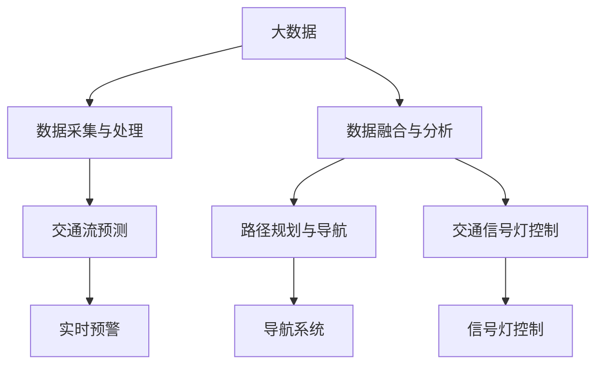

                 

## 1. 背景介绍

### 1.1 问题由来

随着城市化进程的加速和机动车数量的不断增加，全球范围内的交通问题愈发突出。交通拥堵、事故频发、环境污染等问题已经成为影响城市居民生活质量和经济发展的重要因素。为了应对这些挑战，传统城市交通管理模式已经难以满足需求，亟需引入更智能、高效的技术手段。

大数据技术和大数据驱动的智能交通系统的兴起，为解决这些问题提供了新的思路。通过实时收集和分析交通数据，智能交通系统可以实现对交通流量的精准预测、最优路径的动态规划、交通信号灯的智能控制等，极大地提升了交通效率和安全性。

### 1.2 问题核心关键点

大数据在智能交通中的应用，主要涉及以下几个核心关键点：

- **数据采集与处理**：交通数据来自各种传感器、摄像头、车辆车载设备等，数据量大且来源多样。如何高效采集、存储和处理这些数据，是智能交通系统成功的关键。
- **数据融合与分析**：将各类交通数据融合，提取有价值的信息，实现对交通态势的全面了解和精确分析。
- **模型构建与优化**：构建并优化预测、规划和控制模型，提高系统决策的科学性和可靠性。
- **系统集成与协同**：将各类智能交通系统子系统集成，实现信息共享与协同工作，提升整体系统的效能。
- **人机交互与用户体验**：通过可视化、人机交互等方式，提升用户体验，使系统更具可操作性和便捷性。

### 1.3 问题研究意义

研究和应用大数据在智能交通中的应用，对于缓解城市交通问题，提升城市管理水平，具有重要意义：

- **提升交通效率**：通过实时数据分析，智能交通系统可以实现交通流量的精确控制，减少拥堵，提升道路利用率。
- **降低事故率**：通过智能信号灯控制和路径规划，减少车辆间的冲突，降低交通事故发生率。
- **改善环境质量**：通过优化交通流量和行驶路径，减少车辆尾气排放，改善城市空气质量。
- **推动智慧城市建设**：大数据驱动的智能交通系统是智慧城市的重要组成部分，有助于提升城市管理的智能化水平。
- **促进经济发展**：通过智能交通优化物流、运输效率，促进城市经济繁荣。

## 2. 核心概念与联系

### 2.1 核心概念概述

为更好地理解大数据在智能交通中的应用，本节将介绍几个密切相关的核心概念：

- **大数据**：指具有体量大、种类多、速度快、价值密度低等特点的数据集合。在智能交通中，大数据主要来源于车辆车载设备、交通摄像头、传感器等。
- **智能交通系统**：利用计算机、通信、控制等技术，对道路交通进行实时监测、分析和控制，实现交通管理的智能化。
- **交通流预测**：通过数据分析和机器学习技术，对交通流进行预测，提前预警拥堵、事故等事件，为交通管理提供决策支持。
- **路径规划与导航**：根据实时交通信息，为车辆提供最优行驶路径和导航信息，提高通行效率。
- **交通信号灯控制**：通过对交通信号灯进行动态控制，优化信号灯周期，减少交叉口拥堵，提高道路通行能力。

### 2.2 概念间的关系

这些核心概念之间的逻辑关系可以通过以下Mermaid流程图来展示：



这个流程图展示了大数据在智能交通系统中的主要应用场景，包括数据采集与处理、数据融合与分析、交通流预测、路径规划与导航、交通信号灯控制等关键环节。

## 3. 核心算法原理 & 具体操作步骤

### 3.1 算法原理概述

大数据在智能交通中的应用，主要基于数据驱动的机器学习和智能优化算法，实现对交通流的预测、路径规划和信号控制。其核心算法原理包括：

- **数据驱动的机器学习**：通过大数据分析和机器学习算法，构建交通流预测模型、路径规划模型和信号灯控制模型。
- **智能优化算法**：通过优化算法，实现对模型参数的精确调整，确保模型预测和决策的准确性和高效性。

### 3.2 算法步骤详解

大数据在智能交通系统中的应用一般包括以下几个关键步骤：

1. **数据采集与处理**：
   - 收集各类交通数据，包括车辆位置、速度、加速度、方向等。
   - 对数据进行预处理，包括去噪、清洗、归一化等。

2. **数据融合与分析**：
   - 将不同来源的数据进行融合，形成全面的交通数据视图。
   - 通过数据分析和机器学习算法，提取交通特征和规律，实现交通态势的全面理解。

3. **模型构建与优化**：
   - 根据任务需求，选择合适的模型框架，如深度神经网络、支持向量机、随机森林等。
   - 对模型进行训练和调优，确保模型能够高效、准确地处理交通数据。

4. **系统集成与协同**：
   - 将各类智能交通子系统集成，实现信息共享和协同工作，提升整体系统的效能。
   - 引入物联网(IoT)技术，实现对道路、车辆、信号灯等交通设施的全面感知和控制。

5. **人机交互与用户体验**：
   - 通过可视化界面和智能应用，提升用户对交通管理的理解和操作。
   - 结合语音识别、自然语言处理等技术，实现人机自然交互。

### 3.3 算法优缺点

大数据在智能交通中的应用，具有以下优点：

- **决策科学性**：基于数据驱动的模型，能够科学、准确地预测交通态势，提高交通管理的决策水平。
- **实时性**：通过实时数据采集和分析，实现对交通流的动态调整，提高交通系统的响应速度。
- **高效性**：利用大数据和智能算法，优化交通信号灯控制和路径规划，减少拥堵和事故。

但同时也存在一些缺点：

- **数据质量问题**：数据采集、传输和处理过程中可能存在噪音、缺失等质量问题，影响系统决策的准确性。
- **模型复杂度**：大规模数据和复杂模型可能导致训练时间长、资源消耗大。
- **隐私与安全问题**：交通数据的收集和使用可能涉及用户隐私和数据安全问题，需要严格的法律法规和技术保障。

### 3.4 算法应用领域

大数据在智能交通中的应用已经涵盖了多个领域，包括：

- **交通流量预测与分析**：通过对历史和实时数据的分析，预测未来交通流量和拥堵情况，为交通管理提供决策依据。
- **路径规划与导航**：利用大数据和机器学习算法，为车辆提供最优行驶路径和导航信息，提升通行效率。
- **交通信号灯控制**：通过对实时交通数据进行分析，动态调整信号灯周期和配时，减少交叉口拥堵，提高道路通行能力。
- **智能停车管理**：通过智能停车系统，优化停车位分配和管理，减少停车时间和车辆排队。
- **事故预警与应急响应**：通过实时监测和数据分析，提前预警事故和拥堵事件，提供应急响应方案。

## 4. 数学模型和公式 & 详细讲解 & 举例说明

### 4.1 数学模型构建

在智能交通系统中，常用的数学模型包括：

- **交通流预测模型**：基于时间序列分析、机器学习等方法，预测交通流量和速度。
- **路径规划模型**：利用图论和优化算法，计算最优路径。
- **信号灯控制模型**：基于交通流分析和优化算法，调整信号灯周期和配时。

以下以交通流预测模型为例，详细讲解其数学模型构建和应用。

假设交通流数据可以表示为一个时间序列 $x_t = (x_1, x_2, ..., x_T)$，其中 $x_t$ 表示在第 $t$ 时刻的交通流量。定义预测模型为 $x_{t+1} = f(x_t, w)$，其中 $w$ 为模型参数。

### 4.2 公式推导过程

根据上述模型定义，有：

$$
x_{t+1} = f(x_t, w)
$$

假设 $f(x_t, w)$ 为线性回归模型，则有：

$$
x_{t+1} = \alpha x_t + \beta + \epsilon_t
$$

其中 $\alpha$ 为回归系数，$\beta$ 为截距，$\epsilon_t$ 为误差项。

通过最小二乘法，求解 $\alpha$ 和 $\beta$：

$$
\alpha = \frac{\sum_{t=1}^{T} (x_t - \beta) x_{t+1}}{\sum_{t=1}^{T} (x_t - \beta)^2}
$$

$$
\beta = \frac{1}{T} \sum_{t=1}^{T} x_t - \alpha \sum_{t=1}^{T} x_t
$$

在实际应用中，通过多次迭代求解，得到最优的回归系数 $\alpha$ 和截距 $\beta$，从而实现对未来交通流量的预测。

### 4.3 案例分析与讲解

假设某城市主要干道的交通流量数据如下表所示：

| 时间 | 交通流量 |
| --- | --- |
| 0 | 1000 |
| 1 | 1200 |
| 2 | 1100 |
| 3 | 1300 |
| 4 | 1500 |

利用上述线性回归模型，可以得到交通流量的预测公式为：

$$
x_{t+1} = 1.1x_t - 100 + \epsilon_t
$$

其中 $\alpha = 1.1$，$\beta = -100$，$\epsilon_t$ 为随机误差。

例如，在 $t=3$ 时，预测未来交通流量为：

$$
x_4 = 1.1x_3 - 100 + \epsilon_4 = 1.1 \times 1300 - 100 + \epsilon_4 = 1300 + \epsilon_4
$$

其中 $\epsilon_4$ 为随机误差。

## 5. 项目实践：代码实例和详细解释说明

### 5.1 开发环境搭建

在进行智能交通系统开发前，我们需要准备好开发环境。以下是使用Python进行PyTorch开发的环境配置流程：

1. 安装Anaconda：从官网下载并安装Anaconda，用于创建独立的Python环境。

2. 创建并激活虚拟环境：
```bash
conda create -n pytorch-env python=3.8 
conda activate pytorch-env
```

3. 安装PyTorch：根据CUDA版本，从官网获取对应的安装命令。例如：
```bash
conda install pytorch torchvision torchaudio cudatoolkit=11.1 -c pytorch -c conda-forge
```

4. 安装TensorFlow：由Google主导开发的开源深度学习框架，生产部署方便，适合大规模工程应用。同样有丰富的预训练语言模型资源。

5. 安装各类工具包：
```bash
pip install numpy pandas scikit-learn matplotlib tqdm jupyter notebook ipython
```

完成上述步骤后，即可在`pytorch-env`环境中开始智能交通系统的开发。

### 5.2 源代码详细实现

下面我们以交通流预测模型为例，给出使用PyTorch和TensorFlow进行线性回归模型开发的代码实现。

首先，定义数据集和模型：

```python
import torch
import torch.nn as nn
import torch.optim as optim
from torch.utils.data import Dataset, DataLoader

class TrafficFlowDataset(Dataset):
    def __init__(self, x, y):
        self.x = x
        self.y = y
        
    def __len__(self):
        return len(self.x)
        
    def __getitem__(self, idx):
        return self.x[idx], self.y[idx]

x = [1000, 1200, 1100, 1300, 1500]
y = [1100, 1300, 1400, 1600, 1700]
dataset = TrafficFlowDataset(x, y)
```

接着，定义线性回归模型：

```python
class LinearRegression(nn.Module):
    def __init__(self, input_dim, output_dim):
        super(LinearRegression, self).__init__()
        self.linear = nn.Linear(input_dim, output_dim)
        
    def forward(self, x):
        return self.linear(x)
```

然后，训练模型：

```python
model = LinearRegression(1, 1)
criterion = nn.MSELoss()
optimizer = optim.SGD(model.parameters(), lr=0.01)

for epoch in range(1000):
    x_tensor = torch.tensor(x, dtype=torch.float).unsqueeze(1)
    y_tensor = torch.tensor(y, dtype=torch.float)
    optimizer.zero_grad()
    output = model(x_tensor)
    loss = criterion(output, y_tensor)
    loss.backward()
    optimizer.step()
    print(f"Epoch {epoch+1}, loss: {loss.item()}")
```

运行上述代码，即可得到训练后的线性回归模型，用于预测未来交通流量。

### 5.3 代码解读与分析

让我们再详细解读一下关键代码的实现细节：

**TrafficFlowDataset类**：
- `__init__`方法：初始化训练集的数据和标签。
- `__len__`方法：返回数据集的大小。
- `__getitem__`方法：返回单个数据样本。

**LinearRegression类**：
- `__init__`方法：定义模型结构，包括线性层。
- `forward`方法：定义前向传播计算。

**训练函数**：
- 定义模型、损失函数和优化器。
- 使用小批量梯度下降法进行模型训练。
- 每次迭代输出当前损失值，以供监控和调试。

以上代码展示了使用PyTorch进行线性回归模型训练的基本流程。通过不断迭代优化模型参数，我们可以得到一个能够准确预测未来交通流量的模型。

### 5.4 运行结果展示

假设我们训练后的线性回归模型为：

$$
x_{t+1} = 1.1x_t - 100 + \epsilon_t
$$

其中 $\alpha = 1.1$，$\beta = -100$，$\epsilon_t$ 为随机误差。

在 $t=3$ 时，预测未来交通流量为：

$$
x_4 = 1.1x_3 - 100 + \epsilon_4 = 1.1 \times 1300 - 100 + \epsilon_4 = 1300 + \epsilon_4
$$

其中 $\epsilon_4$ 为随机误差。

## 6. 实际应用场景

### 6.1 智能交通流量预测

智能交通流量预测系统可以实时监测交通流数据，利用大数据分析和机器学习技术，对未来交通流量进行预测，为交通管理提供决策依据。例如，在高峰期或事故频发时段，系统可以提前预警，调整信号灯周期和配时，优化交通流。

### 6.2 动态路径规划与导航

智能路径规划系统可以结合实时交通数据，为车辆提供最优行驶路径和导航信息，提高通行效率。例如，当发生道路拥堵或事故时，系统可以动态调整路径，避免拥堵区域，推荐绕行路线。

### 6.3 智能信号灯控制

智能信号灯控制系统可以实时监测交通流量，动态调整信号灯周期和配时，优化交叉口交通流。例如，在车辆流量高峰期，系统可以延长绿灯时间，减少交叉口拥堵。

### 6.4 智能停车管理

智能停车管理系统可以实时监测停车位使用情况，优化停车位分配和管理，减少停车时间和车辆排队。例如，当某个停车位空闲时，系统可以优先推荐给附近车辆，避免长时间等待。

### 6.5 事故预警与应急响应

智能事故预警系统可以实时监测交通数据，提前预警交通事故和拥堵事件，提供应急响应方案。例如，当发生交通事故时，系统可以实时获取事故地点和车辆位置，推荐最优救援路线。

## 7. 工具和资源推荐

### 7.1 学习资源推荐

为了帮助开发者系统掌握智能交通系统的大数据应用理论基础和实践技巧，这里推荐一些优质的学习资源：

1. 《大数据与人工智能：理论与实践》系列博文：由大数据和人工智能专家撰写，深入浅出地介绍了大数据在智能交通系统中的应用。

2. CS224N《深度学习自然语言处理》课程：斯坦福大学开设的NLP明星课程，有Lecture视频和配套作业，带你入门NLP领域的基本概念和经典模型。

3. 《智能交通系统》教材：全面介绍智能交通系统的发展历程和前沿技术，适合系统学习和理论研究。

4. 《Python机器学习》书籍：通过Python实现各种机器学习算法，适合实践和应用。

5. Kaggle大数据竞赛平台：提供各种交通数据集和竞赛任务，适合实践和验证算法效果。

通过对这些资源的学习实践，相信你一定能够快速掌握大数据在智能交通系统中的应用精髓，并用于解决实际的智能交通问题。

### 7.2 开发工具推荐

高效的开发离不开优秀的工具支持。以下是几款用于智能交通系统开发的大数据工具：

1. Hadoop：由Apache基金会开源的分布式计算框架，支持大规模数据处理。

2. Spark：由Apache基金会开源的分布式计算框架，支持快速的数据处理和分析。

3. TensorFlow：由Google主导开发的开源深度学习框架，支持大规模模型的训练和部署。

4. PyTorch：基于Python的开源深度学习框架，灵活动态的计算图，适合快速迭代研究。

5. Jupyter Notebook：支持编写和运行Python代码，适合交互式学习和开发。

合理利用这些工具，可以显著提升智能交通系统的大数据应用开发效率，加快创新迭代的步伐。

### 7.3 相关论文推荐

智能交通系统的大数据应用研究源于学界的持续研究。以下是几篇奠基性的相关论文，推荐阅读：

1. A Survey on Big Data Technologies for Smart Traffic Management（智能交通管理大数据技术综述）：全面介绍大数据在智能交通系统中的应用。

2. Predictive Traffic Simulation and Management Using Artificial Neural Networks（基于神经网络交通预测与管理）：利用神经网络模型预测交通流量，优化交通管理。

3. Real-time Traffic Flow Prediction and Analysis Using Big Data and Machine Learning（基于大数据和机器学习的交通流量实时预测与分析）：介绍大数据在交通流量预测中的应用。

4. Urban Traffic Optimization Using Reinforcement Learning（基于强化学习的城市交通优化）：利用强化学习算法优化交通流，提高通行效率。

5. Smart Traffic Management System Based on IoT and Big Data（基于物联网和大数据的智能交通管理系统）：介绍物联网和大数据在智能交通管理中的应用。

这些论文代表了大数据在智能交通系统中的研究方向和发展脉络。通过学习这些前沿成果，可以帮助研究者把握学科前进方向，激发更多的创新灵感。

除上述资源外，还有一些值得关注的前沿资源，帮助开发者紧跟大数据在智能交通系统中的应用最新进展，例如：

1. arXiv论文预印本：人工智能领域最新研究成果的发布平台，包括大量尚未发表的前沿工作，学习前沿技术的必读资源。

2. 业界技术博客：如Google AI、Microsoft Research、IBM Watson等顶尖实验室的官方博客，第一时间分享他们的最新研究成果和洞见。

3. 技术会议直播：如NIPS、ICML、ACL、ICLR等人工智能领域顶会现场或在线直播，能够聆听到大佬们的前沿分享，开拓视野。

4. GitHub热门项目：在GitHub上Star、Fork数最多的智能交通相关项目，往往代表了该技术领域的发展趋势和最佳实践，值得去学习和贡献。

5. 行业分析报告：各大咨询公司如McKinsey、PwC等针对智能交通行业的分析报告，有助于从商业视角审视技术趋势，把握应用价值。

总之，对于智能交通系统的大数据应用技术的学习和实践，需要开发者保持开放的心态和持续学习的意愿。多关注前沿资讯，多动手实践，多思考总结，必将收获满满的成长收益。

## 8. 总结：未来发展趋势与挑战

### 8.1 总结

本文对大数据在智能交通中的应用进行了全面系统的介绍。首先阐述了智能交通系统的发展背景和意义，明确了大数据在大交通管理中的关键作用。其次，从原理到实践，详细讲解了大数据驱动的智能交通系统的工作机制和核心算法。最后，通过项目实践和实际应用场景的探讨，展示了大数据在智能交通系统中的广泛应用和巨大潜力。

通过本文的系统梳理，可以看到，大数据在智能交通系统中的应用已经初具规模，未来仍有巨大发展空间。大数据与智能交通的深度融合，必将在交通流量预测、路径规划、信号控制等领域带来革命性变革，显著提升交通管理效率和水平。

### 8.2 未来发展趋势

展望未来，智能交通系统的大数据应用将呈现以下几个发展趋势：

1. **数据融合与分析技术升级**：未来将利用更多数据源，如卫星遥感、社交媒体等，实现更全面、更精细的交通数据融合和分析。
2. **实时计算与处理能力提升**：通过云平台和大规模计算集群，实现更快速、更高效的数据实时处理和分析。
3. **多模态数据融合**：结合交通流量数据、传感器数据、车辆数据等，实现多模态数据的融合与分析。
4. **边缘计算与物联网**：通过边缘计算和物联网技术，实现更快速、更实时的交通数据采集和分析。
5. **人工智能与大数据深度融合**：利用深度学习、强化学习等技术，进一步提升交通系统的智能决策能力。

以上趋势凸显了大数据在智能交通系统中的广阔前景。这些方向的探索发展，必将进一步提升智能交通系统的性能和应用范围，为城市交通管理带来更深远的影响。

### 8.3 面临的挑战

尽管大数据在智能交通中的应用已经取得了瞩目成就，但在迈向更加智能化、普适化应用的过程中，仍面临诸多挑战：

1. **数据质量与隐私问题**：交通数据的采集、传输和处理过程中可能存在噪音、缺失等质量问题，同时涉及用户隐私和数据安全问题，需要严格的法律法规和技术保障。
2. **模型复杂度与训练资源**：大规模数据和复杂模型可能导致训练时间长、资源消耗大。
3. **实时性与稳定性的平衡**：实时数据处理和分析需要高性能计算资源，同时保证系统稳定性和鲁棒性。
4. **跨领域融合与协作**：智能交通系统涉及多个领域，包括交通管理、物流、环境等，需要多领域融合与协作。

正视这些挑战，积极应对并寻求突破，将是大数据在智能交通系统中走向成熟的重要途径。相信随着学界和产业界的共同努力，这些挑战终将一一被克服，大数据在智能交通系统中的应用必将在未来大放异彩。

### 8.4 未来突破

面对大数据在智能交通系统应用中面临的挑战，未来的研究需要在以下几个方面寻求新的突破：

1. **数据质量与隐私保护**：引入更多数据清洗和质量控制技术，确保数据准确性和完整性。同时，制定更严格的数据隐私保护政策，确保用户隐私安全。
2. **模型高效与实时处理**：开发高效、轻量级模型，减少资源消耗，提高实时处理能力。同时，引入缓存和分布式计算技术，优化数据处理流程。
3. **多领域融合与协作**：建立跨领域的协作机制，促进交通管理、物流、环境等多领域的融合与协作，实现更全面的交通管理。
4. **人机交互与用户体验**：通过可视化界面和智能应用，提升用户对智能交通系统的理解和操作，优化用户体验。

这些研究方向和探索，将有助于推动大数据在智能交通系统中的深度应用，进一步提升交通管理效率和水平。

## 9. 附录：常见问题与解答

**Q1：智能交通系统中的大数据采集和存储需要注意哪些问题？**

A: 在智能交通系统中，大数据采集和存储需要注意以下几个问题：
1. 数据质量：数据采集过程中应避免噪音、缺失等问题，确保数据的准确性和完整性。
2. 数据隐私：交通数据的采集和使用可能涉及用户隐私，需要严格遵守相关法律法规。
3. 数据安全：交通数据需要加密传输和存储，防止数据泄露和篡改。
4. 数据容量：大规模数据存储需要高性能存储设备和冗余备份，保证数据可靠性和可用性。

**Q2：智能交通系统中的数据融合与分析技术有哪些？**

A: 智能交通系统中的数据融合与分析技术包括：
1. 时间序列分析：利用时间序列模型预测未来交通流量和速度。
2. 空间分析：利用地理信息系统(GIS)技术，分析交通数据的空间分布和特征。
3. 图像处理：利用计算机视觉技术，处理交通摄像头采集的视频数据。
4. 传感器融合：将各类传感器数据融合，形成全面的交通数据视图。
5. 机器学习：利用各种机器学习算法，提取交通数据中的模式和规律。

**Q3：智能交通系统中的路径规划与导航技术有哪些？**

A: 智能交通系统中的路径规划与导航技术包括：
1. Dijkstra算法：基于图论的路径规划算法，计算最优路径。
2. A*算法：基于启发式搜索的路径规划算法，优化路径选择。
3. RRT算法：基于随机采样和邻居查询的路径规划算法，适用于动态环境。
4. GPS导航系统：结合交通数据和地图信息，提供路径导航服务。

**Q4：智能交通系统中的信号灯控制技术有哪些？**

A: 智能交通系统中的信号灯控制技术包括：
1. SCOOT算法：基于信号协调控制的信号灯控制算法，实现交叉口交通流的优化。
2. ACTRA算法：基于自动车流跟踪的信号灯控制算法，实现实时调整信号灯周期。
3. Wavelet算法：基于小波变换的信号灯控制算法，优化信号灯配时。


