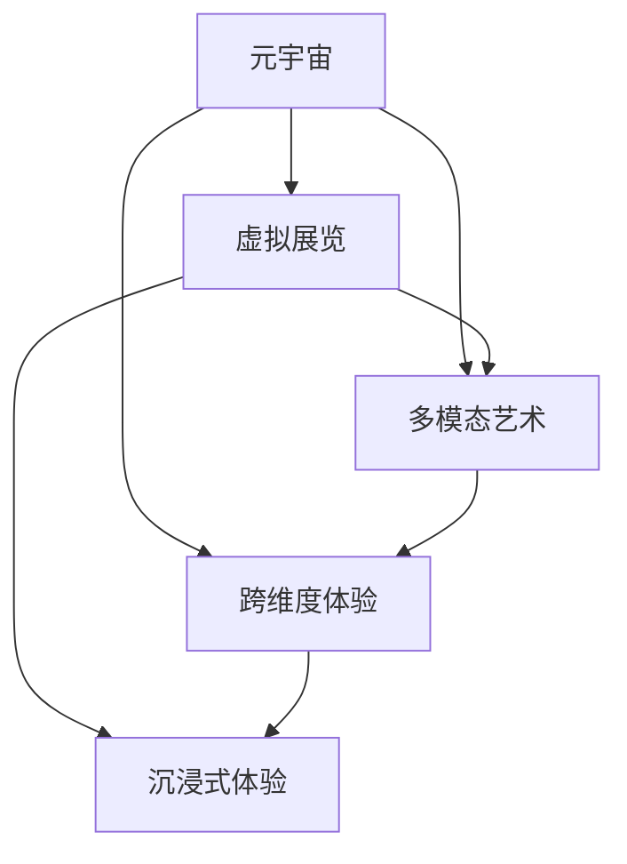

                 

# 元宇宙艺术策展:跨维度艺术展览的新形式

> 关键词：元宇宙, 艺术策展, 虚拟展览, 多模态艺术, 跨维度体验

## 1. 背景介绍

随着数字技术的飞速发展，元宇宙（Metaverse）这一概念逐渐兴起，成为探讨数字未来的一个重要话题。元宇宙被描述为一个高度整合的虚拟世界，它将现实世界的元素数字化并无限扩展，同时赋予用户更强的交互性和沉浸感。这种新形式的虚拟空间有望带来生活、工作、娱乐方式的革命性变革，而艺术作为人类文化的重要组成部分，自然也在元宇宙中扮演着重要角色。

### 1.1 元宇宙的基本概念

元宇宙并非新概念，其原型可追溯至1990年代的虚拟现实(VR)、增强现实(AR)和游戏世界。而近年随着区块链、云计算、AI等技术的融合和普及，元宇宙的概念得以进一步扩展和深化。

- **虚拟环境**：元宇宙提供了一个模拟现实世界或超越现实世界的虚拟环境。
- **经济系统**：通过虚拟货币和区块链技术，元宇宙支持数字资产的创建、交换和保管。
- **社交网络**：用户可以在元宇宙中构建和参与各种社交活动。
- **沉浸式体验**：结合VR、AR和多种感官刺激技术，使用户获得高度沉浸的体验。

### 1.2 元宇宙在艺术领域的应用

艺术与元宇宙的结合，为传统艺术展览带来了革命性的变化。元宇宙艺术展览不仅能够展示传统艺术的数字版本，还能创造全新的艺术形式和体验，突破物理空间限制，实现真正的跨维度艺术展览。

- **虚拟画廊**：通过VR设备进入虚拟画廊，用户可以自由探索艺术作品，甚至与艺术家实时互动。
- **互动艺术**：在元宇宙中，艺术作品可以通过编程实现动态交互，观众的行为可以即时影响艺术效果。
- **跨维展览**：将现实世界与虚拟世界融合，创造全新的展览形式，提升观众体验。

## 2. 核心概念与联系

### 2.1 核心概念概述

为了更好地理解元宇宙艺术策展的原理，本节将介绍几个关键概念：

- **元宇宙**：一个虚拟的、可交互的空间，由各种技术（如VR、AR、区块链等）和软件（如游戏引擎、模拟引擎等）共同构建。
- **虚拟展览**：使用虚拟现实技术创建的艺术展览形式，用户可以通过虚拟空间进行参观和互动。
- **多模态艺术**：结合文字、图片、音频、视频等多种媒介形式，创造出立体化的艺术作品。
- **跨维度体验**：通过虚拟现实和增强现实技术，实现艺术作品在现实和虚拟世界之间的跨维度切换，提供全新的观展体验。

这些概念之间存在紧密的联系，并通过元宇宙技术得以实现。以下是一个简单的Mermaid流程图，展示它们之间的逻辑关系：

这个流程图展示了元宇宙艺术策展的关键环节，包括虚拟展览、多模态艺术和跨维度体验，以及这些环节如何通过沉浸式体验得以实现。

### 2.2 概念间的关系

在元宇宙艺术策展的构架中，各概念之间的联系是通过元宇宙技术实现的。

- **元宇宙与虚拟展览**：虚拟展览是元宇宙的重要组成部分，通过构建虚拟空间和场景，实现艺术作品的数字化展示。
- **元宇宙与多模态艺术**：多模态艺术结合了多种媒介形式，丰富了元宇宙艺术的表现形式，提升了艺术作品的互动性和观赏性。
- **元宇宙与跨维度体验**：跨维度体验通过虚拟现实和增强现实技术，使艺术作品能够在现实与虚拟世界之间无缝切换，为观众带来全新的观展体验。
- **虚拟展览与沉浸式体验**：虚拟展览通过沉浸式体验技术，为观众提供全方位的感官刺激，增强观展的沉浸感和参与感。
- **多模态艺术与沉浸式体验**：多模态艺术通过感官刺激技术，增强观众的感官体验，提升观展的沉浸感和互动性。

这些概念共同构成了元宇宙艺术策展的核心框架，使得艺术作品在元宇宙中得以以全新的形式呈现和体验。

## 3. 核心算法原理 & 具体操作步骤

### 3.1 算法原理概述

元宇宙艺术策展的本质是通过算法和数据，将现实世界的艺术作品数字化并创造全新的虚拟展览体验。核心算法包括但不限于：

- **三维建模与渲染**：将艺术作品转化为三维模型，并使用图形渲染引擎进行渲染，生成虚拟展览场景。
- **增强现实与虚拟现实**：结合现实世界和虚拟世界，实现艺术作品的跨维度展示。
- **人工智能与机器学习**：使用AI和机器学习算法，实现艺术作品的动态交互和个性推荐。
- **多模态数据融合**：将文字、图片、音频、视频等多模态数据进行融合，生成更丰富的艺术作品和展示形式。

### 3.2 算法步骤详解

元宇宙艺术策展的算法步骤大致分为以下几个步骤：

1. **数据准备**：收集艺术作品的高分辨率图片、视频、音频等多模态数据，构建三维模型，生成虚拟展览的初始场景。
2. **场景建模**：将艺术作品转化为三维模型，并进行纹理映射、光照等渲染处理。
3. **增强现实/虚拟现实生成**：根据用户设备类型（VR、AR或传统设备），生成相应的增强现实或虚拟现实场景。
4. **交互设计**：设计艺术作品的互动方式，如点击、拖拽、旋转等，并通过编程实现。
5. **个性化推荐**：使用机器学习算法，根据用户兴趣和历史行为，推荐相关艺术作品和展览路径。
6. **数据优化与导出**：对生成的虚拟展览进行优化，确保流畅度和性能，并导出为支持各种设备的格式。

### 3.3 算法优缺点

元宇宙艺术策展算法具有以下优点：

- **沉浸式体验**：通过虚拟现实和增强现实技术，提供沉浸式的观展体验。
- **多模态展示**：结合文字、图片、音频、视频等多种媒介形式，丰富艺术作品的展示形式。
- **个性化推荐**：通过机器学习算法，实现艺术作品的个性化推荐，提升用户满意度。

同时，也存在以下缺点：

- **技术复杂度高**：需要结合多种技术（如三维建模、图形渲染、人工智能等），实现虚拟展览。
- **成本高**：高质量的虚拟展览需要大量时间和资源，特别是初期投入。
- **设备依赖**：用户需要VR或AR设备才能体验完整的虚拟展览。
- **交互体验不一**：不同设备的用户体验可能存在差异。

### 3.4 算法应用领域

元宇宙艺术策展的算法已经在多个领域得到了广泛应用，例如：

- **博物馆与画廊**：创建虚拟画廊和博物馆，展示经典艺术作品和历史文物。
- **艺术教育**：利用虚拟展览，进行艺术教育、虚拟课堂和远程教学。
- **虚拟演唱会**：举办虚拟音乐会、艺术展览，吸引观众参与和互动。
- **数字艺术品**：创作和展示数字艺术品，包括交互式艺术和动态艺术。

## 4. 数学模型和公式 & 详细讲解 & 举例说明

### 4.1 数学模型构建

为了量化元宇宙艺术策展的各个环节，我们引入以下数学模型：

- **三维模型坐标转换**：设艺术作品的三维模型坐标为 $\mathbf{P}=[x,y,z]$，虚拟展览的坐标系为 $\mathbf{C}=[X,Y,Z]$，则坐标转换公式为：
  $$
  \mathbf{P} = \mathbf{C} \cdot \mathbf{M}
  $$
  其中 $\mathbf{M}$ 为坐标转换矩阵。

- **光照明模型**：设光源坐标为 $\mathbf{L}=[x_L,y_L,z_L]$，光源强度为 $I$，则艺术作品表面点 $\mathbf{S}=[x_S,y_S,z_S]$ 的照明强度 $I_S$ 为：
  $$
  I_S = I \cdot \mathbf{R} \cdot \mathbf{N} \cdot f(\mathbf{L},\mathbf{S})
  $$
  其中 $\mathbf{R}$ 为反射系数，$\mathbf{N}$ 为法向量，$f(\mathbf{L},\mathbf{S})$ 为光照计算函数。

- **用户交互模型**：设用户的行为编码为 $\mathbf{B}$，艺术作品的互动函数为 $F$，则用户的行为对艺术作品的影响 $\mathbf{I}$ 为：
  $$
  \mathbf{I} = F(\mathbf{B}, \mathbf{P})
  $$

### 4.2 公式推导过程

以下以光照明模型为例，进行详细推导：

设光源坐标为 $\mathbf{L}=[x_L,y_L,z_L]$，光源强度为 $I$。艺术作品表面点 $\mathbf{S}=[x_S,y_S,z_S]$ 的照明强度 $I_S$ 可由以下公式计算：
$$
I_S = I \cdot \mathbf{R} \cdot \mathbf{N} \cdot f(\mathbf{L},\mathbf{S})
$$
其中 $\mathbf{R}$ 为反射系数，$\mathbf{N}$ 为法向量，$f(\mathbf{L},\mathbf{S})$ 为光照计算函数。

具体推导如下：

1. **反射系数计算**：假设光源方向向量为 $\mathbf{D}=\frac{\mathbf{L}-\mathbf{S}}{|\mathbf{L}-\mathbf{S}|}$，则反射系数 $\mathbf{R}$ 为：
   $$
   \mathbf{R} = \frac{\mathbf{D} \cdot \mathbf{N}}{\mathbf{D} \cdot \mathbf{N}} = \mathbf{D} \cdot \mathbf{N}
   $$

2. **法向量计算**：设 $\mathbf{T}$ 为光线与艺术作品表面点 $\mathbf{S}$ 的切向量，$\mathbf{B}$ 为切向量与法向量 $\mathbf{N}$ 的叉积，则法向量 $\mathbf{N}$ 为：
   $$
   \mathbf{N} = \frac{\mathbf{T} \times \mathbf{B}}{|\mathbf{T} \times \mathbf{B}|}
   $$

3. **光照计算函数**：设 $\mathbf{S}$ 与光源 $\mathbf{L}$ 的距离为 $d$，则 $f(\mathbf{L},\mathbf{S})$ 可表示为：
   $$
   f(\mathbf{L},\mathbf{S}) = \frac{1}{\pi} \cdot \frac{1}{d^2}
   $$

### 4.3 案例分析与讲解

以下以虚拟画廊为例，进行详细分析：

1. **三维建模**：使用三维建模软件，如Blender、Maya等，创建艺术作品的三维模型。
2. **光照渲染**：将三维模型导入图形渲染引擎，如Unity、Unreal Engine等，进行光照渲染。
3. **增强现实/虚拟现实生成**：根据用户设备类型，使用AR或VR技术生成虚拟展览场景。
4. **交互设计**：使用编程工具，如C#、Python等，设计艺术作品的互动方式。
5. **个性化推荐**：使用机器学习算法，如协同过滤、深度学习等，根据用户行为推荐相关艺术作品。

## 5. 项目实践：代码实例和详细解释说明

### 5.1 开发环境搭建

为了进行元宇宙艺术策展的开发，需要以下开发环境：

1. **编程语言**：Python、C#等，用于编写算法和交互逻辑。
2. **图形渲染引擎**：Unity、Unreal Engine等，用于三维模型渲染和虚拟场景构建。
3. **增强现实与虚拟现实工具**：ARKit、ARCore、OpenXR等，用于开发AR和VR应用。
4. **数据处理工具**：Pandas、NumPy等，用于数据处理和分析。
5. **机器学习框架**：TensorFlow、PyTorch等，用于实现个性化推荐等算法。

### 5.2 源代码详细实现

以下是一个使用Unity和C#实现虚拟画廊的代码示例：

1. **三维模型导入**：使用Unity的ModelLoader工具，导入艺术作品的三维模型文件。
2. **光照渲染**：在Unity的Shader中编写光照计算函数，并应用于模型材质。
3. **虚拟场景构建**：在Unity的Scene中布置虚拟画廊的布局，添加灯光、背景等元素。
4. **用户交互设计**：使用Unity的事件系统，编写用户交互逻辑，如点击、拖拽等。
5. **个性化推荐**：使用TensorFlow等机器学习框架，实现基于用户行为的个性化推荐算法。

### 5.3 代码解读与分析

在Unity和C#中，元宇宙艺术策展的代码实现大致分为以下几个部分：

1. **三维模型加载**：使用Unity的ModelLoader工具，加载艺术作品的三维模型文件，并应用于场景中的特定位置。
2. **光照渲染**：在Unity的Shader中编写光照计算函数，并应用于模型材质，使模型具有逼真的光照效果。
3. **虚拟场景布局**：在Unity的Scene中布置虚拟画廊的布局，添加灯光、背景等元素，使虚拟展览具有逼真的环境效果。
4. **用户交互逻辑**：使用Unity的事件系统，编写用户交互逻辑，如点击、拖拽等，使观众能够自由探索艺术作品。
5. **个性化推荐算法**：使用TensorFlow等机器学习框架，实现基于用户行为的个性化推荐算法，推荐相关艺术作品和展览路径。

### 5.4 运行结果展示

假设我们在Unity中完成了一个虚拟画廊的开发，最终的运行结果如下：

1. **三维模型展示**：用户可以在虚拟空间中自由探索艺术作品，观察其细节和纹理。
2. **光照渲染效果**：艺术作品的光照效果逼真，用户可以感受到不同光线条件下的变化。
3. **虚拟场景布局**：虚拟画廊的布局合理，用户可以在其中自由移动，探索不同区域的艺术作品。
4. **用户交互体验**：用户可以点击、拖拽等，与艺术作品进行互动，获取更多信息。
5. **个性化推荐**：根据用户的浏览和交互行为，系统能够推荐相关艺术作品，提升用户体验。

## 6. 实际应用场景

### 6.1 博物馆与画廊

虚拟画廊和博物馆已成为元宇宙艺术展览的重要形式，为传统艺术展览提供了全新的展示方式。

- **虚拟展览馆**：通过虚拟现实技术，创建艺术展览馆，展示经典艺术作品和历史文物。
- **数字文物库**：利用增强现实技术，让用户通过手机或AR眼镜，在现实世界中看到虚拟展品。
- **远程参观**：观众可以通过VR设备进入虚拟画廊，进行沉浸式参观，提升艺术体验。

### 6.2 艺术教育

元宇宙艺术策展在艺术教育中也有广泛应用，具体如下：

- **虚拟课堂**：利用虚拟展览，进行远程教学和互动，提升学生的学习兴趣。
- **艺术创作**：学生可以使用虚拟现实技术，进行虚拟艺术创作和展示，增强创作体验。
- **艺术评价**：利用机器学习算法，对学生作品进行自动评分和反馈，提升教学效果。

### 6.3 虚拟演唱会

虚拟演唱会是元宇宙艺术策展的重要应用场景之一，具体如下：

- **虚拟音乐会**：艺术家通过VR技术，在虚拟空间中进行音乐表演，观众可以实时观看和互动。
- **互动体验**：观众可以通过增强现实技术，与舞台上的艺术家进行互动，提升演出体验。
- **线上票务**：虚拟演唱会可以通过元宇宙平台进行线上票务销售和推广，扩大观众群体。

### 6.4 未来应用展望

随着技术的进步，元宇宙艺术策展的未来应用场景将更加广阔，具体如下：

- **跨界融合**：元宇宙艺术策展将与其他技术（如区块链、物联网等）结合，实现更丰富的应用场景。
- **全场景覆盖**：虚拟展览将覆盖更多领域，如旅游、购物、娱乐等，成为日常生活的重要组成部分。
- **高度互动**：元宇宙艺术策展将实现更高程度的互动，如实时反馈、个性化推荐等，提升用户体验。
- **技术革新**：随着AR、VR、AI等技术的进步，元宇宙艺术策展将带来更震撼的视觉和交互体验。

## 7. 工具和资源推荐

### 7.1 学习资源推荐

为了帮助开发者掌握元宇宙艺术策展技术，以下是一些优质的学习资源：

1. **《Unity 3D游戏开发实战》**：介绍Unity的使用方法和虚拟场景开发技巧，适合初学者学习。
2. **《虚拟现实技术基础与实践》**：涵盖虚拟现实技术的各个方面，包括硬件、软件和开发实践，适合深入学习。
3. **《TensorFlow实战》**：介绍TensorFlow的使用方法和机器学习算法的实现，适合机器学习领域的开发者。
4. **《Unity VR开发实战》**：介绍Unity在虚拟现实开发中的应用，适合Unity和VR领域的开发者。
5. **《增强现实技术基础与实践》**：涵盖增强现实技术的各个方面，包括硬件、软件和开发实践，适合AR领域的开发者。

通过这些资源的学习实践，相信你一定能够快速掌握元宇宙艺术策展的核心技术，并用于解决实际的开发问题。

### 7.2 开发工具推荐

在元宇宙艺术策展的开发过程中，以下工具将起到重要作用：

1. **Unity**：全球领先的虚拟现实和增强现实开发平台，具有强大的3D渲染和交互功能。
2. **Unreal Engine**：另一款流行的游戏引擎，支持高精度3D渲染和虚拟现实技术。
3. **ARKit**：苹果提供的增强现实开发框架，支持iOS设备的AR应用开发。
4. **ARCore**：谷歌提供的增强现实开发框架，支持Android设备的AR应用开发。
5. **TensorFlow**：谷歌提供的机器学习框架，支持深度学习和个性化推荐算法。

这些工具能够显著提高开发效率，缩短开发周期，实现高质量的元宇宙艺术策展应用。

### 7.3 相关论文推荐

元宇宙艺术策展技术的发展离不开学界的持续研究。以下是几篇奠基性的相关论文，推荐阅读：

1. **《虚拟现实中的三维建模与渲染》**：介绍三维建模和渲染技术的原理和应用，适合初学者学习。
2. **《增强现实技术综述》**：涵盖增强现实技术的各个方面，包括硬件、软件和开发实践，适合深入学习。
3. **《机器学习在虚拟展览中的应用》**：介绍机器学习算法在虚拟展览中的应用，适合算法领域的开发者。
4. **《跨维度艺术展览的实现与挑战》**：介绍跨维度艺术展览的实现方法和面临的挑战，适合元宇宙领域的开发者。
5. **《元宇宙中的个性化推荐算法》**：介绍基于机器学习算法的个性化推荐方法，适合推荐系统领域的开发者。

这些论文代表了大规模语言模型微调技术的发展脉络。通过学习这些前沿成果，可以帮助研究者把握学科前进方向，激发更多的创新灵感。

## 8. 总结：未来发展趋势与挑战

### 8.1 研究成果总结

本文对元宇宙艺术策展技术进行了全面系统的介绍。首先阐述了元宇宙艺术策展的基本概念和应用场景，明确了其在提升艺术展示效果、增强用户互动体验等方面的独特价值。其次，从原理到实践，详细讲解了元宇宙艺术策展的数学模型和算法步骤，给出了具体实现的代码示例。同时，本文还广泛探讨了元宇宙艺术策展在博物馆、艺术教育、虚拟演唱会等多个领域的应用前景，展示了其广阔的发展潜力。此外，本文精选了元宇宙艺术策展的技术资源，力求为读者提供全方位的技术指引。

通过本文的系统梳理，可以看到，元宇宙艺术策展技术正在成为艺术展览的重要范式，极大地拓展了艺术作品的展示形式，提升了观众的体验。未来，伴随技术的不断演进，元宇宙艺术策展必将在艺术展览领域发挥更大的作用，为人类文化的多样性和丰富性增添新的光彩。

### 8.2 未来发展趋势

展望未来，元宇宙艺术策展技术将呈现以下几个发展趋势：

1. **技术融合**：元宇宙艺术策展将与其他技术（如区块链、物联网等）结合，实现更丰富的应用场景。
2. **场景覆盖**：虚拟展览将覆盖更多领域，如旅游、购物、娱乐等，成为日常生活的重要组成部分。
3. **高度互动**：元宇宙艺术策展将实现更高程度的互动，如实时反馈、个性化推荐等，提升用户体验。
4. **技术革新**：随着AR、VR、AI等技术的进步，元宇宙艺术策展将带来更震撼的视觉和交互体验。
5. **数据驱动**：利用大数据和机器学习算法，实现更精准的用户推荐和个性化展示。

### 8.3 面临的挑战

尽管元宇宙艺术策展技术已经取得了瞩目成就，但在迈向更加智能化、普适化应用的过程中，它仍面临着诸多挑战：

1. **技术瓶颈**：高质量的虚拟展览需要大量时间和资源，特别是初期投入。
2. **设备依赖**：用户需要VR或AR设备才能体验完整的虚拟展览。
3. **交互体验不一**：不同设备的用户体验可能存在差异。
4. **版权问题**：虚拟展览中涉及的版权和知识产权问题需要妥善处理。
5. **数据安全**：虚拟展览中涉及的隐私和数据安全问题需要引起重视。

### 8.4 研究展望

面对元宇宙艺术策展面临的挑战，未来的研究需要在以下几个方面寻求新的突破：

1. **资源优化**：开发更加轻量级、高效的虚拟展览，减少资源消耗。
2. **设备兼容性**：优化不同设备的用户体验，提升交互体验一致性。
3. **版权保护**：探索虚拟展览中版权和知识产权的保障措施，确保内容的合法使用。
4. **数据安全**：采用先进的数据保护技术，确保用户数据的安全和隐私。
5. **跨平台支持**：实现跨平台支持，使虚拟展览能在各种设备上流畅运行。

总之，元宇宙艺术策展技术还需要在多个维度进行深入研究，只有在技术、经济、伦理等多个方面协同发力，才能真正实现艺术展览的数字化转型，开创人类艺术的新纪元。

## 9. 附录：常见问题与解答

**Q1：元宇宙艺术策展是否适用于所有艺术形式？**

A: 元宇宙艺术策展适用于大多数艺术形式，特别是那些容易数字化的艺术作品，如绘画、雕塑等。但对于音乐、舞蹈等无法轻易数字化的艺术形式，可能需要结合特定的技术手段进行处理。

**Q2：如何选择合适的虚拟现实设备？**

A: 选择合适的虚拟现实设备需要考虑设备类型（VR头显、AR眼镜等）、分辨率、刷新率、响应速度等因素。一般来说，VR头显提供更高的沉浸感和交互性，适合长期沉浸式体验；而AR眼镜则更加便携，适合短期交互式体验。

**Q3：如何优化虚拟展览的性能？**

A: 优化虚拟展览的性能可以从以下几个方面入手：
1. 压缩三维模型和纹理，减少资源占用。
2. 使用高效的渲染算法，如基于光线追踪的渲染技术。
3. 优化交互逻辑，减少不必要的计算。
4. 采用云渲染技术，分散计算负担。

**Q4：如何实现个性化推荐？**

A: 实现个性化推荐需要以下步骤：
1. 收集用户行为数据，如浏览、点击、互动等。
2. 使用机器学习算法，如协同过滤、深度学习等，对用户行为进行建模。
3. 根据建模结果，推荐相关艺术作品和展览路径。
4. 实时更新推荐模型，根据用户反馈进行调整。

**Q5：元宇宙艺术策展的未来发展方向是什么？**

A: 元宇宙艺术策展的未来发展方向包括：
1. 结合区块链技术，实现数字艺术品的所有权和交易。
2. 引入虚拟现实与现实世界的无缝切换，提升用户体验。
3. 与其他技术结合，如物联网、大数据等，实现更丰富的应用场景。
4. 利用人工智能技术，实现艺术品的智能生成和动态展示。

总之，元宇宙艺术策展技术将在艺术展览、虚拟演唱会、教育培训等诸多领域发挥重要作用，推动艺术文化与数字技术的深度融合。通过不断的技术创新和应用实践，相信元宇宙艺术策展必将成为未来艺术展示的重要形式，为人类文化的多样性和丰富性增添新的光彩。

---

作者：禅与计算机程序设计艺术 / Zen and the Art of Computer Programming

