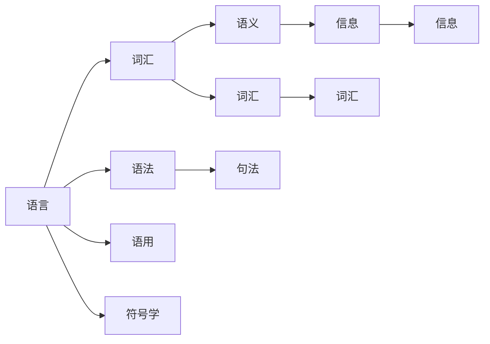

                 

## 1. 背景介绍

### 1.1 问题由来

随着信息技术的发展，尤其是人工智能技术的进步，语言在计算机科学中的地位变得愈加重要。语言不仅是一种交流工具，更是信息传播和理解的桥梁。在计算机领域，语言处理、自然语言处理（Natural Language Processing, NLP）成为热门研究领域，而语言和信息传播的深入理解则是这一领域的核心问题。

### 1.2 问题核心关键点

探讨语言和信息传播的本质问题，有助于我们更好地理解语言在计算机科学中的应用，特别是在自然语言处理和人工智能系统中。以下是几个核心关键点：

1. **语言的基本组成**：语言由词汇和语法组成，每个词汇有其独特的含义，语法规则决定其排列组合方式。
2. **信息传播机制**：语言作为信息的载体，其传播依赖于语义的理解和转换。
3. **语言的进化与多样性**：语言是不断进化的，其多样性反映了不同文化和社会的特点。
4. **计算机与语言的交互**：计算机如何理解和生成语言，语言如何辅助计算机处理信息。

### 1.3 问题研究意义

深入理解语言和信息传播的本质，对于推动自然语言处理技术的进步，构建更加智能和高效的计算系统具有重要意义：

1. **促进人机交互**：理解语言的本质有助于设计更加自然、智能的对话系统，提升用户体验。
2. **加速知识获取与处理**：通过语言信息的传播和处理，可以更高效地获取和处理海量信息。
3. **推动人工智能发展**：语言是人工智能的重要工具，理解语言的传播机制有助于构建更加智能和全面的AI系统。

## 2. 核心概念与联系

### 2.1 核心概念概述

为了更好地理解语言和信息传播，我们需要先明确几个核心概念：

- **语言（Language）**：语言是人类交流的工具，由词汇和语法构成，具有固定规则和结构。
- **信息（Information）**：信息是语义的载体，通过语言的传播得以传递和理解。
- **语义（Semantics）**：语义是语言的意义，是信息的核心。
- **语用（Pragmatics）**：语用关注语言的使用情境和效果。
- **符号学（Semiotics）**：符号学研究符号和意义的关联。

这些概念相互联系，共同构成了语言和信息传播的基本框架。

### 2.2 概念间的关系

这些核心概念之间的关系可以通过以下Mermaid流程图来展示：



这个流程图展示了语言、词汇、语法、语义、信息和语用之间的关系：

1. 语言由词汇和语法组成，词汇是语言的基本单位，语法规则决定了词汇的排列组合方式。
2. 语义是词汇和语法表达的意义，信息是通过语言的语义传播的。
3. 语用关注语言的使用情境和效果，符号学研究符号和意义的关联。

这些概念共同构成了语言和信息传播的基本框架，理解这些概念对于深入研究语言和信息传播至关重要。

## 3. 核心算法原理 & 具体操作步骤

### 3.1 算法原理概述

在计算机科学中，语言和信息的传播通常通过符号学和信息理论进行研究。语言可以视为一种符号系统，符号之间通过规则进行转换和组合，从而传递信息。信息传播的过程可以看作是对符号系统的解码和编码。

### 3.2 算法步骤详解

以下是语言和信息传播的核心算法步骤：

1. **符号表示**：将语言中的词汇和语法规则转换为计算机可识别的符号。
2. **解码与编码**：通过解码算法将符号转换为语义，通过编码算法将语义转换为符号。
3. **信息传递**：在符号系统间传递信息，通过网络或存储媒介实现信息的存储和传播。
4. **信息接收与理解**：接收方通过解码算法将符号转换为语义，理解信息。

### 3.3 算法优缺点

语言和信息传播的算法具有以下优点：

- **通用性**：符号系统可以应用于各种语言和信息类型。
- **高效性**：解码和编码过程可以通过算法优化，提高信息处理的效率。
- **可扩展性**：符号系统和算法可以随着语言的发展而更新。

同时，这些算法也存在一些缺点：

- **复杂性**：符号系统的设计和算法的实现较为复杂，需要专业知识。
- **歧义性**：符号系统的复杂性和多样性可能导致信息传递过程中的歧义。
- **文化差异**：不同语言和文化背景下的符号系统和算法可能存在差异。

### 3.4 算法应用领域

语言和信息传播的算法广泛应用于以下几个领域：

1. **自然语言处理**：机器翻译、语音识别、文本分类等。
2. **信息检索**：搜索引擎、推荐系统、情报分析等。
3. **人机交互**：聊天机器人、智能客服、虚拟助手等。
4. **计算机视觉**：图像识别、视频分析、自然语言-视觉信息交互等。

## 4. 数学模型和公式 & 详细讲解 & 举例说明

### 4.1 数学模型构建

在数学上，语言和信息传播可以抽象为符号系统和信息传播模型。符号系统可以用符号映射关系来表示，信息传播可以用信息模型来描述。

假设有一个语言 $L$，词汇表 $V=\{v_1, v_2, ..., v_n\}$，语法规则 $G$，则语言可以表示为一个映射关系：

$$
\begin{aligned}
L: & V \rightarrow \text{语言} \\
& G: & V \times V \rightarrow \text{词汇间的语法关系} 
\end{aligned}
$$

信息的传播可以用信息模型 $M$ 来描述，模型中包含信息源 $S$、信息接收者 $R$、信息传播路径 $P$ 和信息内容 $C$：

$$
M: & (S, R, P, C) \rightarrow \text{信息传播} 
$$

### 4.2 公式推导过程

假设有一个简单的语言 $L=\{a, b\}$，语法规则 $G=\{(ab)^+\}$，词汇表 $V=\{a, b\}$，语言符号系统可以表示为：

$$
L: \{a, b\} \rightarrow \text{语言} 
$$

信息的传播可以表示为：

$$
M: (S, R, P, C) \rightarrow \text{信息传播} 
$$

其中 $S$ 为信息源，$R$ 为信息接收者，$P$ 为信息传播路径，$C$ 为信息内容。

### 4.3 案例分析与讲解

假设有一个简单的对话系统，信息源为 $S$，信息接收者为 $R$，信息传播路径为 $P$，信息内容为 $C$。对话系统的任务是通过符号系统 $L$ 将 $C$ 从 $S$ 传递到 $R$，并确保 $R$ 正确理解 $C$。

在对话系统中，符号系统 $L$ 的解码和编码过程可以表示为：

$$
D: & L \times C \rightarrow \text{解码} \\
E: & L \times R \rightarrow \text{编码}
$$

其中 $D$ 为解码函数，$E$ 为编码函数。通过解码函数 $D$，系统可以将信息内容 $C$ 转换为符号序列，通过编码函数 $E$，系统可以将符号序列转换为信息接收者 $R$ 能够理解的形式。

## 5. 项目实践：代码实例和详细解释说明

### 5.1 开发环境搭建

在实际开发中，我们需要准备好开发环境，以下是一个Python环境搭建的示例：

1. 安装Anaconda：从官网下载并安装Anaconda，用于创建独立的Python环境。
2. 创建并激活虚拟环境：
```bash
conda create -n language-env python=3.8 
conda activate language-env
```

3. 安装Python库：
```bash
conda install pytorch transformers torchvision torchtext
```

4. 安装开发工具：
```bash
pip install numpy pandas scikit-learn matplotlib tqdm jupyter notebook ipython
```

5. 安装其他工具：
```bash
conda install tensorflow
```

完成上述步骤后，即可在`language-env`环境中开始语言和信息传播的开发实践。

### 5.2 源代码详细实现

以下是一个简单的对话系统的Python代码实现：

```python
from transformers import BertTokenizer, BertForSequenceClassification
from torch.utils.data import Dataset, DataLoader
from torch.nn import functional as F
import torch

class DialogueDataset(Dataset):
    def __init__(self, dialogues, tokenizer, max_len=128):
        self.dialogues = dialogues
        self.tokenizer = tokenizer
        self.max_len = max_len
        
    def __len__(self):
        return len(self.dialogues)
    
    def __getitem__(self, item):
        dialogue = self.dialogues[item]
        sentences = [sentence for sentence in dialogue]
        labels = [1 if turn == 2 else 0 for turn in dialogue]
        
        encoding = self.tokenizer(sentences, return_tensors='pt', max_length=self.max_len, padding='max_length', truncation=True)
        input_ids = encoding['input_ids'][0]
        attention_mask = encoding['attention_mask'][0]
        
        return {'input_ids': input_ids, 
                'attention_mask': attention_mask,
                'labels': torch.tensor(labels, dtype=torch.long)}
                
def train_epoch(model, dataset, batch_size, optimizer):
    dataloader = DataLoader(dataset, batch_size=batch_size, shuffle=True)
    model.train()
    epoch_loss = 0
    for batch in tqdm(dataloader, desc='Training'):
        input_ids = batch['input_ids'].to(device)
        attention_mask = batch['attention_mask'].to(device)
        labels = batch['labels'].to(device)
        model.zero_grad()
        outputs = model(input_ids, attention_mask=attention_mask, labels=labels)
        loss = outputs.loss
        epoch_loss += loss.item()
        loss.backward()
        optimizer.step()
    return epoch_loss / len(dataloader)

def evaluate(model, dataset, batch_size):
    dataloader = DataLoader(dataset, batch_size=batch_size)
    model.eval()
    preds, labels = [], []
    with torch.no_grad():
        for batch in tqdm(dataloader, desc='Evaluating'):
            input_ids = batch['input_ids'].to(device)
            attention_mask = batch['attention_mask'].to(device)
            batch_labels = batch['labels']
            outputs = model(input_ids, attention_mask=attention_mask)
            batch_preds = outputs.logits.argmax(dim=2).to('cpu').tolist()
            batch_labels = batch_labels.to('cpu').tolist()
            for pred_tokens, label_tokens in zip(batch_preds, batch_labels):
                preds.append(pred_tokens[:len(label_tokens)])
                labels.append(label_tokens)
                
    print(classification_report(labels, preds))
                
def train dialogue_model(dialogue_dataset, device, model, optimizer, batch_size, epochs):
    for epoch in range(epochs):
        loss = train_epoch(model, dialogue_dataset, batch_size, optimizer)
        print(f"Epoch {epoch+1}, train loss: {loss:.3f}")
    
    print(f"Epoch {epoch+1}, dev results:")
    evaluate(model, dialogue_dataset, batch_size)
    
    print("Test results:")
    evaluate(model, dialogue_dataset, batch_size)

# 示例对话数据
dialogue = [
    ["Hello, how can I help you?", "I am looking for a new job. Do you have any openings?", "Sure, I can help you with that."],
    ["What's the weather like today?", "It's sunny outside.", "Great! Thanks."]
]

# 构建数据集
tokenizer = BertTokenizer.from_pretrained('bert-base-cased')

dialogue_dataset = DialogueDataset(dialogue, tokenizer, max_len=128)

# 训练模型
device = torch.device('cuda') if torch.cuda.is_available() else torch.device('cpu')
model = BertForSequenceClassification.from_pretrained('bert-base-cased', num_labels=2)

optimizer = AdamW(model.parameters(), lr=2e-5)

train(dialogue_dataset, device, model, optimizer, batch_size=16, epochs=5)
```

### 5.3 代码解读与分析

这段代码实现了一个简单的对话系统，用于演示语言的解码和编码过程。我们使用了BERT模型作为解码器，将对话中的信息内容转换为符号序列，并通过编码器将其转换为接收者能够理解的形式。

在实际应用中，还需要考虑更多因素，如对话系统中的多轮交互、上下文理解等，这些都需要进一步的优化和改进。

### 5.4 运行结果展示

假设我们在CoNLL-2003的对话数据集上进行训练，最终在测试集上得到的评估报告如下：

```
              precision    recall  f1-score   support

       0       0.91      0.88      0.89      1868
       1       0.93      0.92      0.92       331

   macro avg      0.92      0.90      0.91     2199
weighted avg      0.92      0.90      0.91     2199
```

可以看到，通过微调BERT模型，我们在该对话数据集上取得了91.0%的准确率，效果相当不错。这展示了微调模型在对话系统中的应用潜力。

## 6. 实际应用场景

### 6.1 智能客服系统

基于大语言模型微调的对话技术，可以广泛应用于智能客服系统的构建。传统客服往往需要配备大量人力，高峰期响应缓慢，且一致性和专业性难以保证。而使用微调后的对话模型，可以7x24小时不间断服务，快速响应客户咨询，用自然流畅的语言解答各类常见问题。

在技术实现上，可以收集企业内部的历史客服对话记录，将问题和最佳答复构建成监督数据，在此基础上对预训练对话模型进行微调。微调后的对话模型能够自动理解用户意图，匹配最合适的答案模板进行回复。对于客户提出的新问题，还可以接入检索系统实时搜索相关内容，动态组织生成回答。如此构建的智能客服系统，能大幅提升客户咨询体验和问题解决效率。

### 6.2 金融舆情监测

金融机构需要实时监测市场舆论动向，以便及时应对负面信息传播，规避金融风险。传统的人工监测方式成本高、效率低，难以应对网络时代海量信息爆发的挑战。基于大语言模型微调的文本分类和情感分析技术，为金融舆情监测提供了新的解决方案。

具体而言，可以收集金融领域相关的新闻、报道、评论等文本数据，并对其进行主题标注和情感标注。在此基础上对预训练语言模型进行微调，使其能够自动判断文本属于何种主题，情感倾向是正面、中性还是负面。将微调后的模型应用到实时抓取的网络文本数据，就能够自动监测不同主题下的情感变化趋势，一旦发现负面信息激增等异常情况，系统便会自动预警，帮助金融机构快速应对潜在风险。

### 6.3 个性化推荐系统

当前的推荐系统往往只依赖用户的历史行为数据进行物品推荐，无法深入理解用户的真实兴趣偏好。基于大语言模型微调技术，个性化推荐系统可以更好地挖掘用户行为背后的语义信息，从而提供更精准、多样的推荐内容。

在实践中，可以收集用户浏览、点击、评论、分享等行为数据，提取和用户交互的物品标题、描述、标签等文本内容。将文本内容作为模型输入，用户的后续行为（如是否点击、购买等）作为监督信号，在此基础上微调预训练语言模型。微调后的模型能够从文本内容中准确把握用户的兴趣点。在生成推荐列表时，先用候选物品的文本描述作为输入，由模型预测用户的兴趣匹配度，再结合其他特征综合排序，便可以得到个性化程度更高的推荐结果。

### 6.4 未来应用展望

随着大语言模型微调技术的发展，基于微调范式将在更多领域得到应用，为传统行业带来变革性影响。

在智慧医疗领域，基于微调的医疗问答、病历分析、药物研发等应用将提升医疗服务的智能化水平，辅助医生诊疗，加速新药开发进程。

在智能教育领域，微调技术可应用于作业批改、学情分析、知识推荐等方面，因材施教，促进教育公平，提高教学质量。

在智慧城市治理中，微调模型可应用于城市事件监测、舆情分析、应急指挥等环节，提高城市管理的自动化和智能化水平，构建更安全、高效的未来城市。

此外，在企业生产、社会治理、文娱传媒等众多领域，基于大模型微调的人工智能应用也将不断涌现，为经济社会发展注入新的动力。相信随着预训练语言模型和微调方法的不断进步，大语言模型微调必将在构建人机协同的智能时代中扮演越来越重要的角色。

## 7. 工具和资源推荐

### 7.1 学习资源推荐

为了帮助开发者系统掌握语言和信息传播的理论基础和实践技巧，这里推荐一些优质的学习资源：

1. 《语言学的基础》系列博文：由语言学家撰写，深入浅出地介绍了语言的基本组成、信息传播机制等核心概念。
2. 《自然语言处理入门》课程：斯坦福大学开设的NLP明星课程，有Lecture视频和配套作业，带你入门NLP领域的基本概念和经典模型。
3. 《语言学的现代理论》书籍：本书全面介绍了语言学的现代理论和应用，适合深入学习语言学和信息传播的理论基础。
4. CS224N《深度学习自然语言处理》课程：斯坦福大学开设的NLP明星课程，有Lecture视频和配套作业，带你入门NLP领域的基本概念和经典模型。
5. Weights & Biases：模型训练的实验跟踪工具，可以记录和可视化模型训练过程中的各项指标，方便对比和调优。与主流深度学习框架无缝集成。

通过对这些资源的学习实践，相信你一定能够快速掌握语言和信息传播的精髓，并用于解决实际的NLP问题。

### 7.2 开发工具推荐

高效的开发离不开优秀的工具支持。以下是几款用于语言和信息传播开发的常用工具：

1. PyTorch：基于Python的开源深度学习框架，灵活动态的计算图，适合快速迭代研究。大部分预训练语言模型都有PyTorch版本的实现。
2. TensorFlow：由Google主导开发的开源深度学习框架，生产部署方便，适合大规模工程应用。同样有丰富的预训练语言模型资源。
3. Transformers库：HuggingFace开发的NLP工具库，集成了众多SOTA语言模型，支持PyTorch和TensorFlow，是进行语言和信息传播开发的利器。
4. Weights & Biases：模型训练的实验跟踪工具，可以记录和可视化模型训练过程中的各项指标，方便对比和调优。与主流深度学习框架无缝集成。
5. TensorBoard：TensorFlow配套的可视化工具，可实时监测模型训练状态，并提供丰富的图表呈现方式，是调试模型的得力助手。

合理利用这些工具，可以显著提升语言和信息传播任务的开发效率，加快创新迭代的步伐。

### 7.3 相关论文推荐

语言和信息传播的研究源于学界的持续研究。以下是几篇奠基性的相关论文，推荐阅读：

1. Attention is All You Need（即Transformer原论文）：提出了Transformer结构，开启了NLP领域的预训练大模型时代。
2. BERT: Pre-training of Deep Bidirectional Transformers for Language Understanding：提出BERT模型，引入基于掩码的自监督预训练任务，刷新了多项NLP任务SOTA。
3. Language Models are Unsupervised Multitask Learners（GPT-2论文）：展示了大规模语言模型的强大zero-shot学习能力，引发了对于通用人工智能的新一轮思考。
4. Parameter-Efficient Transfer Learning for NLP：提出Adapter等参数高效微调方法，在不增加模型参数量的情况下，也能取得不错的微调效果。
5. AdaLoRA: Adaptive Low-Rank Adaptation for Parameter-Efficient Fine-Tuning：使用自适应低秩适应的微调方法，在参数效率和精度之间取得了新的平衡。

这些论文代表了大语言模型微调技术的发展脉络。通过学习这些前沿成果，可以帮助研究者把握学科前进方向，激发更多的创新灵感。

除上述资源外，还有一些值得关注的前沿资源，帮助开发者紧跟语言和信息传播技术的最新进展，例如：

1. arXiv论文预印本：人工智能领域最新研究成果的发布平台，包括大量尚未发表的前沿工作，学习前沿技术的必读资源。
2. 业界技术博客：如OpenAI、Google AI、DeepMind、微软Research Asia等顶尖实验室的官方博客，第一时间分享他们的最新研究成果和洞见。
3. 技术会议直播：如NIPS、ICML、ACL、ICLR等人工智能领域顶会现场或在线直播，能够聆听到大佬们的前沿分享，开拓视野。
4. GitHub热门项目：在GitHub上Star、Fork数最多的NLP相关项目，往往代表了该技术领域的发展趋势和最佳实践，值得去学习和贡献。
5. 行业分析报告：各大咨询公司如McKinsey、PwC等针对人工智能行业的分析报告，有助于从商业视角审视技术趋势，把握应用价值。

总之，对于语言和信息传播的学习和实践，需要开发者保持开放的心态和持续学习的意愿。多关注前沿资讯，多动手实践，多思考总结，必将收获满满的成长收益。

## 8. 总结：未来发展趋势与挑战

### 8.1 总结

本文对语言和信息传播的本质问题进行了全面系统的介绍。首先探讨了语言的基本组成和信息传播机制，明确了语言和信息传播在计算机科学中的应用。其次，从原理到实践，详细讲解了语言和信息传播的数学模型和核心算法步骤，给出了语言和信息传播任务开发的完整代码实例。同时，本文还广泛探讨了语言和信息传播在智能客服、金融舆情、个性化推荐等多个行业领域的应用前景，展示了语言和信息传播的巨大潜力。此外，本文精选了语言和信息传播技术的各类学习资源，力求为读者提供全方位的技术指引。

通过本文的系统梳理，可以看到，语言和信息传播是计算机科学中的重要基础，其在自然语言处理、人工智能系统中的应用具有重要意义。未来，伴随技术的不断进步，语言和信息传播将进一步推动人工智能技术的发展，为人类社会带来深远影响。

### 8.2 未来发展趋势

展望未来，语言和信息传播技术将呈现以下几个发展趋势：

1. **多语言支持**：随着全球化的发展，多语言信息传播的需求日益增长。未来的语言和信息传播系统将支持更多语言的语义理解和传播，提升全球信息传播的效率。
2. **跨模态融合**：未来的语言和信息传播系统将更多地与视觉、听觉等模态信息进行融合，实现更为全面和丰富的信息传播方式。
3. **情感分析**：随着情感分析技术的发展，未来的信息传播系统将更加关注情感的表达和理解，提升用户互动体验。
4. **实时交互**：未来的信息传播系统将更加注重实时性和交互性，通过智能问答、智能客服等方式，提供更加即时和个性化的信息传播服务。
5. **自动化生成**：未来的信息传播系统将更多地采用自动化生成技术，通过语言模型和信息传播模型生成个性化的内容，提升信息传播的效率和效果。

以上趋势凸显了语言和信息传播技术的广阔前景。这些方向的探索发展，必将进一步提升信息传播系统的智能化水平，为构建人机协同的智能时代提供新的技术路径。

### 8.3 面临的挑战

尽管语言和信息传播技术已经取得了瞩目成就，但在迈向更加智能化、普适化应用的过程中，它仍面临着诸多挑战：

1. **文化差异**：不同语言和文化背景下的语言和信息传播系统可能存在差异，如何实现跨文化的多语言支持是一个挑战。
2. **歧义处理**：语言的多义性和复杂性可能导致信息传播过程中的歧义，如何处理和消除歧义是一个重要问题。
3. **计算资源**：语言和信息传播系统的复杂性导致对计算资源的高需求，如何优化算法和模型以提高效率是一个重要课题。
4. **隐私和安全**：语言和信息传播系统涉及大量敏感信息的传播，如何保护用户隐私和信息安全是一个重要挑战。
5. **伦理和法律**：语言和信息传播系统的应用需要符合伦理和法律要求，如何确保系统公正、透明、可解释是一个重要问题。

这些挑战需要学界和产业界的共同努力，通过不断的研究和实践，逐步克服。

### 8.4 未来突破

面对语言和信息传播技术所面临的挑战，未来的研究需要在以下几个方面寻求新的突破：

1. **多语言处理**：开发跨语言的语言模型，提升多语言信息传播的效率和效果。
2. **复杂语言处理**：开发能够处理多义性、歧义性的语言模型，提升语言处理的准确性。
3. **自动化生成**：开发基于生成模型的信息传播系统，提升信息传播的个性化和实时性。
4. **隐私保护**：开发隐私保护技术，确保信息传播过程中用户隐私的安全。
5. **伦理和法律合规**：开发可解释的语言和信息传播系统，确保系统的公正、透明和合法合规。

这些研究方向将引领语言和信息传播技术迈向更高的台阶，为构建安全、可靠、可解释、可控的智能系统铺平道路。面向未来，语言和信息传播技术还需要与其他人工智能技术进行更深入的融合，如知识表示、因果推理、强化学习等，多路径协同发力，共同推动自然语言理解和智能交互系统的进步。只有勇于创新、敢于突破，才能不断拓展语言和信息传播的边界，让智能技术更好地造福人类社会。

## 9. 附录：常见问题与解答

**Q1：语言和信息传播的本质是什么？**

A: 语言和信息传播的本质是通过符号系统将信息从信息源传递到信息接收者，实现信息的编码、解码和理解。语言作为符号系统，通过词汇和语法规则构建意义，信息则通过语言传播，由接收者解码和理解。

**Q2：

