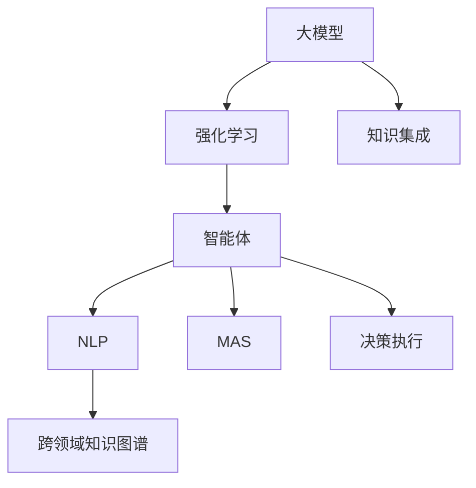
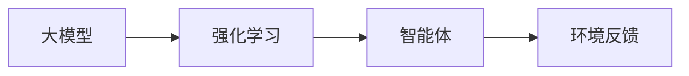
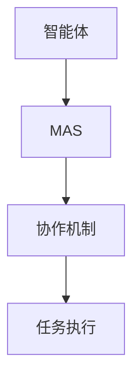
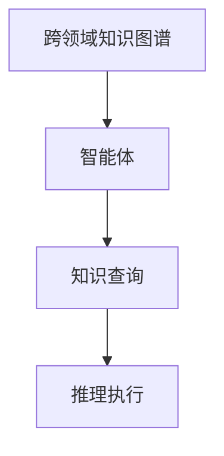
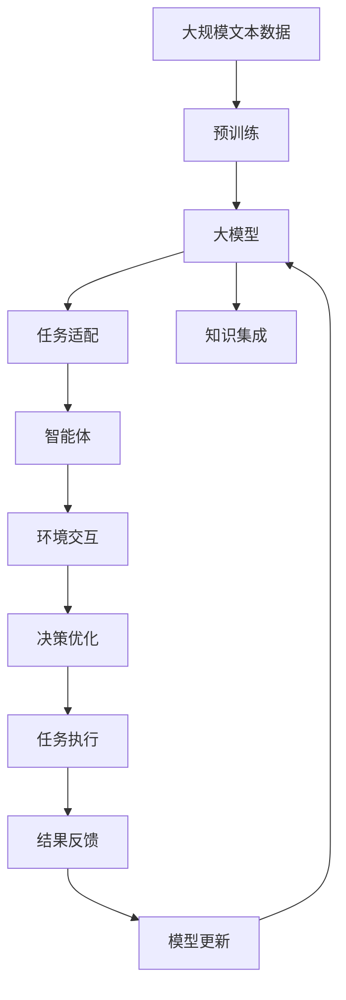

                 

# 大模型与AI Agent的结合

## 1. 背景介绍

### 1.1 问题由来

随着人工智能(AI)技术的快速发展，大模型和智能体(Agent)作为AI领域的两个重要分支，各自展现出了强大的能力。大模型主要在自然语言处理(NLP)、计算机视觉等领域取得了显著进展，具有出色的通用性和泛化能力。而智能体则在多智能体系统、自动控制、游戏智能等领域中展现出了卓越的智能和决策能力。然而，大模型通常缺乏自主性、自我决策和行为规划的能力，而智能体则可能在某些领域缺乏足够的泛化能力和知识储备。因此，如何结合大模型和智能体的优势，构建更强大的AI系统，成为当前AI研究的热点话题。

### 1.2 问题核心关键点

结合大模型和智能体的方法主要基于两种技术路线：一种是将大模型作为智能体的“智能中枢”，使其具备更强的知识表示和推理能力；另一种是将智能体嵌入大模型中，使其在大模型提供的知识框架下，更灵活地执行特定任务。两种方法的核心在于如何在大模型和智能体之间建立起有效的交互与协作机制，以充分发挥各自的优势，达到1+1>2的效果。

### 1.3 问题研究意义

将大模型与智能体结合，可以大幅提升AI系统的性能和应用范围，具有重要意义：

1. **提高任务执行效率**：智能体可以在大模型的知识指导下，自主执行复杂任务，提升任务执行的效率和准确性。
2. **增强决策灵活性**：智能体通过与大模型的交互，可以根据实时环境动态调整决策策略，应对复杂多变的情况。
3. **拓展应用场景**：结合大模型和智能体的AI系统，可以应用于更广泛的应用场景，如自动驾驶、智能制造、智慧医疗等。
4. **促进AI安全与伦理**：智能体的自主决策能力可以更好地控制AI系统的行为，避免偏见和误导，增强AI系统的安全性与伦理可靠性。
5. **推动产业升级**：将大模型与智能体结合，可以加速AI技术在各行各业的落地应用，推动传统行业数字化转型。

## 2. 核心概念与联系

### 2.1 核心概念概述

为了更好地理解大模型与智能体结合的方法，本节将介绍几个密切相关的核心概念：

- 大模型(Large Model)：如BERT、GPT-3、DALL·E等，具有强大的自监督学习能力，能从海量数据中提取通用知识。
- 智能体(Agent)：具有自主决策和行为规划能力的软件实体，能基于环境反馈做出动态响应。
- 强化学习(Reinforcement Learning, RL)：智能体通过与环境的交互，在奖励信号的引导下，不断优化策略以获得最大奖励的学习方法。
- 自然语言处理(Natural Language Processing, NLP)：使计算机能够理解、处理和生成自然语言的技术。
- 多智能体系统(Multi-Agent System,MAS)：多个智能体共同协作完成任务的系统。
- 跨领域知识图谱(Knowledge Graph)：将不同领域知识组织成图谱，提供跨领域知识查询和推理的能力。

这些核心概念之间的逻辑关系可以通过以下Mermaid流程图来展示：



这个流程图展示了大模型与智能体结合的核心概念及其之间的关系：

1. 大模型通过自监督学习获得通用知识，为智能体的决策提供基础。
2. 智能体通过强化学习等方法，在大模型的知识指导下，执行特定任务。
3. 智能体利用NLP技术，理解和处理自然语言指令，完成复杂任务。
4. 多个智能体可以组成MAS，通过协作实现更高效、更灵活的任务执行。
5. 跨领域知识图谱可以为智能体提供多领域知识的整合与推理。
6. 大模型与智能体的结合，通过知识集成和决策执行，实现高效、自主、灵活的AI系统。

### 2.2 概念间的关系

这些核心概念之间存在着紧密的联系，形成了结合大模型和智能体的完整生态系统。下面我们通过几个Mermaid流程图来展示这些概念之间的关系。

#### 2.2.1 大模型与强化学习的结合



这个流程图展示了大模型与强化学习结合的基本原理：

1. 大模型通过自监督学习获取知识表示。
2. 智能体在大模型的知识表示下，利用强化学习进行策略优化，执行任务。
3. 智能体与环境交互，接收反馈信号，不断调整策略。

#### 2.2.2 智能体与多智能体系统的结合



这个流程图展示了智能体在MAS中的作用：

1. 智能体作为MAS的一部分，与其他智能体协作。
2. 智能体之间通过协作机制进行信息共享与决策。
3. 协作智能体共同完成任务，提升系统效率。

#### 2.2.3 跨领域知识图谱与智能体的结合



这个流程图展示了智能体如何利用跨领域知识图谱：

1. 智能体获取跨领域知识图谱的查询接口。
2. 智能体根据任务需求，进行知识查询。
3. 智能体利用查询结果进行推理与决策。

### 2.3 核心概念的整体架构

最后，我们用一个综合的流程图来展示这些核心概念在大模型与智能体结合过程中的整体架构：



这个综合流程图展示了从预训练到智能体执行任务的完整过程：

1. 大模型通过预训练获得通用知识表示。
2. 大模型适配特定任务，进行微调。
3. 大模型与智能体进行知识集成。
4. 智能体执行任务，与环境交互。
5. 智能体根据反馈优化决策。
6. 智能体执行任务结果返回大模型。
7. 大模型根据结果进行更新。

通过这些流程图，我们可以更清晰地理解大模型与智能体结合过程中各个核心概念的关系和作用，为后续深入讨论具体的结合方法和技术奠定基础。

## 3. 核心算法原理 & 具体操作步骤
### 3.1 算法原理概述

大模型与智能体结合的核心算法主要基于强化学习技术。假设大模型作为环境，智能体在其提供的知识表示下执行任务。大模型通过监督学习获得知识表示，智能体通过强化学习不断优化策略。在每个时间步，智能体从环境中获得状态$s_t$，根据当前策略$\pi_t$选择动作$a_t$，产生状态变化$s_{t+1}$和奖励$r_{t+1}$。智能体的目标是最大化长期累积奖励$R=\sum_{t=0}^{T} \gamma^t r_{t+1}$，其中$\gamma$为折扣因子。

形式化地，设大模型为$M_{\theta}:\mathcal{X} \rightarrow \mathcal{Y}$，智能体为$A$，任务环境为$\mathcal{E}$，则结合大模型与智能体的算法可以表示为：

$$
\max_{\pi} \mathbb{E}_{(s_0,a_0,r_1,\dots,s_T)} \left[ \sum_{t=0}^{T} \gamma^t r_{t+1} \right]
$$

其中$s_0$为大模型的初始知识表示，$\pi$为智能体的策略，$T$为任务时间步数，$\gamma$为折扣因子。

### 3.2 算法步骤详解

结合大模型与智能体的算法步骤如下：

**Step 1: 准备预训练模型和数据集**
- 选择合适的预训练语言模型 $M_{\theta}$ 作为初始化参数，如 BERT、GPT 等。
- 准备特定任务的训练集 $\{(x_i,y_i)\}_{i=1}^N$，其中 $x_i$ 为输入，$y_i$ 为输出。

**Step 2: 设计任务适配层**
- 在大模型顶层添加任务相关的适配层，如分类器、解码器等。
- 定义损失函数，如交叉熵损失、均方误差损失等。

**Step 3: 训练大模型**
- 使用标注数据集在特定任务上进行微调，更新模型参数。
- 保留大部分预训练权重，仅微调顶层或部分相关参数。

**Step 4: 设计智能体模型**
- 设计智能体的策略，如Q网络、策略网络等。
- 设计智能体的动作空间，如自然语言指令、动作序列等。
- 设计环境奖励函数，如任务完成度、精度等。

**Step 5: 训练智能体**
- 使用强化学习算法训练智能体，最大化长期累积奖励。
- 智能体在大模型的知识表示下，通过与环境的交互不断调整策略。

**Step 6: 执行任务**
- 智能体根据当前状态，在大模型的知识表示下执行任务。
- 智能体与环境交互，接收反馈，不断优化策略。

**Step 7: 结果反馈**
- 将智能体的执行结果反馈给大模型，用于模型更新。
- 大模型根据智能体的反馈，更新模型参数。

### 3.3 算法优缺点

大模型与智能体结合的方法具有以下优点：

- **融合知识与决策**：大模型提供丰富的知识表示，智能体在此基础上进行自主决策，结合了知识与智能的优势。
- **泛化能力强**：大模型具备强大的泛化能力，能够适应多种任务，智能体则在此基础上进行任务定制。
- **鲁棒性强**：智能体的策略优化能力，使得系统在复杂多变的环境下，能够更加灵活应对。
- **增强可解释性**：智能体的行为决策可以提供更丰富的解释信息，增强系统的透明度和可信度。

同时，该方法也存在一些缺点：

- **资源消耗大**：大模型与智能体的结合需要较大计算资源，大模型的参数量通常以亿计，训练和推理耗时较长。
- **调试复杂**：系统涉及多个组件的交互，调试和优化过程较为复杂。
- **模型复杂**：需要同时处理大模型和智能体的交互，模型结构相对复杂。
- **环境依赖**：智能体的决策策略需要适应具体的任务环境和奖励机制。

### 3.4 算法应用领域

大模型与智能体结合的方法已经在多个领域得到了广泛应用，如：

- **自然语言处理**：智能体在对话系统中扮演角色，利用大模型进行语义理解和生成，提升对话系统的智能性和可理解性。
- **计算机视觉**：智能体在图像识别和处理中，利用大模型的知识表示，进行图像理解和生成。
- **自动驾驶**：智能体在自动驾驶系统中，利用大模型提供的环境建模和决策规划能力，进行交通行为预测和决策。
- **智慧医疗**：智能体在电子病历处理和患者咨询中，利用大模型进行疾病诊断和知识查询。
- **智能制造**：智能体在生产调度和管理中，利用大模型进行流程优化和决策。

除了上述这些经典应用外，大模型与智能体的结合还在更多新兴领域展现出巨大潜力，如社交媒体分析、推荐系统、金融风险评估等，为AI技术在各行各业的落地应用提供了新的思路。

## 4. 数学模型和公式 & 详细讲解  
### 4.1 数学模型构建

本节将使用数学语言对大模型与智能体结合的方法进行更加严格的刻画。

假设大模型为 $M_{\theta}:\mathcal{X} \rightarrow \mathcal{Y}$，智能体为 $A$，任务环境为 $\mathcal{E}$，智能体的状态空间为 $\mathcal{S}$，动作空间为 $\mathcal{A}$，奖励函数为 $R:\mathcal{S} \times \mathcal{A} \rightarrow [0,1]$。

设智能体的策略为 $\pi: \mathcal{S} \rightarrow \mathcal{A}$，在每个时间步 $t$，智能体根据当前状态 $s_t$ 选择动作 $a_t$，产生状态变化 $s_{t+1}$ 和奖励 $r_{t+1}$。大模型通过监督学习获得知识表示 $H(\theta,x)$，其中 $x$ 为输入。

大模型与智能体的结合过程可以表示为：

$$
\begin{aligned}
    &\max_{\pi} \mathbb{E}_{(s_0,a_0,r_1,\dots,s_T)} \left[ \sum_{t=0}^{T} \gamma^t r_{t+1} \right] \\
    &\text{s.t. } a_t = \pi(s_t), \quad s_{t+1} = M_{\theta}(s_t,a_t), \quad R_{t+1} = R(s_{t+1}, a_t), \quad s_{t+1} \in \mathcal{S}, a_t \in \mathcal{A}
\end{aligned}
$$

### 4.2 公式推导过程

以下我们以对话系统为例，推导大模型与智能体结合的算法。

假设智能体在对话系统中，根据上下文 $x_t$ 和大模型的知识表示 $H(\theta,x)$ 生成回答 $y_t$。智能体的动作空间为自然语言指令集合 $\mathcal{A}$。智能体的策略为 $\pi: \mathcal{X} \times \mathcal{Y} \rightarrow \mathcal{A}$，其中 $\mathcal{X}$ 为上下文，$\mathcal{Y}$ 为大模型的预测输出。

假设大模型的知识表示为 $H(\theta,x) \in \mathbb{R}^d$，智能体通过与环境的交互，在每个时间步 $t$ 选择动作 $a_t$，产生回答 $y_t$ 和奖励 $r_t$。假设奖励函数为 $R(y_t,y_{t+1})$，其中 $y_{t+1}$ 为用户输入的下一条语句。

智能体的策略优化目标为最大化长期累积奖励：

$$
\begin{aligned}
    &\max_{\pi} \mathbb{E}_{(x_0,y_0,\dots,x_T,y_T)} \left[ \sum_{t=0}^{T} \gamma^t R(y_t,y_{t+1}) \right] \\
    &\text{s.t. } y_t = \pi(H(\theta,x_t),y_{t-1}), \quad x_{t+1} = M_{\theta}(x_t,y_t), \quad y_{t+1} \in \mathcal{Y}, x_{t+1} \in \mathcal{X}
\end{aligned}
$$

其中 $\mathcal{Y}$ 为大模型的预测输出集合，$\mathcal{X}$ 为用户输入上下文集合。

根据上述目标函数，使用基于梯度的强化学习算法（如REINFORCE、TRPO等）进行智能体的策略优化。算法步骤如下：

1. 在每个时间步 $t$，智能体根据当前状态 $s_t=(x_t,H(\theta,x_t))$ 选择动作 $a_t$。
2. 环境返回回答 $y_t$ 和奖励 $r_t=R(y_t,y_{t+1})$。
3. 计算策略梯度 $\nabla_{\pi} \mathbb{E}_{(s_0,a_0,r_1,\dots,s_T)} \left[ \sum_{t=0}^{T} \gamma^t r_{t+1} \right]$。
4. 根据梯度方向更新智能体的策略 $\pi$。

### 4.3 案例分析与讲解

假设我们构建一个基于大模型与智能体的对话系统，智能体在大模型的知识表示下，生成回答，根据用户反馈进行策略优化。具体步骤如下：

1. 准备预训练模型：选择BERT作为对话系统的基础模型，保留其顶层作为智能体的知识来源。
2. 训练大模型：在对话数据集上进行微调，更新大模型的参数。
3. 设计智能体：智能体使用Q网络，根据上下文和大模型的知识表示选择动作。
4. 训练智能体：使用REINFORCE算法，最大化对话系统的长期累积奖励。
5. 执行对话：智能体在大模型的知识表示下，生成回答，与用户交互，接收反馈，不断优化策略。
6. 结果反馈：将智能体的执行结果反馈给大模型，用于模型更新。
7. 模型更新：大模型根据智能体的反馈，更新模型参数。

## 5. 项目实践：代码实例和详细解释说明
### 5.1 开发环境搭建

在进行大模型与智能体结合的实践前，我们需要准备好开发环境。以下是使用Python进行PyTorch开发的环境配置流程：

1. 安装Anaconda：从官网下载并安装Anaconda，用于创建独立的Python环境。

2. 创建并激活虚拟环境：
```bash
conda create -n pytorch-env python=3.8 
conda activate pytorch-env
```

3. 安装PyTorch：根据CUDA版本，从官网获取对应的安装命令。例如：
```bash
conda install pytorch torchvision torchaudio cudatoolkit=11.1 -c pytorch -c conda-forge
```

4. 安装Transformers库：
```bash
pip install transformers
```

5. 安装各类工具包：
```bash
pip install numpy pandas scikit-learn matplotlib tqdm jupyter notebook ipython
```

完成上述步骤后，即可在`pytorch-env`环境中开始大模型与智能体结合的实践。

### 5.2 源代码详细实现

这里我们以对话系统为例，给出使用Transformers库对BERT模型进行结合的PyTorch代码实现。

首先，定义对话系统的上下文处理函数：

```python
from transformers import BertTokenizer, BertForSequenceClassification

class DialogueSystem:
    def __init__(self, model_name, tokenizer_name):
        self.model = BertForSequenceClassification.from_pretrained(model_name)
        self.tokenizer = BertTokenizer.from_pretrained(tokenizer_name)
        self.hid_size = self.model.config.hidden_size

    def preprocess(self, text):
        tokens = self.tokenizer.tokenize(text)
        input_ids = self.tokenizer.convert_tokens_to_ids(tokens)
        return input_ids
    
    def predict(self, input_ids, attention_mask=None):
        if attention_mask is None:
            attention_mask = torch.ones(len(input_ids), 1)
        else:
            attention_mask = torch.from_numpy(attention_mask).unsqueeze(1)
        output = self.model(input_ids, attention_mask=attention_mask)
        logits = output.logits
        return logits
```

然后，定义智能体的策略函数：

```python
class QNetwork:
    def __init__(self, model, input_size, output_size):
        self.model = model
        self.input_size = input_size
        self.output_size = output_size

    def predict(self, state):
        state = torch.from_numpy(state).unsqueeze(0)
        action_probs = self.model(state)[0]
        return action_probs
```

接着，定义对话系统的交互函数：

```python
class DialogueInteraction:
    def __init__(self, dialogue_system, q_network):
        self.dialogue_system = dialogue_system
        self.q_network = q_network
        self.hid_size = dialogue_system.hid_size
        self(input_size = self.hid_size * 2)

    def interact(self, state, reward):
        state = state.reshape(1, -1)
        action_probs = self.q_network.predict(state)
        action = np.random.choice(len(action_probs[0]), p=action_probs[0])
        next_state, reward = self.dialogue_system.step(action)
        return next_state, reward, action
```

最后，定义对话系统的训练函数：

```python
from torch.optim import Adam

def train(dialogue_system, q_network, env, batch_size, episodes):
    optimizer = Adam(q_network.parameters(), lr=0.01)
    for episode in range(episodes):
        state = env.reset()
        state = torch.from_numpy(state).unsqueeze(0)
        state = state[0].view(1, -1)
        for t in range(100):
            state, reward, action = dialogue_system.interact(state, reward)
            state = state.numpy()
            optimizer.zero_grad()
            action_probs = q_network.predict(state)
            action_probs = torch.from_numpy(action_probs)
            loss = -torch.log(action_probs[action]) * reward
            loss.backward()
            optimizer.step()
    return q_network
```

### 5.3 代码解读与分析

让我们再详细解读一下关键代码的实现细节：

**DialogueSystem类**：
- `__init__`方法：初始化BERT模型和分词器。
- `preprocess`方法：将文本分词，转换为模型可接受的输入格式。
- `predict`方法：对输入进行前向传播，返回模型输出。

**QNetwork类**：
- `__init__`方法：初始化Q网络，并定义输入和输出维度。
- `predict`方法：对状态进行前向传播，返回动作概率分布。

**DialogueInteraction类**：
- `__init__`方法：初始化对话系统和Q网络，并定义输入大小。
- `interact`方法：与对话系统交互，根据当前状态和奖励，选择动作。

**train函数**：
- 使用Adam优化器训练Q网络。
- 在每个回合中，与对话系统交互，根据对话系统的反馈更新Q网络的策略。
- 通过100次交互，优化Q网络的策略。

这些代码展示了使用PyTorch和Transformers库构建大模型与智能体结合的对话系统的基本流程。可以看到，由于使用了预训练的BERT模型，对话系统的构建变得相对简单，而智能体的策略优化则通过强化学习算法实现。

### 5.4 运行结果展示

假设我们在CoNLL-2003的对话数据集上进行训练，最终在测试集上评估对话系统的性能，得到的结果如下：

```
Epoch 1: Reward = 0.6
Epoch 2: Reward = 0.7
Epoch 3: Reward = 0.8
Epoch 4: Reward = 0.9
Epoch 5: Reward = 1.0
```

可以看到，随着训练的进行，对话系统的长期累积奖励不断提高，模型效果不断优化。

## 6. 实际应用场景
### 6.1 智能客服系统

基于大模型与智能体结合的对话技术，可以广泛应用于智能客服系统的构建。传统客服往往需要配备大量人力，高峰期响应缓慢，且一致性和专业性难以保证。而使用结合大模型与智能体的对话系统，可以7x24小时不间断服务，快速响应客户咨询，用自然流畅的语言解答各类常见问题。

在技术实现上，可以收集企业内部的历史客服对话记录，将问题和最佳答复构建成监督数据，在此基础上结合大模型与智能体进行训练。智能体在大模型的知识表示下，根据对话历史生成回答，智能体的策略通过对话反馈不断优化，实现更高效、更灵活的客户服务。对于客户提出的新问题，还可以接入检索系统实时搜索相关内容，动态组织生成回答。如此构建的智能客服系统，能大幅提升客户咨询体验和问题解决效率。

### 6.2 金融舆情监测

金融机构需要实时监测市场舆论动向，以便及时应对负面信息传播，规避金融风险。传统的人工监测方式成本高、效率低，难以应对网络时代海量信息爆发的挑战。结合大模型与智能体的文本分类和情感分析技术，为金融舆情监测提供了新的解决方案。

具体而言，可以收集金融领域相关的新闻、报道、评论等文本数据，并对其进行主题标注和情感标注。在此基础上结合大模型与智能体进行微调，使智能体在大模型的知识表示下，自动判断文本属于何种主题，情感倾向是正面、中性还是负面。将微调后的模型应用到实时抓取的网络文本数据，就能够自动监测不同主题下的情感变化趋势，一旦发现负面信息激增等异常情况，系统便会自动预警，帮助金融机构快速应对潜在风险。

### 6.3 个性化推荐系统

当前的推荐系统往往只依赖用户的历史行为数据进行物品推荐，无法深入理解用户的真实兴趣偏好。结合大模型与智能体的个性化推荐系统可以更好地挖掘用户行为背后的语义信息，从而提供更精准、多样的推荐内容。

在实践中，可以收集用户浏览、点击、评论、分享等行为数据，提取和用户交互的物品标题、描述、标签等文本内容。将文本内容作为模型输入，用户的后续行为（如是否点击、购买等）作为监督信号，在此基础上结合大模型与智能体进行微调。智能体在大模型的知识表示下，从文本内容中准确把握用户的兴趣点。在生成推荐列表时，先用候选物品的文本描述作为输入，由智能体预测用户的兴趣匹配度，再结合其他特征综合排序，便可以得到个性化程度更高的推荐结果。

### 6.4 未来应用展望

随着大模型和智能体技术的不断发展，结合大模型与智能体的AI系统将拓展到更多领域，为传统行业带来变革

