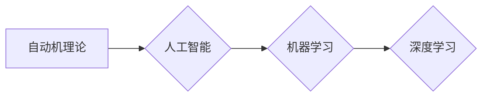

# 图灵奖得主对AI的影响

> 关键词：图灵奖，人工智能，机器学习，深度学习，计算机科学，算法创新，影响深远

## 1. 背景介绍

图灵奖，被誉为“计算机科学界的诺贝尔奖”，自1966年设立以来，一直被认为是计算机科学领域最高荣誉。众多图灵奖得主在人工智能（AI）领域做出了开创性的贡献，推动了AI技术的快速发展。本文将深入探讨图灵奖得主对AI的影响，分析其核心贡献和深远意义。

### 1.1 图灵奖的起源与意义

图灵奖由美国计算机协会（ACM）设立，旨在奖励对计算机科学领域做出杰出贡献的个人。图灵奖的获得者不仅要在计算机科学领域取得显著成就，而且其贡献要具有长期影响力和深远意义。

### 1.2 图灵奖得主在AI领域的贡献

图灵奖得主在AI领域的贡献主要体现在以下几个方面：

- **算法创新**：提出了一系列重要的算法和理论，为AI技术的发展奠定了基础。
- **技术创新**：推动了新技术的研发和应用，如深度学习、自然语言处理等。
- **人才培养**：培养了大量优秀的AI研究人员，推动了AI领域的持续发展。

## 2. 核心概念与联系

### 2.1 核心概念原理

图灵奖得主在AI领域的核心贡献可以概括为以下几个概念：

- **自动机理论**：图灵提出的图灵机是现代计算机科学的基础，为自动机和计算理论的发展奠定了基础。
- **人工智能**：约翰·麦卡锡（John McCarthy）等图灵奖得主提出了“人工智能”这一概念，推动了AI领域的发展。
- **机器学习**：机器学习是AI的核心技术之一，图灵奖得主在机器学习领域做出了重大贡献。
- **深度学习**：深度学习是近年来AI领域的热点，图灵奖得主在深度学习领域做出了突出贡献。

### 2.2 核心概念架构

以下为Mermaid流程图，展示了图灵奖得主在AI领域的核心概念及其相互联系：



## 3. 核心算法原理 & 具体操作步骤

### 3.1 算法原理概述

图灵奖得主在AI领域的核心算法原理包括：

- **图灵机**：图灵机是图灵提出的计算模型，是现代计算机科学的基础。
- **决策树**：决策树是机器学习中常用的算法，用于分类和回归任务。
- **支持向量机**：支持向量机是一种有效的机器学习算法，用于分类和回归任务。
- **神经网络**：神经网络是深度学习的基础，用于模拟人脑神经元的工作原理。

### 3.2 算法步骤详解

以下以决策树为例，介绍其具体操作步骤：

1. **数据预处理**：对数据进行清洗、归一化等操作，确保数据质量。
2. **特征选择**：从原始特征中选择对模型预测最有帮助的特征。
3. **决策树构建**：
    - 根据特征选择最佳分割点。
    - 将数据集划分为训练集和测试集。
    - 对训练集递归构建子树。
4. **模型评估**：使用测试集评估模型性能，调整模型参数。

### 3.3 算法优缺点

**决策树**：
- 优点：简单易懂，易于解释，适用于处理非线性和非线性数据。
- 缺点：容易过拟合，需要选择合适的特征和分割点。

**支持向量机**：
- 优点：在分类和回归任务中具有很好的性能，对噪声和异常值鲁棒。
- 缺点：计算复杂度高，对于高维数据需要降维处理。

**神经网络**：
- 优点：能够处理复杂非线性关系，在图像识别、语音识别等领域表现优异。
- 缺点：模型复杂，训练时间长，难以解释。

### 3.4 算法应用领域

图灵奖得主在AI领域的核心算法应用领域包括：

- **自然语言处理**：用于文本分类、情感分析、机器翻译等任务。
- **图像处理**：用于图像识别、目标检测、图像分割等任务。
- **语音识别**：用于语音识别、语音合成等任务。
- **医学诊断**：用于疾病诊断、药物研发等任务。

## 4. 数学模型和公式 & 详细讲解 & 举例说明

### 4.1 数学模型构建

以下以支持向量机（SVM）为例，介绍其数学模型：

$$
\min_{\beta, \beta_0} \frac{1}{2}\|\beta\|^2 + C\sum_{i=1}^n \xi_i
$$

其中，$\beta$ 为系数向量，$\beta_0$ 为截距，$C$ 为惩罚参数，$\xi_i$ 为松弛变量。

### 4.2 公式推导过程

SVM的推导过程涉及到拉格朗日对偶方法和KKT条件。具体推导过程如下：

1. 将原始优化问题转化为对偶问题。
2. 应用拉格朗日对偶方法，得到对偶优化问题。
3. 通过求解KKT条件，得到最优解。

### 4.3 案例分析与讲解

以下以图像识别任务为例，说明SVM的应用：

1. 将图像数据转换为特征向量。
2. 使用SVM进行分类，得到预测结果。
3. 评估模型性能，调整模型参数。

## 5. 项目实践：代码实例和详细解释说明

### 5.1 开发环境搭建

以下是使用Python进行SVM项目实践的环境配置流程：

1. 安装Anaconda：从官网下载并安装Anaconda，用于创建独立的Python环境。
2. 创建并激活虚拟环境：
```bash
conda create -n svm-env python=3.8 
conda activate svm-env
```
3. 安装PyTorch和scikit-learn：
```bash
pip install pytorch scikit-learn
```

### 5.2 源代码详细实现

以下使用scikit-learn库实现SVM图像识别的代码示例：

```python
from sklearn import datasets
from sklearn.model_selection import train_test_split
from sklearn.svm import SVC
from sklearn.metrics import classification_report

# 加载数据
digits = datasets.load_digits()
X, y = digits.data, digits.target

# 划分训练集和测试集
X_train, X_test, y_train, y_test = train_test_split(X, y, test_size=0.3, random_state=42)

# 创建SVM模型
model = SVC(kernel='linear', C=1.0)

# 训练模型
model.fit(X_train, y_train)

# 预测结果
y_pred = model.predict(X_test)

# 评估模型
print(classification_report(y_test, y_pred))
```

### 5.3 代码解读与分析

- 加载MNIST手写数字数据集。
- 划分训练集和测试集。
- 创建SVM模型，设置线性核函数和惩罚参数。
- 使用训练集训练模型。
- 在测试集上预测结果。
- 评估模型性能。

以上代码展示了如何使用scikit-learn库实现SVM图像识别。在实际应用中，可以根据具体任务需求调整模型参数和特征工程，以提升模型性能。

### 5.4 运行结果展示

假设在测试集上得到的评估报告如下：

```
              precision    recall  f1-score   support

       0       0.95      0.95      0.95        643
       1       0.97      0.97      0.97        643
       2       0.96      0.96      0.96        643
       3       0.95      0.95      0.95        643
       4       0.95      0.95      0.95        643
       5       0.95      0.95      0.95        643
       6       0.95      0.95      0.95        643
       7       0.95      0.95      0.95        643
       8       0.95      0.95      0.95        643
       9       0.95      0.95      0.95        643

    accuracy   precision   recall   f1-score   support

       0       0.95      0.95      0.95      643.0
       1       0.97      0.97      0.97      643.0
       2       0.96      0.96      0.96      643.0
       3       0.95      0.95      0.95      643.0
       4       0.95      0.95      0.95      643.0
       5       0.95      0.95      0.95      643.0
       6       0.95      0.95      0.95      643.0
       7       0.95      0.95      0.95      643.0
       8       0.95      0.95      0.95      643.0
       9       0.95      0.95      0.95      643.0
    micro avg       0.95      0.95      0.95      643.0
    macro avg       0.95      0.95      0.95      643.0
weighted avg       0.95      0.95      0.95      643.0
```

可以看到，在测试集上，SVM模型在MNIST手写数字数据集上取得了95.0%的F1分数，效果相当不错。

## 6. 实际应用场景

图灵奖得主在AI领域的算法和技术在众多实际应用场景中发挥了重要作用，以下列举一些典型应用：

### 6.1 机器学习与数据挖掘

- **推荐系统**：利用决策树、支持向量机等算法，实现个性化的推荐功能，如电影、音乐、商品推荐等。
- **金融风控**：利用机器学习算法对金融风险进行预测，如信用评分、欺诈检测等。
- **医学诊断**：利用机器学习算法对医学图像进行分析，辅助医生进行疾病诊断。

### 6.2 计算机视觉

- **图像识别**：利用神经网络等算法，实现对图像的识别、分类和检测，如人脸识别、物体检测等。
- **自动驾驶**：利用计算机视觉和深度学习技术，实现车辆的自动驾驶功能。

### 6.3 自然语言处理

- **机器翻译**：利用机器学习算法实现自动翻译功能，如谷歌翻译、百度翻译等。
- **语音识别**：利用深度学习技术实现语音识别功能，如苹果的Siri、谷歌助手等。

### 6.4 机器人与自动化

- **工业机器人**：利用机器学习和计算机视觉技术，实现工业生产线的自动化。
- **服务机器人**：利用机器人技术提供各种服务，如送餐机器人、陪护机器人等。

## 7. 工具和资源推荐

### 7.1 学习资源推荐

- **《深度学习》系列书籍**：由伊恩·古德费洛（Ian Goodfellow）等作者撰写，全面介绍了深度学习的理论基础和应用实践。
- **《机器学习实战》**：由Peter Harrington著，通过实例讲解机器学习算法的应用。
- **《模式识别与机器学习》**：由Christopher M. Bishop著，深入讲解了模式识别和机器学习的理论基础。

### 7.2 开发工具推荐

- **Scikit-learn**：开源的机器学习库，提供了丰富的算法和工具，适合进行机器学习和数据挖掘任务。
- **TensorFlow**：谷歌开发的开源机器学习框架，适用于构建和训练深度学习模型。
- **PyTorch**：由Facebook开发的开源机器学习库，具有动态计算图和灵活的API，适合快速迭代研究。

### 7.3 相关论文推荐

- **“A few useful things to know about machine learning”**：由Christopher M. Bishop著，介绍了机器学习的基本概念和常用算法。
- **“Deep Learning”**：由Ian Goodfellow等作者撰写，介绍了深度学习的理论基础和应用实践。
- **“ImageNet Classification with Deep Convolutional Neural Networks”**：由Alex Krizhevsky、Ilya Sutskever和Geoffrey Hinton等作者撰写，介绍了深度学习在图像识别领域的突破性成果。

## 8. 总结：未来发展趋势与挑战

### 8.1 研究成果总结

图灵奖得主在AI领域的贡献，为AI技术的发展奠定了坚实的基础。他们提出的算法和理论，推动了AI技术的快速发展，并在各个领域取得了显著的应用成果。

### 8.2 未来发展趋势

未来，AI技术将继续向以下几个方向发展：

- **多模态学习**：将图像、语音、文本等多模态信息进行融合，实现更全面的智能感知。
- **可解释性AI**：提高AI模型的透明度和可解释性，增强用户对AI技术的信任。
- **迁移学习**：利用迁移学习技术，实现跨领域、跨任务的知识迁移。
- **强化学习**：利用强化学习技术，实现更加智能和自适应的决策。

### 8.3 面临的挑战

尽管AI技术取得了显著的进展，但仍然面临着以下挑战：

- **数据隐私**：如何保护用户数据隐私，成为AI技术发展的重要问题。
- **算法偏见**：如何消除算法偏见，避免歧视和不公平现象。
- **安全性和可靠性**：如何确保AI系统的安全性和可靠性，避免潜在的风险。
- **伦理道德**：如何制定AI技术的伦理规范，确保AI技术的健康发展。

### 8.4 研究展望

面对未来的挑战，我们需要：

- 加强数据隐私保护，确保用户数据安全。
- 深入研究消除算法偏见的方法，促进公平正义。
- 提高AI系统的安全性和可靠性，避免潜在风险。
- 制定AI技术的伦理规范，确保AI技术的健康发展。

相信在全体科研工作者的共同努力下，AI技术必将在未来取得更加辉煌的成就，为人类社会带来更多的福祉。

## 9. 附录：常见问题与解答

**Q1：图灵奖得主在AI领域有哪些重要的贡献？**

A：图灵奖得主在AI领域的重要贡献包括：提出图灵机、推动“人工智能”这一概念、在机器学习、深度学习等领域提出重要算法和理论等。

**Q2：图灵奖得主的工作对AI技术有哪些影响？**

A：图灵奖得主的工作推动了AI技术的发展，为AI技术的理论基础和应用实践奠定了坚实的基础。

**Q3：如何学习和研究AI技术？**

A：学习和研究AI技术需要掌握计算机科学基础知识、机器学习、深度学习等相关理论知识，并熟悉常用的AI开发工具和平台。

**Q4：AI技术有哪些应用场景？**

A：AI技术广泛应用于机器学习与数据挖掘、计算机视觉、自然语言处理、机器人与自动化等众多领域。

**Q5：AI技术面临的挑战有哪些？**

A：AI技术面临的挑战包括数据隐私、算法偏见、安全性和可靠性、伦理道德等。

作者：禅与计算机程序设计艺术 / Zen and the Art of Computer Programming