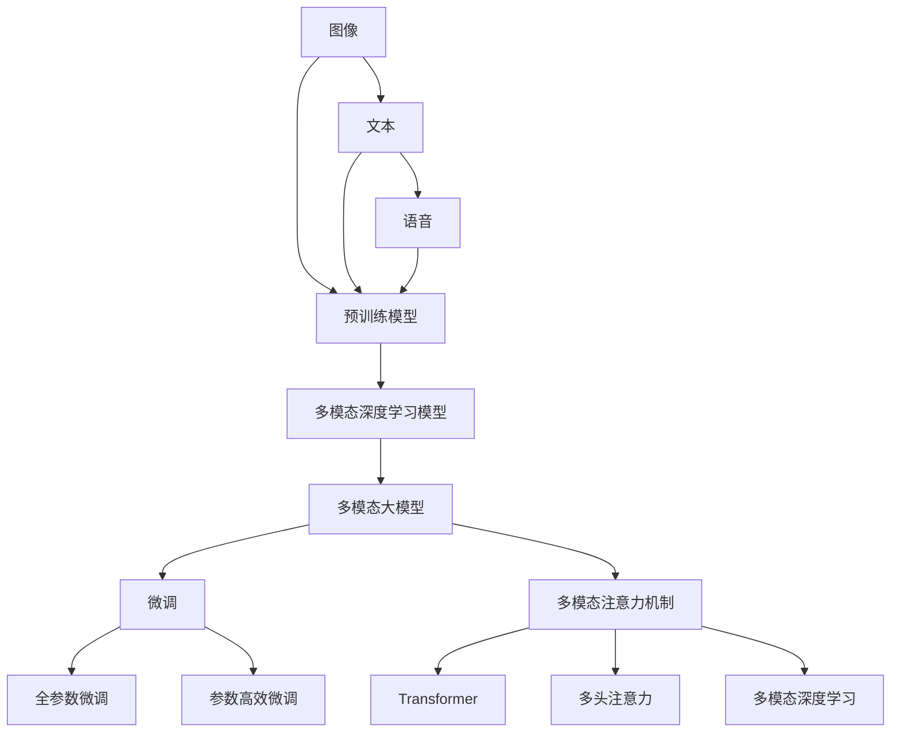
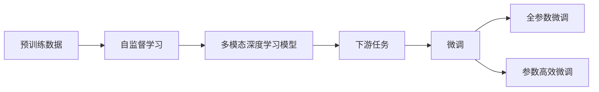
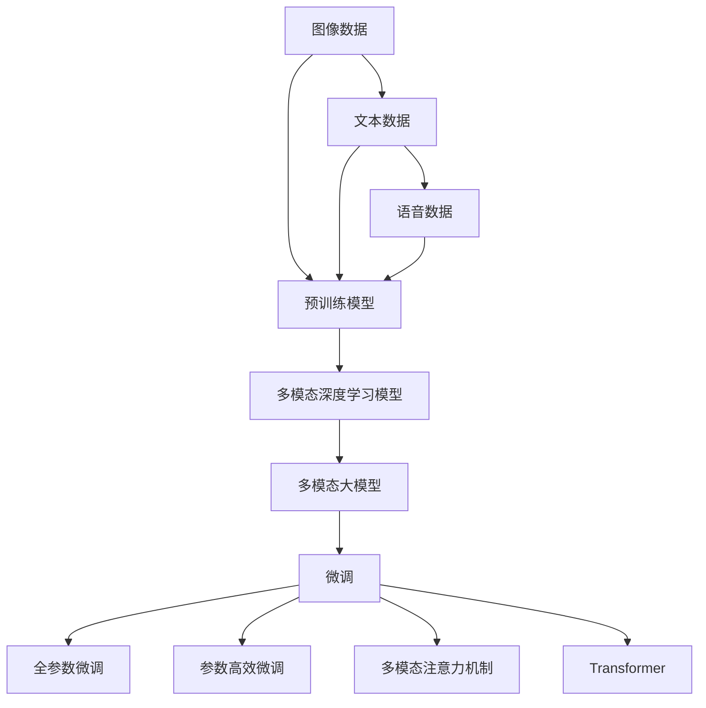
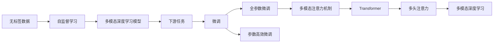
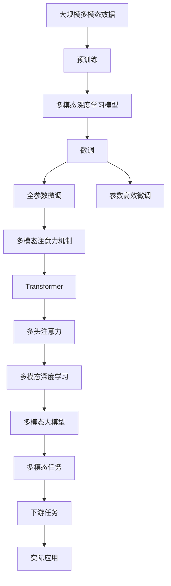

                 

# 多模态大模型：技术原理与实战 大模型+多模态产生的化学反应

> 关键词：多模态大模型,预训练,微调,多模态深度学习,多模态注意力机制,Transformer,BERT,大规模图像识别,多语言翻译,多模态情感分析

## 1. 背景介绍

### 1.1 问题由来
近年来，深度学习技术的迅猛发展带来了以深度神经网络为代表的各类模型的大规模应用。无论是传统的图像分类模型，还是近来火爆的自然语言处理(NLP)大模型，它们都成为了处理和理解各种数据的重要工具。然而，我们发现，无论是图像、文本还是语音，都是高维的多模态数据，而现有的主流模型往往只能处理单一类型的输入，难以有效整合多模态数据的信息。

为了解决这一问题，研究人员提出了多模态深度学习模型，旨在融合多种类型的数据，从而更加全面地理解现实世界。多模态深度学习模型充分利用了不同模态数据的特质，提高了模型的表达能力，并显著提升了模型性能。本文将深入探讨多模态大模型及其关键技术，并通过实战项目演示多模态大模型的构建和应用。

### 1.2 问题核心关键点
多模态大模型将不同模态的数据融合到一个统一的框架下进行处理。例如，结合图像和文本数据，构建视觉问答系统、视频内容理解系统、跨模态检索系统等。常见的多模态深度学习框架包括CLIP、DETR、Vit-BERT等，它们通常是在自监督的预训练任务上构建的。

预训练大模型(如BERT、GPT等)提供了丰富的语义表示，为下游任务提供了良好的初始化权重，可以显著提升模型的性能。而多模态深度学习模型通常在大规模多模态数据上进行预训练，学习跨模态的表示，从而提升对复杂多模态数据的理解和推理能力。

此外，微调技术是实现多模态大模型实用化的重要手段。通过对预训练模型进行微调，可以针对特定任务进行优化，提升模型在特定场景下的性能。

本文将详细介绍多模态大模型的核心概念，阐述其在预训练和微调方面的技术原理，并通过具体实例展示多模态大模型的构建和应用。

### 1.3 问题研究意义
多模态大模型在处理多模态数据方面表现出色，能够充分融合不同类型数据的信息，提升模型的表达能力和泛化能力。在实际应用中，多模态大模型可以应用于各种领域，如自动驾驶、医疗诊断、智能家居等，显著提升系统的智能水平和用户体验。

研究多模态大模型的技术原理和应用实践，对推动人工智能技术的发展具有重要意义：

1. 提升模型性能：多模态大模型能够充分利用多模态数据的信息，提高模型对复杂场景的理解和推理能力，提升模型性能。
2. 拓展应用场景：多模态大模型可以应用于各种领域，解决传统单一模态模型难以处理的复杂问题，拓展人工智能技术的应用边界。
3. 降低开发成本：通过预训练和微调，利用已有大模型作为初始化权重，可以大大降低新模型的开发和训练成本。
4. 提升用户体验：多模态大模型能够更好地理解用户的多模态输入，提供更加自然和智能的交互体验。
5. 推动跨学科研究：多模态大模型的研究涉及图像、文本、语音等多个学科，有助于推动跨学科的研究和合作。

## 2. 核心概念与联系

### 2.1 核心概念概述

为更好地理解多模态大模型，本节将介绍几个关键概念：

- 多模态大模型(Multi-Modal Large Model, MMLM)：将图像、文本、语音等多种类型的数据融合到一个大模型中进行处理，能够更好地理解复杂多模态数据的模型。
- 预训练(Pre-training)：指在大规模无标签多模态数据上，通过自监督学习任务训练通用多模态模型的过程。
- 微调(Fine-tuning)：指在预训练模型的基础上，使用下游任务的少量标注数据，通过有监督学习优化模型在特定任务上的性能。
- 多模态深度学习(Multi-Modal Deep Learning)：利用深度神经网络处理不同类型的数据，例如图像、文本、语音等，从而提升模型的表达能力和泛化能力。
- 多模态注意力机制(Multi-Modal Attention Mechanism)：用于处理多模态数据融合的注意力机制，例如Transformer模型中的多头注意力机制。
- 自监督学习(Self-Supervised Learning)：通过无监督的任务来训练模型，例如掩码语言模型、自编码等。
- 监督学习(Supervised Learning)：使用标注数据训练模型，例如分类、回归、检测等任务。
- 迁移学习(Transfer Learning)：将一个领域学习到的知识，迁移应用到另一个不同但相关的领域的学习范式。

这些概念之间的逻辑关系可以通过以下Mermaid流程图来展示：



这个流程图展示了大模型的核心概念及其之间的关系：

1. 大模型通过预训练获得基础能力。
2. 微调是对预训练模型进行任务特定的优化，可以分为全参数微调和参数高效微调（PEFT）。
3. 多模态深度学习模型融合了不同模态的数据，可以提升模型的表达能力。
4. 多模态注意力机制用于处理不同模态数据之间的关系，例如Transformer模型中的多头注意力。
5. 自监督学习可以提供无标签数据的训练信号，帮助模型学习更通用的表示。
6. 监督学习可以进一步优化模型在特定任务上的性能。
7. 迁移学习是将预训练模型应用于不同领域任务的过程。

这些概念共同构成了多模态大模型的学习和应用框架，使其能够在各种场景下发挥强大的跨模态理解和推理能力。通过理解这些核心概念，我们可以更好地把握多模态大模型的工作原理和优化方向。

### 2.2 概念间的关系

这些核心概念之间存在着紧密的联系，形成了多模态大模型的完整生态系统。下面我们通过几个Mermaid流程图来展示这些概念之间的关系。

#### 2.2.1 多模态深度学习的基本原理



这个流程图展示了多模态深度学习的基本流程：预训练模型通过自监督学习获得通用表示，然后在下游任务上通过微调优化模型性能。微调可以分为全参数微调和参数高效微调两种方式，选择合适的方式可以避免过拟合，同时利用预训练的良好初始化权重。

#### 2.2.2 多模态大模型的微调方法



这个流程图展示了多模态大模型的微调流程：预训练模型通过自监督学习获得通用表示，然后与不同模态的数据进行融合，构建多模态深度学习模型。该模型通过微调优化，可以在特定任务上获得更好的性能。微调可以采用全参数微调或参数高效微调的方式，同时可以结合多模态注意力机制，提升模型的跨模态理解和推理能力。

#### 2.2.3 多模态大模型的预训练方法



这个流程图展示了多模态大模型的预训练流程：首先，在大规模无标签数据上进行自监督学习，获得多模态深度学习模型。然后，结合下游任务进行微调，优化模型在特定任务上的性能。微调可以采用全参数微调或参数高效微调的方式，同时可以结合多模态注意力机制，提升模型的跨模态理解和推理能力。

### 2.3 核心概念的整体架构

最后，我们用一个综合的流程图来展示这些核心概念在大模型微调过程中的整体架构：



这个综合流程图展示了从预训练到微调，再到多模态任务处理的完整过程。多模态深度学习模型通过自监督学习获得通用表示，然后与不同模态的数据进行融合，构建多模态大模型。该模型通过微调优化，可以在特定任务上获得更好的性能。最终，多模态大模型可以应用于各种实际场景，如自动驾驶、医疗诊断、智能家居等，显著提升系统的智能水平和用户体验。 通过这些流程图，我们可以更清晰地理解多模态大模型的微调过程中各个核心概念的关系和作用，为后续深入讨论具体的微调方法和技术奠定基础。

## 3. 核心算法原理 & 具体操作步骤
### 3.1 算法原理概述

多模态大模型通过预训练和微调两个步骤来实现。首先，在大规模多模态数据上进行预训练，学习跨模态的通用表示。然后，对预训练模型进行微调，优化模型在特定任务上的性能。

具体来说，预训练过程通过自监督学习任务，如掩码语言模型、自编码、视觉注意力机制等，训练模型获得通用表示。微调过程则通过下游任务的标注数据，使用有监督学习优化模型，使其适应特定任务。

### 3.2 算法步骤详解

多模态大模型的构建和微调通常包括以下几个关键步骤：

**Step 1: 准备预训练数据和模型**

- 收集大规模无标签的多模态数据，例如图片、文本、语音等。
- 选择合适的预训练模型，例如CLIP、DETR等。
- 将数据划分为训练集、验证集和测试集。

**Step 2: 添加任务适配层**

- 根据任务类型，在预训练模型顶层设计合适的输出层和损失函数。
- 对于分类任务，通常在顶层添加线性分类器和交叉熵损失函数。
- 对于生成任务，通常使用语言模型的解码器输出概率分布，并以负对数似然为损失函数。

**Step 3: 设置微调超参数**

- 选择合适的优化算法及其参数，如 AdamW、SGD 等，设置学习率、批大小、迭代轮数等。
- 设置正则化技术及强度，包括权重衰减、Dropout、Early Stopping等。
- 确定冻结预训练参数的策略，如仅微调顶层，或全部参数都参与微调。

**Step 4: 执行梯度训练**

- 将训练集数据分批次输入模型，前向传播计算损失函数。
- 反向传播计算参数梯度，根据设定的优化算法和学习率更新模型参数。
- 周期性在验证集上评估模型性能，根据性能指标决定是否触发 Early Stopping。
- 重复上述步骤直到满足预设的迭代轮数或 Early Stopping 条件。

**Step 5: 测试和部署**

- 在测试集上评估微调后模型 $M_{\hat{\theta}}$ 的性能，对比微调前后的精度提升。
- 使用微调后的模型对新样本进行推理预测，集成到实际的应用系统中。
- 持续收集新的数据，定期重新微调模型，以适应数据分布的变化。

以上是多模态大模型微调的一般流程。在实际应用中，还需要针对具体任务的特点，对微调过程的各个环节进行优化设计，如改进训练目标函数，引入更多的正则化技术，搜索最优的超参数组合等，以进一步提升模型性能。

### 3.3 算法优缺点

多模态大模型微调方法具有以下优点：

1. 简单高效。只需准备少量标注数据，即可对预训练模型进行快速适配，获得较大的性能提升。
2. 通用适用。适用于各种多模态任务，设计简单的任务适配层即可实现微调。
3. 参数高效。利用参数高效微调技术，在固定大部分预训练参数的情况下，仍可取得不错的提升。
4. 效果显著。在学术界和工业界的诸多任务上，基于微调的方法已经刷新了最先进的性能指标。

同时，该方法也存在一定的局限性：

1. 依赖标注数据。微调的效果很大程度上取决于标注数据的质量和数量，获取高质量标注数据的成本较高。
2. 迁移能力有限。当目标任务与预训练数据的分布差异较大时，微调的性能提升有限。
3. 负面效果传递。预训练模型的固有偏见、有害信息等，可能通过微调传递到下游任务，造成负面影响。
4. 可解释性不足。微调模型的决策过程通常缺乏可解释性，难以对其推理逻辑进行分析和调试。

尽管存在这些局限性，但就目前而言，多模态大模型微调方法仍是多模态深度学习应用的主流范式。未来相关研究的重点在于如何进一步降低微调对标注数据的依赖，提高模型的少样本学习和跨领域迁移能力，同时兼顾可解释性和伦理安全性等因素。

### 3.4 算法应用领域

多模态大模型微调方法已经在图像分类、文本生成、语音识别、视频分析等多个领域得到广泛应用，具体如下：

- 图像分类：如医学影像分类、卫星图像分析等。通过多模态大模型，可以整合视觉数据和文本描述，提升分类精度。
- 文本生成：如自动摘要、机器翻译、文本补全等。通过多模态大模型，可以结合图像或语音信息，生成更加丰富多样的文本内容。
- 语音识别：如语音指令识别、语音情感分析等。通过多模态大模型，可以结合文字和语音信息，提升识别准确度。
- 视频分析：如视频内容理解、视频事件检测等。通过多模态大模型，可以整合视觉、音频和文本信息，进行更全面深入的视频分析。
- 情感分析：如多模态情感识别、用户情绪分析等。通过多模态大模型，可以结合文本、图像和语音信息，更准确地判断用户情绪和行为。

除了上述这些经典任务外，多模态大模型微调还被创新性地应用到更多场景中，如智能医疗、智慧城市、工业智能等，为多模态深度学习技术带来了全新的突破。随着预训练模型和微调方法的不断进步，相信多模态深度学习技术将在更广阔的应用领域大放异彩。

## 4. 数学模型和公式 & 详细讲解  
### 4.1 数学模型构建

本节将使用数学语言对多模态大模型的预训练和微调过程进行更加严格的刻画。

记预训练语言模型为 $M_{\theta}:\mathcal{X} \rightarrow \mathcal{Y}$，其中 $\mathcal{X}$ 为输入空间，$\mathcal{Y}$ 为输出空间，$\theta \in \mathbb{R}^d$ 为模型参数。假设微调任务的训练集为 $D=\{(x_i,y_i)\}_{i=1}^N, x_i \in \mathcal{X}, y_i \in \mathcal{Y}$。

定义模型 $M_{\theta}$ 在数据样本 $(x,y)$ 上的损失函数为 $\ell(M_{\theta}(x),y)$，则在数据集 $D$ 上的经验风险为：

$$
\mathcal{L}(\theta) = \frac{1}{N} \sum_{i=1}^N \ell(M_{\theta}(x_i),y_i)
$$

微调的优化目标是最小化经验风险，即找到最优参数：

$$
\theta^* = \mathop{\arg\min}_{\theta} \mathcal{L}(\theta)
$$

在实践中，我们通常使用基于梯度的优化算法（如SGD、Adam等）来近似求解上述最优化问题。设 $\eta$ 为学习率，$\lambda$ 为正则化系数，则参数的更新公式为：

$$
\theta \leftarrow \theta - \eta \nabla_{\theta}\mathcal{L}(\theta) - \eta\lambda\theta
$$

其中 $\nabla_{\theta}\mathcal{L}(\theta)$ 为损失函数对参数 $\theta$ 的梯度，可通过反向传播算法高效计算。

### 4.2 公式推导过程

以下我们以多模态图像分类任务为例，推导交叉熵损失函数及其梯度的计算公式。

假设模型 $M_{\theta}$ 在输入 $x$ 上的输出为 $\hat{y}=M_{\theta}(x) \in [0,1]$，表示样本属于正类的概率。真实标签 $y \in \{0,1\}$。则二分类交叉熵损失函数定义为：

$$
\ell(M_{\theta}(x),y) = -[y\log \hat{y} + (1-y)\log (1-\hat{y})]
$$

将其代入经验风险公式，得：

$$
\mathcal{L}(\theta) = -\frac{1}{N}\sum_{i=1}^N [y_i\log M_{\theta}(x_i)+(1-y_i)\log(1-M_{\theta}(x_i))]
$$

根据链式法则，损失函数对参数 $\theta_k$ 的梯度为：

$$
\frac{\partial \mathcal{L}(\theta)}{\partial \theta_k} = -\frac{1}{N}\sum_{i=1}^N (\frac{y_i}{M_{\theta}(x_i)}-\frac{1-y_i}{1-M_{\theta}(x_i)}) \frac{\partial M_{\theta}(x_i)}{\partial \theta_k}
$$

其中 $\frac{\partial M_{\theta}(x_i)}{\partial \theta_k}$ 可进一步递归展开，利用自动微分技术完成计算。

在得到损失函数的梯度后，即可带入参数更新公式，完成模型的迭代优化。重复上述过程直至收敛，最终得到适应下游任务的最优模型参数 $\theta^*$。

## 5. 项目实践：代码实例和详细解释说明
### 5.1 开发环境搭建

在进行多模态大模型微调实践前，我们需要准备好开发环境。以下是使用Python进行PyTorch开发的环境配置流程：

1. 安装Anaconda：从官网下载并安装Anaconda，用于创建独立的Python环境。

2. 创建并激活虚拟环境：
```bash
conda create -n pytorch-env python=3.8 
conda activate pytorch-env
```

3. 安装PyTorch：根据CUDA版本，从官网获取对应的安装命令。例如：
```bash
conda install pytorch torchvision torchaudio cudatoolkit=11.1 -c pytorch -c conda-forge
```

4. 安装Transformers库：
```bash
pip install transformers
```

5. 安装各类工具包：
```bash
pip install numpy pandas scikit-learn matplotlib tqdm jupyter notebook ipython
```

完成上述步骤后，即可在`pytorch-env`环境中开始多模态大模型的微调实践。

### 5.2 源代码详细实现

这里我们以多模态图像分类任务为例，给出使用PyTorch和Transformers库对CLIP模型进行微调的PyTorch代码实现。

首先，定义图像分类任务的数据处理函数：

```python
from transformers import CLIPProcessor
from torch.utils.data import Dataset
import torch

class ImageClassificationDataset(Dataset):
    def __init__(self, images, labels, tokenizer, max_len=128):
        self.images = images
        self.labels = labels
        self.tokenizer = tokenizer
        self.max_len = max_len
        
    def __len__(self):
        return len(self.images)
    
    def __getitem__(self, item):
        image = self.images[item]
        label = self.labels[item]
        
        encoding = self.tokenizer(image, return_tensors='pt', max_length=self.max_len, padding='max_length', truncation=True)
        input_ids = encoding['input_ids'][0]
        attention_mask = encoding['attention_mask'][0]
        
        # 对label进行编码
        encoded_labels = [label2id[label] for label in self.labels] 
        encoded_labels.extend([label2id['background']] * (self.max_len - len(encoded_labels)))
        labels = torch.tensor(encoded_labels, dtype=torch.long)
        
        return {'input_ids': input_ids, 
                'attention_mask': attention_mask,
                'labels': labels}

# 标签与id的映射
label2id = {'class1': 0, 'class2': 1, 'class3': 2, 'class4': 3}
id2label = {v: k for k, v in label2id.items()}

# 创建dataset
tokenizer = CLIPProcessor.from_pretrained('openai/clip-vit-large-patch14')
train_dataset = ImageClassificationDataset(train_images, train_labels, tokenizer)
dev_dataset = ImageClassificationDataset(dev_images, dev_labels, tokenizer)
test_dataset = ImageClassificationDataset(test_images, test_labels, tokenizer)
```

然后，定义模型和优化器：

```python
from transformers import CLIPForImageClassification, AdamW

model = CLIPForImageClassification.from_pretrained('openai/clip-vit-large-patch14')

optimizer = AdamW(model.parameters(), lr=2e-5)
```

接着，定义训练和评估函数：

```python
from torch.utils.data import DataLoader
from tqdm import tqdm
from sklearn.metrics import classification_report

device = torch.device('cuda') if torch.cuda.is_available() else torch.device('cpu')
model.to(device)

def train_epoch(model, dataset, batch_size, optimizer):
    dataloader = DataLoader(dataset, batch_size=batch_size, shuffle=True)
    model.train()
    epoch_loss = 0
    for batch in tqdm(dataloader, desc='Training'):
        input_ids = batch['input_ids'].to(device)
        attention_mask = batch['attention_mask'].to(device)
        labels = batch['labels'].to(device)
        model.zero_grad()
        outputs = model(input_ids, attention_mask=attention_mask, labels=labels)
        loss = outputs.loss
        epoch_loss += loss.item()
        loss.backward()
        optimizer.step()
    return epoch_loss / len(dataloader)

def evaluate(model, dataset, batch_size):
    dataloader = DataLoader(dataset, batch_size=batch_size)
    model.eval()
    preds, labels = [], []
    with torch.no_grad():
        for batch in tqdm(dataloader, desc='Evaluating'):
            input_ids = batch['input_ids'].to(device)
            attention_mask = batch['attention_mask'].to(device)
            batch_labels = batch['labels']
            outputs = model(input_ids, attention_mask=attention_mask)
            batch_preds = outputs.logits.argmax(dim=2).to('cpu').tolist()
            batch_labels = batch_labels.to('cpu').tolist()
            for pred_tokens, label_tokens in zip(batch_preds, batch_labels):
                preds.append(pred_tokens[:len(label_tokens)])
                labels.append(label_tokens)
                
    print(classification_report(labels, preds))
```

最后，启动训练流程并在测试集上评估：

```python
epochs = 5
batch_size = 16

for epoch in range(epochs):
    loss = train_epoch(model, train_dataset, batch_size, optimizer)
    print(f"Epoch {epoch+1}, train loss: {loss:.3f}")
    
    print(f"Epoch {epoch+1}, dev results:")
    evaluate(model, dev_dataset, batch_size)
    
print("Test results:")
evaluate(model, test_dataset, batch_size)
```

以上就是使用PyTorch对CLIP模型进行多模态图像分类任务微调的完整代码实现。可以看到，得益于Transformers库的强大封装，我们可以用相对简洁的代码完成CLIP模型的加载和微调。

### 5.3 代码解读与分析

让我们再详细解读一下关键代码的实现细节：

**ImageClassificationDataset类**：
- `__init__`方法：初始化图像、标签、分词器等关键组件。
- `__len__`方法：返回数据集的样本数量。
- `__getitem__`方法：对单个样本进行处理，将图像输入编码为token ids，将标签编码为数字，并对其进行定长padding，最终返回

