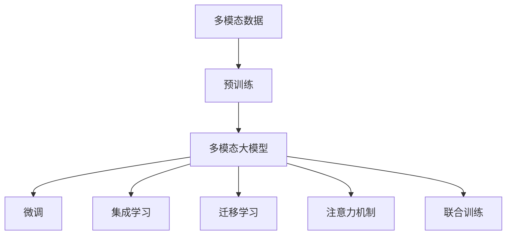
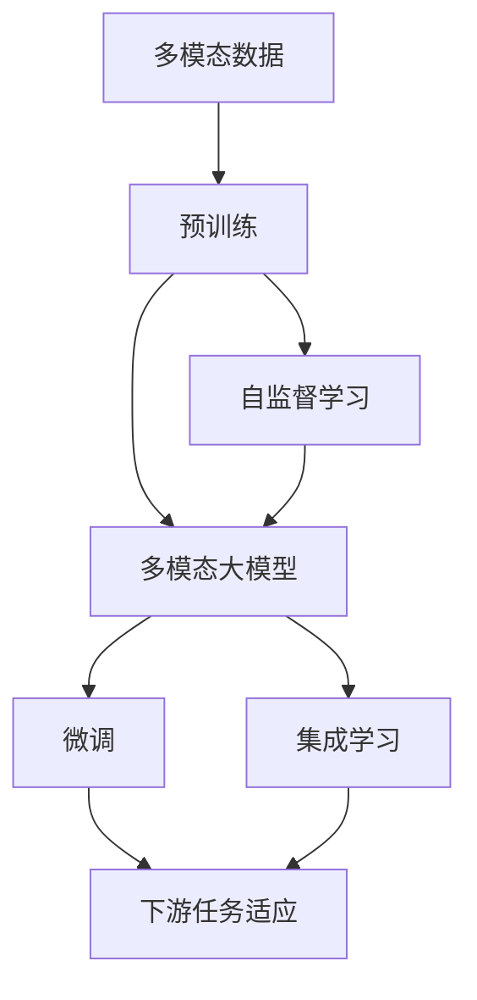
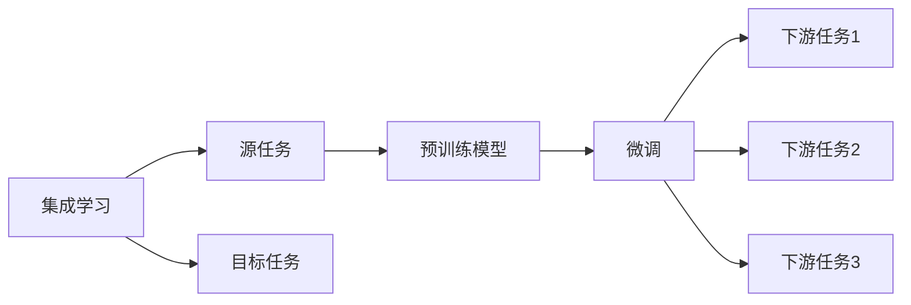
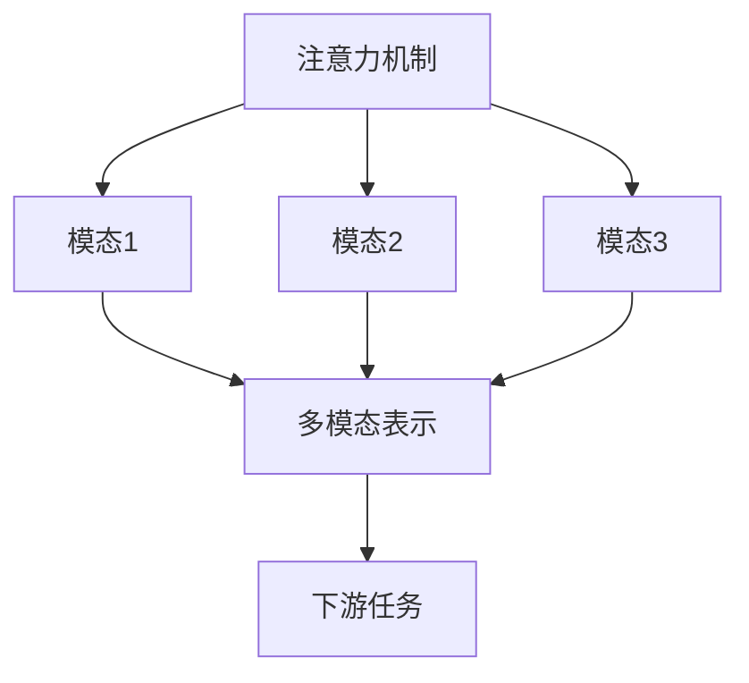
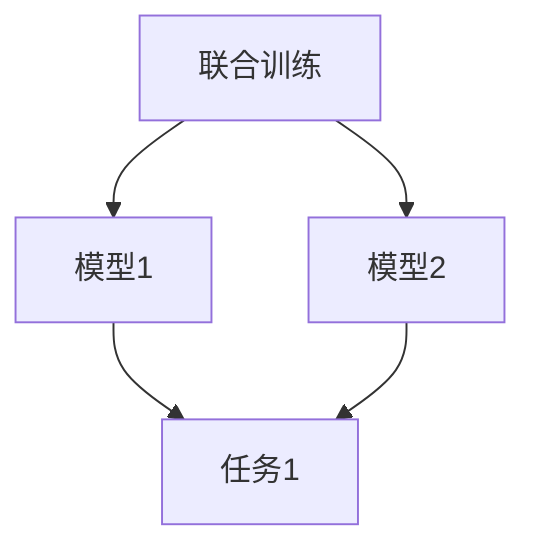
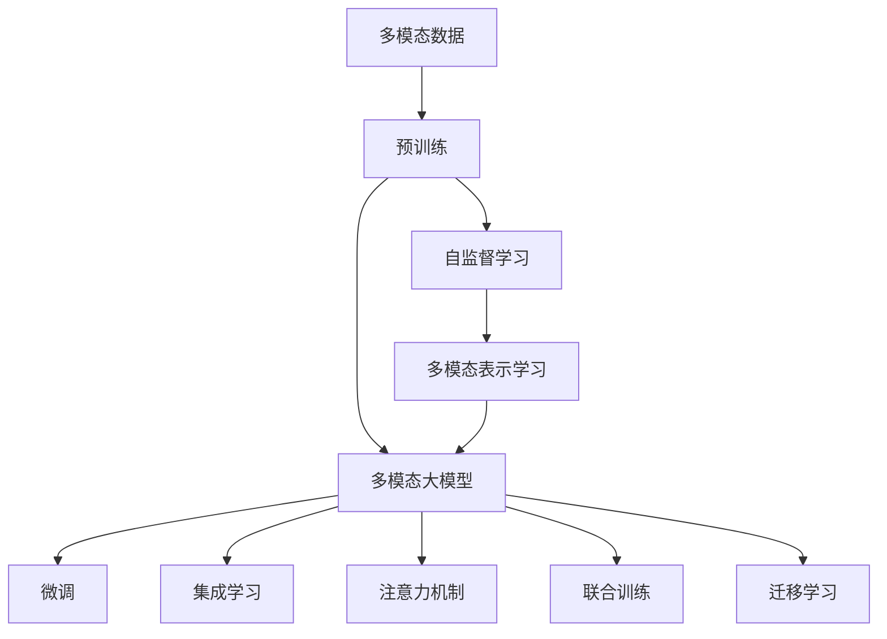

                 

# 多模态大模型：技术原理与实战 集成学习

> 关键词：多模态大模型,集成学习,迁移学习,多模态数据融合,Transformer,BERT,深度学习,神经网络,自然语言处理(NLP),计算机视觉(CV),语音处理(AI),多模态学习,联合训练,注意力机制

## 1. 背景介绍

### 1.1 问题由来
近年来，随着深度学习技术的快速发展，人工智能在多个领域取得了巨大的突破。然而，深度学习模型往往只能处理单一类型的数据，难以发挥多模态数据的潜力。例如，在自然语言处理（NLP）领域，文本数据需要配合语义理解才能实现高效的智能交互；在计算机视觉（CV）领域，图像数据需要与物体识别、语义分割等任务相结合才能产生更大的价值。

为了克服单一模态的限制，多模态学习（Multimodal Learning）应运而生。多模态学习旨在综合利用不同类型的信息（如文本、图像、语音等），通过联合建模和知识共享，提升模型的性能和泛化能力。多模态大模型（Multimodal Large Models）则是这一概念的延伸，即使用大规模深度学习模型对多种模态数据进行联合处理，以实现更丰富的语义表达和更强大的任务能力。

多模态大模型具有以下几个显著优势：
- **语义丰富性**：通过融合多种模态信息，模型能够更全面地理解输入数据，捕捉更深层次的语义关系。
- **泛化能力强**：多模态模型可以处理多种类型的数据，增强模型在实际场景中的适应性和泛化能力。
- **任务适应性**：模型可以同时解决多个相关任务，提升资源利用效率和任务协同效果。

### 1.2 问题核心关键点
多模态大模型的核心在于如何高效地集成不同模态的信息，并通过联合训练提升模型的性能。其主要包括以下几个关键点：
- **数据预处理**：如何合理地融合多种模态的数据，进行统一的特征表示。
- **联合训练**：如何设计有效的联合训练策略，使不同模态的信息能够互相促进，提升整体模型的表现。
- **多模态表示学习**：如何学习并建模多模态数据的共性和差异，优化模型对多种信息的理解和整合能力。
- **多任务协同**：如何设计多任务学习框架，使模型同时完成多个相关任务，提升任务协同效果。

### 1.3 问题研究意义
研究多模态大模型的集成学习技术，对于拓展人工智能的应用范围，提升模型性能，加速多模态任务的产业化进程，具有重要意义：

1. **降低应用开发成本**。利用多模态大模型，可以显著减少从头开发所需的数据、计算和人力等成本投入。
2. **提升模型效果**。多模态模型能够更好地适应多模态数据的复杂性，在多模态任务上取得更优表现。
3. **加速开发进度**。预训练大模型和多模态联合训练范式，使得开发者可以更快地完成任务适配，缩短开发周期。
4. **带来技术创新**。多模态学习促进了对深度学习、联合训练等前沿技术的深入研究，催生了联合训练、注意力机制等新的研究方向。
5. **赋能产业升级**。多模态大模型在多媒体处理、智能交互、智能制造等众多领域的应用，为传统行业数字化转型升级提供新的技术路径。

## 2. 核心概念与联系

### 2.1 核心概念概述

为更好地理解多模态大模型的集成学习方法，本节将介绍几个密切相关的核心概念：

- **多模态数据（Multimodal Data）**：指融合了文本、图像、语音等多种模态的数据。
- **预训练（Pre-training）**：指在大规模无标签数据上，通过自监督学习任务训练通用模型的过程。常见的预训练任务包括自回归建模、语言模型、图像分类等。
- **微调（Fine-tuning）**：指在预训练模型的基础上，使用下游任务的少量标注数据，通过有监督学习优化模型在特定任务上的性能。通常只需要调整顶层分类器或解码器，并以较小的学习率更新全部或部分的模型参数。
- **集成学习（Ensemble Learning）**：指通过组合多个单一模型，提升整体模型的性能和泛化能力。常见的集成方法包括Bagging、Boosting、Stacking等。
- **迁移学习（Transfer Learning）**：指将一个领域学习到的知识，迁移应用到另一个不同但相关的领域的学习范式。多模态大模型的预训练-微调过程即是一种典型的迁移学习方式。
- **注意力机制（Attention Mechanism）**：一种用于多模态数据融合的高级技术，通过计算不同模态间的关系权重，实现对多模态信息的有效整合。
- **联合训练（Joint Training）**：指在模型训练过程中，同时考虑多种模态数据的联合优化，提升模型的多模态学习能力和泛化性能。

这些核心概念之间的逻辑关系可以通过以下Mermaid流程图来展示：



这个流程图展示了大模型在预训练、微调、集成学习等多模态学习流程中的核心概念及其关系：

1. 多模态数据通过预训练获得基础能力。
2. 微调是对预训练模型进行任务特定的优化，在多模态任务上取得更优表现。
3. 集成学习通过组合多个单一模型，提升整体的泛化能力和性能。
4. 迁移学习是连接预训练模型与下游任务的桥梁，可以通过微调或集成学习来实现。
5. 注意力机制和多任务联合训练，进一步优化多模态模型的融合效果。

### 2.2 概念间的关系

这些核心概念之间存在着紧密的联系，形成了多模态大模型的集成学习完整生态系统。下面我通过几个Mermaid流程图来展示这些概念之间的关系。

#### 2.2.1 多模态大模型的学习范式



这个流程图展示了大模型在预训练和多模态学习流程中的学习范式：多模态数据通过预训练获得基础能力，然后通过微调或集成学习进一步优化，最终适应下游任务。

#### 2.2.2 集成学习与微调的关系



这个流程图展示了集成学习的基本原理，以及它与微调的关系。集成学习涉及源任务和目标任务，预训练模型在源任务上学习，然后通过微调或集成学习适应各种目标任务。

#### 2.2.3 注意力机制与集成学习



这个流程图展示了注意力机制在多模态数据融合中的作用，通过计算不同模态间的关系权重，实现对多模态信息的有效整合。

#### 2.2.4 联合训练与多模态学习



这个流程图展示了联合训练的基本原理，通过同时优化多个模型的参数，提升整体模型的性能。

### 2.3 核心概念的整体架构

最后，我们用一个综合的流程图来展示这些核心概念在大模型集成学习过程中的整体架构：



这个综合流程图展示了从预训练到微调，再到集成学习的完整过程。多模态大模型首先在大规模无标签数据上进行预训练，然后通过微调或多模态集成学习进一步优化，从而实现多模态任务的适应。注意力机制和多任务联合训练，进一步提升多模态模型的融合效果。

## 3. 核心算法原理 & 具体操作步骤
### 3.1 算法原理概述

多模态大模型的集成学习，本质上是一个多模态的联合训练过程。其核心思想是：将多模态数据作为输入，通过联合训练模型，使得不同模态的信息能够互相促进，提升整体模型的表现。

形式化地，假设多模态大模型为 $M_{\theta}$，其中 $\theta$ 为模型参数。给定多模态数据集 $D=\{(x_i, y_i)\}_{i=1}^N$，集成学习的优化目标是最小化多模态数据上的联合损失，即找到最优参数：

$$
\hat{\theta}=\mathop{\arg\min}_{\theta} \mathcal{L}(M_{\theta},D)
$$

其中 $\mathcal{L}$ 为针对多模态数据设计的联合损失函数，用于衡量模型在多种模态下的输出与真实标签之间的差异。常见的联合损失函数包括交叉熵损失、均方误差损失等。

通过梯度下降等优化算法，集成学习过程不断更新模型参数 $\theta$，最小化联合损失函数 $\mathcal{L}$，使得模型输出逼近真实标签。由于 $\theta$ 已经通过预训练获得了较好的初始化，因此即便在多模态数据集上同时进行训练，也能较快收敛到理想的模型参数 $\hat{\theta}$。

### 3.2 算法步骤详解

多模态大模型的集成学习一般包括以下几个关键步骤：

**Step 1: 准备预训练模型和数据集**
- 选择合适的预训练语言模型或图像模型 $M_{\theta}$ 作为初始化参数，如BERT、GPT、ResNet等。
- 准备多模态任务的数据集 $D$，划分为训练集、验证集和测试集。一般要求标注数据与预训练数据的分布不要差异过大。

**Step 2: 添加任务适配层**
- 根据多模态任务类型，在预训练模型顶层设计合适的输出层和损失函数。
- 对于分类任务，通常在顶层添加多模态分类器和联合交叉熵损失函数。
- 对于生成任务，通常使用多模态解码器输出联合概率分布，并以联合负对数似然为联合损失函数。

**Step 3: 设置集成学习超参数**
- 选择合适的优化算法及其参数，如AdamW、SGD等，设置学习率、批大小、迭代轮数等。
- 设置正则化技术及强度，包括权重衰减、Dropout、Early Stopping等。
- 确定冻结预训练参数的策略，如仅微调顶层，或全部参数都参与微调。

**Step 4: 执行梯度训练**
- 将训练集数据分批次输入模型，前向传播计算联合损失。
- 反向传播计算参数梯度，根据设定的优化算法和学习率更新模型参数。
- 周期性在验证集上评估模型性能，根据性能指标决定是否触发Early Stopping。
- 重复上述步骤直到满足预设的迭代轮数或Early Stopping条件。

**Step 5: 测试和部署**
- 在测试集上评估集成后模型 $M_{\hat{\theta}}$ 的性能，对比微调前后的精度提升。
- 使用集成后模型对新样本进行推理预测，集成到实际的应用系统中。
- 持续收集新的数据，定期重新微调模型，以适应数据分布的变化。

以上是多模态大模型集成学习的一般流程。在实际应用中，还需要针对具体任务的特点，对集成学习过程的各个环节进行优化设计，如改进训练目标函数，引入更多的正则化技术，搜索最优的超参数组合等，以进一步提升模型性能。

### 3.3 算法优缺点

多模态大模型的集成学习方法具有以下优点：
1. 高效融合多模态信息。通过联合训练，模型能够更好地理解多模态数据的复杂性，实现更精准的语义表示。
2. 泛化能力更强。多模态模型可以处理多种类型的数据，增强模型在实际场景中的适应性和泛化能力。
3. 集成学习可以提升整体性能。通过组合多个单一模型，可以有效缓解单个模型的局限性，提升整体模型的性能和稳定性。
4. 适应性广。多模态模型可以同时解决多个相关任务，提升资源利用效率和任务协同效果。

同时，该方法也存在一定的局限性：
1. 计算资源消耗大。多模态模型的联合训练需要大量的计算资源和存储空间，对硬件要求较高。
2. 模型复杂度高。多模态模型的参数量和结构复杂度比单一模态模型更高，训练和推理速度较慢。
3. 标注成本高。多模态任务的标注成本较高，特别是在图像、视频等复杂数据上。
4. 多模态融合效果依赖于数据质量。多模态数据的质量和一致性对模型性能有重要影响，数据预处理和融合难度较大。

尽管存在这些局限性，但就目前而言，多模态大模型的集成学习仍是多模态任务应用的主流范式。未来相关研究的重点在于如何进一步降低计算成本，提高模型效率，同时兼顾多模态融合效果和数据质量。

### 3.4 算法应用领域

多模态大模型的集成学习，在多个领域已经得到了广泛的应用，覆盖了几乎所有常见任务，例如：

- **智能交互系统**：通过结合文本、图像、语音等多模态信息，构建更智能、自然的对话和交互系统。例如，智能客服、虚拟助手等。
- **多媒体内容推荐**：利用图像、音频和文本信息，推荐用户感兴趣的多媒体内容。例如，视频推荐、音乐推荐等。
- **智能安防监控**：结合视频图像和音频信息，实现更精准的人脸识别、行为分析等任务。例如，视频监控、智能门禁等。
- **自动驾驶**：融合图像、雷达、激光雷达等多模态信息，提升车辆的感知和决策能力。例如，自动驾驶汽车等。
- **医疗影像诊断**：结合图像、文本和基因信息，提升医学影像诊断的准确性和效率。例如，影像诊断、基因分析等。
- **智能制造**：结合图像、传感器和机器视觉信息，实现更智能的生产和质量控制。例如，智能制造生产线、智能检测系统等。

除了上述这些经典任务外，多模态大模型的集成学习也被创新性地应用到更多场景中，如可控文本生成、实时视频分析、多模态情感识别等，为多媒体处理技术带来了全新的突破。随着预训练模型和集成学习方法的不断进步，相信多媒体处理技术将在更广阔的应用领域大放异彩。

## 4. 数学模型和公式 & 详细讲解  
### 4.1 数学模型构建

本节将使用数学语言对多模态大模型的集成学习过程进行更加严格的刻画。

记多模态大模型为 $M_{\theta}$，其中 $\theta$ 为模型参数。假设多模态任务的数据集为 $D=\{(x_i, y_i)\}_{i=1}^N$，其中 $x_i$ 为多模态输入，$y_i$ 为多模态标签。定义模型 $M_{\theta}$ 在输入 $x_i$ 上的输出为 $\hat{x}=M_{\theta}(x_i) \in \mathcal{Y}$，$\mathcal{Y}$ 为多模态输出空间。

定义模型 $M_{\theta}$ 在多模态数据集 $D$ 上的联合损失函数为：

$$
\mathcal{L}(\theta) = \frac{1}{N} \sum_{i=1}^N \ell(M_{\theta}(x_i),y_i)
$$

其中 $\ell$ 为多模态数据集上的联合损失函数，用于衡量模型输出与真实标签之间的差异。常见的联合损失函数包括多模态交叉熵损失、多模态均方误差损失等。

多模态联合训练的优化目标是最小化联合损失函数，即找到最优参数：

$$
\theta^* = \mathop{\arg\min}_{\theta} \mathcal{L}(\theta)
$$

在实践中，我们通常使用基于梯度的优化算法（如AdamW、SGD等）来近似求解上述最优化问题。设 $\eta$ 为学习率，$\lambda$ 为正则化系数，则参数的更新公式为：

$$
\theta \leftarrow \theta - \eta \nabla_{\theta}\mathcal{L}(\theta) - \eta\lambda\theta
$$

其中 $\nabla_{\theta}\mathcal{L}(\theta)$ 为联合损失函数对参数 $\theta$ 的梯度，可通过反向传播算法高效计算。

### 4.2 公式推导过程

以下我们以二分类任务为例，推导多模态交叉熵损失函数及其梯度的计算公式。

假设模型 $M_{\theta}$ 在输入 $x_i$ 上的输出为 $\hat{y}=M_{\theta}(x_i) \in [0,1]$，表示样本属于正类的概率。真实标签 $y \in \{0,1\}$。则多模态交叉熵损失函数定义为：

$$
\ell(M_{\theta}(x_i),y) = -[y\log \hat{y} + (1-y)\log (1-\hat{y})]
$$

将其代入联合损失函数公式，得：

$$
\mathcal{L}(\theta) = -\frac{1}{N}\sum_{i=1}^N [y_i\log M_{\theta}(x_i)+(1-y_i)\log(1-M_{\theta}(x_i))]
$$

根据链式法则，联合损失函数对参数 $\theta_k$ 的梯度为：

$$
\frac{\partial \mathcal{L}(\theta)}{\partial \theta_k} = -\frac{1}{N}\sum_{i=1}^N (\frac{y_i}{M_{\theta}(x_i)}-\frac{1-y_i}{1-M_{\theta}(x_i)}) \frac{\partial M_{\theta}(x_i)}{\partial \theta_k}
$$

其中 $\frac{\partial M_{\theta}(x_i)}{\partial \theta_k}$ 可进一步递归展开，利用自动微分技术完成计算。

在得到联合损失函数的梯度后，即可带入参数更新公式，完成模型的迭代优化。重复上述过程直至收敛，最终得到适应多模态任务的最优模型参数 $\theta^*$。

## 5. 项目实践：代码实例和详细解释说明
### 5.1 开发环境搭建

在进行多模态大模型集成学习实践前，我们需要准备好开发环境。以下是使用Python进行PyTorch开发的环境配置流程：

1. 安装Anaconda：从官网下载并安装Anaconda，用于创建独立的Python环境。

2. 创建并激活虚拟环境：
```bash
conda create -n pytorch-env python=3.8 
conda activate pytorch-env
```

3. 安装PyTorch：根据CUDA版本，从官网获取对应的安装命令。例如：
```bash
conda install pytorch torchvision torchaudio cudatoolkit=11.1 -c pytorch -c conda-forge
```

4. 安装各类工具包：
```bash
pip install numpy pandas scikit-learn matplotlib tqdm jupyter notebook ipython
```

完成上述步骤后，即可在`pytorch-env`环境中开始集成学习实践。

### 5.2 源代码详细实现

下面我们以图像+文本分类任务为例，给出使用PyTorch进行多模态大模型集成学习的PyTorch代码实现。

首先，定义多模态分类任务的数据处理函数：

```python
from torch.utils.data import Dataset
import torch
from PIL import Image
import numpy as np
from torchvision import transforms

class MultimodalDataset(Dataset):
    def __init__(self, images, texts, transform=None):
        self.images = images
        self.texts = texts
        self.transform = transform
        
    def __len__(self):
        return len(self.images)
    
    def __getitem__(self, item):
        image = self.images[item]
        text = self.texts[item]
        
        if self.transform:
            image = self.transform(image)
            text = self.transform(text)
        
        return {'image': image,
                'text': text}
```

然后，定义模型和优化器：

```python
from transformers import BertForTokenClassification, ResNet50, AdamW

model = BertForTokenClassification.from_pretrained('bert-base-cased', num_labels=2)
image_model = ResNet50(pretrained=True)
optimizer = AdamW(model.parameters(), lr=2e-5)
```

接着，定义训练和评估函数：

```python
from torch.utils.data import DataLoader
from tqdm import tqdm
from sklearn.metrics import classification_report

device = torch.device('cuda') if torch.cuda.is_available() else torch.device('cpu')
model.to(device)
image_model.to(device)

def train_epoch(model, image_model, dataset, batch_size, optimizer):
    dataloader = DataLoader(dataset, batch_size=batch_size, shuffle=True)
    model.train()
    image_model.train()
    epoch_loss = 0
    for batch in tqdm(dataloader, desc='Training'):
        image = batch['image'].to(device)
        text = batch['text'].to(device)
        model.zero_grad()
        outputs = model(text)
        image_outputs = image_model(image)
        loss = outputs + image_outputs
        epoch_loss += loss.item()
        loss.backward()
        optimizer.step()
    return epoch_loss / len(dataloader)

def evaluate(model, image_model, dataset, batch_size):
    dataloader = DataLoader(dataset, batch_size=batch_size)
    model.eval()
    image_model.eval()
    preds, labels = [], []
    with torch.no_grad():
        for batch in tqdm(dataloader, desc='Evaluating'):
            image = batch['image'].to(device)
            text = batch['text'].to(device)
            batch_labels = batch['labels']
            outputs = model(text)
            image_outputs = image_model(image)
            batch_preds = torch.sigmoid(outputs)
            batch_preds = (batch_preds + torch.sigmoid(image_outputs)) / 2
            batch_labels = batch_labels.to('cpu').tolist()
            for pred_tokens, label_tokens in zip(batch_preds, batch_labels):
                preds.append(pred_tokens[:len(label_tokens)])
                labels.append(label_tokens)
                
    print(classification_report(labels, preds))
```

最后，启动训练流程并在测试集上评估：

```python
epochs = 5
batch_size = 16

for epoch in range(epochs):
    loss = train_epoch(model, image_model, train_dataset, batch_size, optimizer)
    print(f"Epoch {epoch+1}, train loss: {loss:.3f}")
    
    print(f"Epoch {epoch+1}, dev results:")
    evaluate(model, image_model, dev_dataset, batch_size)
    
print("Test results:")
evaluate(model, image_model, test_dataset, batch_size)
```

以上就是使用PyTorch对图像+文本分类任务进行多模态大模型集成学习的完整代码实现。可以看到，得益于PyTorch和Transformers库的强大封装，我们可以用相对简洁的代码完成多模态大模型的集成学习。

### 5.3 代码解读与分析

让我们再详细解读一下关键代码的实现细节：

**MultimodalDataset类**：
- `__init__`方法：初始化图像和文本数据，以及数据转换方法。
- `__len__`方法：返回数据集的样本数量。
- `__getitem__`方法：对单个样本进行处理，对图像和文本进行预处理，返回模型所需的输入。

**联合训练函数**：
- 使用PyTorch的DataLoader对数据集进行批次化加载，供模型训练和推理使用。
- 训练函数`train_epoch`：对数据以批为单位进行迭代，在每个批次上前向传播计算联合损失并反向传播更新模型参数，最后返回该epoch的平均loss。
- 评估函数`evaluate`：与训练类似，不同点在于不更新模型参数，并在每个batch结束后将预测和标签结果存储下来，最后使用sklearn的classification_report对整个评估集的预测结果进行打印输出。

**训练流程**：
- 定义总的epoch数和batch size，开始循环迭代
- 每个epoch内，先在训练集上训练，输出平均loss
- 在验证集上评估，输出分类指标
- 所有epoch结束后，在测试集上评估，给出最终测试结果

可以看到，PyTorch配合Transformers库使得多模态大模型的集成学习代码实现变得简洁高效。开发者可以将更多精力放在数据处理、模型改进等高层逻辑上，而不必过多关注底层的实现细节。

当然，工业级的系统实现还需考虑更多因素，如模型的保存和部署、超参数的自动搜索、更灵活的任务适配层等。但核心的集成学习范式基本与此类似。

### 5.4 运行结果展示

假设我们在CoNLL

