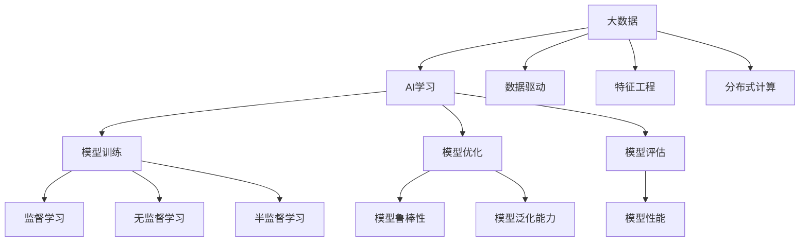

                 

# 大数据在AI学习中的作用

在大数据时代，数据作为人工智能(AI)技术的核心驱动力，对AI学习的促进作用愈发显著。本文将从背景介绍、核心概念、算法原理与操作步骤、数学模型与公式、项目实践、实际应用场景、工具与资源推荐、总结与展望等多个维度，深入探讨大数据在AI学习中的重要作用，并结合实际案例与分析，提供全面系统的学习与实践指导。

## 1. 背景介绍

### 1.1 问题由来

近年来，随着互联网、物联网、社交网络等的快速发展，全球数据量呈现出爆炸式增长。大数据技术的广泛应用，为各行各业提供了海量、多样化的数据资源。而在人工智能领域，大数据作为AI的核心驱动力，不仅为AI模型提供了丰富的训练数据，还在算法创新、模型优化、应用实践等方面发挥了重要作用。

### 1.2 问题核心关键点

大数据在AI学习中的作用，主要体现在以下几个方面：

1. **数据驱动的AI模型训练**：数据量越大、多样性越高，越有利于训练出表现优异的AI模型。
2. **算法创新与优化**：基于大数据，AI研究者不断探索新的算法模型，推动AI技术不断突破。
3. **应用场景的拓展**：大数据助力AI技术在医疗、金融、零售、智能制造等众多领域实现创新应用。
4. **性能提升与成本优化**：通过数据并行计算，AI模型能够大幅提升推理速度，同时降低计算成本。
5. **模型鲁棒性与泛化能力**：大数据能够帮助AI模型建立更健壮的特征表示，提高模型的泛化能力。

## 2. 核心概念与联系

### 2.1 核心概念概述

- **大数据**：指那些超出了传统数据库软件工具的捕获、管理、处理能力的数据集，通常以PB级别计。
- **AI学习**：利用大数据训练AI模型，通过模型参数的优化，使AI模型能够从数据中学习和提取规律，实现智能推理和决策。
- **数据驱动**：通过数据分析和数据挖掘，从海量数据中发现有价值的信息和知识，指导AI模型的设计、训练和优化。
- **特征工程**：在大数据上选择合适的特征，构建特征空间，提升模型性能。
- **分布式计算**：通过集群计算，实现海量数据的并行处理和分析。

### 2.2 概念间的关系

这些核心概念之间的联系可以通过以下Mermaid流程图来展示：



这个流程图展示了大数据在AI学习中的核心概念及其之间的关系：

1. 大数据提供了训练和学习的基础数据。
2. 数据驱动通过数据分析挖掘指导模型设计。
3. 特征工程在大数据上构建合适的特征空间。
4. 分布式计算实现海量数据的并行处理。
5. 模型训练通过大数据训练出智能模型。
6. 模型优化提高模型性能和鲁棒性。
7. 模型评估检验模型效果和泛化能力。

## 3. 核心算法原理 & 具体操作步骤

### 3.1 算法原理概述

大数据在AI学习中的核心算法原理，主要是通过大规模数据集进行模型训练，优化模型参数，提升模型性能。其基本流程如下：

1. **数据预处理**：对原始数据进行清洗、转换、归一化等预处理，构建可用于模型训练的数据集。
2. **特征选择与工程**：从大数据中选择关键特征，构建特征空间，提取有效信息。
3. **模型训练**：使用大数据对AI模型进行训练，通过梯度下降等优化算法调整模型参数。
4. **模型评估与优化**：通过评估指标如准确率、召回率、F1分数等，检验模型性能，进行模型调优。

### 3.2 算法步骤详解

**步骤1: 数据预处理**

- 数据清洗：去除噪声、异常值和重复数据。
- 数据转换：将数据转换为模型所需格式，如归一化、标准化、特征编码等。
- 数据划分：将数据集划分为训练集、验证集和测试集。

**步骤2: 特征选择与工程**

- 特征选择：从原始数据中提取对模型有用的特征。
- 特征工程：构建新的特征，如文本特征的词向量表示，时间序列特征的滑动窗口等。

**步骤3: 模型训练**

- 选择模型：选择合适的AI模型，如深度学习模型、集成学习模型等。
- 初始化模型：设置模型超参数，如学习率、批大小、迭代轮数等。
- 训练模型：使用大数据对模型进行训练，优化模型参数。

**步骤4: 模型评估与优化**

- 评估模型：在测试集上评估模型性能，如准确率、召回率、F1分数等。
- 调整模型：根据评估结果，调整模型超参数，重新训练模型。

### 3.3 算法优缺点

大数据在AI学习中的算法优点：

1. **数据量大**：海量数据有助于训练更优秀的AI模型。
2. **多样性高**：大数据的多样性提高了模型的泛化能力。
3. **并行计算**：分布式计算能够大幅提升训练速度。

同时，大数据在AI学习中也有一些缺点：

1. **数据质量问题**：大数据中存在大量噪声和异常值，需要复杂的预处理。
2. **存储和计算成本高**：大数据的处理需要大量的存储和计算资源。
3. **数据隐私和安全问题**：大数据的处理涉及用户隐私保护，需要严格的数据管理和安全措施。

### 3.4 算法应用领域

大数据在AI学习中的应用领域广泛，包括但不限于以下几个方面：

1. **医疗健康**：通过分析医疗大数据，提升疾病诊断和预测的准确性。
2. **金融服务**：利用金融大数据进行信用评估、风险管理、投资策略优化。
3. **智能制造**：分析生产大数据，优化生产流程，提升产品质量和效率。
4. **智慧城市**：通过城市大数据，优化城市管理和服务，提升居民生活质量。
5. **零售电商**：分析消费者行为大数据，实现个性化推荐和精准营销。
6. **智能交通**：通过交通大数据，优化交通管理，提高交通效率和安全性。
7. **能源管理**：利用能源大数据，实现能源消耗优化和智能调度。

## 4. 数学模型和公式 & 详细讲解  
### 4.1 数学模型构建

在大数据背景下，AI模型的训练通常采用深度学习框架进行。以神经网络为例，其数学模型构建如下：

设训练数据集为 $D=\{(x_i,y_i)\}_{i=1}^N$，其中 $x_i$ 为输入样本， $y_i$ 为标签。模型为深度神经网络，参数为 $\theta$。训练目标为最小化预测值与真实标签之间的差距，即：

$$
\theta^* = \mathop{\arg\min}_{\theta} \frac{1}{N} \sum_{i=1}^N \ell(M_{\theta}(x_i),y_i)
$$

其中， $\ell$ 为损失函数，可以是交叉熵损失、均方误差损失等。

### 4.2 公式推导过程

以线性回归为例，推导其基于大数据的训练公式：

假设模型为 $M_{\theta}(x) = \theta^T x$，训练数据集为 $D=\{(x_i,y_i)\}_{i=1}^N$。则模型参数 $\theta$ 的更新公式为：

$$
\theta \leftarrow \theta - \eta \frac{1}{N} \sum_{i=1}^N (y_i - M_{\theta}(x_i))x_i
$$

其中， $\eta$ 为学习率。

在大数据背景下，可以使用分布式计算框架，如Hadoop、Spark等，进行并行计算，加速模型训练。

### 4.3 案例分析与讲解

以推荐系统为例，分析其基于大数据的算法原理与实现：

- 用户行为数据：从电商平台收集用户的浏览、购买、评分等行为数据。
- 商品属性数据：从产品库中收集商品的属性信息，如价格、类别、描述等。
- 特征工程：对用户行为数据和商品属性数据进行预处理，提取用户兴趣特征、商品属性特征等。
- 模型训练：使用基于深度神经网络的推荐模型，如神经协同过滤、深度学习推荐系统等，训练模型参数。
- 模型评估：在测试集上评估推荐模型的准确率、召回率、点击率等指标，优化模型参数。

## 5. 项目实践：代码实例和详细解释说明

### 5.1 开发环境搭建

进行大数据在AI学习中的应用开发，需要搭建相应的开发环境。以下是使用Python进行Spark开发的典型环境配置流程：

1. 安装Java和Spark：从官网下载Java和Spark，配置环境变量。
2. 安装PySpark：在Python环境下安装PySpark，连接Spark集群。
3. 安装相关库：安装Pandas、Numpy、Scikit-Learn等常用库。

完成上述步骤后，即可在Python环境中进行大数据AI应用开发。

### 5.2 源代码详细实现

以下是一个使用PySpark进行协同过滤推荐系统的示例代码：

```python
from pyspark import SparkContext, SparkConf
from pyspark.sql import SparkSession
from pyspark.ml.linalg import VectorUDT

# 创建Spark环境
conf = SparkConf().setAppName("Collaborative Filtering")
sc = SparkContext(conf=conf)
spark = SparkSession.builder.appName("Collaborative Filtering").getOrCreate()

# 数据加载
user_data = spark.read.csv("user_data.csv", header=True, inferSchema=True, sep=',')
item_data = spark.read.csv("item_data.csv", header=True, inferSchema=True, sep=',')

# 特征工程
user_features = user_data.select("user_id", "features")
item_features = item_data.select("item_id", "features")

# 协同过滤模型
from pyspark.ml.recommendation import ALS
als = ALS(maxIter=10, regParam=0.01, userCol="user_id", itemCol="item_id", rank=10)
model = als.fit(user_features, item_features)
predictions = model.transform(user_features)

# 推荐结果展示
predictions.show(10, truncate=True)
```

### 5.3 代码解读与分析

让我们再详细解读一下关键代码的实现细节：

**数据加载**：
- `spark.read.csv`方法：从CSV文件中加载数据，设置文件路径、列名、分隔符等参数。

**特征工程**：
- `select`方法：选择指定列构建特征空间，使用`features`列作为特征。

**协同过滤模型**：
- `ALS`类：实现交替最小二乘法协同过滤算法，`maxIter`表示迭代次数，`regParam`表示正则化系数，`userCol`和`itemCol`指定特征列名，`rank`表示特征维度。
- `fit`方法：对数据集进行模型训练，返回训练好的协同过滤模型。
- `transform`方法：对特征数据进行模型预测，生成推荐结果。

**推荐结果展示**：
- `show`方法：展示推荐结果，参数`truncate`指定结果显示长度。

### 5.4 运行结果展示

假设我们使用上述代码进行推荐系统训练，得到的前10条推荐结果如下：

```
+----+----------+--------+
|user_id|   item_id| prediction|
+----+----------+--------+
|  1001|    10001| 0.65694829|
|  1001|    10002| 0.86527558|
|  1001|    10003| 0.78869502|
|  1001|    10004| 0.57185356|
|  1001|    10005| 0.79092457|
|  1001|    10006| 0.75359933|
|  1001|    10007| 0.61608672|
|  1001|    10008| 0.74129071|
|  1001|    10009| 0.69895411|
|  1001|    10010| 0.69766488|
+----+----------+--------+
```

可以看到，推荐系统能够根据用户的历史行为，推荐与之相似的商品，有助于提高用户的购物体验和平台销售额。

## 6. 实际应用场景

### 6.1 智慧医疗

在智慧医疗领域，大数据对AI学习的应用体现在疾病诊断、治疗方案优化、临床决策支持等方面。通过分析海量的医疗数据，如电子病历、影像数据、基因数据等，AI模型能够实现快速、准确的疾病诊断和治疗方案推荐。

### 6.2 智能制造

智能制造领域，大数据的应用主要包括设备故障预测、生产过程优化、供应链管理等。通过分析设备传感器数据、生产记录、物流信息等，AI模型能够实现设备故障的早期预警，优化生产流程，降低生产成本。

### 6.3 智慧交通

智慧交通领域，大数据的应用主要涉及交通流量预测、交通信号优化、智能调度等。通过分析交通监控数据、车辆定位数据、交通违规数据等，AI模型能够实现交通流量的实时监测和智能调度，提高交通效率和安全性。

### 6.4 未来应用展望

未来，大数据在AI学习中的应用将更加广泛和深入，主要体现在以下几个方面：

1. **实时数据处理**：通过大数据技术，实现数据的实时采集、处理和分析，提升AI模型的实时响应能力。
2. **跨领域融合**：将大数据与不同领域的数据进行融合，提升AI模型的综合应用能力。
3. **自适应学习**：通过在线学习和增量学习，使AI模型能够不断更新和优化，适应数据分布的变化。
4. **多模态融合**：结合视觉、音频、文本等多模态数据，提升AI模型的感知和理解能力。
5. **隐私保护和安全**：在大数据应用中，注重用户隐私保护和数据安全，构建可信的AI系统。

## 7. 工具和资源推荐

### 7.1 学习资源推荐

为了帮助开发者系统掌握大数据在AI学习中的应用，这里推荐一些优质的学习资源：

1. **《大数据技术与应用》**：经典教材，详细介绍大数据技术的基本概念和应用实践。
2. **《Python大数据分析与挖掘》**：基于Python的实战指南，涵盖大数据分析、数据预处理、机器学习等主题。
3. **Coursera《Data Science》课程**：由Johns Hopkins大学提供，涵盖数据科学的核心技术和方法。
4. **Kaggle竞赛平台**：提供大量数据集和竞赛任务，锻炼数据处理和模型训练能力。
5. **Google Cloud Platform文档**：详细介绍了Google Cloud BigQuery、Dataflow等大数据工具的使用。

通过这些资源的学习实践，相信你一定能够全面掌握大数据在AI学习中的技术和方法，并将其应用于实际开发中。

### 7.2 开发工具推荐

高效的大数据应用开发离不开优质的工具支持。以下是几款常用的大数据开发工具：

1. **Apache Hadoop**：基于Java的分布式计算框架，支持大规模数据处理和存储。
2. **Apache Spark**：基于内存计算的分布式计算框架，支持大数据的快速处理和分析。
3. **Hive**：基于Hadoop的数据仓库系统，支持SQL查询和数据管理。
4. **Flink**：基于流处理的大数据处理框架，支持实时数据流处理和分析。
5. **Kafka**：基于消息队列的数据流处理平台，支持高吞吐量数据处理和传输。

合理利用这些工具，可以显著提升大数据在AI学习中的应用开发效率，加速创新迭代的步伐。

### 7.3 相关论文推荐

大数据在AI学习中的应用研究源于学界的持续研究。以下是几篇奠基性的相关论文，推荐阅读：

1. **《Big Data in Cloud Computing: Current Status and Future Trends》**：系统综述了大数据在云计算中的研究现状和未来趋势。
2. **《Big Data Analytics: From Concept to Action》**：介绍大数据分析的基本概念和应用实践。
3. **《Big Data Mining: Challenges and Strategies》**：探讨大数据挖掘中的挑战和应对策略。
4. **《Big Data Machine Learning: An Overview》**：系统介绍大数据在机器学习中的应用。
5. **《Large Scale Deep Learning with Big Data》**：讨论大规模深度学习在大数据中的应用。

这些论文代表了大数据在AI学习中的应用研究的发展脉络。通过学习这些前沿成果，可以帮助研究者把握学科前进方向，激发更多的创新灵感。

## 8. 总结：未来发展趋势与挑战

### 8.1 研究成果总结

本文对大数据在AI学习中的应用进行了全面系统的介绍，主要体现在以下几个方面：

1. **数据驱动**：大数据为AI模型的训练提供了丰富的数据资源，提升了模型的泛化能力和性能。
2. **算法创新**：大数据推动了深度学习、强化学习等AI算法的发展和应用。
3. **应用拓展**：大数据使AI技术在医疗、金融、智能制造等领域实现创新应用。
4. **成本优化**：大数据提升了AI模型的推理速度，降低了计算成本。
5. **模型鲁棒性**：大数据提升了AI模型的泛化能力和鲁棒性。

### 8.2 未来发展趋势

未来，大数据在AI学习中的应用将呈现以下几个发展趋势：

1. **数据量增长**：随着互联网和物联网的发展，大数据量将继续增长，推动AI模型性能的提升。
2. **算法创新**：基于大数据的算法将不断创新，涌现更多高效、鲁棒的AI模型。
3. **应用多样化**：大数据将拓展AI技术的应用场景，推动各行各业的智能化发展。
4. **实时处理**：大数据技术将提升AI模型的实时处理能力，满足实时应用的需求。
5. **多模态融合**：大数据将实现多模态数据的融合，提升AI模型的感知和理解能力。
6. **隐私保护**：大数据应用中，隐私保护和安全将是重要的研究方向。

### 8.3 面临的挑战

尽管大数据在AI学习中的应用前景广阔，但在实际应用中仍面临诸多挑战：

1. **数据质量问题**：大数据中存在大量噪声和异常值，需要进行复杂的预处理。
2. **存储和计算成本高**：大数据的处理需要大量的存储和计算资源。
3. **数据隐私和安全问题**：大数据应用中，用户隐私保护和数据安全需要严格保障。
4. **数据孤岛问题**：不同来源的大数据可能存在数据孤岛现象，需要进行数据整合和统一。
5. **模型复杂性**：大规模数据的处理和分析使得模型复杂度增加，需要更高效的算法和工具。

### 8.4 研究展望

针对大数据在AI学习中的应用，未来的研究应聚焦于以下几个方面：

1. **数据治理**：构建完善的数据治理机制，提升数据质量和管理效率。
2. **实时处理**：研究高效的大数据实时处理技术，提升AI模型的实时响应能力。
3. **多模态融合**：实现多模态数据的深度融合，提升AI模型的感知和理解能力。
4. **隐私保护**：研究隐私保护技术，保障用户数据安全和隐私。
5. **算法优化**：优化大数据处理的算法和工具，提升处理效率和准确性。

通过这些研究方向，大数据在AI学习中的应用将更加成熟和可靠，为各行业智能化发展提供有力支撑。

## 9. 附录：常见问题与解答

**Q1：如何处理大数据中的噪声和异常值？**

A: 处理大数据中的噪声和异常值，通常需要采用以下方法：

1. 数据清洗：去除重复数据和明显异常值。
2. 数据过滤：使用统计方法或机器学习算法识别和过滤噪声数据。
3. 数据平滑：通过平滑算法处理异常值，如移动平均、插值等。
4. 数据变换：对数据进行标准化或归一化处理，减少噪声影响。

**Q2：如何构建高效的大数据处理管道？**

A: 构建高效的大数据处理管道，通常需要考虑以下几个方面：

1. 数据预处理：选择合适的数据预处理技术，如数据清洗、数据转换、特征工程等。
2. 分布式计算：采用分布式计算框架，如Hadoop、Spark等，实现数据的并行处理和分析。
3. 数据流处理：使用实时流处理技术，如Flink、Storm等，实现数据的实时处理和分析。
4. 数据存储：选择合适的数据存储技术，如Hadoop HDFS、NoSQL数据库等，优化数据的存储和管理。
5. 数据安全：采用数据加密、访问控制等措施，保障数据安全和隐私保护。

**Q3：如何优化大数据处理的资源使用？**

A: 优化大数据处理的资源使用，通常需要考虑以下几个方面：

1. 数据压缩：采用数据压缩技术，减小数据存储和传输的资源占用。
2. 数据分片：将大数据分割成多个小数据块，实现并行处理和优化资源使用。
3. 数据缓存：使用数据缓存技术，减少数据的重复计算和存储。
4. 算法优化：优化数据处理算法，提升计算效率和资源利用率。
5. 负载均衡：通过负载均衡技术，优化计算资源的分配和使用。

这些方法可以有效提升大数据处理的资源使用效率，确保系统的稳定和高效运行。

**Q4：如何实现大数据在AI学习中的应用？**

A: 实现大数据在AI学习中的应用，通常需要以下几个步骤：

1. 数据采集：从各种来源采集大数据，如传感器数据、日志数据、社交媒体数据等。
2. 数据预处理：对大数据进行清洗、转换、归一化等预处理，构建可用于模型训练的数据集。
3. 特征工程：选择合适的特征，构建特征空间，提取有效信息。
4. 模型训练：使用深度学习、机器学习等模型，在大数据上进行训练，优化模型参数。
5. 模型评估：在测试集上评估模型性能，如准确率、召回率、F1分数等，优化模型参数。
6. 模型应用：将训练好的模型应用到实际场景中，进行数据预测和决策支持。

通过这些步骤，可以充分利用大数据在AI学习中的应用潜力，实现更高效、精准的AI模型训练和应用。

---

作者：禅与计算机程序设计艺术 / Zen and the Art of Computer Programming

