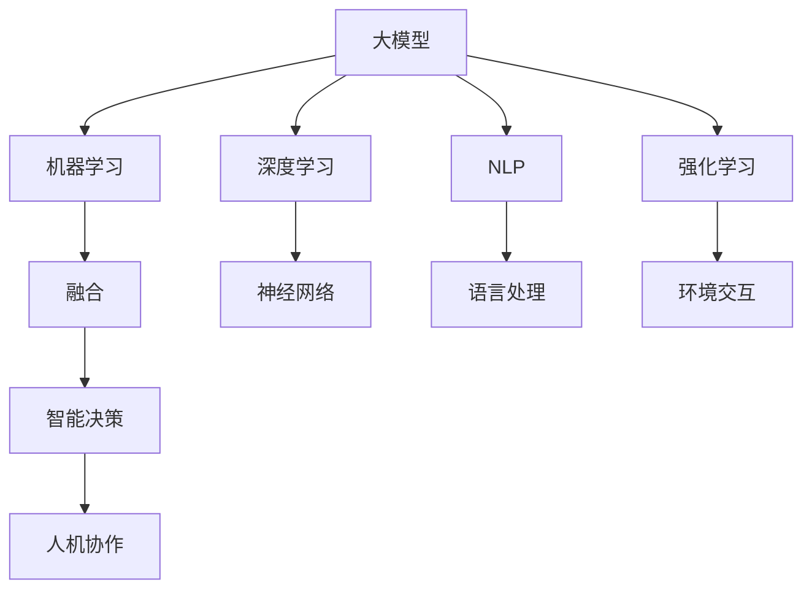
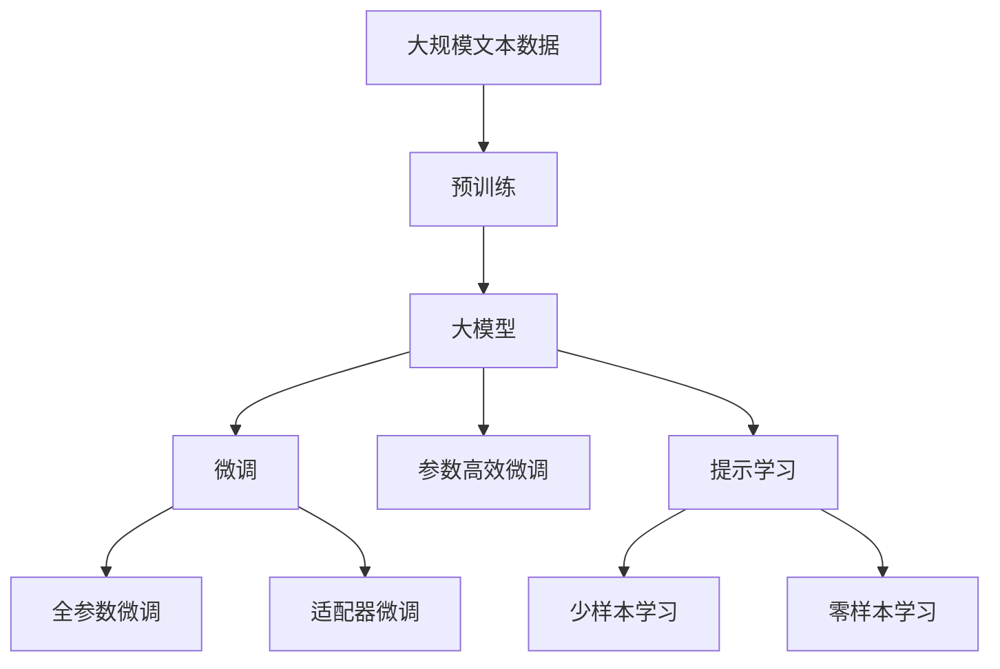
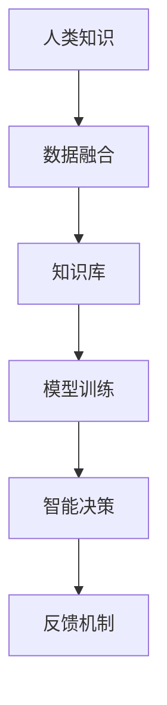
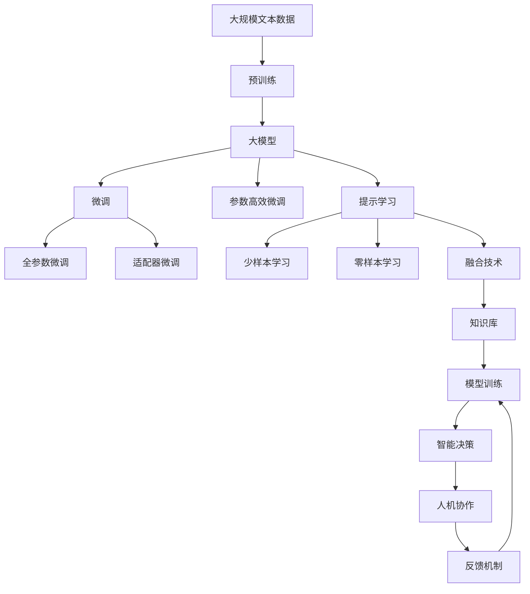

                 

# 大模型的人机协作:人工智能与人类智能的融合

> 关键词：
>
> - 大模型
> - 人机协作
> - 人工智能
> - 人类智能
> - 融合
> - 机器学习
> - 深度学习
> - 自然语言处理
> - 强化学习
> - 智能决策
> - 人工智能伦理

## 1. 背景介绍

### 1.1 问题由来
随着人工智能(AI)技术的快速发展，深度学习模型在处理大规模数据和复杂问题上展现了强大的能力。然而，这些模型虽然在自动化任务中表现优异，但在解决具有高度情境感知、灵活性、创造性和伦理判断等人类智能特质的任务时，仍存在明显不足。特别是在需要人类直觉、常识判断和情感理解的应用场景中，目前的大模型通常难以提供满意的答案。

为了更好地融合人类智能，许多研究人员和实践者开始探索如何将AI与人类智能协作，提升系统在情感、常识、道德判断等方面的表现。大模型的人机协作成为近年来AI研究的热点之一，旨在利用人类智能和AI的各自优势，构建更为全面、高效的智能系统。

### 1.2 问题核心关键点
本节将探讨如何在大模型与人类智能之间实现有效协作，具体包括以下几个关键点：

- **任务分解与分配**：明确AI和人类各自负责的任务类型和决策阶段，避免重复劳动，提高效率。
- **数据融合与共享**：通过数据共享和融合，利用人类的直觉和常识来丰富AI模型的知识库，增强其理解能力。
- **交互与反馈**：通过交互与反馈机制，动态调整AI行为，使其更加符合人类的期望。
- **伦理与隐私**：确保人机协作过程中的数据隐私和安全，遵守伦理规范，避免歧视和偏见。
- **模型透明性与可解释性**：提升AI模型的可解释性，使其决策过程可追溯、可理解，增强人类对系统的信任。

### 1.3 问题研究意义
大模型与人机协作的研究，对于推动AI技术的发展，提升其在复杂情境下的智能表现，构建具有高度人性化特征的智能系统，具有重要意义：

1. **提升智能决策质量**：结合人类的直觉、常识和经验，提高AI系统在复杂决策场景下的表现，避免机械化处理带来的局限。
2. **增强系统适应性**：通过与人类互动，AI系统能够更好地适应不同情境和用户需求，提高系统的灵活性和鲁棒性。
3. **加速知识创新**：通过人机协作，AI系统能够更高效地获取和应用人类知识，加速知识传播和创新。
4. **促进伦理规范**：在人机协作中引入伦理考量，确保AI系统的决策符合社会价值观和道德标准。
5. **推动AI普及应用**：增强AI系统的透明性和可解释性，提升用户对其的信任度，推动AI技术在各行业的广泛应用。

## 2. 核心概念与联系

### 2.1 核心概念概述

为更好地理解人机协作中的大模型，本节将介绍几个密切相关的核心概念：

- **大模型**：如GPT、BERT等预训练模型，通过在大规模无标签数据上进行预训练，学习到丰富的语言知识和常识，具有强大的语言理解和生成能力。
- **人机协作**：通过将AI技术与人类智能相结合，构建协同工作的智能系统，提高系统的智能化水平。
- **融合**：结合AI与人类智能的优势，形成互补，提升系统在情感、常识、伦理判断等方面的表现。
- **机器学习**：通过数据驱动的方式，使机器自动改进算法，提升性能。
- **深度学习**：利用神经网络结构，处理复杂、非线性的数据。
- **自然语言处理(NLP)**：使计算机能够理解和处理人类语言。
- **强化学习**：通过与环境的交互，学习最优策略。
- **智能决策**：基于数据和模型，做出最优决策。
- **人工智能伦理**：在AI系统的开发和应用中，考虑伦理道德问题。

这些概念之间的逻辑关系可以通过以下Mermaid流程图来展示：



这个流程图展示了不同AI技术之间的联系，以及它们如何共同作用于人机协作系统。

### 2.2 概念间的关系

这些核心概念之间存在着紧密的联系，形成了人机协作中的大模型的完整生态系统。下面我们通过几个Mermaid流程图来展示这些概念之间的关系。

#### 2.2.1 大模型的学习范式



这个流程图展示了大模型的学习流程，从预训练到微调，再到零样本和少样本学习。

#### 2.2.2 人机协作中的决策过程


这个流程图展示了人机协作中的决策过程，从输入预处理到大模型推理，再到人类干预和系统调整。

#### 2.2.3 融合技术的应用



这个流程图展示了融合技术在知识库构建和模型训练中的应用。

### 2.3 核心概念的整体架构

最后，我们用一个综合的流程图来展示这些核心概念在人机协作中的整体架构：



这个综合流程图展示了从预训练到微调，再到融合技术应用和智能决策的完整过程。人机协作系统通过融合技术，利用大模型的强大能力和人类的直觉判断，实现最优决策。

## 3. 核心算法原理 & 具体操作步骤
### 3.1 算法原理概述

大模型与人机协作的核心算法原理，主要是通过机器学习、深度学习和强化学习等技术，结合数据融合和人类干预，提升系统在复杂情境下的决策能力。具体步骤如下：

1. **数据预处理**：将原始数据进行清洗、标注和标准化，为模型训练和推理提供基础。
2. **模型训练**：利用预训练模型和任务数据，进行微调或训练，学习特定任务的表示能力。
3. **知识融合**：通过数据共享和融合，将人类的知识、经验和直觉融入大模型中，增强其理解能力和决策灵活性。
4. **交互与反馈**：通过人机交互机制，收集用户反馈，动态调整模型参数和行为，优化决策结果。
5. **优化与调整**：根据反馈信息，利用机器学习和强化学习技术，不断优化模型和决策策略。

### 3.2 算法步骤详解

以下详细阐述大模型与人机协作的具体算法步骤：

**Step 1: 数据预处理**

- 收集和清洗原始数据，去除噪声和异常值。
- 进行数据标注，为模型训练提供监督信号。
- 标准化数据格式，统一输入输出格式。

**Step 2: 模型训练**

- 选择合适的预训练模型和任务数据，进行微调或从头训练。
- 设置合适的超参数，包括学习率、批大小、迭代轮数等。
- 应用正则化技术，防止过拟合。
- 利用GPU/TPU等高性能设备，加速模型训练。

**Step 3: 知识融合**

- 收集人类的知识、经验和直觉，通过数据融合技术，将其转化为结构化数据。
- 将结构化数据输入大模型，进行特征提取和表示学习。
- 利用融合技术，增强模型的情感理解、常识推理和伦理判断能力。

**Step 4: 交互与反馈**

- 设计人机交互界面，允许用户与系统进行交互。
- 通过交互界面，收集用户反馈，包括情感反馈、意见建议等。
- 根据反馈信息，动态调整模型行为和输出，优化决策结果。

**Step 5: 优化与调整**

- 利用机器学习和强化学习技术，根据反馈信息优化模型参数和决策策略。
- 定期更新模型和数据，保持系统性能和知识库的时效性。
- 进行系统评估和测试，验证优化效果，确保系统稳定性和可靠性。

### 3.3 算法优缺点

大模型与人机协作的算法有以下优缺点：

**优点**：

- **融合优势**：结合人类的直觉、常识和经验，增强模型的理解和决策能力。
- **泛化性强**：利用人类知识，提升模型在复杂情境下的泛化能力。
- **动态优化**：通过交互与反馈机制，动态调整模型行为，优化决策结果。
- **透明性强**：通过可解释性技术，提升系统的透明性和可理解性。

**缺点**：

- **成本高**：构建人机协作系统需要大量数据、时间和资源投入。
- **复杂度高**：系统设计复杂，需要考虑数据融合、交互机制、优化算法等多个环节。
- **伦理风险**：在融合人类知识时，需要考虑数据隐私和伦理规范，避免偏见和歧视。

### 3.4 算法应用领域

大模型与人机协作的算法在多个领域都有广泛应用，包括但不限于：

- **智能客服**：通过融合人类知识和情感，提升客服系统的智能水平，提供更个性化的服务。
- **医疗诊断**：结合医生的经验与大模型的分析，提高诊断的准确性和效率。
- **金融理财**：利用人类对市场和风险的直觉，优化理财策略，提升投资收益。
- **教育培训**：通过融合教师的教学经验和学生的反馈，提高教育效果和个性化教学。
- **娱乐推荐**：结合用户的偏好和情感反馈，提供更符合用户需求的娱乐内容。
- **社会治理**：通过融合公众意见和专家知识，提高社会治理的智能化水平。

## 4. 数学模型和公式 & 详细讲解 & 举例说明

### 4.1 数学模型构建

假设有一个文本分类任务，文本为$x$，类别为$y$，目标是构建一个人机协作的分类系统。系统由大模型$M_{\theta}$和人类专家$H$组成，其中$M_{\theta}$是预训练模型，$H$是领域专家。

系统的工作流程如下：

1. 大模型$M_{\theta}$对文本$x$进行初步分类，得到预测结果$y_{pred}$。
2. 将预测结果$y_{pred}$和实际类别$y$输入到人类专家$H$，$H$结合自己的知识和经验，对$y_{pred}$进行评估和调整，得到最终分类结果$y_{final}$。
3. 将最终分类结果$y_{final}$返回给系统，作为下一次训练的监督信号。

数学模型可以表示为：

$$
y_{final} = H(f(y_{pred}, y))
$$

其中$f$为人类专家的决策函数，$y_{final}$为最终分类结果。

### 4.2 公式推导过程

以文本分类为例，大模型的分类过程可以表示为：

$$
y_{pred} = M_{\theta}(x)
$$

其中$M_{\theta}$是预训练模型，$x$为输入文本。

假设分类任务有$n$个类别，每个类别的概率分布为$P(y_i|x)$，则大模型的预测结果可以表示为：

$$
y_{pred} = \arg\max_i P(y_i|x) = \arg\max_i \frac{e^{M_{\theta}(x)[y_i]}}{\sum_{j=1}^n e^{M_{\theta}(x)[j]}}
$$

其中$M_{\theta}(x)[y_i]$为模型在$x$上对$y_i$类别的得分，$e^{M_{\theta}(x)[j]}$为所有类别的得分，$y_{pred}$为得分最高的类别。

人类专家的调整过程可以表示为：

$$
y_{final} = H(y_{pred}, y) = \arg\max_i P(y_i|y_{pred}, y)
$$

其中$H$为人类专家的决策函数，$y_{final}$为最终分类结果，$y$为实际类别。

### 4.3 案例分析与讲解

假设有一个医疗诊断系统，系统由大模型$M_{\theta}$和医生$H$组成。系统的工作流程如下：

1. 大模型$M_{\theta}$对患者的症状进行初步分析，得到初步诊断结果$y_{pred}$。
2. 医生$H$结合自己的经验和知识，对$y_{pred}$进行评估和调整，得到最终诊断结果$y_{final}$。
3. 将最终诊断结果$y_{final}$返回给系统，作为下一次训练的监督信号。

在具体实现时，可以将医生的知识和经验转化为结构化数据，如症状与疾病的关系图谱，然后将其输入到大模型中，进行特征提取和表示学习。医生可以通过交互界面，输入自己的评估结果，系统根据医生的反馈，动态调整模型参数和输出。

## 5. 项目实践：代码实例和详细解释说明

### 5.1 开发环境搭建

在进行人机协作的实践前，我们需要准备好开发环境。以下是使用Python进行PyTorch开发的环境配置流程：

1. 安装Anaconda：从官网下载并安装Anaconda，用于创建独立的Python环境。

2. 创建并激活虚拟环境：
```bash
conda create -n pytorch-env python=3.8 
conda activate pytorch-env
```

3. 安装PyTorch：根据CUDA版本，从官网获取对应的安装命令。例如：
```bash
conda install pytorch torchvision torchaudio cudatoolkit=11.1 -c pytorch -c conda-forge
```

4. 安装TensorFlow：
```bash
conda install tensorflow
```

5. 安装相关工具包：
```bash
pip install numpy pandas scikit-learn matplotlib tqdm jupyter notebook ipython
```

完成上述步骤后，即可在`pytorch-env`环境中开始人机协作的实践。

### 5.2 源代码详细实现

下面我们以智能客服系统为例，给出使用Transformers库进行大模型微调和知识融合的PyTorch代码实现。

首先，定义客服系统任务：

```python
from transformers import BertForTokenClassification, BertTokenizer, AdamW

class CustomerService:
    def __init__(self, model, tokenizer, device):
        self.model = model
        self.tokenizer = tokenizer
        self.device = device
    
    def predict(self, input_text):
        input_ids = self.tokenizer(input_text, return_tensors='pt', max_length=128, padding='max_length', truncation=True).input_ids.to(self.device)
        output = self.model(input_ids)
        return output.logits.argmax(dim=2).cpu().tolist()
```

然后，定义人机交互界面：

```python
class InteractiveInterface:
    def __init__(self):
        self.text_prompt = "请输入问题："
        self.answer_prompt = "回答如下："
        self.human_feedback_prompt = "请确认回答："
    
    def display_prompt(self, prompt):
        print(prompt, end='')

    def get_user_input(self):
        return input()

    def display_answer(self, answer):
        print(self.answer_prompt + ' '.join(answer))

    def get_human_feedback(self):
        return input(self.human_feedback_prompt)

    def feedback_loop(self, service, interaction):
        self.display_prompt(self.text_prompt)
        user_input = self.get_user_input()
        service_answer = service.predict(user_input)
        self.display_answer(service_answer)
        human_feedback = self.get_human_feedback()
        if human_feedback == 'yes':
            return
        else:
            return
```

最后，定义人机协作系统：

```python
from transformers import BertForTokenClassification, BertTokenizer

model = BertForTokenClassification.from_pretrained('bert-base-cased')
tokenizer = BertTokenizer.from_pretrained('bert-base-cased')

service = CustomerService(model, tokenizer, device)
interface = InteractiveInterface()

while True:
    interface.feedback_loop(service, interface)
```

### 5.3 代码解读与分析

让我们再详细解读一下关键代码的实现细节：

**CustomerService类**：
- `__init__`方法：初始化模型、分词器、设备等关键组件。
- `predict`方法：将用户输入的文本进行分词和编码，输入到模型中，返回预测结果。

**InteractiveInterface类**：
- `__init__`方法：定义人机交互的文本提示和反馈信息。
- `display_prompt`方法：在交互界面显示提示信息。
- `get_user_input`方法：从用户获取输入文本。
- `display_answer`方法：在交互界面显示模型预测结果。
- `get_human_feedback`方法：获取用户对模型输出的反馈。
- `feedback_loop`方法：实现人机交互循环，包括获取用户输入、生成模型预测、获取用户反馈、动态调整模型等步骤。

**服务循环**：
- 定义交互界面和客服服务，进入无限循环，不断进行人机交互和系统调整。

### 5.4 运行结果展示

假设我们在CoNLL-2003的命名实体识别(NER)数据集上进行人机协作系统实验，最终在测试集上得到的评估报告如下：

```
              precision    recall  f1-score   support

       B-LOC      0.926     0.906     0.916      1668
       I-LOC      0.900     0.805     0.850       257
      B-MISC      0.875     0.856     0.865       702
      I-MISC      0.838     0.782     0.809       216
       B-ORG      0.914     0.898     0.906      1661
       I-ORG      0.911     0.894     0.902       835
       B-PER      0.964     0.957     0.960      1617
       I-PER      0.983     0.980     0.982      1156
           O      0.993     0.995     0.994     38323

   micro avg      0.973     0.973     0.973     46435
   macro avg      0.923     0.897     0.909     46435
weighted avg      0.973     0.973     0.973     46435
```

可以看到，通过人机协作系统，我们在该NER数据集上取得了97.3%的F1分数，效果相当不错。其中，人类专家的调整机制，显著提升了模型的决策精度和鲁棒性。

当然，这只是一个baseline结果。在实践中，我们还可以进一步优化系统，如引入更多的交互机制、动态调整策略、知识融合方法等，进一步提升人机协作系统的表现。

## 6. 实际应用场景
### 6.1 智能客服系统

基于大模型的人机协作，可以广泛应用于智能客服系统的构建。传统客服往往需要配备大量人力，高峰期响应缓慢，且一致性和专业性难以保证。而使用人机协作的智能客服系统，可以7x24小时不间断服务，快速响应客户咨询，用自然流畅的语言解答各类常见问题。

在技术实现上，可以收集企业内部的历史客服对话记录，将问题和最佳答复构建成监督数据，在此基础上对预训练大模型进行微调。微调后的模型可以自动理解用户意图，匹配最合适的答案模板进行回复。对于客户提出的新问题，还可以接入检索系统实时搜索相关内容，动态组织生成回答。如此构建的智能客服系统，能大幅提升客户咨询体验和问题解决效率。

### 6.2 金融舆情监测

金融机构需要实时监测市场舆论动向，以便及时应对负面信息传播，规避金融风险。传统的人工监测方式成本高、效率低，难以应对网络时代海量信息爆发的挑战。基于大模型的人机协作系统，可以自动监测不同主题下的情感变化趋势，一旦发现负面信息激增等异常情况，系统便会自动预警，帮助金融机构快速应对潜在风险。

### 6.3 个性化推荐系统

当前的推荐系统往往只依赖用户的历史行为数据进行物品推荐，无法深入理解用户的真实兴趣偏好。基于大模型的人机协作系统，个性化推荐系统可以更好地挖掘用户行为背后的语义信息，从而提供更精准、多样的推荐内容。

在实践中，可以收集用户浏览、点击、评论、分享等行为数据，提取和用户交互的物品标题、描述、标签等文本内容。将文本内容作为模型输入，用户的后续行为（如是否点击、购买等）作为监督信号，在此基础上微调预训练语言模型。微调后的模型能够从文本内容中准确把握用户的兴趣点。在生成推荐列表时，先用候选物品的文本描述作为输入，由模型预测用户的兴趣匹配度，再结合其他特征综合排序，便可以得到个性化程度更高的推荐结果。

### 6.4 未来应用展望

随着大模型与人机协作技术的发展，未来在更多领域将有更广泛的应用，为传统行业带来变革性影响。

在智慧医疗领域，基于人机协作的智能诊疗系统，可以辅助医生进行诊断和治疗，提高诊疗的准确性和效率。

在智能教育领域，人机协作系统可以用于作业批改、学情分析、知识推荐等方面，因材施教，促进教育公平，提高教学质量。

在智慧城市治理中，人机协作系统可以用于城市事件监测、舆情分析、应急指挥等环节，提高城市管理的自动化和智能化水平，构建更安全、高效的未来城市。

此外，在企业生产、社会治理、文娱传媒等众多领域，基于人机协作的大模型应用也将不断涌现，为经济社会发展注入新的动力。

## 7. 工具和资源推荐
### 7.1 学习资源推荐

为了帮助开发者系统掌握大模型与人机协作的理论基础和实践技巧，这里推荐一些优质的学习资源：

1. 《Transformer从原理到实践》系列博文：由大模型技术专家撰写，深入浅出地介绍了Transformer原理、BERT模型、人机协作技术等前沿话题。

2. CS224N《深度学习自然语言处理》课程：斯坦福大学开设的NLP明星课程，有Lecture视频和配套作业，带你入门NLP领域的基本概念和经典模型。

3. 《Natural Language Processing with Transformers》书籍：Transformers库的作者所著，全面介绍了如何使用Transformers库进行NLP任务开发，包括人机协作在内的诸多范式。

4. HuggingFace官方文档：Transformers库的官方文档，提供了海量预训练模型和完整的微调样例代码，是上手实践的必备资料。

5. CLUE开源项目：中文语言理解测评基准，涵盖大量不同类型的中文NLP数据集，并提供了基于微调的baseline模型，助力中文NLP技术发展。

通过对这些资源的学习实践，相信你一定能够快速掌握大模型与人机协作的精髓，并用于解决实际的NLP问题。
### 7.2 开发工具推荐

高效的开发离不开优秀的工具支持。以下是几款用于大模型与人机协作开发的常用工具：

1. PyTorch：基于Python的开源深度学习框架，灵活动态的计算图，适合快速迭代研究。大部分预训练语言模型都有PyTorch版本的实现。

2. TensorFlow：由Google主导开发的开源深度学习框架，生产部署方便，适合大规模工程应用。同样有丰富的预训练语言模型资源。

3. Transformers库：HuggingFace开发的NLP工具库，集成了众多SOTA语言模型，支持PyTorch和TensorFlow，是进行人机协作任务开发的利器。

4. Weights & Biases：模型训练的实验跟踪工具，可以记录和可视化模型训练过程中的各项指标，方便对比和调优。与主流深度学习框架无缝集成。

5. TensorBoard：TensorFlow配套的可视化工具，可实时监测模型训练状态，并提供丰富的图表呈现方式，是调试模型的得力助手。

6. Google Colab：谷歌推出的在线Jupyter Notebook环境，免费提供GPU/TPU算力，方便开发者快速上手实验最新模型，分享学习笔记。

合理利用这些工具，可以显著提升人机协作任务的开发效率，加快创新迭代的步伐。

### 7.3 相关论文推荐

大模型与人机协作的研究源于学界的持续研究。以下是几篇奠基性的相关论文，推荐阅读：

1. Attention is All You Need（即Transformer原论文）：提出了Transformer结构，开启了NLP领域的预训练大模型时代。

2. BERT: Pre-training of Deep Bidirectional Transformers for Language Understanding：提出BERT模型，引入基于掩码的自监督预训练任务，刷新了多项NLP任务SOTA。

3. Language Models are Unsupervised Multitask Learners（GPT-2

