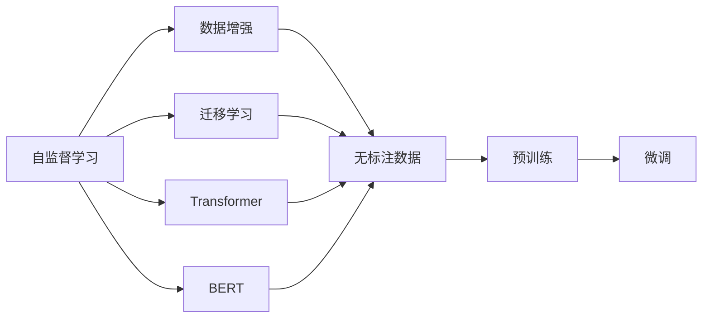
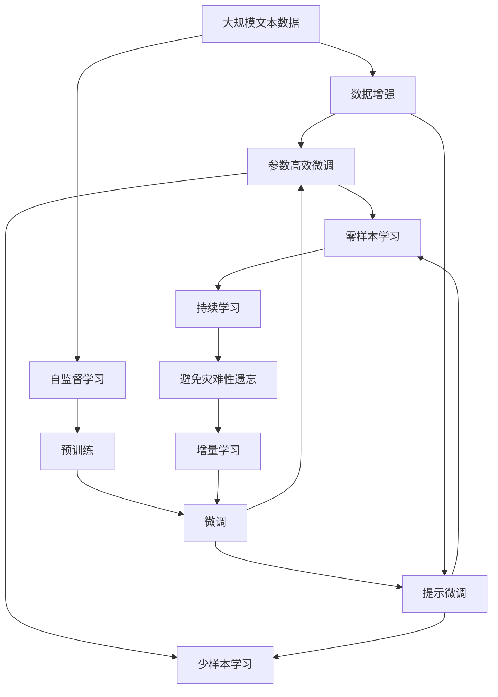

                 

# 自监督学习:减少标注数据依赖的新范式

> 关键词：自监督学习,标注数据,数据增强,迁移学习,Transformer,BERT,预训练,无监督学习

## 1. 背景介绍

### 1.1 问题由来
随着深度学习技术的发展，大规模自监督预训练模型如BERT、GPT等在自然语言处理（NLP）领域取得了显著的进步。这些模型通过在海量无标签文本数据上进行自监督预训练，学习到语言的通用表示，可以有效提升下游任务的表现。然而，这些模型依然需要大量的标注数据进行微调，才能适应特定的应用场景。

标注数据的获取成本和复杂性是当前NLP研究中的一个显著挑战。在许多实际应用中，特别是在资源有限的场景下，标注数据往往难以获得或成本过高，严重限制了模型的应用范围和效果。自监督学习（Self-Supervised Learning）范式提供了一种新的解决方案，通过利用未标注数据进行预训练，显著减少对标注数据的依赖，从而大大降低了数据获取和处理的成本。

### 1.2 问题核心关键点
自监督学习是一种基于未标注数据进行模型训练的方法，其核心思想是通过数据增强和巧妙的任务设计，让模型在无需标签的情况下学习到语言表示。自监督学习可以分为两大类：

1. **无监督学习（Unsupervised Learning）**：直接从数据本身提取特征，如通过掩码语言模型、自回归语言模型等任务进行训练。
2. **半监督学习（Semi-supervised Learning）**：在少量标注数据的基础上，结合无监督学习的特征提取能力，进一步提升模型的性能。

自监督学习能够显著降低对标注数据的依赖，但如何在无需标注数据的情况下，有效学习到语言模型的表示，仍是当前研究的热点和难点。本文将详细介绍自监督学习的原理和实践，特别是如何利用自监督学习进行有效的预训练和微调。

## 2. 核心概念与联系

### 2.1 核心概念概述

为更好地理解自监督学习在大语言模型中的应用，本节将介绍几个密切相关的核心概念：

- **自监督学习（Self-Supervised Learning）**：一种通过未标注数据进行模型训练的方法，目的是从数据本身提取有意义的表示，提升模型的泛化能力和鲁棒性。
- **数据增强（Data Augmentation）**：通过对原始数据进行一系列操作，如随机插入、替换、回译等，生成新的数据样本，增强数据多样性，提高模型性能。
- **迁移学习（Transfer Learning）**：将一个领域学习到的知识，迁移应用到另一个相关领域的学习范式。自监督学习预训练可以看作一种迁移学习方式，通过在无标注数据上进行预训练，学习通用的语言表示。
- **Transformer模型**：一种基于注意力机制的神经网络架构，被广泛应用于大语言模型的构建中。Transformer通过多头自注意力机制，有效地建模了输入序列的语义关系。
- **BERT模型**：一种基于Transformer架构的自监督预训练模型，通过在掩码语言模型和下一句预测任务上进行预训练，学习到丰富的语言表示。
- **参数高效微调（Parameter-Efficient Fine-Tuning）**：一种微调范式，通过只更新少量的模型参数，保持大部分预训练权重不变，以减少计算资源消耗和提高模型泛化能力。

这些概念之间的逻辑关系可以通过以下Mermaid流程图来展示：



这个流程图展示自监督学习在大语言模型预训练和微调过程中的作用和关系：

1. 自监督学习从无标注数据中学习通用语言表示，帮助大语言模型提升表现。
2. 数据增强通过生成多样化的训练样本，提高模型的泛化能力。
3. 迁移学习将无标注预训练学习到的通用知识，迁移应用到下游任务。
4. 参数高效微调在保持大部分预训练权重不变的情况下，仅更新少量参数，提升模型泛化能力和计算效率。

### 2.2 概念间的关系

这些核心概念之间存在着紧密的联系，形成了自监督学习在大语言模型预训练和微调过程中的完整生态系统。

#### 2.2.1 自监督学习与预训练的关系

自监督学习通过无标注数据进行预训练，学习到语言的通用表示。这种预训练通常以自回归或掩码语言模型等任务为代表，通过自动设计的学习目标，让模型从数据中提取有用的特征，提升模型的泛化能力和鲁棒性。

#### 2.2.2 数据增强与预训练的协同

数据增强通过生成多样化的训练样本，进一步提升了模型的泛化能力。在自监督学习预训练中，数据增强通常与掩码语言模型、自回归语言模型等任务相结合，生成更加丰富的训练样本，帮助模型学习到更加多样化的语言表示。

#### 2.2.3 迁移学习与预训练的协同

迁移学习将无标注预训练学习到的通用知识，迁移应用到下游任务。通过在无标注数据上进行预训练，学习到语言的通用表示，然后结合下游任务的少量标注数据进行微调，可以显著提高模型在下游任务上的表现。

#### 2.2.4 参数高效微调与自监督学习的协同

参数高效微调在保持大部分预训练权重不变的情况下，仅更新少量参数，以提升模型泛化能力和计算效率。自监督学习通过预训练学习到丰富的语言表示，再通过参数高效微调，进一步优化模型，适应下游任务。

### 2.3 核心概念的整体架构

最后，我们用一个综合的流程图来展示这些核心概念在大语言模型预训练和微调过程中的整体架构：



这个综合流程图展示了从预训练到微调，再到持续学习的完整过程。自监督学习通过数据增强和预训练任务学习到通用的语言表示，然后通过微调适应下游任务。微调还可以进一步细分为参数高效微调和提示微调，在保持大部分预训练权重不变的情况下，仅更新少量参数，减少计算资源消耗。提示微调则通过精心设计的输入格式，引导模型输出特定的结果，减少微调参数。持续学习帮助模型不断更新和适应新的任务和数据，避免灾难性遗忘和知识衰退。

## 3. 核心算法原理 & 具体操作步骤

### 3.1 算法原理概述

自监督学习的大语言模型预训练过程主要通过以下步骤实现：

1. **数据增强**：通过对原始数据进行一系列操作，如随机插入、替换、回译等，生成新的数据样本，增强数据多样性。
2. **自监督学习任务设计**：设计巧妙的自监督学习任务，如掩码语言模型、自回归语言模型等，让模型从数据中学习到语言的表示。
3. **预训练模型训练**：在增强数据集上训练自监督学习任务，学习到通用的语言表示。

### 3.2 算法步骤详解

自监督学习的大语言模型预训练步骤如下：

**Step 1: 准备无标注数据集**
- 收集大规模无标注文本数据集，如维基百科、新闻、社交媒体等。
- 使用数据增强技术，生成多样化的训练样本。

**Step 2: 设计自监督学习任务**
- 设计巧妙的自监督学习任务，如掩码语言模型、自回归语言模型等。
- 使用预训练模型（如Transformer）对增强数据集进行预训练。

**Step 3: 训练预训练模型**
- 使用AdamW等优化算法，在无标注数据集上进行自监督学习任务的训练。
- 设置合适的训练轮数、批次大小和学习率。

**Step 4: 保存预训练模型**
- 保存训练好的预训练模型权重，便于后续微调使用。

**Step 5: 微调预训练模型**
- 收集下游任务的小规模标注数据集，划分为训练集、验证集和测试集。
- 在预训练模型上添加一个适当的任务适配层，如线性分类器、解码器等。
- 使用AdamW等优化算法，在标注数据集上微调预训练模型。

**Step 6: 评估和调整**
- 在验证集上评估微调后的模型性能，调整模型参数和学习率等。
- 在测试集上评估最终模型性能，对比微调前后的效果。

### 3.3 算法优缺点

自监督学习具有以下优点：

1. **数据需求低**：自监督学习主要依赖于无标注数据，数据获取成本低，可操作性强。
2. **泛化能力强**：自监督学习通过数据增强技术，生成多样化的训练样本，增强模型泛化能力。
3. **计算资源利用率高**：自监督学习通过预训练学习到通用的语言表示，再通过参数高效微调，大幅减少微调参数，提高计算效率。

自监督学习也存在一些缺点：

1. **任务适配复杂**：自监督学习预训练模型通常需要大量的数据和计算资源，且任务适配层的设计需要经验。
2. **学习效率低**：自监督学习训练周期长，尤其是在大规模数据集上。
3. **结果解释困难**：自监督学习模型通常是一个"黑盒"系统，难以解释其内部工作机制和决策逻辑。

### 3.4 算法应用领域

自监督学习在大语言模型的预训练和微调过程中，已广泛应用于多个NLP任务，如：

- 文本分类：如情感分析、主题分类等。
- 命名实体识别：识别文本中的人名、地名、机构名等特定实体。
- 关系抽取：从文本中抽取实体之间的语义关系。
- 问答系统：对自然语言问题给出答案。
- 机器翻译：将源语言文本翻译成目标语言。
- 文本摘要：将长文本压缩成简短摘要。
- 对话系统：使机器能够与人自然对话。

除了这些经典任务，自监督学习还被创新性地应用于更多的场景中，如可控文本生成、常识推理、代码生成、数据增强等，为NLP技术带来了新的突破。

## 4. 数学模型和公式 & 详细讲解

### 4.1 数学模型构建

假设无标注数据集为 $D=\{x_i\}_{i=1}^N$，其中 $x_i$ 为第 $i$ 个文本样本。自监督学习的目标是通过无标注数据学习到通用的语言表示，然后通过下游任务的少量标注数据进行微调。

定义预训练模型的输入为 $x_i$，输出为 $y_i$，则自监督学习任务可以表示为：

$$
y_i = M_{\theta}(x_i)
$$

其中 $M_{\theta}$ 为预训练模型，$\theta$ 为模型参数。自监督学习任务的目标是通过 $x_i$ 预测 $y_i$，学习到模型的表示。

### 4.2 公式推导过程

以下我们以掩码语言模型为例，推导自监督学习的目标函数。

假设预训练模型 $M_{\theta}$ 在输入 $x_i$ 上的输出为 $y_i$，表示模型对 $x_i$ 的预测。定义掩码比例为 $p$，即在 $x_i$ 中随机掩盖 $p$ 个位置，预测这些被掩盖位置的下一个词。则掩码语言模型的目标函数为：

$$
\ell(M_{\theta}(x_i),y_i) = -\sum_{i=1}^N \sum_{j=1}^{|x_i|} (y_j \log M_{\theta}(x_i)[j]) \mathbb{I}[j \notin \text{masked\_position}]
$$

其中 $\mathbb{I}[j \notin \text{masked\_position}]$ 为指示函数，表示位置 $j$ 是否在掩码位置中。

将上述目标函数代入经验风险公式，得：

$$
\mathcal{L}(\theta) = -\frac{1}{N}\sum_{i=1}^N \sum_{j=1}^{|x_i|} (y_j \log M_{\theta}(x_i)[j]) \mathbb{I}[j \notin \text{masked\_position}]
$$

使用AdamW等优化算法，最小化经验风险 $\mathcal{L}(\theta)$，即：

$$
\theta \leftarrow \theta - \eta \nabla_{\theta}\mathcal{L}(\theta) - \eta\lambda\theta
$$

其中 $\eta$ 为学习率，$\lambda$ 为正则化系数。

### 4.3 案例分析与讲解

以BERT模型为例，其在掩码语言模型和下一句预测任务上进行预训练，具体步骤如下：

**Step 1: 准备无标注数据集**
- 收集大规模无标注文本数据集，如维基百科、新闻、社交媒体等。
- 使用数据增强技术，生成多样化的训练样本。

**Step 2: 设计自监督学习任务**
- 定义掩码语言模型任务，随机掩盖文本中的位置，预测这些位置的下一个词。
- 定义下一句预测任务，将文本对作为输入，预测它们是否为连续的句子。

**Step 3: 训练预训练模型**
- 使用AdamW等优化算法，在无标注数据集上进行自监督学习任务的训练。
- 设置合适的训练轮数、批次大小和学习率。

**Step 4: 保存预训练模型**
- 保存训练好的预训练模型权重，便于后续微调使用。

**Step 5: 微调预训练模型**
- 收集下游任务的小规模标注数据集，划分为训练集、验证集和测试集。
- 在预训练模型上添加一个适当的任务适配层，如线性分类器、解码器等。
- 使用AdamW等优化算法，在标注数据集上微调预训练模型。

**Step 6: 评估和调整**
- 在验证集上评估微调后的模型性能，调整模型参数和学习率等。
- 在测试集上评估最终模型性能，对比微调前后的效果。

## 5. 项目实践：代码实例和详细解释说明

### 5.1 开发环境搭建

在进行自监督学习实践前，我们需要准备好开发环境。以下是使用Python进行PyTorch开发的环境配置流程：

1. 安装Anaconda：从官网下载并安装Anaconda，用于创建独立的Python环境。

2. 创建并激活虚拟环境：
```bash
conda create -n pytorch-env python=3.8 
conda activate pytorch-env
```

3. 安装PyTorch：根据CUDA版本，从官网获取对应的安装命令。例如：
```bash
conda install pytorch torchvision torchaudio cudatoolkit=11.1 -c pytorch -c conda-forge
```

4. 安装Transformers库：
```bash
pip install transformers
```

5. 安装各类工具包：
```bash
pip install numpy pandas scikit-learn matplotlib tqdm jupyter notebook ipython
```

完成上述步骤后，即可在`pytorch-env`环境中开始自监督学习实践。

### 5.2 源代码详细实现

这里我们以BERT模型在掩码语言模型任务上的预训练为例，给出使用Transformers库的PyTorch代码实现。

首先，定义掩码语言模型任务的数据处理函数：

```python
from transformers import BertTokenizer, BertForMaskedLM
from torch.utils.data import Dataset
import torch

class MaskedLMDataset(Dataset):
    def __init__(self, texts, tokenizer):
        self.texts = texts
        self.tokenizer = tokenizer
        
    def __len__(self):
        return len(self.texts)
    
    def __getitem__(self, item):
        text = self.texts[item]
        
        encoding = self.tokenizer(text, return_tensors='pt')
        input_ids = encoding['input_ids'][0]
        attention_mask = encoding['attention_mask'][0]
        masked_positions = input_ids.clone()
        masked_positions[torch.randint(0, input_ids.shape[-1], (input_ids.shape[0],))] = tokenizer.mask_token_id
        
        return {'input_ids': input_ids, 
                'attention_mask': attention_mask,
                'masked_positions': masked_positions}
```

然后，定义模型和优化器：

```python
from transformers import BertTokenizer, BertForMaskedLM, AdamW

tokenizer = BertTokenizer.from_pretrained('bert-base-cased')
model = BertForMaskedLM.from_pretrained('bert-base-cased')
optimizer = AdamW(model.parameters(), lr=2e-5)
```

接着，定义训练和评估函数：

```python
from torch.utils.data import DataLoader
from tqdm import tqdm

device = torch.device('cuda') if torch.cuda.is_available() else torch.device('cpu')
model.to(device)

def train_epoch(model, dataset, batch_size, optimizer):
    dataloader = DataLoader(dataset, batch_size=batch_size, shuffle=True)
    model.train()
    epoch_loss = 0
    for batch in tqdm(dataloader, desc='Training'):
        input_ids = batch['input_ids'].to(device)
        attention_mask = batch['attention_mask'].to(device)
        masked_positions = batch['masked_positions'].to(device)
        model.zero_grad()
        outputs = model(input_ids, attention_mask=attention_mask, masked_lm_labels=masked_positions)
        loss = outputs.loss
        epoch_loss += loss.item()
        loss.backward()
        optimizer.step()
    return epoch_loss / len(dataloader)

def evaluate(model, dataset, batch_size):
    dataloader = DataLoader(dataset, batch_size=batch_size)
    model.eval()
    preds, labels = [], []
    with torch.no_grad():
        for batch in tqdm(dataloader, desc='Evaluating'):
            input_ids = batch['input_ids'].to(device)
            attention_mask = batch['attention_mask'].to(device)
            batch_labels = batch['masked_positions'].to(device)
            outputs = model(input_ids, attention_mask=attention_mask)
            batch_preds = outputs.logits.argmax(dim=2).to('cpu').tolist()
            batch_labels = batch_labels.to('cpu').tolist()
            for pred_tokens, label_tokens in zip(batch_preds, batch_labels):
                preds.append(pred_tokens[:len(label_tokens)])
                labels.append(label_tokens)
                
    print(classification_report(labels, preds))
```

最后，启动训练流程并在测试集上评估：

```python
epochs = 5
batch_size = 16

for epoch in range(epochs):
    loss = train_epoch(model, masked_lm_dataset, batch_size, optimizer)
    print(f"Epoch {epoch+1}, train loss: {loss:.3f}")
    
    print(f"Epoch {epoch+1}, dev results:")
    evaluate(model, masked_lm_dataset, batch_size)
    
print("Test results:")
evaluate(model, masked_lm_dataset, batch_size)
```

以上就是使用PyTorch对BERT模型进行掩码语言模型预训练的完整代码实现。可以看到，得益于Transformers库的强大封装，我们能够用相对简洁的代码完成BERT模型的加载和预训练。

### 5.3 代码解读与分析

让我们再详细解读一下关键代码的实现细节：

**MaskedLMDataset类**：
- `__init__`方法：初始化文本和分词器。
- `__len__`方法：返回数据集的样本数量。
- `__getitem__`方法：对单个样本进行处理，将文本输入编码为token ids，并随机掩盖位置，生成掩码位置。

**训练和评估函数**：
- 使用PyTorch的DataLoader对数据集进行批次化加载，供模型训练和推理使用。
- 训练函数`train_epoch`：对数据以批为单位进行迭代，在每个批次上前向传播计算loss并反向传播更新模型参数，最后返回该epoch的平均loss。
- 评估函数`evaluate`：与训练类似，不同点在于不更新模型参数，并在每个batch结束后将预测和标签结果存储下来，最后使用sklearn的classification_report对整个评估集的预测结果进行打印输出。

**训练流程**：
- 定义总的epoch数和batch size，开始循环迭代
- 每个epoch内，先在无标注数据集上进行预训练，输出平均loss
- 在测试集上评估，输出预测结果
- 所有epoch结束后，在测试集上评估，给出最终测试结果

可以看到，自监督学习通过数据增强和预训练任务，显著减少了对标注数据的依赖，降低了数据获取和处理的成本。在实际应用中，我们还可以使用更大更强的预训练模型、更丰富的预训练技巧、更细致的模型调优，进一步提升模型性能，以满足更高的应用要求。

## 6. 实际应用场景

### 6.1 智能客服系统

基于自监督学习的对话技术，可以广泛应用于智能客服系统的构建。传统客服往往需要配备大量人力，高峰期响应缓慢，且一致性和专业性难以保证。而使用自监督学习的对话模型，可以7x24小时不间断服务，快速响应客户咨询，用自然流畅的语言解答各类常见问题。

在技术实现上，可以收集企业内部的历史客服对话记录，将问题和最佳答复构建成监督数据，在此基础上对预训练对话模型进行微调。微调后的对话模型能够自动理解用户意图，匹配最合适的答案模板进行回复。对于客户提出的新问题，还可以接入检索系统实时搜索相关内容，动态组织生成回答。如此构建的智能客服系统，能大幅提升客户咨询体验和问题解决效率。

### 6.2 金融舆情监测

金融机构需要实时监测市场舆论动向，以便及时应对负面信息传播，规避金融风险。传统的人工监测方式成本高、效率低，难以应对网络时代海量信息爆发的挑战。基于自监督学习的文本分类和情感分析技术，为金融舆情监测提供了新的解决方案。

具体而言，可以收集金融领域相关的新闻、报道、评论等文本数据，并对其进行主题标注和情感标注。在此基础上对预训练语言模型进行微调，使其能够自动判断文本属于何种主题，情感倾向是正面、中性还是负面。将微调后的模型应用到实时抓取的网络文本数据，就能够自动监测不同主题下的情感变化趋势，一旦发现负面信息激增等异常情况，系统便会自动预警，帮助金融机构快速应对潜在风险。

### 6.3 个性化推荐系统

当前的推荐系统往往只依赖用户的历史行为数据进行物品推荐，无法深入理解用户的真实兴趣偏好。基于自监督学习的推荐系统可以更好地挖掘用户行为背后的语义信息，从而提供更精准、多样的推荐内容。

在实践中，可以收集用户浏览、点击、评论、分享等行为数据，提取和用户交互的物品标题、描述、标签等文本内容。将文本内容作为模型输入，用户的后续行为（如是否点击、购买等）作为监督信号，在此基础上微调预训练语言模型。微调后的模型能够从文本内容中准确把握用户的兴趣点。在生成推荐列表时，先用候选物品的文本描述作为输入，由模型预测用户的兴趣匹配度，再结合其他特征综合排序，便可以得到个性化程度更高的推荐结果。

### 6.4 未来应用展望

随着自监督学习技术的不断发展，其在NLP领域的应用前景将更加广阔。

在智慧医疗领域，基于自监督学习的新闻问答、病历分析、药物研发等应用将提升医疗服务的智能化水平，辅助医生诊疗，加速新药开发进程。

在智能教育领域，自监督学习可应用于作业批改、学情分析、知识推荐等方面，因材施教，促进教育公平，提高教学质量。

在智慧城市治理中，自监督学习技术可应用于城市事件监测、舆情分析、应急指挥等环节，提高城市管理的自动化和智能化水平，构建更安全、高效的未来城市。

此外，在企业生产、社会治理、文娱传媒等众多领域，基于自监督学习的AI应用也将不断涌现，为经济社会发展注入新的动力。相信随着技术的日益成熟，自监督学习必将在更广泛的应用领域大放异彩。

## 7. 工具和资源推荐
### 7.1 学习资源推荐

为了帮助开发者系统掌握自监督学习的大语言模型预训练理论基础和实践技巧，这里推荐一些优质的学习资源：

1. 《Transformer from the ground up》系列博文：由大模型技术专家撰写，深入浅出地介绍了Transformer原理、BERT模型、自监督学习等前沿话题。

2. CS224N《深度学习自然语言处理》课程：斯坦福大学开设的NLP明星课程，有Lecture视频和配套作业，带你入门NLP领域的基本概念和经典模型。

3. 《Natural Language Processing with Transformers》书籍：Transformers库的作者所著，全面介绍了如何使用Transformers库进行NLP任务开发，包括自监督学习的预训练和微调。

4. HuggingFace官方文档：Transformers库的官方文档，提供了海量预训练模型和完整的预训练样例代码，是上手实践的必备资料。

5. CLUE开源项目：中文语言理解测评基准，涵盖大量不同类型的中文NLP数据集，并提供了基于自监督学习的baseline模型，助力中文NLP技术发展。

通过对这些资源的学习实践，相信你一定能够快速掌握自监督学习的精髓，并用于解决实际的NLP问题。
### 7.2 开发工具推荐

高效的开发离不开优秀的工具支持。以下是几款用于自监督学习大语言模型预训练开发的常用工具：

1. PyTorch：基于Python的开源深度学习框架，灵活动态的计算图，适合快速迭代研究。大部分

