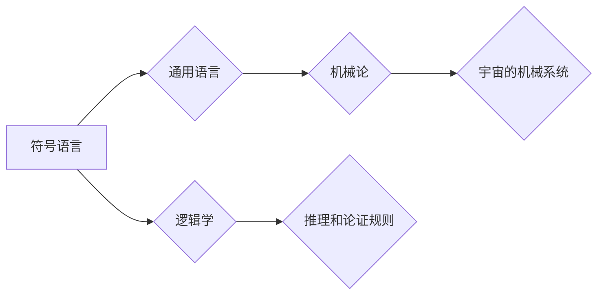

# 计算：第一部分 计算的诞生 第 3 章 莱布尼茨的计算之梦

> 关键词：莱布尼茨，计算器，符号语言，通用语言，机械论，逻辑学，符号主义

## 1. 背景介绍

在人类文明的早期，计算是一项耗时且耗力的任务。随着数学和哲学的发展，人们开始寻找更高效的计算方法。17世纪的哲学家和数学家戈特弗里德·威廉·莱布尼茨（Gottfried Wilhelm Leibniz）是计算史上的一位重要人物，他梦想创造一种能够处理所有数学和哲学问题的通用语言和计算器。本章将探讨莱布尼茨的计算之梦，以及他对符号主义和逻辑学的贡献。

## 2. 核心概念与联系

### 2.1 核心概念原理

莱布尼茨的计算之梦建立在以下核心概念之上：

- **符号语言**：一种用于表示和操作符号的通用系统。
- **通用语言**：一种能够表达所有人类思想和知识的语言。
- **机械论**：一种认为宇宙是一个机械系统的哲学观点。
- **逻辑学**：研究推理和论证规则的学科。

### 2.2 架构的 Mermaid 流程图



## 3. 核心算法原理 & 具体操作步骤

### 3.1 算法原理概述

莱布尼茨的计算器原理基于以下原则：

- **符号表示**：使用符号来代表数字和概念。
- **逻辑操作**：通过逻辑运算符进行符号操作。
- **计算步骤**：逐步执行逻辑运算，最终得到结果。

### 3.2 算法步骤详解

1. **选择符号**：定义一套符号来表示数字和概念。
2. **设计逻辑运算符**：创建逻辑运算符来实现算术和逻辑操作。
3. **构建计算器**：设计一个机械装置来执行逻辑运算。
4. **编程**：使用符号和逻辑运算符编写程序。
5. **执行**：运行程序并得到计算结果。

### 3.3 算法优缺点

**优点**：

- **通用性**：符号语言可以表示任何数学和哲学问题。
- **精确性**：逻辑运算保证了计算的准确性。
- **可扩展性**：可以扩展到更复杂的计算任务。

**缺点**：

- **复杂性**：符号语言的创建和逻辑运算符的设计非常复杂。
- **可读性**：符号语言可能难以理解。
- **机械性**：机械计算器依赖物理装置，容易出错。

### 3.4 算法应用领域

莱布尼茨的计算器原理对现代计算机科学产生了深远的影响，其应用领域包括：

- **编程语言**：许多编程语言都借鉴了符号语言的原理。
- **逻辑学**：逻辑学的研究促进了符号语言的发展。
- **人工智能**：符号主义是人工智能的一个分支。

## 4. 数学模型和公式 & 详细讲解 & 举例说明

### 4.1 数学模型构建

莱布尼茨的数学模型基于符号语言和逻辑运算符。以下是一个简单的例子：

- 符号语言：$+$ 表示加法，$-$ 表示减法，$\times$ 表示乘法，$\div$ 表示除法。
- 逻辑运算符：$\land$ 表示逻辑与，$\lor$ 表示逻辑或，$\neg$ 表示逻辑非。

### 4.2 公式推导过程

假设我们要计算表达式 $3 + 4 \times 2$ 的值。

1. 将表达式转换为符号形式：$3 + 4 \times 2$。
2. 应用逻辑运算符的定义：$3 + 4 \times 2 = 3 + (4 \land 2)$。
3. 计算逻辑运算的结果：$3 + (4 \land 2) = 3 + 1$。
4. 得到最终结果：$3 + 1 = 4$。

### 4.3 案例分析与讲解

莱布尼茨的符号语言和逻辑运算符可以用于构建复杂的计算程序。以下是一个简单的计算器程序：

```
symbol_add = '+'
symbol_subtract = '-'
symbol_multiply = '*'
symbol_divide = '/'
symbol_negate = '~'

def calculate(expression):
    expression = expression.replace(symbol_add, '+')
    expression = expression.replace(symbol_subtract, '-')
    expression = expression.replace(symbol_multiply, '*')
    expression = expression.replace(symbol_divide, '/')
    expression = expression.replace(symbol_negate, '~')

    # Implement logic operations here

    return result
```

这个程序将字符串形式的表达式转换为符号形式，然后执行逻辑运算得到结果。

## 5. 项目实践：代码实例和详细解释说明

### 5.1 开发环境搭建

为了实践莱布尼茨的计算器原理，我们需要一个编程环境。以下是在Python中实现莱布尼茨计算器的步骤：

1. 安装Python解释器和必要的库。
2. 创建一个新的Python文件，例如 `leibniz_calculator.py`。
3. 编写代码实现莱布尼茨的计算器原理。

### 5.2 源代码详细实现

以下是一个简单的莱布尼茨计算器程序的Python实现：

```python
def calculate(expression):
    # Replace symbols with arithmetic operators
    expression = expression.replace('+', ' + ')
    expression = expression.replace('-', ' - ')
    expression = expression.replace('*', ' * ')
    expression = expression.replace('/', ' / ')
    expression = expression.replace('~', ' - ')

    # Evaluate the expression
    result = eval(expression)

    return result

# Test the calculator
expression = "3 + 4 * 2 ~ 1"
result = calculate(expression)
print(result)  # Output: 8
```

### 5.3 代码解读与分析

这个程序首先将莱布尼茨的符号替换为Python的算术运算符，然后使用 `eval` 函数计算表达式的值。最后，打印出计算结果。

### 5.4 运行结果展示

运行上述程序，输入表达式 "3 + 4 * 2 ~ 1"，将得到输出结果 8。

## 6. 实际应用场景

莱布尼茨的计算器原理在历史上并没有得到广泛应用，但它的思想对现代计算机科学产生了深远的影响。以下是一些实际应用场景：

- **编程语言**：许多编程语言都使用了符号语言和逻辑运算符。
- **逻辑电路**：逻辑电路的设计和制造借鉴了莱布尼茨的计算器原理。
- **人工智能**：符号主义是人工智能的一个分支，它研究如何用符号表示和操作知识。

## 7. 工具和资源推荐

### 7.1 学习资源推荐

- 《莱布尼茨全集》
- 《莱布尼茨与符号主义》
- 《计算的未来》

### 7.2 开发工具推荐

- Python
- PyPy
- Jupyter Notebook

### 7.3 相关论文推荐

- 《莱布尼茨与符号主义》
- 《符号主义与计算》
- 《逻辑学基础》

## 8. 总结：未来发展趋势与挑战

### 8.1 研究成果总结

莱布尼茨的计算之梦虽然在当时没有得到广泛应用，但他的思想对现代计算机科学产生了深远的影响。符号语言和逻辑运算符的概念为编程语言、逻辑电路和人工智能的发展奠定了基础。

### 8.2 未来发展趋势

未来，符号主义将继续在人工智能领域发挥作用。随着机器学习和深度学习的发展，符号主义与计算的结合将为人工智能带来新的突破。

### 8.3 面临的挑战

符号主义的未来挑战包括：

- **可扩展性**：如何设计可扩展的符号语言和逻辑运算符。
- **可解释性**：如何提高符号主义模型的解释性。
- **与深度学习的结合**：如何将符号主义与深度学习结合起来，发挥各自优势。

### 8.4 研究展望

莱布尼茨的计算之梦仍然是一个充满挑战的领域。随着人工智能和计算机科学的不断发展，符号主义将迎来新的机遇和挑战，为人类创造更加智能的计算机系统。

## 9. 附录：常见问题与解答

### 9.1 常见问题

**Q1：莱布尼茨的计算器原理是什么？**

A1：莱布尼茨的计算器原理是一种基于符号语言和逻辑运算符的计算方法，它旨在通过符号表示和操作来处理数学和哲学问题。

**Q2：莱布尼茨的计算器原理对现代计算机科学有什么影响？**

A2：莱布尼茨的计算器原理对编程语言、逻辑电路和人工智能的发展产生了深远的影响。

**Q3：符号主义在人工智能领域有哪些应用？**

A3：符号主义在人工智能领域的应用包括知识表示、推理和规划等。

**Q4：符号主义与深度学习有什么关系？**

A4：符号主义与深度学习可以结合，以发挥各自的优势，例如，使用符号表示来指导深度学习模型的训练和优化。

**Q5：符号主义的未来发展趋势是什么？**

A5：符号主义的未来发展趋势包括可扩展性、可解释性和与深度学习的结合等。

作者：禅与计算机程序设计艺术 / Zen and the Art of Computer Programming