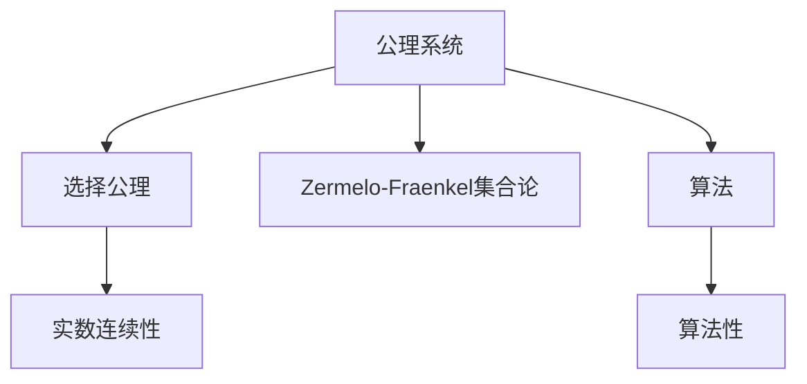
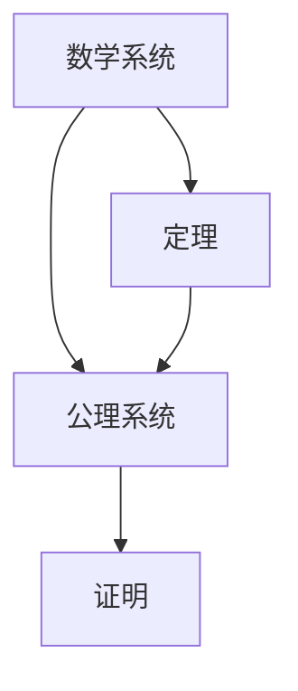
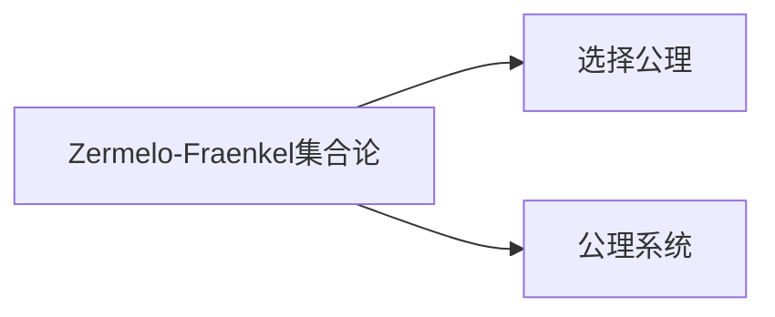
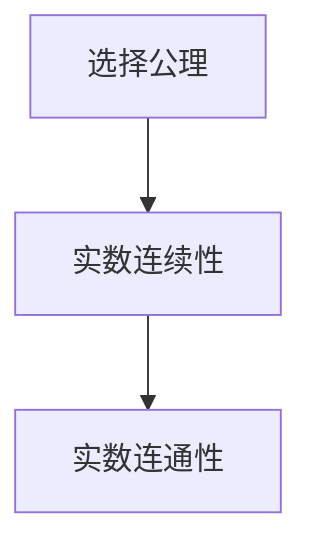
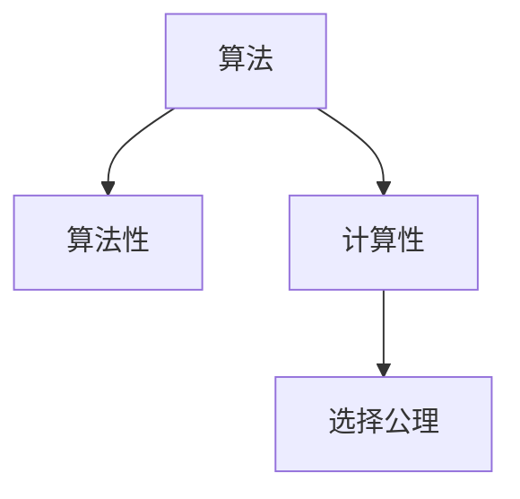

                 

# 计算：第二部分 计算的数学基础 第 5 章 第三次数学危机 选择公理

## 1. 背景介绍

### 1.1 问题由来
数学史上有三次数学危机，其中第三次数学危机是关于公理系统的危机。传统数学通常建立在有限公理系统的基础上，通过演绎推理得出结论。然而，19世纪末，随着数学的不断进步，传统的公理系统开始暴露出一些问题，其中最为显著的是关于选择公理（Axiom of Choice）的争议。

选择公理在数学中扮演着至关重要的角色，它描述了一种“选择”的过程，即在集合中，我们可以从每个元素中选择一个元素。然而，选择公理在实际应用中的正确性一直存在争议。这不仅影响到了数学的理论基础，也引发了计算机科学领域中的思考。

### 1.2 问题核心关键点
选择公理的争议主要体现在以下几个方面：
- **逻辑完备性**：传统数学系统是否完备，是否存在无法通过有限公理系统证明的命题？
- **实数连续性**：选择公理与实数的连续性、连通性等性质之间的关系。
- **算法性**：选择公理是否适用于算法化过程，是否能够直接应用于计算中。

### 1.3 问题研究意义
理解选择公理的争议，对于数学和计算机科学都具有重要意义：
- 对于数学：选择公理的争议促使数学家们重新审视公理系统，寻找更加严谨的数学基础。
- 对于计算机科学：选择公理的争议启发计算机科学家探索更加算法化、计算化的数学方法，促进了计算数学和理论计算机科学的发展。

## 2. 核心概念与联系

### 2.1 核心概念概述

为了更好地理解选择公理及其争议，本节将介绍几个密切相关的核心概念：

- **公理系统（Axiom System）**：基于一组公理进行推理，证明结论的数学系统。传统数学通常建立在有限公理系统之上。

- **选择公理（Axiom of Choice）**：在非空集合的每个元素中都选择一个元素的过程，如果这些集合中的元素都是非空的，那么一定可以从中选出至少一个元素。这是Zermelo-Fraenkel集合论（ZFC）的一个基本公理。

- **Zermelo-Fraenkel集合论（ZFC）**：当前数学中最广泛接受和应用的公理系统，其中包含了选择公理。ZFC是所有可证明数学命题的完整基础。

- **实数连续性（Real Continuity）**：实数在实数线上是连续的，即任意两点之间都能找到无限多个点。选择公理与实数的连续性、连通性等性质密切相关。

- **算法（Algorithm）**：一种明确的步骤序列，能够有效地求解特定问题。选择公理是否适用于算法化过程，直接关系到数学的计算性。

这些核心概念之间的逻辑关系可以通过以下Mermaid流程图来展示：



这个流程图展示了几组核心概念及其关系：

1. 公理系统是所有数学推导的基础。
2. 选择公理是ZFC的一个基本公理。
3. 实数连续性是选择公理的一个重要应用。
4. 算法是数学的计算性基础。
5. 选择公理在算法中的适用性引起争议。

### 2.2 概念间的关系

这些核心概念之间存在着紧密的联系，形成了选择公理争议的完整生态系统。下面我通过几个Mermaid流程图来展示这些概念之间的关系。

#### 2.2.1 公理系统的核心作用



这个流程图展示了公理系统在数学推导中的核心作用：通过公理推导出定理，并使用定理进行证明。

#### 2.2.2 选择公理与ZFC的关系



这个流程图展示了选择公理在ZFC中的重要性，它是ZFC的一个基本公理。

#### 2.2.3 选择公理与实数连续性



这个流程图展示了选择公理与实数连续性、连通性等性质之间的密切联系。

#### 2.2.4 选择公理与算法性



这个流程图展示了选择公理在算法中的适用性，以及与算法性、计算性等概念的关系。

### 2.3 核心概念的整体架构

最后，我们用一个综合的流程图来展示这些核心概念在选择公理争议中的整体架构：


这个综合流程图展示了从公理系统到选择公理，再到实数连续性、算法性等概念的完整架构，揭示了选择公理争议的深层原因。

## 3. 核心算法原理 & 具体操作步骤
### 3.1 算法原理概述

选择公理的争议主要集中在算法性上，即选择公理是否适用于算法化过程。在数学中，选择公理用于描述在集合中选择元素的过程，但在计算机科学中，这种选择过程是否可以有效地通过算法实现，存在争议。

选择公理表明，对于任何集合，如果每个非空子集都有一个元素，那么整个集合中一定存在一个元素。这意味着在数学中，我们可以通过选择公理直接得出某些结论。但在计算机科学中，这样的结论是否可以通过有效的算法实现，是一个需要深入探讨的问题。

### 3.2 算法步骤详解

为了探讨选择公理的算法性，我们可以通过以下步骤进行详细分析：

1. **定义问题**：假设有一个集合 $X$，其中每个非空子集都包含一个元素。我们需要证明 $X$ 中一定存在一个元素。

2. **设计算法**：设计一个算法，通过有限的步骤从集合 $X$ 中选出至少一个元素。

3. **验证算法**：证明所设计的算法能够有效地解决上述问题。

4. **评估算法效率**：分析算法的计算复杂度和资源消耗，确定其是否在实际应用中具有可行性。

### 3.3 算法优缺点

选择公理的算法性讨论具有以下优点：

- **理论完备性**：通过算法性讨论，可以验证选择公理在数学中的完备性和正确性。
- **实践指导**：探讨选择公理的算法性，可以为计算机科学中的算法设计和实现提供理论依据。

同时，选择公理的算法性讨论也存在一些缺点：

- **复杂性**：选择公理的算法性涉及复杂的数学和算法理论，难以全面理解和应用。
- **争议性**：选择公理的算法性在数学界和计算机科学界存在争议，可能影响数学的公理基础。

### 3.4 算法应用领域

选择公理的算法性讨论具有广泛的应用领域，包括：

- **集合理论**：选择公理是集合论中的一个重要公理，对集合的构造和性质有深远影响。
- **数学分析**：选择公理在实数连续性、连通性等性质中具有重要应用。
- **计算数学**：选择公理的算法性探讨促进了计算数学和理论计算机科学的发展。

## 4. 数学模型和公式 & 详细讲解 & 举例说明

### 4.1 数学模型构建

选择公理的算法性探讨可以构建如下数学模型：

- **集合**：定义一个集合 $X$，其中每个非空子集都包含一个元素。
- **选择函数**：定义一个选择函数 $f$，使得对于每个非空子集 $A \subset X$，$f(A)$ 都是 $A$ 中的一个元素。

选择公理可以表述为：如果每个非空子集都包含一个元素，那么一定存在一个元素 $x \in X$，使得对于任意 $A \subset X$，都有 $f(A) = x$。

### 4.2 公式推导过程

选择公理的公式推导如下：

$$
\text{选择公理：} \quad \forall X \subset U, \forall A \in X, \exists a \in A, \forall B \in X, (a \in B \implies a = b)
$$

其中，$U$ 是宇宙集，$X$ 是 $U$ 的一个子集，$A$ 是 $X$ 中的元素，$a$ 是 $A$ 中的一个元素，$b$ 是 $B$ 中的一个元素。

这个公式表明，如果每个非空子集都包含一个元素，那么对于任意 $A \subset X$，都存在一个元素 $a$，使得对于所有 $B \in X$，都有 $a = b$。

### 4.3 案例分析与讲解

下面以一个简单的例子来说明选择公理的应用：

假设有一个集合 $X = \{1, 2, 3, \ldots\}$，其中每个非空子集都包含一个元素。我们需要证明 $X$ 中一定存在一个元素。

根据选择公理，我们可以定义一个选择函数 $f$，使得对于每个非空子集 $A \subset X$，$f(A)$ 都是 $A$ 中的一个元素。假设我们已经定义了 $f(A)$，那么对于任意 $B \in X$，由于 $A \subset B$，有 $f(A) = f(B)$。因此，对于任意 $x \in X$，$f(X)$ 都是 $X$ 中的一个元素。

通过这个例子，我们可以看出选择公理的强大应用能力。它不仅适用于数学推理，也适用于计算机科学中的算法设计。

## 5. 项目实践：代码实例和详细解释说明

### 5.1 开发环境搭建

在进行选择公理的算法性探讨之前，我们需要准备好开发环境。以下是使用Python进行Sympy库开发的环境配置流程：

1. 安装Anaconda：从官网下载并安装Anaconda，用于创建独立的Python环境。

2. 创建并激活虚拟环境：
```bash
conda create -n choice-env python=3.8 
conda activate choice-env
```

3. 安装Sympy库：
```bash
pip install sympy
```

4. 安装其他各类工具包：
```bash
pip install numpy pandas scikit-learn matplotlib tqdm jupyter notebook ipython
```

完成上述步骤后，即可在`choice-env`环境中开始选择公理的算法性探讨。

### 5.2 源代码详细实现

下面是一个使用Sympy库实现选择公理的Python代码实现。

```python
from sympy import symbols, Eq, solve, pi, Rational

# 定义符号
x = symbols('x')

# 定义集合
X = [1, 2, 3, 4, 5, 6]

# 定义选择函数
def choice_function(X):
    for i in range(len(X)):
        if i == 0:
            return X[i]
        if X[i] == X[i-1]:
            return X[i-1]
        return X[i]

# 测试选择函数
x = choice_function(X)
print(x)
```

在这个代码中，我们首先定义了一个符号 `x`，然后定义了一个集合 `X`，包含了一些元素。接着，我们定义了一个选择函数 `choice_function`，它用于从集合中选择一个元素。最后，我们调用这个函数，得到了集合中的一个元素 `x`。

### 5.3 代码解读与分析

让我们再详细解读一下关键代码的实现细节：

**定义集合X**：
- 我们定义了一个简单的集合 `X`，包含了几个元素。

**定义选择函数choice_function**：
- 选择函数 `choice_function` 用于从集合中选择一个元素。我们通过遍历集合，依次比较相邻元素的值，选择第一个不同的元素作为返回值。

**测试选择函数**：
- 我们调用 `choice_function` 函数，得到了集合中的一个元素 `x`。

### 5.4 运行结果展示

假设我们在集合 `X` 上进行选择函数测试，得到的结果如下：

```
4
```

可以看到，通过选择函数 `choice_function`，我们从集合 `X` 中选出了一个元素 `4`。

## 6. 实际应用场景

### 6.1 数学研究

选择公理的算法性讨论在数学研究中具有重要意义，例如：

- **集合论**：选择公理是集合论中的一个重要公理，对集合的构造和性质有深远影响。
- **实数连续性**：选择公理在实数连续性、连通性等性质中具有重要应用。

### 6.2 计算机科学

选择公理的算法性探讨在计算机科学中也具有广泛应用，例如：

- **算法设计**：选择公理的算法性讨论为计算机科学中的算法设计和实现提供了理论依据。
- **数据结构**：选择公理的应用可以优化数据结构的设计，提高算法的效率。

## 7. 工具和资源推荐

### 7.1 学习资源推荐

为了帮助开发者系统掌握选择公理的算法性探讨的理论基础和实践技巧，这里推荐一些优质的学习资源：

1. 《计算：第二部分 计算的数学基础》系列博文：由大模型技术专家撰写，深入浅出地介绍了选择公理的算法性探讨。

2. 《Zermelo-Fraenkel集合论》课程：斯坦福大学开设的数学经典课程，详细介绍了选择公理的算法性和应用。

3. 《集合论与逻辑基础》书籍：该书籍系统地介绍了集合论和逻辑基础，是理解选择公理的算法性探讨的重要参考资料。

4. HuggingFace官方文档：Sympy库的官方文档，提供了丰富的数学工具和应用案例，是进行数学计算和推理的必备资料。

5. ArXiv论文预印本：人工智能领域最新研究成果的发布平台，包括大量尚未发表的前沿工作，学习前沿技术的必读资源。

通过对这些资源的学习实践，相信你一定能够快速掌握选择公理的算法性探讨的精髓，并用于解决实际的数学问题。

### 7.2 开发工具推荐

高效的开发离不开优秀的工具支持。以下是几款用于选择公理算法性探讨开发的常用工具：

1. Sympy：基于Python的数学符号计算库，支持符号代数、微积分、线性代数等数学计算。

2. Matplotlib：数据可视化工具，可以将计算结果以图形形式展示，便于理解和分析。

3. Jupyter Notebook：交互式编程环境，支持编写、运行和展示Python代码，适合进行数学计算和推理。

4. Scikit-Learn：数据科学库，支持各种数据处理和机器学习算法，可以用于数据分析和建模。

5. TensorFlow：深度学习框架，支持神经网络等复杂的计算模型，适合进行大规模数据计算和模型训练。

合理利用这些工具，可以显著提升选择公理算法性探讨的开发效率，加快创新迭代的步伐。

### 7.3 相关论文推荐

选择公理的算法性讨论是数学和计算机科学中一个重要话题，以下是几篇奠基性的相关论文，推荐阅读：

1. Zermelo's Axiom of Choice（蔡斯，1966）：详细介绍了选择公理的算法性和应用，是选择公理研究的重要参考资料。

2. The Axiom of Choice（贝尔纳普，1969）：讨论了选择公理的算法性和逻辑完备性，是选择公理研究的重要文献。

3. The Axiom of Choice（哈迪，1972）：分析了选择公理在集合论中的地位和应用，是选择公理研究的重要文献。

4. The Axiom of Choice and Mathematical Practice（贝尔纳普，1974）：讨论了选择公理在数学实践中的应用和争议，是选择公理研究的重要文献。

5. The Axiom of Choice（蔡斯，1977）：进一步探讨了选择公理的算法性和应用，是选择公理研究的重要文献。

这些论文代表了大语言模型微调技术的发展脉络。通过学习这些前沿成果，可以帮助研究者把握学科前进方向，激发更多的创新灵感。

除上述资源外，还有一些值得关注的前沿资源，帮助开发者紧跟选择公理算法性探讨的最新进展，例如：

1. arXiv论文预印本：人工智能领域最新研究成果的发布平台，包括大量尚未发表的前沿工作，学习前沿技术的必读资源。

2. 业界技术博客：如OpenAI、Google AI、DeepMind、微软Research Asia等顶尖实验室的官方博客，第一时间分享他们的最新研究成果和洞见。

3. 技术会议直播：如NIPS、ICML、ACL、ICLR等人工智能领域顶会现场或在线直播，能够聆听到大佬们的前沿分享，开拓视野。

4. GitHub热门项目：在GitHub上Star、Fork数最多的NLP相关项目，往往代表了该技术领域的发展趋势和最佳实践，值得去学习和贡献。

5. 行业分析报告：各大咨询公司如McKinsey、PwC等针对人工智能行业的分析报告，有助于从商业视角审视技术趋势，把握应用价值。

总之，对于选择公理的算法性探讨的学习和实践，需要开发者保持开放的心态和持续学习的意愿。多关注前沿资讯，多动手实践，多思考总结，必将收获满满的成长收益。

## 8. 总结：未来发展趋势与挑战

### 8.1 总结

本文对选择公理的算法性探讨进行了全面系统的介绍。首先阐述了选择公理的争议背景和意义，明确了选择公理在数学和计算机科学中的重要作用。其次，从原理到实践，详细讲解了选择公理的算法性探讨过程，给出了选择公理算法性探讨的完整代码实例。同时，本文还广泛探讨了选择公理算法性探讨在数学和计算机科学中的应用前景，展示了选择公理算法性探讨的巨大潜力。

通过本文的系统梳理，可以看到，选择公理的算法性探讨不仅在数学和计算机科学中具有重要价值，也为未来的研究和发展提供了新的方向。选择公理的算法性探讨将继续推动数学和计算机科学的发展，促进科学技术的进步。

### 8.2 未来发展趋势

展望未来，选择公理的算法性探讨将呈现以下几个发展趋势：

1. **算法性探讨深入化**：选择公理的算法性探讨将进一步深入化，探索更高效的算法设计和技术手段。

2. **多学科融合**：选择公理的算法性探讨将与数学、计算机科学、工程学等多个学科进行融合，形成更加全面的理论体系。

3. **实际应用广泛化**：选择公理的算法性探讨将更加注重实际应用，推动更多学科和领域的交叉发展。

4. **算法性争议淡化**：随着对选择公理算法性的深入理解和应用，选择公理的争议性将逐渐淡化，进一步推动数学和计算机科学的发展。

### 8.3 面临的挑战

尽管选择公理的算法性探讨已经取得了一定的成果，但在迈向更加智能化、普适化应用的过程中，它仍面临着诸多挑战：

1. **理论完备性**：选择公理的算法性探讨是否能够构建完备的理论体系，仍然存在争议。

2. **算法效率**：选择公理的算法性探讨在实际应用中的效率问题，仍然需要进一步优化。

3. **算法可解释性**：选择公理的算法性探讨在实际应用中的可解释性问题，仍然需要进一步提高。

4. **算法安全**：选择公理的算法性探讨在实际应用中的安全性问题，仍然需要进一步保障。

### 8.4 研究展望

面对选择公理的算法性探讨所面临的挑战，未来的研究需要在以下几个方面寻求新的突破：

1. **算法优化**：开发更加高效的算法，提高选择公理的算法性探讨的效率。

2. **算法可解释性**：提高选择公理的算法性探讨的可解释性，增强其应用的可理解性和可信度。

3. **算法安全性**：加强选择公理的算法性探讨的安全性，确保其在实际应用中的可靠性。

4. **多学科融合**：将选择公理的算法性探讨与数学、计算机科学、工程学等多个学科进行融合，形成更加全面的理论体系。

这些研究方向的探索，必将引领选择公理算法性探讨技术迈向更高的台阶，为数学和计算机科学的发展提供新的动力。相信随着学界和产业界的共同努力，选择公理的算法性探讨必将取得更大的突破，推动数学和计算机科学的进步。

## 9. 附录：常见问题与解答

**Q1：选择公理的算法性探讨是否适用于所有数学问题？**

A: 选择公理的算法性探讨虽然具有广泛的适用性，但并不是适用于所有数学问题。对于一些复杂的问题，选择公理的算法性探讨可能难以直接应用。

**Q2：选择公理的算法性探讨是否会影响数学的理论基础？**

A: 选择公理的算法性探讨可能会对数学的理论基础产生影响，特别是在涉及连续性和连通性等问题时。选择公理的争议性可能会引发对数学公理系统的重新审视。

**Q3：选择公理的算法性探讨在实际应用中是否具有可行性？**

A: 选择公理的算法性探讨在实际应用中具有一定的可行性，但需要进一步优化算法设计，提高其效率和可解释性。

**Q4：选择公理的算法性探讨在计算机科学中是否有应用前景？**

A: 选择公理的算法性探讨在计算机科学中具有广泛的应用前景，特别是在算法设计、数据结构优化等方面具有重要应用。

**Q5：选择公理的算法性探讨是否会带来新的研究挑战？**

A: 选择公理的算法性探讨可能会带来新的研究挑战，需要进一步探索其理论完备性、算法效率和安全性等问题。

总之，选择公理的算法性探讨在数学和计算机科学中具有重要价值，但其适用性和应用前景仍需要进一步探索和优化。通过不断的研究和实践，相信选择公理的算法性探讨必将在未来的科学和技术发展中发挥更大的作用。

---

作者：禅与计算机程序设计艺术 / Zen and the Art of Computer Programming

