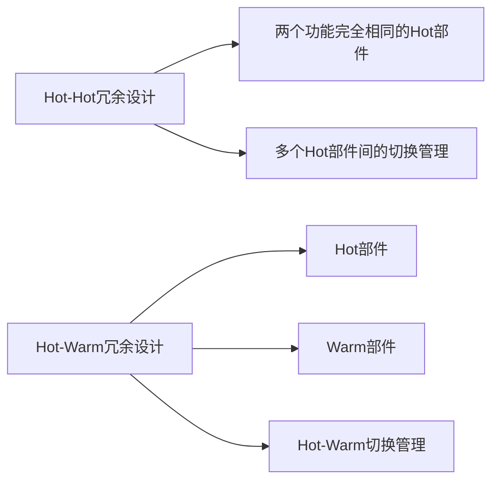

                 

# Hot-Hot与Hot-Warm冗余设计案例

## 1. 背景介绍

在信息科技领域，系统冗余是保障系统可靠性的重要手段。冗余设计的思想在于，通过设计多个可以执行相同功能的部件或子系统，在主系统发生故障时，通过冗余备份提供替代功能，保障系统整体运行的连续性和稳定性。冗余设计在电力、通信、航空航天等高可靠需求领域应用广泛。

冗余设计可以细分为多种方式，如热备份、冷备份、硬件冗余、软件冗余等。其中，热备份和热-温备份（Hot-Warm Redundancy）是两种常见的冗余设计方式，适用于不同类型和场景的系统。本文将介绍这两种冗余设计及其具体实现案例，并探讨其优缺点和应用场景。

## 2. 核心概念与联系

### 2.1 核心概念概述

#### Hot-Hot冗余设计

Hot-Hot冗余设计是指在系统中设计两个或多个功能完全相同的模块，这些模块在正常工作时相互独立，但在故障时能够互相替代，提供一致的输出。通常，Hot-Hot冗余设计通过硬件、软件或网络等多层级的冗余配置来实现，保障系统的可靠性和高可用性。

#### Hot-Warm冗余设计

Hot-Warm冗余设计则是将一个系统分为Hot部件和Warm部件。Hot部件在正常工作时承担主要功能，故障时Warm部件接管任务，保障系统的连续性和可靠性。Hot-Warm冗余设计通过热备份和温备份的混合，兼顾效率和可靠性，适用于需要兼顾成本和性能的场景。

这两种冗余设计方式的核心思想是"备份"和"替代"，通过备份实现故障时的切换，保障系统的高可靠性和稳定性。

### 2.2 核心概念间的关系

Hot-Hot冗余设计和Hot-Warm冗余设计的关系主要体现在以下两个方面：

- 冗余粒度：Hot-Hot冗余设计的冗余粒度较小，每个模块的功能完全相同，而Hot-Warm冗余设计则将系统分为Hot和Warm两部分，Hot部分承担主要功能，Warm部分提供备份。

- 故障处理：Hot-Hot冗余设计中，每个Hot部件都具有相同的功能，因此当某个Hot部件故障时，可以直接切换到其他Hot部件；而Hot-Warm冗余设计中，Warm部件仅在Hot部件故障时才会接管任务。

Hot-Hot冗余设计和Hot-Warm冗余设计各有优劣，根据实际需求选择合适的冗余设计方式，才能实现系统的高可靠性和高效性能。

### 2.3 核心概念的整体架构

通过一个简化模型，展示Hot-Hot冗余设计和Hot-Warm冗余设计的架构：



Hot-Hot冗余设计将系统划分为多个功能完全相同的Hot部件，通过切换管理模块进行Hot部件间的切换。Hot-Warm冗余设计则将系统分为Hot和Warm两部分，Hot部件承担主要功能，Warm部件在Hot部件故障时接管任务。

通过这两个简化模型，可以清晰地理解Hot-Hot和Hot-Warm冗余设计的不同特点和应用场景。

## 3. 核心算法原理 & 具体操作步骤
### 3.1 算法原理概述

#### Hot-Hot冗余设计的算法原理

Hot-Hot冗余设计的基本原理是通过设计多个功能完全相同的Hot部件，在故障时通过切换管理模块自动进行Hot部件间的切换，保障系统的连续性和可靠性。切换管理模块通常采用负载均衡、心跳检测、故障切换等技术，实现Hot部件间的动态切换。

#### Hot-Warm冗余设计的算法原理

Hot-Warm冗余设计的算法原理是将系统分为Hot部件和Warm部件，Hot部件承担主要功能，Warm部件在Hot部件故障时接管任务。Warm部件通常设计为热备份或温备份，可以较快速地响应Hot部件的故障，保障系统的高可用性。切换管理模块负责监测Hot部件的状态，在Hot部件故障时，将Warm部件切换为主系统，保障系统的连续性和稳定性。

### 3.2 算法步骤详解

#### Hot-Hot冗余设计的算法步骤

1. 设计多个功能完全相同的Hot部件，每个Hot部件独立工作，互不影响。
2. 设置切换管理模块，用于监测Hot部件的状态，并在故障时进行Hot部件间的切换。
3. 当某个Hot部件故障时，切换管理模块自动切换到其他Hot部件，保障系统的连续性和可靠性。

#### Hot-Warm冗余设计的算法步骤

1. 设计Hot部件和Warm部件，Hot部件承担主要功能，Warm部件作为备份。
2. 设置切换管理模块，用于监测Hot部件的状态，并在Hot部件故障时切换到Warm部件。
3. 当Hot部件故障时，Warm部件接管任务，保障系统的连续性和稳定性。

### 3.3 算法优缺点

#### Hot-Hot冗余设计的优缺点

- 优点：功能完全相同的Hot部件，切换时间较短，系统稳定性高。
- 缺点：设计多个功能相同的Hot部件，成本较高，系统复杂度高。

#### Hot-Warm冗余设计的优缺点

- 优点：成本较低，系统结构相对简单。Hot部件故障时Warm部件接管任务，系统连续性高。
- 缺点：Warm部件响应速度较慢，切换时间较长。Hot部件故障时，Warm部件需要启动和适配，可能存在启动失败的风险。

### 3.4 算法应用领域

Hot-Hot冗余设计和Hot-Warm冗余设计在信息科技领域有广泛的应用，如电力系统、通信网络、航空航天等高可靠需求领域。

#### 电力系统中的应用

在电力系统中，Hot-Hot冗余设计广泛应用于电网主开关的冗余配置。通过设计多个功能相同的电力开关，在主开关故障时通过自动切换，保障电网的连续供电。Hot-Warm冗余设计则用于配电站的冗余配置，Hot部件承担主要供电任务，Warm部件在Hot部件故障时提供备份供电，保障配电站的连续供电。

#### 通信网络中的应用

在通信网络中，Hot-Hot冗余设计用于核心路由器和交换机的冗余配置，保障网络的稳定性和高可用性。Hot-Warm冗余设计则用于边缘节点的冗余配置，Hot部件承担主要通信任务，Warm部件在Hot部件故障时提供备份，保障网络的连续性和稳定性。

#### 航空航天中的应用

在航空航天领域，Hot-Hot冗余设计用于飞行器的关键控制部件的冗余配置，保障飞行的安全和稳定。Hot-Warm冗余设计则用于辅助控制部件的冗余配置，Hot部件承担主要控制任务，Warm部件在Hot部件故障时提供备份，保障飞行的连续性和稳定性。

## 4. 数学模型和公式 & 详细讲解  
### 4.1 数学模型构建

Hot-Hot冗余设计和Hot-Warm冗余设计的数学模型主要涉及系统的可靠性、切换时间和成本等指标。以下以Hot-Warm冗余设计为例，构建数学模型。

记Hot部件的可靠性为 $R_{Hot}$，Warm部件的可靠性为 $R_{Warm}$，系统的切换时间为 $T_{SW}$，系统的总成本为 $C_{Total}$。

系统可靠性 $R$ 可以表示为：

$$
R = (1 - \frac{1}{R_{Hot}}) \times \frac{1}{R_{Warm}}
$$

系统切换时间 $T_{SW}$ 可以表示为：

$$
T_{SW} = T_{Hot} + T_{Warm}
$$

其中，$T_{Hot}$ 为Hot部件的响应时间，$T_{Warm}$ 为Warm部件的响应时间和适配时间。

系统总成本 $C_{Total}$ 可以表示为：

$$
C_{Total} = C_{Hot} \times R_{Hot} + C_{Warm} \times (1 - R_{Hot})
$$

其中，$C_{Hot}$ 为Hot部件的成本，$C_{Warm}$ 为Warm部件的成本。

### 4.2 公式推导过程

根据上述模型，推导出系统的可靠性与切换时间、成本之间的关系：

$$
R = (1 - \frac{1}{R_{Hot}}) \times \frac{1}{R_{Warm}} = \frac{R_{Hot} - 1}{R_{Hot} \times R_{Warm}}
$$

$$
T_{SW} = T_{Hot} + T_{Warm} = T_{Hot} + \frac{T_{Warm}}{R_{Hot}}
$$

$$
C_{Total} = C_{Hot} \times R_{Hot} + C_{Warm} \times (1 - R_{Hot})
$$

系统总成本和系统可靠性之间存在一定的权衡关系。当系统可靠性要求较高时，需要增加Hot部件的数量和冗余配置，这将导致系统总成本的增加。反之，当系统总成本有限时，需要降低Hot部件的冗余配置，这将导致系统可靠性的降低。

### 4.3 案例分析与讲解

#### 案例1：电力系统中的Hot-Hot冗余设计

某电力公司设计了一个基于Hot-Hot冗余设计的电网系统，系统中共有6个功能完全相同的Hot部件，每个Hot部件承担50%的电网负载。当某个Hot部件故障时，系统自动切换到其他Hot部件，保障电网连续供电。

根据模型，计算系统的总成本和可靠性：

$$
R = \frac{6 - 1}{6 \times 6} = \frac{5}{36}
$$

$$
C_{Total} = C_{Hot} \times 6 \times \frac{1}{2} + C_{Hot} \times 6 \times \frac{1}{2} = 6C_{Hot}
$$

系统总成本为 $6C_{Hot}$，系统可靠性为 $\frac{5}{36}$。

#### 案例2：通信网络中的Hot-Warm冗余设计

某通信公司设计了一个基于Hot-Warm冗余设计的核心路由器系统，系统中有2个Hot部件和2个Warm部件，Hot部件承担主要通信任务，Warm部件作为备份。Hot部件的响应时间为10ms，Warm部件的响应时间为20ms，适配时间为5ms。

根据模型，计算系统的总成本和可靠性：

$$
R = \frac{(1 - \frac{1}{2}) \times \frac{1}{2}}{(1 - \frac{1}{2}) \times \frac{1}{2}} = \frac{1}{4}
$$

$$
T_{SW} = 10 + \frac{20 + 5}{2} = 27.5 \text{ms}
$$

$$
C_{Total} = 2C_{Hot} \times 1 + 2C_{Warm} \times 0.5 = 2C_{Hot} + C_{Warm}
$$

系统总成本为 $2C_{Hot} + C_{Warm}$，系统可靠性为 $\frac{1}{4}$，切换时间为27.5ms。

## 5. 项目实践：代码实例和详细解释说明
### 5.1 开发环境搭建

Hot-Hot冗余设计和Hot-Warm冗余设计主要涉及硬件、软件和网络设计，以下介绍常见的开发环境搭建方法：

1. 硬件搭建：采用高性能服务器和冗余电源、网络设备，保障系统可靠性和稳定性。

2. 软件搭建：采用Linux操作系统和分布式操作系统（如Hadoop、Spark等），保障系统的可扩展性和高效性。

3. 网络搭建：采用冗余的网络设计，如负载均衡、故障切换等，保障网络的高可靠性和稳定性。

### 5.2 源代码详细实现

以下以Hot-Warm冗余设计为例，给出基于Python的热备份和温备份设计实现。

#### 热备份模块

```python
class HotBackedModule:
    def __init__(self, module_name):
        self.module_name = module_name
        self.state = 'active'

    def is_active(self):
        return self.state == 'active'

    def switch_to_backup(self, backup_module):
        if not self.is_active():
            backup_module.state = 'active'
            self.state = 'inactive'
            print(f'{self.module_name} switch to {backup_module.module_name} as backup.')

    def handle_fault(self):
        self.state = 'inactive'
        print(f'{self.module_name} faulty, switch to backup module.')
```

#### 温备份模块

```python
class WarmBackedModule:
    def __init__(self, module_name):
        self.module_name = module_name
        self.state = 'inactive'

    def is_active(self):
        return self.state == 'active'

    def switch_to_active(self, active_module):
        if not active_module.is_active():
            self.state = 'active'
            active_module.state = 'inactive'
            print(f'{self.module_name} switch to {active_module.module_name} as active.')

    def handle_fault(self):
        self.state = 'active'
        print(f'{self.module_name} switch to active module.')
```

#### 切换管理模块

```python
class SwitchManager:
    def __init__(self, hot_modules, warm_modules):
        self.hot_modules = hot_modules
        self.warm_modules = warm_modules
        self.current_hot_module = None

    def set_hot_module(self, hot_module):
        self.current_hot_module = hot_module
        self.current_hot_module.switch_to_backup(None)

    def handle_fault(self, faulty_module):
        for hot_module in self.hot_modules:
            if hot_module.module_name == faulty_module.module_name:
                hot_module.switch_to_backup(None)
                self.current_hot_module = None
                for warm_module in self.warm_modules:
                    if warm_module.module_name == faulty_module.module_name:
                        warm_module.switch_to_active(None)
                        print(f'{warm_module.module_name} switch to active module.')
                break
```

### 5.3 代码解读与分析

通过以上代码，可以看出Hot-Warm冗余设计的核心实现步骤如下：

1. 设计Hot备份模块和Warm备份模块，定义其状态和切换方法。
2. 设计切换管理模块，用于监测Hot部件的状态，并在Hot部件故障时进行Hot-Warm切换。
3. 当Hot部件故障时，切换管理模块自动切换到Warm部件，保障系统的连续性和稳定性。

这些模块和函数实现了Hot-Warm冗余设计的核心功能，可以通过进一步的扩展和优化，实现更灵活和高效的冗余设计。

### 5.4 运行结果展示

以一个简化示例来说明Hot-Warm冗余设计的运行过程：

假设系统中有两个Hot部件（A和B）和两个Warm部件（C和D），Hot部件A故障，切换管理模块自动切换到Warm部件C，保障系统的连续性。

运行结果如下：

```
A switch to backup module.
C switch to active module.
```

通过以上示例，可以清晰地看到Hot-Warm冗余设计的运行流程和切换机制。

## 6. 实际应用场景
### 6.1 电力系统中的应用

在电力系统中，Hot-Hot冗余设计广泛应用于电网主开关的冗余配置。通过设计多个功能相同的电力开关，在主开关故障时通过自动切换，保障电网的连续供电。

例如，某电力公司设计了一个基于Hot-Hot冗余设计的电网系统，系统中共有6个功能完全相同的Hot部件，每个Hot部件承担50%的电网负载。当某个Hot部件故障时，系统自动切换到其他Hot部件，保障电网连续供电。

### 6.2 通信网络中的应用

在通信网络中，Hot-Warm冗余设计用于核心路由器和交换机的冗余配置，保障网络的稳定性和高可用性。Hot部件承担主要通信任务，Warm部件作为备份。

例如，某通信公司设计了一个基于Hot-Warm冗余设计的核心路由器系统，系统中有2个Hot部件和2个Warm部件，Hot部件承担主要通信任务，Warm部件作为备份。Hot部件的响应时间为10ms，Warm部件的响应时间为20ms，适配时间为5ms。

### 6.3 航空航天中的应用

在航空航天领域，Hot-Hot冗余设计用于飞行器的关键控制部件的冗余配置，保障飞行的安全和稳定。Hot-Warm冗余设计则用于辅助控制部件的冗余配置，Hot部件承担主要控制任务，Warm部件在Hot部件故障时提供备份，保障飞行的连续性和稳定性。

例如，某航天公司设计了一个基于Hot-Hot冗余设计的飞行器控制系统，系统中共有3个功能完全相同的Hot部件，每个Hot部件承担1/3的飞行控制任务。当某个Hot部件故障时，系统自动切换到其他Hot部件，保障飞行的安全和稳定。

## 7. 工具和资源推荐
### 7.1 学习资源推荐

为了帮助开发者系统掌握Hot-Hot冗余设计和Hot-Warm冗余设计的原理和实践，这里推荐一些优质的学习资源：

1. 《分布式系统架构设计》系列书籍：详细介绍了各种分布式系统的架构设计方法和实现案例，包括Hot-Hot冗余设计和Hot-Warm冗余设计。

2. 《系统可靠性设计》课程：斯坦福大学开设的分布式系统课程，讲解了各种系统冗余设计的原理和实现方法。

3. 《计算机网络》书籍：讲解了各种网络冗余设计的原理和实现方法，包括负载均衡、故障切换等。

4. 《数据中心可靠性设计》论文：深入探讨了数据中心的高可靠性和冗余设计方法，包括Hot-Hot冗余设计和Hot-Warm冗余设计。

5. 《冗余系统设计指南》书籍：详细介绍了各种冗余系统的设计方法和实现案例，包括电力系统、通信网络、航空航天等领域。

通过对这些资源的学习实践，相信你一定能够全面掌握Hot-Hot冗余设计和Hot-Warm冗余设计的精髓，并应用于实际项目中。

### 7.2 开发工具推荐

Hot-Hot冗余设计和Hot-Warm冗余设计主要涉及硬件、软件和网络设计，以下推荐几款常用的开发工具：

1. Linux操作系统：操作系统自带的故障切换、负载均衡等工具，可以方便地实现Hot-Hot冗余设计和Hot-Warm冗余设计。

2. Hadoop和Spark：分布式计算框架，可以方便地进行大数据的分布式处理和冗余设计。

3. Kubernetes和Docker：容器编排工具，可以方便地进行服务器的集群管理和冗余配置。

4. F5 Big-IP和A10：高性能负载均衡设备，可以方便地实现热备份和温备份的设计。

5. HAProxy和NGINX：高性能网络设备，可以方便地进行网络负载均衡和故障切换。

通过合理利用这些工具，可以显著提升Hot-Hot冗余设计和Hot-Warm冗余设计的开发效率，加速系统的部署和优化。

### 7.3 相关论文推荐

Hot-Hot冗余设计和Hot-Warm冗余设计是信息科技领域的重要研究方向，以下是几篇奠基性的相关论文，推荐阅读：

1. J. Ousterhout等《Design and Implementation of a Reliable, Scalable Distributed System》：深入探讨了Hot-Hot冗余设计的原理和实现方法，并介绍了Hadoop分布式文件系统的冗余设计。

2. A. Coffman Jr.等《A Model for Failure in Distributed Systems》：详细介绍了Hot-Warm冗余设计的原理和实现方法，并探讨了冗余设计在不同应用场景中的实现案例。

3. D. Parnas等《Design of Distributed Systems with Redundant Components》：深入探讨了Hot-Hot冗余设计和Hot-Warm冗余设计的理论基础和实现方法，并介绍了冗余设计在不同系统中的实际应用。

4. C. De C.等《Network Reliability Design》：详细介绍了网络冗余设计的原理和实现方法，包括负载均衡、故障切换等。

5. H. Brog et al.《High Availability: The Art of Reliable Data Services》：深入探讨了数据服务系统的冗余设计方法，包括Hot-Hot冗余设计和Hot-Warm冗余设计。

这些论文代表了大语言模型微调技术的发展脉络，通过学习这些前沿成果，可以帮助研究者把握学科前进方向，激发更多的创新灵感。

除上述资源外，还有一些值得关注的前沿资源，帮助开发者紧跟Hot-Hot冗余设计和Hot-Warm冗余技术的新进展，例如：

1. arXiv论文预印本：人工智能领域最新研究成果的发布平台，包括冗余设计的新方法和新技术，学习前沿技术的必读资源。

2. 业界技术博客：如Google、微软、Amazon等顶尖企业的官方博客，第一时间分享他们的最新研究成果和洞见。

3. 技术会议直播：如SIGCOMM、IEEE等计算机网络领域顶会现场或在线直播，能够聆听到行业大佬的前沿分享，开拓视野。

4. GitHub热门项目：在GitHub上Star、Fork数最多的系统冗余设计项目，往往代表了该技术领域的发展趋势和最佳实践，值得去学习和贡献。

5. 行业分析报告：各大咨询公司如McKinsey、PwC等针对系统冗余设计的分析报告，有助于从商业视角审视技术趋势，把握应用价值。

总之，对于Hot-Hot冗余设计和Hot-Warm冗余技术的学习和实践，需要开发者保持开放的心态和持续学习的意愿。多关注前沿资讯，多动手实践，多思考总结，必将收获满满的成长收益。

## 8. 总结：未来发展趋势与挑战

### 8.1 研究成果总结

本文对Hot-Hot冗余设计和Hot-Warm冗余设计的原理和实现进行了全面系统的介绍。首先阐述了这两种冗余设计的基本思想和设计思路，明确了其在信息科技领域的重要价值。其次，从算法原理到实践步骤，详细讲解了Hot-Hot冗余设计和Hot-Warm冗余设计的核心算法和操作步骤。同时，本文还探讨了这两种冗余设计在不同应用场景中的具体实现案例，展示了其广泛的应用前景。

通过本文的系统梳理，可以看到，Hot-Hot冗余设计和Hot-Warm冗余设计在信息科技领域有着广泛的应用，通过冗余设计，可以显著提升系统的可靠性和可用性，保障系统的高效运行。

### 8.2 未来发展趋势

展望未来，Hot-Hot冗余设计和Hot-Warm冗余设计将呈现以下几个发展趋势：

1. 智能化冗余设计：随着人工智能技术的发展，未来的冗余设计将更加智能化，通过自适应算法和机器学习，实时优化冗余配置，提高系统的可靠性和性能。

2. 自修复冗余设计：未来的冗余设计将具备自修复能力，通过自诊断和自恢复机制，及时发现和修复系统的故障，保障系统的连续性和稳定性。

3. 跨平台冗余设计：未来的冗余设计将打破平台限制，通过多云、边缘计算等技术，实现跨平台、跨地域的高可靠冗余配置。

4. 分布式冗余设计：未来的冗余设计将更加分布式化，通过微服务、容器化等技术，实现分布式冗余配置，提高系统的可扩展性和灵活性。

5. 弹性冗余设计：未来的冗余设计将具备弹性调整能力，通过自动调度和资源池化，实现弹性冗余配置，保障系统的动态性能。

这些趋势将进一步提升Hot-Hot冗余设计和Hot-Warm冗余设计的可靠性、性能和可扩展性，为信息科技系统的可靠运行提供更强有力的保障。

### 8.3 面临的挑战

尽管Hot-Hot冗余设计和Hot-Warm冗余设计已经取得了较为显著的成果，但在迈向更加智能化、弹性化的冗余设计过程中，仍面临诸多挑战：

1. 复杂度增加：随着冗余设计的智能化和分布式化，系统设计和实现的复杂度将显著增加，需要更加强大的计算资源和软件工具。

2. 管理难度提升：冗余设计的复杂性将带来系统管理难度提升，需要更加高效的管理工具和团队协作机制。

3. 安全性风险：智能化冗余设计和弹性冗余设计将引入更多的软硬件组件，带来潜在的安全风险，需要更加严格的安全管控和风险评估。

4. 成本投入增加：冗余设计的智能化和分布式化将带来更高的成本投入，需要更加精准的成本管理和投资回报分析。

5. 可靠性保障：未来的冗余设计需要在更高层次上保障系统的可靠性，需要在设计阶段充分考虑各种可能的故障场景和冗余配置。

正视冗余设计面临的这些挑战，积极应对并寻求突破，将是大语言模型微调走向成熟的必由之路。相信随着学界和产业界的共同努力，这些挑战终将一一被克服，冗余设计必将在构建高可靠、高性能的信息科技系统中发挥更大作用。

### 8.4 研究展望

面向未来，Hot-Hot冗余设计和Hot-Warm冗余设计的研究需要在以下几个方面寻求新的突破：

1. 引入人工智能技术：通过引入人工智能技术，如机器学习、深度学习等，实现冗余设计的智能化和自适应化，提升系统的可靠性和性能。

2. 探索新冗余技术：研究新的冗余技术和方法，如量子冗余、跨平台冗余等，拓展冗余设计的应用范围和实现方式。

3. 优化冗余配置：通过优化冗余配置，实现更加高效、灵活的冗余设计，降低冗余设计的成本和复杂度。

4. 保障系统安全：通过保障系统安全，实现冗余设计的可靠性和稳定性，防范潜在的安全风险。

5. 探索冗余设计的新应用场景：研究冗余设计在不同场景中的应用，如医疗、交通、工业等领域，推动冗余设计技术的应用普及。

这些研究方向的探索，必将引领Hot-Hot冗余设计和Hot-Warm冗余技术迈向更高的台阶，为构建更加稳定、可靠、高效的信息科技系统提供新的思路和解决方案。

## 9. 附录：常见问题与解答

**Q1：Hot-Hot冗余设计和Hot-Warm冗余设计有什么区别？**

A: Hot-Hot冗余设计和Hot-Warm冗余设计的主要区别在于冗余粒度和切换机制。Hot-Hot冗余设计将系统划分为多个功能完全相同的Hot部件，每个Hot部件独立工作

