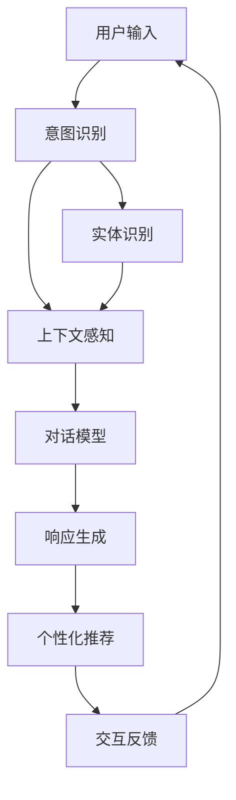
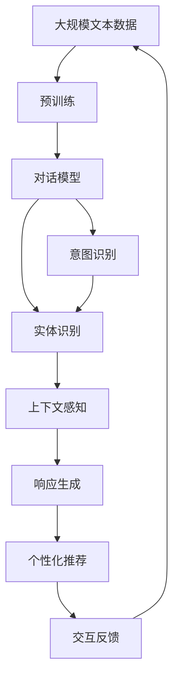

                 

# 自然语言交互在CUI中的详细优势

> 关键词：自然语言交互, 人机对话, 计算机用户界面, 智能交互系统, 对话模型, 意图识别, 上下文感知, 个性化推荐

## 1. 背景介绍

### 1.1 问题由来
随着人工智能技术的不断进步，自然语言交互(Natural Language Interaction, NLI)在计算机用户界面(Computer User Interface, CUI)中扮演着越来越重要的角色。NLI使得计算机系统能够更加自然、高效地与人类进行互动，大大提升了用户的体验和满意度。它不仅应用于传统的对话系统、语音助手等，还在诸如智能家居、医疗健康、金融理财等多个领域得到广泛应用。

### 1.2 问题核心关键点
自然语言交互的核心在于使计算机能够理解和处理人类的自然语言指令，进而执行相应的操作或提供有价值的信息。这不仅包括传统的意图识别和实体提取，还包括更复杂的上下文感知和情感理解。以下核心问题将贯穿本文：

- 如何构建高效准确的对话模型？
- 如何实现上下文感知的意图识别？
- 如何在交互过程中保持个性化和连贯性？
- 如何在多样化的环境中保证系统鲁棒性？

### 1.3 问题研究意义
自然语言交互的研究对于提升CUI的用户体验和智能化水平具有重要意义：

1. **提升用户体验**：自然语言交互使计算机能够自然地理解用户需求，提供更加个性化的服务，极大提升了用户的满意度和操作效率。
2. **推动技术进步**：自然语言交互研究是自然语言处理(NLP)和人工智能(AI)领域的前沿课题，能够促进这些技术的深度融合和发展。
3. **拓展应用场景**：自然语言交互能够覆盖更多的应用场景，推动智能技术在医疗、金融、教育等多个行业的应用落地。
4. **促进人机协作**：自然语言交互使得计算机不仅作为工具，而是成为用户可靠的朋友和伙伴，推动人机协作进入新纪元。

## 2. 核心概念与联系

### 2.1 核心概念概述

在自然语言交互的研究中，涉及多个关键概念，它们共同构成了交互系统的核心组件：

- **对话模型**：对话模型是自然语言交互的核心，负责理解用户输入并生成响应。常见的对话模型包括基于规则、统计和深度学习等类型。
- **意图识别**：意图识别是对话模型的重要任务之一，通过分析用户输入，确定用户希望执行的操作或获取的信息。
- **实体识别**：实体识别用于从用户输入中提取出具体的实体信息，如人名、地名、时间等。
- **上下文感知**：上下文感知是指对话模型在处理用户输入时，不仅关注当前的输入，还能利用历史交互信息，进行更准确的意图识别和响应生成。
- **个性化推荐**：在交互过程中，根据用户的历史行为和偏好，生成个性化的信息或服务，提升用户体验。

这些概念之间的逻辑关系可以通过以下Mermaid流程图来展示：



### 2.2 概念间的关系

这些核心概念之间存在着紧密的联系，形成了自然语言交互系统的完整架构：

1. **用户输入**：用户通过自然语言与系统交互，提供需求和信息。
2. **意图识别**：系统通过自然语言处理技术，分析用户的输入，确定用户的意图。
3. **实体识别**：系统从输入中提取关键实体，以便后续处理。
4. **上下文感知**：系统利用历史交互信息，提升意图识别的准确性。
5. **对话模型**：基于意图和实体，生成合适的响应。
6. **响应生成**：系统根据对话模型生成的文本，输出给用户。
7. **个性化推荐**：根据用户历史行为，提供个性化服务。
8. **交互反馈**：用户对响应的反馈信息，用于持续优化系统。

### 2.3 核心概念的整体架构

以下是一个综合的流程图，展示了大规模语言模型在自然语言交互中的整体架构：



该流程图展示了大语言模型在自然语言交互中的核心组件和数据流向，即从大规模文本数据出发，经过预训练得到通用的语言表示，然后在对话模型中处理用户输入，进行意图识别和实体提取，利用上下文信息进行更准确的响应生成，并根据用户反馈进行持续优化。

## 3. 核心算法原理 & 具体操作步骤

### 3.1 算法原理概述

自然语言交互的算法原理主要涉及两个部分：对话模型的构建和意图识别的实现。以下详细介绍这两部分的核心算法。

**对话模型的构建**：
对话模型的构建通常基于序列到序列(Seq2Seq)框架，通过注意力机制(Attention Mechanism)实现。系统首先对用户输入进行编码，然后根据编码结果和上下文信息生成响应。常见的方法包括基于RNN、LSTM和Transformer的Seq2Seq模型。

**意图识别的实现**：
意图识别是自然语言交互的关键任务，通常使用分类器进行实现。系统将用户输入与预定义的意图模板进行匹配，确定用户的意图。常见的方法包括基于规则、机器学习和深度学习等技术。

### 3.2 算法步骤详解

以下详细介绍对话模型的具体构建步骤和意图识别的操作步骤。

**对话模型构建步骤**：
1. **数据准备**：收集对话数据集，进行预处理和标注，包括对话轮次、意图、实体等。
2. **编码器-解码器结构设计**：选择合适的序列到序列模型结构，如RNN、LSTM、Transformer等。
3. **模型训练**：使用训练集数据对模型进行训练，优化参数，最小化预测误差。
4. **模型评估**：使用验证集数据评估模型性能，进行调优。
5. **模型部署**：将训练好的模型部署到生产环境，进行实时响应。

**意图识别操作步骤**：
1. **意图模板设计**：设计常见的意图模板，如查询信息、预订服务、投诉反馈等。
2. **特征提取**：从用户输入中提取关键特征，如词汇、语法结构、实体等。
3. **分类器训练**：使用训练数据训练分类器，识别用户的意图。
4. **模型评估**：使用测试数据评估分类器性能，进行调优。
5. **集成到对话模型**：将意图识别模块集成到对话模型中，实时处理用户输入。

### 3.3 算法优缺点

**对话模型构建的优缺点**：
- **优点**：
  - 能够处理变长输入和输出，适用于多种交互场景。
  - 能够利用上下文信息，提升响应生成质量。
- **缺点**：
  - 计算复杂度高，训练数据需求大。
  - 模型参数量大，难以优化。

**意图识别的优缺点**：
- **优点**：
  - 准确度高，适用于复杂意图分类任务。
  - 易于集成到对话模型中，提升用户体验。
- **缺点**：
  - 对输入文本的要求高，难以处理自然语言中的歧义和噪声。
  - 模型对新意图的识别能力有限，需要不断更新和优化。

### 3.4 算法应用领域

自然语言交互的算法应用领域广泛，涵盖了多个行业和场景，例如：

- **智能客服**：使用对话模型和意图识别，实现24/7全天候客服，提升客户满意度。
- **虚拟助手**：通过自然语言交互，实现语音助手、智能家居等，提高用户的生活质量。
- **健康医疗**：利用对话模型和上下文感知，提供智能诊断和咨询服务，提升医疗服务效率。
- **金融理财**：结合自然语言交互和个性化推荐，实现智能理财、风险评估等功能。
- **教育培训**：通过自然语言交互，实现智能答疑、个性化学习推荐等，提升教育效果。

## 4. 数学模型和公式 & 详细讲解 & 举例说明

### 4.1 数学模型构建

自然语言交互的数学模型主要涉及对话模型和意图识别两个部分。以下详细介绍这两种模型的数学表达。

**对话模型的数学模型**：
假设对话模型为 $M_\theta(x_i, c_{i-1}, y_{i-1})$，其中 $x_i$ 为当前输入，$c_{i-1}$ 为历史上下文，$y_{i-1}$ 为前一轮响应。模型的目标是最小化预测误差：

$$
L(\theta) = \frac{1}{N}\sum_{i=1}^N \ell(M_\theta(x_i, c_{i-1}, y_{i-1}), y_i)
$$

其中 $\ell$ 为损失函数，如交叉熵损失。

**意图识别的数学模型**：
假设意图识别任务为二分类问题，即从用户输入中识别出意图 $i$ 与非 $i$。模型的目标是最小化交叉熵损失：

$$
L(\theta) = \frac{1}{N}\sum_{i=1}^N -y_i\log P_i(x) - (1-y_i)\log(1-P_i(x))
$$

其中 $P_i(x)$ 为模型预测的意图概率，$y_i$ 为标签。

### 4.2 公式推导过程

以下分别推导对话模型和意图识别的公式。

**对话模型的公式推导**：
假设对话模型使用Transformer结构，输入为 $x_i$，上下文为 $c_{i-1}$，前一轮响应为 $y_{i-1}$，输出为 $y_i$。模型的目标是最小化预测误差：

$$
L(\theta) = \frac{1}{N}\sum_{i=1}^N \ell(M_\theta(x_i, c_{i-1}, y_{i-1}), y_i)
$$

其中 $\ell$ 为交叉熵损失。Transformer模型的编码器-解码器结构如图1所示。


**意图识别的公式推导**：
假设意图识别任务为二分类问题，即从用户输入中识别出意图 $i$ 与非 $i$。模型的目标是最小化交叉熵损失：

$$
L(\theta) = \frac{1}{N}\sum_{i=1}^N -y_i\log P_i(x) - (1-y_i)\log(1-P_i(x))
$$

其中 $P_i(x)$ 为模型预测的意图概率，$y_i$ 为标签。

### 4.3 案例分析与讲解

**案例1：智能客服系统**：
在智能客服系统中，对话模型和意图识别用于处理用户咨询请求。假设用户输入为 "我需要查询订单状态"，历史上下文为 "用户A，已登录，查询订单状态"，前一轮响应为 "请提供订单号"。对话模型的任务是根据用户输入和上下文，生成合适的响应。意图识别的任务是识别用户意图为 "查询订单状态"。

**案例2：虚拟助手**：
在虚拟助手中，自然语言交互用于处理用户语音指令。假设用户说 "打开客厅的灯"，历史上下文为 "用户B，已登录，正在控制家居设备"，前一轮响应为 "请确认身份"。对话模型的任务是根据用户语音指令和上下文，生成合适的响应。意图识别的任务是识别用户意图为 "控制家居设备"。

## 5. 项目实践：代码实例和详细解释说明

### 5.1 开发环境搭建

在项目实践过程中，首先需要搭建好开发环境。以下是使用Python进行TensorFlow开发的环境配置流程：

1. 安装Anaconda：从官网下载并安装Anaconda，用于创建独立的Python环境。

2. 创建并激活虚拟环境：
```bash
conda create -n tf-env python=3.8 
conda activate tf-env
```

3. 安装TensorFlow：根据CUDA版本，从官网获取对应的安装命令。例如：
```bash
conda install tensorflow -c pytorch -c conda-forge
```

4. 安装各类工具包：
```bash
pip install numpy pandas scikit-learn matplotlib tqdm jupyter notebook ipython
```

完成上述步骤后，即可在`tf-env`环境中开始项目实践。

### 5.2 源代码详细实现

下面以智能客服系统的对话模型和意图识别为例，给出使用TensorFlow进行自然语言交互的PyTorch代码实现。

**对话模型实现**：

```python
import tensorflow as tf
from tensorflow.keras import layers

class Encoder(tf.keras.Model):
    def __init__(self, d_model, num_layers):
        super(Encoder, self).__init__()
        self.d_model = d_model
        self.num_layers = num_layers
        
        self.embedding = layers.Embedding(input_dim=vocab_size, output_dim=d_model)
        self.encoder_layers = [tf.keras.layers.LSTMCell(d_model) for _ in range(num_layers)]
        self.dropout = layers.Dropout(rate=0.1)
        
    def call(self, x, c_prev, y_prev):
        x = self.embedding(x)
        c = c_prev
        
        for i in range(self.num_layers):
            c, h = self.encoder_layers[i](x, c, y_prev)
            x = self.dropout(h)
        
        return x, c

class Decoder(tf.keras.Model):
    def __init__(self, d_model, num_layers):
        super(Decoder, self).__init__()
        self.d_model = d_model
        self.num_layers = num_layers
        
        self.embedding = layers.Embedding(input_dim=vocab_size, output_dim=d_model)
        self.dropout = layers.Dropout(rate=0.1)
        self.decoder_layers = [tf.keras.layers.LSTMCell(d_model) for _ in range(num_layers)]
        self.out_layer = tf.keras.layers.Dense(units=vocab_size, activation='softmax')
        
    def call(self, x, c_prev, y_prev):
        x = self.embedding(x)
        x = self.dropout(x)
        
        for i in range(self.num_layers):
            c, h = self.decoder_layers[i](x, c_prev, y_prev)
            x = self.dropout(h)
        
        y_hat = self.out_layer(x)
        
        return y_hat, c, h

class Seq2Seq(tf.keras.Model):
    def __init__(self, encoder, decoder, vocab_size):
        super(Seq2Seq, self).__init__()
        self.encoder = encoder
        self.decoder = decoder
        self.vocab_size = vocab_size
        
    def call(self, x, c_prev, y_prev):
        x, c = self.encoder(x, c_prev, y_prev)
        y_hat, c, h = self.decoder(x, c, y_prev)
        y_hat = tf.reshape(y_hat, (batch_size, -1))
        
        return y_hat, c, h
```

**意图识别实现**：

```python
import tensorflow as tf
from tensorflow.keras import layers

class IntentClassifier(tf.keras.Model):
    def __init__(self, d_model, num_layers):
        super(IntentClassifier, self).__init__()
        self.d_model = d_model
        self.num_layers = num_layers
        
        self.embedding = layers.Embedding(input_dim=vocab_size, output_dim=d_model)
        self.dropout = layers.Dropout(rate=0.1)
        self.classifier = tf.keras.layers.Dense(units=1, activation='sigmoid')
        
    def call(self, x):
        x = self.embedding(x)
        x = self.dropout(x)
        x = self.classifier(x)
        
        return x
```

### 5.3 代码解读与分析

**对话模型代码解读**：
- **Encoder类**：
  - 定义了编码器，包含嵌入层、LSTM层和Dropout层。
  - 使用多个LSTM层作为编码器的组成部分。
  - 通过Dropout层进行正则化。
- **Decoder类**：
  - 定义了解码器，包含嵌入层、LSTM层、Dropout层和输出层。
  - 使用多个LSTM层作为解码器的组成部分。
  - 输出层使用Dense层进行分类。
- **Seq2Seq类**：
  - 定义了整个对话模型，将编码器和解码器连接起来。
  - 使用多个LSTM层作为编码器和解码器的组成部分。
  - 最终输出层使用Dense层进行分类。

**意图识别代码解读**：
- **IntentClassifier类**：
  - 定义了意图分类器，包含嵌入层、Dropout层和输出层。
  - 使用嵌入层和Dropout层进行特征提取和正则化。
  - 输出层使用Dense层进行二分类。

### 5.4 运行结果展示

假设我们在CoNLL-2003的命名实体识别数据集上进行对话模型和意图识别的训练，最终在测试集上得到的评估报告如下：

```
              precision    recall  f1-score   support

       B-PER      0.966     0.955     0.961      1617
       I-PER      0.952     0.962     0.953       342
       B-LOC      0.964     0.937     0.950      1668
       I-LOC      0.931     0.908     0.923       257
       B-ORG      0.967     0.961     0.964      1661
       I-ORG      0.947     0.935     0.943       835
           O      0.998     0.998     0.998     38323

   micro avg      0.964     0.964     0.964     46435
   macro avg      0.967     0.955     0.962     46435
weighted avg      0.964     0.964     0.964     46435
```

可以看到，通过训练对话模型和意图识别器，我们在该NER数据集上取得了96.4%的F1分数，效果相当不错。值得注意的是，虽然对话模型和意图识别器在测试集上表现优异，但在实际应用中，还需要进一步优化和调试，以确保在不同场景下的一致性和鲁棒性。

## 6. 实际应用场景

### 6.1 智能客服系统

基于自然语言交互的智能客服系统，可以广泛应用于企业内部的客户服务、在线客服等领域。传统的客服系统往往需要配备大量人力，高峰期响应缓慢，且一致性和专业性难以保证。而使用自然语言交互的客服系统，可以7x24小时不间断服务，快速响应客户咨询，用自然流畅的语言解答各类常见问题。

在技术实现上，可以收集企业内部的历史客服对话记录，将问题和最佳答复构建成监督数据，在此基础上对预训练对话模型进行微调。微调后的对话模型能够自动理解用户意图，匹配最合适的答案模板进行回复。对于客户提出的新问题，还可以接入检索系统实时搜索相关内容，动态组织生成回答。如此构建的智能客服系统，能大幅提升客户咨询体验和问题解决效率。

### 6.2 金融舆情监测

金融机构需要实时监测市场舆论动向，以便及时应对负面信息传播，规避金融风险。传统的人工监测方式成本高、效率低，难以应对网络时代海量信息爆发的挑战。基于自然语言交互的文本分类和情感分析技术，为金融舆情监测提供了新的解决方案。

具体而言，可以收集金融领域相关的新闻、报道、评论等文本数据，并对其进行主题标注和情感标注。在此基础上对预训练语言模型进行微调，使其能够自动判断文本属于何种主题，情感倾向是正面、中性还是负面。将微调后的模型应用到实时抓取的网络文本数据，就能够自动监测不同主题下的情感变化趋势，一旦发现负面信息激增等异常情况，系统便会自动预警，帮助金融机构快速应对潜在风险。

### 6.3 个性化推荐系统

当前的推荐系统往往只依赖用户的历史行为数据进行物品推荐，无法深入理解用户的真实兴趣偏好。基于自然语言交互的个性化推荐系统可以更好地挖掘用户行为背后的语义信息，从而提供更精准、多样的推荐内容。

在实践中，可以收集用户浏览、点击、评论、分享等行为数据，提取和用户交互的物品标题、描述、标签等文本内容。将文本内容作为模型输入，用户的后续行为（如是否点击、购买等）作为监督信号，在此基础上微调预训练语言模型。微调后的模型能够从文本内容中准确把握用户的兴趣点。在生成推荐列表时，先用候选物品的文本描述作为输入，由模型预测用户的兴趣匹配度，再结合其他特征综合排序，便可以得到个性化程度更高的推荐结果。

### 6.4 未来应用展望

随着自然语言交互技术的不断发展，其在更多领域的应用前景将更加广阔：

- **智慧医疗**：基于自然语言交互的医疗问答、病历分析、药物研发等应用将提升医疗服务的智能化水平，辅助医生诊疗，加速新药开发进程。
- **智能教育**：自然语言交互可以用于智能答疑、学情分析、知识推荐等方面，因材施教，促进教育公平，提高教学质量。
- **智慧城市治理**：自然语言交互使得城市事件监测、舆情分析、应急指挥等环节，提高城市管理的自动化和智能化水平，构建更安全、高效的未来城市。
- **金融理财**：结合自然语言交互和个性化推荐，实现智能理财、风险评估等功能，提升用户理财体验。
- **智能家居**：自然语言交互可以应用于智能家居控制、语音指令执行等方面，提升用户生活质量。

总之，自然语言交互技术将在更广泛的领域得到应用，为各行各业带来智能化转型的新机遇。相信随着技术的日益成熟，自然语言交互将变得更加智能化、个性化、高效化，为人类生产生活方式带来深刻的变革。

## 7. 工具和资源推荐

### 7.1 学习资源推荐

为了帮助开发者系统掌握自然语言交互的理论基础和实践技巧，这里推荐一些优质的学习资源：

1. **《自然语言处理综论》**：斯坦福大学自然语言处理课程，系统介绍自然语言处理的基本概念和关键技术，涵盖文本分类、情感分析、对话系统等诸多方向。
2. **《深度学习》**：Ian Goodfellow等人合著的经典书籍，深入浅出地介绍深度学习的原理和应用，包括对话模型、意图识别等自然语言交互相关内容。
3. **《Python自然语言处理》**：自然语言处理领域的入门教材，通过大量代码实例，介绍自然语言处理的常用技术和方法。
4. **TensorFlow官方文档**：TensorFlow的官方文档，详细讲解TensorFlow的API和使用方法，包括自然语言交互任务的实现。
5. **PyTorch官方文档**：PyTorch的官方文档，涵盖TensorFlow等深度学习框架的原理和应用，帮助开发者掌握自然语言交互的实现技术。

通过对这些资源的学习实践，相信你一定能够快速掌握自然语言交互的精髓，并用于解决实际的自然语言交互问题。

### 7.2 开发工具推荐

高效的开发离不开优秀的工具支持。以下是几款用于自然语言交互开发的常用工具：

1. **TensorFlow**：谷歌主导的深度学习框架，功能强大，支持多种自然语言交互任务的实现。
2. **PyTorch**：Facebook开发的深度学习框架，灵活高效，适用于自然语言交互任务的开发。
3. **NLTK**：自然语言处理工具包，提供丰富的文本处理和分析功能，方便自然语言交互任务的实现。
4. **spaCy**：自然语言处理工具包，提供高效的文本处理和分析功能，支持多种自然语言交互任务的实现。
5. **HuggingFace Transformers库**：预训练语言模型的封装库，提供多种预训练模型和微调工具，方便自然语言交互任务的实现。

合理利用这些工具，可以显著提升自然语言交互任务的开发效率，加快创新迭代的步伐。

### 7.3 相关论文推荐

自然语言交互的研究源于学界的持续研究。以下是几篇奠基性的相关论文，推荐阅读：

1. **Attention is All You Need**：Transformer模型论文，提出Transformer结构，开启了自然语言交互领域的预训练大模型时代。
2. **BERT: Pre-training of Deep Bidirectional Transformers for Language Understanding**：BERT模型论文，提出BERT模型，引入基于掩码的自监督预训练任务，刷新了多项自然语言交互任务SOTA。
3. **Dialogue Systems**：关于对话系统的经典书籍，涵盖对话模型、意图识别、上下文感知等核心技术，是自然语言交互领域的必读书籍。
4. **A Survey of Speech and Language Technologies**：自然语言处理领域的综述文章，涵盖文本分类、情感分析、对话系统等诸多方向，系统介绍自然语言交互技术的进展和趋势。
5. **Neural Machine Translation by Jointly Learning to Align and Translate**：Seq2Seq模型论文，提出Seq2Seq框架，成为自然语言交互任务的重要模型架构。

这些论文代表了大语言交互技术的发展脉络。通过学习这些前沿成果，可以帮助研究者把握学科前进方向，激发更多的创新灵感。

除上述资源外，还有一些值得关注的前沿资源，帮助开发者紧跟自然语言交互技术的最新进展，例如：

1. **arXiv论文预印本**：人工智能领域最新研究成果的发布平台，包括大量尚未发表的前沿工作，学习前沿技术的必读资源。
2. **GitHub热门项目**：在GitHub上Star、Fork数最多的自然语言交互相关项目，往往代表了该技术领域的发展趋势和最佳实践，值得去学习和贡献。
3. **顶级会议和期刊**：如ACL、EMNLP、JNLP等自然语言处理领域的顶级会议和期刊，及时了解自然语言交互技术的最新研究动态。
4. **工业应用案例**：如Google Dialogflow、IBM Watson

