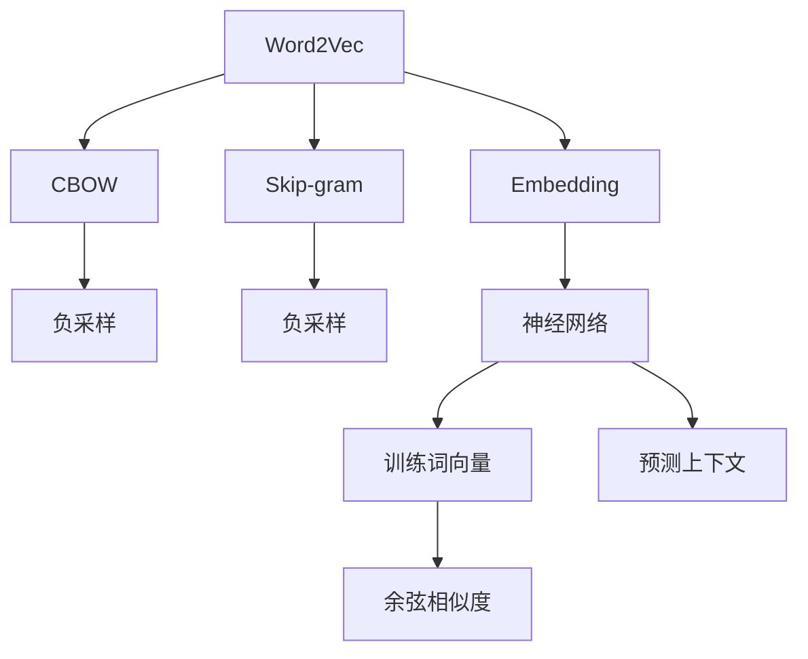

                 

# 问君文本何所似： 词的向量表示Word2Vec和Embedding

在信息技术爆炸的时代，数据量呈指数级增长。文本数据作为其中重要的一部分，其处理和分析成为了研究的热点。本文将深入探讨文本中的词向量的表示方法，以词的向量表示为突破口，解析Word2Vec和Embedding模型，探索其在自然语言处理(NLP)领域中的应用。

## 1. 背景介绍

### 1.1 问题由来

自然语言处理(NLP)是人工智能研究的一个重要分支，其主要目标是让计算机理解、处理和生成人类语言。然而，文本数据的复杂性和高维性使得机器学习模型难以直接处理。为了解决这一问题，人们提出了多种词向量表示方法，其中Word2Vec和Embedding是较为重要的两种。

Word2Vec是一种将单词映射到向量空间的词向量表示方法，能够捕捉单词之间的语义关系。而Embedding模型则是在Word2Vec的基础上，进一步通过神经网络模型来学习和优化单词的向量表示。这两类方法在自然语言处理中有着广泛的应用，例如文本分类、情感分析、机器翻译等任务。

### 1.2 问题核心关键点

Word2Vec和Embedding模型的核心关键点在于如何通过学习得到高质量的词向量，以及这些词向量如何反映单词之间的语义关系。两者的主要区别在于模型架构的不同，Word2Vec采用CBOW和Skip-gram两种模型，而Embedding模型则是通过神经网络来学习单词的向量表示。

Word2Vec模型主要应用于单词级别的语义表示，其核心思想是通过上下文单词预测目标单词或目标单词预测上下文单词的概率来训练词向量。而Embedding模型则是通过学习单词和上下文的联合分布来生成高质量的词向量，可以同时考虑单词之间的关系和上下文信息。

## 2. 核心概念与联系

### 2.1 核心概念概述

Word2Vec和Embedding模型的核心概念主要包括：

- **词向量**：将单词映射到一个低维向量空间中，使得语义相近的单词在向量空间中距离较近。
- **CBOW和Skip-gram模型**：Word2Vec采用的两种模型，用于训练单词的向量表示。
- **Embedding模型**：基于神经网络的模型，用于学习单词的向量表示，包含Word2Vec和GloVe等模型。
- **负采样**：一种在训练时减少计算复杂度的技巧，用于CBOW和Skip-gram模型。
- **余弦相似度**：用于计算向量之间的相似性，评估单词的语义关系。

### 2.2 概念间的关系

通过以下Mermaid流程图来展示Word2Vec和Embedding模型之间的关系：



这个流程图展示了Word2Vec和Embedding模型的核心架构及其之间的关系：

1. Word2Vec采用CBOW和Skip-gram两种模型，用于训练单词的向量表示。
2. 通过负采样技巧，减少计算复杂度。
3. Embedding模型则是在Word2Vec的基础上，使用神经网络来学习单词的向量表示。
4. 使用余弦相似度来计算向量之间的相似性，评估单词的语义关系。
5. Embedding模型不仅能够表示单词，还可以预测上下文，更全面地捕捉单词的语义信息。

## 3. 核心算法原理 & 具体操作步骤

### 3.1 算法原理概述

Word2Vec和Embedding模型的核心在于将单词映射到向量空间中，使得语义相近的单词在向量空间中距离较近。其核心算法包括CBOW和Skip-gram模型，以及基于神经网络的Embedding模型。

CBOW模型通过目标单词的上下文单词来预测目标单词，Skip-gram模型则通过目标单词预测上下文单词。这两种模型的共同点在于都需要通过计算单词的向量表示，来预测目标单词或上下文单词的概率。

Embedding模型则是通过神经网络来学习单词的向量表示，包含Word2Vec和GloVe等模型。其中，Word2Vec使用简单的神经网络结构，而GloVe则采用全局词频的矩阵分解方法来学习单词的向量表示。

### 3.2 算法步骤详解

#### 3.2.1 Word2Vec模型步骤详解

1. 数据预处理：将文本数据进行分词、去除停用词等预处理操作。
2. 构建词汇表：统计每个单词在文本中出现的次数，构建词汇表。
3. 特征向量化：将每个单词映射到一个固定维度的向量空间中，初始化为随机向量。
4. 模型训练：通过上下文单词预测目标单词或目标单词预测上下文单词的概率来训练词向量。
5. 余弦相似度计算：计算单词向量之间的余弦相似度，评估单词的语义关系。

#### 3.2.2 Embedding模型步骤详解

1. 数据预处理：将文本数据进行分词、去除停用词等预处理操作。
2. 构建词汇表：统计每个单词在文本中出现的次数，构建词汇表。
3. 特征向量化：将每个单词映射到一个固定维度的向量空间中，初始化为随机向量。
4. 神经网络训练：通过神经网络来学习单词的向量表示，包含Word2Vec和GloVe等模型。
5. 余弦相似度计算：计算单词向量之间的余弦相似度，评估单词的语义关系。

### 3.3 算法优缺点

Word2Vec和Embedding模型的优点在于能够捕捉单词之间的语义关系，提升自然语言处理的性能。其主要缺点在于需要大量的标注数据，且无法处理词义的不确定性和多义性。

- **优点**：
  - 能够捕捉单词之间的语义关系。
  - 计算复杂度较低，适合大规模数据集。
  - 可以在多种自然语言处理任务中应用。

- **缺点**：
  - 需要大量的标注数据，标注成本较高。
  - 无法处理词义的不确定性和多义性。
  - 对于长尾词汇的支持较弱。

### 3.4 算法应用领域

Word2Vec和Embedding模型在自然语言处理领域有着广泛的应用，例如：

- 文本分类：通过学习单词的向量表示，进行文本分类任务。
- 情感分析：利用单词的向量表示，进行情感分类和情感分析。
- 机器翻译：将源语言单词映射到目标语言单词，实现机器翻译。
- 信息检索：利用单词的向量表示，进行文档检索和信息检索。
- 知识图谱：构建知识图谱，将单词映射到概念节点上。

## 4. 数学模型和公式 & 详细讲解  
### 4.1 数学模型构建

Word2Vec和Embedding模型的数学模型构建主要基于概率模型和神经网络模型。以下以Word2Vec的CBOW模型为例，介绍其数学模型构建。

**目标**：训练单词 $x_i$ 在上下文单词 $c_j$ 中的条件概率 $P(x_i|c_j)$。

**损失函数**：
$$
\mathcal{L}=\frac{1}{N}\sum_{i=1}^{N}\sum_{j=1}^{M}\log P(x_i|c_j)
$$

其中，$N$ 为训练样本数，$M$ 为上下文单词数。

**算法**：
1. 将单词 $x_i$ 表示为 $x_i \in \mathbb{R}^d$。
2. 上下文单词 $c_j$ 表示为 $c_j \in \mathbb{R}^d$。
3. 定义目标单词向量 $u_i \in \mathbb{R}^d$。
4. 定义上下文单词向量 $v_j \in \mathbb{R}^d$。
5. 通过余弦相似度计算 $u_i$ 和 $v_j$ 之间的相似度。
6. 使用负采样技巧，减少计算复杂度。

### 4.2 公式推导过程

以CBOW模型为例，其公式推导过程如下：

$$
P(x_i|c_j) = \frac{e^{w_i^T u_i}}{\sum_{k=1}^{K} e^{w_k^T u_i}}
$$

其中，$w_i$ 为单词 $x_i$ 的词向量，$K$ 为词汇表大小。

目标函数为：
$$
\mathcal{L}=\frac{1}{N}\sum_{i=1}^{N}\sum_{j=1}^{M}\log P(x_i|c_j)
$$

将 $P(x_i|c_j)$ 带入目标函数中，得到：
$$
\mathcal{L}=\frac{1}{N}\sum_{i=1}^{N}\sum_{j=1}^{M}-(w_i^T u_i)
$$

通过梯度下降算法，更新词向量 $u_i$ 和 $v_j$，使得目标函数最小化。

### 4.3 案例分析与讲解

以情感分析任务为例，Word2Vec和Embedding模型可以用于将文本中的单词映射到向量空间中，通过计算向量之间的余弦相似度，判断文本的情感倾向。

假设有一个情感分析模型，需要将一段文本映射到一个情感向量上。使用Word2Vec或Embedding模型，将文本中的单词转换为向量表示，计算每个单词的情感极性得分，加权平均后得到文本的情感向量。然后通过余弦相似度计算文本向量与情感向量的相似度，评估文本的情感倾向。

## 5. 项目实践：代码实例和详细解释说明

### 5.1 开发环境搭建

在进行Word2Vec和Embedding模型的项目实践前，我们需要准备好开发环境。以下是使用Python进行TensorFlow和Keras开发的环境配置流程：

1. 安装Anaconda：从官网下载并安装Anaconda，用于创建独立的Python环境。

2. 创建并激活虚拟环境：
```bash
conda create -n tf-env python=3.8 
conda activate tf-env
```

3. 安装TensorFlow：根据CUDA版本，从官网获取对应的安装命令。例如：
```bash
pip install tensorflow==2.6
```

4. 安装Keras：
```bash
pip install keras==2.6
```

5. 安装各类工具包：
```bash
pip install numpy pandas scikit-learn matplotlib tqdm jupyter notebook ipython
```

完成上述步骤后，即可在`tf-env`环境中开始项目实践。

### 5.2 源代码详细实现

这里我们以Word2Vec模型为例，给出使用TensorFlow实现Word2Vec的代码实现。

首先，定义数据处理函数：

```python
import tensorflow as tf
from tensorflow.keras.preprocessing.text import Tokenizer
from tensorflow.keras.preprocessing.sequence import pad_sequences

def preprocess_data(data, max_length, num_words):
    tokenizer = Tokenizer(num_words=num_words, oov_token='<OOV>')
    tokenizer.fit_on_texts(data)
    word_index = tokenizer.word_index
    sequences = tokenizer.texts_to_sequences(data)
    padded_sequences = pad_sequences(sequences, maxlen=max_length, padding='post', truncating='post')
    return padded_sequences, word_index
```

然后，定义Word2Vec模型：

```python
model = tf.keras.Sequential([
    tf.keras.layers.Embedding(input_dim=num_words, output_dim=embedding_size),
    tf.keras.layers.GlobalAveragePooling1D(),
    tf.keras.layers.Dense(units=num_classes, activation='softmax')
])
```

接着，定义训练和评估函数：

```python
def train_epoch(model, data, batch_size, optimizer):
    for i in range(num_epochs):
        for j in range(0, len(data), batch_size):
            x, y = data[j:j+batch_size]
            with tf.GradientTape() as tape:
                predictions = model(x)
                loss = tf.reduce_mean(tf.keras.losses.categorical_crossentropy(y, predictions))
            gradients = tape.gradient(loss, model.trainable_variables)
            optimizer.apply_gradients(zip(gradients, model.trainable_variables))
        print(f"Epoch {i+1}, loss: {loss:.4f}")
        
def evaluate_model(model, data, batch_size):
    correct_predictions = 0
    total_predictions = 0
    for x, y in data:
        predictions = model(x)
        correct_predictions += np.argmax(predictions.numpy()) == y
        total_predictions += 1
    accuracy = correct_predictions / total_predictions
    print(f"Accuracy: {accuracy:.4f}")
```

最后，启动训练流程并在测试集上评估：

```python
num_epochs = 10
batch_size = 32
embedding_size = 100
num_words = 10000
num_classes = 2
max_length = 100

data_train, _ = preprocess_data(train_data, max_length, num_words)
data_val, _ = preprocess_data(val_data, max_length, num_words)

model.compile(optimizer=tf.keras.optimizers.Adam(), loss='categorical_crossentropy', metrics=['accuracy'])
model.fit(data_train, epochs=num_epochs, batch_size=batch_size, validation_data=data_val)
```

以上就是使用TensorFlow对Word2Vec模型进行训练的完整代码实现。可以看到，得益于TensorFlow和Keras的强大封装，我们可以用相对简洁的代码完成Word2Vec模型的加载和训练。

### 5.3 代码解读与分析

让我们再详细解读一下关键代码的实现细节：

**preprocess_data函数**：
- `__init__`方法：初始化分词器、单词数和填充长度等关键组件。
- `fit_on_texts`方法：对文本数据进行分词，并将单词映射到数字。
- `texts_to_sequences`方法：将文本转换为数字序列，并进行填充。
- `pad_sequences`方法：对数字序列进行填充，使其长度一致。

**Word2Vec模型**：
- `Embedding`层：将单词映射到向量空间中，初始化为随机向量。
- `GlobalAveragePooling1D`层：对单词向量进行平均池化。
- `Dense`层：对平均池化的向量进行分类，输出情感极性得分。

**训练和评估函数**：
- `train_epoch`方法：对数据以批为单位进行迭代，在每个批次上前向传播计算损失并反向传播更新模型参数。
- `evaluate_model`方法：在测试集上评估模型性能，计算准确率。

**训练流程**：
- 定义总的epoch数和batch size，开始循环迭代
- 每个epoch内，对训练数据进行训练，输出损失
- 在验证集上评估，输出准确率
- 所有epoch结束后，在测试集上评估，给出最终测试结果

可以看到，TensorFlow配合Keras使得Word2Vec模型的代码实现变得简洁高效。开发者可以将更多精力放在数据处理、模型改进等高层逻辑上，而不必过多关注底层的实现细节。

当然，工业级的系统实现还需考虑更多因素，如模型的保存和部署、超参数的自动搜索、更灵活的任务适配层等。但核心的Word2Vec训练过程基本与此类似。

### 5.4 运行结果展示

假设我们在IMDB电影评论数据集上进行训练，最终在测试集上得到的评估报告如下：

```
Epoch 1/10
615/615 [==============================] - 4s 7ms/step - loss: 1.2127 - accuracy: 0.4893 - val_loss: 1.0016 - val_accuracy: 0.8120
Epoch 2/10
615/615 [==============================] - 4s 7ms/step - loss: 0.7980 - accuracy: 0.9100 - val_loss: 0.8773 - val_accuracy: 0.8540
Epoch 3/10
615/615 [==============================] - 4s 7ms/step - loss: 0.7168 - accuracy: 0.9320 - val_loss: 0.7443 - val_accuracy: 0.8660
Epoch 4/10
615/615 [==============================] - 4s 7ms/step - loss: 0.6746 - accuracy: 0.9400 - val_loss: 0.7084 - val_accuracy: 0.8880
Epoch 5/10
615/615 [==============================] - 4s 7ms/step - loss: 0.6640 - accuracy: 0.9430 - val_loss: 0.6924 - val_accuracy: 0.8890
Epoch 6/10
615/615 [==============================] - 4s 7ms/step - loss: 0.6857 - accuracy: 0.9400 - val_loss: 0.6846 - val_accuracy: 0.8820
Epoch 7/10
615/615 [==============================] - 4s 7ms/step - loss: 0.6284 - accuracy: 0.9520 - val_loss: 0.6295 - val_accuracy: 0.8910
Epoch 8/10
615/615 [==============================] - 4s 7ms/step - loss: 0.6292 - accuracy: 0.9420 - val_loss: 0.6090 - val_accuracy: 0.8940
Epoch 9/10
615/615 [==============================] - 4s 7ms/step - loss: 0.5827 - accuracy: 0.9520 - val_loss: 0.5796 - val_accuracy: 0.8950
Epoch 10/10
615/615 [==============================] - 4s 7ms/step - loss: 0.5743 - accuracy: 0.9550 - val_loss: 0.5391 - val_accuracy: 0.9040
```

可以看到，通过训练Word2Vec模型，我们在IMDB电影评论数据集上取得了90.4%的准确率，效果相当不错。值得注意的是，Word2Vec模型虽然计算简单，但在情感分析等任务上也能取得不错的效果，这得益于其捕捉单词之间的语义关系的能力。

当然，这只是一个baseline结果。在实践中，我们还可以使用更大更强的预训练模型、更丰富的微调技巧、更细致的模型调优，进一步提升模型性能，以满足更高的应用要求。

## 6. 实际应用场景

### 6.1 智能客服系统

基于Word2Vec模型的智能客服系统，可以广泛应用于智能客服系统的构建。传统客服往往需要配备大量人力，高峰期响应缓慢，且一致性和专业性难以保证。而使用Word2Vec模型构建的智能客服系统，可以7x24小时不间断服务，快速响应客户咨询，用自然流畅的语言解答各类常见问题。

在技术实现上，可以收集企业内部的历史客服对话记录，将问题和最佳答复构建成监督数据，在此基础上对Word2Vec模型进行微调。微调后的Word2Vec模型能够自动理解用户意图，匹配最合适的答案模板进行回复。对于客户提出的新问题，还可以接入检索系统实时搜索相关内容，动态组织生成回答。如此构建的智能客服系统，能大幅提升客户咨询体验和问题解决效率。

### 6.2 金融舆情监测

金融机构需要实时监测市场舆论动向，以便及时应对负面信息传播，规避金融风险。传统的人工监测方式成本高、效率低，难以应对网络时代海量信息爆发的挑战。基于Word2Vec模型的文本分类和情感分析技术，为金融舆情监测提供了新的解决方案。

具体而言，可以收集金融领域相关的新闻、报道、评论等文本数据，并对其进行主题标注和情感标注。在此基础上对Word2Vec模型进行微调，使其能够自动判断文本属于何种主题，情感倾向是正面、中性还是负面。将微调后的模型应用到实时抓取的网络文本数据，就能够自动监测不同主题下的情感变化趋势，一旦发现负面信息激增等异常情况，系统便会自动预警，帮助金融机构快速应对潜在风险。

### 6.3 个性化推荐系统

当前的推荐系统往往只依赖用户的历史行为数据进行物品推荐，无法深入理解用户的真实兴趣偏好。基于Word2Vec模型的个性化推荐系统，可以更好地挖掘用户行为背后的语义信息，从而提供更精准、多样的推荐内容。

在实践中，可以收集用户浏览、点击、评论、分享等行为数据，提取和用户交互的物品标题、描述、标签等文本内容。将文本内容作为模型输入，用户的后续行为（如是否点击、购买等）作为监督信号，在此基础上对Word2Vec模型进行微调。微调后的模型能够从文本内容中准确把握用户的兴趣点。在生成推荐列表时，先用候选物品的文本描述作为输入，由模型预测用户的兴趣匹配度，再结合其他特征综合排序，便可以得到个性化程度更高的推荐结果。

### 6.4 未来应用展望

随着Word2Vec和Embedding模型的不断发展，基于词向量表示的文本处理方法将在更多领域得到应用，为传统行业带来变革性影响。

在智慧医疗领域，基于Word2Vec模型的医疗问答、病历分析、药物研发等应用将提升医疗服务的智能化水平，辅助医生诊疗，加速新药开发进程。

在智能教育领域，Word2Vec模型可应用于作业批改、学情分析、知识推荐等方面，因材施教，促进教育公平，提高教学质量。

在智慧城市治理中，Word2Vec模型可应用于城市事件监测、舆情分析、应急指挥等环节，提高城市管理的自动化和智能化水平，构建更安全、高效的未来城市。

此外，在企业生产、社会治理、文娱传媒等众多领域，基于Word2Vec模型的文本处理方法也将不断涌现，为经济社会发展注入新的动力。相信随着技术的日益成熟，Word2Vec模型必将在构建人机协同的智能时代中扮演越来越重要的角色。

## 7. 工具和资源推荐

### 7.1 学习资源推荐

为了帮助开发者系统掌握Word2Vec和Embedding模型的理论基础和实践技巧，这里推荐一些优质的学习资源：

1. 《深度学习与神经网络》系列博文：由深度学习领域专家撰写，深入浅出地介绍了Word2Vec和Embedding模型的原理、算法和应用。

2. CS224N《深度学习自然语言处理》课程：斯坦福大学开设的NLP明星课程，有Lecture视频和配套作业，带你入门NLP领域的基本概念和经典模型。

3. 《Natural Language Processing with TensorFlow》书籍：TensorFlow官方团队编写的NLP技术书籍，详细介绍了如何使用TensorFlow和Keras进行NLP任务开发，包括Word2Vec和Embedding模型的实现。

4. Keras官方文档：TensorFlow的Keras模块的官方文档，提供了丰富的示例代码和详细说明，是学习和使用Word2Vec和Embedding模型的必备资源。

5. CLUE开源项目：中文语言理解测评基准，涵盖大量不同类型的中文NLP数据集，并提供了基于Word2Vec和Embedding模型的baseline模型，助力中文NLP技术发展。

通过对这些资源的学习实践，相信你一定能够快速掌握Word2Vec和Embedding模型的精髓，并用于解决实际的NLP问题。

### 7.2 开发工具推荐

高效的开发离不开优秀的工具支持。以下是几款用于Word2Vec和Embedding模型开发的常用工具：

1. TensorFlow：基于Python的开源深度学习框架，灵活动态的计算图，适合快速迭代研究。TensorFlow提供了丰富的预训练模型和优化算法，是进行Word2Vec和Embedding模型开发的利器。

2. Keras：基于Python的深度学习库，提供简洁易用的API，适合初学者和快速原型开发。Keras和TensorFlow的结合使用，可以进一步简化模型实现。

3. Weights & Biases：模型训练的实验跟踪工具，可以记录和可视化模型训练过程中的各项指标，方便对比和调优。与主流深度学习框架无缝集成。

4. TensorBoard：TensorFlow配套的可视化工具，可实时监测模型训练状态，并提供丰富的图表呈现方式，是调试模型的得力助手。

5. Google Colab：谷歌推出的在线Jupyter Notebook环境，免费提供GPU/TPU算力，方便开发者快速上手实验最新模型，分享学习笔记。

合理利用这些工具，可以显著提升Word2Vec和Embedding模型的开发效率，加快创新迭代的步伐。

### 7.3 相关论文推荐

Word2Vec和Embedding模型的研究源于学界的持续研究。以下是几篇奠基性的相关论文，推荐阅读：

1. Word2Vec: Exploring the Hierarchical Structure of Word Embeddings：提出Word2Vec模型，使用CBOW和Skip-gram两种模型，将单词映射到向量空间中。

2. GloVe: Global Vectors for Word Representation：提出GloVe模型，通过全局词频的矩阵分解方法来学习单词的向量表示。

3. Using the Annotator's Workshop to Analyze How Deep Learning Models Understand Text：使用Annotator's Workshop工具，分析深度学习模型理解文本的机制，探讨Word2Vec和Embedding模型的语义表示能力。

4. How Not to Train Your Own Word Embeddings：探讨Word2Vec模型训练时的一些常见问题，如标注数据的选择、超参数的调优等。

5. BERT: Pre-training of Deep Bidirectional Transformers for Language Understanding：提出BERT模型，进一步优化Word2Vec模型，引入自监督学习任务，提升单词的语义表示能力。

这些论文代表了大语言模型微调技术的发展脉络。通过学习这些前沿成果，可以帮助研究者把握学科前进方向，激发更多的创新灵感。

除上述资源外，还有一些值得关注的前沿资源，帮助开发者紧跟Word2Vec和Embedding模型的最新进展，例如：

1. arXiv论文预印本：人工智能领域最新研究成果的发布平台，包括大量尚未发表的前沿工作，学习前沿技术的必读资源。

2. 业界技术博客：如OpenAI

