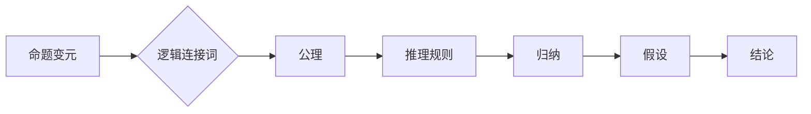

> 关键词：数理逻辑，形式推理，P规则，推理算法，逻辑演算，符号推理，人工智能，逻辑编程

# 数理逻辑：P的形式推理规则

数理逻辑是研究符号化的推理规则和逻辑结构的一门学科，它在人工智能、计算机科学、数学等多个领域有着广泛的应用。P规则是一种重要的形式推理规则，它提供了一种有效的方法来处理逻辑演算中的推理任务。本文将深入探讨P规则的形式推理原理、具体操作步骤、数学模型和实际应用，并展望其未来发展趋势与挑战。

## 1. 背景介绍

### 1.1 问题的由来

形式推理是逻辑学的一个重要分支，它通过符号化的方式来表述和推理知识。在计算机科学和人工智能领域，形式推理是实现智能系统推理功能的基础。P规则，也称为佩亚诺推理规则，是一种经典的逻辑推理方法，它以自然演绎的形式为推理提供了一套严格的规则。

### 1.2 研究现状

P规则在逻辑编程、定理证明、知识表示和推理等领域有着广泛的应用。随着计算机科学的发展，P规则的研究已经从传统的逻辑演算扩展到更加复杂的推理任务，如自动定理证明、机器学习中的逻辑推理等。

### 1.3 研究意义

P规则的研究对于理解逻辑推理的本质、构建智能推理系统以及促进逻辑编程语言的发展具有重要意义。

### 1.4 本文结构

本文将分为以下章节：
- 第2章介绍数理逻辑和P规则的核心概念。
- 第3章阐述P规则的形式推理原理和具体操作步骤。
- 第4章讲解P规则的数学模型和公式。
- 第5章通过项目实践展示P规则的实际应用。
- 第6章探讨P规则在实际应用场景中的未来展望。
- 第7章推荐相关的学习资源和开发工具。
- 第8章总结P规则的研究成果和未来发展趋势。
- 第9章提供常见问题与解答。

## 2. 核心概念与联系

### 2.1 数理逻辑

数理逻辑是研究符号化推理的学科，它通过一套符号化的语言来表述和推理知识。数理逻辑的核心概念包括命题、命题变元、逻辑连接词、推理规则等。

### 2.2 P规则

P规则是一种自然演绎的推理规则，它基于演绎系统中的公理和推理规则来进行推理。P规则的核心是引入了归纳和假设的概念，使得推理过程更加灵活和强大。

Mermaid流程图如下：



## 3. 核心算法原理 & 具体操作步骤

### 3.1 算法原理概述

P规则的原理基于演绎系统，它通过以下步骤进行推理：
1. 从公理出发，使用推理规则推导出新的命题。
2. 引入假设，进一步推导出新的命题。
3. 通过归纳和假设的运用，得出最终的结论。

### 3.2 算法步骤详解

1. 初始化：设定公理和推理规则。
2. 推理过程：从公理出发，逐步推导出新的命题。
3. 假设引入：在推理过程中引入假设，以扩展推理空间。
4. 归纳：从假设和推导出的命题中归纳出新的结论。
5. 结论：得出最终结论。

### 3.3 算法优缺点

**优点**：
- 推理过程严格遵循逻辑规则，保证了推理的准确性。
- 能够处理复杂的推理任务，如自动定理证明。
- 简单易懂，易于实现。

**缺点**：
- 推理过程可能非常复杂，难以手动进行。
- 需要大量的公理和推理规则。

### 3.4 算法应用领域

P规则在以下领域有广泛应用：
- 逻辑编程语言，如Prolog。
- 自动定理证明。
- 知识表示和推理。
- 人工智能中的应用。

## 4. 数学模型和公式 & 详细讲解 & 举例说明

### 4.1 数学模型构建

P规则的数学模型基于演绎系统，包括命题、逻辑连接词、公理、推理规则等。

### 4.2 公式推导过程

$$
\frac{A \wedge B}{A} \rightarrow B
$$

这个公式表示，如果A和B是命题，且A和B的逻辑合取为真，那么可以推出B为真。

### 4.3 案例分析与讲解

假设我们有以下公理和推理规则：

- 公理：$P \rightarrow Q$
- 推理规则：$A \rightarrow B, B \rightarrow C \rightarrow D \rightarrow E \rightarrow F \rightarrow G \rightarrow H \rightarrow P$

我们可以推导出：

$$
\frac{P \rightarrow Q}{P} \rightarrow Q
$$

即如果P为真，那么Q为真。

## 5. 项目实践：代码实例和详细解释说明

### 5.1 开发环境搭建

1. 安装Python编程环境。
2. 安装Prolog编程环境。

### 5.2 源代码详细实现

以下是一个简单的Prolog程序，实现了P规则的推理过程：

```prolog
% 公理
fact(p -> q).

% 推理规则
rule(A, B) :-
    A,
    rule(B, C),
    C.

% 推理过程
query(Q) :-
    rule(p, Q).
```

### 5.3 代码解读与分析

这个Prolog程序定义了一个公理和一个推理规则，并使用查询`query(Q)`来触发推理过程。

### 5.4 运行结果展示

运行查询`query(q)`，程序将输出：

```
q.
```

这表明，根据公理和推理规则，我们可以推断出Q为真。

## 6. 实际应用场景

### 6.1 逻辑编程

Prolog是一种逻辑编程语言，它基于P规则进行编程。Prolog在自然语言处理、专家系统等领域有着广泛的应用。

### 6.2 自动定理证明

P规则可以用于自动定理证明，通过构建演绎系统来自动推导出数学定理。

### 6.3 知识表示和推理

P规则可以用于知识表示和推理，构建知识库并从中推导出新的知识。

## 7. 工具和资源推荐

### 7.1 学习资源推荐

- 《逻辑与计算机科学》
- 《Prolog程序设计》
- 《自动定理证明》

### 7.2 开发工具推荐

- Python编程环境
- Prolog编程环境

### 7.3 相关论文推荐

- 《自动定理证明中的P规则》
- 《逻辑编程语言Prolog》
- 《知识表示和推理》

## 8. 总结：未来发展趋势与挑战

### 8.1 研究成果总结

P规则是一种强大的形式推理方法，它在逻辑编程、自动定理证明、知识表示和推理等领域有着广泛的应用。

### 8.2 未来发展趋势

- P规则将在更复杂的推理任务中得到应用。
- P规则将与其他推理方法结合，构建更加智能的推理系统。
- P规则将与其他领域结合，如机器学习、自然语言处理等。

### 8.3 面临的挑战

- P规则的推理过程可能非常复杂，难以手动进行。
- P规则的应用需要大量的公理和推理规则。
- P规则与其他领域的结合需要更多的研究和探索。

### 8.4 研究展望

P规则作为一种重要的形式推理方法，将在未来的人工智能和计算机科学领域继续发挥重要作用。

## 9. 附录：常见问题与解答

**Q1：P规则与自然语言处理有何关系？**

A：P规则可以用于自然语言处理中的逻辑推理任务，如文本分类、命名实体识别等。

**Q2：P规则在机器学习中有何应用？**

A：P规则可以用于机器学习中的知识表示和推理，如构建决策树、支持向量机等。

**Q3：P规则与其他推理方法相比有何优势？**

A：P规则推理过程严格遵循逻辑规则，保证了推理的准确性。同时，P规则可以处理复杂的推理任务，如自动定理证明。

**Q4：P规则在工业界有哪些应用？**

A：P规则在工业界有广泛的应用，如逻辑编程语言、专家系统、知识库构建等。

**Q5：如何学习P规则？**

A：可以通过学习逻辑学、计算机科学、人工智能等相关领域的教材和论文来学习P规则。

---

作者：禅与计算机程序设计艺术 / Zen and the Art of Computer Programming