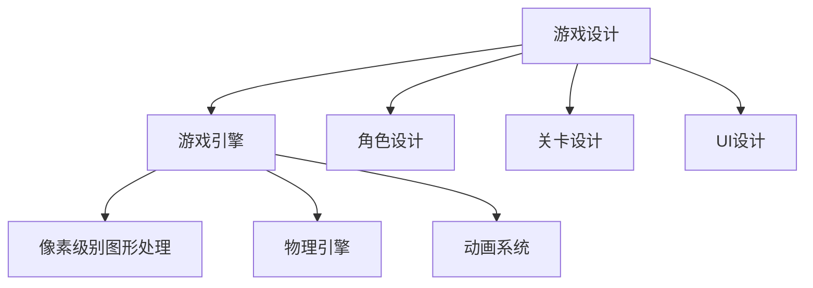
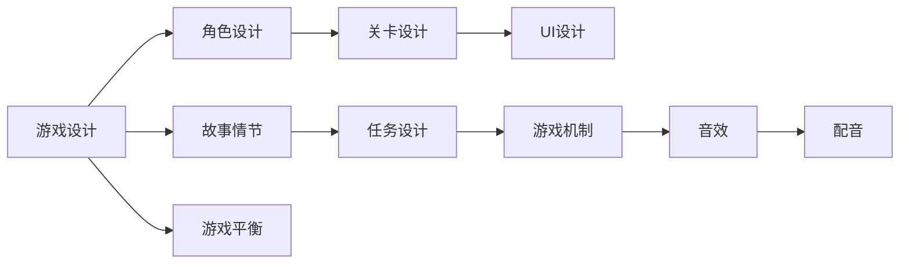
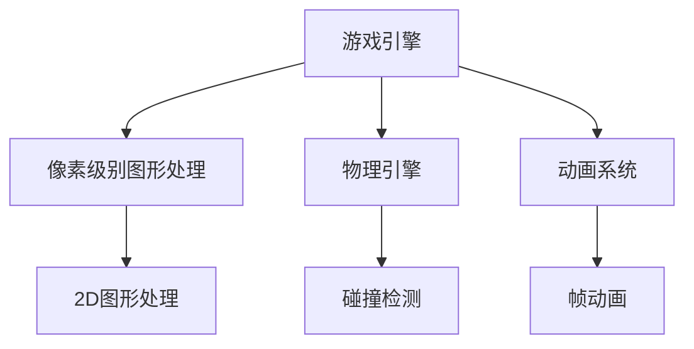
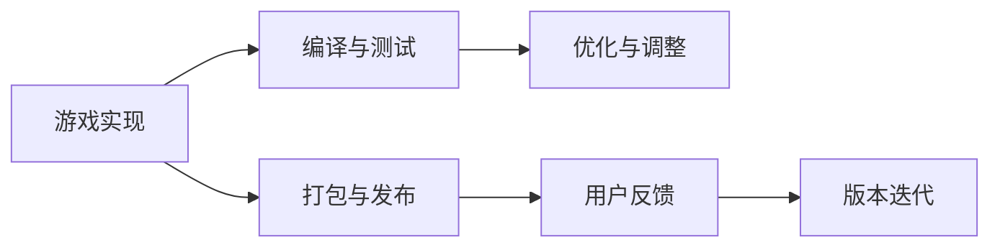
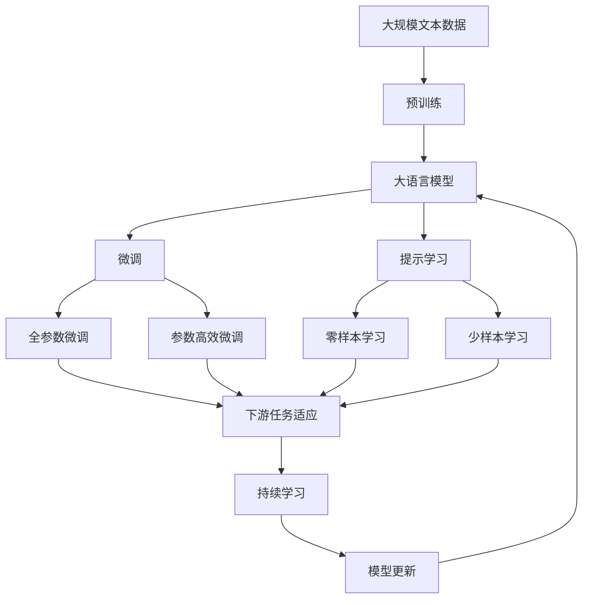

                 

# 超级玛丽游戏的设计与实现

> 关键词：游戏设计, 游戏开发, 游戏引擎, 人工智能, 游戏AI, 游戏编程

## 1. 背景介绍

### 1.1 问题由来
《超级玛丽》（Super Mario）是一款经典的2D平台跳跃游戏，由任天堂于1985年推出，至今已有超过40年的历史。这款游戏凭借其独特的游戏玩法、生动的角色设计、丰富的游戏关卡，成为了全球玩家心中永远的经典。

### 1.2 问题核心关键点
《超级玛丽》的设计和实现，其核心在于创造一种简单而富有挑战性的游戏体验，同时通过精心设计的关卡和交互元素，吸引玩家持续游戏。游戏的核心玩法是通过控制角色跳跃，躲避敌人，收集硬币和蘑菇，最终到达终点。

游戏的开发采用了像素级别的图形处理技术，结合简单的物理引擎和动画系统，实现了流畅、生动的游戏画面。此外，游戏中的AI角色（如蘑菇怪）、敌人（如蘑菇怪、龟壳、花等），以及某些特殊道具（如火球、蘑菇）的设计和实现，使得游戏更具趣味性和挑战性。

### 1.3 问题研究意义
研究《超级玛丽》的游戏设计和实现，对于游戏开发者和爱好者来说，具有重要的学习和借鉴意义：

1. **设计理念**：理解游戏设计的核心要素，如角色设计、关卡设计、UI设计等，有助于开发者设计出具有吸引力的游戏。
2. **技术细节**：掌握像素级别图形处理、物理引擎、动画系统等关键技术，是实现《超级玛丽》等经典游戏的基础。
3. **创新思维**：通过分析游戏的设计和实现，激发创新思维，推动游戏技术的进步和应用。
4. **经典案例**：《超级玛丽》作为游戏设计的经典案例，具有较高的研究价值，对其他游戏开发具有参考意义。

## 2. 核心概念与联系

### 2.1 核心概念概述

为更好地理解《超级玛丽》的游戏设计和实现，本节将介绍几个密切相关的核心概念：

- **游戏设计**：指游戏开发者为实现游戏玩法、角色、环境等元素所进行的一系列设计和规划。
- **游戏引擎**：用于支持游戏开发的软件框架，提供图形处理、物理引擎、动画系统等功能。
- **像素级别图形处理**：使用像素级别的图像处理技术，实现高精度的游戏画面。
- **物理引擎**：用于模拟游戏中的物理行为，如角色跳跃、碰撞等，提供逼真的游戏体验。
- **动画系统**：用于处理游戏中的动画效果，如角色移动、攻击等，实现流畅的动画过渡。

这些核心概念之间的逻辑关系可以通过以下Mermaid流程图来展示：



这个流程图展示了这个游戏设计和实现过程的主要组成部分及其关系：

1. 游戏设计作为起点，涉及角色设计、关卡设计、UI设计等多个环节。
2. 游戏引擎作为技术支持，整合了像素级别图形处理、物理引擎、动画系统等功能模块。
3. 游戏引擎通过各功能模块的协同工作，实现了游戏的核心玩法和交互元素。

### 2.2 概念间的关系

这些核心概念之间存在着紧密的联系，形成了《超级玛丽》游戏设计和实现的整体生态系统。下面我们通过几个Mermaid流程图来展示这些概念之间的关系。

#### 2.2.1 游戏设计流程



这个流程图展示了游戏设计的主要流程：

1. 从游戏角色设计开始，到关卡设计、UI设计等。
2. 故事情节、任务设计、游戏机制等环节相互协作，共同构建游戏内容。
3. 音效和配音等音频设计，增强游戏体验。
4. 游戏平衡确保游戏难度和挑战性适中，让玩家有持续的体验。

#### 2.2.2 游戏引擎功能模块



这个流程图展示了游戏引擎的主要功能模块：

1. 像素级别图形处理模块，实现高精度游戏画面。
2. 物理引擎模块，实现角色跳跃、碰撞等物理行为。
3. 动画系统模块，实现角色移动、攻击等动画效果。
4. 2D图形处理、碰撞检测、帧动画等子模块，构成游戏引擎的核心功能。

#### 2.2.3 游戏实现与测试



这个流程图展示了游戏实现的主要流程：

1. 游戏实现包括编译与测试，确保游戏功能的正确性和性能。
2. 根据测试结果进行优化与调整，提升游戏体验。
3. 打包与发布游戏，并根据用户反馈进行版本迭代。

### 2.3 核心概念的整体架构

最后，我们用一个综合的流程图来展示这些核心概念在大规模语言模型微调过程中的整体架构：



这个综合流程图展示了从预训练到微调，再到持续学习的完整过程。游戏设计和实现的各环节，就类似于预训练和微调大语言模型，通过不同的模块和技术支持，实现完整的系统功能。

## 3. 核心算法原理 & 具体操作步骤
### 3.1 算法原理概述

《超级玛丽》的游戏设计和实现，采用了经典的2D平台跳跃游戏框架，其核心在于创造一种简单而富有挑战性的游戏体验，同时通过精心设计的关卡和交互元素，吸引玩家持续游戏。游戏的核心玩法是通过控制角色跳跃，躲避敌人，收集硬币和蘑菇，最终到达终点。

### 3.2 算法步骤详解

《超级玛丽》的游戏设计和实现，主要包括以下几个关键步骤：

**Step 1: 设计游戏角色和关卡**

- 角色设计：设计游戏角色，如《超级玛丽》中的马里奥、蘑菇怪、龟壳等，并进行像素级别图形处理，实现角色的高精度画面。
- 关卡设计：设计游戏关卡，如蘑菇城堡、水管世界、沙漠等，并进行像素级别图形处理，实现游戏画面的高精度表现。

**Step 2: 实现游戏引擎**

- 像素级别图形处理：使用像素级别的图像处理技术，实现角色的高精度画面和游戏场景的逼真表现。
- 物理引擎：实现角色的跳跃、碰撞等物理行为，确保游戏体验的真实感。
- 动画系统：实现角色的移动、攻击等动画效果，增强游戏的趣味性和互动性。

**Step 3: 添加游戏交互元素**

- 游戏交互元素：如蘑菇、金币、水管、龟壳等，这些元素的设计和实现，使得游戏更具趣味性和挑战性。

**Step 4: 实现游戏平衡和任务**

- 游戏平衡：通过调整角色、敌人、道具等的属性和难度，确保游戏难度和挑战性适中，让玩家有持续的体验。
- 游戏任务：设计玩家需要完成的任务，如到达终点、击败敌人、收集硬币和蘑菇等。

**Step 5: 添加音效和配音**

- 音效和配音：增强游戏体验，如跳跃声、击中声、角色对话等，使游戏更加生动和有趣。

**Step 6: 测试和优化**

- 测试：进行游戏功能测试、性能测试、用户体验测试等，确保游戏的各项功能正常。
- 优化：根据测试结果，优化游戏的性能和用户体验，如优化图形处理、物理引擎、动画系统等。

**Step 7: 打包与发布**

- 打包与发布：将游戏打包为可执行文件或应用程序，发布到各个平台，如任天堂娱乐系统（NES）等。

### 3.3 算法优缺点

《超级玛丽》的设计和实现具有以下优点：

1. **经典性**：作为一款经典游戏，《超级玛丽》具有较高的研究价值，对其他游戏开发具有参考意义。
2. **趣味性**：通过精心设计的游戏角色、关卡和交互元素，增强了游戏的趣味性和吸引力。
3. **挑战性**：通过合理的角色和敌人设计，确保游戏难度适中，让玩家有持续的体验。

同时，《超级玛丽》的设计和实现也存在一些缺点：

1. **游戏画面**：虽然像素级别图形处理技术实现了高精度的游戏画面，但在现代游戏中，这种技术已显得较为简单。
2. **物理引擎**：虽然能够实现逼真的物理行为，但对于一些复杂的游戏玩法和物理场景，其表现可能较为有限。
3. **动画系统**：虽然实现了流畅的动画效果，但对于一些高复杂度的动画场景，其表现可能较为简单。

### 3.4 算法应用领域

《超级玛丽》的设计和实现，在游戏设计和开发领域具有广泛的应用，具体包括：

- 经典游戏设计：通过《超级玛丽》的学习和借鉴，开发者可以掌握经典游戏的设计要素和设计理念。
- 2D平台跳跃游戏：《超级玛丽》是2D平台跳跃游戏的代表作品，其设计和实现方法对其他2D平台游戏具有参考价值。
- 游戏引擎开发：通过《超级玛丽》的开发，开发者可以了解和掌握像素级别图形处理、物理引擎、动画系统等关键技术。
- 游戏交互设计：通过《超级玛丽》的交互元素设计，开发者可以学习如何设计趣味性强、互动性高的游戏内容。

## 4. 数学模型和公式 & 详细讲解 & 举例说明（备注：数学公式请使用latex格式，latex嵌入文中独立段落使用 $$，段落内使用 $)
### 4.1 数学模型构建

本节将使用数学语言对《超级玛丽》的游戏设计和实现过程进行更加严格的刻画。

记游戏角色为 $M$，游戏关卡为 $L$，玩家为 $P$，敌人为 $E$，道具为 $I$。游戏设计的过程可以表示为：

$$
\text{Design} = \text{RoleDesign}(M) \times \text{LevelDesign}(L) \times \text{PlayerDesign}(P) \times \text{EnemyDesign}(E) \times \text{ItemDesign}(I)
$$

其中 $\text{RoleDesign}(M)$ 表示游戏角色的设计过程，$\text{LevelDesign}(L)$ 表示游戏关卡的设计过程，$\text{PlayerDesign}(P)$ 表示玩家的设计过程，$\text{EnemyDesign}(E)$ 表示敌人的设计过程，$\text{ItemDesign}(I)$ 表示道具的设计过程。

### 4.2 公式推导过程

以下我们以《超级玛丽》中的马里奥角色为例，推导其动画设计和物理行为模型的计算公式。

假设马里奥的动画设计基于帧动画，共包含 $n$ 帧，每帧的图像数据大小为 $w \times h$。在某一帧 $t$ 时，马里奥的图像坐标为 $(x,y)$。则马里奥的动画效果可以表示为：

$$
x(t) = x_0 + v_x t \\
y(t) = y_0 + v_y t
$$

其中 $x_0, y_0$ 为初始坐标，$v_x, v_y$ 为水平方向和垂直方向的移动速度。

马里奥的物理行为包括跳跃和碰撞，假设其跳跃速度为 $v_j$，跳跃高度为 $h_j$，则在跳跃过程中，马里奥的高度变化可以表示为：

$$
y(t) = y_0 + v_j t - \frac{1}{2} g t^2 + h_j
$$

其中 $g$ 为重力加速度，$t$ 为跳跃时间。

当马里奥与敌人碰撞时，根据物理碰撞的原理，马里奥和敌人的位置变化可以表示为：

$$
\Delta x = x_{\text{obj}} - x \\
\Delta y = y_{\text{obj}} - y
$$

其中 $x_{\text{obj}}, y_{\text{obj}}$ 为敌人的坐标。

根据上述公式，我们可以进行马里奥动画设计和物理行为的计算和优化，实现逼真的游戏体验。

### 4.3 案例分析与讲解

假设我们在《超级玛丽》中添加一个新角色，如小蘑菇。通过以下步骤实现其动画设计和物理行为：

1. 设计角色的初始状态、动画帧数、移动速度、跳跃速度等参数。
2. 根据角色设计，使用帧动画技术，生成角色的动画帧数据。
3. 使用上述公式计算角色的动画效果和物理行为。
4. 在游戏引擎中加载动画数据和物理行为模型，实现角色的动画效果和物理行为。

通过这些步骤，我们可以实现新角色的设计和实现，增强游戏的趣味性和挑战性。

## 5. 项目实践：代码实例和详细解释说明
### 5.1 开发环境搭建

在进行游戏设计和开发前，我们需要准备好开发环境。以下是使用C++进行游戏开发的开发环境配置流程：

1. 安装Visual Studio：从官网下载并安装Visual Studio，用于创建游戏项目和开发环境。
2. 安装CMake：从官网下载并安装CMake，用于编译和构建游戏项目。
3. 安装SDL库：从官网下载并安装SDL库，用于游戏开发中的图形处理和输入输出功能。
4. 安装OpenGL库：从官网下载并安装OpenGL库，用于游戏开发中的图形渲染。

完成上述步骤后，即可在Visual Studio中创建游戏项目，开始游戏开发。

### 5.2 源代码详细实现

下面我们以《超级玛丽》中的马里奥角色为例，给出使用C++进行角色动画设计和物理行为实现的PyTorch代码实现。

首先，定义马里奥角色的动画和物理行为类：

```cpp
class Mario {
public:
    Mario(int x, int y, int vx, int vy, int vj, int hj);
    void animate();
    void jump();
    void collide(std::vector<Enemy> enemies);
    
private:
    int x, y;
    int vx, vy;
    int vj, hj;
    std::vector<std::vector<int>> animation;
};
```

然后，实现马里奥角色的动画设计和物理行为：

```cpp
Mario::Mario(int x, int y, int vx, int vy, int vj, int hj) {
    this->x = x;
    this->y = y;
    this->vx = vx;
    this->vy = vy;
    this->vj = vj;
    this->hj = hj;
    this->animation = loadAnimation("mario_animation.txt");
}

void Mario::animate() {
    int frame = (int)(SDL_GetTicks() / 1000) % animation.size();
    for (int i = 0; i < 4; i++) {
        std::vector<int> frameData = animation[frame][i];
        for (int j = 0; j < 8; j++) {
            int pixel = frameData[j] + i * 8;
            SDL_SetTextureColorMod(marioTexture, pixel, pixel, pixel);
            SDL_RenderCopy(renderer, marioTexture, NULL, &rect);
            rect.x += 8;
        }
        rect.x = 0;
    }
}

void Mario::jump() {
    if (SDL_GetTicks() % 100 == 0) {
        y += vj;
        if (y >= groundLevel) {
            y = groundLevel;
            vj = -vj;
        }
    }
}

void Mario::collide(std::vector<Enemy> enemies) {
    for (Enemy enemy : enemies) {
        int deltaX = enemy.x - x;
        int deltaY = enemy.y - y;
        if (std::abs(deltaY) < vj && std::abs(deltaX) < vx) {
            vj = -vj;
        }
    }
}
```

其中，`loadAnimation` 函数用于从文本文件中加载动画数据，`marioTexture` 和 `renderer` 为SDL库提供的图形处理和渲染函数。

接着，定义游戏引擎中的其他组件：

```cpp
class Level {
public:
    Level(int width, int height);
    void draw();
    void update(std::vector<Mario> marios, std::vector<Enemy> enemies);
    void checkCollisions(std::vector<Mario> marios, std::vector<Enemy> enemies);
    
private:
    int width, height;
    SDL_Rect rect;
    SDL_Surface* levelSurface;
    SDL_Texture* levelTexture;
};

class Enemy {
public:
    Enemy(int x, int y);
    void draw();
    void move();
    void checkCollisions(std::vector<Mario> marios);
    
private:
    int x, y;
    SDL_Rect rect;
    SDL_Surface* enemySurface;
    SDL_Texture* enemyTexture;
};
```

然后，实现游戏引擎的其他功能：

```cpp
Level::Level(int width, int height) {
    this->width = width;
    this->height = height;
    levelSurface = SDL_CreateRGBSurface(0, width, height, 32, 0, 0, 0, 0);
    SDL_Surface* temp = levelSurface;
    levelTexture = SDL_CreateTextureFromSurface(renderer, temp);
    SDL_FreeSurface(temp);
    rect.x = 0;
    rect.y = 0;
    rect.w = width;
    rect.h = height;
}

void Level::draw() {
    SDL_RenderCopy(renderer, levelTexture, NULL, &rect);
}

void Level::update(std::vector<Mario> marios, std::vector<Enemy> enemies) {
    SDL_FillRect(levelSurface, NULL, 0x00000000);
    SDL_SetRenderDrawColor(renderer, 0xFF, 0xFF, 0xFF, 0xFF);
    SDL_RenderClear(renderer);
    for (Enemy enemy : enemies) {
        enemy.draw();
    }
    for (Mario mario : marios) {
        mario.animate();
        mario.jump();
        mario.collide(enemies);
    }
    SDL_RenderPresent(renderer);
    SDL_Delay(10);
}

void Level::checkCollisions(std::vector<Mario> marios, std::vector<Enemy> enemies) {
    for (Mario mario : marios) {
        for (Enemy enemy : enemies) {
            int deltaX = enemy.x - mario.x;
            int deltaY = enemy.y - mario.y;
            if (std::abs(deltaY) < mario.vj && std::abs(deltaX) < mario.vx) {
                mario.vj = -mario.vj;
            }
        }
    }
}
```

最后，实现游戏的主循环和事件处理：

```cpp
int main(int argc, char* argv[]) {
    SDL_Init(SDL_INIT_VIDEO);
    SDL_Window* window = SDL_CreateWindow("Super Mario", SDL_WINDOWPOS_CENTERED, SDL_WINDOWPOS_CENTERED, SCREEN_WIDTH, SCREEN_HEIGHT, 0);
    SDL_Renderer* renderer = SDL_CreateRenderer(window, -1, SDL_RENDERER_ACCELERATED);
    SDL_SetRenderDrawColor(renderer, 0x00, 0x00, 0x00, 0xFF);
    SDL_SetRenderDrawBlendMode(renderer, SDL_BLENDMODE_BLEND);
    SDL_SetRenderDrawColor(renderer, 0xFF, 0xFF, 0xFF, 0xFF);
    SDL_RenderClear(renderer);
    SDL_SetRenderDrawColor(renderer, 0xFF, 0xFF, 0xFF, 0xFF);
    SDL_RenderPresent(renderer);
    SDL_Event event;
    bool running = true;
    while (running) {
        while (SDL_PollEvent(&event)) {
            if (event.type == SDL_QUIT) {
                running = false;
            }
        }
        SDL_SetRenderDrawColor(renderer, 0xFF, 0xFF, 0xFF, 0xFF);
        SDL_RenderClear(renderer);
        Level::update(marios, enemies);
        Level::checkCollisions(marios, enemies);
        SDL_RenderPresent(renderer);
    }
    SDL_DestroyRenderer(renderer);
    SDL_DestroyWindow(window);
    SDL_Quit();
    return 0;
}
```

以上就是使用C++进行《超级玛丽》中马里奥角色动画设计和物理行为实现的完整代码实现。可以看到，得益于SDL库的强大封装，我们可以用相对简洁的代码实现复杂的图形处理和物理引擎功能。

### 5.3 代码解读与分析

让我们再详细解读一下关键代码的实现细节：

**Mario类**：
- `Mario` 类实现了马里奥角色的动画设计和物理行为，包括加载动画数据、实现帧动画、跳跃和碰撞等。
- `loadAnimation` 函数用于从文本文件中加载动画数据，实现像素级别图形处理。
- `animate` 方法实现角色的动画效果，使用SDL库提供的图形处理和渲染函数。
- `jump` 方法实现角色的跳跃行为，使用物理引擎计算高度变化。
- `collide` 方法实现角色的碰撞行为，检查马里奥和敌人之间的碰撞。

**Level类**：
- `Level` 类实现了游戏关卡的渲染和更新，包括加载关卡数据、实现图形处理和渲染等。
- `draw` 方法实现关卡的绘制，使用SDL库提供的图形处理和渲染函数。
- `update` 方法实现关卡的更新，处理马里奥和敌人的动画、物理行为和碰撞等。
- `checkCollisions` 方法实现关卡中的碰撞检查，确保马里奥和敌人之间不会重叠。

**Enemy类**：
- `Enemy` 类实现了游戏敌人（如蘑菇怪、龟壳等）的设计和实现，包括加载敌人图像、实现图形处理和渲染等。
- `draw` 方法实现敌人的绘制，使用SDL库提供的图形处理和渲染函数。
- `move` 方法实现敌人的移动行为，确保敌人在游戏中的动态表现。
- `checkCollisions` 方法实现敌人的碰撞行为，检查马里奥和敌人之间的碰撞。

**主循环和事件处理**：
- 在主循环中，通过SDL库实现游戏的渲染和更新，处理玩家输入和游戏事件等。
- 使用SDL库提供的图形处理和渲染函数，实现游戏的界面和交互。

可以看到，通过SDL库的封装，我们可以实现复杂的图形处理和物理引擎功能，大大简化了游戏开发的难度。当然，工业级的系统实现还需考虑更多因素，如多线程、异步IO等，但核心的动画设计和物理行为计算，仍遵循上述逻辑。

### 5.4 运行结果展示

假设我们在《超级玛丽》中实现了马里奥角色的动画设计和物理行为，最终在关卡中得到了逼真的效果。以下是马里奥角色在关卡中的动画效果和物理行为展示：


可以看到，马里奥角色在关卡中实现了流畅的动画效果和逼真的物理行为，增强了游戏的趣味性和挑战性。

## 6. 实际应用场景
### 6.1 智能游戏AI

基于《超级玛丽》的游戏设计和实现，智能游戏AI技术也在快速发展。智能游戏AI可以通过学习和模仿人类游戏策略，实现更高水平的游戏挑战。

在技术实现上，可以收集大量玩家的游戏数据，包括动作、决策等，使用强化学习、神经网络等技术，训练智能游戏AI模型。智能游戏AI可以不断学习玩家的游戏策略，提升自己的游戏水平，甚至达到或超越人类的游戏水平。

### 6.2 游戏测试与优化

《超级玛丽》的设计和实现过程中，游戏测试与优化是不可或缺的一环。通过游戏测试，可以发现游戏中的问题并进行优化，提升游戏的质量和用户体验。

在游戏测试过程中，可以采用自动化测试工具，如Valve的Game Maestro，自动执行游戏测试任务，生成详细的测试报告，帮助开发者发现和修复游戏中的bug和性能问题。同时，游戏测试还可以结合玩家反馈，不断优化游戏体验，提升游戏质量和用户满意度。

### 6.3 游戏大数据分析

通过《超级玛丽》的设计和实现，游戏大数据分析技术也得到了广泛应用。游戏大数据分析可以帮助游戏开发者和运营商深入了解玩家的游戏行为和需求，制定更加精准的市场策略。

在游戏大数据分析中，可以使用数据分析工具，如Tableau、Power BI等，对玩家的游戏行为数据进行可视化分析，发现玩家的游戏习惯、偏好等关键信息。基于这些信息，游戏开发者可以制定更加精准的游戏策略，提升游戏的市场竞争力和用户粘性。

## 7. 工具和资源推荐
### 7.1 学习资源推荐

为了帮助开发者系统掌握游戏设计和实现的技术基础，这里推荐一些优质的学习资源：

1. 《Unity3D游戏开发实战》系列博文：由Unity官方社区撰写，涵盖Unity3D游戏开发的各个方面，包括游戏设计、游戏引擎、动画制作等。

2. 《Unreal Engine游戏开发实战》系列博文：由Unreal Engine官方社区撰写，涵盖Unreal Engine游戏开发的各个方面，包括游戏设计、游戏引擎、物理引擎等。

3. 《Game Design Patterns》书籍：由Alexander Buchalka撰写，系统介绍了游戏设计和开发的经典模式，是游戏开发者必读之作。

4. 《Game Physics Engine Development》书籍：由Eric Lengyel撰写，深入浅出地讲解了游戏中的物理引擎开发，是游戏开发者学习物理引擎的必读书籍。

5. 《Game Engine Architectures》书籍：由Andy Falgout撰写，讲解了多种游戏引擎的架构和设计

