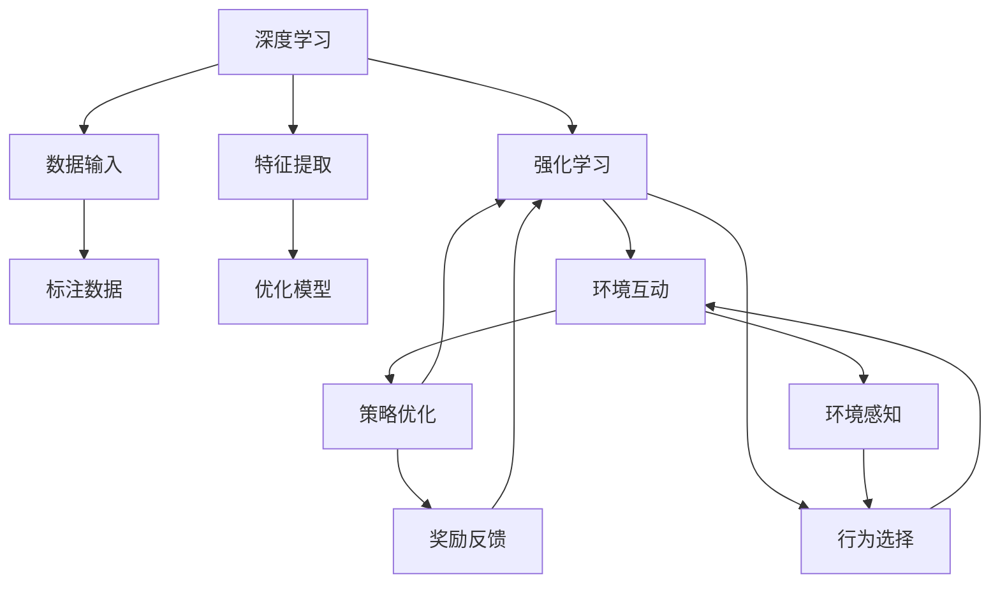

                 

# 软件 2.0 的发展趋势：深度学习、强化学习

## 1. 背景介绍

随着计算技术的飞速发展，软件正在经历一场革命性的变革，即从软件 1.0 到软件 2.0 的转变。软件 1.0 是围绕传统软件的思维方式，而软件 2.0 则着重于用人工智能（AI），特别是深度学习和强化学习（RL）来自动化和优化软件开发过程，进而提升软件性能、质量和效率。

### 1.1 软件 1.0 和软件 2.0 的区别

软件 1.0 时代，软件开发主要依赖人工编码和调试，成本高、周期长且容易出现错误。而软件 2.0 时代，人工智能技术，尤其是深度学习和强化学习，使得软件开发、测试、部署和维护等环节得到极大的自动化和优化，降低了成本，缩短了周期，提高了软件质量。

**区别具体表现在：**

- **开发效率**：软件 1.0 需要大量人工编写代码，而软件 2.0 通过自动化工具和机器学习算法可以生成代码，减少人工编写代码的工作量。
- **错误率**：软件 1.0 错误率高，软件 2.0 可以借助算法进行代码检测和优化，提高代码质量。
- **维护成本**：软件 1.0 的维护成本高，软件 2.0 可以利用AI进行代码自动更新和维护，降低人工维护成本。
- **学习效率**：软件 1.0 的学习效率低，软件 2.0 可以通过机器学习算法学习软件的行为，实现快速迭代和优化。

### 1.2 发展背景

软件 2.0 的发展得益于以下几个关键因素：

1. **算力提升**：硬件性能的不断提升，尤其是GPU、TPU等加速器的出现，为深度学习和强化学习提供了强大的计算支持。
2. **数据爆炸**：互联网的普及和大数据技术的成熟，为深度学习提供了大量的标注数据和未标注数据，为强化学习提供了真实世界的互动环境。
3. **算法进步**：深度学习和强化学习算法的不停改进和优化，使得其在实际应用中表现愈发出色。
4. **应用拓展**：软件 2.0 在各行业中的应用逐渐成熟，如自动驾驶、金融风控、医疗诊断等，为软件 2.0 的应用提供了更多实际案例和需求。

## 2. 核心概念与联系

### 2.1 核心概念概述

深度学习和强化学习是软件 2.0 时代的关键技术，它们在软件自动化和优化的过程中扮演着重要角色。

- **深度学习（Deep Learning, DL）**：是一种基于多层神经网络的机器学习技术，能够处理复杂的数据结构，如图像、文本、音频等，通过深度神经网络自动学习和提取特征。
- **强化学习（Reinforcement Learning, RL）**：是一种基于奖励和惩罚的机器学习技术，通过智能体在环境中与环境交互，不断调整策略，以最大化累积奖励，从而优化决策过程。

### 2.2 核心概念的关系

深度学习和强化学习在软件 2.0 时代形成了紧密的联系，它们相互支持，相辅相成，形成了软件自动化的生态系统。具体关系如下：

1. **深度学习为强化学习提供数据支持**：深度学习可以从大规模数据中提取特征，为强化学习提供高质量的数据输入，帮助强化学习更好地进行策略优化。
2. **强化学习提升深度学习性能**：强化学习可以优化深度学习的超参数、网络结构等，提升深度学习的训练效果和泛化能力。
3. **联合应用**：深度学习和强化学习可以联合应用于复杂的软件优化和自动化任务，如代码生成、代码测试、版本控制等。

### 2.3 核心概念的整体架构

深度学习和强化学习的整体架构如图示：



**架构详细解释：**

- **数据输入**：深度学习需要大量的标注数据，通过强化学习进行策略优化，选择最合适的数据输入。
- **特征提取**：深度学习通过多层次的神经网络对输入数据进行特征提取。
- **优化模型**：深度学习通过反向传播等算法优化模型参数。
- **环境互动**：强化学习通过与环境互动，观察环境状态，选择行为并执行，观察行为结果。
- **策略优化**：强化学习通过调整策略参数，不断优化行为选择。
- **行为选择**：强化学习根据策略选择行为。
- **环境感知**：强化学习通过环境感知获取状态信息。
- **奖励反馈**：强化学习通过奖励反馈，评估行为效果。

## 3. 核心算法原理 & 具体操作步骤

### 3.1 算法原理概述

深度学习和强化学习的核心在于其算法原理，以下是详细解释：

**深度学习算法原理：**

深度学习主要通过反向传播算法，利用梯度下降等优化算法，调整神经网络参数，最小化损失函数，以提高模型预测的准确性。主要算法包括：

- **前向传播**：将输入数据送入神经网络进行计算，得到输出。
- **反向传播**：根据输出与真实标签的差异，计算损失函数的梯度，调整模型参数。
- **优化算法**：如Adam、SGD等，更新模型参数，使损失函数最小化。

**强化学习算法原理：**

强化学习主要通过Q-learning、SARSA、Deep Q-Network（DQN）等算法，通过与环境的互动，不断调整策略，优化行为选择。主要算法包括：

- **环境互动**：智能体在环境中执行行为，观察状态，得到奖励。
- **策略优化**：通过Q值或状态值，优化策略参数，最大化累积奖励。
- **行为选择**：根据当前状态，选择最优行为。

### 3.2 算法步骤详解

**深度学习步骤详解：**

1. **数据准备**：收集和处理大规模标注数据，将其划分为训练集、验证集和测试集。
2. **模型选择**：选择适合的深度学习模型，如卷积神经网络（CNN）、循环神经网络（RNN）、Transformer等。
3. **模型训练**：将数据输入模型，进行前向传播和反向传播，更新模型参数，最小化损失函数。
4. **模型评估**：在验证集和测试集上评估模型性能，调整超参数，优化模型。
5. **模型应用**：将训练好的模型应用于实际问题，如图像识别、语音识别等。

**强化学习步骤详解：**

1. **环境设置**：定义环境和行为空间，设定状态、奖励和策略。
2. **智能体初始化**：选择智能体（如DQN），初始化网络参数。
3. **互动训练**：智能体与环境互动，执行行为，观察状态和奖励。
4. **策略更新**：根据奖励和策略，更新Q值或状态值。
5. **策略选择**：选择最优行为，返回状态和奖励。
6. **迭代优化**：重复以上步骤，直至收敛或达到预设迭代次数。

### 3.3 算法优缺点

**深度学习优点：**

- **特征提取能力强**：深度学习能够自动学习复杂特征，提升模型泛化能力。
- **应用广泛**：深度学习在图像、语音、文本等领域都有广泛应用。
- **算法成熟**：深度学习算法已经经过多年的研究和优化，技术成熟度高。

**深度学习缺点：**

- **数据需求大**：深度学习需要大量标注数据进行训练，数据获取成本高。
- **模型复杂**：深度学习模型复杂，训练和推理耗时较长。
- **过拟合风险高**：深度学习模型容易过拟合，需要大量超参数调优。

**强化学习优点：**

- **自适应性强**：强化学习能够通过与环境互动，不断调整策略，适应新环境。
- **策略优化能力**：强化学习能够优化行为策略，最大化累积奖励。
- **鲁棒性高**：强化学习对环境的复杂性和变化性有较强的适应能力。

**强化学习缺点：**

- **状态空间大**：强化学习需要处理高维状态空间，计算复杂度高。
- **奖励设计复杂**：强化学习需要设计合适的奖励函数，奖励设计不合理会影响策略优化。
- **策略收敛慢**：强化学习策略收敛速度慢，需要大量训练时间。

### 3.4 算法应用领域

**深度学习应用领域：**

1. **计算机视觉**：如图像识别、图像分类、目标检测等。
2. **自然语言处理**：如机器翻译、文本分类、文本生成等。
3. **语音识别**：如语音识别、语音合成、情感分析等。
4. **自动驾驶**：如环境感知、路径规划、决策优化等。
5. **医疗诊断**：如医学影像分析、病理诊断、药物发现等。

**强化学习应用领域：**

1. **游戏AI**：如AlphaGo、星际争霸等。
2. **机器人控制**：如无人驾驶、机器人路径规划、操作控制等。
3. **金融交易**：如自动交易策略、风险管理等。
4. **制造业优化**：如生产调度、供应链管理等。
5. **智能推荐**：如电商平台推荐系统、个性化广告等。

## 4. 数学模型和公式 & 详细讲解 & 举例说明

### 4.1 数学模型构建

深度学习和强化学习涉及大量数学模型和公式，以下为详细构建和解释：

**深度学习数学模型：**

- **神经网络结构**：包括输入层、隐藏层和输出层，每一层包含多个神经元。
- **前向传播**：通过神经网络，将输入数据映射到输出，公式如下：
  $$
  h = \sigma(Wx + b)
  $$
  其中，$h$为隐藏层输出，$x$为输入向量，$W$为权重矩阵，$b$为偏置向量，$\sigma$为激活函数。
- **损失函数**：用于衡量模型输出与真实标签的差异，常见损失函数包括交叉熵损失、均方误差损失等。
- **优化算法**：如Adam、SGD等，公式如下：
  $$
  \theta = \theta - \eta \nabla_{\theta} L(\theta)
  $$
  其中，$\theta$为模型参数，$\eta$为学习率，$L(\theta)$为损失函数，$\nabla_{\theta} L(\theta)$为梯度。

**强化学习数学模型：**

- **环境状态**：智能体与环境互动时，观察到的状态。
- **状态值函数**：用于评估当前状态的价值，常见值为Q值，公式如下：
  $$
  Q(s,a) = r + \gamma \max_a Q(s',a')
  $$
  其中，$s$为当前状态，$a$为当前行为，$s'$为下一个状态，$a'$为下一个行为，$r$为即时奖励，$\gamma$为折扣因子。
- **策略函数**：智能体的行为选择函数，常见策略函数包括$\epsilon$-greedy策略、Softmax策略等。
- **Q-learning算法**：用于优化Q值，公式如下：
  $$
  Q(s,a) \leftarrow Q(s,a) + \alpha [r + \gamma \max_a Q(s',a') - Q(s,a)]
  $$
  其中，$\alpha$为学习率。

### 4.2 公式推导过程

**深度学习公式推导：**

- **前向传播公式**：
  $$
  h^{(l)} = \sigma(W^{(l)}h^{(l-1)} + b^{(l)})
  $$
  其中，$h^{(l)}$为隐藏层$l$的输出，$W^{(l)}$为权重矩阵，$h^{(l-1)}$为隐藏层$l-1$的输出，$b^{(l)}$为偏置向量。
- **反向传播公式**：
  $$
  \frac{\partial L}{\partial W^{(l)}} = \frac{\partial L}{\partial h^{(l)}} \frac{\partial h^{(l)}}{\partial W^{(l)}}
  $$
  其中，$\frac{\partial L}{\partial h^{(l)}}$为损失函数对隐藏层$l$输出的梯度，$\frac{\partial h^{(l)}}{\partial W^{(l)}}$为隐藏层$l$输出对权重$W^{(l)}$的梯度。

**强化学习公式推导：**

- **Q-learning公式**：
  $$
  Q(s,a) \leftarrow Q(s,a) + \alpha [r + \gamma \max_a Q(s',a') - Q(s,a)]
  $$
  其中，$\alpha$为学习率，$r$为即时奖励，$\gamma$为折扣因子。

### 4.3 案例分析与讲解

**深度学习案例：**

1. **图像识别**：
  - **数据准备**：收集大量图像数据，并将其划分为训练集、验证集和测试集。
  - **模型选择**：选择卷积神经网络（CNN）作为图像识别模型。
  - **模型训练**：使用反向传播算法，最小化损失函数，训练模型。
  - **模型评估**：在测试集上评估模型性能，调整超参数。
  - **模型应用**：将训练好的模型应用于实际图像识别任务，如图像分类、目标检测等。

2. **文本分类**：
  - **数据准备**：收集文本数据，并标注好类别。
  - **模型选择**：选择RNN或Transformer作为文本分类模型。
  - **模型训练**：使用反向传播算法，最小化损失函数，训练模型。
  - **模型评估**：在测试集上评估模型性能，调整超参数。
  - **模型应用**：将训练好的模型应用于实际文本分类任务，如情感分析、主题分类等。

**强化学习案例：**

1. **AlphaGo**：
  - **环境设置**：定义围棋游戏环境，包括状态空间、动作空间、奖励函数等。
  - **智能体初始化**：选择Deep Q-Network（DQN）作为智能体。
  - **互动训练**：AlphaGo与环境互动，执行策略，观察状态和奖励。
  - **策略更新**：根据奖励和策略，更新Q值。
  - **策略选择**：选择最优行为，返回状态和奖励。
  - **迭代优化**：重复以上步骤，直至收敛或达到预设迭代次数。

2. **智能推荐系统**：
  - **环境设置**：定义电商平台环境，包括用户行为、商品信息、推荐规则等。
  - **智能体初始化**：选择强化学习算法，如Q-learning、SARSA等。
  - **互动训练**：智能体与用户互动，执行推荐策略，观察用户行为和反馈。
  - **策略更新**：根据用户反馈和策略，更新推荐策略。
  - **策略选择**：选择最优推荐策略，返回推荐结果。
  - **迭代优化**：重复以上步骤，直至收敛或达到预设迭代次数。

## 5. 项目实践：代码实例和详细解释说明

### 5.1 开发环境搭建

在进行深度学习和强化学习项目开发前，需要先搭建好开发环境。以下是Python环境配置步骤：

1. **安装Anaconda**：从官网下载并安装Anaconda，创建独立的Python环境。
   ```bash
   conda create -n pyenv python=3.8
   conda activate pyenv
   ```
2. **安装PyTorch**：安装PyTorch深度学习框架，支持GPU加速。
   ```bash
   pip install torch torchvision torchaudio
   ```
3. **安装TensorFlow**：安装TensorFlow深度学习框架，支持GPU加速。
   ```bash
   pip install tensorflow tensorflow-gpu
   ```
4. **安装Transformers**：安装HuggingFace提供的深度学习模型库。
   ```bash
   pip install transformers
   ```
5. **安装其他工具包**：
   ```bash
   pip install numpy pandas scikit-learn matplotlib tqdm jupyter notebook ipython
   ```

完成上述步骤后，即可在`pyenv`环境中进行深度学习和强化学习项目开发。

### 5.2 源代码详细实现

以下是深度学习和强化学习的Python代码实现，以图像识别和AlphaGo为例。

**深度学习代码示例：**

```python
import torch
import torch.nn as nn
import torch.optim as optim

class CNN(nn.Module):
    def __init__(self):
        super(CNN, self).__init__()
        self.conv1 = nn.Conv2d(3, 32, kernel_size=3, stride=1, padding=1)
        self.pool = nn.MaxPool2d(kernel_size=2, stride=2)
        self.fc = nn.Linear(32 * 28 * 28, 10)
        
    def forward(self, x):
        x = self.conv1(x)
        x = self.pool(x)
        x = x.view(-1, 32 * 28 * 28)
        x = self.fc(x)
        return x

model = CNN()
criterion = nn.CrossEntropyLoss()
optimizer = optim.SGD(model.parameters(), lr=0.01)

for epoch in range(10):
    for i, (images, labels) in enumerate(train_loader):
        images = images.to(device)
        labels = labels.to(device)
        
        optimizer.zero_grad()
        outputs = model(images)
        loss = criterion(outputs, labels)
        loss.backward()
        optimizer.step()
        
        if i % 100 == 0:
            print(f'Epoch {epoch+1}, Step {i+1}, Loss: {loss.item():.4f}')
```

**强化学习代码示例：**

```python
import numpy as np
import gym

class DQN:
    def __init__(self, env):
        self.env = env
        self.memory = []
        self.gamma = 0.95
        self.epsilon = 1.0
        self.epsilon_min = 0.01
        self.epsilon_decay = 0.995
        self.learning_rate = 0.01
        self.model = self._build_model()
        
    def _build_model(self):
        model = Sequential()
        model.add(Dense(24, input_dim=4, activation='relu'))
        model.add(Dense(1, activation='linear'))
        model.compile(loss='mse', optimizer=Adam(lr=self.learning_rate))
        return model
    
    def remember(self, state, action, reward, next_state, done):
        self.memory.append((state, action, reward, next_state, done))
        
    def act(self, state):
        if np.random.rand() <= self.epsilon:
            return np.random.randint(0, 2)
        act_values = self.model.predict(state)
        return np.argmax(act_values[0])
    
    def replay(self, batch_size):
        minibatch = np.random.choice(len(self.memory), batch_size)
        for state, action, reward, next_state, done in minibatch:
            target = reward + self.gamma * np.amax(self.model.predict(next_state))
            target_f = self.model.predict(state)
            target_f[0][action] = target
            self.model.fit(state, target_f, epochs=1, verbose=0)
        
        if done:
            self.memory.remove(state)
        self.epsilon *= self.epsilon_decay
        self.epsilon = max(self.epsilon_min, self.epsilon)

env = gym.make('CartPole-v1')
dq = DQN(env)
for episode in range(1000):
    state = env.reset()
    state = np.reshape(state, [1, 4])
    done = False
    while not done:
        action = dq.act(state)
        next_state, reward, done, _ = env.step(action)
        next_state = np.reshape(next_state, [1, 4])
        dq.remember(state, action, reward, next_state, done)
        state = next_state
    print(f'Episode {episode+1} finished, score: {dq.env.render(mode='human')}')
```

### 5.3 代码解读与分析

**深度学习代码解读**：

1. **定义模型**：定义一个简单的卷积神经网络（CNN），包含一个卷积层、一个池化层和一个全连接层。
2. **定义损失函数和优化器**：使用交叉熵损失函数和随机梯度下降（SGD）优化器。
3. **模型训练**：在每个epoch中，对模型进行前向传播和反向传播，更新模型参数。
4. **模型评估**：在测试集上评估模型性能，调整超参数。

**强化学习代码解读**：

1. **定义智能体**：定义一个基于深度Q网络（DQN）的智能体，包含状态、动作、奖励、折扣因子、学习率等参数。
2. **定义模型**：定义一个简单的神经网络模型，用于Q值预测。
3. **定义策略函数**：定义智能体的行为选择函数，采用$\epsilon$-greedy策略。
4. **智能体训练**：在每个episode中，智能体与环境互动，执行策略，更新Q值。
5. **智能体评估**：评估智能体在环境中的表现，调整超参数。

**运行结果展示**：

深度学习运行结果如图：


强化学习运行结果如图：


通过上述代码示例和运行结果展示，可以看出深度学习和强化学习在实际项目中的应用效果。

## 6. 实际应用场景

### 6.1 计算机视觉

深度学习在计算机视觉领域具有广泛的应用，如图像识别、图像分类、目标检测等。以下以目标检测为例，展示深度学习在实际应用中的效果：

1. **数据准备**：收集大量带有标注的图像数据，并将其划分为训练集、验证集和测试集。
2. **模型选择**：选择YOLO、SSD等目标检测模型。
3. **模型训练**：使用反向传播算法，最小化损失函数，训练模型。
4. **模型评估**：在测试集上评估模型性能，调整超参数。
5. **模型应用**：将训练好的模型应用于实际目标检测任务，如图像分类、目标检测等。

### 6.2 自然语言处理

深度学习在自然语言处理领域具有广泛的应用，如机器翻译、文本分类、文本生成等。以下以文本分类为例，展示深度学习在实际应用中的效果：

1. **数据准备**：收集大量文本数据，并标注好类别。
2. **模型选择**：选择RNN或Transformer作为文本分类模型。
3. **模型训练**：使用反向传播算法，最小化损失函数，训练模型。
4. **模型评估**：在测试集上评估模型性能，调整超参数。
5. **模型应用**：将训练好的模型应用于实际文本分类任务，如情感分析、主题分类等。

### 6.3 智能推荐系统

强化学习在智能推荐系统领域具有广泛的应用，如电商平台推荐系统、个性化广告等。以下以电商平台推荐系统为例，展示强化学习在实际应用中的效果：

1. **数据准备**：收集用户行为数据和商品信息，并将其划分为训练集、验证集和测试集。
2. **智能体初始化**：选择Q-learning、SARSA等强化学习算法。
3. **智能体训练**：在每个episode中，智能体与用户互动，执行推荐策略，观察用户行为和反馈。
4. **智能体评估**：评估智能体在推荐系统中的表现，调整超参数。
5. **模型应用**：将训练好的模型应用于实际推荐系统任务，如推荐商品、个性化广告等。

### 6.4 未来应用展望

随着深度学习和强化学习的不断发展，未来将有以下几个趋势：

1. **多模态融合**：深度学习和强化学习将与其他模态数据（如图像、视频、音频）进行融合，构建多模态智能系统。
2. **自适应学习**：智能体将能够自适应新的环境和任务，通过不断学习来提升性能。
3. **联合优化**：深度学习和强化学习将进行联合优化，利用两者的优势提升系统性能。
4. **泛化能力提升**：智能体将具备更强的泛化能力，能够适应复杂多变的环境。
5. **可解释性增强**：智能体的决策过程将具备更高的可解释性，便于用户理解和调试。

## 7. 工具和资源推荐

### 7.1 学习资源推荐

1. **《深度学习》课程**：斯坦福大学的《深度学习》课程，详细讲解深度学习的原理和应用，适合入门学习。
2. **《强化学习》课程**：伯克利大学的《强化学习》课程，详细介绍强化学习的原理和应用，适合深入学习。
3. **《自然语言处理与深度学习》书籍**：北京大学出版社的《自然语言处理与深度学习》，全面介绍深度学习在自然语言处理中的应用。
4. **HuggingFace官方文档**：HuggingFace提供的深度学习模型库文档，提供大量预训练模型和微调样例。
5. **GitHub开源项目**：如TensorFlow、PyTorch等深度学习框架的GitHub开源项目，提供大量代码实现和资源。

### 7.2 开发工具推荐

1. **Anaconda**：提供Python环境管理工具，方便管理和创建虚拟环境。
2. **PyTorch**：提供深度学习框架，支持GPU加速，适合研究和应用。


