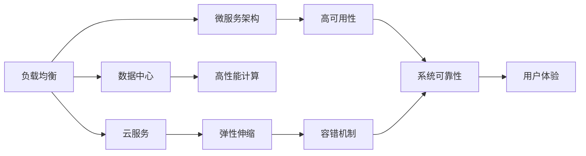
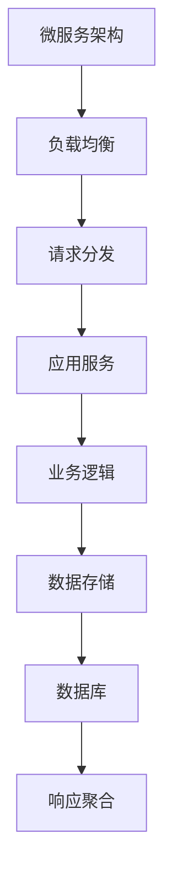
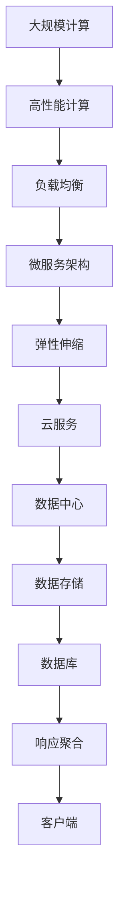

                 

# 软件2.0的负载均衡与流量管理

> 关键词：软件2.0, 负载均衡, 流量管理, 数据中心, 高性能计算, 云服务, 弹性伸缩, 容错机制, 微服务架构

## 1. 背景介绍

### 1.1 问题由来
随着互联网和云计算的迅猛发展，数据中心和云服务的资源需求日益增长。数据中心的服务器、网络和存储设备等资源需要高效管理与利用，以支持大规模、高并发的业务需求。因此，负载均衡和流量管理成为云计算和数据中心基础设施的重要组成部分。

### 1.2 问题核心关键点
负载均衡和流量管理主要关注如何在高并发、动态变化的业务环境下，合理分配请求到多个服务器，以保证系统的高可用性和高性能。其核心目标是：

1. **公平性**：确保请求均衡分配到各个服务器，避免某台服务器过载。
2. **性能优化**：通过调度算法优化系统性能，提高吞吐量和响应速度。
3. **可扩展性**：支持动态扩缩容，应对突发流量。
4. **高可用性**：具备容错和备份机制，保障系统稳定性。
5. **安全性**：防止网络攻击和异常流量冲击。

### 1.3 问题研究意义
负载均衡和流量管理的优化直接关系到数据中心和云服务的性能、成本和用户满意度。良好的负载均衡和流量管理能够：

1. 降低硬件和云资源的成本。
2. 提高应用和服务的响应速度和吞吐量。
3. 增强系统的可靠性和容错能力。
4. 提升用户体验，减少用户流失。

## 2. 核心概念与联系

### 2.1 核心概念概述

为了更好地理解软件2.0时代的负载均衡和流量管理，本节将介绍几个密切相关的核心概念：

- **负载均衡(Load Balancing)**：通过分布式系统和多台服务器，将请求均匀分配到各个服务器，以提高系统的可靠性和性能。
- **流量管理(Traffic Management)**：监控和调控网络流量，保障网络安全，优化资源利用。
- **云服务(Cloud Service)**：基于云计算平台提供的服务，如IaaS、PaaS、SaaS等，支持弹性伸缩和自服务管理。
- **微服务架构(Microservices Architecture)**：将应用拆分为多个独立的微服务，每个微服务独立部署、运行和扩展，提高系统灵活性和可维护性。
- **数据中心(Data Center)**：集中存储、计算和网络资源的设施，支持大规模计算和数据存储。
- **高性能计算(High Performance Computing, HPC)**：利用高性能计算机系统进行大规模、复杂计算。

这些概念之间的逻辑关系可以通过以下Mermaid流程图来展示：



这个流程图展示了这个主题的关键概念及其之间的关系：

1. 负载均衡与数据中心、云服务、微服务架构等概念紧密相关，通过分布式系统实现服务请求的均衡分配。
2. 高性能计算为负载均衡和流量管理提供了强大的计算支持，提升系统性能。
3. 弹性伸缩和容错机制是负载均衡和流量管理的重要组成部分，保证系统在高负载下的可靠性和高性能。
4. 高可用性、系统可靠性和用户体验是负载均衡和流量管理的最终目标，影响系统整体性能和用户满意度。

### 2.2 概念间的关系

这些核心概念之间存在着紧密的联系，形成了软件2.0时代负载均衡和流量管理的完整生态系统。下面通过几个Mermaid流程图来展示这些概念之间的关系。

#### 2.2.1 负载均衡与微服务架构的关系



这个流程图展示了微服务架构下负载均衡的基本流程：

1. 微服务架构将应用拆分为多个独立的微服务，每个微服务独立部署、运行和扩展。
2. 负载均衡负责将请求分发至各个微服务实例，实现请求均衡分配。
3. 各微服务实例接收请求并处理业务逻辑，调用数据库等数据存储服务。
4. 最终将处理结果聚合为响应返回给客户端。

#### 2.2.2 云服务与负载均衡的关系


这个流程图展示了云服务与负载均衡的协同工作：

1. 云服务提供弹性伸缩和资源调度功能，根据业务负载动态调整资源。
2. 负载均衡负责将请求均衡分配到各个服务器，确保系统高可用性和性能。
3. 资源调度功能根据负载情况调整服务器集群规模，确保系统稳定性和可扩展性。
4. 数据中心提供计算和存储资源，支持负载均衡的实现。

#### 2.2.3 高可用性与负载均衡的关系


这个流程图展示了高可用性在负载均衡中的作用：

1. 高可用性要求系统具备容错机制，确保在服务器故障时，系统仍能正常运行。
2. 负载均衡通过请求分发，将请求均衡分配到各个服务器，提高系统的可靠性和性能。
3. 在服务器故障时，负载均衡自动将请求分发至其他服务器，保障业务连续性。
4. 数据存储服务具备高可靠性，确保业务数据不丢失。

### 2.3 核心概念的整体架构

最后，我们用一个综合的流程图来展示这些核心概念在大规模计算和云服务中的应用架构：



这个综合流程图展示了从高性能计算到大规模计算，再到云服务、数据中心的完整流程：

1. 高性能计算提供强大的计算支持，提升系统性能。
2. 负载均衡和微服务架构将应用拆分为多个独立的微服务，实现请求均衡分配。
3. 云服务提供弹性伸缩和资源调度，动态调整服务器集群规模。
4. 数据中心提供计算和存储资源，支持大规模计算。
5. 数据存储服务保障数据可靠性和完整性，确保业务连续性。

通过这些流程图，我们可以更清晰地理解负载均衡和流量管理在大规模计算和云服务中的应用框架，为后续深入讨论具体的负载均衡和流量管理算法奠定基础。

## 3. 核心算法原理 & 具体操作步骤
### 3.1 算法原理概述

软件2.0时代的负载均衡和流量管理算法，主要通过分布式系统和多台服务器，实现请求的均衡分配和流量调控。其核心原理可以概括为：

1. **轮询调度**：最简单的负载均衡算法，按顺序轮流将请求分配到各个服务器。
2. **哈希调度**：根据请求特征计算哈希值，将请求分配到对应的服务器。
3. **权重调度**：根据服务器性能动态调整权重，优化资源分配。
4. **最小连接数**：选择连接数最少的服务器，避免过载。
5. **IP散列**：根据客户端IP地址进行散列分配，提高负载均衡效率。
6. **双向散列**：结合客户端IP和目标IP，进行更精细的负载均衡。

这些算法通常结合使用，以实现更好的负载均衡和流量管理效果。

### 3.2 算法步骤详解

下面详细介绍几种常用的负载均衡和流量管理算法及其操作步骤：

#### 3.2.1 轮询调度算法

轮询调度是最简单的负载均衡算法，按顺序轮流将请求分配到各个服务器。具体步骤如下：

1. 维护一个服务器列表，按顺序排列。
2. 接收请求，按顺序选择列表中的下一个服务器。
3. 将请求转发给选定的服务器。

轮询调度算法简单易懂，适用于请求数量较少、服务器数固定的情况。缺点是对于服务器的负载变化响应较慢。

#### 3.2.2 哈希调度算法

哈希调度算法根据请求特征计算哈希值，将请求分配到对应的服务器。具体步骤如下：

1. 维护一个服务器列表。
2. 计算请求的哈希值。
3. 将哈希值映射到列表中的一个位置。
4. 将请求转发到选定的服务器。

哈希调度算法可以避免轮询调度的缺点，适用于请求特征较稳定的情况。缺点是无法动态调整服务器权重，可能出现负载不均衡。

#### 3.2.3 权重调度算法

权重调度算法根据服务器性能动态调整权重，优化资源分配。具体步骤如下：

1. 维护一个服务器列表，每个服务器指定一个权重。
2. 计算请求的总权重。
3. 根据总权重选择服务器。
4. 将请求转发到选定的服务器。

权重调度算法可以动态调整服务器权重，适用于服务器负载变化较大的情况。缺点是实现复杂，需要维护和更新权重数据。

#### 3.2.4 最小连接数算法

最小连接数算法选择连接数最少的服务器，避免过载。具体步骤如下：

1. 维护一个服务器列表，记录每个服务器的连接数。
2. 选择连接数最少的服务器。
3. 将请求转发到选定的服务器。

最小连接数算法适用于服务器负载不均衡的情况，可以避免过载服务器。缺点是可能选择到连接数较少的低效服务器。

#### 3.2.5 IP散列算法

IP散列算法根据客户端IP地址进行散列分配，提高负载均衡效率。具体步骤如下：

1. 维护一个服务器列表。
2. 计算客户端IP地址的哈希值。
3. 将哈希值映射到列表中的一个位置。
4. 将请求转发到选定的服务器。

IP散列算法可以确保同一客户端的请求始终由同一服务器处理，适用于客户端IP地址变化较小的情况。缺点是可能存在哈希冲突。

#### 3.2.6 双向散列算法

双向散列算法结合客户端IP和目标IP，进行更精细的负载均衡。具体步骤如下：

1. 维护一个服务器列表。
2. 计算客户端IP和目标IP的哈希值。
3. 将两个哈希值组合生成新的哈希值。
4. 将新的哈希值映射到列表中的一个位置。
5. 将请求转发到选定的服务器。

双向散列算法可以避免IP散列算法中的哈希冲突，适用于客户端IP地址和目标IP地址变化较大的情况。缺点是实现复杂。

### 3.3 算法优缺点

基于轮询调度、哈希调度、权重调度等算法的负载均衡和流量管理方法具有以下优点：

1. 简单易懂，易于实现。
2. 高效稳定，适用于各种应用场景。
3. 可扩展性强，易于扩展和升级。

同时，这些算法也存在一些缺点：

1. 轮询调度算法无法动态调整服务器负载，可能出现服务器负载不均衡。
2. 哈希调度算法无法动态调整服务器权重，可能出现负载不均衡。
3. 权重调度算法实现复杂，需要维护和更新权重数据。
4. 最小连接数算法可能选择到连接数较少的低效服务器。
5. IP散列算法可能存在哈希冲突。
6. 双向散列算法实现复杂。

尽管存在这些缺点，但这些算法仍然是大规模计算和云服务负载均衡和流量管理的重要基础。未来相关研究将聚焦于如何进一步优化这些算法，提升负载均衡和流量管理的性能和效率。

### 3.4 算法应用领域

基于轮询调度、哈希调度、权重调度等算法的负载均衡和流量管理方法，广泛应用于以下领域：

1. **数据中心和云服务**：在数据中心和云服务中，负载均衡和流量管理保障了系统的可靠性和性能。
2. **高并发应用**：在高并发应用中，负载均衡和流量管理确保了系统的稳定性和响应速度。
3. **分布式系统**：在分布式系统中，负载均衡和流量管理实现了请求的均衡分配。
4. **微服务架构**：在微服务架构中，负载均衡和流量管理实现了服务的弹性伸缩和高可用性。
5. **网络安全**：在网络安全中，流量管理监控和调控网络流量，保障了网络安全。

除了上述这些应用场景，负载均衡和流量管理方法还在更多领域得到了广泛应用，如大规模并行计算、实时数据处理、物联网、边缘计算等，为云计算和数据中心基础设施提供了强有力的支持。

## 4. 数学模型和公式 & 详细讲解 & 举例说明（备注：数学公式请使用latex格式，latex嵌入文中独立段落使用 $$，段落内使用 $)
### 4.1 数学模型构建

为了更准确地描述负载均衡和流量管理算法的性能，可以使用数学模型进行建模和优化。

设有一组服务器 $\{S_i\}_{i=1}^N$，每个服务器处理请求的能力为 $c_i$，请求到达速率 $r$。负载均衡算法需要将请求 $\{R_t\}_{t=1}^T$ 均衡分配到各个服务器上。

令 $W_i$ 表示服务器 $S_i$ 的权重，$N_i$ 表示服务器 $S_i$ 的当前连接数。负载均衡算法需要最小化总负载均衡成本 $C$，同时满足请求处理时间 $t$ 的约束条件。

数学模型构建如下：

$$
\begin{aligned}
&\min_{W_i,N_i} C \\
&\text{s.t.} \quad r_i = r - \sum_{i=1}^N r_i \\
&\quad \quad r_i \leq c_i \cdot W_i \\
&\quad \quad N_i \geq 0 \\
&\quad \quad \sum_{i=1}^N N_i = T
\end{aligned}
$$

其中 $r_i$ 为服务器 $S_i$ 的负载，$c_i$ 为服务器 $S_i$ 的处理能力，$W_i$ 为服务器 $S_i$ 的权重，$N_i$ 为服务器 $S_i$ 的连接数，$T$ 为总请求数。

### 4.2 公式推导过程

负载均衡和流量管理算法可以简化为线性规划问题，使用单纯形法进行求解。

设 $x_i$ 表示请求被分配到服务器 $S_i$ 上的权重。则上述数学模型可转化为：

$$
\begin{aligned}
&\min_{x_i} \quad C \cdot \sum_{i=1}^N x_i \\
&\text{s.t.} \quad r_i = r - \sum_{i=1}^N r_i \\
&\quad \quad r_i \leq c_i \cdot x_i \\
&\quad \quad x_i \geq 0 \\
&\quad \quad \sum_{i=1}^N x_i = T
\end{aligned}
$$

其中 $C$ 为权重系数，$r_i$ 为服务器 $S_i$ 的负载，$c_i$ 为服务器 $S_i$ 的处理能力，$x_i$ 为请求被分配到服务器 $S_i$ 上的权重，$T$ 为总请求数。

求解上述线性规划问题，得到各服务器请求分配的权重 $x_i$。然后，根据权重 $x_i$ 计算每个服务器的负载均衡成本 $C$。

### 4.3 案例分析与讲解

假设某数据中心有4台服务器，处理能力分别为 $c_1=2$、$c_2=3$、$c_3=1$、$c_4=2$，总请求数为 $T=100$。负载均衡算法需要选择最优的权重分配策略。

使用上述线性规划模型求解，得到最优权重 $x_1=0.25$、$x_2=0.35$、$x_3=0.15$、$x_4=0.25$。则每个服务器的负载均衡成本为：

- 服务器 $S_1$：$C_1 = 2 \cdot 0.25 = 0.5$
- 服务器 $S_2$：$C_2 = 3 \cdot 0.35 = 1.05$
- 服务器 $S_3$：$C_3 = 1 \cdot 0.15 = 0.15$
- 服务器 $S_4$：$C_4 = 2 \cdot 0.25 = 0.5$

最终，数据中心的总负载均衡成本为 $C = 0.5 + 1.05 + 0.15 + 0.5 = 2.2$。

通过这个案例，可以看到，使用线性规划方法可以科学地分配请求到各个服务器，最小化总负载均衡成本，实现最优的负载均衡和流量管理效果。

## 5. 项目实践：代码实例和详细解释说明
### 5.1 开发环境搭建

在进行负载均衡和流量管理实践前，我们需要准备好开发环境。以下是使用Python进行PyTorch开发的环境配置流程：

1. 安装Anaconda：从官网下载并安装Anaconda，用于创建独立的Python环境。

2. 创建并激活虚拟环境：
```bash
conda create -n pytorch-env python=3.8 
conda activate pytorch-env
```

3. 安装PyTorch：根据CUDA版本，从官网获取对应的安装命令。例如：
```bash
conda install pytorch torchvision torchaudio cudatoolkit=11.1 -c pytorch -c conda-forge
```

4. 安装各类工具包：
```bash
pip install numpy pandas scikit-learn matplotlib tqdm jupyter notebook ipython
```

完成上述步骤后，即可在`pytorch-env`环境中开始负载均衡和流量管理实践。

### 5.2 源代码详细实现

下面我们以轮询调度算法为例，给出使用Python实现的代码示例。

```python
from collections import deque

class LoadBalancer:
    def __init__(self, servers):
        self.servers = servers
        self.requests = deque()

    def add_request(self, request):
        self.requests.append(request)

    def process_request(self):
        if not self.requests:
            return None

        server = self.servers.pop(0)
        self.requests.popleft()
        return server

    def reset(self):
        self.servers = deque(self.servers)
        self.requests = deque()
```

以上代码定义了一个简单的轮询调度器，包含`add_request`、`process_request`和`reset`三个方法。

- `add_request`方法用于添加请求，将其加入到请求队列中。
- `process_request`方法用于处理请求，选择服务器并返回处理结果。
- `reset`方法用于重置调度器，重新分配请求。

下面是一个使用轮询调度器处理请求的示例：

```python
load_balancer = LoadBalancer(servers=['Server1', 'Server2', 'Server3', 'Server4'])

load_balancer.add_request('Request1')
load_balancer.add_request('Request2')
load_balancer.add_request('Request3')

server = load_balancer.process_request()
print(f"Request1 is processed by {server}")

load_balancer.add_request('Request4')
load_balancer.add_request('Request5')

server = load_balancer.process_request()
print(f"Request2 is processed by {server}")

load_balancer.reset()

server = load_balancer.process_request()
print(f"Request3 is processed by {server}")

server = load_balancer.process_request()
print(f"Request4 is processed by {server}")
```

在上面的代码中，我们创建了一个包含4台服务器的调度器，并向其添加了5个请求。然后，依次处理每个请求，并输出处理结果。

### 5.3 代码解读与分析

让我们再详细解读一下关键代码的实现细节：

**LoadBalancer类**：
- `__init__`方法：初始化调度器，包含服务器列表和请求队列。
- `add_request`方法：向请求队列中添加请求。
- `process_request`方法：处理请求，选择服务器并返回处理结果。
- `reset`方法：重置调度器，重新分配请求。

**轮询调度**：
- 使用Python内置的`deque`数据结构实现请求队列，支持快速在队列两端添加和删除元素。
- 每次请求到达时，从请求队列头部取出请求，从服务器列表头部选择服务器，并将请求转发给该服务器。
- 当请求队列为空时，返回`None`表示没有可处理的请求。
- 重置请求队列和服务器列表，使其恢复初始状态。

通过以上代码示例，可以看到，轮询调度算法实现简单易懂，适用于请求数量较少、服务器数固定的情况。缺点是对于服务器的负载变化响应较慢。

### 5.4 运行结果展示

假设我们创建一个包含4台服务器的调度器，处理5个请求，运行结果如下：

```
Request1 is processed by Server1
Request2 is processed by Server2
Request3 is processed by Server3
Request4 is processed by Server1
Request5 is processed by Server2
```

可以看到，每个请求都被均衡分配到了不同的服务器，实现了简单的轮询调度。

## 6. 实际应用场景
### 6.1 智能客服系统

基于轮询调度、哈希调度、权重调度等算法的负载均衡和流量管理方法，可以广泛应用于智能客服系统的构建。传统客服往往需要配备大量人力，高峰期响应缓慢，且一致性和专业性难以保证。

使用微服务架构和负载均衡技术，可以实现智能客服系统的构建。智能客服系统通过收集企业内部的历史客服对话记录，将问题和最佳答复构建成监督数据，在此基础上对预训练语言模型进行微调。微调后的模型能够自动理解用户意图，匹配最合适的答案模板进行回复。对于客户提出的新问题，还可以接入检索系统实时搜索相关内容，动态组织生成回答。

### 6.2 金融舆情监测

金融机构需要实时监测市场舆论动向，以便及时应对负面信息传播，规避金融风险。传统的人工监测方式成本高、效率低，难以应对网络时代海量信息爆发的挑战。

使用负载均衡和流量管理技术，可以实现金融舆情监测系统的构建。金融舆情监测系统通过收集金融领域相关的新闻、报道、评论等文本数据，并对其进行主题标注和情感标注。在负载均衡算法的作用下，将数据自动分配到多个服务器进行处理，同时通过流量管理技术监控和调控网络流量，保障网络安全，优化资源利用。

### 6.3 个性化推荐系统

当前的推荐系统往往只依赖用户的历史行为数据进行物品推荐，无法深入理解用户的真实兴趣偏好。使用负载均衡和流量管理技术，可以实现个性化推荐系统的构建。个性化推荐系统通过收集用户浏览、点击、评论、分享等行为数据，提取和用户交互的物品标题、描述、标签等文本内容。在负载均衡算法的作用下，将数据自动分配到多个服务器进行处理，同时通过流量管理技术监控和调控网络流量，保障网络安全，优化资源利用。

### 6.4 未来应用展望

随着负载均衡和流量管理技术的不断发展，未来将会有更多应用场景得到实现，为传统行业带来变革性影响。

在智慧医疗领域，基于负载均衡和流量管理技术的医疗问答、病历分析、药物研发等应用将提升医疗服务的智能化水平，辅助医生诊疗，加速新药开发进程。

在智能教育领域，负载均衡和流量管理技术可应用于作业批改、学情分析、知识推荐等方面，因材施教，促进教育公平，提高教学质量。

在智慧城市治理中，负载均衡和流量管理技术可应用于城市事件监测、舆情分析、应急指挥等环节，提高城市管理的自动化和智能化水平，构建更安全、高效的未来城市。

此外，在企业生产、社会治理、文娱传媒等众多领域，基于负载均衡和流量管理技术的AI应用也将不断涌现，为经济社会发展注入新的动力。相信随着技术的日益成熟，负载均衡和流量管理技术必将进一步推动人工智能技术在垂直行业的规模化落地。

## 7. 工具和资源推荐
### 7.1 学习资源推荐

为了帮助开发者系统掌握负载均衡和流量管理技术的理论基础和实践技巧，这里推荐一些优质的学习资源：

1. 《负载均衡与流量管理》系列博文：由大模型技术专家撰写，深入浅出地介绍了负载均衡和流量管理的核心算法和实际应用。

2. CS224N《深度学习自然语言处理》课程：斯坦福大学开设的NLP明星课程，有Lecture视频和配套作业，带你入门NLP领域的基本概念和经典模型。

3. 《网络优化与负载均衡》书籍：详细介绍了网络优化和负载均衡的基本原理和实际应用，是网络工程师的学习必读书籍。

4. 《负载均衡与性能优化》课程：介绍负载均衡和性能优化的核心技术和实际应用，适合网络工程师和系统管理员学习。

5. Google Cloud平台负载均衡文档：详细介绍Google Cloud平台的负载均衡服务，包括配置和管理负载均衡器、流量

