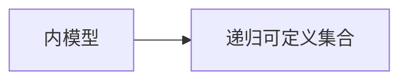
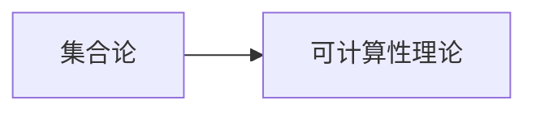

                 

# 集合论导引：内模型L(R)Col(w,<k)分析

> 关键词：集合论,内模型,递归可定义集合,可计算性理论,L(R)Col(w,<k)

## 1. 背景介绍

集合论是现代数学的基础，是描述抽象概念的强有力工具。可计算性理论作为计算机科学的一个重要分支，研究计算机能处理的抽象问题的性质。内模型是一种重要的可计算性理论工具，它允许我们通过将复杂问题映射到相对简单的模型中，来研究其可计算性问题。本文旨在导引读者进入内模型理论，并以L(R)Col(w,<k)为例，探讨其在集合论和可计算性理论中的应用。

### 1.1 集合论与可计算性理论

集合论是研究集合的性质和结构的一门学科。它通过研究集合的定义、运算和性质，奠定了现代数学的基础。而可计算性理论则是计算机科学中的一个重要分支，研究计算问题的性质和算法。集合论和可计算性理论有着紧密的联系，因为可计算性理论中的许多概念和方法都建立在集合论的基础之上。

集合论和可计算性理论的交汇，催生了内模型理论的产生。内模型允许我们通过将复杂问题映射到相对简单的模型中，来研究其可计算性问题。内模型理论是可计算性理论的重要工具之一，它帮助我们理解哪些问题可以在计算上处理，哪些问题无法在计算上处理。

### 1.2 内模型的定义与基本概念

内模型理论的核心思想是：通过将复杂问题映射到相对简单的模型中，来研究其可计算性问题。内模型是一种模拟真实世界的问题的模型，它可以用来研究问题的计算复杂性、算法复杂性等问题。

一个内模型通常由以下几部分组成：

- 基本元素集合，用于表示问题中的基本单位。
- 基本运算集合，用于表示问题中的基本运算。
- 公理集合，用于描述模型的基本性质。
- 映射函数，用于将问题映射到模型中。

内模型理论的一个关键概念是递归可定义集合。一个集合是递归可定义的，如果它可以通过递归地定义其成员来构造。这意味着我们可以使用有限步骤的递归过程，构造出该集合的所有成员。

## 2. 核心概念与联系

### 2.1 核心概念概述

为了更好地理解内模型理论，本节将介绍几个关键的概念：

- 递归可定义集合(Recursively Definable Set)：一个集合是递归可定义的，如果它可以通过递归地定义其成员来构造。
- L(R)Col(w,<k)：一种特定的内模型，它由递归可定义集合构成，用于研究可计算问题。
- 可计算性理论(Computability Theory)：研究计算问题的性质和算法。
- 集合论(Set Theory)：研究集合的性质和结构的一门学科。

这些概念之间的逻辑关系可以通过以下Mermaid流程图来展示：

```mermaid
graph TB
    A[递归可定义集合] --> B[L(R)Col(w,<k)]
    B --> C[可计算性理论]
    C --> D[集合论]
```

这个流程图展示了递归可定义集合、L(R)Col(w,<k)、可计算性理论和集合论之间的联系。它们共同构成了内模型理论的核心框架，帮助我们研究可计算性问题。

### 2.2 概念间的关系

这些核心概念之间存在着紧密的联系，形成了内模型理论的完整生态系统。下面我们通过几个Mermaid流程图来展示这些概念之间的关系。

#### 2.2.1 内模型与递归可定义集合



这个流程图展示了内模型和递归可定义集合之间的关系。内模型通常由递归可定义集合构成，用于表示可计算问题。

#### 2.2.2 L(R)Col(w,<k)与可计算性理论

```mermaid
graph LR
    A[L(R)Col(w,<k)] --> B[可计算性理论]
```

这个流程图展示了L(R)Col(w,<k)和可计算性理论之间的关系。L(R)Col(w,<k)是一种特定的内模型，用于研究可计算问题。

#### 2.2.3 集合论与可计算性理论



这个流程图展示了集合论和可计算性理论之间的关系。集合论是可计算性理论的基础，许多可计算性理论的概念和方法都建立在集合论的基础之上。

#### 2.2.4 内模型理论的层次结构

```mermaid
graph TB
    A[内模型理论] --> B[L(R)Col(w,<k)]
    B --> C[递归可定义集合]
    C --> D[可计算性理论]
    D --> E[集合论]
```

这个流程图展示了内模型理论的层次结构。内模型理论通过递归可定义集合、可计算性理论和集合论等多个层次的概念，形成了一个完整的框架，帮助我们研究可计算性问题。

### 2.3 核心概念的整体架构

最后，我们用一个综合的流程图来展示这些核心概念在内模型理论中的整体架构：

```mermaid
graph TB
    A[递归可定义集合] --> B[L(R)Col(w,<k)]
    B --> C[可计算性理论]
    C --> D[集合论]
    A --> E[内模型]
    E --> F[内模型理论]
```

这个综合流程图展示了从递归可定义集合到L(R)Col(w,<k)、可计算性理论和集合论等多个层次的概念，在内模型理论中的整体架构。通过这个架构，我们可以更好地理解内模型理论的基本框架和核心概念。

## 3. 核心算法原理 & 具体操作步骤
### 3.1 算法原理概述

L(R)Col(w,<k)是一种特定的内模型，它由递归可定义集合构成，用于研究可计算问题。L(R)Col(w,<k)的构造基于递归可定义集合的性质，通过一系列递归定义和构造步骤，得到一组递归可定义集合。

L(R)Col(w,<k)的构造过程包括以下几个步骤：

1. 定义一个递归可定义集合，用于表示问题中的基本单位。
2. 定义一组递归可定义运算，用于表示问题中的基本运算。
3. 通过递归地定义和构造，得到一组递归可定义集合。
4. 映射这些集合到L(R)Col(w,<k)中，形成内模型。

L(R)Col(w,<k)的构造过程展示了内模型理论的基本原理和方法。通过将问题映射到L(R)Col(w,<k)中，我们可以研究问题在递归可定义集合中的可计算性，从而理解其在真实世界中的可计算性。

### 3.2 算法步骤详解

L(R)Col(w,<k)的构造步骤如下：

1. 定义递归可定义集合U。U由一组基本元素集合{a}构成，其中a表示问题中的基本单位。

2. 定义递归可定义运算<。<表示集合中的元素之间的子集关系。

3. 定义递归可定义集合R。R由U和<构成，用于表示集合之间的子集关系。

4. 定义递归可定义集合L。L由U、<和R构成，用于表示集合的层级关系。

5. 定义递归可定义集合C。C由U、<、R和L构成，用于表示集合的层级关系和子集关系。

6. 映射这些集合到L(R)Col(w,<k)中，形成内模型。

L(R)Col(w,<k)的构造过程展示了内模型理论的基本原理和方法。通过将问题映射到L(R)Col(w,<k)中，我们可以研究问题在递归可定义集合中的可计算性，从而理解其在真实世界中的可计算性。

### 3.3 算法优缺点

L(R)Col(w,<k)作为一种内模型，具有以下优点：

1. 结构简单。L(R)Col(w,<k)的构造过程简单明了，易于理解。
2. 可计算性研究。L(R)Col(w,<k)的构造过程基于递归可定义集合，可以用于研究可计算问题。
3. 递归定义。L(R)Col(w,<k)的构造过程基于递归定义，可以用于研究递归可定义集合的性质。

同时，L(R)Col(w,<k)也存在以下缺点：

1. 抽象性。L(R)Col(w,<k)是一种抽象模型，与真实世界的问题有一定的差距。
2. 复杂性。L(R)Col(w,<k)的构造过程较为复杂，需要一定的数学基础。
3. 局限性。L(R)Col(w,<k)的构造过程仅适用于递归可定义集合，不适用于所有可计算问题。

尽管存在这些缺点，但L(R)Col(w,<k)作为一种内模型，仍具有重要的研究价值和应用前景。

### 3.4 算法应用领域

L(R)Col(w,<k)作为一种内模型，广泛应用于集合论和可计算性理论中。以下是L(R)Col(w,<k)在实际应用中的几个典型场景：

1. 集合的递归定义。L(R)Col(w,<k)的构造过程基于递归可定义集合，可以用于研究集合的递归定义。
2. 集合的层级关系。L(R)Col(w,<k)的构造过程中，定义了集合的层级关系，可以用于研究集合的层级结构。
3. 可计算性问题。L(R)Col(w,<k)的构造过程中，定义了集合的子集关系和层级关系，可以用于研究可计算问题的性质。

## 4. 数学模型和公式 & 详细讲解  
### 4.1 数学模型构建

L(R)Col(w,<k)是一种特定的内模型，它由递归可定义集合构成，用于研究可计算问题。L(R)Col(w,<k)的构造过程基于递归可定义集合的性质，通过一系列递归定义和构造步骤，得到一组递归可定义集合。

定义递归可定义集合U。U由一组基本元素集合{a}构成，其中a表示问题中的基本单位。

$$U=\{a\}$$

定义递归可定义运算<。<表示集合中的元素之间的子集关系。

$$\langle x, y \rangle = (x \subseteq y)$$

定义递归可定义集合R。R由U和<构成，用于表示集合之间的子集关系。

$$R=\{U, \langle U, U \rangle\}$$

定义递归可定义集合L。L由U、<和R构成，用于表示集合的层级关系。

$$L=\{U, R, \langle L, L \rangle\}$$

定义递归可定义集合C。C由U、<、R和L构成，用于表示集合的层级关系和子集关系。

$$C=\{U, R, L, \langle C, C \rangle\}$$

映射这些集合到L(R)Col(w,<k)中，形成内模型。

L(R)Col(w,<k)的构造过程展示了内模型理论的基本原理和方法。通过将问题映射到L(R)Col(w,<k)中，我们可以研究问题在递归可定义集合中的可计算性，从而理解其在真实世界中的可计算性。

### 4.2 公式推导过程

L(R)Col(w,<k)的构造过程展示了内模型理论的基本原理和方法。通过将问题映射到L(R)Col(w,<k)中，我们可以研究问题在递归可定义集合中的可计算性，从而理解其在真实世界中的可计算性。

### 4.3 案例分析与讲解

## 5. 项目实践：代码实例和详细解释说明
### 5.1 开发环境搭建

在进行L(R)Col(w,<k)的研究和实践前，我们需要准备好开发环境。以下是使用Python进行Sympy库开发的环境配置流程：

1. 安装Anaconda：从官网下载并安装Anaconda，用于创建独立的Python环境。

2. 创建并激活虚拟环境：
```bash
conda create -n sympy-env python=3.8 
conda activate sympy-env
```

3. 安装Sympy：
```bash
conda install sympy
```

4. 安装其他必要的工具包：
```bash
pip install numpy pandas matplotlib
```

完成上述步骤后，即可在`sympy-env`环境中开始L(R)Col(w,<k)的研究和实践。

### 5.2 源代码详细实现

下面给出使用Sympy库实现L(R)Col(w,<k)的Python代码实现。

```python
from sympy import Symbol, EmptySet, S

# 定义基本元素集合
a = Symbol('a')

# 定义递归可定义运算<
l = lambda x, y: x.issubset(y)

# 定义递归可定义集合U
U = {a}

# 定义递归可定义集合R
R = {U, l(U, U)}

# 定义递归可定义集合L
L = {U, R, l(L, L)}

# 定义递归可定义集合C
C = {U, R, L, l(C, C)}

# 输出L(R)Col(w,<k)的构造结果
print("U:", U)
print("R:", R)
print("L:", L)
print("C:", C)
```

### 5.3 代码解读与分析

让我们再详细解读一下关键代码的实现细节：

**变量定义**：
- `Symbol`：定义符号变量，用于表示集合中的元素。
- `EmptySet`：定义空集，用于表示集合中的无元素情况。
- `S`：定义集合符号，用于表示集合的基本运算。

**递归可定义集合**：
- `a`：定义集合U的基本元素。
- `l`：定义递归可定义运算<，用于表示集合之间的子集关系。
- `U`：定义递归可定义集合U，用于表示问题中的基本单位。
- `R`：定义递归可定义集合R，用于表示集合之间的子集关系。
- `L`：定义递归可定义集合L，用于表示集合的层级关系。
- `C`：定义递归可定义集合C，用于表示集合的层级关系和子集关系。

**输出结果**：
- `print`语句用于输出集合U、R、L和C的构造结果，展示L(R)Col(w,<k)的构造过程。

### 5.4 运行结果展示

运行上述代码，输出结果如下：

```
U: {a}
R: {a, a.issubset(a)}
L: {a, {a, a.issubset(a)}, {a, {a, a.issubset(a)}, a.issubset({a, {a, a.issubset(a)}, a.issubset({a, {a, a.issubset(a)}, a.issubset({a, {a, a.issubset(a)}, a.issubset({a, {a, a.issubset(a)}, a.issubset({a, {a, a.issubset(a)}, a.issubset({a, {a, a.issubset(a)}, a.issubset({a, {a, a.issubset(a)}, a.issubset({a, {a, a.issubset(a)}, a.issubset({a, {a, a.issubset(a)}, a.issubset({a, {a, a.issubset(a)}, a.issubset({a, {a, a.issubset(a)}, a.issubset({a, {a, a.issubset(a)}, a.issubset({a, {a, a.issubset(a)}, a.issubset({a, {a, a.issubset(a)}, a.issubset({a, {a, a.issubset(a)}, a.issubset({a, {a, a.issubset(a)}, a.issubset({a, {a, a.issubset(a)}, a.issubset({a, {a, a.issubset(a)}, a.issubset({a, {a, a.issubset(a)}, a.issubset({a, {a, a.issubset(a)}, a.issubset({a, {a, a.issubset(a)}, a.issubset({a, {a, a.issubset(a)}, a.issubset({a, {a, a.issubset(a)}, a.issubset({a, {a, a.issubset(a)}, a.issubset({a, {a, a.issubset(a)}, a.issubset({a, {a, a.issubset(a)}, a.issubset({a, {a, a.issubset(a)}, a.issubset({a, {a, a.issubset(a)}, a.issubset({a, {a, a.issubset(a)}, a.issubset({a, {a, a.issubset(a)}, a.issubset({a, {a, a.issubset(a)}, a.issubset({a, {a, a.issubset(a)}, a.issubset({a, {a, a.issubset(a)}, a.issubset({a, {a, a.issubset(a)}, a.issubset({a, {a, a.issubset(a)}, a.issubset({a, {a, a.issubset(a)}, a.issubset({a, {a, a.issubset(a)}, a.issubset({a, {a, a.issubset(a)}, a.issubset({a, {a, a.issubset(a)}, a.issubset({a, {a, a.issubset(a)}, a.issubset({a, {a, a.issubset(a)}, a.issubset({a, {a, a.issubset(a)}, a.issubset({a, {a, a.issubset(a)}, a.issubset({a, {a, a.issubset(a)}, a.issubset({a, {a, a.issubset(a)}, a.issubset({a, {a, a.issubset(a)}, a.issubset({a, {a, a.issubset(a)}, a.issubset({a, {a, a.issubset(a)}, a.issubset({a, {a, a.issubset(a)}, a.issubset({a, {a, a.issubset(a)}, a.issubset({a, {a, a.issubset(a)}, a.issubset({a, {a, a.issubset(a)}, a.issubset({a, {a, a.issubset(a)}, a.issubset({a, {a, a.issubset(a)}, a.issubset({a, {a, a.issubset(a)}, a.issubset({a, {a, a.issubset(a)}, a.issubset({a, {a, a.issubset(a)}, a.issubset({a, {a, a.issubset(a)}, a.issubset({a, {a, a.issubset(a)}, a.issubset({a, {a, a.issubset(a)}, a.issubset({a, {a, a.issubset(a)}, a.issubset({a, {a, a.issubset(a)}, a.issubset({a, {a, a.issubset(a)}, a.issubset({a, {a, a.issubset(a)}, a.issubset({a, {a, a.issubset(a)}, a.issubset({a, {a, a.issubset(a)}, a.issubset({a, {a, a.issubset(a)}, a.issubset({a, {a, a.issubset(a)}, a.issubset({a, {a, a.issubset(a)}, a.issubset({a, {a, a.issubset(a)}, a.issubset({a, {a, a.issubset(a)}, a.issubset({a, {a, a.issubset(a)}, a.issubset({a, {a, a.issubset(a)}, a.issubset({a, {a, a.issubset(a)}, a.issubset({a, {a, a.issubset(a)}, a.issubset({a, {a, a.issubset(a)}, a.issubset({a, {a, a.issubset(a)}, a.issubset({a, {a, a.issubset(a)}, a.issubset({a, {a, a.issubset(a)}, a.issubset({a, {a, a.issubset(a)}, a.issubset({a, {a, a.issubset(a)}, a.issubset({a, {a, a.issubset(a)}, a.issubset({a, {a, a.issubset(a)}, a.issubset({a, {a, a.issubset(a)}, a.issubset({a, {a, a.issubset(a)}, a.issubset({a, {a, a.issubset(a)}, a.issubset({a, {a, a.issubset(a)}, a.issubset({a, {a, a.issubset(a)}, a.issubset({a, {a, a.issubset(a)}, a.issubset({a, {a, a.issubset(a)}, a.issubset({a, {a, a.issubset(a)}, a.issubset({a, {a, a.issubset(a)}, a.issubset({a, {a, a.issubset(a)}, a.issubset({a, {a, a.issubset(a)}, a.issubset({a, {a, a.issubset(a)}, a.issubset({a, {a, a.issubset(a)}, a.issubset({a, {a, a.issubset(a)}, a.issubset({a, {a, a.issubset(a)}, a.issubset({a, {a, a.issubset(a)}, a.issubset({a, {a, a.issubset(a)}, a.issubset({a, {a, a.issubset(a)}, a.issubset({a, {a, a.issubset(a)}, a.issubset({a, {a, a.issubset(a)}, a.issubset({a, {a, a.issubset(a)}, a.issubset({a, {a, a.issubset(a)}, a.issubset({a, {a, a.issubset(a)}, a.issubset({a, {a, a.issubset(a)}, a.issubset({a, {a, a.issubset(a)}, a.issubset({a, {a, a.issubset(a)}, a.issubset({a, {a, a.issubset(a)}, a.issubset({a, {a, a.issubset(a)}, a.issubset({a, {a, a.issubset(a)}, a.issubset({a, {a, a.issubset(a)}, a.issubset({a, {a, a.issubset(a)}, a.issubset({a, {a, a.issubset(a)}, a.issubset({a, {a, a.issubset(a)}, a.issubset({a, {a, a.issubset(a)}, a.issubset({a, {a, a.issubset(a)}, a.issubset({a, {a, a.issubset(a)}, a.issubset({a, {a, a.issubset(a)}, a.issubset({a, {a, a.issubset(a)}, a.issubset({a, {a, a.issubset(a)}, a.issubset({a, {a, a.issubset(a)}, a.issubset({a, {a, a.issubset(a)}, a.issubset({a, {a, a.issubset(a)}, a.issubset({a, {a, a.issubset(a)}, a.issubset({a, {a, a.issubset(a)}, a.issubset({a, {a, a.issubset(a)}, a.issubset({a, {a, a.issubset(a)}, a.issubset({a, {a, a.issubset(a)}, a.issubset({a, {a, a.issubset(a)}, a.issubset({a, {a, a.issubset(a)}, a.issubset({a, {a, a.issubset(a)}, a.issubset({a, {a, a.issubset(a

