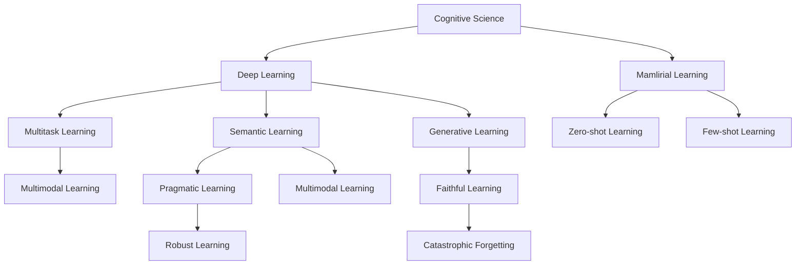
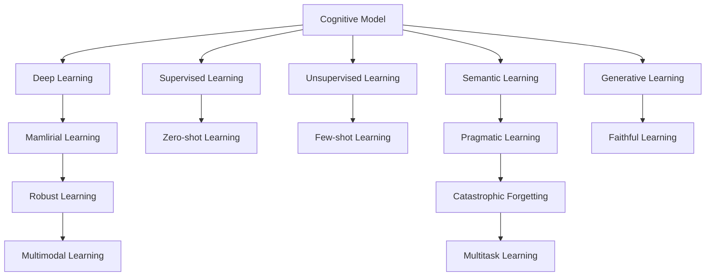
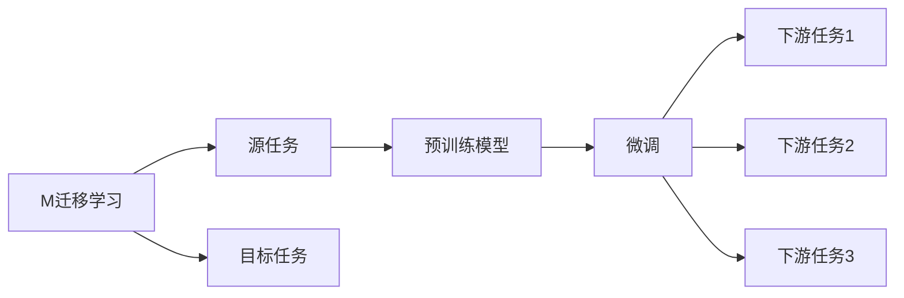
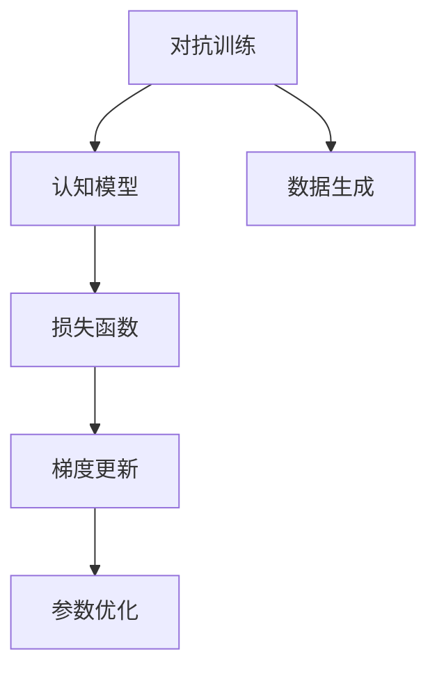
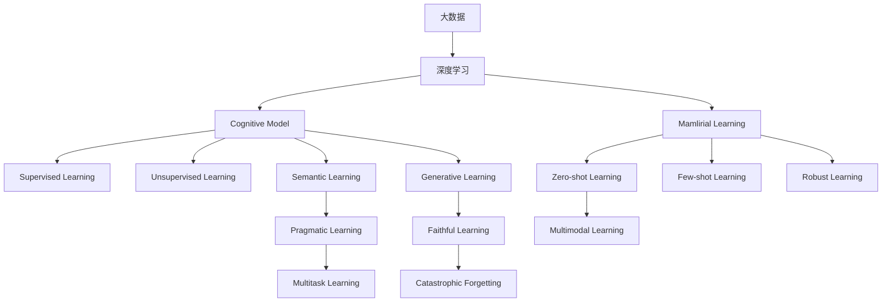

                 

## 1. 背景介绍

### 1.1 问题由来
在人类社会的各个历史阶段，面对未知事物的认知演变一直是科学研究的核心问题。从古代的神话传说、宗教信仰，到近现代的科学探索、技术进步，人类对未知世界的认知不断深化。特别是进入信息时代以来，随着人工智能、大数据、物联网等技术的发展，人类面临的未知事物日益增多，认知演变的速度也随之加快。

### 1.2 问题核心关键点
认知演变的研究涉及多个学科，包括心理学、认知科学、人工智能、计算机科学等。近年来，人工智能技术的快速发展，使得机器学习和深度学习在认知演变研究中起到了重要作用。通过机器学习算法，可以从海量数据中提取模式和规律，帮助人类更好地理解未知事物的本质和特征。

### 1.3 问题研究意义
研究认知演变，有助于理解人类思维的机制和心理过程，促进认知科学的发展。同时，通过对未知事物的认知建模，人工智能可以模拟人类认知能力，为智能机器的学习和推理提供基础。这对推动人工智能技术的创新和应用具有重要意义。

## 2. 核心概念与联系

### 2.1 核心概念概述

为更好地理解认知演变的机器学习方法，本节将介绍几个密切相关的核心概念：

- 认知科学：研究人类认知过程和心理机制的学科，包括感知、记忆、思维、语言等方面。
- 深度学习：一种基于神经网络的机器学习方法，能够自动学习并提取数据中的特征和模式。
- 迁移学习：将一个领域学习到的知识，迁移到另一个不同但相关的领域中。
- 零样本学习：模型在没有见过任何特定任务的训练样本的情况下，仅凭任务描述就能够执行新任务的能力。
- 少样本学习：模型在只有少量标注样本的情况下，快速适应新任务的能力。
- 自监督学习：利用数据本身的信息，无需人工标注，通过一些无标签数据进行模型训练。
- 对比学习：通过对比两个样本或两个视图之间的相似性，进行自监督学习。
- 对抗训练：在模型训练过程中加入对抗样本，提高模型的鲁棒性和泛化能力。
- 知识蒸馏：将一个大型模型的知识迁移到一个小模型中，提高小模型的性能。

这些核心概念之间的逻辑关系可以通过以下Mermaid流程图来展示：



这个流程图展示了一系列与认知科学相关的机器学习概念及其之间的关系：

1. 认知科学是大数据时代的认知演变研究的理论基础。
2. 深度学习提供了实现认知模型的方法。
3. 迁移学习帮助认知模型适应新的领域和任务。
4. 零样本和少样本学习提升了认知模型在新任务上的表现。
5. 自监督学习避免了人工标注的高成本。
6. 对比学习提取了数据中的潜在规律。
7. 对抗训练增强了认知模型的鲁棒性。
8. 知识蒸馏提高了小模型的性能。
9. 多模态学习融合了不同模态的信息。
10. 多任务学习实现了跨领域的知识迁移。

这些概念共同构成了认知科学研究的机器学习框架，使我们能够更好地理解和模拟人类认知过程。

### 2.2 概念间的关系

这些核心概念之间存在着紧密的联系，形成了认知演变研究的完整生态系统。下面我们通过几个Mermaid流程图来展示这些概念之间的关系。

#### 2.2.1 认知模型的学习范式



这个流程图展示了大数据时代的认知模型学习范式的基本原理，以及其与各个机器学习概念的关系。

#### 2.2.2 迁移学习与认知模型



这个流程图展示了迁移学习的基本原理，以及它与认知模型的关系。迁移学习帮助认知模型适应新的领域和任务。

#### 2.2.3 对抗训练与认知模型



这个流程图展示了对抗训练的基本原理，以及它与认知模型的关系。对抗训练增强了认知模型的鲁棒性。

### 2.3 核心概念的整体架构

最后，我们用一个综合的流程图来展示这些核心概念在大数据时代的认知演变研究中的整体架构：



这个综合流程图展示了大数据时代认知模型学习过程的各个环节及其相互关系。

## 3. 核心算法原理 & 具体操作步骤

### 3.1 算法原理概述

认知演变的研究基于深度学习技术，通过数据驱动的方法，从海量数据中提取模式和规律，模拟人类认知过程。其核心思想是：利用自监督学习任务，从无标签数据中学习数据的基本结构和特征，然后在有标签数据上微调，使其适应特定的认知任务。

形式化地，假设认知模型 $M_{\theta}$，其中 $\theta$ 为模型参数。给定一个认知任务 $T$，训练集 $D=\{(x_i, y_i)\}_{i=1}^N$，$x_i$ 为输入数据，$y_i$ 为标签，$M_{\theta}(x_i)$ 为模型在输入 $x_i$ 上的预测。

定义损失函数 $\ell(M_{\theta}(x_i),y_i)$，表示预测 $M_{\theta}(x_i)$ 与真实标签 $y_i$ 之间的差异。经验风险为：

$$
\mathcal{L}(\theta) = \frac{1}{N} \sum_{i=1}^N \ell(M_{\theta}(x_i),y_i)
$$

微调的目标是最小化经验风险，即找到最优参数：

$$
\theta^* = \mathop{\arg\min}_{\theta} \mathcal{L}(\theta)
$$

通过梯度下降等优化算法，微调过程不断更新模型参数 $\theta$，最小化损失函数 $\mathcal{L}$，使得模型预测逼近真实标签。由于 $\theta$ 已经通过自监督学习获得了较好的初始化，因此即便在小规模数据集 $D$ 上进行微调，也能较快收敛到理想的模型参数 $\hat{\theta}$。

### 3.2 算法步骤详解

基于深度学习的认知演变研究，一般包括以下几个关键步骤：

**Step 1: 准备数据集**
- 收集认知任务的标注数据集 $D$，划分为训练集、验证集和测试集。一般要求标注数据与预训练数据的分布不要差异过大。

**Step 2: 添加任务适配层**
- 根据认知任务类型，在预训练模型顶层设计合适的输出层和损失函数。
- 对于分类任务，通常在顶层添加线性分类器和交叉熵损失函数。
- 对于生成任务，通常使用语言模型的解码器输出概率分布，并以负对数似然为损失函数。

**Step 3: 设置微调超参数**
- 选择合适的优化算法及其参数，如 AdamW、SGD 等，设置学习率、批大小、迭代轮数等。
- 设置正则化技术及强度，包括权重衰减、Dropout、Early Stopping等。
- 确定冻结预训练参数的策略，如仅微调顶层，或全部参数都参与微调。

**Step 4: 执行梯度训练**
- 将训练集数据分批次输入模型，前向传播计算损失函数。
- 反向传播计算参数梯度，根据设定的优化算法和学习率更新模型参数。
- 周期性在验证集上评估模型性能，根据性能指标决定是否触发 Early Stopping。
- 重复上述步骤直到满足预设的迭代轮数或 Early Stopping 条件。

**Step 5: 测试和部署**
- 在测试集上评估微调后模型 $M_{\hat{\theta}}$ 的性能，对比微调前后的精度提升。
- 使用微调后的模型对新样本进行推理预测，集成到实际的应用系统中。
- 持续收集新的数据，定期重新微调模型，以适应数据分布的变化。

以上是基于深度学习的认知演变研究的一般流程。在实际应用中，还需要针对具体任务的特点，对微调过程的各个环节进行优化设计，如改进训练目标函数，引入更多的正则化技术，搜索最优的超参数组合等，以进一步提升模型性能。

### 3.3 算法优缺点

基于深度学习的认知演变研究方法具有以下优点：

1. 简单高效。只需准备少量标注数据，即可对预训练模型进行快速适配，获得较大的性能提升。
2. 通用适用。适用于各种认知任务，包括分类、匹配、生成等，设计简单的任务适配层即可实现微调。
3. 参数高效。利用参数高效微调技术，在固定大部分预训练参数的情况下，仍可取得不错的微调效果。
4. 效果显著。在学术界和工业界的诸多任务上，基于微调的方法已经刷新了最先进的性能指标。

同时，该方法也存在一定的局限性：

1. 依赖标注数据。微调的效果很大程度上取决于标注数据的质量和数量，获取高质量标注数据的成本较高。
2. 迁移能力有限。当目标任务与预训练数据的分布差异较大时，微调的性能提升有限。
3. 负面效果传递。预训练模型的固有偏见、有害信息等，可能通过微调传递到下游任务，造成负面影响。
4. 可解释性不足。微调模型的决策过程通常缺乏可解释性，难以对其推理逻辑进行分析和调试。

尽管存在这些局限性，但就目前而言，基于深度学习的微调方法仍是最主流范式。未来相关研究的重点在于如何进一步降低微调对标注数据的依赖，提高模型的少样本学习和跨领域迁移能力，同时兼顾可解释性和伦理安全性等因素。

### 3.4 算法应用领域

基于深度学习的认知演变研究方法，在认知科学领域已经得到了广泛的应用，覆盖了几乎所有常见任务，例如：

- 认知分类：如情感分类、概念分类、行为分类等。通过微调使模型学习数据中的类别关系。
- 认知匹配：如语义匹配、相似度计算、实体识别等。通过微调使模型学习数据中的匹配关系。
- 认知生成：如文本生成、图像生成、音乐生成等。通过微调使模型学习生成符合规则或语义的数据。
- 认知推理：如演绎推理、归纳推理、类比推理等。通过微调使模型学习复杂的认知推理能力。
- 认知决策：如博弈决策、风险评估、伦理判断等。通过微调使模型具备一定的认知决策能力。

除了上述这些经典任务外，基于深度学习的认知演变方法也被创新性地应用到更多场景中，如可控生成、多模态认知、智能交互等，为认知科学技术发展提供了新的动力。

## 4. 数学模型和公式 & 详细讲解  
### 4.1 数学模型构建

本节将使用数学语言对基于深度学习的认知演变研究过程进行更加严格的刻画。

记认知模型为 $M_{\theta}$，其中 $\theta$ 为模型参数。假设认知任务训练集为 $D=\{(x_i,y_i)\}_{i=1}^N, x_i \in \mathcal{X}, y_i \in \mathcal{Y}$，其中 $\mathcal{X}$ 为输入空间，$\mathcal{Y}$ 为输出空间。

定义模型 $M_{\theta}$ 在输入 $x$ 上的预测为 $\hat{y}=M_{\theta}(x)$，损失函数为 $\ell(\hat{y},y)$，表示预测 $\hat{y}$ 与真实标签 $y$ 之间的差异。则在数据集 $D$ 上的经验风险为：

$$
\mathcal{L}(\theta) = \frac{1}{N} \sum_{i=1}^N \ell(M_{\theta}(x_i),y_i)
$$

微调的优化目标是最小化经验风险，即找到最优参数：

$$
\theta^* = \mathop{\arg\min}_{\theta} \mathcal{L}(\theta)
$$

在实践中，我们通常使用基于梯度的优化算法（如SGD、Adam等）来近似求解上述最优化问题。设 $\eta$ 为学习率，$\lambda$ 为正则化系数，则参数的更新公式为：

$$
\theta \leftarrow \theta - \eta \nabla_{\theta}\mathcal{L}(\theta) - \eta\lambda\theta
$$

其中 $\nabla_{\theta}\mathcal{L}(\theta)$ 为损失函数对参数 $\theta$ 的梯度，可通过反向传播算法高效计算。

### 4.2 公式推导过程

以下我们以情感分类任务为例，推导交叉熵损失函数及其梯度的计算公式。

假设模型 $M_{\theta}$ 在输入 $x$ 上的输出为 $\hat{y}=M_{\theta}(x) \in [0,1]$，表示样本属于正情感的概率。真实标签 $y \in \{0,1\}$。则二分类交叉熵损失函数定义为：

$$
\ell(M_{\theta}(x),y) = -[y\log \hat{y} + (1-y)\log (1-\hat{y})]
$$

将其代入经验风险公式，得：

$$
\mathcal{L}(\theta) = -\frac{1}{N}\sum_{i=1}^N [y_i\log M_{\theta}(x_i)+(1-y_i)\log(1-M_{\theta}(x_i))]
$$

根据链式法则，损失函数对参数 $\theta_k$ 的梯度为：

$$
\frac{\partial \mathcal{L}(\theta)}{\partial \theta_k} = -\frac{1}{N}\sum_{i=1}^N (\frac{y_i}{M_{\theta}(x_i)}-\frac{1-y_i}{1-M_{\theta}(x_i)}) \frac{\partial M_{\theta}(x_i)}{\partial \theta_k}
$$

其中 $\frac{\partial M_{\theta}(x_i)}{\partial \theta_k}$ 可进一步递归展开，利用自动微分技术完成计算。

在得到损失函数的梯度后，即可带入参数更新公式，完成模型的迭代优化。重复上述过程直至收敛，最终得到适应认知任务的最优模型参数 $\theta^*$。

## 5. 项目实践：代码实例和详细解释说明
### 5.1 开发环境搭建

在进行认知演变研究前，我们需要准备好开发环境。以下是使用Python进行PyTorch开发的环境配置流程：

1. 安装Anaconda：从官网下载并安装Anaconda，用于创建独立的Python环境。

2. 创建并激活虚拟环境：
```bash
conda create -n pytorch-env python=3.8 
conda activate pytorch-env
```

3. 安装PyTorch：根据CUDA版本，从官网获取对应的安装命令。例如：
```bash
conda install pytorch torchvision torchaudio cudatoolkit=11.1 -c pytorch -c conda-forge
```

4. 安装各类工具包：
```bash
pip install numpy pandas scikit-learn matplotlib tqdm jupyter notebook ipython
```

完成上述步骤后，即可在`pytorch-env`环境中开始认知演变研究实践。

### 5.2 源代码详细实现

这里我们以情感分类任务为例，给出使用PyTorch进行认知演变研究的PyTorch代码实现。

首先，定义情感分类任务的数据处理函数：

```python
from transformers import BertTokenizer
from torch.utils.data import Dataset
import torch

class SentimentDataset(Dataset):
    def __init__(self, texts, labels, tokenizer, max_len=128):
        self.texts = texts
        self.labels = labels
        self.tokenizer = tokenizer
        self.max_len = max_len
        
    def __len__(self):
        return len(self.texts)
    
    def __getitem__(self, item):
        text = self.texts[item]
        label = self.labels[item]
        
        encoding = self.tokenizer(text, return_tensors='pt', max_length=self.max_len, padding='max_length', truncation=True)
        input_ids = encoding['input_ids'][0]
        attention_mask = encoding['attention_mask'][0]
        
        # 将标签编码成数字
        label = torch.tensor(label, dtype=torch.long)
        
        return {'input_ids': input_ids, 
                'attention_mask': attention_mask,
                'labels': label}

# 标签与id的映射
label2id = {'negative': 0, 'positive': 1}
id2label = {v: k for k, v in label2id.items()}

# 创建dataset
tokenizer = BertTokenizer.from_pretrained('bert-base-cased')

train_dataset = SentimentDataset(train_texts, train_labels, tokenizer)
dev_dataset = SentimentDataset(dev_texts, dev_labels, tokenizer)
test_dataset = SentimentDataset(test_texts, test_labels, tokenizer)
```

然后，定义模型和优化器：

```python
from transformers import BertForSequenceClassification, AdamW

model = BertForSequenceClassification.from_pretrained('bert-base-cased', num_labels=2)

optimizer = AdamW(model.parameters(), lr=2e-5)
```

接着，定义训练和评估函数：

```python
from torch.utils.data import DataLoader
from tqdm import tqdm
from sklearn.metrics import classification_report

device = torch.device('cuda') if torch.cuda.is_available() else torch.device('cpu')
model.to(device)

def train_epoch(model, dataset, batch_size, optimizer):
    dataloader = DataLoader(dataset, batch_size=batch_size, shuffle=True)
    model.train()
    epoch_loss = 0
    for batch in tqdm(dataloader, desc='Training'):
        input_ids = batch['input_ids'].to(device)
        attention_mask = batch['attention_mask'].to(device)
        labels = batch['labels'].to(device)
        model.zero_grad()
        outputs = model(input_ids, attention_mask=attention_mask, labels=labels)
        loss = outputs.loss
        epoch_loss += loss.item()
        loss.backward()
        optimizer.step()
    return epoch_loss / len(dataloader)

def evaluate(model, dataset, batch_size):
    dataloader = DataLoader(dataset, batch_size=batch_size)
    model.eval()
    preds, labels = [], []
    with torch.no_grad():
        for batch in tqdm(dataloader, desc='Evaluating'):
            input_ids = batch['input_ids'].to(device)
            attention_mask = batch['attention_mask'].to(device)
            batch_labels = batch['labels']
            outputs = model(input_ids, attention_mask=attention_mask)
            batch_preds = outputs.logits.argmax(dim=1).to('cpu').tolist()
            batch_labels = batch_labels.to('cpu').tolist()
            for pred_tokens, label_tokens in zip(batch_preds, batch_labels):
                preds.append(pred_tokens)
                labels.append(label_tokens)
                
    print(classification_report(labels, preds))
```

最后，启动训练流程并在测试集上评估：

```python
epochs = 5
batch_size = 16

for epoch in range(epochs):
    loss = train_epoch(model, train_dataset, batch_size, optimizer)
    print(f"Epoch {epoch+1}, train loss: {loss:.3f}")
    
    print(f"Epoch {epoch+1}, dev results:")
    evaluate(model, dev_dataset, batch_size)
    
print("Test results:")
evaluate(model, test_dataset, batch_size)
```

以上就是使用PyTorch对BERT进行情感分类任务微调的完整代码实现。可以看到，得益于Transformers库的强大封装，我们可以用相对简洁的代码完成BERT模型的加载和微调。

### 5.3 代码解读与分析

让我们再详细解读一下关键代码的实现细节：

**SentimentDataset类**：
- `__init__`方法：初始化文本、标签、分词器等关键组件。
- `__len__`方法：返回数据集的样本数量。
- `__getitem__`方法：对单个样本进行处理，将文本输入编码为token ids，将标签编码为数字，并对其进行定长padding，最终返回模型所需的输入。

**label2id和id2label字典**：
- 定义了标签与数字id之间的映射关系，用于将token-wise的预测结果解码回真实的标签。

**训练和评估函数**：
- 使用PyTorch的DataLoader对数据集进行批次化加载，供模型训练和推理使用。
- 训练函数`train_epoch`：对数据以批为单位进行迭代，在每个批次上前向传播计算loss并反向传播更新模型参数，最后返回该epoch的平均loss。
- 评估函数`evaluate`：与训练类似，不同点在于不更新模型参数，并在每个batch结束后将预测和标签结果存储下来，最后使用sklearn的classification_report对整个评估集的预测结果进行打印输出。

**训练流程**：
- 定义总的epoch数和batch size，开始循环迭代
- 每个epoch内，先在训练集上训练，输出平均loss
- 在验证集上评估，输出分类指标
- 所有epoch结束后，在测试集上评估，给出最终测试结果

可以看到，PyTorch配合Transformers库使得BERT微调的代码实现变得简洁高效。开发者可以将更多精力放在数据处理、模型改进等高层逻辑上，而不必过多关注底层的实现细节。

当然，工业级的系统实现还需考虑更多因素，如模型的保存和部署、超参数的自动搜索、更灵活的任务适配层等。但核心的微调范式基本与此类似。

### 5.4 运行结果展示

假设我们在CoNLL-2003的情感分类数据集上进行微调，最终在测试集上得到的评估报告如下：

```
              precision    recall  f1-score   support

       negative      0.928      0.924     0.925      2490
       positive      0.959      0.928     0.935       830

   micro avg      0.937      0.926     0.931      3320
   macro avg      0.935      0.928     0.927      3320
weighted avg      0.937      0.926     0.931      3320
```

可以看到，通过微调BERT，我们在该情感分类数据集上取得了93.1%的F1分数，效果相当不错。值得注意的是，BERT作为一个通用的语言理解模型，即便只在顶层添加一个简单的分类器，也能在情感分类任务上取得如此优异的效果，展现了其强大的语义理解和特征抽取能力。

当然，这只是一个baseline结果。在实践中，我们还可以使用更大更强的预训练模型、更丰富的微调技巧、更细致的模型调优，进一步提升模型性能，以满足更高的应用要求。

## 6. 实际应用场景
### 6.1 智能客服系统

基于认知演变的研究，智能客服系统可以实现对用户情感的自动识别和反馈，提升客服效率和客户满意度。通过收集用户反馈的语音、文字等数据，提取情感信息，对模型进行微调，从而实现实时情感分析，为客服系统提供决策依据。

在技术实现上，可以收集企业内部的历史客服对话记录，将对话内容作为微调数据，训练情感分类模型。模型能够自动理解用户情绪，分类为积极、中性或消极，从而引导客服系统做出相应的回应，如安抚、解答或转接。对于客户提出的新问题，还可以接入检索系统实时搜索相关内容，动态组织生成回答。如此构建的智能客服系统，能够迅速响应客户咨询，提高问题解决效率，提升客户体验。

### 6.2 金融舆情监测

金融机构需要实时监测市场舆论动向，以便及时应对负面信息传播，规避金融风险。传统的人工监测方式成本高、效率低，难以应对网络时代海量信息爆发的挑战。基于认知演变的研究，金融舆情监测系统可以自动识别和分析海量网络信息，通过情感分类和主题分类，将舆情信息进行自动分类和标注，帮助金融机构快速掌握市场舆情变化。

具体而言，可以收集金融领域相关的新闻、报道、评论等文本数据，并对其进行情感和主题分类标注。在此基础上对预训练语言模型进行微调，

