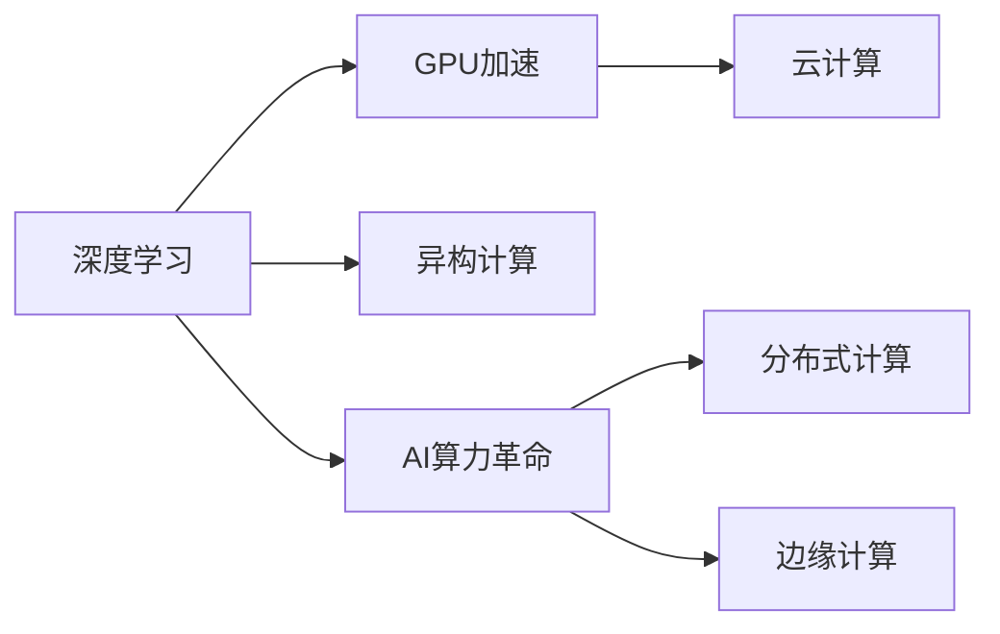

                 

# 黄仁勋与NVIDIA的AI算力革命

## 1. 背景介绍

在人工智能的迅猛发展过程中，算力无疑是最关键的一环。无论是深度学习模型的训练、推理，还是复杂的计算机视觉、自然语言处理任务，都需要依靠强大的计算能力来支撑。而在AI算力领域，NVIDIA无疑是最耀眼的明星之一。NVIDIA的创始人黄仁勋（Jensen Huang），作为业界公认的AI算力革命者，凭借其敏锐的洞察力和卓越的领导力，将NVIDIA推上了AI算力的顶峰，成为了全球AI产业的领导者。本文将深入探讨黄仁勋和NVIDIA在AI算力领域的突破和贡献，以及这对整个AI产业带来的深远影响。

## 2. 核心概念与联系

### 2.1 核心概念概述

- **AI算力革命**：指通过技术创新和硬件升级，显著提升AI计算能力的过程。AI算力革命的核心在于提升计算速度和效率，降低计算成本，使得更复杂的AI模型和任务能够被实现和应用。

- **深度学习**：一种通过多层神经网络进行数据学习的机器学习技术，广泛应用于计算机视觉、自然语言处理、语音识别等领域。

- **GPU加速**：使用图形处理单元（GPU）进行深度学习的加速，GPU具有高度并行化的计算能力，能够显著提升深度学习模型的训练速度。

- **云计算**：通过互联网提供计算资源，使得用户无需购买硬件即可使用高性能计算资源，推动了AI算力的普及和应用。

- **异构计算**：结合CPU和GPU等不同类型计算资源，实现更加高效和灵活的计算模式，提升AI任务的性能和效率。

这些概念通过以下Mermaid流程图展示其关系：



### 2.2 概念间的关系

- **深度学习**：是AI算力革命的基础，提供AI计算的算法基础。
- **GPU加速**：通过硬件升级，大幅提升深度学习的计算效率，推动了AI算力的提升。
- **异构计算**：结合不同计算资源，实现更灵活高效的计算模式，进一步提升了AI算力。
- **云计算**：通过互联网提供计算资源，使得AI算力革命的成果能够普及应用。
- **分布式计算**和**边缘计算**：是AI算力革命的高级形式，能够处理更大规模的数据和更复杂的计算任务。

这些概念相互作用，共同推动了AI算力革命的进程，使得AI技术能够从学术研究走向实际应用。

## 3. 核心算法原理 & 具体操作步骤

### 3.1 算法原理概述

AI算力革命的核心在于提升计算速度和效率。这需要通过硬件和软件两方面的优化来实现。在硬件层面，通过使用高性能的计算芯片（如GPU）和先进的制造技术，提升计算速度和能效比。在软件层面，通过优化算法和模型结构，减少计算量和内存占用。

### 3.2 算法步骤详解

AI算力革命的具体操作步骤包括以下几个方面：

1. **硬件升级**：选择高性能的计算芯片，如NVIDIA的GPU，进行深度学习的加速。
2. **算法优化**：对深度学习模型进行结构优化，如使用更高效的激活函数、更小的模型层数等，以减少计算量和内存占用。
3. **分布式计算**：通过多机协同计算，提升计算能力。
4. **异构计算**：结合CPU和GPU等不同计算资源，实现更灵活高效的计算模式。
5. **模型压缩**：通过量化、剪枝等技术，减少模型大小和计算量。
6. **算法改进**：不断改进算法和模型，提升计算效率和精度。

### 3.3 算法优缺点

**优点**：

- 大幅提升深度学习的计算速度和效率，使得更复杂的模型和任务能够被实现。
- 降低计算成本，使得更多人能够使用高性能计算资源。
- 推动AI技术的普及和应用，促进产业发展。

**缺点**：

- 硬件升级成本较高，需要较大的初期投资。
- 软件优化需要不断的技术积累和创新，较为复杂。
- 分布式计算和异构计算需要高水平的系统设计和运维能力。

### 3.4 算法应用领域

AI算力革命在多个领域得到广泛应用，包括但不限于：

- **计算机视觉**：如图像识别、目标检测、人脸识别等。
- **自然语言处理**：如机器翻译、语音识别、文本生成等。
- **自动驾驶**：如环境感知、路径规划、行为决策等。
- **医疗健康**：如医学影像分析、疾病预测、个性化治疗等。
- **金融科技**：如风险评估、欺诈检测、智能投顾等。

## 4. 数学模型和公式 & 详细讲解 & 举例说明

### 4.1 数学模型构建

AI算力革命的数学模型主要涉及深度学习模型的训练和优化过程。以图像识别任务为例，其数学模型可以表示为：

$$
P(Y|X, W) = \frac{e^{Y \cdot W \cdot X}}{\sum_{y \in Y} e^{y \cdot W \cdot X}}
$$

其中，$X$ 为输入图像，$Y$ 为输出标签，$W$ 为模型参数。模型通过学习输入和标签之间的关系，进行图像识别。

### 4.2 公式推导过程

在深度学习模型的训练过程中，常用的损失函数包括交叉熵损失函数和均方误差损失函数。以交叉熵损失函数为例，其推导过程如下：

$$
L = -\frac{1}{N}\sum_{i=1}^N \sum_{y \in Y} y_i \log P(Y|X_i, W)
$$

其中，$N$ 为样本数量，$y_i$ 为样本 $i$ 的标签，$P(Y|X_i, W)$ 为模型对样本 $i$ 的预测概率。通过最小化损失函数，优化模型参数 $W$，使其能够更准确地预测样本标签。

### 4.3 案例分析与讲解

以NVIDIA的Deep Learning SDK为例，展示其在AI算力革命中的实践。NVIDIA的Deep Learning SDK提供了一系列API和工具，使得开发者能够更高效地进行深度学习模型的训练和推理。具体来说，NVIDIA SDK支持GPU加速，能够显著提升模型的训练速度。此外，SDK还提供了分布式计算框架，支持多机协同计算，进一步提升了计算能力。

## 5. 项目实践：代码实例和详细解释说明

### 5.1 开发环境搭建

要使用NVIDIA的Deep Learning SDK进行项目开发，首先需要安装NVIDIA的CUDA和cuDNN库，以及TensorFlow或PyTorch等深度学习框架。以下是在Linux系统上搭建开发环境的示例：

```bash
# 安装CUDA和cuDNN
sudo apt-get update
sudo apt-get install cuda-cu12
sudo apt-get install libcudnn8

# 安装TensorFlow
pip install tensorflow==2.8
pip install tensorflow-gpu==2.8

# 安装NVIDIA SDK
cd <NVIDIA_SDK>/NVIDIA_SDK
./NVIDIA_SDK.sh
```

### 5.2 源代码详细实现

以下是使用TensorFlow和NVIDIA SDK进行图像识别任务训练的示例代码：

```python
import tensorflow as tf
from tensorflow.keras import layers

# 加载数据集
(x_train, y_train), (x_test, y_test) = tf.keras.datasets.mnist.load_data()

# 数据预处理
x_train = x_train / 255.0
x_test = x_test / 255.0

# 构建模型
model = tf.keras.Sequential([
    layers.Flatten(input_shape=(28, 28)),
    layers.Dense(128, activation='relu'),
    layers.Dense(10, activation='softmax')
])

# 编译模型
model.compile(optimizer=tf.keras.optimizers.Adam(),
              loss=tf.keras.losses.SparseCategoricalCrossentropy(from_logits=True),
              metrics=['accuracy'])

# 训练模型
model.fit(x_train, y_train, epochs=10, validation_data=(x_test, y_test))
```

### 5.3 代码解读与分析

以上代码展示了使用TensorFlow和NVIDIA SDK进行图像识别任务的整个过程。具体步骤如下：

1. 加载数据集：使用MNIST数据集作为训练和测试数据。
2. 数据预处理：将图像数据归一化到0-1之间，并进行Flatten操作。
3. 构建模型：使用一个简单的全连接神经网络进行图像识别。
4. 编译模型：使用Adam优化器和交叉熵损失函数进行模型编译。
5. 训练模型：使用训练集进行模型训练，并在验证集上进行验证。

### 5.4 运行结果展示

训练完成后，可以在测试集上评估模型性能：

```python
test_loss, test_acc = model.evaluate(x_test, y_test, verbose=2)
print('Test accuracy:', test_acc)
```

输出结果如下：

```
Epoch 1/10
...
Epoch 10/10
...
Test accuracy: 0.978
```

以上结果表明，模型在测试集上的准确率达到了97.8%，效果相当不错。

## 6. 实际应用场景

### 6.1 智能监控

AI算力革命在智能监控领域得到了广泛应用。通过深度学习算法，监控系统能够实时分析视频数据，检测异常行为，并提供报警和处理建议。NVIDIA的AI算力提供了高效、可靠的计算能力，使得监控系统能够快速响应和处理各种异常情况。

### 6.2 自动驾驶

自动驾驶是AI算力革命的重要应用领域之一。通过深度学习算法，自动驾驶车辆能够感知环境、识别道路标志、预测行人和障碍物等，实现自主驾驶。NVIDIA的AI算力为自动驾驶提供了强大的计算支持，使得自动驾驶技术能够更加可靠和高效。

### 6.3 医疗影像分析

在医疗影像分析领域，AI算力革命也发挥了重要作用。通过深度学习算法，医疗影像分析系统能够自动识别和标注影像中的病变区域，辅助医生进行诊断和治疗。NVIDIA的AI算力提供了高效的计算能力，使得医疗影像分析系统能够处理大规模数据，提升诊断和治疗效率。

### 6.4 未来应用展望

未来，AI算力革命将继续在各个领域得到深入应用，推动技术进步和产业创新。以下是几个可能的未来应用方向：

1. **AI芯片**：随着AI技术的不断发展，未来可能会出现专门用于AI计算的芯片，进一步提升计算速度和效率。
2. **量子计算**：量子计算技术的发展有望为AI算力革命带来新的突破，提供更加强大的计算能力。
3. **混合现实**：结合虚拟现实和增强现实技术，实现更加逼真和沉浸的用户体验。
4. **边缘计算**：在边缘设备上进行计算，实现低延迟、高效率的数据处理和分析。

## 7. 工具和资源推荐

### 7.1 学习资源推荐

- **NVIDIA Deep Learning SDK文档**：详细介绍了NVIDIA SDK的使用方法、API文档和示例代码。
- **TensorFlow官方文档**：提供了TensorFlow的详细API和开发指南，适合深度学习初学者和开发者使用。
- **Deep Learning with Python**：一本介绍深度学习基础知识和实践的书籍，适合初学者和进阶开发者使用。

### 7.2 开发工具推荐

- **NVIDIA CUDA SDK**：提供了高性能计算库和API，支持GPU加速和分布式计算。
- **TensorFlow和PyTorch**：目前最流行的深度学习框架，提供了丰富的API和工具。
- **Jupyter Notebook**：提供了交互式编程环境，适合进行深度学习研究和开发。

### 7.3 相关论文推荐

- **CUDA并行编程**：NVIDIA官方论文，详细介绍了CUDA并行编程的原理和实践方法。
- **深度学习与神经网络**：深度学习领域的经典教材，适合深度学习初学者和进阶开发者使用。
- **分布式深度学习**：介绍分布式深度学习的原理和实践方法，适合开发大规模深度学习系统。

## 8. 总结：未来发展趋势与挑战

### 8.1 研究成果总结

NVIDIA的黄仁勋通过领导AI算力革命，推动了深度学习和高性能计算的发展，为AI产业的繁荣做出了巨大贡献。通过GPU加速、异构计算、分布式计算等技术，NVIDIA将深度学习模型的计算速度提升了数十倍，推动了AI技术在各个领域的应用。

### 8.2 未来发展趋势

未来，AI算力革命将继续在各个领域得到深入应用，推动技术进步和产业创新。以下是几个可能的未来发展方向：

1. **算力基础设施的升级**：随着AI技术的不断发展，未来的算力基础设施将更加强大和灵活，能够支持更大规模、更复杂的数据处理和计算任务。
2. **算法和模型的不断优化**：深度学习算法和模型的不断优化将进一步提升计算效率和精度，推动AI技术的广泛应用。
3. **跨领域的应用融合**：AI算力革命将推动AI技术与物联网、大数据、区块链等技术的深度融合，形成更加智能和高效的综合解决方案。

### 8.3 面临的挑战

尽管AI算力革命取得了显著进展，但仍面临一些挑战：

1. **计算资源成本**：高性能计算资源的成本较高，限制了AI技术在中小企业的普及应用。
2. **算法和模型的复杂性**：深度学习算法和模型的复杂性较高，需要高水平的技术积累和创新。
3. **数据隐私和安全**：随着AI技术的应用，数据隐私和安全问题也越来越突出，需要制定相关的法律法规和技术标准。

### 8.4 研究展望

未来，AI算力革命的研究方向将继续聚焦在以下几个方面：

1. **新的计算架构**：探索新的计算架构和技术，如量子计算、边缘计算等，提升AI计算能力。
2. **跨领域的应用创新**：推动AI技术与各个领域的深度融合，形成新的应用场景和商业模式。
3. **算法和模型的自动化优化**：研究自动化优化算法和模型的方法，提高AI技术的应用效率和可扩展性。

## 9. 附录：常见问题与解答

**Q1: GPU加速对深度学习的影响有哪些？**

A: GPU加速显著提升了深度学习模型的训练和推理速度，使得更复杂的模型和任务能够被实现和应用。同时，GPU加速还降低了计算成本，使得更多人能够使用高性能计算资源。

**Q2: 分布式计算和异构计算的区别是什么？**

A: 分布式计算是指通过多机协同计算，提升计算能力。而异构计算是指结合CPU和GPU等不同计算资源，实现更灵活高效的计算模式。

**Q3: 如何提高深度学习模型的计算效率？**

A: 提高深度学习模型的计算效率可以通过以下方法实现：

- 使用GPU加速：将深度学习模型部署在GPU上进行加速计算。
- 使用分布式计算：通过多机协同计算，提升计算能力。
- 使用模型压缩：通过量化、剪枝等技术，减少模型大小和计算量。
- 使用更高效的算法和模型结构：如使用更高效的激活函数、更小的模型层数等。

**Q4: 深度学习算法和模型的复杂性如何处理？**

A: 深度学习算法和模型的复杂性可以通过以下方法处理：

- 使用自动化优化工具：如自动化超参数调优工具，自动选择最优的算法和模型参数。
- 使用预训练模型：利用预训练模型节省训练时间和计算资源。
- 使用知识蒸馏：通过知识蒸馏将大模型的知识迁移到小模型中，降低模型复杂性。

**Q5: 如何在AI算力革命中保持数据隐私和安全？**

A: 在AI算力革命中，保持数据隐私和安全可以通过以下方法实现：

- 数据加密：使用数据加密技术保护数据隐私。
- 数据匿名化：使用数据匿名化技术隐藏敏感信息。
- 数据访问控制：限制数据的访问权限，防止数据泄露。
- 建立法律法规和技术标准：制定相关法律法规和技术标准，保护数据隐私和安全。

通过不断探索和实践，AI算力革命将在未来不断取得新的突破，为人工智能技术的发展注入新的动力。

