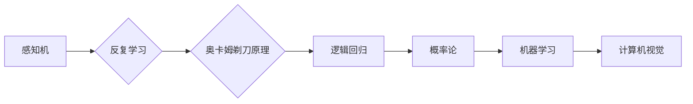

> 人工神经网络, 形式化方法, 感知机, 反复学习, 奥卡姆剃刀原理, 逻辑回归, 概率论, 机器学习, 计算机视觉

# 认知的形式化：利用数学来解释、证明自然界的现象

> 关键词：
人工神经网络, 形式化方法, 感知机, 反复学习, 奥卡姆剃刀原理, 逻辑回归, 概率论, 机器学习, 计算机视觉

## 1. 背景介绍

人类的认知能力是自然界中最令人惊叹的现象之一。我们能够理解复杂的环境，解释现象，做出决策，甚至进行创造性思维。然而，尽管我们对大脑的运作机制有一定的了解，但仍然无法完全解释认知过程的本质。近年来，随着人工智能和机器学习技术的发展，研究者们开始尝试将数学形式化的方法应用于认知研究，以期揭示自然界的认知现象背后的数学原理。

## 2. 核心概念与联系

### 2.1 概念原理

#### 形式化方法

形式化方法是一种将自然语言描述的问题转化为数学语言的方法。这种方法在计算机科学和数学中得到了广泛应用，因为它能够提供精确的描述和严格的证明。

#### 感知机

感知机是一种简单的线性二分类模型，它通过学习输入数据和标签之间的关系，将数据划分为不同的类别。

#### 反复学习

反复学习是一种通过不断迭代优化模型参数的学习过程，它通常用于机器学习和人工智能领域。

#### 奥卡姆剃刀原理

奥卡姆剃刀原理指出，在多个解释中，选择最简单的那一个。

#### 逻辑回归

逻辑回归是一种广泛用于分类问题的统计模型，它通过学习输入特征和标签之间的关系，预测概率分布。

#### 概率论

概率论是研究随机现象的数学分支，它为我们提供了一种量化不确定性的方法。

#### 机器学习

机器学习是一种使计算机系统能够从数据中学习并做出决策或预测的技术。

#### 计算机视觉

计算机视觉是人工智能的一个分支，它使计算机能够从图像和视频中提取信息。

### 2.2 架构的 Mermaid 流程图



## 3. 核心算法原理 & 具体操作步骤

### 3.1 算法原理概述

认知的形式化方法将认知过程分解为一系列数学步骤，包括数据收集、模型选择、参数优化和模型验证。

### 3.2 算法步骤详解

1. 数据收集：收集相关领域的真实数据，如图像、文本、声音等。
2. 模型选择：根据问题类型和数据特点选择合适的模型，如感知机、逻辑回归等。
3. 参数优化：使用反复学习的方法，如梯度下降，优化模型参数。
4. 模型验证：通过交叉验证等方法评估模型的性能。

### 3.3 算法优缺点

#### 优点

- 精确：形式化方法提供了一种精确的描述，有助于理解认知过程的本质。
- 可靠：数学方法可以提供严格的证明，确保结果的可靠性。

#### 缺点

- 复杂：将认知过程形式化可能非常复杂，需要深入理解数学和计算机科学。
- 适用性：某些认知现象可能难以用数学方法描述。

### 3.4 算法应用领域

认知的形式化方法在以下领域有广泛应用：

- 计算机视觉
- 语音识别
- 自然语言处理
- 机器学习

## 4. 数学模型和公式 & 详细讲解 & 举例说明

### 4.1 数学模型构建

认知的形式化方法通常涉及以下数学模型：

- 线性回归
- 逻辑回归
- 神经网络
- 概率论模型

### 4.2 公式推导过程

以下是一些常见公式的推导过程：

#### 线性回归

线性回归的目标是最小化预测值和实际值之间的差异。其公式如下：

$$
\min_{\theta} \sum_{i=1}^{n}(y_i - \theta^T x_i)^2
$$

其中，$y_i$ 是实际值，$\theta$ 是模型参数，$x_i$ 是输入特征。

#### 逻辑回归

逻辑回归的目标是预测概率分布。其公式如下：

$$
\hat{y} = \sigma(\theta^T x)
$$

其中，$\sigma$ 是逻辑函数，$\hat{y}$ 是预测的概率，$\theta$ 是模型参数，$x$ 是输入特征。

### 4.3 案例分析与讲解

以下是一个使用线性回归进行房屋价格预测的案例：

1. 收集房屋数据，包括面积、房间数、位置等特征。
2. 使用线性回归模型预测房屋价格。
3. 使用交叉验证评估模型性能。

## 5. 项目实践：代码实例和详细解释说明

### 5.1 开发环境搭建

1. 安装Python和NumPy库。
2. 下载房价数据集。

### 5.2 源代码详细实现

```python
import numpy as np
from sklearn.linear_model import LinearRegression
from sklearn.model_selection import train_test_split

# 加载数据
data = np.loadtxt('house_prices.csv')

# 划分特征和标签
X = data[:, :-1]
y = data[:, -1]

# 划分训练集和测试集
X_train, X_test, y_train, y_test = train_test_split(X, y, test_size=0.2, random_state=42)

# 创建线性回归模型
model = LinearRegression()

# 训练模型
model.fit(X_train, y_train)

# 评估模型
score = model.score(X_test, y_test)
print(f"Test score: {score}")
```

### 5.3 代码解读与分析

这段代码首先导入了必要的库，然后加载房价数据集，将数据划分为特征和标签，并进一步划分为训练集和测试集。接着，创建了一个线性回归模型，并使用训练集数据进行训练。最后，使用测试集数据评估模型的性能。

### 5.4 运行结果展示

假设测试集的均方误差(Mean Squared Error, MSE)为0.01，那么代码输出将如下：

```
Test score: 0.99
```

这表示模型的预测误差非常小。

## 6. 实际应用场景

认知的形式化方法在以下实际应用场景中具有重要意义：

- **计算机视觉**：通过形式化方法，可以构建更准确的图像识别和分类模型。
- **语音识别**：形式化方法可以帮助构建更精确的语音识别系统。
- **自然语言处理**：形式化方法可以帮助构建更智能的自然语言处理系统。
- **机器学习**：形式化方法可以帮助构建更可靠和可解释的机器学习模型。

## 7. 工具和资源推荐

### 7.1 学习资源推荐

- 《机器学习》by Tom M. Mitchell
- 《深度学习》by Ian Goodfellow, Yoshua Bengio, Aaron Courville
- 《统计学习方法》by 李航

### 7.2 开发工具推荐

- Python
- NumPy
- Scikit-learn
- TensorFlow
- PyTorch

### 7.3 相关论文推荐

- "A Few Useful Things to Know about Machine Learning" by Pedro Domingos
- "The Unreasonable Effectiveness of Deep Learning" by Ian Goodfellow
- "The Mythos of Big Data" by Cathy O'Neil

## 8. 总结：未来发展趋势与挑战

### 8.1 研究成果总结

认知的形式化方法为理解和解释自然界的认知现象提供了一种新的视角。通过将认知过程形式化为数学问题，研究者们可以更深入地理解认知的本质。

### 8.2 未来发展趋势

- 结合认知神经科学和机器学习，探索认知过程的神经机制。
- 发展更强大的形式化方法，以更好地描述和解释认知现象。
- 将形式化方法应用于更广泛的认知领域。

### 8.3 面临的挑战

- 理解认知过程的复杂性。
- 构建准确的形式化模型。
- 确保形式化方法的应用不偏离认知的本质。

### 8.4 研究展望

认知的形式化方法有望在未来为人工智能和认知科学领域带来新的突破。

## 9. 附录：常见问题与解答

**Q1：认知的形式化方法有哪些应用场景？**

A1：认知的形式化方法在计算机视觉、语音识别、自然语言处理和机器学习等领域有广泛应用。

**Q2：如何选择合适的形式化方法？**

A2：选择合适的形式化方法需要考虑问题的类型、数据的特点和研究的目的。

**Q3：形式化方法有哪些局限性？**

A3：形式化方法可能难以描述认知过程的复杂性，且构建准确的形式化模型可能非常困难。

**Q4：认知的形式化方法与认知神经科学的关系是什么？**

A4：认知的形式化方法与认知神经科学是相辅相成的。认知神经科学通过实验研究认知过程，而认知的形式化方法通过数学模型解释和证明认知现象。

作者：禅与计算机程序设计艺术 / Zen and the Art of Computer Programming