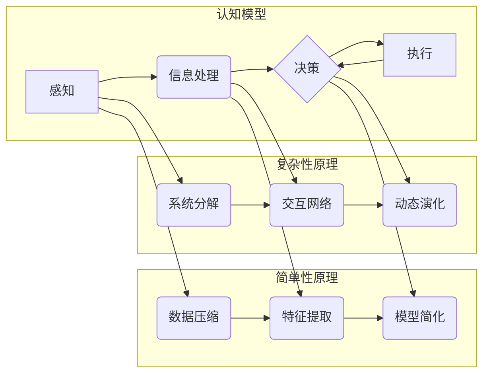

# 认知过程中的简单与深刻

> 关键词：认知模型，机器学习，深度学习，人类智能，简单性原理，复杂性原理，模型压缩，可解释性

## 1. 背景介绍

认知科学和人工智能领域一直致力于模拟和提升人类的认知过程。从简单的感知识别到复杂的决策推理，认知模型的目标是理解人类智能的本质，并在此基础上构建更加智能的机器系统。在这个过程中，简单与深刻是两个看似矛盾但又相辅相成的概念。本文将探讨认知过程中的简单与深刻，分析简单性原理与复杂性原理在机器学习中的应用，并展望未来发展趋势与挑战。

### 1.1 认知科学的兴起

认知科学是20世纪中叶兴起的一门交叉学科，它旨在通过研究人类大脑和认知过程来理解人类智能。随着计算机科学、心理学、神经科学等领域的交叉融合，认知科学逐渐成为一门重要的学科，为人工智能的发展提供了理论基础。

### 1.2 机器学习与深度学习

机器学习是认知科学的一个重要分支，它通过算法从数据中学习规律和模式，使计算机能够执行特定任务。深度学习是机器学习的一个子领域，它使用多层神经网络来模拟人脑处理信息的方式，取得了显著的成就。

### 1.3 简单性与深刻性

简单性与深刻性是认知过程中两个重要的概念。简单性原理强调通过简单模型来解释复杂现象，而深刻性原理则强调深入理解复杂系统的内部结构和运行机制。

## 2. 核心概念与联系

### 2.1 认知模型原理与架构的Mermaid流程图



### 2.2 核心概念联系

- 感知与数据压缩：通过数据压缩技术，可以简化感知信息，减少后续处理的数据量。
- 信息处理与特征提取：特征提取是信息处理的关键步骤，它从感知信息中提取有用的特征，为决策提供依据。
- 决策与模型简化：通过模型简化技术，可以降低决策模型的复杂度，提高计算效率。
- 执行与系统分解：系统分解是将复杂系统分解为多个子系统，便于理解和控制。
- 交互网络与动态演化：交互网络是系统中各个子系统集成的方式，动态演化是系统随时间变化的过程。

## 3. 核心算法原理 & 具体操作步骤

### 3.1 算法原理概述

简单性原理和复杂性原理在机器学习中有着广泛的应用。简单性原理体现在模型压缩和特征提取技术中，而复杂性原理则体现在系统分解和动态演化模型中。

### 3.2 算法步骤详解

#### 3.2.1 模型压缩

模型压缩通过降低模型参数数量、减少模型复杂度来实现。常用的模型压缩技术包括：

- 权重剪枝：去除模型中不重要的权重。
- 模型蒸馏：将知识从大模型迁移到小模型。
- 知识蒸馏：利用对抗训练技术，提取大模型的特征表示。

#### 3.2.2 特征提取

特征提取是信息处理的关键步骤，常用的特征提取技术包括：

- 统计特征：如词频、TF-IDF等。
- 深度特征：如卷积神经网络、循环神经网络等。

#### 3.2.3 系统分解

系统分解是将复杂系统分解为多个子系统，常用的系统分解技术包括：

- 状态空间分解：将系统状态空间分解为多个子空间。
- 控制分解：将系统控制分解为多个子控制。

#### 3.2.4 动态演化

动态演化模型是描述系统随时间变化的过程，常用的动态演化模型包括：

- 离散时间马尔可夫链。
- 连续时间随机过程。

### 3.3 算法优缺点

#### 3.3.1 模型压缩

优点：降低模型复杂度，提高计算效率，减少存储空间。

缺点：可能降低模型性能，增加训练难度。

#### 3.3.2 特征提取

优点：提高模型性能，减少数据量。

缺点：特征提取过程可能引入噪声，增加计算成本。

#### 3.3.3 系统分解

优点：提高系统理解性和可维护性。

缺点：系统分解可能引入新的复杂性问题。

#### 3.3.4 动态演化

优点：描述系统随时间变化的过程，提高系统预测能力。

缺点：动态演化模型可能难以解析。

### 3.4 算法应用领域

简单性原理和复杂性原理在多个领域有着广泛的应用，包括：

- 自然语言处理：文本分类、情感分析、机器翻译等。
- 计算机视觉：图像识别、目标检测、视频分析等。
- 推荐系统：协同过滤、内容推荐等。

## 4. 数学模型和公式 & 详细讲解 & 举例说明

### 4.1 数学模型构建

认知过程中的数学模型通常包括以下内容：

- 数据模型：描述数据分布和特征。
- 模型参数：模型中可调整的参数。
- 损失函数：衡量模型性能的指标。

### 4.2 公式推导过程

以下以线性回归为例，说明数学模型的构建和公式推导过程。

#### 4.2.1 数据模型

假设我们有一组数据 $(x_i, y_i)$，其中 $x_i$ 是输入特征，$y_i$ 是对应的标签。线性回归模型假设标签 $y_i$ 与输入特征 $x_i$ 之间存在线性关系：

$$
y_i = \beta_0 + \beta_1 x_i + \epsilon_i
$$

其中 $\beta_0$ 和 $\beta_1$ 是模型参数，$\epsilon_i$ 是误差项。

#### 4.2.2 模型参数

线性回归模型的参数为 $\theta = (\beta_0, \beta_1)$。

#### 4.2.3 损失函数

线性回归的损失函数为均方误差：

$$
L(\theta) = \frac{1}{2} \sum_{i=1}^n (y_i - \hat{y}_i)^2
$$

其中 $\hat{y}_i$ 是模型预测的标签。

#### 4.2.4 公式推导

最小化损失函数，即求解以下优化问题：

$$
\theta^* = \mathop{\arg\min}_{\theta} L(\theta)
$$

利用梯度下降法，可以求解上述优化问题。

### 4.3 案例分析与讲解

以下以情感分析任务为例，说明如何使用线性回归模型进行微调。

假设我们有一组情感分析数据 $(x_i, y_i)$，其中 $x_i$ 是评论文本，$y_i$ 是对应的情感标签（正面/负面）。

首先，我们需要将文本数据转换为向量表示，常用的方法包括：

- 词袋模型：将文本转换为词频向量。
- TF-IDF：结合词频和逆文档频率，对词进行加权。

然后，使用线性回归模型对向量表示的文本数据进行训练，预测文本的情感标签。

## 5. 项目实践：代码实例和详细解释说明

### 5.1 开发环境搭建

为了进行情感分析任务，我们需要搭建以下开发环境：

- Python 3.8及以上版本。
- NumPy、Pandas、Scikit-learn等科学计算库。
- Jupyter Notebook或PyCharm等开发工具。

### 5.2 源代码详细实现

以下使用Scikit-learn库实现线性回归情感分析模型的代码示例：

```python
from sklearn.feature_extraction.text import TfidfVectorizer
from sklearn.linear_model import LogisticRegression
from sklearn.model_selection import train_test_split

# 加载数据
data = pd.read_csv('sentiment_data.csv')
X = data['text']
y = data['label']

# 数据预处理
vectorizer = TfidfVectorizer(max_features=1000)
X = vectorizer.fit_transform(X)

# 划分数据集
X_train, X_test, y_train, y_test = train_test_split(X, y, test_size=0.2, random_state=42)

# 训练模型
model = LogisticRegression()
model.fit(X_train, y_train)

# 评估模型
score = model.score(X_test, y_test)
print(f'模型准确率: {score:.2f}')
```

### 5.3 代码解读与分析

上述代码首先加载了情感分析数据，然后使用TF-IDF方法将文本数据转换为向量表示。接着，使用训练集数据训练线性回归模型，并使用测试集数据评估模型性能。

### 5.4 运行结果展示

假设测试集上的模型准确率为0.85，说明模型在情感分析任务上取得了不错的效果。

## 6. 实际应用场景

简单性与深刻性在认知过程中有着广泛的应用场景，以下列举几个例子：

### 6.1 自然语言处理

- 使用简单的语言模型（如TF-IDF）进行关键词提取。
- 使用深度学习模型（如BERT）进行情感分析。

### 6.2 计算机视觉

- 使用简单的卷积神经网络（如CIFAR-10分类）识别图像中的物体。
- 使用深度学习模型（如YOLO）进行目标检测。

### 6.3 推荐系统

- 使用简单的协同过滤算法进行商品推荐。
- 使用深度学习模型（如Wide & Deep）进行个性化推荐。

## 7. 工具和资源推荐

### 7.1 学习资源推荐

- 《统计学习方法》
- 《深度学习》
- 《认知心理学》

### 7.2 开发工具推荐

- Python编程语言
- Scikit-learn库
- TensorFlow库
- PyTorch库

### 7.3 相关论文推荐

- "Deep Learning for Natural Language Processing"
- "Visual Geometry Group"
- "The Unreasonable Effectiveness of Deep Learning"

## 8. 总结：未来发展趋势与挑战

### 8.1 研究成果总结

本文从认知科学和人工智能的角度，探讨了认知过程中的简单与深刻。通过分析简单性原理和复杂性原理在机器学习中的应用，展示了认知过程中的两个重要概念。同时，通过项目实践和实际应用场景的介绍，展示了简单与深刻在人工智能领域的应用价值。

### 8.2 未来发展趋势

未来，简单与深刻将继续在人工智能领域发挥重要作用。以下是一些可能的发展趋势：

- 简单性原理将推动模型压缩和特征提取技术的发展，降低模型复杂度，提高计算效率。
- 复杂性原理将推动系统分解和动态演化模型的发展，提高系统理解和预测能力。
- 简单性与深刻性将相互结合，推动人工智能向更加智能化、通用化的方向发展。

### 8.3 面临的挑战

简单与深刻在人工智能领域的发展也面临一些挑战：

- 如何在保证模型性能的同时，降低模型复杂度。
- 如何从复杂系统中提取有用的特征。
- 如何构建可解释、可解释的模型。

### 8.4 研究展望

未来，简单与深刻将继续推动人工智能的发展。以下是一些可能的研究方向：

- 开发更加简单高效的模型压缩和特征提取技术。
- 研究更加鲁棒、可解释的模型。
- 探索简单性与深刻性在更多领域的应用。

认知过程中的简单与深刻是人工智能领域的重要课题。通过不断探索和研究，我们将能够更好地理解人类智能的本质，并构建更加智能的机器系统。

## 9. 附录：常见问题与解答

**Q1：简单性与深刻性在认知科学中有什么作用？**

A：简单性与深刻性是认知科学中的两个重要概念，它们有助于我们理解人类智能的本质，并为人工智能的发展提供理论基础。

**Q2：如何将简单性原理应用于机器学习？**

A：简单性原理可以应用于模型压缩和特征提取技术，降低模型复杂度，提高计算效率。

**Q3：如何将复杂性原理应用于机器学习？**

A：复杂性原理可以应用于系统分解和动态演化模型，提高系统理解和预测能力。

**Q4：简单性与深刻性在人工智能领域有哪些应用场景？**

A：简单性与深刻性在自然语言处理、计算机视觉、推荐系统等领域有着广泛的应用。

**Q5：如何应对简单性与深刻性在人工智能领域面临的挑战？**

A：应对挑战需要不断探索和研究，开发更加简单高效的模型压缩和特征提取技术，研究更加鲁棒、可解释的模型，探索简单性与深刻性在更多领域的应用。

作者：禅与计算机程序设计艺术 / Zen and the Art of Computer Programming