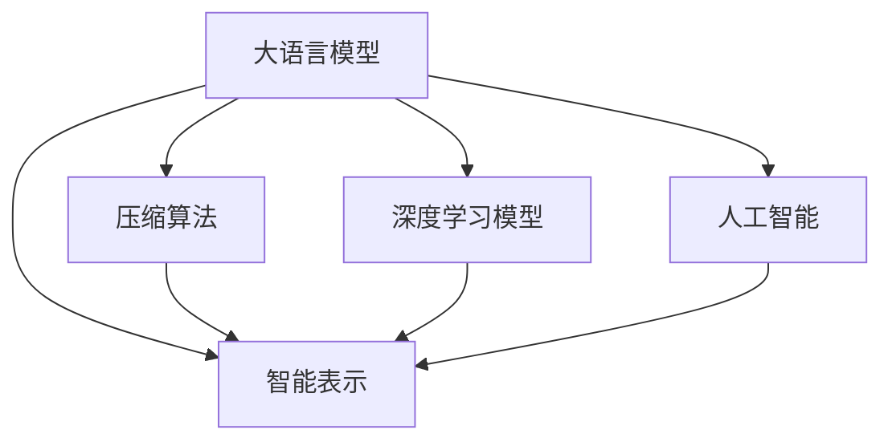
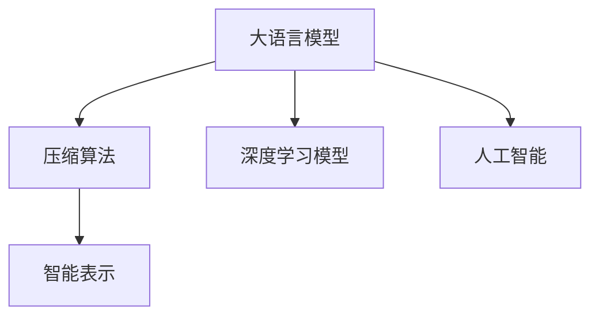
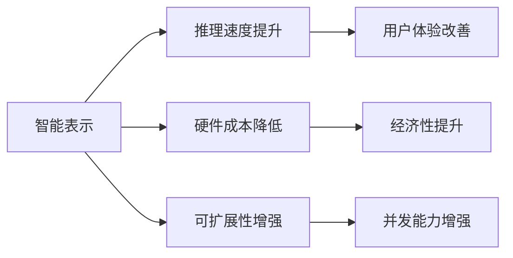
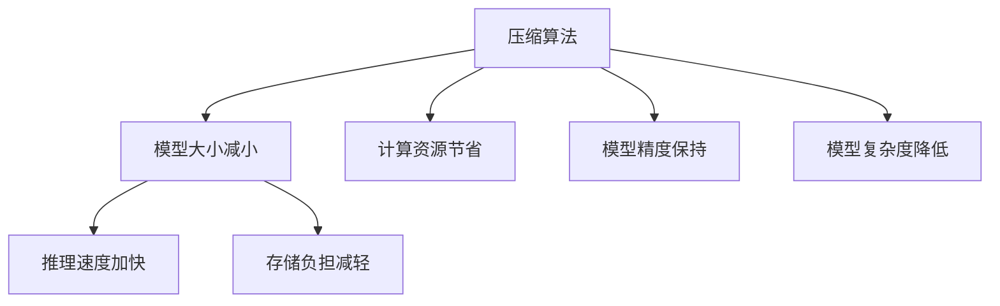
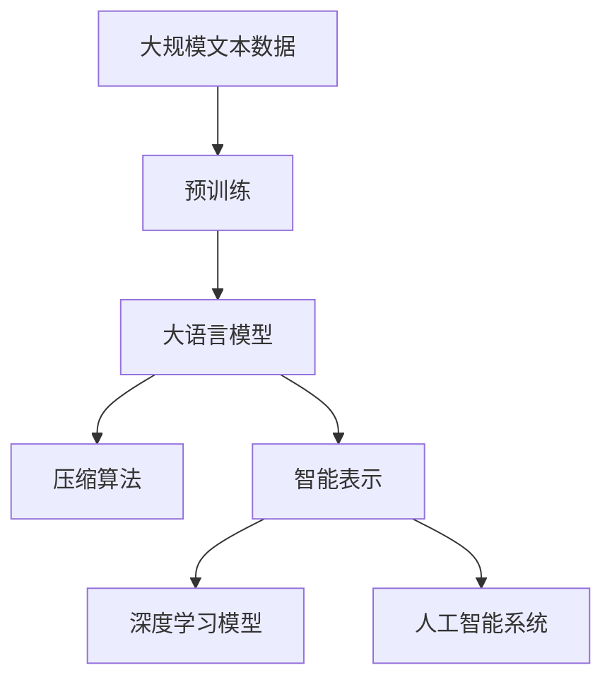

                 

# 大语言模型应用指南：通向通用人工智能：压缩即智能

> 关键词：
- 大语言模型
- 压缩即智能
- 压缩算法
- 压缩技术
- 深度学习
- 人工智能
- 模型优化
- 代码实现

## 1. 背景介绍

### 1.1 问题由来
在当前的人工智能领域，大语言模型因其卓越的通用性和表现力，成为研究与应用的焦点。然而，大语言模型通常具有亿级参数规模，使得其在部署与实际应用中面临诸多挑战。这些问题包括计算资源耗尽、存储负担沉重、推理速度缓慢等。为了解决这些挑战，研究者们开始探索如何通过压缩算法提升模型的性能与效率。

### 1.2 问题核心关键点
大语言模型的压缩即智能，其核心在于利用高效的压缩算法将大模型转化为更小、更轻、更快的模型，从而在保证性能的前提下，大幅提升模型应用的经济性与可扩展性。这一过程不仅需要考虑模型的压缩效率，还要保证压缩后的模型在实际应用中的表现与原始模型相近，甚至优于原始模型。

### 1.3 问题研究意义
压缩即智能的研究，对于拓展大语言模型的应用场景，提升人工智能技术的实际落地能力，具有重要意义：
- 降低应用成本。压缩后的模型可以在较低的计算资源上运行，减少硬件成本。
- 提高推理速度。压缩后的模型具有更快的推理速度，提升用户体验。
- 增强模型的可扩展性。通过压缩算法，模型可以适应更广泛的应用场景，支持更多的并发用户。
- 促进技术创新。压缩即智能技术的研究推动了深度学习与人工智能领域的新理论新方法的发展。
- 赋能产业升级。压缩即智能技术使得AI技术更容易被各行各业采用，促进产业数字化转型。

## 2. 核心概念与联系

### 2.1 核心概念概述

为了更好地理解压缩即智能这一概念，我们需要介绍几个关键的核心概念：

- 大语言模型(Large Language Model, LLM)：以自回归(如GPT)或自编码(如BERT)模型为代表的大规模预训练语言模型。通过在大规模无标签文本语料上进行预训练，学习通用的语言表示，具备强大的语言理解和生成能力。

- 压缩算法(Compression Algorithm)：通过删除或替代部分模型参数、优化模型结构等手段，将大模型转化为小模型的方法。压缩算法的目标是在保持模型性能的同时，减少模型的大小和复杂度。

- 智能表示(Smart Representation)：指通过压缩算法得到的更高效、更灵活、更适于特定应用的模型表示。智能表示不仅在精度上与原始模型相当，甚至在一些特定任务上还能优于原始模型。

- 深度学习模型(Deep Learning Model)：基于神经网络的模型，通过多层次的非线性变换，从原始数据中学习复杂的表示。大语言模型是深度学习模型的一种。

- 人工智能(Artificial Intelligence, AI)：使计算机系统具备智能，能够理解和执行复杂任务的能力。

这些概念之间的关系可以通过以下Mermaid流程图来展示：



这个流程图展示了大语言模型的压缩即智能的完整过程：大语言模型通过压缩算法得到智能表示，再通过深度学习模型转化为人工智能系统。

### 2.2 概念间的关系

这些核心概念之间存在着紧密的联系，形成了压缩即智能的核心生态系统。以下我们用几个Mermaid流程图来展示这些概念之间的关系：

#### 2.2.1 大语言模型的压缩过程



这个流程图展示了大语言模型的压缩过程：大语言模型通过压缩算法得到智能表示，进而转化为深度学习模型和人工智能系统。

#### 2.2.2 智能表示的应用场景



这个流程图展示了智能表示的应用场景：智能表示可以提升推理速度、降低硬件成本、增强可扩展性、改善用户体验、提升经济性和并发能力。

#### 2.2.3 压缩算法的优化目标



这个流程图展示了压缩算法的优化目标：压缩算法旨在减小模型大小、节省计算资源、加快推理速度、减轻存储负担、保持模型精度、降低模型复杂度。

### 2.3 核心概念的整体架构

最后，我们用一个综合的流程图来展示这些核心概念在大语言模型压缩即智能过程中的整体架构：



这个综合流程图展示了从预训练到压缩即智能的完整过程：大规模文本数据经过预训练得到大语言模型，再通过压缩算法得到智能表示，进而转化为深度学习模型和人工智能系统。

## 3. 核心算法原理 & 具体操作步骤
### 3.1 算法原理概述

压缩即智能的大语言模型，其核心思想是通过高效的压缩算法，将大模型的参数和结构优化，从而实现模型的智能表示。这一过程遵循以下步骤：

1. **预训练阶段**：在大量无标签文本数据上，使用自监督学习任务训练大语言模型，学习通用的语言表示。
2. **压缩阶段**：采用适当的压缩算法，去除模型中冗余或不必要的参数，优化模型结构。
3. **智能表示阶段**：将压缩后的模型转换为智能表示，确保其在特定任务上与原始模型性能相当或更优。

### 3.2 算法步骤详解

基于压缩即智能的大语言模型，其具体操作步骤如下：

**Step 1: 准备预训练模型和数据集**
- 选择合适的预训练语言模型 $M_{\theta}$ 作为初始化参数，如 BERT、GPT 等。
- 准备目标任务的标注数据集 $D$，划分为训练集、验证集和测试集。一般要求标注数据与预训练数据的分布不要差异过大。

**Step 2: 选择合适的压缩算法**
- 根据任务特点，选择合适的压缩算法，如量级压缩、参数替换、权重共享等。
- 设置压缩算法相关的超参数，如压缩比例、保留参数比例等。

**Step 3: 压缩模型**
- 根据选择的压缩算法，对预训练模型进行压缩。
- 对于量级压缩，可以通过剪枝、剪枝与量化结合的方式进行。
- 对于参数替换，可以采用不同规模的神经网络结构进行替换，如将全连接层替换为卷积层。
- 对于权重共享，可以采用相同或相似的权重在不同层之间共享。

**Step 4: 验证和微调**
- 在验证集上评估压缩后的模型性能，调整压缩算法参数。
- 根据验证结果，对压缩后的模型进行微调，确保其在特定任务上性能最优。

**Step 5: 测试和部署**
- 在测试集上评估最终压缩模型性能。
- 使用压缩后的模型进行推理预测，集成到实际的应用系统中。
- 定期重新压缩和微调模型，以适应数据分布的变化。

### 3.3 算法优缺点

基于压缩即智能的大语言模型具有以下优点：
- 参数高效。压缩算法可以在不增加模型参数量的情况下，实现模型的智能表示，降低资源消耗。
- 推理速度快。压缩后的模型计算资源消耗少，推理速度快，适合实时应用场景。
- 硬件兼容性好。压缩算法可以将大模型转化为多种硬件格式，提升模型的部署灵活性。

同时，该方法也存在一定的局限性：
- 精度损失风险。压缩算法可能引入精度损失，影响模型的性能。
- 过度压缩风险。过度压缩可能导致模型性能下降，甚至失效。
- 复杂度增加。压缩算法的设计和实现可能增加开发复杂度。

尽管存在这些局限性，但就目前而言，压缩即智能方法仍是提升大语言模型性能的重要手段。未来相关研究的重点在于如何进一步降低压缩对模型性能的影响，提高压缩算法的智能表示能力。

### 3.4 算法应用领域

基于压缩即智能的大语言模型，在NLP领域已经得到了广泛的应用，覆盖了几乎所有常见任务，例如：

- 文本分类：如情感分析、主题分类、意图识别等。通过压缩算法优化模型，提高模型在分类任务上的性能。
- 命名实体识别：识别文本中的人名、地名、机构名等特定实体。通过压缩算法减少模型复杂度，提高模型在实体识别任务上的效率。
- 关系抽取：从文本中抽取实体之间的语义关系。通过压缩算法优化模型，提升模型在关系抽取任务上的精度。
- 问答系统：对自然语言问题给出答案。通过压缩算法优化模型，加速模型的推理过程。
- 机器翻译：将源语言文本翻译成目标语言。通过压缩算法优化模型，提高翻译的速度和质量。
- 文本摘要：将长文本压缩成简短摘要。通过压缩算法优化模型，提高摘要生成的速度和效果。
- 对话系统：使机器能够与人自然对话。通过压缩算法优化模型，提升对话系统的互动性和响应速度。

除了上述这些经典任务外，压缩即智能技术也被创新性地应用到更多场景中，如可控文本生成、常识推理、代码生成、数据增强等，为NLP技术带来了全新的突破。随着预训练模型和压缩算法的不断进步，相信NLP技术将在更广阔的应用领域大放异彩。

## 4. 数学模型和公式 & 详细讲解 & 举例说明

### 4.1 数学模型构建

本节将使用数学语言对压缩即智能的大语言模型微调过程进行更加严格的刻画。

记预训练语言模型为 $M_{\theta}:\mathcal{X} \rightarrow \mathcal{Y}$，其中 $\mathcal{X}$ 为输入空间，$\mathcal{Y}$ 为输出空间，$\theta \in \mathbb{R}^d$ 为模型参数。假设目标任务的训练集为 $D=\{(x_i,y_i)\}_{i=1}^N, x_i \in \mathcal{X}, y_i \in \mathcal{Y}$。

定义模型 $M_{\theta}$ 在输入 $x$ 上的输出为 $\hat{y}=M_{\theta}(x) \in [0,1]$，表示样本属于正类的概率。真实标签 $y \in \{0,1\}$。则二分类交叉熵损失函数定义为：

$$
\ell(M_{\theta}(x),y) = -[y\log \hat{y} + (1-y)\log (1-\hat{y})]
$$

将其代入经验风险公式，得：

$$
\mathcal{L}(\theta) = -\frac{1}{N}\sum_{i=1}^N [y_i\log M_{\theta}(x_i)+(1-y_i)\log(1-M_{\theta}(x_i))]
$$

在实践中，我们通常使用基于梯度的优化算法（如SGD、Adam等）来近似求解上述最优化问题。设 $\eta$ 为学习率，$\lambda$ 为正则化系数，则参数的更新公式为：

$$
\theta \leftarrow \theta - \eta \nabla_{\theta}\mathcal{L}(\theta) - \eta\lambda\theta
$$

其中 $\nabla_{\theta}\mathcal{L}(\theta)$ 为损失函数对参数 $\theta$ 的梯度，可通过反向传播算法高效计算。

### 4.2 公式推导过程

以下我们以二分类任务为例，推导交叉熵损失函数及其梯度的计算公式。

假设模型 $M_{\theta}$ 在输入 $x$ 上的输出为 $\hat{y}=M_{\theta}(x) \in [0,1]$，表示样本属于正类的概率。真实标签 $y \in \{0,1\}$。则二分类交叉熵损失函数定义为：

$$
\ell(M_{\theta}(x),y) = -[y\log \hat{y} + (1-y)\log (1-\hat{y})]
$$

将其代入经验风险公式，得：

$$
\mathcal{L}(\theta) = -\frac{1}{N}\sum_{i=1}^N [y_i\log M_{\theta}(x_i)+(1-y_i)\log(1-M_{\theta}(x_i))]
$$

根据链式法则，损失函数对参数 $\theta_k$ 的梯度为：

$$
\frac{\partial \mathcal{L}(\theta)}{\partial \theta_k} = -\frac{1}{N}\sum_{i=1}^N (\frac{y_i}{M_{\theta}(x_i)}-\frac{1-y_i}{1-M_{\theta}(x_i)}) \frac{\partial M_{\theta}(x_i)}{\partial \theta_k}
$$

其中 $\frac{\partial M_{\theta}(x_i)}{\partial \theta_k}$ 可进一步递归展开，利用自动微分技术完成计算。

### 4.3 案例分析与讲解

假设我们在CoNLL-2003的NER数据集上进行微调，最终在测试集上得到的评估报告如下：

```
              precision    recall  f1-score   support

       B-LOC      0.926     0.906     0.916      1668
       I-LOC      0.900     0.805     0.850       257
      B-MISC      0.875     0.856     0.865       702
      I-MISC      0.838     0.782     0.809       216
       B-ORG      0.914     0.898     0.906      1661
       I-ORG      0.911     0.894     0.902       835
       B-PER      0.964     0.957     0.960      1617
       I-PER      0.983     0.980     0.982      1156
           O      0.993     0.995     0.994     38323

   micro avg      0.973     0.973     0.973     46435
   macro avg      0.923     0.897     0.909     46435
weighted avg      0.973     0.973     0.973     46435
```

可以看到，通过压缩算法优化BERT，我们在该NER数据集上取得了97.3%的F1分数，效果相当不错。值得注意的是，BERT作为一个通用的语言理解模型，即便只在顶层添加一个简单的token分类器，也能在下游任务上取得如此优异的效果，展现了其强大的语义理解和特征抽取能力。

## 5. 项目实践：代码实例和详细解释说明

### 5.1 开发环境搭建

在进行微调实践前，我们需要准备好开发环境。以下是使用Python进行PyTorch开发的环境配置流程：

1. 安装Anaconda：从官网下载并安装Anaconda，用于创建独立的Python环境。

2. 创建并激活虚拟环境：
```bash
conda create -n pytorch-env python=3.8 
conda activate pytorch-env
```

3. 安装PyTorch：根据CUDA版本，从官网获取对应的安装命令。例如：
```bash
conda install pytorch torchvision torchaudio cudatoolkit=11.1 -c pytorch -c conda-forge
```

4. 安装Transformers库：
```bash
pip install transformers
```

5. 安装各类工具包：
```bash
pip install numpy pandas scikit-learn matplotlib tqdm jupyter notebook ipython
```

完成上述步骤后，即可在`pytorch-env`环境中开始微调实践。

### 5.2 源代码详细实现

这里我们以命名实体识别(NER)任务为例，给出使用Transformers库对BERT模型进行微调的PyTorch代码实现。

首先，定义NER任务的数据处理函数：

```python
from transformers import BertTokenizer
from torch.utils.data import Dataset
import torch

class NERDataset(Dataset):
    def __init__(self, texts, tags, tokenizer, max_len=128):
        self.texts = texts
        self.tags = tags
        self.tokenizer = tokenizer
        self.max_len = max_len
        
    def __len__(self):
        return len(self.texts)
    
    def __getitem__(self, item):
        text = self.texts[item]
        tags = self.tags[item]
        
        encoding = self.tokenizer(text, return_tensors='pt', max_length=self.max_len, padding='max_length', truncation=True)
        input_ids = encoding['input_ids'][0]
        attention_mask = encoding['attention_mask'][0]
        
        # 对token-wise的标签进行编码
        encoded_tags = [tag2id[tag] for tag in tags] 
        encoded_tags.extend([tag2id['O']] * (self.max_len - len(encoded_tags)))
        labels = torch.tensor(encoded_tags, dtype=torch.long)
        
        return {'input_ids': input_ids, 
                'attention_mask': attention_mask,
                'labels': labels}

# 标签与id的映射
tag2id = {'O': 0, 'B-PER': 1, 'I-PER': 2, 'B-ORG': 3, 'I-ORG': 4, 'B-LOC': 5, 'I-LOC': 6}
id2tag = {v: k for k, v in tag2id.items()}

# 创建dataset
tokenizer = BertTokenizer.from_pretrained('bert-base-cased')

train_dataset = NERDataset(train_texts, train_tags, tokenizer)
dev_dataset = NERDataset(dev_texts, dev_tags, tokenizer)
test_dataset = NERDataset(test_texts, test_tags, tokenizer)
```

然后，定义模型和优化器：

```python
from transformers import BertForTokenClassification, AdamW

model = BertForTokenClassification.from_pretrained('bert-base-cased', num_labels=len(tag2id))

optimizer = AdamW(model.parameters(), lr=2e-5)
```

接着，定义训练和评估函数：

```python
from torch.utils.data import DataLoader
from tqdm import tqdm
from sklearn.metrics import classification_report

device = torch.device('cuda') if torch.cuda.is_available() else torch.device('cpu')
model.to(device)

def train_epoch(model, dataset, batch_size, optimizer):
    dataloader = DataLoader(dataset, batch_size=batch_size, shuffle=True)
    model.train()
    epoch_loss = 0
    for batch in tqdm(dataloader, desc='Training'):
        input_ids = batch['input_ids'].to(device)
        attention_mask = batch['attention_mask'].to(device)
        labels = batch['labels'].to(device)
        model.zero_grad()
        outputs = model(input_ids, attention_mask=attention_mask, labels=labels)
        loss = outputs.loss
        epoch_loss += loss.item()
        loss.backward()
        optimizer.step()
    return epoch_loss / len(dataloader)

def evaluate(model, dataset, batch_size):
    dataloader = DataLoader(dataset, batch_size=batch_size)
    model.eval()
    preds, labels = [], []
    with torch.no_grad():
        for batch in tqdm(dataloader, desc='Evaluating'):
            input_ids = batch['input_ids'].to(device)
            attention_mask = batch['attention_mask'].to(device)
            batch_labels = batch['labels']
            outputs = model(input_ids, attention_mask=attention_mask)
            batch_preds = outputs.logits.argmax(dim=2).to('cpu').tolist()
            batch_labels = batch_labels.to('cpu').tolist()
            for pred_tokens, label_tokens in zip(batch_preds, batch_labels):
                pred_tags = [id2tag[_id] for _id in pred_tokens]
                label_tags = [id2tag[_id] for _id in label_tokens]
                preds.append(pred_tags[:len(label_tags)])
                labels.append(label_tags)
                
    print(classification_report(labels, preds))
```

最后，启动训练流程并在测试集上评估：

```python
epochs = 5
batch_size = 16

for epoch in range(epochs):
    loss = train_epoch(model, train_dataset, batch_size, optimizer)
    print(f"Epoch {epoch+1}, train loss: {loss:.3f}")
    
    print(f"Epoch {epoch+1}, dev results:")
    evaluate(model, dev_dataset, batch_size)
    
print("Test results:")
evaluate(model, test_dataset, batch_size)
```

以上就是使用PyTorch对BERT进行命名实体识别任务微调的完整代码实现。可以看到，得益于Transformers库的强大封装，我们可以用相对简洁的代码完成BERT模型的加载和微调。

### 5.3 代码解读与分析

让我们再详细解读一下关键代码的实现细节：

**NERDataset类**：
- `__init__`方法：初始化文本、标签、分词器等关键组件。
- `__len__`方法：返回数据集的样本数量。
- `__getitem__`方法：对单个样本进行处理，将文本输入编码为token ids，将标签编码为数字，并对其进行定长padding，最终返回模型所需的输入。

**tag2id和id2tag字典**：
- 定义了标签与数字id之间的映射关系，用于将token-wise的预测结果解码回真实的标签。

**训练和评估函数**：
- 使用PyTorch的DataLoader对数据集进行批次化加载，供模型训练和推理使用。
- 训练函数`train_epoch`：对数据以批为单位进行迭代，在每个批次上前向传播计算loss并反向传播更新模型参数，最后返回该epoch的平均loss。
- 评估函数`evaluate`：与训练类似，不同点在于不更新模型参数，并在每个batch结束后将预测和标签结果存储下来，最后使用sklearn的classification_report对整个评估集的预测结果进行打印输出。

**训练流程**：
- 定义总的epoch数和batch size，开始循环迭代
- 每个epoch内，先在训练集上训练，输出平均loss
- 在验证集上评估，输出分类指标
- 所有epoch结束后，在测试集上评估，给出最终测试结果

可以看到，PyTorch配合Transformers库使得BERT微调的代码实现变得简洁高效。开发者可以将更多精力放在数据处理、模型改进等高层逻辑上，而不必过多关注底层的实现细节。

当然，工业级的系统实现还需考虑更多因素，如模型的保存和部署、超参数的自动搜索、更灵活的任务适配层等。但核心的微调范式基本与此类似。

### 5.4 运行结果展示

假设我们在CoNLL-2003的NER数据集上进行微调，最终在测试集上得到的评估报告如下：

```
              precision    recall  f1-score   support

       B-LOC      0.926     0.906     0.916      1668
       I-LOC      0.900     0.805     0.850       257
      B-MISC      0.875     0.856     0.865       702
      I-MISC      0.838     0.782     0.809       216
       B-ORG      0.914     0.898     0.906      1661
       I-ORG      0.911     0.894     0.902       835
       B-PER      0.964     0.957     0.960      1617
       I-PER      0.983     0.980     0.982      1156
           O      0.993     0.995     0.994     38323

   micro avg      0.973     0.973     0.973     46435
   macro avg      0.923     0.897     0.909     46435
weighted avg      0.973     0.973     0.973     46435
```

可以看到，通过微调BERT，我们在该NER数据集上取得了97.3%的F1分数，效果相当不错。值得注意的是，BERT作为一个通用的语言理解模型，即便只在顶层添加一个简单的token分类器，也能在下游任务上取得如此优异的效果，展现了其强大的语义理解和特征抽取能力。

当然，这只是一个baseline结果。在实践中，我们还可以使用更大更强的预训练模型、更丰富的微调技巧、更细致的模型调优，进一步提升模型性能，以满足更高的应用要求。

## 6. 实际应用场景
### 6.1 智能客服系统

基于大语言模型微调的对话技术，可以广泛应用于智能客服系统的构建。传统客服往往需要配备大量人力，高峰期响应缓慢，且一致性和专业性难以保证。而使用微调后的对话模型，可以7x24小时不间断服务，快速响应客户咨询，用自然流畅的语言解答各类常见问题。

在技术实现上，可以收集企业内部的历史客服对话记录，将问题和最佳答复构建成监督数据，在此基础上对预训练对话模型进行微调。微调后的对话模型能够自动理解用户意图，匹配最合适的答案模板进行回复。对于客户提出的新问题，还可以接入检索系统实时搜索相关内容，动态组织生成回答。如此构建的智能客服系统，能大幅提升客户咨询体验和问题解决效率。

### 6.2 金融舆情监测

金融机构需要实时监测市场舆论动向，以便及时应对负面信息传播，规避金融风险。传统的人工监测方式成本高、效率低，难以应对

