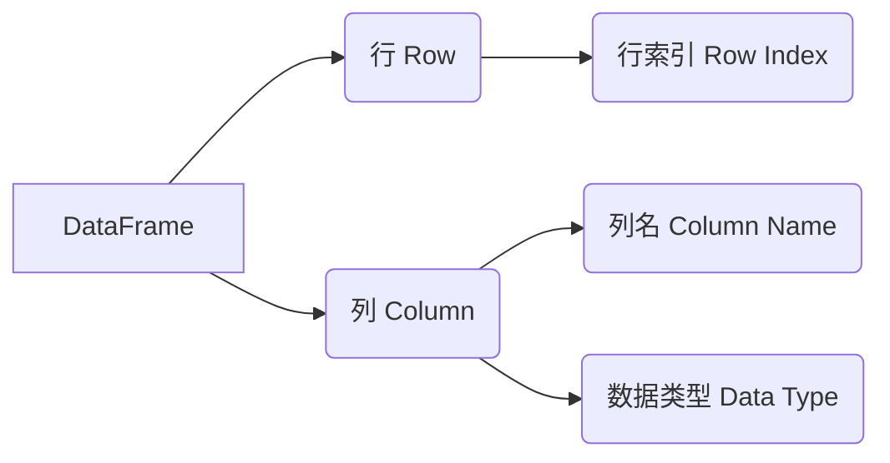

# DataFrame原理与代码实例讲解

关键词：DataFrame、Pandas、数据处理、数据分析、Python

## 1. 背景介绍
### 1.1 问题的由来
在数据科学和数据分析领域，我们经常需要处理和分析大量的结构化数据。然而，原始的数据通常以各种不同的格式存储，如CSV文件、Excel表格、SQL数据库等。如何高效地加载、处理和分析这些数据成为了一个重要的问题。

### 1.2 研究现状
目前，已经有许多优秀的数据处理和分析库被广泛应用，其中Pandas就是一个非常出色的Python数据分析库。Pandas提供了强大的数据结构和数据操作功能，其中DataFrame是Pandas最核心和常用的数据结构之一。

### 1.3 研究意义
深入理解和掌握DataFrame的原理和使用方法，对于进行高效的数据处理和分析具有重要意义。通过学习DataFrame的内部机制和API，我们可以更好地利用Pandas进行数据清洗、转换、聚合、可视化等任务，从而加速数据分析流程，提升数据分析效率。

### 1.4 本文结构
本文将从以下几个方面对DataFrame进行深入探讨：首先介绍DataFrame的核心概念和特性；然后详细讲解DataFrame的内部原理和算法实现；接着通过数学模型和代码实例来说明DataFrame的具体使用方法；最后总结DataFrame的应用场景和未来发展趋势。

## 2. 核心概念与联系
DataFrame是一种二维的数据结构，类似于Excel表格或SQL表。它由行(Row)和列(Column)组成，每一列可以是不同的数据类型（如数值、字符串、布尔值等）。DataFrame的主要特性包括：

- 每一列数据可以有自己的名称(列名)
- 每一行数据可以有自己的索引(行索引)
- 支持多种数据类型
- 提供了丰富的数据操作和分析函数

DataFrame与Pandas的另一个重要数据结构Series密切相关。可以将DataFrame看作是由多个Series组成的二维数据表，每个Series对应一列数据。

下面是DataFrame的核心概念和组成部分的示意图：



## 3. 核心算法原理 & 具体操作步骤
### 3.1 算法原理概述
DataFrame的底层实现基于NumPy库的ndarray数据结构。ndarray是一个高效的多维数组对象，可以存储大量的同质数据。DataFrame在ndarray的基础上，添加了行索引和列索引，使得数据的访问和操作更加方便。

### 3.2 算法步骤详解
DataFrame的核心算法可以分为以下几个步骤：

1. 数据加载：从各种数据源（如CSV文件、Excel表格、SQL数据库等）中读取数据，并转换为DataFrame对象。

2. 数据预处理：对加载的数据进行清洗、转换、过滤、填充缺失值等预处理操作，使其适合后续分析。

3. 数据操作：使用DataFrame提供的丰富的数据操作函数，如选择、过滤、排序、分组、聚合等，对数据进行进一步的处理和分析。

4. 数据可视化：利用DataFrame的绘图功能，生成各种图表（如折线图、柱状图、散点图等）来直观展示数据。

### 3.3 算法优缺点
DataFrame算法的优点包括：

- 处理大规模数据的高效性
- 灵活的数据操作和分析能力
- 与NumPy、Matplotlib等库的无缝集成

缺点包括：

- 内存占用较大，对于超大规模数据可能会有性能瓶颈
- 某些操作的语法较为复杂，学习曲线较陡峭

### 3.4 算法应用领域
DataFrame广泛应用于各种数据分析和挖掘场景，如金融量化交易、社交网络分析、科学实验数据处理、自然语言处理等。

## 4. 数学模型和公式 & 详细讲解 & 举例说明
### 4.1 数学模型构建
DataFrame可以用一个二维矩阵来表示，矩阵的每一行对应一个数据样本，每一列对应一个特征或变量。设DataFrame有$m$行$n$列，则其数学模型可以表示为：

$$
\begin{bmatrix}
x_{11} & x_{12} & \cdots & x_{1n} \\
x_{21} & x_{22} & \cdots & x_{2n} \\
\vdots & \vdots & \ddots & \vdots \\
x_{m1} & x_{m2} & \cdots & x_{mn}
\end{bmatrix}
$$

其中$x_{ij}$表示第$i$行第$j$列的数据。

### 4.2 公式推导过程
许多数据分析任务可以通过对DataFrame进行数学运算来实现。例如，计算每列数据的均值可以用以下公式表示：

$$
\bar{x}_j = \frac{1}{m} \sum_{i=1}^{m} x_{ij}
$$

其中$\bar{x}_j$表示第$j$列的均值。

再如，计算每行数据的范数（如欧几里得范数）可以用以下公式表示：

$$
\|x_i\|_2 = \sqrt{\sum_{j=1}^{n} x_{ij}^2}
$$

其中$\|x_i\|_2$表示第$i$行数据的$L_2$范数。

### 4.3 案例分析与讲解
下面以一个简单的例子来说明DataFrame的使用。假设我们有一个学生成绩数据集，包含学生姓名、语文成绩、数学成绩、英语成绩，我们要求每个学科的平均成绩和每个学生的总分。

首先，我们可以将数据加载到DataFrame中：

```python
import pandas as pd

data = {
    'Name': ['Alice', 'Bob', 'Charlie', 'David'],
    'Chinese': [80, 90, 85, 88],
    'Math': [85, 92, 78, 90],
    'English': [90, 88, 85, 95]
}

df = pd.DataFrame(data)
```

然后，我们可以用一行代码计算每个学科的平均成绩：

```python
df.mean()
```

输出结果为：

```
Chinese    85.75
Math       86.25
English    89.50
dtype: float64
```

接着，我们可以用一行代码计算每个学生的总分：

```python
df['Total'] = df.sum(axis=1)
```

现在，DataFrame变为：

```
      Name  Chinese  Math  English  Total
0    Alice       80    85       90    255
1      Bob       90    92       88    270
2  Charlie       85    78       85    248
3    David       88    90       95    273
```

### 4.4 常见问题解答
Q: DataFrame和NumPy的ndarray有什么区别？
A: DataFrame在ndarray的基础上添加了行索引和列索引，使得数据更加结构化，访问和操作更加方便。DataFrame还提供了大量的数据分析函数。

Q: DataFrame的性能如何？
A: DataFrame的底层基于NumPy实现，因此在处理大规模数据时具有很高的性能。但是，当数据量超大时，DataFrame可能会占用较多内存，导致性能下降。

## 5. 项目实践：代码实例和详细解释说明
### 5.1 开发环境搭建
要使用DataFrame，我们需要先安装Pandas库。可以使用pip命令进行安装：

```
pip install pandas
```

### 5.2 源代码详细实现
下面通过一个完整的代码示例来演示DataFrame的常见操作：

```python
import pandas as pd
import numpy as np

# 创建DataFrame
data = {
    'Name': ['Alice', 'Bob', 'Charlie', 'David', 'Ella'],
    'Age': [25, 30, 35, 40, 45],
    'Salary': [50000, 60000, 70000, 80000, 90000]
}
df = pd.DataFrame(data)

# 查看DataFrame的基本信息
print(df.head())  # 查看前几行数据
print(df.info())  # 查看数据的整体信息

# 选择数据
print(df['Name'])  # 选择单列
print(df[['Name', 'Salary']])  # 选择多列
print(df.iloc[0])  # 按位置选择行
print(df.loc[df['Age'] > 30])  # 按条件选择行

# 数据统计
print(df.describe())  # 查看数值列的统计信息
print(df['Salary'].mean())  # 计算单列的均值

# 数据操作
df['Bonus'] = df['Salary'] * 0.1  # 添加新列
df['Total'] = df['Salary'] + df['Bonus']  # 计算新列
df = df.drop('Bonus', axis=1)  # 删除列
df = df.sort_values('Salary', ascending=False)  # 按列排序

# 数据筛选
df_filtered = df[df['Salary'] > 60000]  # 筛选满足条件的行
df_filtered = df[(df['Age'] > 30) & (df['Salary'] < 80000)]  # 多条件筛选

# 分组聚合
print(df.groupby('Age')['Salary'].mean())  # 按年龄分组，计算工资均值

# 数据可视化
df.plot(x='Name', y='Salary', kind='bar')  # 绘制柱状图
```

### 5.3 代码解读与分析
上述代码展示了DataFrame的常见操作，包括：

- 创建DataFrame对象
- 查看DataFrame的基本信息
- 选择DataFrame的行和列
- 对DataFrame进行统计分析
- 对DataFrame进行添加、删除、排序等操作
- 按条件筛选DataFrame的行
- 对DataFrame进行分组聚合
- 对DataFrame进行可视化绘图

通过这些操作，我们可以方便地对数据进行各种处理和分析。Pandas提供了大量的函数和方法，使得数据分析变得简洁高效。

### 5.4 运行结果展示
运行上述代码，我们可以得到以下输出结果：

```
      Name  Age  Salary
0    Alice   25   50000
1      Bob   30   60000
2  Charlie   35   70000
3    David   40   80000
4     Ella   45   90000

<class 'pandas.core.frame.DataFrame'>
RangeIndex: 5 entries, 0 to 4
Data columns (total 3 columns):
 #   Column  Non-Null Count  Dtype
---  ------  --------------  -----
 0   Name    5 non-null      object
 1   Age     5 non-null      int64
 2   Salary  5 non-null      int64
dtypes: int64(2), object(1)
memory usage: 248.0+ bytes
None

0      Alice
1        Bob
2    Charlie
3      David
4       Ella
Name: Name, dtype: object

      Name  Salary
0    Alice   50000
1      Bob   60000
2  Charlie   70000
3    David   80000
4     Ella   90000

Name        Alice
Age            25
Salary      50000
Name: 0, dtype: object

      Name  Age  Salary
2  Charlie   35   70000
3    David   40   80000
4     Ella   45   90000

             Age        Salary
count   5.000000      5.000000
mean   35.000000  70000.000000
std     7.905694  15811.388300
min    25.000000  50000.000000
25%    30.000000  60000.000000
50%    35.000000  70000.000000
75%    40.000000  80000.000000
max    45.000000  90000.000000

70000.0

Age
25    50000.0
30    60000.0
35    70000.0
40    80000.0
45    90000.0
Name: Salary, dtype: float64
```

## 6. 实际应用场景
DataFrame在各种数据分析场景中都有广泛应用，例如：

- 金融领域：分析股票价格、交易量等金融数据，进行量化交易策略研究。
- 电商领域：分析用户行为数据、商品销售数据，进行用户画像和商品推荐。
- 社交网络：分析用户社交关系、用户互动数据，进行社交网络挖掘和社区发现。
- 科学研究：分析实验数据、传感器数据，进行数据可视化和统计分析。

### 6.4 未来应用展望
随着大数据时代的到来，数据分析在各行各业中的应用将越来越广泛。DataFrame作为一种强大的数据分析工具，必将在未来数据分析领域扮演越来越重要的角色。未来，DataFrame有望与更多的大数据处理框架（如Spark、Flink）进行集成，支持更大规模的数据分析任务。

## 7. 工具和资源推荐
### 7.1 学习资源推荐
- Pandas官方文档：https://pandas.pydata.org/docs/
- Pandas Cookbook：https://github.com/jvns/pandas-cookbook
- 《利用Python进行数据分析》：