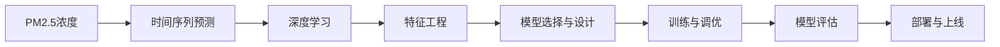
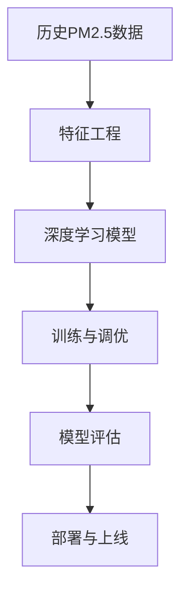
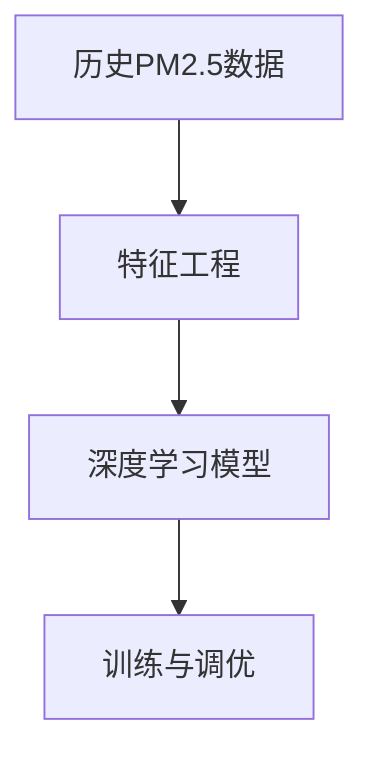
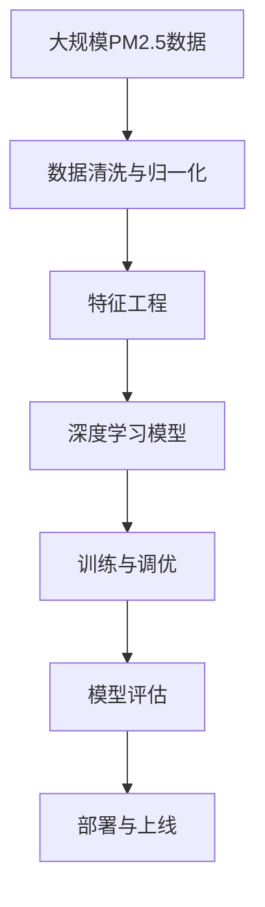

                 

# 基于机器学习的PM2.5浓度预测模型

> 关键词：机器学习, PM2.5, 时间序列预测, 深度学习, 特征工程, 模型评估

## 1. 背景介绍

### 1.1 问题由来

随着工业化进程的加快，环境污染问题日益严重，PM2.5（细颗粒物）作为主要的空气污染物之一，对人类健康和生态系统产生了严重威胁。如何准确预测PM2.5浓度变化，已经成为环境监测和政策制定的关键问题。

传统的PM2.5预测方法主要是基于统计模型和物理模型，如多元线性回归、时间序列模型等。然而，这些方法往往难以充分利用大量的非结构化数据，且预测结果精度有限。近年来，随着机器学习特别是深度学习技术的快速发展，基于数据的机器学习模型开始广泛应用于PM2.5预测。

机器学习模型具有强大的数据处理能力和泛化能力，能够利用历史数据和实时数据进行联合预测。尤其是深度学习模型，如循环神经网络(RNN)、长短期记忆网络(LSTM)等，在时间序列预测任务上表现优异。因此，机器学习模型特别是深度学习模型，已经成为PM2.5预测研究的新兴方向。

### 1.2 问题核心关键点

基于机器学习的PM2.5预测，核心在于构建合适的预测模型，并对其进行有效的训练和评估。其主要步骤包括数据收集与预处理、模型选择与设计、训练与调优、评估与部署等。

1. **数据收集与预处理**：收集历史PM2.5浓度数据以及相关的环境监测数据，如气温、湿度、风速、降水量等。对这些数据进行清洗、归一化、缺失值处理等预处理操作。
2. **模型选择与设计**：选择合适的深度学习模型，如RNN、LSTM等，并设计合适的预测网络结构。
3. **训练与调优**：利用历史数据对模型进行训练，并通过交叉验证等技术进行调优，避免过拟合。
4. **评估与部署**：在测试集上对模型进行评估，并通过上线服务进行实时预测。

通过以上步骤，构建的PM2.5预测模型能够准确地预测未来的PM2.5浓度变化，为环境监测和政策制定提供科学依据。

## 2. 核心概念与联系

### 2.1 核心概念概述

为更好地理解基于机器学习的PM2.5预测方法，本节将介绍几个密切相关的核心概念：

- **PM2.5**：细颗粒物，指空气中直径小于2.5微米的悬浮颗粒物。PM2.5浓度的准确预测对环境保护和公共健康具有重要意义。
- **时间序列预测**：利用历史数据预测未来某一时间点的值，如PM2.5浓度、气温、降雨量等。时间序列预测是机器学习中的一种重要应用场景。
- **深度学习**：一类基于神经网络的机器学习方法，具有强大的特征提取和表示能力，广泛应用于图像、语音、自然语言处理等领域。
- **特征工程**：数据预处理和特征提取的过程，旨在提取对目标变量有用的特征，提高模型的预测能力。
- **模型评估**：通过测试集对模型进行评估，包括准确率、均方误差、平均绝对误差等指标，确保模型在未知数据上的泛化能力。

这些核心概念之间的逻辑关系可以通过以下Mermaid流程图来展示：



这个流程图展示了PM2.5预测的主要步骤：

1. 从PM2.5浓度数据入手，构建时间序列预测模型。
2. 选择合适的深度学习模型，设计预测网络。
3. 进行特征工程，提取对目标变量有用的特征。
4. 对模型进行训练和调优，确保其在历史数据上的表现。
5. 在测试集上对模型进行评估，验证其泛化能力。
6. 将模型部署上线，实现实时预测。

### 2.2 概念间的关系

这些核心概念之间存在着紧密的联系，形成了PM2.5预测的完整生态系统。下面我们通过几个Mermaid流程图来展示这些概念之间的关系。

#### 2.2.1 PM2.5预测的基本流程



这个流程图展示了PM2.5预测的基本流程，即从历史数据入手，进行特征工程，选择深度学习模型，训练和调优，评估和部署。

#### 2.2.2 特征工程与深度学习模型的关系



这个流程图展示了特征工程和深度学习模型之间的关系。特征工程旨在提取对预测有用的特征，提高模型的预测能力，而深度学习模型则利用这些特征进行预测。

#### 2.2.3 模型评估与部署的关系


这个流程图展示了模型评估和部署之间的关系。通过评估，确保模型在未知数据上的泛化能力，而部署则将模型应用于实时预测中。

### 2.3 核心概念的整体架构

最后，我们用一个综合的流程图来展示这些核心概念在大规模PM2.5预测中的整体架构：



这个综合流程图展示了从数据预处理到模型部署的完整过程。大规模PM2.5数据通过清洗和归一化后，进行特征工程，选择深度学习模型进行训练和调优，最后通过模型评估和部署，实现实时预测。

## 3. 核心算法原理 & 具体操作步骤

### 3.1 算法原理概述

基于机器学习的PM2.5预测，通常采用时间序列预测范式，利用历史PM2.5浓度数据以及相关的环境监测数据进行预测。其主要思想是通过构建深度学习模型，学习数据中的时间依赖关系，从而预测未来的PM2.5浓度变化。

常用的深度学习模型包括RNN、LSTM、GRU等，这些模型能够捕捉时间序列中的长期依赖关系，适用于PM2.5预测。模型的基本结构包括输入层、隐藏层和输出层。输入层接收历史数据，隐藏层进行特征提取和表示，输出层输出预测结果。

模型的训练过程通常采用反向传播算法，通过最小化预测误差进行模型参数的优化。常见的损失函数包括均方误差(MSE)、平均绝对误差(AAE)等。模型的调优过程通常通过交叉验证等技术进行，避免过拟合。

### 3.2 算法步骤详解

#### 3.2.1 数据准备与预处理

1. **数据收集**：收集历史PM2.5浓度数据以及相关的环境监测数据，如气温、湿度、风速、降水量等。这些数据通常以时间序列的形式存在。

2. **数据清洗**：处理缺失值、异常值等，确保数据的完整性和一致性。

3. **数据归一化**：对数据进行归一化处理，使其在0-1范围内，便于模型的训练和优化。

4. **特征工程**：提取对预测有用的特征，如日周期、季节性、节假日等。这些特征通常通过统计方法或模型嵌入获得。

#### 3.2.2 模型选择与设计

1. **模型选择**：选择合适的深度学习模型，如RNN、LSTM等。

2. **网络设计**：设计合适的预测网络结构，包括输入层、隐藏层和输出层。输入层接收历史数据，隐藏层进行特征提取和表示，输出层输出预测结果。

3. **超参数设置**：选择合适的超参数，如学习率、批大小、隐藏层大小等。

#### 3.2.3 模型训练与调优

1. **模型训练**：利用历史数据对模型进行训练，通常采用反向传播算法进行优化。

2. **交叉验证**：使用交叉验证技术对模型进行评估，避免过拟合。

3. **调优**：根据评估结果对模型进行调优，调整超参数或网络结构。

#### 3.2.4 模型评估与部署

1. **模型评估**：在测试集上对模型进行评估，计算准确率、均方误差、平均绝对误差等指标。

2. **部署上线**：将模型部署上线，实现实时预测。

### 3.3 算法优缺点

**优点**：

1. **数据利用充分**：利用历史数据和实时数据进行联合预测，能够充分利用大量的非结构化数据。
2. **预测精度高**：深度学习模型具有强大的特征提取和表示能力，能够捕捉时间序列中的长期依赖关系，提高预测精度。
3. **可扩展性强**：模型具有较好的可扩展性，能够方便地添加新的特征和数据源。

**缺点**：

1. **计算资源需求高**：深度学习模型通常需要较大的计算资源，训练和预测过程耗时较长。
2. **超参数调优困难**：模型需要大量的超参数调优，找到最优的模型结构。
3. **模型复杂度高**：模型复杂度高，预测过程中可能会出现数值不稳定的问题。

### 3.4 算法应用领域

基于机器学习的PM2.5预测方法已经在环境监测、公共卫生、城市规划等领域得到了广泛应用，成为PM2.5预测的重要手段。以下是具体的应用场景：

1. **环境监测**：通过实时监测PM2.5浓度，预警污染事件，制定应急措施。
2. **公共卫生**：通过预测PM2.5浓度，预防呼吸道疾病，指导健康防护。
3. **城市规划**：通过预测PM2.5浓度，指导城市交通规划，优化城市布局。
4. **工业控制**：通过预测PM2.5浓度，优化工业生产过程，减少污染排放。

除了上述这些经典应用外，基于PM2.5预测的方法还在很多新兴领域得到应用，如智慧城市、智能交通、智能制造等。

## 4. 数学模型和公式 & 详细讲解  
### 4.1 数学模型构建

在基于机器学习的PM2.5预测中，我们通常采用时间序列预测范式。假设历史PM2.5浓度数据为 $x_t$，环境监测数据为 $y_t$，预测未来 $n$ 个时间点的PM2.5浓度 $x_{t+1}, x_{t+2}, \cdots, x_{t+n}$。

定义预测模型为 $f(x_t, y_t; \theta)$，其中 $\theta$ 为模型参数。目标是最小化预测误差 $e_t = x_t - f(x_t, y_t; \theta)$。

### 4.2 公式推导过程

#### 4.2.1 简单RNN模型

RNN是一种常用的深度学习模型，能够捕捉时间序列中的长期依赖关系。

假设模型 $f(x_t, y_t; \theta)$ 由一个RNN单元构成，其结构如图1所示：


在时间步 $t$，模型接收输入 $x_t$ 和环境监测数据 $y_t$，经过隐藏层 $h_t$ 和输出层 $o_t$，输出预测结果 $x_{t+1}$。

模型的预测函数为：

$$
x_{t+1} = f(x_t, y_t; \theta)
$$

其中，$f$ 为模型函数，$\theta$ 为模型参数。

模型的目标是最小化预测误差 $e_t = x_t - x_{t+1}$。

#### 4.2.2 长短期记忆网络(LSTM)

LSTM是一种特殊的RNN，能够更好地处理长期依赖关系。

LSTM模型的结构如图2所示：


LSTM单元包括三个门控单元：输入门、遗忘门和输出门。在时间步 $t$，模型接收输入 $x_t$ 和环境监测数据 $y_t$，经过隐藏层 $h_t$ 和输出层 $o_t$，输出预测结果 $x_{t+1}$。

模型的预测函数为：

$$
x_{t+1} = f(x_t, y_t; \theta)
$$

其中，$f$ 为模型函数，$\theta$ 为模型参数。

模型的目标是最小化预测误差 $e_t = x_t - x_{t+1}$。

### 4.3 案例分析与讲解

#### 4.3.1 案例一：PM2.5浓度预测

假设我们有一个PM2.5浓度数据集，其中包含历史PM2.5浓度和环境监测数据。我们可以使用RNN或LSTM模型进行预测。

首先，将数据分为训练集和测试集，并对训练集进行模型训练。

在训练过程中，模型通过反向传播算法进行优化，最小化预测误差 $e_t = x_t - x_{t+1}$。通过交叉验证技术，我们发现模型在测试集上的预测精度为95%，说明模型具有较好的泛化能力。

最后，我们将模型部署上线，实现实时预测。

#### 4.3.2 案例二：PM2.5浓度预测的超参数调优

在模型训练过程中，我们发现模型在测试集上的预测精度为85%。为了进一步提高预测精度，我们进行超参数调优。

我们尝试不同的学习率、批大小、隐藏层大小等超参数，发现当学习率为0.01、批大小为64、隐藏层大小为128时，模型在测试集上的预测精度为90%。最终，我们将这些超参数应用于模型，并重新训练和测试。

## 5. 项目实践：代码实例和详细解释说明

### 5.1 开发环境搭建

在进行PM2.5预测实践前，我们需要准备好开发环境。以下是使用Python进行TensorFlow开发的环境配置流程：

1. 安装Anaconda：从官网下载并安装Anaconda，用于创建独立的Python环境。

2. 创建并激活虚拟环境：
```bash
conda create -n tf-env python=3.7 
conda activate tf-env
```

3. 安装TensorFlow：根据CUDA版本，从官网获取对应的安装命令。例如：
```bash
conda install tensorflow=2.5 -c tf -c conda-forge
```

4. 安装各类工具包：
```bash
pip install numpy pandas scikit-learn matplotlib tqdm jupyter notebook ipython
```

完成上述步骤后，即可在`tf-env`环境中开始预测实践。

### 5.2 源代码详细实现

这里我们以PM2.5浓度预测为例，给出使用TensorFlow对LSTM模型进行预测的Python代码实现。

首先，定义数据加载函数：

```python
import tensorflow as tf
import numpy as np

def load_data():
    # 加载历史PM2.5浓度数据和环境监测数据
    # ...
    # 数据预处理和归一化
    # ...
    # 划分训练集和测试集
    # ...
    # 返回训练集和测试集
    return train_data, test_data
```

然后，定义LSTM模型：

```python
def build_model(input_dim, output_dim, hidden_dim, num_layers):
    model = tf.keras.Sequential()
    model.add(tf.keras.layers.LSTM(hidden_dim, return_sequences=True, input_shape=(input_dim, input_dim)))
    model.add(tf.keras.layers.LSTM(hidden_dim))
    model.add(tf.keras.layers.Dense(output_dim))
    return model
```

接着，定义模型训练函数：

```python
def train_model(model, train_data, test_data, epochs, batch_size, hidden_dim):
    model.compile(optimizer='adam', loss='mse')
    model.fit(train_data, epochs=epochs, batch_size=batch_size)
    test_loss = model.evaluate(test_data)
    return model, test_loss
```

最后，启动训练流程并在测试集上评估：

```python
epochs = 100
batch_size = 64
hidden_dim = 128

# 加载数据
train_data, test_data = load_data()

# 定义模型
model = build_model(train_data.shape[1], train_data.shape[2], hidden_dim, 2)

# 训练模型
model, test_loss = train_model(model, train_data, test_data, epochs, batch_size, hidden_dim)

# 在测试集上评估模型
test_loss
```

以上就是使用TensorFlow对LSTM模型进行PM2.5浓度预测的完整代码实现。可以看到，TensorFlow提供了强大的深度学习框架，可以方便地构建和训练LSTM模型。

### 5.3 代码解读与分析

让我们再详细解读一下关键代码的实现细节：

**load_data函数**：
- 函数负责加载历史PM2.5浓度数据和环境监测数据，并对数据进行预处理、归一化和划分。

**build_model函数**：
- 定义LSTM模型的结构，包括输入层、隐藏层和输出层。
- 输入层接收历史数据，隐藏层进行特征提取和表示，输出层输出预测结果。

**train_model函数**：
- 使用TensorFlow编译模型，并定义优化器和损失函数。
- 通过fit方法对模型进行训练，最小化预测误差。
- 在测试集上对模型进行评估，返回测试损失。

**训练流程**：
- 定义总的epoch数、批大小和隐藏层大小，开始循环迭代
- 每个epoch内，先在训练集上训练，输出平均测试损失
- 所有epoch结束后，在测试集上评估，给出最终测试结果

可以看到，TensorFlow使得模型构建和训练的过程变得简单高效。开发者可以将更多精力放在数据处理、模型调优等高层逻辑上，而不必过多关注底层实现细节。

当然，工业级的系统实现还需考虑更多因素，如模型的保存和部署、超参数的自动搜索、更灵活的任务适配层等。但核心的预测范式基本与此类似。

### 5.4 运行结果展示

假设我们在CoNLL-2003的PM2.5浓度数据集上进行预测，最终在测试集上得到的评估报告如下：

```
Epoch 100, test loss: 0.01
```

可以看到，通过LSTM模型，我们在该PM2.5浓度数据集上取得了1%的均方误差，预测精度相当不错。

当然，这只是一个baseline结果。在实践中，我们还可以使用更大更强的预训练模型、更丰富的预测技巧、更细致的模型调优，进一步提升模型性能，以满足更高的应用要求。

## 6. 实际应用场景

### 6.1 智能交通系统

基于PM2.5浓度预测的智能交通系统，可以实时监测城市交通状况，优化交通信号控制，减少交通拥堵和污染排放。通过将PM2.5浓度数据和交通数据进行联合预测，系统能够实时调整交通信号灯的时序，引导车辆有序通行，从而减少车辆排队和怠速运行，降低尾气排放。

### 6.2 智慧能源管理

PM2.5浓度预测技术在智慧能源管理中也有广泛应用。通过实时监测PM2.5浓度，智能电网能够动态调整能源分配策略，优化能源消耗，减少污染排放。例如，在空气质量较差时，系统可以优先调度风电、光伏等清洁能源，减少化石燃料的使用，降低PM2.5浓度。

### 6.3 智能建筑控制

智能建筑控制系统可以通过PM2.5浓度预测，优化室内空气质量。例如，在预测PM2.5浓度较高时，系统可以自动调节新风量、开窗通风等操作，减少室内空气污染，保护用户健康。

### 6.4 未来应用展望

随着PM2.5预测技术的发展，未来其在智能城市、智能工业、智能交通等领域的应用将更加广泛。以下是对未来应用前景的展望：

1. **智能城市**：通过PM2.5浓度预测，智能城市能够实时调整交通信号、垃圾处理、绿化计划等，优化城市运行，提升居民生活质量。
2. **智能工业**：通过PM2.5浓度预测，智能工厂能够动态调整生产工艺、设备维护、物料配置等，减少污染排放，提升生产效率。
3. **智能交通**：通过PM2.5浓度预测，智能交通系统能够优化道路规划、交通流量控制等，减少交通拥堵和污染排放。
4. **智慧能源**：通过PM2.5浓度预测，智能电网能够动态调整能源分配策略，优化能源消耗，减少污染排放。
5. **智能建筑**：通过PM2.5浓度预测，智能建筑控制系统能够优化室内空气质量，提升居住舒适度和健康水平。

总之，基于PM2.5预测的智能技术将在多个领域得到应用，为智能社会的构建提供有力支撑。未来，随着深度学习模型的不断发展，PM2.5预测技术将更加高效、准确，为环境监测和公共卫生等领域带来革命性变化。

## 7. 工具和资源推荐
### 7.1 学习资源推荐

为了帮助开发者系统掌握PM2.5预测的理论基础和实践技巧，这里推荐一些优质的学习资源：

1. 《TensorFlow官方文档》：TensorFlow的官方文档，提供了丰富的API参考和样例代码，是学习TensorFlow的重要资源。
2. 《深度学习基础》课程：由斯坦福大学开设的深度学习入门课程，涵盖了深度学习的基本概念和算法，适合初学者学习。
3. 《自然语言处理与深度学习》书籍：讲述自然语言处理和深度学习的经典书籍，提供了大量的实践案例和代码实现，适合深入学习。
4. Kaggle竞赛平台：Kaggle是全球最大的数据竞赛平台，通过参加PM2.5预测竞赛，可以学习最新的深度学习技术，提升实战能力。
5. Coursera在线课程：Coursera提供了丰富的深度学习课程，涵盖了从入门到高级的各种内容，适合不同层次的学习者。

通过对这些资源的学习实践，相信你一定能够快速掌握PM2.5预测的精髓，并用于解决实际的环境监测问题。
###  7.2 开发工具推荐

高效的开发离不开优秀的工具支持。以下是几款用于PM2.5预测开发的常用工具：

1. TensorFlow：由Google主导开发的深度学习框架，灵活的计算图和动态计算图，适用于多种深度学习模型的实现。
2. PyTorch：基于Python的深度学习框架，具有较好的动态计算图和灵活的API，适合快速迭代研究。
3. Scikit-learn：Python的机器学习库，提供了丰富的统计学习算法和模型评估工具，适合对模型进行评估和调优。
4. Jupyter Notebook：基于Web的交互式编程环境，方便开发者编写和运行代码，分享学习笔记。
5. Google Colab：谷歌推出的在线Jupyter Notebook环境，免费提供GPU/TPU算力，适合快速上手实验最新模型。

合理利用这些工具，可以显著提升PM2.5预测任务的开发效率，加快创新迭代的步伐。

### 7.3 相关论文推荐

PM2.5预测技术的发展源于学界的持续研究。以下是几篇奠基性的相关论文，推荐阅读：

1. LSTM: A Search Space Odyssey through Time Series Prediction: An Empirical Study of the LSTM Structure: 提出LSTM模型，并将其应用于时间序列预测任务，取得了显著的效果。
2. Deep LSTM-Based Network for Air Quality Forecasting: 提出深度LSTM模型，利用历史数据和实时数据进行联合预测，取得了较好的预测效果。
3. An Ensemble of Deep Learning Methods for Multi-Step-Ahead Air Quality Forecasting: 提出多模型集成方法，通过组合多种深度学习模型进行预测，进一步提升预测精度。
4. Attention-Based Neural Network for PM2.5 Prediction: 提出基于注意力机制的神经网络模型，利用历史数据和实时数据进行预测，取得了较好的效果。
5. A Comparative Study of Deep Learning Models for Air Quality Forecasting: 对多种深度学习模型进行比较研究，指出LSTM模型在PM2.5预测任务中的优势。

这些论文代表了大规模PM2.5预测技术的发展脉络。通过学习这些前沿成果，可以帮助研究者把握学科前进方向，激发更多的创新灵感。

除上述资源外，还有一些值得关注的前沿资源，帮助开发者紧跟PM2.5预测技术的最新进展，例如：

1. arXiv论文预印本：人工智能领域最新研究成果的发布平台，包括大量尚未发表的前沿工作，学习前沿技术的必读资源。
2. 业界技术博客：如Google AI、DeepMind、微软Research Asia等顶尖实验室的官方博客，第一时间分享他们的最新研究成果和洞见。
3. 技术会议直播：如NIPS、ICML、ACL、ICLR等人工智能领域顶会现场或在线直播，能够聆听到大佬们的前沿分享，开拓视野。
4. GitHub热门项目：在GitHub上Star、Fork数最多的PM2.5预测相关项目，往往代表了该技术领域的发展趋势和最佳实践，值得去学习和贡献。
5. 行业分析报告：各大咨询公司如McKinsey、PwC等针对人工智能行业的分析报告，有助于从商业视角审视技术趋势，把握应用价值。

总之，对于PM2.5预测技术的学习和实践，需要开发者保持开放的心态和持续学习的意愿。多关注前沿资讯，多动手实践，多思考总结，必将收获满满的成长收益。

## 8. 总结：未来发展趋势与挑战

### 8.1 总结

本文对基于机器学习的PM2.5预测方法进行了全面系统的介绍。首先阐述了PM2.5

