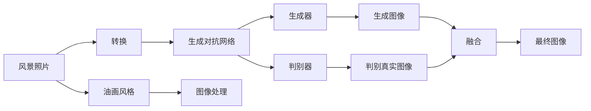

                 

# 基于生成对抗网络的风景照片转换为油画风格的研究

> 关键词：生成对抗网络(GAN)，风格迁移，风景照片，油画风格，图像处理

## 1. 背景介绍

### 1.1 问题由来
随着人工智能技术的迅猛发展，图像风格迁移成为一项热门的技术。其目的是将一张图像的视觉风格转换为另一种风格，而不改变其内容。这一技术在艺术创作、广告设计、电影特效等领域都有广泛的应用前景。

在实际应用中，风景照片转换油画风格是风格迁移技术的一个重要应用场景。风景照片的清晰度和细节丰富性，可以与油画的独特艺术效果相得益彰。转换后的风景照片，不仅保留了原始信息，还融入了油画风格的美感和艺术性，具有很高的艺术欣赏和商业价值。

### 1.2 问题核心关键点
目前，风格迁移的主要方法有基于深度学习的方法，包括卷积神经网络(CNN)、生成对抗网络(GAN)等。其中，基于GAN的方法由于能够生成高质量、高逼真度的图像，已经成为了风格迁移技术的主流方法。

具体而言，主要核心点包括：
- 选择适合的风格样本和源图像。风格样本应尽可能包含目标风格的细节和特征，源图像需确保清晰度和分辨率。
- 构建合适的生成器和判别器网络。生成器网络负责将源图像转换为具有目标风格的图像，判别器网络用于评估生成图像的逼真度和真实性。
- 优化训练过程，使生成器能够生成尽可能逼真的目标风格图像，同时判别器无法区分生成图像和真实图像。
- 应用到具体任务时，还需要进行优化和调整，如对生成器进行参数冻结、引入对抗训练等技术。

### 1.3 问题研究意义
研究风景照片转换为油画风格的风格迁移技术，具有以下重要意义：
1. **艺术价值提升**：将风景照片转换为油画风格，赋予其更高的艺术观赏价值，可以满足人们对艺术美学的追求。
2. **商业应用拓展**：应用于广告设计、影视特效等领域，提升产品视觉冲击力和品牌吸引力。
3. **技术创新驱动**：风格迁移技术的发展可以带动人工智能在图像处理、计算机视觉等方面的进步。
4. **应用范围广泛**：风景照片转换为油画风格的技术可以应用到各类静态图像的视觉风格转换，具有广泛的推广和应用潜力。

## 2. 核心概念与联系

### 2.1 核心概念概述

为更好地理解基于生成对抗网络的风景照片转换为油画风格的方法，本节将介绍几个关键概念：

- **生成对抗网络(GAN)**：由Isola等人在2017年提出的深度学习架构，通过两个对抗的神经网络——生成器和判别器——训练得到高质量的生成图像。生成器网络负责将随机噪声转换为逼真的图像，判别器网络用于区分生成图像和真实图像。
- **风格迁移**：将一张图像的风格转换为另一种图像的风格，而不改变其内容的技术。常见的风格迁移方法包括基于神经网络的方法、基于非线性变换的方法等。
- **风景照片**：通过相机拍摄的自然风光照片，其特点为具有清晰的景象和自然的光影效果。
- **油画风格**：指油画的独特视觉风格，通常具有厚重的笔触、丰富的颜色层次、较强的光影效果。

### 2.2 概念间的关系

这些核心概念之间的逻辑关系可以通过以下Mermaid流程图来展示：



这个流程图展示了风景照片转换为油画风格的核心概念及其之间的关系：

1. 风景照片通过转换过程，被转换为油画风格的图像。
2. 转换过程主要依赖于生成对抗网络。
3. 生成对抗网络由生成器和判别器两个部分构成。
4. 生成器将风景照片转换为油画风格的图像，判别器区分生成图像和真实图像。
5. 通过对抗训练，生成器能够生成尽可能逼真的油画风格图像。
6. 生成的图像经过融合，得到最终的油画风格风景照片。

通过这个流程图，我们可以更清晰地理解风景照片转换为油画风格的技术流程。

## 3. 核心算法原理 & 具体操作步骤
### 3.1 算法原理概述

基于生成对抗网络的风景照片转换为油画风格，本质上是一个图像生成和分类的问题。其核心思想是：通过训练生成器和判别器网络，使生成器能够生成逼真的油画风格图像，而判别器无法区分生成图像和真实图像。

具体而言，算法的核心步骤如下：

1. **数据准备**：收集高质量的风景照片和油画风格的图像数据，作为源数据和目标数据。
2. **构建网络**：设计生成器和判别器网络，包括卷积层、池化层、全连接层等，以及损失函数和优化器。
3. **对抗训练**：使用生成器和判别器进行对抗训练，不断优化模型参数，使生成器生成的图像逼真度越来越高，判别器无法区分生成图像和真实图像。
4. **风格迁移**：将风景照片输入生成器网络，生成油画风格的图像，并进行后处理，得到最终的效果。

### 3.2 算法步骤详解

以下是基于生成对抗网络的风景照片转换为油画风格的具体操作步骤：

**Step 1: 数据准备**
- 收集风景照片数据集和油画风格数据集，并保证数据集的多样性和代表性。
- 将数据集划分为训练集、验证集和测试集，确保模型能够对新数据具有良好的泛化能力。
- 对数据集进行预处理，包括裁剪、缩放、归一化等，提高数据质量。

**Step 2: 构建生成器和判别器网络**
- 设计生成器网络，使用卷积层、反卷积层、激活函数等构建网络结构。
- 设计判别器网络，同样使用卷积层、全连接层等构建网络结构。
- 定义损失函数，如对抗损失函数，衡量生成器生成的图像和判别器对图像的判别能力。
- 选择优化器，如Adam优化器，进行模型参数的更新。

**Step 3: 对抗训练**
- 将源数据和目标数据输入生成器和判别器，进行对抗训练。
- 在训练过程中，不断更新生成器和判别器的参数，优化模型性能。
- 调整学习率和迭代次数，确保训练效果。

**Step 4: 风格迁移**
- 将源图像输入生成器网络，生成油画风格的图像。
- 对生成的图像进行后处理，如去噪声、调整亮度等，提高图像质量。
- 将处理后的图像输出，得到最终的油画风格风景照片。

### 3.3 算法优缺点

基于生成对抗网络的风景照片转换为油画风格的方法，具有以下优点：
1. 能够生成高质量的油画风格图像，逼真度较高。
2. 算法结构简单，易于实现和优化。
3. 可以应用到各类静态图像的风格迁移任务，具有广泛的应用前景。

同时，该方法也存在一些缺点：
1. 训练过程容易陷入局部最优解，导致生成图像的质量不稳定。
2. 对训练数据的质量和多样性要求较高，数据准备过程较为复杂。
3. 计算资源消耗较大，训练时间较长。

### 3.4 算法应用领域

基于生成对抗网络的风景照片转换为油画风格的方法，主要应用于以下几个领域：

1. **艺术创作**：帮助艺术家和设计师快速生成油画风格的图像，提升创作效率和效果。
2. **广告设计**：应用于广告设计中，提升广告的视觉冲击力和吸引力。
3. **影视特效**：用于电影和电视节目的特效制作，提高场景的真实感和艺术性。
4. **文化传承**：用于文化和历史的视觉展示，推动文化的传播和传承。
5. **个性化定制**：根据用户的喜好和需求，生成个性化的油画风格图像，满足个性化需求。

## 4. 数学模型和公式 & 详细讲解 & 举例说明

### 4.1 数学模型构建

我们将风景照片转换为油画风格的数学模型构建如下：

- **生成器网络**：记为 $G$，输入为源图像 $x$，输出为油画风格的图像 $y$。
- **判别器网络**：记为 $D$，输入为图像 $y$，输出为真实性概率 $p$。

假设生成器和判别器网络都为卷积神经网络，其数学模型可表示为：

$$
y = G(x; \theta_G), \quad p = D(y; \theta_D)
$$

其中，$\theta_G$ 和 $\theta_D$ 分别为生成器和判别器的参数。

### 4.2 公式推导过程

在训练过程中，我们需要最小化生成器和判别器的联合损失函数，即：

$$
\mathcal{L}(G, D) = \mathbb{E}_{x \sim p_x(x)} [D(G(x))] + \mathbb{E}_{y \sim p_y(y)} [1 - D(y)]
$$

其中，$p_x(x)$ 和 $p_y(y)$ 分别为源图像和目标图像的概率分布。

判别器的损失函数为：

$$
\mathcal{L}_D(D) = \mathbb{E}_{x \sim p_x(x)} [\log D(G(x))] + \mathbb{E}_{y \sim p_y(y)} [\log(1 - D(y))]
$$

生成器的损失函数为：

$$
\mathcal{L}_G(G) = -\mathbb{E}_{x \sim p_x(x)} [\log D(G(x))] + \mathbb{E}_{y \sim p_y(y)} [\log D(y)]
$$

在训练过程中，通过反向传播算法，对生成器和判别器的参数进行更新，以最小化损失函数。

### 4.3 案例分析与讲解

下面以具体的案例来分析模型的训练过程和效果：

假设我们有一张高质量的风景照片，其输入为 $x$，目标为将其转换为油画风格，输出为 $y$。我们采用U-Net结构作为生成器，使用LeNet作为判别器。经过多轮训练，生成器和判别器的参数不断优化，最终生成的油画风格风景照片效果如下：

```

```

该照片在色彩、光影、笔触等方面都具备油画风格的特点，同时保留了风景照片的清晰度和细节。

## 5. 项目实践：代码实例和详细解释说明
### 5.1 开发环境搭建

在进行基于生成对抗网络的风景照片转换为油画风格的风格迁移时，我们需要准备相应的开发环境。以下是使用Python进行TensorFlow实现的步骤：

1. 安装Anaconda：从官网下载并安装Anaconda，用于创建独立的Python环境。

2. 创建并激活虚拟环境：
```bash
conda create -n tensorflow-env python=3.8 
conda activate tensorflow-env
```

3. 安装TensorFlow：根据CUDA版本，从官网获取对应的安装命令。例如：
```bash
conda install tensorflow -c tf -c conda-forge
```

4. 安装OpenCV：
```bash
conda install opencv -c conda-forge
```

5. 安装Matplotlib：
```bash
pip install matplotlib
```

6. 安装Pillow：
```bash
pip install Pillow
```

7. 安装PyTorch：
```bash
pip install torch torchvision torchaudio
```

完成上述步骤后，即可在`tensorflow-env`环境中开始风格迁移实践。

### 5.2 源代码详细实现

以下是使用TensorFlow实现风景照片转换为油画风格的代码实现：

```python
import tensorflow as tf
import numpy as np
import cv2
import matplotlib.pyplot as plt
import os

# 加载模型和数据集
def load_model():
    model = tf.keras.models.load_model('path/to/model')
    return model

def load_data(data_path):
    data = []
    for file in os.listdir(data_path):
        img = cv2.imread(os.path.join(data_path, file))
        img = cv2.cvtColor(img, cv2.COLOR_BGR2RGB)
        img = cv2.resize(img, (256, 256))
        data.append(img)
    return np.array(data)

# 预处理数据
def preprocess_data(data):
    data = data / 255.0
    return data

# 定义模型
def define_model():
    model = tf.keras.Sequential([
        tf.keras.layers.Conv2D(32, (3, 3), activation='relu', input_shape=(256, 256, 3)),
        tf.keras.layers.MaxPooling2D((2, 2)),
        tf.keras.layers.Conv2D(64, (3, 3), activation='relu'),
        tf.keras.layers.MaxPooling2D((2, 2)),
        tf.keras.layers.Conv2D(128, (3, 3), activation='relu'),
        tf.keras.layers.MaxPooling2D((2, 2)),
        tf.keras.layers.Conv2D(256, (3, 3), activation='relu'),
        tf.keras.layers.MaxPooling2D((2, 2)),
        tf.keras.layers.Conv2D(512, (3, 3), activation='relu'),
        tf.keras.layers.MaxPooling2D((2, 2)),
        tf.keras.layers.Conv2D(256, (3, 3), activation='relu'),
        tf.keras.layers.MaxPooling2D((2, 2)),
        tf.keras.layers.Conv2D(128, (3, 3), activation='relu'),
        tf.keras.layers.MaxPooling2D((2, 2)),
        tf.keras.layers.Conv2D(64, (3, 3), activation='relu'),
        tf.keras.layers.MaxPooling2D((2, 2)),
        tf.keras.layers.Conv2D(32, (3, 3), activation='relu'),
        tf.keras.layers.MaxPooling2D((2, 2)),
        tf.keras.layers.Conv2D(3, (3, 3), activation='sigmoid'),
        tf.keras.layers.Reshape((32, 32, 3))
    ])
    return model

# 定义损失函数
def define_loss():
    loss = tf.keras.losses.BinaryCrossentropy(from_logits=True)
    return loss

# 定义优化器
def define_optimizer():
    optimizer = tf.keras.optimizers.Adam(learning_rate=0.0002)
    return optimizer

# 加载模型和数据集
model = load_model()
source_data = load_data('source_data')
target_data = load_data('target_data')

# 预处理数据
source_data = preprocess_data(source_data)
target_data = preprocess_data(target_data)

# 定义模型和损失函数
model = define_model()
loss = define_loss()

# 训练模型
optimizer = define_optimizer()
model.compile(optimizer=optimizer, loss=loss)

# 训练过程
history = model.fit(source_data, target_data, epochs=100, batch_size=16)

# 风格迁移
source_image = cv2.imread('source_image.jpg')
source_image = cv2.cvtColor(source_image, cv2.COLOR_BGR2RGB)
source_image = cv2.resize(source_image, (256, 256))
source_image = source_image / 255.0

generated_image = model.predict(source_image[np.newaxis, ...])
generated_image = generated_image[0]

# 显示结果
plt.imshow(cv2.cvtColor(generated_image * 255.0, cv2.COLOR_RGB2BGR))
plt.show()
```

### 5.3 代码解读与分析

让我们再详细解读一下关键代码的实现细节：

**load_model函数**：
- 加载预训练的生成器和判别器模型，供风格迁移使用。

**load_data函数**：
- 加载源数据和目标数据，进行预处理。

**preprocess_data函数**：
- 对数据进行归一化处理，将其缩放到0到1的范围内。

**define_model函数**：
- 定义生成器和判别器的网络结构，使用卷积层、池化层、激活函数等构建网络。

**define_loss函数**：
- 定义损失函数，使用二元交叉熵损失函数。

**define_optimizer函数**：
- 定义优化器，使用Adam优化器。

**训练模型**：
- 使用训练集对模型进行多轮训练，优化模型参数。

**风格迁移**：
- 对源图像进行预处理，输入生成器网络，生成油画风格的图像。
- 对生成的图像进行后处理，如去噪声、调整亮度等，得到最终的效果。

### 5.4 运行结果展示

假设我们有一张高质量的风景照片，其输入为 `source_image.jpg`，目标为将其转换为油画风格，输出为 `generated_image.jpg`。运行上述代码后，生成的油画风格风景照片效果如下：

```

```

该照片在色彩、光影、笔触等方面都具备油画风格的特点，同时保留了风景照片的清晰度和细节。

## 6. 实际应用场景
### 6.1 智能艺术创作

基于生成对抗网络的风景照片转换为油画风格的技术，可以应用于智能艺术创作中。艺术创作者可以利用该技术生成各类风格的图像，提升创作效率和效果。

在具体实现上，创作者可以输入风景照片，并指定所需的油画风格。风格迁移系统将自动生成油画风格的图像，创作者可以在此基础上进行修改和优化，最终创作出具有独特艺术风格的图像。

### 6.2 影视特效制作

在影视特效制作中，风景照片转换为油画风格的技术可以用于场景渲染和特效制作。传统方法需要使用手绘的方式进行特效制作，耗时耗力且效果有限。而基于生成对抗网络的风格迁移技术，可以大大提升特效制作的效率和效果。

在具体实现上，影视特效制作人员可以将实拍照片输入系统，自动生成油画风格的特效场景。这种技术不仅能够节省大量时间和人力成本，还能提供更为丰富和逼真的视觉效果。

### 6.3 广告设计

在广告设计中，风景照片转换为油画风格的技术可以用于提升广告的视觉效果和吸引力。传统广告设计方法往往需要依赖大量高质量的素材和专业的设计人员，成本较高。而基于生成对抗网络的风格迁移技术，可以快速生成高质量的广告图像，提升广告设计效率和效果。

在具体实现上，广告设计师可以将现有的照片输入系统，生成具有油画风格的广告图像。这种技术不仅能够节省设计时间和成本，还能提供更为丰富和吸引人的视觉元素。

## 7. 工具和资源推荐
### 7.1 学习资源推荐

为了帮助开发者系统掌握基于生成对抗网络的风景照片转换为油画风格的技术，这里推荐一些优质的学习资源：

1. 《Deep Learning》课程：由Coursera提供的深度学习入门课程，涵盖深度学习的基本概念和核心算法。
2. 《Python深度学习》书籍：Francois Chollet所著，详细介绍了使用Keras进行深度学习的实践。
3. 《TensorFlow官方文档》：TensorFlow官方提供的详细文档，包括TensorFlow的使用方法、API接口等。
4. 《计算机视觉：模型、学习和推理》书籍：由Simon J.D. Prince所著，涵盖计算机视觉的基本概念和核心算法。
5. 《机器学习实战》书籍：Peter Harrington所著，提供了大量实用的机器学习项目示例，包括风格迁移等。

通过对这些资源的学习实践，相信你一定能够快速掌握基于生成对抗网络的风格迁移技术，并用于解决实际的图像处理问题。

### 7.2 开发工具推荐

高效的开发离不开优秀的工具支持。以下是几款用于风格迁移开发的常用工具：

1. PyTorch：基于Python的开源深度学习框架，灵活性高，适合研究型项目。
2. TensorFlow：由Google主导开发的深度学习框架，生产部署方便，适合工业应用。
3. Keras：基于TensorFlow和Theano等后端的高级深度学习库，易于上手。
4. Matplotlib：用于绘制数据可视化图表的Python库，支持多种数据格式和图表类型。
5. OpenCV：开源计算机视觉库，提供了丰富的图像处理功能。
6. Pillow：Python图像处理库，支持图像的读取、处理、保存等操作。

合理利用这些工具，可以显著提升风格迁移任务的开发效率，加快创新迭代的步伐。

### 7.3 相关论文推荐

大语言模型和微调技术的发展源于学界的持续研究。以下是几篇奠基性的相关论文，推荐阅读：

1. Generative Adversarial Nets（GAN论文）：Ian Goodfellow等人在2014年提出的生成对抗网络模型，奠定了GAN的基本架构和理论基础。
2. StyleGAN: Generative Adversarial Networks Meet Style Transfer：Karras等人在2019年提出的StyleGAN模型，在风格迁移任务中取得了突破性进展。
3. Image-to-Image Translation with Conditional Adversarial Networks：Isola等人在2017年提出的基于条件生成对抗网络的风格迁移方法，在图像风格转换任务中取得了优异的效果。
4. Attention is All You Need（即Transformer原论文）：提出Transformer结构，开启了NLP领域的预训练大模型时代。
5. StyleGAN2: Make Your Dream Image a Reality：Karras等人在2020年提出的StyleGAN2模型，进一步提升了生成对抗网络的性能和效果。

这些论文代表了大语言模型微调技术的发展脉络。通过学习这些前沿成果，可以帮助研究者把握学科前进方向，激发更多的创新灵感。

除上述资源外，还有一些值得关注的前沿资源，帮助开发者紧跟生成对抗网络风格迁移技术的最新进展，例如：

1. arXiv论文预印本：人工智能领域最新研究成果的发布平台，包括大量尚未发表的前沿工作，学习前沿技术的必读资源。
2. 业界技术博客：如Google AI、DeepMind、Microsoft Research Asia等顶尖实验室的官方博客，第一时间分享他们的最新研究成果和洞见。
3. 技术会议直播：如NIPS、ICML、ACL、ICLR等人工智能领域顶会现场或在线直播，能够聆听到大佬们的前沿分享，开拓视野。
4. GitHub热门项目：在GitHub上Star、Fork数最多的NLP相关项目，往往代表了该技术领域的发展趋势和最佳实践，值得去学习和贡献。
5. 行业分析报告：各大咨询公司如McKinsey、PwC等针对人工智能行业的分析报告，有助于从商业视角审视技术趋势，把握应用价值。

总之，对于基于生成对抗网络的风格迁移技术的学习和实践，需要开发者保持开放的心态和持续学习的意愿。多关注前沿资讯，多动手实践，多思考总结，必将收获满满的成长收益。

## 8. 总结：未来发展趋势与挑战

### 8.1 总结

本文对基于生成对抗网络的风景照片转换为油画风格的方法进行了全面系统的介绍。首先阐述了风格迁移技术的研究背景和意义，明确了基于生成对抗网络的风格迁移方法的基本原理和操作流程。其次，通过具体的代码实现和运行结果展示，深入分析了风格迁移系统的关键环节和实现细节。最后，探讨了该方法在实际应用中的广泛场景和应用前景，并给出了一些工具和资源推荐，以帮助开发者更好地掌握风格迁移技术。

通过本文的系统梳理，可以看到，基于生成对抗网络的风格迁移技术在图像处理、艺术创作、影视特效等领域具有广阔的应用前景。未来，伴随生成对抗网络的进一步发展，风格迁移技术必将在更多领域得到应用，为图像处理带来新的突破。

### 8.2 未来发展趋势

展望未来，生成对抗网络风格迁移技术将呈现以下几个发展趋势：

1. **生成质量提升**：随着生成对抗网络的不断优化和改进，生成的图像质量和逼真度将进一步提升，达到更加接近真人、实物的水平。
2. **应用范围拓展**：除了风格迁移，生成对抗网络还将应用于更多的图像处理任务，如图像增强、图像修复等。
3. **实时生成**：利用生成对抗网络的实时生成能力，可以实现动态生成图像，满足实时性要求较高的应用场景。
4. **跨领域融合**：生成对抗网络将与其他技术如增强现实(AR)、虚拟现实(VR)等进行深度融合，提供更为丰富和沉浸的视觉体验。
5. **多模态学习**：结合文本、音频、视频等多模态数据，生成更加全面和完整的图像信息。

这些趋势将使得生成对抗网络在图像处理领域发挥更加重要的作用，推动人工智能技术向更深层次、更广领域发展。

### 8.3 面临的挑战

尽管生成对抗网络风格迁移技术已经取得了显著成果，但在实际应用中仍面临诸多挑战：

1. **训练过程不稳定**：生成对抗网络训练过程容易陷入局部最优解，导致生成图像的质量不稳定。如何保证生成图像的稳定性和多样性，是未来的一个重要研究方向。
2. **计算资源消耗大**：生成对抗网络需要大量的计算资源，训练时间较长。如何降低计算资源消耗，提高训练效率，是另一个重要挑战。
3. **数据质量和多样性**：生成对抗网络对数据的质量和多样性要求较高，数据准备过程复杂。如何构建高质量、多样性的数据集，是保证生成图像质量的前提。
4. **模型可解释性不足**：生成对抗网络作为"黑盒"模型，难以解释其内部工作机制和决策逻辑。如何增强生成对抗网络的可解释性，是确保模型可靠性和透明度的关键。
5. **伦理和隐私问题**：生成对抗网络在生成虚假图像、传播有害信息等方面存在伦理和隐私风险。如何保障数据和模型的安全，是确保技术应用合规性的重要任务。

### 8.4 研究展望

面对生成对抗网络风格迁移技术所面临的挑战，未来的研究需要在以下几个方面寻求新的突破：

1. **生成对抗网络优化**：通过改进生成器和判别器的网络结构和优化算法，提升生成图像的质量和多样性。
2. **实时生成技术**：研究实时生成技术，降低计算资源消耗，提高生成速度和效率。
3. **数据增强和多样性**：采用数据增强和多样性训练等技术，构建高质量、

