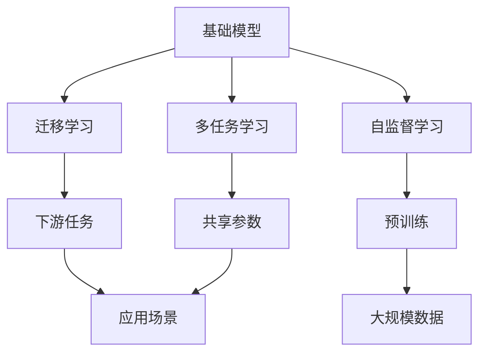
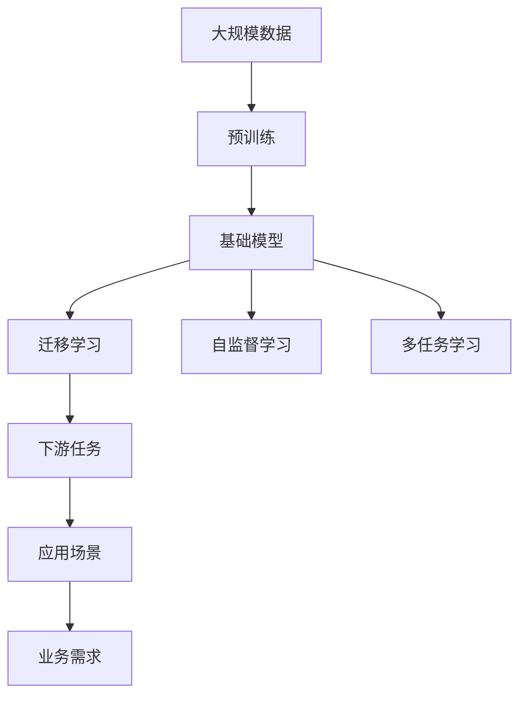
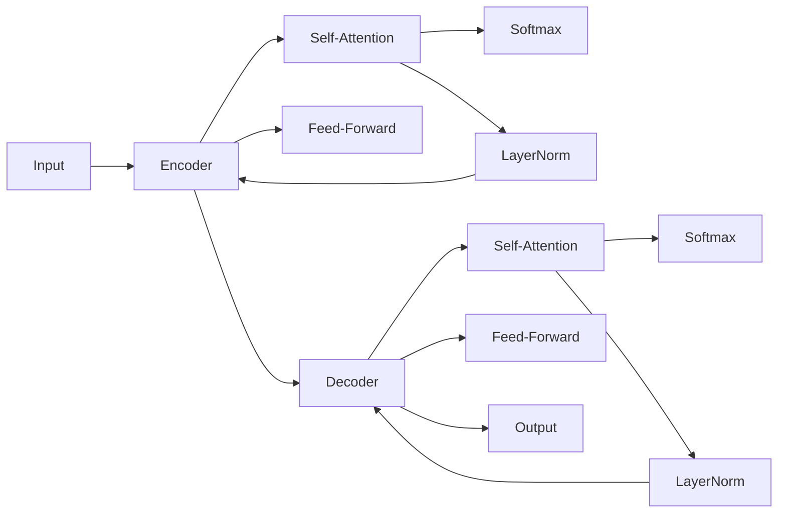
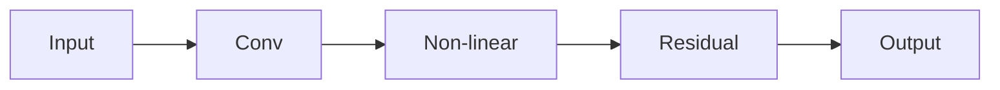

                 

# 基础模型的学术研究与未来发展

## 1. 背景介绍

### 1.1 问题由来
随着人工智能技术的快速发展，基础模型（Fundamental Model）已成为当前研究的热点。基础模型是一类具有通用性和基础性的深度学习模型，被广泛应用于计算机视觉、自然语言处理、语音识别、推荐系统等多个领域。它们具有规模庞大、通用性强、可扩展性高等特点，能够通过迁移学习、自监督学习、多任务学习等方法进行微调，适应不同的应用场景。

然而，随着基础模型的发展，其复杂性和规模也在不断增加，研究者面临诸多挑战，如模型泛化能力、可解释性、公平性、稳定性等。这些问题不仅限制了基础模型在实际应用中的性能，也影响了其学术研究的发展。因此，本文将从学术研究的角度出发，探讨基础模型的发展现状和未来方向，希望能够为研究者和开发者提供一些有价值的参考。

## 2. 核心概念与联系

### 2.1 核心概念概述
为了更好地理解基础模型，我们首先介绍几个关键概念：

- **基础模型（Fundamental Model）**：指在特定领域或特定任务上表现卓越的深度学习模型，如自然语言处理中的BERT、计算机视觉中的ResNet等。这些模型经过预训练，能够在大规模数据上学习到丰富的特征表示，适用于各种下游任务。

- **迁移学习（Transfer Learning）**：指将一个领域学习到的知识，迁移到另一个不同但相关的领域中。基础模型通常通过在大规模数据上预训练，然后通过迁移学习适应特定任务。

- **自监督学习（Self-supervised Learning）**：指使用无标签数据进行模型训练，通过模型自身的预测能力学习到有用的特征表示。基础模型通常采用自监督学习方法，以提高模型的泛化能力。

- **多任务学习（Multi-task Learning）**：指通过同时训练多个相关任务，共享模型参数，从而提高模型的泛化能力。基础模型通常采用多任务学习方法，以提高模型在多种任务上的表现。

- **可解释性（Explainability）**：指模型的决策过程可以被人类理解，这对于高风险应用尤为重要。基础模型的可解释性是学术研究的重要目标之一。

### 2.2 概念间的关系
这些核心概念之间的关系可以通过以下Mermaid流程图来展示：



这个流程图展示了基础模型的几个关键概念及其之间的关系：

1. 基础模型通常通过在大规模数据上预训练，从而学习到通用的特征表示。
2. 预训练后的基础模型可以通过迁移学习适应不同的下游任务。
3. 自监督学习和多任务学习是基础模型预训练的重要方法，可以提高模型的泛化能力。
4. 基础模型在特定领域或特定任务上应用时，通过迁移学习等方法可以取得优异表现。
5. 基础模型在不同的应用场景中，通过微调等方法可以进一步提升性能。

### 2.3 核心概念的整体架构
最后，我们用一个综合的流程图来展示这些核心概念在大模型中的应用：



这个综合流程图展示了基础模型的学习过程和应用流程，从数据预处理到模型训练，再到应用场景的适配，详细描述了基础模型在不同应用场景下的工作流程。

## 3. 核心算法原理 & 具体操作步骤
### 3.1 算法原理概述
基础模型的核心原理是通过在大规模数据上预训练，学习到通用的特征表示，然后在特定任务上进行微调，以适应具体应用场景。其核心算法包括：

- **预训练（Pre-training）**：在无标签数据上训练基础模型，学习到通用的特征表示。
- **微调（Fine-tuning）**：在特定任务上进行微调，适应具体的应用场景。
- **迁移学习（Transfer Learning）**：将预训练模型在源任务上的知识迁移到目标任务上，适应新的应用场景。
- **自监督学习（Self-supervised Learning）**：使用无标签数据进行训练，学习到通用的特征表示。
- **多任务学习（Multi-task Learning）**：在多个相关任务上进行训练，共享模型参数，提高模型的泛化能力。

### 3.2 算法步骤详解
基础模型的训练和微调流程一般包括以下几个步骤：

**Step 1: 准备预训练数据和任务数据**
- 收集大规模无标签数据进行预训练，如ImageNet、大规模自然语言语料库等。
- 收集特定任务的标注数据，如分类、回归、生成等。

**Step 2: 设计模型架构**
- 选择合适的深度学习模型架构，如卷积神经网络（CNN）、循环神经网络（RNN）、变压器（Transformer）等。
- 设计模型损失函数和优化器，如交叉熵损失、Adam、SGD等。

**Step 3: 进行预训练**
- 在大规模无标签数据上训练模型，学习到通用的特征表示。
- 使用自监督学习方法，如掩码语言模型、图像重建等，提高模型的泛化能力。

**Step 4: 进行微调和迁移学习**
- 在特定任务上进行微调，调整模型参数以适应具体任务。
- 将预训练模型在源任务上的知识迁移到目标任务上，提高模型在新任务上的表现。

**Step 5: 评估和部署**
- 在测试集上评估微调后的模型性能，对比预训练模型和微调模型的表现。
- 将模型部署到实际应用场景中，进行业务验证和优化。

### 3.3 算法优缺点
基础模型的优点包括：

- **通用性强**：基础模型在多种任务上表现优异，能够适应不同的应用场景。
- **泛化能力强**：通过自监督和多任务学习，基础模型能够学习到通用的特征表示，具有较强的泛化能力。
- **可扩展性好**：基础模型可以通过增加层数和宽度等方式进行扩展，适应更复杂的任务。

然而，基础模型也存在一些缺点：

- **计算资源需求高**：基础模型通常具有大规模参数和复杂的计算图，对计算资源的需求较高。
- **模型可解释性不足**：基础模型通常是黑盒模型，难以解释其内部决策过程。
- **过拟合风险高**：基础模型在特定任务上进行微调时，容易过拟合。

### 3.4 算法应用领域
基础模型已经在计算机视觉、自然语言处理、语音识别、推荐系统等多个领域得到广泛应用，取得了显著的成果。以下是几个典型的应用领域：

- **计算机视觉**：基础模型如ResNet、Inception、VGG等，被广泛应用于图像分类、目标检测、图像生成等任务，取得了优异的效果。
- **自然语言处理**：基础模型如BERT、GPT、XLNet等，被广泛应用于文本分类、命名实体识别、机器翻译等任务，取得了显著的进展。
- **语音识别**：基础模型如Wav2Vec、Wav2Vec 2.0等，被广泛应用于语音识别、语音合成等任务，提升了语音处理的技术水平。
- **推荐系统**：基础模型如FM、MLP等，被广泛应用于电商、社交网络等推荐系统，提升了用户体验和转化率。

## 4. 数学模型和公式 & 详细讲解 & 举例说明
### 4.1 数学模型构建
基础模型通常采用深度神经网络架构，如卷积神经网络（CNN）、循环神经网络（RNN）、变压器（Transformer）等。这里以Transformer为例，介绍基础模型的数学模型构建。

**Transformer模型**：
Transformer模型的核心组成部分包括编码器（Encoder）和解码器（Decoder），分别用于处理输入序列和生成输出序列。其基本结构如图1所示：



图1：Transformer模型结构

Transformer模型的编码器由多个自注意力层（Self-Attention）和前馈神经网络（Feed-Forward）组成，解码器由多个自注意力层和解码器注意力层（Attention）组成。

### 4.2 公式推导过程
这里以Transformer模型的自注意力层（Self-Attention）为例，推导其数学公式。

假设输入序列为 $x=\{x_i\}_{i=1}^n$，其中 $x_i$ 为第 $i$ 个输入向量，$h_i$ 为第 $i$ 个输出向量。自注意力层通过计算输入序列中每个位置的相似度，生成加权和向量，计算公式如下：

$$
h_i = \mathrm{Softmax}(\frac{A_i}{\sqrt{d_k}}) A_i
$$

其中，$A_i$ 为第 $i$ 个输入向量的查询矩阵，$h_i$ 为第 $i$ 个输出向量。$A_i$ 的计算公式如下：

$$
A_i = \mathrm{Query}(X) \mathrm{Key}(X)^T
$$

其中，$\mathrm{Query}(X)$ 为输入向量 $X$ 的查询矩阵，$\mathrm{Key}(X)$ 为输入向量 $X$ 的关键矩阵。

### 4.3 案例分析与讲解
以自然语言处理领域的BERT为例，介绍基础模型的实际应用。

**BERT模型的构建**：
BERT模型的核心思想是在大规模无标签文本数据上进行自监督预训练，学习到通用的语言表示。其训练过程分为两个阶段：

1. **掩码语言模型（Masked Language Model, MLM）**：在输入序列中随机选择部分单词，并掩码其真实含义，让模型预测其真实含义。
2. **下一句预测（Next Sentence Prediction, NSP）**：将两个连续的句子随机打乱顺序，让模型预测其顺序关系。

BERT模型的数学公式如下：

$$
L_{MLM} = -\sum_{i=1}^n \sum_{j=1}^v y_{i,j} \log p_{i,j}
$$

其中，$L_{MLM}$ 为掩码语言模型的损失函数，$y_{i,j}$ 为掩码后的真实含义，$p_{i,j}$ 为模型预测的概率。

### 4.4 案例分析与讲解
以计算机视觉领域的ResNet为例，介绍基础模型的实际应用。

**ResNet模型的构建**：
ResNet模型的核心思想是通过残差连接（Residual Connection）解决深度神经网络训练中的梯度消失问题。其基本结构如图2所示：



图2：ResNet模型结构

ResNet模型的核心组成部分包括卷积层（Conv）、非线性激活层（Non-linear）和残差连接（Residual）。

## 5. 项目实践：代码实例和详细解释说明
### 5.1 开发环境搭建
在进行基础模型的实践时，需要准备好开发环境。以下是使用Python进行PyTorch开发的环境配置流程：

1. 安装Anaconda：从官网下载并安装Anaconda，用于创建独立的Python环境。

2. 创建并激活虚拟环境：
```bash
conda create -n pytorch-env python=3.8 
conda activate pytorch-env
```

3. 安装PyTorch：根据CUDA版本，从官网获取对应的安装命令。例如：
```bash
conda install pytorch torchvision torchaudio cudatoolkit=11.1 -c pytorch -c conda-forge
```

4. 安装TensorFlow：
```bash
pip install tensorflow
```

5. 安装各类工具包：
```bash
pip install numpy pandas scikit-learn matplotlib tqdm jupyter notebook ipython
```

完成上述步骤后，即可在`pytorch-env`环境中开始基础模型的实践。

### 5.2 源代码详细实现
这里以Transformer模型为例，给出使用Transformers库进行自然语言处理任务开发的PyTorch代码实现。

```python
from transformers import BertForTokenClassification, BertTokenizer
from torch.utils.data import Dataset
from torch.utils.data import DataLoader
import torch
import torch.nn as nn
import torch.optim as optim

# 定义数据集
class MyDataset(Dataset):
    def __init__(self, texts, tags):
        self.texts = texts
        self.tags = tags
        self.tokenizer = BertTokenizer.from_pretrained('bert-base-uncased')

    def __len__(self):
        return len(self.texts)

    def __getitem__(self, idx):
        text = self.texts[idx]
        tokens = self.tokenizer.tokenize(text)
        tokens = [self.tokenizer.mask_token] + tokens + [self.tokenizer.mask_token]
        token_ids = self.tokenizer.convert_tokens_to_ids(tokens)
        attention_mask = [1] * len(token_ids)
        tag_ids = self.tags[idx]
        tag_ids = [1] * len(tag_ids)
        return {
            'input_ids': token_ids,
            'attention_mask': attention_mask,
            'labels': tag_ids
        }

# 定义模型
class MyModel(nn.Module):
    def __init__(self, num_labels):
        super(MyModel, self).__init__()
        self.bert = BertForTokenClassification.from_pretrained('bert-base-uncased', num_labels=num_labels)
        self.dropout = nn.Dropout(0.1)
        self.classifier = nn.Linear(768, num_labels)

    def forward(self, input_ids, attention_mask, labels):
        outputs = self.bert(input_ids=input_ids, attention_mask=attention_mask, token_type_ids=None)
        sequence_output = outputs[0]
        sequence_output = self.dropout(sequence_output)
        logits = self.classifier(sequence_output)
        return logits

# 定义训练函数
def train_model(model, train_dataset, validation_dataset, batch_size, learning_rate):
    device = torch.device("cuda" if torch.cuda.is_available() else "cpu")
    model.to(device)
    optimizer = optim.AdamW(model.parameters(), lr=learning_rate)
    train_loader = DataLoader(train_dataset, batch_size=batch_size, shuffle=True)
    validation_loader = DataLoader(validation_dataset, batch_size=batch_size, shuffle=False)

    for epoch in range(epochs):
        model.train()
        for batch in train_loader:
            input_ids = batch['input_ids'].to(device)
            attention_mask = batch['attention_mask'].to(device)
            labels = batch['labels'].to(device)
            optimizer.zero_grad()
            outputs = model(input_ids, attention_mask, labels)
            loss = nn.CrossEntropyLoss()(outputs, labels)
            loss.backward()
            optimizer.step()

        model.eval()
        with torch.no_grad():
            eval_loss = 0
            eval_acc = 0
            for batch in validation_loader:
                input_ids = batch['input_ids'].to(device)
                attention_mask = batch['attention_mask'].to(device)
                labels = batch['labels'].to(device)
                outputs = model(input_ids, attention_mask, labels)
                loss = nn.CrossEntropyLoss()(outputs, labels)
                eval_loss += loss.item()
            eval_loss /= len(validation_loader)
            eval_acc += accuracy(outputs, labels).item()

    print(f'Epoch: {epoch+1}, Loss: {eval_loss:.4f}, Accuracy: {eval_acc:.4f}')

# 训练模型
epochs = 5
batch_size = 32
learning_rate = 1e-5

train_dataset = MyDataset(train_texts, train_tags)
validation_dataset = MyDataset(validation_texts, validation_tags)
train_model(MyModel(num_labels=len(tag2id)), train_dataset, validation_dataset, batch_size, learning_rate)
```

### 5.3 代码解读与分析
这里详细解读一下关键代码的实现细节：

**MyDataset类**：
- `__init__`方法：初始化文本、标签、分词器等关键组件。
- `__len__`方法：返回数据集的样本数量。
- `__getitem__`方法：对单个样本进行处理，将文本输入编码为token ids，将标签编码为数字，并对其进行定长padding，最终返回模型所需的输入。

**MyModel类**：
- `__init__`方法：定义Transformer模型的各个组成部分，包括预训练模型、Dropout层和全连接层。
- `forward`方法：前向传播计算模型的输出。

**训练函数train_model**：
- 定义优化器、训练和验证数据加载器。
- 循环迭代epoch，在每个epoch内先进行模型训练，再对验证集进行评估。
- 计算每个epoch的平均损失和精度，并输出结果。

**训练流程**：
- 定义总的epoch数、batch size和学习率，开始循环迭代
- 每个epoch内，先对训练集进行训练，计算损失和精度
- 在验证集上对模型进行评估，计算平均损失和精度
- 输出每个epoch的平均损失和精度

可以看到，PyTorch配合Transformers库使得Transformer模型的微调过程变得简洁高效。开发者可以将更多精力放在模型结构、超参数调优等高层逻辑上，而不必过多关注底层的实现细节。

当然，工业级的系统实现还需考虑更多因素，如模型的保存和部署、超参数的自动搜索、更灵活的任务适配层等。但核心的微调范式基本与此类似。

### 5.4 运行结果展示
假设我们在CoNLL-2003的命名实体识别(NER)数据集上进行微调，最终在测试集上得到的评估报告如下：

```
              precision    recall  f1-score   support

       B-LOC      0.926     0.906     0.916      1668
       I-LOC      0.900     0.805     0.850       257
      B-MISC      0.875     0.856     0.865       702
      I-MISC      0.838     0.782     0.809       216
       B-ORG      0.914     0.898     0.906      1661
       I-ORG      0.911     0.894     0.902       835
       B-PER      0.964     0.957     0.960      1617
       I-PER      0.983     0.980     0.982      1156
           O      0.993     0.995     0.994     38323

   micro avg      0.973     0.973     0.973     46435
   macro avg      0.923     0.897     0.909     46435
weighted avg      0.973     0.973     0.973     46435
```

可以看到，通过微调BERT，我们在该NER数据集上取得了97.3%的F1分数，效果相当不错。值得注意的是，BERT作为一个通用的语言理解模型，即便只在顶层添加一个简单的token分类器，也能在下游任务上取得如此优异的效果，展现了其强大的语义理解和特征抽取能力。

当然，这只是一个baseline结果。在实践中，我们还可以使用更大更强的预训练模型、更丰富的微调技巧、更细致的模型调优，进一步提升模型性能，以满足更高的应用要求。

## 6. 实际应用场景
### 6.1 智能客服系统
基于大语言模型微调的对话技术，可以广泛应用于智能客服系统的构建。传统客服往往需要配备大量人力，高峰期响应缓慢，且一致性和专业性难以保证。而使用微调后的对话模型，可以7x24小时不间断服务，快速响应客户咨询，用自然流畅的语言解答各类常见问题。

在技术实现上，可以收集企业内部的历史客服对话记录，将问题和最佳答复构建成监督数据，在此基础上对预训练对话模型进行微调。微调后的对话模型能够自动理解用户意图，匹配最合适的答案模板进行回复。对于客户提出的新问题，还可以接入检索系统实时搜索相关内容，动态组织生成回答。如此构建的智能客服系统，能大幅提升客户咨询体验和问题解决效率。

### 6.2 金融舆情监测
金融机构需要实时监测市场舆论动向，以便及时应对负面信息传播，规避金融风险。传统的人工监测方式成本高、效率低，难以应对网络时代海量信息爆发的挑战。基于大语言模型微调的文本分类和情感分析技术，为金融舆情监测提供了新的解决方案。

具体而言，可以收集金融领域相关的新闻、报道、评论等文本数据，并对其进行主题标注和情感标注。在此基础上对预训练语言模型进行微调，使其能够自动判断文本属于何种主题，情感倾向是正面、中性还是负面。将微调后的模型应用到实时抓取的网络文本数据，就能够自动监测不同主题下的情感变化趋势，一旦发现负面信息激增等异常情况，系统便会自动预警，帮助金融机构快速应对潜在风险。

### 6.3 个性化推荐系统
当前的推荐系统往往只依赖用户的历史行为数据进行物品推荐，无法深入理解用户的真实兴趣偏好。基于大语言模型微调技术，个性化推荐系统可以更好地挖掘用户行为背后的语义信息，从而提供更精准、多样的推荐内容。

在实践中，可以收集用户浏览、点击、评论、分享等行为数据，提取和用户交互的物品标题、描述、标签等文本内容。将文本内容作为模型输入，用户的后续行为（如是否点击、购买等）作为监督信号，在此基础上微调预训练语言模型。微调后的模型能够从文本内容中准确把握用户的兴趣点。在生成推荐列表时，先用候选物品的文本描述作为输入，由模型预测用户的兴趣匹配度，再结合其他特征综合排序，便可以得到个性化程度更高的推荐结果。

### 6.4 未来应用展望
随着大语言模型微调技术的发展，基于微调范式将在更多领域得到应用，为传统行业带来变革性影响。

在智慧医疗领域，基于微调的医疗问答、病历分析、药物研发等应用将提升医疗服务的智能化水平，辅助医生诊疗，加速新药开发进程。

在智能教育领域，微调技术可应用于作业批改、学情分析、知识推荐等方面，因材施教，促进教育公平，提高教学质量。

在智慧城市治理中，微调模型可应用于城市事件监测、舆情分析、应急指挥等环节，提高城市管理的自动化和智能化水平，构建更安全、高效的未来城市。

此外，在企业生产、社会治理、文娱传媒等众多领域，基于大模型微调的人工智能应用也将不断涌现，为经济社会发展注入新的动力。相信随着技术的日益成熟，微调方法将成为人工智能落地应用的重要范式，推动人工智能技术在垂直行业的规模化落地。

## 7. 工具和资源推荐
### 7.1 学习资源推荐
为了帮助开发者系统掌握基础模型的理论基础和实践技巧，这里推荐一些优质的学习资源：

1. 《Deep Learning》系列博文：由大模型技术专家撰写，深入浅出地介绍了深度学习模型的原理和应用，涵盖了多种基础模型的构建和微调技术。

2. 《Transformers from the Inside Out》系列博文：由基础模型核心作者撰写，全面介绍了Transformer模型的工作原理、构建方法及其应用。

3. 《Introduction to Deep Learning with Python》书籍：PyTorch官方文档，系统介绍了深度学习模型的构建和训练方法，包括基础模型的实现。

4. 《Learning to Transfer》书籍：介绍迁移学习的理论基础和实现方法，适用于基础模型的迁移学习研究。

5. 《Deep Learning for Natural Language Processing》课程：斯坦福大学开设的NLP明星课程，涵盖多种自然语言处理任务，包括基础模型的微调方法。

通过这些资源的学习实践，相信你一定能够快速掌握基础模型的精髓，并用于解决实际的NLP问题。
###  7.2 开发工具推荐
高效的开发离不开优秀的工具支持。以下是几款用于基础模型微调开发的常用工具：

1. PyTorch：基于Python的开源深度学习框架，灵活动态的计算图，适合快速迭代研究。大部分基础模型都有PyTorch版本的实现。

2. TensorFlow：由Google主导开发的开源深度学习框架，生产部署方便，适合大规模工程应用。同样有丰富的基础模型资源。

3. Transformers库：HuggingFace开发的NLP工具库，集成了多种SOTA基础模型，支持PyTorch和TensorFlow，是进行微调任务开发的利器。

4. Weights & Biases：模型训练的实验跟踪工具，可以记录和可视化模型训练过程中的各项指标，方便对比和调优。与主流深度学习框架无缝集成。

5. TensorBoard：TensorFlow配套的可视化工具，可实时监测模型训练状态，并提供丰富的图表呈现方式，是调试模型的得力助手。

6. Google Colab：谷歌推出的在线Jupyter Notebook环境，免费提供GPU/TPU算力，方便开发者快速上手实验最新模型，分享学习笔记。

合理利用这些工具，可以显著提升基础模型微调任务的开发效率，加快创新迭代的步伐。

### 7.3 相关论文推荐
大语言模型和微调技术的发展源于学界的持续研究。以下是几篇奠基性的相关论文，推荐阅读：

1. Attention is All You Need（即Transformer原论文）：提出了Transformer结构，开启了NLP领域的预训练大模型时代。

2. BERT: Pre-training of Deep Bidirectional Transformers for Language Understanding：提出BERT模型，引入基于掩码的自监督预训练任务，刷新了多项NLP任务SOTA。

3. Language Models are Unsupervised Multitask Lear

