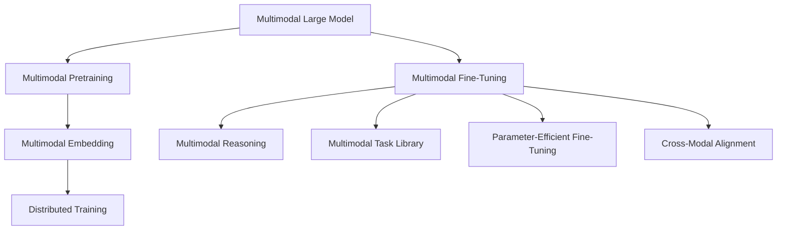
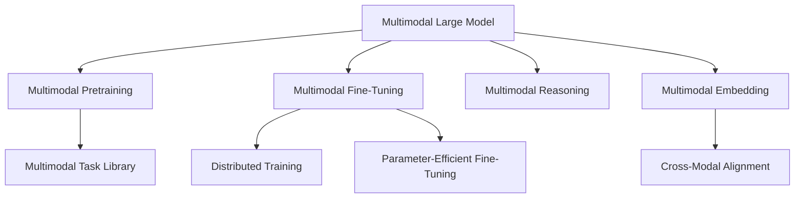
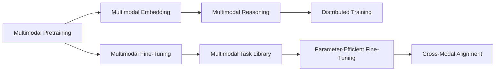
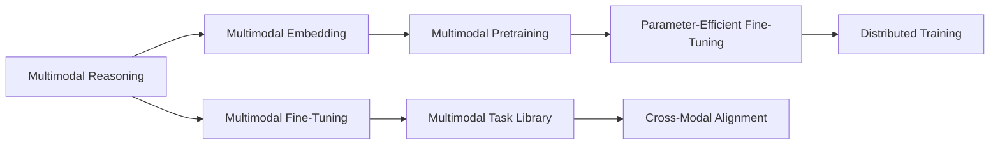
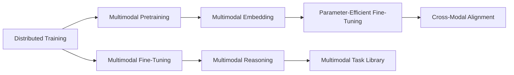
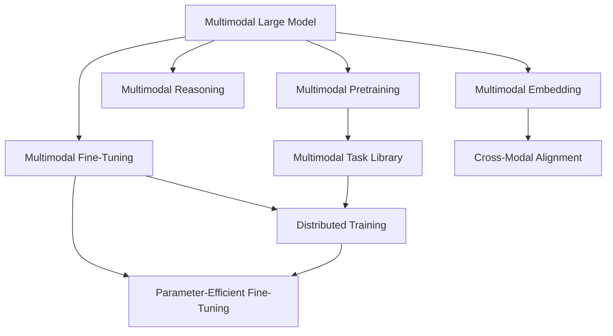

                 

# 多模态大模型：技术原理与实战 OpenAI成功的因素

> 关键词：多模态大模型,多模态预训练,技术原理,实战案例,OpenAI成功因素

## 1. 背景介绍

### 1.1 问题由来
近年来，随着深度学习技术的快速发展，人工智能在多模态学习（Multimodal Learning）领域取得了显著进展。多模态学习是指同时考虑文本、图像、语音等多种数据类型的学习方式，它能够更好地理解和建模现实世界的复杂性。在多模态数据上训练的大模型（如DALL-E、DETR、CLIP等），展示了强大的跨模态推理能力，引发了学界和工业界的广泛关注。

OpenAI作为多模态大模型的先驱，通过开发DALL-E、DETR、CLIP等突破性模型，在多个跨模态任务上取得了领先的成绩，成为了多模态学习的标杆。因此，探讨OpenAI成功的因素，对于深入理解多模态大模型的技术原理和实际应用具有重要意义。

### 1.2 问题核心关键点
OpenAI在多模态大模型的成功，主要得益于以下几个核心关键点：
1. **高效的多模态预训练**：通过联合训练文本和图像等多种数据模态，构建多模态大模型，获得跨模态的语义理解和生成能力。
2. **灵活的微调策略**：针对不同任务，采用高效的微调策略，在少量数据上快速适应新任务。
3. **参数高效的多模态微调**：在固定大部分预训练参数的情况下，仅微调顶层任务相关的参数，提高微调效率。
4. **跨模态推理框架**：开发高效的多模态推理框架，使得模型能够灵活地处理不同模态的数据。
5. **分布式训练**：通过大规模分布式训练，加速模型收敛，提高模型性能。
6. **多模态任务库**：构建丰富多样的多模态任务库，提供完善的测试集和评估指标，促进模型性能的验证和提升。

这些关键点共同构成了OpenAI多模态大模型成功的技术基石，其背后涉及深度的模型设计、高效的训练策略以及广泛的应用场景。

### 1.3 问题研究意义
探讨OpenAI在多模态大模型领域的成功因素，对于推动多模态学习技术的普及应用，提升人工智能系统的性能，具有重要的理论意义和实际价值：

1. **理论创新**：通过剖析OpenAI的成功案例，可以揭示多模态大模型的关键技术原理和设计思想，为未来研究提供理论借鉴。
2. **实践指导**：借鉴OpenAI的多模态学习经验，可以为研究人员和开发者提供具体的技术实践路径，提升模型训练和部署的效率。
3. **应用拓展**：通过理解OpenAI的多模态模型，可以拓展其在更多场景中的应用，如智慧医疗、智能教育、智慧城市等，推动人工智能技术的广泛落地。
4. **产业发展**：OpenAI的成功案例展示了多模态学习在实际产业中的应用潜力，对于促进人工智能技术商业化，推动产业升级具有重要意义。

## 2. 核心概念与联系

### 2.1 核心概念概述

为更好地理解OpenAI在多模态大模型领域的成功，本节将介绍几个关键概念：

- **多模态大模型（Multimodal Large Model, MLM）**：指同时考虑文本、图像、语音等多种数据类型进行预训练的通用大模型。通过多模态预训练，模型能够更好地理解和生成跨模态的语义信息。

- **多模态预训练（Multimodal Pretraining）**：指在多模态数据上，通过自监督学习任务训练通用多模态模型。常见的多模态预训练任务包括文本-图像匹配、视觉-文本推理等。

- **多模态微调（Multimodal Fine-Tuning）**：指在多模态预训练模型的基础上，使用下游任务的少量标注数据，通过有监督学习优化模型在该任务上的性能。通常只需要调整顶层分类器或解码器，并以较小的学习率更新全部或部分的模型参数。

- **多模态推理（Multimodal Reasoning）**：指模型能够同时处理和融合不同模态的数据，进行联合推理和决策。通常采用注意力机制、跨模态对齐等技术实现。

- **多模态嵌入（Multimodal Embedding）**：指通过多模态预训练，为不同模态的数据创建统一的语义表示，使得模型能够对跨模态数据进行更加准确的理解和生成。

- **多模态任务库（Multimodal Task Library）**：指用于测试和评估多模态模型的数据集和评估指标。通常包含各种常见的多模态任务，如视觉问答、图像描述生成等。

- **分布式训练（Distributed Training）**：指通过多个计算节点的协同工作，加速模型训练过程。在多模态大模型中，分布式训练能够有效应对大规模模型的高计算需求。

- **参数高效微调（Parameter-Efficient Fine-Tuning, PEFT）**：指在微调过程中，只更新少量的模型参数，而固定大部分预训练权重不变，以提高微调效率。

- **跨模态对齐（Cross-Modal Alignment）**：指通过多模态预训练，为不同模态的数据创建统一的语义表示，使得模型能够对跨模态数据进行更加准确的理解和生成。

这些核心概念之间的逻辑关系可以通过以下Mermaid流程图来展示：



这个流程图展示了大模型、预训练、微调、推理、嵌入、任务库、分布式训练、参数高效微调和跨模态对齐等核心概念之间的关系：

1. 大模型通过多模态预训练获得跨模态的语义理解和生成能力。
2. 微调使得模型能够适应特定任务，提高性能。
3. 推理框架使得模型能够联合处理不同模态的数据。
4. 嵌入技术为不同模态的数据创建统一的语义表示。
5. 任务库提供多种多模态任务，促进模型性能的验证和提升。
6. 分布式训练加速模型训练过程。
7. 参数高效微调提高微调效率。
8. 跨模态对齐技术实现不同模态数据的联合理解。

### 2.2 概念间的关系

这些核心概念之间存在着紧密的联系，形成了多模态大模型的完整生态系统。下面我们通过几个Mermaid流程图来展示这些概念之间的关系。

#### 2.2.1 多模态大模型的学习范式



这个流程图展示了大模型、预训练、微调、推理、嵌入、任务库、分布式训练、参数高效微调和跨模态对齐等概念之间的关系：

1. 大模型通过多模态预训练获得跨模态的语义理解和生成能力。
2. 微调使得模型能够适应特定任务，提高性能。
3. 推理框架使得模型能够联合处理不同模态的数据。
4. 嵌入技术为不同模态的数据创建统一的语义表示。
5. 任务库提供多种多模态任务，促进模型性能的验证和提升。
6. 分布式训练加速模型训练过程。
7. 参数高效微调提高微调效率。
8. 跨模态对齐技术实现不同模态数据的联合理解。

#### 2.2.2 多模态预训练与微调的关系



这个流程图展示了预训练、微调、嵌入、推理、任务库、分布式训练、参数高效微调和跨模态对齐等概念之间的关系：

1. 预训练使得模型学习到跨模态的语义表示。
2. 微调通过少量标注数据优化模型性能。
3. 嵌入技术为不同模态的数据创建统一的语义表示。
4. 推理框架使得模型能够联合处理不同模态的数据。
5. 任务库提供多种多模态任务，促进模型性能的验证和提升。
6. 分布式训练加速模型训练过程。
7. 参数高效微调提高微调效率。
8. 跨模态对齐技术实现不同模态数据的联合理解。

#### 2.2.3 多模态推理与微调的关系



这个流程图展示了推理、预训练、嵌入、微调、任务库、分布式训练、参数高效微调和跨模态对齐等概念之间的关系：

1. 推理框架使得模型能够联合处理不同模态的数据。
2. 预训练使得模型学习到跨模态的语义表示。
3. 嵌入技术为不同模态的数据创建统一的语义表示。
4. 微调通过少量标注数据优化模型性能。
5. 任务库提供多种多模态任务，促进模型性能的验证和提升。
6. 分布式训练加速模型训练过程。
7. 参数高效微调提高微调效率。
8. 跨模态对齐技术实现不同模态数据的联合理解。

#### 2.2.4 分布式训练与微调的关系



这个流程图展示了分布式训练、预训练、嵌入、推理、微调、任务库、参数高效微调和跨模态对齐等概念之间的关系：

1. 分布式训练加速模型训练过程。
2. 预训练使得模型学习到跨模态的语义表示。
3. 嵌入技术为不同模态的数据创建统一的语义表示。
4. 推理框架使得模型能够联合处理不同模态的数据。
5. 微调通过少量标注数据优化模型性能。
6. 参数高效微调提高微调效率。
7. 跨模态对齐技术实现不同模态数据的联合理解。

### 2.3 核心概念的整体架构

最后，我们用一个综合的流程图来展示这些核心概念在大模型微调过程中的整体架构：



这个综合流程图展示了从预训练到微调，再到推理和嵌入的整体过程。多模态大模型首先在大规模多模态数据上进行预训练，然后通过微调（包括全参数微调和参数高效微调）或推理框架，使模型能够适应特定任务，并在推理框架中处理不同模态的数据。在推理框架中，嵌入技术为不同模态的数据创建统一的语义表示，实现跨模态的联合理解。通过这些流程图，我们可以更清晰地理解多模态大模型的学习过程和关键组件之间的关系。

## 3. 核心算法原理 & 具体操作步骤
### 3.1 算法原理概述

基于多模态大模型的微调方法，本质上是一个联合训练过程。其核心思想是：将预训练的多模态大模型作为初始化参数，通过有监督地联合训练不同模态的数据，使得模型能够适应特定任务，并在推理时联合处理不同模态的数据。

形式化地，假设预训练的多模态大模型为 $M_{\theta}$，其中 $\theta$ 为多模态预训练得到的模型参数。给定下游任务 $T$ 的少量标注数据集 $D=\{(x_i, y_i)\}_{i=1}^N$，其中 $x_i$ 包含文本、图像、语音等多种模态的数据，$y_i$ 为任务标签。微调的目标是找到新的模型参数 $\hat{\theta}$，使得：

$$
\hat{\theta}=\mathop{\arg\min}_{\theta} \mathcal{L}(M_{\theta},D)
$$

其中 $\mathcal{L}$ 为针对任务 $T$ 设计的损失函数，用于衡量模型预测输出与真实标签之间的差异。常见的损失函数包括交叉熵损失、均方误差损失等。

通过梯度下降等优化算法，微调过程不断更新模型参数 $\theta$，最小化损失函数 $\mathcal{L}$，使得模型输出逼近真实标签。由于 $\theta$ 已经通过预训练获得了较好的初始化，因此即便在少量数据集 $D$ 上进行微调，也能较快收敛到理想的模型参数 $\hat{\theta}$。

### 3.2 算法步骤详解

基于多模态大模型的微调一般包括以下几个关键步骤：

**Step 1: 准备预训练模型和数据集**
- 选择合适的预训练多模态大模型 $M_{\theta}$ 作为初始化参数，如 CLIP、DETR 等。
- 准备下游任务 $T$ 的少量标注数据集 $D$，划分为训练集、验证集和测试集。一般要求标注数据与预训练数据的分布不要差异过大。

**Step 2: 添加任务适配层**
- 根据任务类型，在预训练多模态大模型顶层设计合适的输出层和损失函数。
- 对于分类任务，通常在顶层添加线性分类器和交叉熵损失函数。
- 对于生成任务，通常使用语言模型的解码器输出概率分布，并以负对数似然为损失函数。

**Step 3: 设置微调超参数**
- 选择合适的优化算法及其参数，如 AdamW、SGD 等，设置学习率、批大小、迭代轮数等。
- 设置正则化技术及强度，包括权重衰减、Dropout、Early Stopping 等。
- 确定冻结预训练参数的策略，如仅微调顶层，或全部参数都参与微调。

**Step 4: 执行梯度训练**
- 将训练集数据分批次输入模型，前向传播计算损失函数。
- 反向传播计算参数梯度，根据设定的优化算法和学习率更新模型参数。
- 周期性在验证集上评估模型性能，根据性能指标决定是否触发 Early Stopping。
- 重复上述步骤直到满足预设的迭代轮数或 Early Stopping 条件。

**Step 5: 测试和部署**
- 在测试集上评估微调后模型 $M_{\hat{\theta}}$ 的性能，对比微调前后的精度提升。
- 使用微调后的模型对新样本进行推理预测，集成到实际的应用系统中。
- 持续收集新的数据，定期重新微调模型，以适应数据分布的变化。

以上是基于多模态大模型的微调流程。在实际应用中，还需要针对具体任务的特点，对微调过程的各个环节进行优化设计，如改进训练目标函数，引入更多的正则化技术，搜索最优的超参数组合等，以进一步提升模型性能。

### 3.3 算法优缺点

基于多模态大模型的微调方法具有以下优点：
1. 简单高效。只需准备少量标注数据，即可对预训练模型进行快速适配，获得较大的性能提升。
2. 通用适用。适用于各种多模态下游任务，包括分类、匹配、生成等，设计简单的任务适配层即可实现微调。
3. 参数高效。利用参数高效微调技术，在固定大部分预训练参数的情况下，仍可取得不错的提升。
4. 效果显著。在学术界和工业界的诸多任务上，基于微调的方法已经刷新了最先进的性能指标。

同时，该方法也存在一定的局限性：
1. 依赖标注数据。微调的效果很大程度上取决于标注数据的质量和数量，获取高质量标注数据的成本较高。
2. 迁移能力有限。当目标任务与预训练数据的分布差异较大时，微调的性能提升有限。
3. 负面效果传递。预训练模型的固有偏见、有害信息等，可能通过微调传递到下游任务，造成负面影响。
4. 可解释性不足。微调模型的决策过程通常缺乏可解释性，难以对其推理逻辑进行分析和调试。

尽管存在这些局限性，但就目前而言，基于多模态大模型的微调方法仍是大模型应用的最主流范式。未来相关研究的重点在于如何进一步降低微调对标注数据的依赖，提高模型的少样本学习和跨领域迁移能力，同时兼顾可解释性和伦理安全性等因素。

### 3.4 算法应用领域

基于大模型微调的监督学习方法，在多模态领域已经得到了广泛的应用，覆盖了几乎所有常见任务，例如：

- 多模态分类：如文本图像分类、视觉关系分类等。通过微调使模型学习文本-图像映射。
- 多模态生成：如文本图像生成、图像描述生成等。通过微调使模型学习跨模态的生成能力。
- 多模态问答系统：对自然语言问题给出多模态回答。将问题-答案对作为微调数据，训练模型学习匹配答案。
- 多模态推荐系统：推荐系统中的多模态数据融合，如用户画像、产品属性等。通过微调使模型学习联合表示。
- 多模态情感分析：分析多模态数据中的情感信息。通过微调使模型学习跨模态的情感表示。
- 多模态对话系统：使机器能够多模态地进行对话。将多轮对话历史作为上下文，微调模型进行回复生成。

除了上述这些经典任务外，多模态微调也被创新性地应用到更多场景中，如跨模态检索、多模态摘要、多模态可视化等，为多模态技术带来了全新的突破。随着预训练模型和微调方法的不断进步，相信多模态技术将在更广阔的应用领域大放异彩。

## 4. 数学模型和公式 & 详细讲解 & 举例说明
### 4.1 数学模型构建

本节将使用数学语言对基于多模态大模型的微调过程进行更加严格的刻画。

记预训练多模态大模型为 $M_{\theta}:\mathcal{X} \times \mathcal{Y} \rightarrow \mathcal{Z}$，其中 $\mathcal{X}$ 和 $\mathcal{Y}$ 分别为输入和输出模态的数据空间，$\mathcal{Z}$ 为输出模态的语义空间，$\theta \in \mathbb{R}^d$ 为模型参数。假设微调任务的训练集为 $D=\{(x_i, y_i)\}_{i=1}^N, x_i \in \mathcal{X} \times \mathcal{Y}$，其中 $x_i$ 包含文本、图像、语音等多种模态的数据，$y_i \in \mathcal{Z}$ 为任务标签。

定义模型 $M_{\theta}$ 在数据样本 $(x,y)$ 上的损失函数为 $\ell(M_{\theta}(x),y)$，则在数据集 $D$ 上的经验风险为：

$$
\mathcal{L}(\theta) = \frac{1}{N} \sum_{i=1}^N \ell(M_{\theta}(x_i),y_i)
$$

其中 $\ell$ 为针对任务 $T$ 设计的损失函数，用于衡量模型预测输出与真实标签之间的差异。常见的损失函数包括交叉熵损失、均方误差损失等。

微调的优化目标是最小化经验风险，即找到最优参数：

$$
\theta^* = \mathop{\arg\min}_{\theta} \mathcal{L}(\theta)
$$

在实践中，我们通常使用基于梯度的优化算法（如SGD、Adam等）来近似求解上述最优化问题。设 $\eta$ 为学习率，$\lambda$ 为正则化系数，则参数的更新公式为：

$$
\theta \leftarrow \theta - \eta \nabla_{\theta}\mathcal{L}(\theta) - \eta\lambda\theta
$$

其中 $\nabla_{\theta}\mathcal{L}(\theta)$ 为损失函数对参数 $\theta$ 的梯度，可通过反向传播算法高效计算。

### 4.2 公式推导过程

以下我们以多模态分类任务为例，推导交叉熵损失函数及其梯度的计算公式。

假设模型 $M_{\theta}$ 在输入 $x$ 上的输出为 $\hat{y}=M_{\theta}(x) \in \mathbb{R}^C$，表示样本属于 $C$ 个类别的概率。真实标签 $y \in \{1,2,...,C\}$。则交叉熵损失函数定义为：

$$
\ell(M_{\theta}(x),y) = -\sum_{c=1}^C y_c\log \hat{y}_c
$$

将其代入经验风险公式，得：

$$
\mathcal{L}(\theta) = -\frac{1}{N}\sum_{i=1}^N \sum_{c=1}^C y_{ic}\log \hat{y}_{ic}
$$

根据链式法则，损失函数对参数 $\theta_k$ 的梯度为：

$$
\frac{\partial \mathcal{L}(\theta)}{\partial \theta_k} = -\frac{1}{N}\sum_{i=1}^N \sum_{c=1}^C (\frac{y_{ic}}{\hat{y}_{ic}}-\frac{1-y_{ic}}{1-\hat{y}_{ic}}) \frac{\partial \hat{y}_{ic}}{\partial \theta_k}
$$

其中 $\frac{\partial \hat{y}_{ic}}{\partial \theta_k}$ 可进一步递归展开，利用自动微分技术完成计算。

在得到损失函数的梯度后，即可带入参数更新公式，完成模型的迭代优化。重复上述过程直至收敛，最终得到适应下游任务的最优模型参数 $\theta^*$。

## 5. 项目实践：代码实例和详细解释说明
### 5.1 开发环境搭建

在进行多模态大模型微调实践前，我们需要准备好开发环境。以下是使用Python进行PyTorch开发的环境配置流程：

1. 安装Anaconda：从官网下载并安装Anaconda，用于创建独立的Python环境。

2. 创建并激活虚拟环境：
```bash
conda create -n pytorch-env python=3.8 
conda activate pytorch-env
```

3. 安装PyTorch：根据CUDA版本，从官网获取对应的安装命令。例如：
```bash
conda install pytorch torchvision torchaudio cudatoolkit=11.1 -c pytorch -c conda-forge
```

4. 安装Transformers库：
```bash
pip install transformers
```

5. 安装各类工具包：
```bash
pip install numpy pandas scikit-learn matplotlib tqdm jupyter notebook ipython
```

完成上述步骤后，即可在`pytorch-env`环境中开始多模态大模型微调的实践。

### 5.2 源代码详细实现

这里我们以CLIP模型为例，给出使用Transformers库对CLIP模型进行多模态分类任务微调的PyTorch代码实现。

首先，定义多模态分类任务的训练数据处理函数：

```python
from transformers import CLIPTextModel, CLIPVisionModel
from torch.utils.data import Dataset
import torch

class MultiModalDataset(Dataset):
    def __init__(self, texts, images, labels):
        self.texts = texts
        self.images = images
        self.labels = labels
        
    def __len__(self):
        return len(self.texts)
    
    def __getitem__(self, item):
        text = self.texts[item]
        image = self.images[item]
        label = self.labels[item]
        
        encoding = CLIPTextModel.from_pretrained('openai/clip-vit-large-patch14')(text)
        vision_encoding = CLIPVisionModel.from_pretrained('openai/clip-vit-large-patch14')(image)
        
        # 拼接文本和图像的编码向量
        x = torch.cat((encoding, vision_encoding), dim=1)
        return {'input_ids': x, 'labels': torch.tensor

