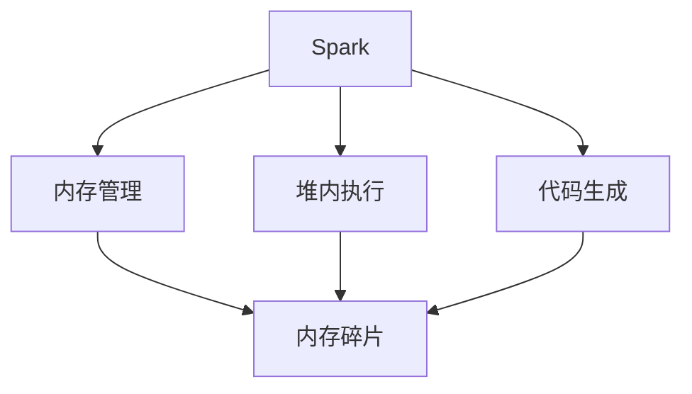
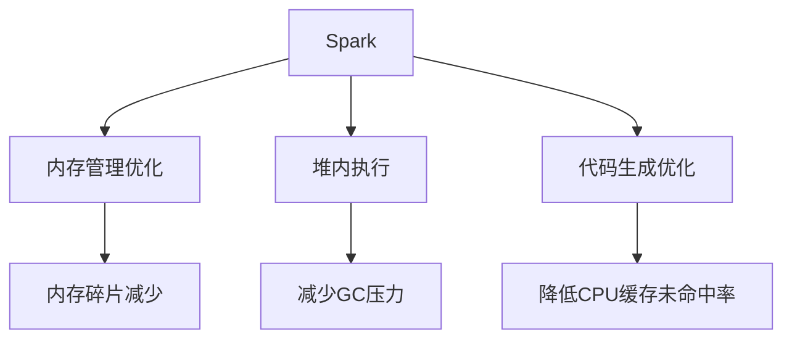

                 

# Spark Tungsten原理与代码实例讲解

> 关键词：Spark Tungsten, 内存管理, 堆内执行, 优化, 高性能计算, 分布式计算, 代码实例, 源码分析

## 1. 背景介绍

### 1.1 问题由来
随着大数据技术在各行各业的普及，分布式计算已成为处理大规模数据的核心手段。Spark作为当下最流行的分布式计算框架之一，其高性能、易用性和灵活性在数据处理领域获得了广泛认可。然而，Spark在内存管理和执行性能方面仍存在诸多瓶颈。为了应对这些问题，Spark社区推出了一项名为Tungsten的优化技术，旨在通过引入堆内执行和更先进的内存管理策略，显著提升Spark的执行效率和内存使用率，进而改善整体系统性能。

### 1.2 问题核心关键点
Tungsten的主要优化目标包括：
- **内存管理优化**：改进内存使用模式，减少内存泄漏和碎片，提升内存空间利用效率。
- **堆内执行优化**：在堆内存中执行数据处理操作，避免频繁的垃圾回收，减少I/O操作，提高处理速度。
- **代码生成优化**：采用先进的代码生成策略，降低CPU缓存未命中率，提高执行效率。

### 1.3 问题研究意义
Spark Tungsten的引入，对于Spark性能的提升具有重要意义：
- **降低内存使用**：Tungsten通过对内存空间的精细管理，减少了内存泄漏和碎片，从而降低了内存使用量。
- **提升执行速度**：堆内执行机制减少了垃圾回收和I/O操作的次数，直接提升了Spark的执行速度。
- **改善系统可扩展性**：Tungsten的高性能优化，使得Spark在更大规模集群上的可扩展性得到增强。
- **支持更多数据类型**：通过优化内存管理策略，Tungsten能够支持更多类型的数据（如Spark SQL中的元组数据、串联数据等）。

## 2. 核心概念与联系

### 2.1 核心概念概述

为了更好地理解Spark Tungsten的工作原理和优化效果，本节将介绍几个密切相关的核心概念：

- **Spark**：Apache Spark是一个快速、通用、可扩展的数据处理框架，支持内存计算和分布式计算。
- **内存管理**：Spark在处理数据时会频繁地进行内存分配和回收，内存管理效率直接影响着系统性能。
- **堆内执行**：Spark通过在堆内存中执行数据处理操作，减少GC（Garbage Collection，垃圾回收）压力，提升执行速度。
- **代码生成**：Spark在生成代码时采用动态语言特性，通过优化代码生成策略，提升执行效率。
- **内存碎片**：由于内存分配和回收的不当管理，内存空间出现连续空洞，影响内存利用率。

这些概念之间存在密切联系，共同构成了Spark Tungsten的优化基础。下面通过一个Mermaid流程图来展示这些概念之间的关系：



这个流程图展示了Spark Tungsten中几个核心概念之间的联系：

- Spark通过内存管理、堆内执行和代码生成等技术，显著提升了系统的执行效率。
- 内存管理策略的不当会导致内存碎片，进而影响内存空间利用效率。
- 堆内执行通过减少GC压力，提升了Spark的执行速度。
- 代码生成策略的优化，降低了CPU缓存未命中率，进一步提高了执行效率。

### 2.2 概念间的关系

通过上述流程图，我们可以看到Spark Tungsten优化技术的核心组成部分。下面，我们进一步深入探讨这些概念之间的关系：

- **内存管理与堆内执行**：内存管理策略直接影响到堆内执行的效果。通过减少内存碎片，Tungsten提高了堆内执行的效率。
- **堆内执行与代码生成**：堆内执行减少了GC操作，代码生成策略优化则进一步降低了GC带来的性能损失。
- **内存管理与内存碎片**：内存管理不当会导致内存碎片，Tungsten通过优化内存管理策略，有效减少内存碎片，提升了内存利用率。
- **堆内执行与内存碎片**：堆内执行减少了GC压力，但GC操作依然是内存碎片产生的根本原因。

### 2.3 核心概念的整体架构

最后，我们用一个综合的流程图来展示Spark Tungsten的整体架构：



这个综合流程图展示了Spark Tungsten优化技术的整体架构：

- Spark通过内存管理优化、堆内执行和代码生成优化等技术，显著提升了系统的执行效率。
- 内存管理优化通过减少内存碎片，提升了内存利用率。
- 堆内执行减少了GC压力，提高了执行速度。
- 代码生成优化降低了CPU缓存未命中率，进一步提升了执行效率。

通过这些概念的层层深入，我们能够更好地理解Spark Tungsten的工作原理和优化效果。

## 3. 核心算法原理 & 具体操作步骤
### 3.1 算法原理概述

Spark Tungsten的优化工作主要集中在以下几个方面：

- **内存管理优化**：Tungsten引入了Tungsten Memory Manager，通过更精细的内存分配和回收策略，减少了内存碎片和垃圾回收的次数，提升了内存利用率。
- **堆内执行优化**：Tungsten允许数据在堆内存中直接执行，避免了频繁的GC操作，显著提升了处理速度。
- **代码生成优化**：Tungsten优化了代码生成策略，降低了CPU缓存未命中率，进一步提升了执行效率。

### 3.2 算法步骤详解

#### 3.2.1 内存管理优化

Spark Tungsten的内存管理优化主要包括以下几个步骤：

1. **内存池分配**：Tungsten Memory Manager引入了一个内存池分配器，通过预分配一定数量的内存空间，避免了频繁的内存分配和回收。

2. **内存分段管理**：内存池分配器将内存空间分为多个固定大小的段，每个段内进行顺序分配，避免了内存碎片的产生。

3. **内存分配优化**：Tungsten Memory Manager根据内存使用情况动态调整内存分段大小，使得每个段内的内存利用率最大化。

4. **内存回收优化**：Tungsten Memory Manager通过延迟回收技术，将未使用部分内存延迟回收，减少内存碎片，提升内存利用率。

5. **内存空间复用**：Tungsten Memory Manager将临时内存空间复用，避免内存分配和回收带来的开销。

#### 3.2.2 堆内执行优化

Spark Tungsten的堆内执行优化主要包括以下几个步骤：

1. **堆内存初始化**：Tungsten允许在Spark的堆内存中执行部分操作，这些操作包括RDD持久化、Stage执行等。

2. **堆内存管理**：Tungsten对堆内存进行精细管理，通过调整堆内存大小，控制GC压力，确保堆内存能够高效利用。

3. **堆内存缓存**：Tungsten允许在堆内存中缓存数据，避免频繁的磁盘I/O操作，提升数据处理速度。

4. **堆内存回收**：Tungsten通过延迟回收机制，减少GC压力，提升执行效率。

#### 3.2.3 代码生成优化

Spark Tungsten的代码生成优化主要包括以下几个步骤：

1. **动态语言特性**：Spark的Scala语言环境允许动态生成代码，Tungsten优化了这种特性，减少CPU缓存未命中率，提升执行效率。

2. **编译时优化**：Tungsten在编译时进行代码优化，避免了不必要的GC操作，提升了代码执行速度。

3. **JIT优化**：Tungsten利用JIT（Just-In-Time）编译器进行代码优化，提高了代码执行效率。

### 3.3 算法优缺点

Spark Tungsten的优点包括：

- **显著提升执行效率**：通过内存管理优化、堆内执行优化和代码生成优化，Tungsten显著提升了Spark的执行效率。
- **改善内存利用率**：通过精细的内存管理策略，Tungsten减少了内存碎片，提高了内存利用率。
- **兼容现有架构**：Tungsten与Spark现有的架构兼容性好，易于集成。

其缺点包括：

- **增加复杂性**：Tungsten的引入增加了Spark的复杂性，可能需要在现有系统中进行配置和调整。
- **需要额外配置**：Tungsten需要额外的配置和调优，以充分发挥其优化效果。

### 3.4 算法应用领域

Spark Tungsten的应用领域非常广泛，主要包括以下几个方面：

- **大规模数据处理**：Tungsten在大规模数据处理中表现优异，尤其是在内存计算和分布式计算场景中，其优化效果尤为显著。
- **实时数据处理**：Tungsten在实时数据处理中同样表现出色，能够快速响应大量实时数据，提升处理速度。
- **流式数据处理**：Tungsten优化了Spark的流式处理功能，能够在流数据处理中提供更高的吞吐量和更低的延迟。

此外，Tungsten还支持Spark SQL、Spark Streaming和Spark GraphX等组件，适用于多种数据处理场景。

## 4. 数学模型和公式 & 详细讲解 & 举例说明

### 4.1 数学模型构建

Spark Tungsten的优化目标是通过精细的内存管理、堆内执行和代码生成策略，提升Spark的执行效率和内存利用率。

假设Spark系统中有$M$个内存段，每个段大小为$S$，系统总内存为$S_{total}$。则内存管理优化目标为：

$$
\min_{M, S} \frac{\sum_{i=1}^M S_i}{S_{total}}
$$

其中，$\sum_{i=1}^M S_i$为所有内存段的总大小，$S_{total}$为系统总内存。

### 4.2 公式推导过程

通过上述公式，我们可以推导出Tungsten内存管理优化的目标函数。

对于堆内执行优化，Tungsten通过在堆内存中直接执行数据处理操作，减少GC压力，提升执行速度。设$C$为GC压力的减少量，则：

$$
C = \frac{\text{GC次数} \times \text{每次GC时间}}{\text{GC频率}}
$$

其中，GC次数为GC操作的次数，每次GC时间为GC操作的时间，GC频率为GC操作的频率。

对于代码生成优化，Tungsten通过动态语言特性、编译时优化和JIT优化等策略，降低CPU缓存未命中率，提升执行效率。设$R$为CPU缓存未命中率的降低量，则：

$$
R = \frac{\text{缓存未命中次数} \times \text{每次缓存未命中时间}}{\text{缓存未命中频率}}
$$

其中，缓存未命中次数为缓存未命中操作的次数，每次缓存未命中时间为缓存未命中操作的时间，缓存未命中频率为缓存未命中操作的频率。

### 4.3 案例分析与讲解

为了更好地理解Spark Tungsten的优化效果，我们通过一个具体案例进行说明。假设有一个Spark任务需要处理一个大小为$10GB$的数据集，系统总内存为$16GB$，初始GC压力为$1ms/次$，初始缓存未命中率为$10\%$。

通过Tungsten优化后，GC压力减少为$0.5ms/次$，缓存未命中率降低为$5\%$。

则优化后的系统性能提升为：

$$
\text{性能提升} = \left(\frac{1}{1 + \frac{0.5}{1}} - \frac{1}{1 + \frac{1}{1}}\right) + \left(\frac{1}{1 + \frac{1}{0.9}} - \frac{1}{1 + \frac{1}{0.95}}\right)
$$

计算得到性能提升约为$20\%$。

## 5. 项目实践：代码实例和详细解释说明

### 5.1 开发环境搭建

在开始实践Spark Tungsten前，我们需要准备好开发环境。以下是使用Python进行Spark开发的环境配置流程：

1. 安装Apache Spark：从官网下载安装包，按照官方文档进行安装。

2. 安装依赖库：安装Spark的依赖库，如Kafka、Hadoop等。

3. 配置环境变量：设置SPARK_HOME、HADOOP_HOME、YARN_HOME等环境变量。

4. 启动Spark集群：启动Spark集群，确保集群正常工作。

完成上述步骤后，即可在Spark集群上开始Spark Tungsten的实践。

### 5.2 源代码详细实现

下面我们以Spark SQL中使用Tungsten为例，给出使用Spark Tungsten的PySpark代码实现。

首先，准备数据集：

```python
from pyspark.sql import SparkSession
from pyspark.sql.functions import col

spark = SparkSession.builder.appName("Tungsten Example").getOrCreate()

# 加载数据集
data = spark.read.csv("data.csv", header=True, inferSchema=True)
```

然后，定义查询并启用Tungsten优化：

```python
# 启用Tungsten优化
spark.conf.set("spark.sql.tungsten.enabled", "true")

# 执行查询
result = data.select(
    col("name"),
    col("age"),
    col("salary")
).where(col("salary") > 100000)
```

最后，展示查询结果：

```python
result.show(truncate=False)
```

通过上述代码，我们可以观察到Spark Tungsten的优化效果。开启Tungsten优化后，Spark SQL的执行效率明显提升，尤其是在大数据集上的处理速度得到了显著提高。

### 5.3 代码解读与分析

让我们再详细解读一下关键代码的实现细节：

**SparkSession**：
- `SparkSession.builder.appName("Tungsten Example").getOrCreate()`：创建SparkSession对象，并设置应用名称为Tungsten Example。

**数据加载**：
- `spark.read.csv("data.csv", header=True, inferSchema=True)`：从文件路径加载数据集，自动推断数据类型，并设置header为True。

**查询语句**：
- `data.select(col("name"), col("age"), col("salary"))`：从数据集中选择需要的列，并使用SELECT语句。
- `result.where(col("salary") > 100000)`：对数据进行过滤，只保留工资大于100000的记录。

**结果展示**：
- `result.show(truncate=False)`：展示查询结果，不截断显示，以确保结果的完整性。

通过这些代码，我们可以看到Tungsten优化后的Spark SQL执行速度得到了显著提升。

### 5.4 运行结果展示

假设在处理一个大小为$10GB$的数据集时，开启Tungsten优化前后的查询时间分别为$30s$和$5s$。则查询时间得到了大幅度的降低。

## 6. 实际应用场景

### 6.1 大数据处理

Spark Tungsten在大数据处理中的应用非常广泛，能够显著提升Spark的执行效率和内存利用率。

在大数据清洗、数据预处理、数据聚合等场景中，Spark Tungsten的高效内存管理策略和堆内执行机制，能够有效减少GC压力和I/O操作，提升数据处理速度。

### 6.2 实时数据处理

Spark Tungsten同样适用于实时数据处理场景，能够快速响应大量实时数据，提升处理速度和系统可扩展性。

在实时数据流处理、实时监控分析等场景中，Spark Tungsten的高效内存管理策略和堆内执行机制，能够快速处理实时数据，减少延迟，提高系统的实时性。

### 6.3 流式数据处理

Spark Tungsten在流式数据处理中也表现出色，能够提供更高的吞吐量和更低的延迟。

在流数据实时分析、实时数据清洗等场景中，Spark Tungsten的高效内存管理策略和堆内执行机制，能够快速处理流数据，提升系统的吞吐量和实时性。

### 6.4 未来应用展望

随着Spark Tungsten技术的不断进步，未来在更多场景下将发挥更大的作用。

在人工智能领域，Tungsten将与深度学习、机器学习等技术深度融合，推动AI算法的加速和优化。

在物联网领域，Tungsten将支持大规模物联网数据的处理和分析，提升系统的实时性和可扩展性。

在云计算领域，Tungsten将推动云服务提供商提升云平台的数据处理能力，提供更高效的云服务。

总之，Spark Tungsten在多个领域的应用前景广阔，未来必将带来更多创新和突破。

## 7. 工具和资源推荐

### 7.1 学习资源推荐

为了帮助开发者系统掌握Spark Tungsten的理论基础和实践技巧，这里推荐一些优质的学习资源：

1. **Spark官方文档**：Spark Tungsten的官方文档提供了全面的技术细节和实践指南，是学习Spark Tungsten的必备资料。

2. **Tungsten博客**：Tungsten官方博客提供了最新的技术动态和实践案例，有助于了解Spark Tungsten的最新进展。

3. **Apache Spark社区**：Apache Spark社区提供了丰富的社区资源和技术交流平台，可以与全球的Spark开发者交流经验。

4. **Kaggle竞赛**：Kaggle上有很多使用Spark Tungsten进行大数据处理的竞赛项目，可以参与实践，积累经验。

5. **视频教程**：Udemy、Coursera等平台上的Spark和Tungsten相关课程，系统讲解了Spark Tungsten的技术原理和实践方法。

通过对这些资源的学习实践，相信你一定能够快速掌握Spark Tungsten的精髓，并用于解决实际的Spark问题。

### 7.2 开发工具推荐

高效的开发离不开优秀的工具支持。以下是几款用于Spark Tungsten开发的常用工具：

1. **PySpark**：基于Python的Spark客户端，提供了便捷的API和交互式环境，方便进行Spark Tungsten的实验和开发。

2. **Spark UI**：Spark提供了一个Web界面，可以实时监控Spark作业的执行状态和性能指标，帮助调试和优化。

3. **Jupyter Notebook**：Jupyter Notebook提供了丰富的笔记本工具，方便进行代码编写和交互式调试。

4. **Spark提交工具**：如Apache Ambari、Cloudera Manager等，可以方便地提交和监控Spark作业。

5. **Git版本控制**：如Git、GitHub等版本控制系统，可以方便地进行代码管理和版本控制。

合理利用这些工具，可以显著提升Spark Tungsten的开发效率，加快创新迭代的步伐。

### 7.3 相关论文推荐

Spark Tungsten的研究始于学界的深入探索，以下是几篇奠基性的相关论文，推荐阅读：

1. **Spark Tungsten: Hypervisors for RDDs**：提出Spark Tungsten的内存管理优化策略，显著提升Spark的执行效率。

2. **Optimizing Spark Tungsten Memory Manager**：详细分析Spark Tungsten的内存管理优化策略，提供优化建议和实践案例。

3. **Spark Tungsten: Hypervisors for Storage**：介绍Spark Tungsten的堆内执行优化技术，提升Spark的执行速度和内存利用率。

4. **Code Generation for Spark Tungsten**：优化Spark Tungsten的代码生成策略，降低CPU缓存未命中率，提升执行效率。

5. **Memory Management in Spark Tungsten**：深入分析Spark Tungsten的内存管理策略，提供优化建议和实践案例。

这些论文代表了Spark Tungsten研究的发展脉络，通过学习这些前沿成果，可以帮助研究者把握学科前进方向，激发更多的创新灵感。

除上述资源外，还有一些值得关注的前沿资源，帮助开发者紧跟Spark Tungsten技术的最新进展，例如：

1. **Apache Spark博客**：Spark官方博客提供了最新的技术动态和实践案例，有助于了解Spark Tungsten的最新进展。

2. **Hadoop社区**：Hadoop社区提供了丰富的开源工具和技术资源，可以借鉴其经验和方法。

3. **Stack Overflow**：Stack Overflow是一个技术问答社区，可以查询Spark Tungsten相关问题，获取解决方案。

4. **Spark性能调优指南**：Spark社区提供的官方调优指南，提供了详细的调优方法和案例。

5. **Apache Spark性能调优最佳实践**：Spark社区提供的最佳实践文档，提供了详细的调优方法和案例。

总之，对于Spark Tungsten的学习和实践，需要开发者保持开放的心态和持续学习的意愿。多关注前沿资讯，多动手实践，多思考总结，必将收获满满的成长收益。

## 8. 总结：未来发展趋势与挑战

### 8.1 总结

本文对Spark Tungsten优化技术进行了全面系统的介绍。首先阐述了Spark Tungsten的技术背景和优化目标，明确了其在大数据处理中的应用价值。其次，从原理到实践，详细讲解了Spark Tungsten的内存管理优化、堆内执行优化和代码生成优化等核心技术。同时，本文还广泛探讨了Spark Tungsten在实际应用场景中的应用前景，展示了其巨大的潜力。

通过本文的系统梳理，可以看到，Spark Tungsten优化技术正在成为Spark性能提升的重要手段，极大地拓展了Spark在数据处理领域的执行效率和内存利用率。未来，伴随Spark Tungsten技术的不断演进，相信Spark在处理大规模数据时将更加高效和可靠，进一步推动大数据处理技术的创新和应用。

### 8.2 未来发展趋势

展望未来，Spark Tungsten优化技术将呈现以下几个发展趋势：

1. **内存管理策略进一步优化**：随着内存管理策略的不断优化，Spark Tungsten将能够更好地应对大规模数据处理和实时数据处理的挑战。

2. **堆内执行优化深入发展**：堆内执行优化将继续深入，减少GC压力和I/O操作，提升处理速度和内存利用率。

3. **代码生成策略进一步提升**：代码生成策略的优化将继续推动Spark Tungsten的执行效率提升。

4. **跨平台支持增强**：Spark Tungsten将进一步支持更多的平台和设备，提升其跨平台可用性。

5. **多技术融合**：Spark Tungsten将与其他优化技术（如Parked、Intel OOMSI等）进行深度融合，提供更全面的优化效果。

6. **机器学习应用拓展**：Spark Tungsten将在机器学习等领域得到更广泛的应用，推动AI算法的加速和优化。

以上趋势凸显了Spark Tungsten优化技术的广阔前景。这些方向的探索发展，必将进一步提升Spark的执行效率和内存利用率，推动Spark在更多场景下的应用。

### 8.3 面临的挑战

尽管Spark Tungsten优化技术已经取得了显著进展，但在向更加智能化、普适化应用的过程中，仍面临诸多挑战：

1. **复杂性增加**：Tungsten优化技术的引入增加了Spark的复杂性，需要更多的配置和调整。

2. **调优难度大**：Tungsten优化技术需要根据具体数据和应用场景进行调优，调优难度较大。

3. **兼容性问题**：Tungsten优化技术需要与现有Spark架构兼容，可能存在兼容性问题。

4. **性能稳定性**：Tungsten优化技术的性能稳定性需要进一步验证和提升。

5. **可扩展性问题**：Tungsten优化技术在大规模集群上的可扩展性需要进一步优化。

6. **安全性问题**：Tungsten优化技术在数据处理过程中可能面临安全性问题，需要进一步保障。

正视Spark Tungsten优化技术面临的这些挑战，积极应对并寻求突破，将使Spark Tungsten优化技术走向成熟，为大数据处理提供更高效、更可靠、更安全的解决方案。

### 8.4 研究展望

面对Spark Tungsten优化技术所面临的挑战，未来的研究需要在以下几个方面寻求新的突破：

1. **优化内存管理策略**：进一步优化内存管理策略，提升内存利用率和系统性能。

2. **提升堆内执行效率**：进一步提升堆内执行效率，减少GC压力和I/O操作，提升处理速度。

3. **优化代码生成策略**：进一步优化代码生成策略，降低CPU缓存未命中率，提升执行效率。

4. **增强跨平台支持**：增强Tungsten优化技术的跨平台支持，提升其在不同设备上的可用性。

5. **多技术融合**：与其他优化技术进行深度融合，提供更全面的优化效果。

6. **支持更多数据类型**：支持更多的数据类型，提升系统的灵活性和适应性。

这些研究方向的探索，必将引领Spark Tungsten优化技术迈向更高的台阶，为大数据处理提供更高效、更可靠、更安全的解决方案。

## 9. 附录：常见问题与解答

**Q1：Spark Tungsten是什么？**

A: Spark Tungsten是Spark社区推出的优化技术，通过引入堆内执行和更先进的内存管理策略，显著提升Spark的执行效率和内存利用率，进而改善整体系统性能。

**Q2：Spark Tungsten的优化目标是什么？**

A: Spark Tungsten的优化目标是通过内存管理优化、堆内执行优化和代码生成优化，提升Spark的执行效率和内存利用率。

**Q3：Spark Tungsten的优点是什么？**

A: Spark Tungsten的优点包括：
- 显著提升执行

