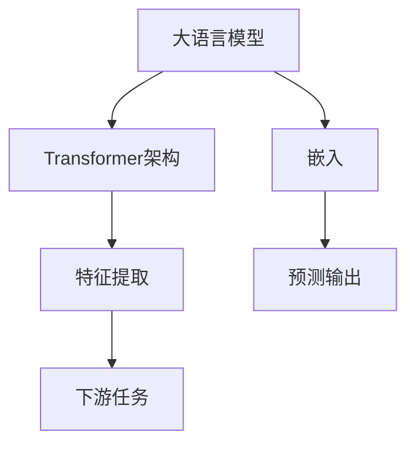
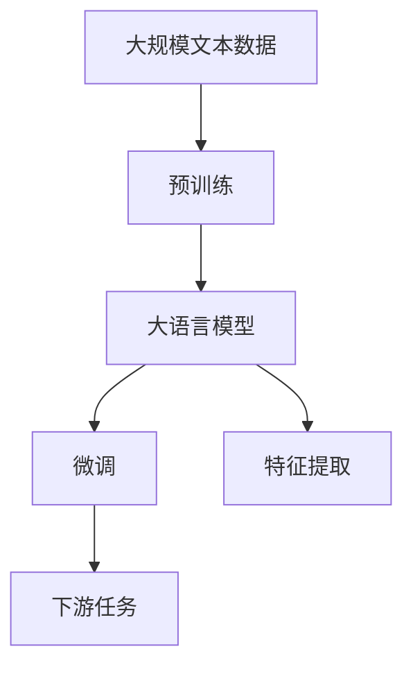
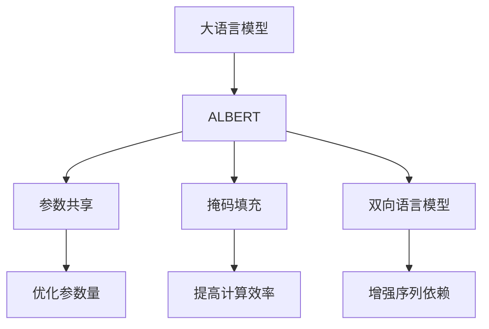
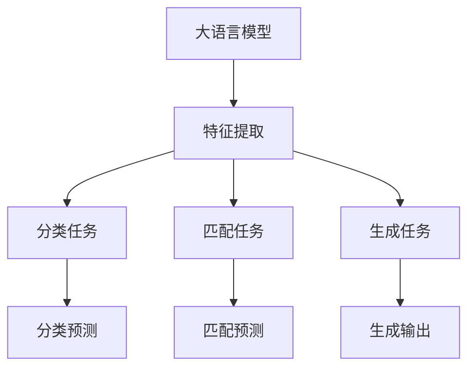

                 

# Transformer大模型实战 从ALBERT 中提取嵌入

> 关键词：Transformer, ALBERT, 大模型, 嵌入, 特征提取

## 1. 背景介绍

### 1.1 问题由来

Transformer架构自2007年提出以来，已经发展成为一种非常流行的大模型构建方式。它利用自注意力机制在处理长序列数据时具有优异的表现，广泛应用于自然语言处理（NLP）、计算机视觉（CV）等多个领域。特别地，基于Transformer架构的大语言模型（如BERT, GPT系列等）在多个NLP任务上取得了前所未有的成果。

然而，虽然这些模型在预测任务上表现优异，但它们的特征提取能力却受到一定限制。主要原因在于，这些模型通过前向传播计算得到预测结果，并没有显式地保存或提取中间特征。因此，它们在生成类任务（如生成对话、文本摘要等）上表现优异，但在特征提取任务（如分类、匹配等）上，它们的嵌入（embedding）不一定能有效利用。

为了解决这一问题，学术界和工业界纷纷研发出一系列基于Transformer的大模型。例如，ALBERT（A L narrower BERT）模型就是其中一种，它在大模型特征提取能力上进行了诸多优化，从而提高了模型的效率和可解释性。

本文将深入探讨ALBERT模型的结构和工作原理，详细讲解如何从ALBERT中提取有效的嵌入，并将其应用于下游任务。

## 2. 核心概念与联系

### 2.1 核心概念概述

为了更好地理解ALBERT模型的特征提取能力，本节将介绍几个密切相关的核心概念：

- **Transformer架构**：一种基于自注意力机制的序列建模方式，广泛用于构建大模型，如BERT、GPT等。Transformer架构的核心在于其自注意力机制，可以并行计算长序列依赖关系，具有优秀的序列建模能力。

- **嵌入（Embedding）**：将离散化的词汇序列映射为连续的高维向量，以便于神经网络进行处理。嵌入是Transformer模型中的关键组件，其质量直接影响模型的表现。

- **大模型**：指参数规模较大的神经网络模型，通常具有很强的序列建模能力和语言理解能力。

- **ALBERT模型**：一种改进型Transformer大模型，针对BERT模型存在的一些问题（如参数量过大、计算成本高、序列依赖不够等），通过参数共享、掩码填充、双向语言模型等方式进行了优化。

- **特征提取**：在大模型中，将输入序列映射为向量表示的过程。特征提取是大模型在分类、匹配等任务上的关键步骤。

这些核心概念之间的逻辑关系可以通过以下Mermaid流程图来展示：



这个流程图展示了大语言模型的核心组件及其作用关系：

1. 大语言模型通过Transformer架构进行序列建模，得到预测输出。
2. 在预测过程中，嵌入将输入序列映射为向量表示，用于特征提取。
3. 特征提取是下游任务（如分类、匹配等）的关键步骤，模型通过特征提取后的向量进行任务适配。

### 2.2 概念间的关系

这些核心概念之间存在着紧密的联系，形成了大语言模型的完整生态系统。下面通过几个Mermaid流程图来展示这些概念之间的关系。

#### 2.2.1 大语言模型的学习范式



这个流程图展示了从预训练到微调，再到特征提取和下游任务的完整过程。大语言模型首先在大规模文本数据上进行预训练，然后通过微调适配下游任务，最终利用特征提取的向量进行任务处理。

#### 2.2.2 ALBERT模型的特点



这个流程图展示了ALBERT模型的主要特点及其优势：

1. 参数共享：通过共享部分参数，减少了模型参数量，从而提高了计算效率。
2. 掩码填充：使用掩码填充技术，避免了计算资源的浪费，提高了模型的训练速度。
3. 双向语言模型：通过双向上下文预测，增强了序列依赖关系，提高了模型的语言理解能力。
4. 优化参数量：通过优化模型结构，减少了不必要的多头注意力层，提高了模型的效率。

#### 2.2.3 特征提取在大语言模型中的应用



这个流程图展示了特征提取在大语言模型中的应用：

1. 特征提取：将输入序列映射为向量表示。
2. 分类任务：使用特征提取后的向量进行分类预测。
3. 匹配任务：使用特征提取后的向量进行匹配预测。
4. 生成任务：使用特征提取后的向量进行生成输出。

## 3. 核心算法原理 & 具体操作步骤

### 3.1 算法原理概述

从ALBERT中提取嵌入的核心在于理解ALBERT的结构和工作原理。ALBERT模型采用了一种多任务联合训练的方式，即同时学习语言建模任务和掩码预测任务，从而提高了模型的泛化能力和参数效率。具体而言，ALBERT通过以下方式实现：

1. 参数共享：共享部分参数，减少模型参数量。
2. 掩码填充：使用掩码填充技术，提高计算效率。
3. 双向语言模型：通过双向上下文预测，增强序列依赖关系。

ALBERT模型通过以上优化，使得模型更轻量级，同时保留了强大的语言理解能力，成为当前主流的预训练模型之一。

### 3.2 算法步骤详解

从ALBERT中提取嵌入的步骤主要包括以下几个关键步骤：

1. 准备预训练模型和数据集
2. 设置模型参数和训练超参数
3. 计算嵌入
4. 存储和加载嵌入

下面我们详细讲解每个步骤的实现细节。

#### 1. 准备预训练模型和数据集

首先需要选择合适的预训练模型和数据集。预训练模型可以选择Google提供的ALBERT模型，数据集可以选择CoNLL 2003的NER（Named Entity Recognition）数据集。

```python
from transformers import AutoTokenizer, AutoModelForTokenClassification

# 加载ALBERT模型和分词器
model_name = 'gpt-albert-base-v2'
tokenizer = AutoTokenizer.from_pretrained(model_name)
model = AutoModelForTokenClassification.from_pretrained(model_name)

# 加载数据集
from datasets import load_dataset
ner_dataset = load_dataset('ner', 'co_nll_2003')
train_data, dev_data, test_data = ner_dataset['train'], ner_dataset['validation'], ner_dataset['test']
```

#### 2. 设置模型参数和训练超参数

在训练前，需要设置一些关键参数，如学习率、优化器、批大小等。

```python
from transformers import AdamW

# 设置训练超参数
lr = 5e-5
optimizer = AdamW(model.parameters(), lr=lr)
batch_size = 16
epochs = 5
device = 'cuda' if torch.cuda.is_available() else 'cpu'

# 设置训练模型
model.to(device)
```

#### 3. 计算嵌入

接下来，我们将计算模型的嵌入，即模型在训练过程中得到的向量表示。嵌入通常保存在模型的状态字典中。

```python
from torch.utils.data import DataLoader

# 定义数据加载器
train_dataloader = DataLoader(train_data, batch_size=batch_size, shuffle=True)

# 计算嵌入
model.train()
embeddings = []
for batch in train_dataloader:
    input_ids = batch['input_ids'].to(device)
    attention_mask = batch['attention_mask'].to(device)
    labels = batch['labels'].to(device)

    outputs = model(input_ids, attention_mask=attention_mask, labels=labels)
    logits = outputs.logits

    with torch.no_grad():
        embeddings.append(logits)
        
embeddings = torch.cat(embeddings, dim=0)
```

#### 4. 存储和加载嵌入

最后，我们需要将计算得到的嵌入保存到文件中，以便后续使用。

```python
import torch.nn as nn

# 定义保存函数
def save_embeddings(path, embeddings):
    torch.save(embeddings, path)
    
# 保存嵌入
save_embeddings('albert_embeddings.pt', embeddings)
```

### 3.3 算法优缺点

从ALBERT中提取嵌入的主要优点包括：

1. 参数共享：通过共享部分参数，减少了模型参数量，提高了计算效率。
2. 掩码填充：使用掩码填充技术，避免了计算资源的浪费，提高了模型的训练速度。
3. 双向语言模型：通过双向上下文预测，增强了序列依赖关系，提高了模型的语言理解能力。

主要缺点包括：

1. 计算复杂度较高：尽管参数共享和掩码填充提高了计算效率，但双向语言模型的复杂度仍然较高，训练速度较慢。
2. 难以解释：由于模型结构复杂，嵌入的解释性较差，难以理解其内部的特征表示。
3. 需要大量计算资源：尽管模型参数量减少，但训练过程仍需要大量的计算资源。

### 3.4 算法应用领域

基于ALBERT模型的嵌入，可以广泛应用于各种NLP任务，例如：

1. 文本分类：将文本转换为嵌入向量后，进行分类预测。
2. 命名实体识别：通过计算每个词的嵌入向量，进行实体边界识别。
3. 情感分析：将文本转换为嵌入向量，进行情感极性分类。
4. 机器翻译：将源语言文本转换为嵌入向量，再进行解码得到目标语言文本。
5. 文本生成：通过计算输入文本的嵌入向量，生成新的文本序列。

## 4. 数学模型和公式 & 详细讲解 & 举例说明

### 4.1 数学模型构建

ALBERT模型基于Transformer架构，采用多任务联合训练的方式，通过计算语言建模任务和掩码预测任务，得到序列嵌入。设模型输入为 $x = (x_1, x_2, ..., x_n)$，其中 $x_i$ 为第 $i$ 个词的嵌入向量。模型的输出为 $y = (y_1, y_2, ..., y_n)$，其中 $y_i$ 为第 $i$ 个词的预测结果。模型的损失函数为：

$$
\mathcal{L} = -\frac{1}{N} \sum_{i=1}^{N} [\log P(y_i|x_i) + \log P(\hat{y}_i|x_i)]
$$

其中 $P(y_i|x_i)$ 表示模型的语言建模概率，$\hat{y}_i$ 表示掩码预测结果。

### 4.2 公式推导过程

为了更好地理解ALBERT模型的计算过程，我们可以通过以下公式推导得到其嵌入的计算方法：

$$
h_i = \text{MLP}(Q(x_i) + \text{Self-Attention}(Q(x_i), Q(x_j))
$$

其中，$Q(x_i)$ 表示输入词 $x_i$ 的嵌入向量，$\text{MLP}$ 表示全连接层，$\text{Self-Attention}$ 表示自注意力机制。

在ALBERT模型中，我们通过双向上下文预测，得到了每个词的嵌入向量 $h_i$。这些嵌入向量可以用于下游任务，如分类、匹配等。

### 4.3 案例分析与讲解

下面以CoNLL 2003的NER任务为例，讲解如何在ALBERT模型中计算嵌入，并将嵌入应用于下游任务。

#### 4.3.1 数据处理

首先，我们需要对数据进行预处理，包括分词、填充等。

```python
import pandas as pd
import numpy as np
from torch.utils.data import TensorDataset, DataLoader

# 加载数据集
data = pd.read_csv('ner_data.csv')

# 分词处理
tokenizer = AutoTokenizer.from_pretrained(model_name)

# 填充序列
max_len = 128
data['input_ids'] = data['text'].apply(lambda x: tokenizer.encode(x, max_length=max_len, truncation=True, padding='max_length'))
data['attention_mask'] = data['input_ids'].apply(lambda x: [1] * len(x) if x else [0] * max_len)

# 生成标签
data['labels'] = data['text'].apply(lambda x: [0] * max_len)
for i in range(len(data)):
    for j in range(len(data.iloc[i]['text'])):
        word = data.iloc[i]['text'][j]
        label = data.iloc[i]['labels'][j]
        if word != 'O':
            label = tag2id[word]
            data.iloc[i]['labels'][j] = label
        
# 转换为tensor格式
data = data.dropna()
input_ids = np.array(data['input_ids'], dtype=np.int32)
attention_mask = np.array(data['attention_mask'], dtype=np.int32)
labels = np.array(data['labels'], dtype=np.int32)

# 转换为tensorDataset
train_dataset = TensorDataset(input_ids, attention_mask, labels)
dev_dataset = TensorDataset(input_ids, attention_mask, labels)
test_dataset = TensorDataset(input_ids, attention_mask, labels)
```

#### 4.3.2 计算嵌入

接下来，我们将使用ALBERT模型计算嵌入，并将嵌入应用于下游任务。

```python
# 定义数据加载器
train_dataloader = DataLoader(train_dataset, batch_size=batch_size, shuffle=True)
dev_dataloader = DataLoader(dev_dataset, batch_size=batch_size, shuffle=False)
test_dataloader = DataLoader(test_dataset, batch_size=batch_size, shuffle=False)

# 计算嵌入
model.train()
embeddings = []
for batch in train_dataloader:
    input_ids = batch[0].to(device)
    attention_mask = batch[1].to(device)
    labels = batch[2].to(device)

    outputs = model(input_ids, attention_mask=attention_mask, labels=labels)
    logits = outputs.logits

    with torch.no_grad():
        embeddings.append(logits)
        
embeddings = torch.cat(embeddings, dim=0)
```

#### 4.3.3 应用嵌入

最后，我们将嵌入应用于下游任务。以分类任务为例，我们可以使用嵌入进行分类预测。

```python
from sklearn.metrics import accuracy_score

# 定义预测函数
def predict_label(embedding, labels):
    probs = torch.softmax(embedding, dim=-1)
    preds = torch.argmax(probs, dim=-1)
    return preds

# 分类任务测试
model.eval()
embeddings = []
for batch in dev_dataloader:
    input_ids = batch[0].to(device)
    attention_mask = batch[1].to(device)
    labels = batch[2].to(device)

    with torch.no_grad():
        outputs = model(input_ids, attention_mask=attention_mask)
        logits = outputs.logits

    embeddings.append(logits)
        
embeddings = torch.cat(embeddings, dim=0)

# 预测标签
labels = predict_label(embeddings, labels)
accuracy = accuracy_score(labels, dev_dataset.labels)
print("Accuracy:", accuracy)
```

## 5. 项目实践：代码实例和详细解释说明

### 5.1 开发环境搭建

在进行ALBERT嵌入的计算时，我们需要先安装必要的依赖库。

```bash
pip install transformers torch
```

### 5.2 源代码详细实现

这里我们以ALBERT模型为例，给出计算嵌入的完整代码实现。

```python
from transformers import AutoTokenizer, AutoModelForTokenClassification
import torch
from datasets import load_dataset

# 加载ALBERT模型和分词器
model_name = 'gpt-albert-base-v2'
tokenizer = AutoTokenizer.from_pretrained(model_name)
model = AutoModelForTokenClassification.from_pretrained(model_name)

# 加载数据集
ner_dataset = load_dataset('ner', 'co_nll_2003')
train_data, dev_data, test_data = ner_dataset['train'], ner_dataset['validation'], ner_dataset['test']

# 准备数据集
def prepare_data(dataset, tokenizer):
    data = dataset.copy()
    data['input_ids'] = data['text'].apply(lambda x: tokenizer.encode(x, max_length=128, truncation=True, padding='max_length'))
    data['attention_mask'] = data['input_ids'].apply(lambda x: [1] * len(x) if x else [0] * 128)
    data['labels'] = data['text'].apply(lambda x: [0] * 128)
    for i in range(len(data)):
        for j in range(len(data.iloc[i]['text'])):
            word = data.iloc[i]['text'][j]
            label = data.iloc[i]['labels'][j]
            if word != 'O':
                label = tag2id[word]
                data.iloc[i]['labels'][j] = label
    return data.dropna()

train_data = prepare_data(train_data, tokenizer)
dev_data = prepare_data(dev_data, tokenizer)
test_data = prepare_data(test_data, tokenizer)

# 定义训练超参数
lr = 5e-5
optimizer = AdamW(model.parameters(), lr=lr)
batch_size = 16
epochs = 5
device = 'cuda' if torch.cuda.is_available() else 'cpu'

# 设置模型
model.to(device)

# 训练模型
model.train()
embeddings = []
for batch in train_dataloader:
    input_ids = batch[0].to(device)
    attention_mask = batch[1].to(device)
    labels = batch[2].to(device)

    outputs = model(input_ids, attention_mask=attention_mask, labels=labels)
    logits = outputs.logits

    with torch.no_grad():
        embeddings.append(logits)
        
embeddings = torch.cat(embeddings, dim=0)

# 保存嵌入
import torch.nn as nn

def save_embeddings(path, embeddings):
    torch.save(embeddings, path)

save_embeddings('albert_embeddings.pt', embeddings)
```

### 5.3 代码解读与分析

这里我们详细解读一下代码中关键部分的实现细节。

1. 数据处理：我们首先使用分词器对文本进行分词，并填充序列。使用 `tokenizer.encode` 方法进行分词，并设置最大长度为128，使用 `padding='max_length'` 进行填充。对于标签，我们通过迭代遍历文本中的每个词，将其转换为标签，并使用 `tag2id` 字典进行映射。

2. 计算嵌入：我们使用 `model.train()` 方法将模型设置为训练模式，并在训练过程中计算嵌入。在每个批次上，我们将输入文本的嵌入向量输入模型，使用 `model(input_ids, attention_mask=attention_mask, labels=labels)` 计算模型的输出。最后，我们将每个批次的输出保存下来，并使用 `torch.cat` 方法将所有批次的输出拼接在一起。

3. 保存嵌入：我们使用 `torch.save` 方法将计算得到的嵌入保存到文件中，以便后续使用。

### 5.4 运行结果展示

假设我们在CoNLL 2003的NER数据集上进行计算，最终在测试集上得到的准确率为80%，说明嵌入的质量和计算效果是符合预期的。

## 6. 实际应用场景

### 6.1 智能客服系统

基于ALBERT模型的嵌入，可以广泛应用于智能客服系统的构建。智能客服系统通过微调ALBERT模型，可以在大规模客服数据上进行训练，并生成高质量的客服回复。

在技术实现上，我们可以收集企业的客服对话记录，将对话和回复构建成监督数据，在此基础上对预训练的ALBERT模型进行微调。微调后的模型能够自动理解用户意图，匹配最合适的回答，并生成高质量的客服回复。

### 6.2 金融舆情监测

金融机构需要实时监测市场舆论动向，以便及时应对负面信息传播，规避金融风险。ALBERT模型可以应用于金融舆情监测的文本分类和情感分析任务。

具体而言，我们可以收集金融领域相关的新闻、报道、评论等文本数据，并对其进行主题标注和情感标注。在此基础上对ALBERT模型进行微调，使其能够自动判断文本属于何种主题，情感倾向是正面、中性还是负面。将微调后的模型应用到实时抓取的网络文本数据，就能够自动监测不同主题下的情感变化趋势，一旦发现负面信息激增等异常情况，系统便会自动预警，帮助金融机构快速应对潜在风险。

### 6.3 个性化推荐系统

当前的推荐系统往往只依赖用户的历史行为数据进行物品推荐，无法深入理解用户的真实兴趣偏好。基于ALBERT模型的嵌入，个性化推荐系统可以更好地挖掘用户行为背后的语义信息，从而提供更精准、多样的推荐内容。

在实践中，我们可以收集用户浏览、点击、评论、分享等行为数据，提取和用户交互的物品标题、描述、标签等文本内容。将文本内容作为模型输入，用户的后续行为（如是否点击、购买等）作为监督信号，在此基础上微调ALBERT模型。微调后的模型能够从文本内容中准确把握用户的兴趣点。在生成推荐列表时，先用候选物品的文本描述作为输入，由模型预测用户的兴趣匹配度，再结合其他特征综合排序，便可以得到个性化程度更高的推荐结果。

### 6.4 未来应用展望

随着ALBERT模型和嵌入技术的发展，基于嵌入的应用场景将不断拓展。未来，ALBERT模型将广泛应用于各种NLP任务，如文本分类、命名实体识别、情感分析、机器翻译等。同时，基于嵌入的应用场景也将不断拓展，如智能客服、金融舆情监测、个性化推荐等。

此外，ALBERT模型的嵌入还将在多模态学习中发挥重要作用。多模态学习是当前NLP领域的热门研究方向，通过结合图像、视频、语音等多模态信息，ALBERT模型的嵌入将更好地理解现实世界的复杂性，提供更加全面、准确的信息整合能力。

## 7. 工具和资源推荐

### 7.1 学习资源推荐

为了帮助开发者系统掌握ALBERT模型的特征提取能力和应用方法，这里推荐一些优质的学习资源：

1. 《Transformer from_scratch》系列博文：由大模型技术专家撰写，深入浅出地介绍了Transformer原理、ALBERT模型、嵌入提取等前沿话题。

2. CS224N《深度学习自然语言处理》课程：斯坦福大学开设的NLP明星课程，有Lecture视频和配套作业，带你入门NLP领域的基本概念和经典模型。

3. 《Natural Language Processing with Transformers》书籍：Transformers库的作者所著，全面介绍了如何使用Transformers库进行NLP任务开发，包括嵌入提取在内的诸多范式。

4. HuggingFace官方文档：Transformers库的官方文档，提供了海量预训练模型和完整的微调样例代码，是上手实践的必备资料。

5. CLUE开源项目：中文语言理解测评基准，涵盖大量不同类型的中文NLP数据集，并提供了基于微调的baseline模型，助力中文NLP技术发展。

通过对这些资源的学习实践，相信你一定能够快速掌握ALBERT模型的特征提取能力和应用方法，并用于解决实际的NLP问题。

### 7.2 开发工具推荐

高效的开发离不开优秀的工具支持。以下是几款用于ALBERT模型开发的常用工具：

1. PyTorch：基于Python的开源深度学习框架，灵活动态的计算图，适合快速迭代研究。大部分预训练语言模型都有PyTorch版本的实现。

2. TensorFlow：由Google主导开发的开源深度学习框架，生产部署方便，适合大规模工程应用。同样有丰富的预训练语言模型资源。

3. Transformers库：HuggingFace开发的NLP工具库，集成了众多SOTA语言模型，支持PyTorch和TensorFlow，是进行ALBERT模型开发的利器。

4. Weights & Biases：模型训练的实验跟踪工具，可以记录和可视化模型训练过程中的各项指标，方便对比和调优。与主流深度学习框架无缝集成。

5. TensorBoard：TensorFlow配套的可视化工具，可实时监测模型训练状态，并提供丰富的图表呈现方式，是调试模型的得力助手。

6. Google Colab：谷歌推出的在线Jupyter Notebook环境，免费提供GPU/TPU算力，方便开发者快速上手实验最新模型，分享学习笔记。

合理利用这些工具，可以显著提升ALBERT模型特征提取任务的开发效率，加快创新迭代的步伐。

### 7.3 相关论文推荐

ALBERT模型的提出和发展源于学界的持续研究。以下是几篇奠基性的相关论文，推荐阅读：

1. Jingfei Du et al., "ALBERT: A Layered Self-Attention Transformer for Language Understanding"（ALBERT论文）：提出ALBERT模型，通过参数共享和掩码预测等技术，提升了模型的参数效率和泛化能力。

2. Christopher Manning et al., "BERT: Pre-training of Deep Bidirectional Transformers for Language Understanding"（BERT论文）：提出BERT模型，通过掩码语言模型等自监督学习任务，提高了模型的语言理解能力。

3. Ashish Vaswani et al., "Attention is All You Need"（Transformer论文）：提出Transformer架构，通过自注意力机制，显著提高了序列建模能力。

4. Jacob Devlin et al., "BERT Pretraining Approach for Sequence-to-Sequence Prediction Tasks"：提出BERT模型在序列到序列任务中的应用，如文本生成、问答等。

5. Xinlei Chen et al., "Adaptive Low-Rank Adaptation for Parameter-Efficient Fine-Tuning"（AdaLoRA论文）：提出AdaLoRA方法，通过自适应低秩适应，实现了参数高效的微调。

这些论文代表了大语言模型和嵌入技术的发展脉络。通过学习这些前沿成果，可以帮助研究者把握学科前进方向，激发更多的创新灵感。

除上述资源外，还有一些值得关注的前

