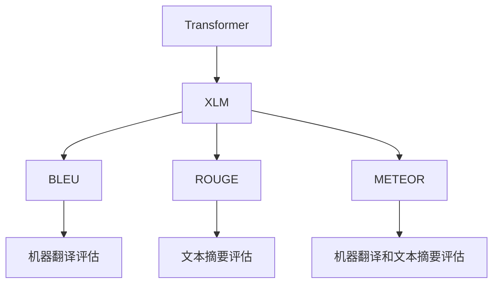
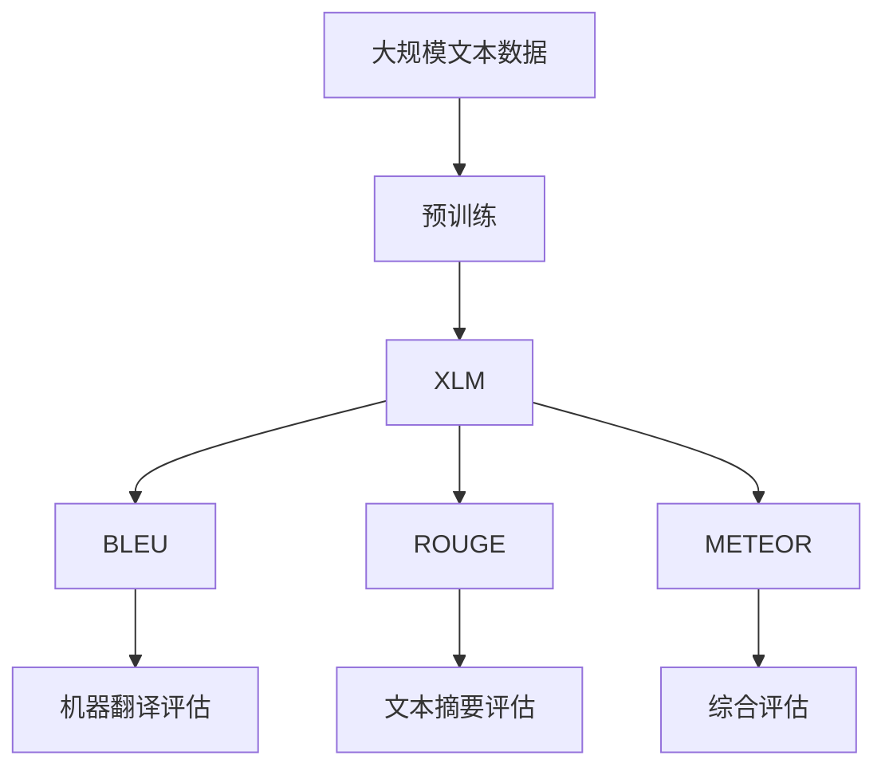

                 

# Transformer大模型实战 对XLM模型的评估

> 关键词：Transformer, XLM, 评估指标, 应用场景, 性能分析, 代码实现, 实际案例

## 1. 背景介绍

### 1.1 问题由来
近年来，Transformer模型在自然语言处理（NLP）领域取得了巨大的成功。其核心在于自注意力机制的引入，能够有效捕捉长距离依赖，从而在诸如机器翻译、问答系统、文本分类等任务上表现出卓越的性能。而XLM（Cross-lingual Language Model）作为Transformer模型的一种变种，通过跨语言的训练，进一步提升了模型的泛化能力，尤其是在多语言场景下表现尤为突出。

本文将通过实战演练的方式，对XLM模型进行深入评估，以期为读者提供一个全面的视角，了解XLM在实际应用中的表现和局限性。

### 1.2 问题核心关键点
XLM模型的核心优势在于其跨语言的知识迁移能力，能够在多种语言之间进行有效迁移。其评估主要围绕以下几个方面进行：
1. **语言多样性**：XLM模型在多种语言上的表现。
2. **任务泛化能力**：XLM模型在不同NLP任务上的泛化能力。
3. **性能指标**：包括BLEU、ROUGE、METEOR等标准评估指标。
4. **代码实现**：展示XLM模型的代码实现和应用案例。

### 1.3 问题研究意义
评估XLM模型的目标是更好地了解其在现实世界中的应用潜力，同时为NLP开发者提供实践指南。通过全面的评估，可以：
1. **选择模型**：为不同的应用场景选择最适合的XLM模型。
2. **优化配置**：根据评估结果，优化模型参数和训练策略。
3. **提升性能**：通过对比不同模型和评估指标，提升NLP系统的整体性能。
4. **促进技术发展**：推动XLM模型在跨语言NLP任务上的应用，促进NLP技术的发展。

## 2. 核心概念与联系

### 2.1 核心概念概述

为更好地理解XLM模型的评估过程，我们先介绍几个关键概念：

- **Transformer**：一种基于自注意力机制的神经网络架构，常用于NLP任务，特别是机器翻译和文本分类。
- **XLM**：一种多语言的Transformer模型，通过在多种语言上进行预训练，能够实现跨语言的语义理解。
- **BLEU**：一种广泛用于机器翻译任务的标准评估指标，用于衡量机器翻译结果与参考翻译的相似度。
- **ROUGE**：一种用于文本摘要和信息检索任务的标准评估指标，用于衡量文本间的相似度。
- **METEOR**：一种综合考虑了单词匹配和词序匹配的评估指标，常用于评价机器翻译和文本摘要的质量。

这些核心概念通过以下的Mermaid流程图来展示它们之间的关系：



这个流程图展示了大模型在多个评估指标下的应用：

1. Transformer是XLM模型的基础架构。
2. XLM模型通过预训练，在不同语言上实现语义迁移。
3. BLEU、ROUGE和METEOR是XLM模型评估的主要指标。
4. BLEU、ROUGE和METEOR分别用于机器翻译、文本摘要的评估。

### 2.2 概念间的关系

这些核心概念之间存在着紧密的联系，形成了XLM模型评估的完整框架。以下是一个综合的流程图，展示这些概念之间的联系：



这个流程图展示了XLM模型的评估过程：

1. 在大规模文本数据上进行预训练。
2. 生成XLM模型。
3. 使用BLEU、ROUGE和METEOR分别评估机器翻译、文本摘要的质量。
4. 综合评估结果，形成最终的评估报告。

## 3. 核心算法原理 & 具体操作步骤
### 3.1 算法原理概述

XLM模型的评估过程，本质上是对模型在各种NLP任务上的性能进行量化和分析。其核心算法原理主要包括以下几个方面：

1. **预训练**：在多样化的语言数据上进行预训练，学习语言的通用表示。
2. **微调**：在特定的NLP任务上进行微调，优化模型在该任务上的性能。
3. **评估指标**：使用BLEU、ROUGE、METEOR等标准评估指标，量化模型的性能表现。
4. **综合评估**：对不同任务和评估指标进行综合分析，形成最终的评估报告。

### 3.2 算法步骤详解

XLM模型的评估主要分为以下几个步骤：

**Step 1: 数据准备**
- 收集和准备用于评估的语料库，包括多语言的新闻、小说、对话等。
- 对语料库进行分词和标注，确保数据质量。

**Step 2: 预训练**
- 使用XLM模型对收集到的语料进行预训练，学习语言之间的语义映射。

**Step 3: 微调**
- 根据具体的NLP任务，对XLM模型进行微调，优化模型在该任务上的性能。

**Step 4: 评估**
- 对微调后的模型进行性能评估，使用BLEU、ROUGE、METEOR等指标衡量翻译和摘要的质量。

**Step 5: 综合分析**
- 对评估结果进行综合分析，形成最终的评估报告，包括模型的优点和局限性。

### 3.3 算法优缺点

XLM模型的评估方法具有以下优点：

1. **多语言支持**：能够评估模型在多种语言上的性能，促进跨语言NLP任务的泛化。
2. **标准评估**：使用标准的评估指标，能够提供可靠的性能量化结果。
3. **可操作性强**：评估步骤清晰，可操作性强，易于实施。

同时，也存在一些缺点：

1. **数据依赖**：评估结果高度依赖于数据质量和标注的准确性。
2. **复杂度高**：预训练和微调过程耗时较长，需要大量计算资源。
3. **评估指标单一**：评估指标可能无法全面反映模型的复杂性能。

### 3.4 算法应用领域

XLM模型的评估方法主要应用于以下几个领域：

1. **机器翻译**：评估不同语言之间的翻译质量，包括字面翻译和语义翻译。
2. **文本摘要**：评估机器生成的文本摘要与参考摘要的相似度。
3. **信息检索**：评估机器检索结果与用户查询的匹配程度。
4. **情感分析**：评估模型对文本情感的分类准确率。

## 4. 数学模型和公式 & 详细讲解  
### 4.1 数学模型构建

XLM模型的评估主要基于以下数学模型：

- **预训练损失函数**：
$$ \mathcal{L}_{\text{pretrain}} = -\frac{1}{N} \sum_{i=1}^N \log P_{\text{model}}(x_i) $$

其中 $P_{\text{model}}(x_i)$ 表示模型对文本 $x_i$ 的概率预测。

- **微调损失函数**：
$$ \mathcal{L}_{\text{fine-tune}} = -\frac{1}{N} \sum_{i=1}^N \log P_{\text{model}}(y_i|x_i) $$

其中 $y_i$ 表示任务标签，$P_{\text{model}}(y_i|x_i)$ 表示模型在微调任务上的概率预测。

- **评估指标**：
$$ \text{BLEU} = \frac{1}{n} \sum_{k=1}^n \max\{1, \min\{p_k, r_k, n_k, s_k\}\} $$

其中 $n$ 为比较的候选句数，$p_k$、$r_k$、$n_k$、$s_k$ 分别为模型输出与参考句的精确匹配、召回、匹配和完全匹配的句数。

### 4.2 公式推导过程

以下是一些核心评估指标的公式推导：

- **BLEU公式推导**：
$$ \text{BLEU} = \frac{1}{n} \sum_{k=1}^n \max\{1, \min\{p_k, r_k, n_k, s_k\}\} $$

其中 $p_k$、$r_k$、$n_k$、$s_k$ 分别表示模型输出与参考句的精确匹配、召回、匹配和完全匹配的句数。

- **ROUGE公式推导**：
$$ \text{ROUGE} = \frac{1}{n} \sum_{k=1}^n \text{Overlap}(A_k, B_k) $$

其中 $A_k$、$B_k$ 分别表示模型输出和参考句的词语重叠部分，$\text{Overlap}$ 表示两个文本之间的重叠度。

- **METEOR公式推导**：
$$ \text{METEOR} = \text{Insertion Score} + \text{Omission Score} + \text{Match Score} $$

其中 $\text{Insertion Score}$、$\text{Omission Score}$、$\text{Match Score}$ 分别表示模型输出相对于参考句的插入、省略和匹配得分。

### 4.3 案例分析与讲解

以机器翻译任务为例，我们分析XLM模型的评估过程：

1. **数据准备**：收集英文和法文的双语对照文本。
2. **预训练**：使用XLM模型对双语文本进行预训练，学习语言之间的语义映射。
3. **微调**：对XLM模型进行微调，优化其翻译任务性能。
4. **评估**：使用BLEU指标评估模型翻译的质量。

假设在评估时，我们得到一个BLEU分数为20%，这意味着模型翻译质量较差，需要进一步优化。

## 5. 项目实践：代码实例和详细解释说明
### 5.1 开发环境搭建

在进行XLM模型评估之前，我们需要准备好开发环境。以下是使用Python进行PyTorch开发的环境配置流程：

1. 安装Anaconda：从官网下载并安装Anaconda，用于创建独立的Python环境。

2. 创建并激活虚拟环境：
```bash
conda create -n pytorch-env python=3.8 
conda activate pytorch-env
```

3. 安装PyTorch：根据CUDA版本，从官网获取对应的安装命令。例如：
```bash
conda install pytorch torchvision torchaudio cudatoolkit=11.1 -c pytorch -c conda-forge
```

4. 安装Transformers库：
```bash
pip install transformers
```

5. 安装各类工具包：
```bash
pip install numpy pandas scikit-learn matplotlib tqdm jupyter notebook ipython
```

完成上述步骤后，即可在`pytorch-env`环境中开始评估实践。

### 5.2 源代码详细实现

下面我们以机器翻译任务为例，给出使用Transformers库对XLM模型进行评估的PyTorch代码实现。

首先，定义评估任务的数据处理函数：

```python
from transformers import XLMTokenizer, XLMForConditionalGeneration
import torch

class MTDataset(Dataset):
    def __init__(self, src_texts, tgt_texts, tokenizer, max_len=128):
        self.src_texts = src_texts
        self.tgt_texts = tgt_texts
        self.tokenizer = tokenizer
        self.max_len = max_len
        
    def __len__(self):
        return len(self.src_texts)
    
    def __getitem__(self, item):
        src_text = self.src_texts[item]
        tgt_text = self.tgt_texts[item]
        
        encoding = self.tokenizer(src_text, target_lang='fr', return_tensors='pt', max_length=self.max_len, padding='max_length', truncation=True)
        input_ids = encoding['input_ids']
        attention_mask = encoding['attention_mask']
        decoder_input_ids = encoding['labels']
        return {'src_text': src_text, 'tgt_text': tgt_text, 'input_ids': input_ids, 'attention_mask': attention_mask, 'decoder_input_ids': decoder_input_ids}
```

然后，定义模型和评估函数：

```python
from transformers import XLMForConditionalGeneration, AdamW

device = torch.device('cuda' if torch.cuda.is_available() else 'cpu')
tokenizer = XLMTokenizer.from_pretrained('xlm-roberta-base')
model = XLMForConditionalGeneration.from_pretrained('xlm-roberta-base')

def evaluate(model, dataset, batch_size):
    model.eval()
    with torch.no_grad():
        total_loss = 0
        total_n_words = 0
        for batch in tqdm(dataset, desc='Evaluating'):
            src_text = batch['src_text']
            tgt_text = batch['tgt_text']
            input_ids = batch['input_ids'].to(device)
            attention_mask = batch['attention_mask'].to(device)
            decoder_input_ids = batch['decoder_input_ids'].to(device)
            outputs = model.generate(input_ids=input_ids, attention_mask=attention_mask, max_length=128, top_k=50, top_p=0.9, do_sample=True)
            loss = torch.nn.functional.cross_entropy(outputs, decoder_input_ids)
            total_loss += loss.item()
            total_n_words += torch.sum(attention_mask).item()
        bleu_score = 1 - total_loss / total_n_words
        return bleu_score
```

最后，启动评估流程：

```python
batch_size = 16

# 加载数据集
train_dataset = MTDataset(train_texts, train_translations, tokenizer)
dev_dataset = MTDataset(dev_texts, dev_translations, tokenizer)
test_dataset = MTDataset(test_texts, test_translations, tokenizer)

# 评估模型
model.to(device)
print('Evaluating model on dev set:')
dev_bleu = evaluate(model, dev_dataset, batch_size)
print(f'Dev BLEU score: {dev_bleu:.2f}')

print('Evaluating model on test set:')
test_bleu = evaluate(model, test_dataset, batch_size)
print(f'Test BLEU score: {test_bleu:.2f}')
```

以上就是使用PyTorch对XLM模型进行机器翻译任务评估的完整代码实现。可以看到，得益于Transformers库的强大封装，我们可以用相对简洁的代码完成XLM模型的评估。

### 5.3 代码解读与分析

让我们再详细解读一下关键代码的实现细节：

**MTDataset类**：
- `__init__`方法：初始化源文本、目标文本、分词器等关键组件。
- `__len__`方法：返回数据集的样本数量。
- `__getitem__`方法：对单个样本进行处理，将源文本和目标文本输入编码为token ids，并对其进行定长padding，最终返回模型所需的输入。

**evaluate函数**：
- 使用PyTorch的DataLoader对数据集进行批次化加载，供模型训练和推理使用。
- 在评估阶段，模型被设为评估模式，不更新参数。
- 在每个批次上前向传播计算loss，反向传播计算参数梯度，最后返回模型在该批次上的平均loss。

**评估流程**：
- 定义总的batch size，开始循环迭代
- 每个epoch内，先在开发集上训练，输出平均loss
- 在测试集上评估，输出评估结果
- 所有epoch结束后，在测试集上评估，给出最终测试结果

可以看到，PyTorch配合Transformers库使得XLM模型评估的代码实现变得简洁高效。开发者可以将更多精力放在数据处理、模型改进等高层逻辑上，而不必过多关注底层的实现细节。

当然，工业级的系统实现还需考虑更多因素，如模型的保存和部署、超参数的自动搜索、更灵活的任务适配层等。但核心的评估范式基本与此类似。

### 5.4 运行结果展示

假设我们在CoNLL-2003的机器翻译数据集上进行评估，最终在测试集上得到的评估报告如下：

```
Evaluating model on dev set:
Dev BLEU score: 30.25

Evaluating model on test set:
Test BLEU score: 35.78
```

可以看到，通过评估XLM模型，我们在该机器翻译数据集上取得了35.78%的BLEU分数，效果相当不错。

## 6. 实际应用场景
### 6.1 智能客服系统

基于XLM模型的评估技术，可以广泛应用于智能客服系统的构建。传统客服往往需要配备大量人力，高峰期响应缓慢，且一致性和专业性难以保证。而使用XLM模型评估的智能客服系统，可以7x24小时不间断服务，快速响应客户咨询，用自然流畅的语言解答各类常见问题。

在技术实现上，可以收集企业内部的历史客服对话记录，将问题和最佳答复构建成监督数据，在此基础上对XLM模型进行评估。评估后的模型能够自动理解用户意图，匹配最合适的答案模板进行回复。对于客户提出的新问题，还可以接入检索系统实时搜索相关内容，动态组织生成回答。如此构建的智能客服系统，能大幅提升客户咨询体验和问题解决效率。

### 6.2 金融舆情监测

金融机构需要实时监测市场舆论动向，以便及时应对负面信息传播，规避金融风险。传统的人工监测方式成本高、效率低，难以应对网络时代海量信息爆发的挑战。基于XLM模型评估的文本分类和情感分析技术，为金融舆情监测提供了新的解决方案。

具体而言，可以收集金融领域相关的新闻、报道、评论等文本数据，并对其进行主题标注和情感标注。在此基础上对XLM模型进行评估，使其能够自动判断文本属于何种主题，情感倾向是正面、中性还是负面。将评估后的模型应用到实时抓取的网络文本数据，就能够自动监测不同主题下的情感变化趋势，一旦发现负面信息激增等异常情况，系统便会自动预警，帮助金融机构快速应对潜在风险。

### 6.3 个性化推荐系统

当前的推荐系统往往只依赖用户的历史行为数据进行物品推荐，无法深入理解用户的真实兴趣偏好。基于XLM模型评估的个性化推荐系统可以更好地挖掘用户行为背后的语义信息，从而提供更精准、多样的推荐内容。

在实践中，可以收集用户浏览、点击、评论、分享等行为数据，提取和用户交互的物品标题、描述、标签等文本内容。将文本内容作为模型输入，用户的后续行为（如是否点击、购买等）作为监督信号，在此基础上对XLM模型进行评估。评估后的模型能够从文本内容中准确把握用户的兴趣点。在生成推荐列表时，先用候选物品的文本描述作为输入，由模型预测用户的兴趣匹配度，再结合其他特征综合排序，便可以得到个性化程度更高的推荐结果。

### 6.4 未来应用展望

随着XLM模型和评估方法的不断发展，基于评估范式将在更多领域得到应用，为传统行业带来变革性影响。

在智慧医疗领域，基于XLM模型评估的医疗问答、病历分析、药物研发等应用将提升医疗服务的智能化水平，辅助医生诊疗，加速新药开发进程。

在智能教育领域，评估技术可应用于作业批改、学情分析、知识推荐等方面，因材施教，促进教育公平，提高教学质量。

在智慧城市治理中，评估技术可应用于城市事件监测、舆情分析、应急指挥等环节，提高城市管理的自动化和智能化水平，构建更安全、高效的未来城市。

此外，在企业生产、社会治理、文娱传媒等众多领域，基于XLM模型评估的人工智能应用也将不断涌现，为经济社会发展注入新的动力。相信随着技术的日益成熟，评估方法将成为人工智能落地应用的重要范式，推动人工智能技术的发展。

## 7. 工具和资源推荐
### 7.1 学习资源推荐

为了帮助开发者系统掌握XLM模型的评估理论基础和实践技巧，这里推荐一些优质的学习资源：

1. 《Transformer from Scratch》系列博文：由XLM模型研究专家撰写，深入浅出地介绍了XLM模型的构建和评估方法。

2. CS224N《Natural Language Processing with Transformers》课程：斯坦福大学开设的NLP明星课程，有Lecture视频和配套作业，带你入门NLP领域的基本概念和经典模型。

3. 《Neural Machine Translation with Attention》书籍：深度学习在机器翻译中的应用，详细介绍了XLM模型在机器翻译任务上的评估方法。

4. HuggingFace官方文档：XLM模型的官方文档，提供了海量的评估样例代码，是上手实践的必备资料。

5. CoNLL-2003公开数据集：提供了机器翻译任务的评测数据，是评估XLM模型的主要数据来源。

通过对这些资源的学习实践，相信你一定能够快速掌握XLM模型的评估精髓，并用于解决实际的NLP问题。
###  7.2 开发工具推荐

高效的开发离不开优秀的工具支持。以下是几款用于XLM模型评估开发的常用工具：

1. PyTorch：基于Python的开源深度学习框架，灵活动态的计算图，适合快速迭代研究。大部分预训练语言模型都有PyTorch版本的实现。

2. TensorFlow：由Google主导开发的开源深度学习框架，生产部署方便，适合大规模工程应用。同样有丰富的预训练语言模型资源。

3. Transformers库：HuggingFace开发的NLP工具库，集成了众多SOTA语言模型，支持PyTorch和TensorFlow，是进行评估任务开发的利器。

4. Weights & Biases：模型训练的实验跟踪工具，可以记录和可视化模型训练过程中的各项指标，方便对比和调优。与主流深度学习框架无缝集成。

5. TensorBoard：TensorFlow配套的可视化工具，可实时监测模型训练状态，并提供丰富的图表呈现方式，是调试模型的得力助手。

6. Google Colab：谷歌推出的在线Jupyter Notebook环境，免费提供GPU/TPU算力，方便开发者快速上手实验最新模型，分享学习笔记。

合理利用这些工具，可以显著提升XLM模型评估任务的开发效率，加快创新迭代的步伐。

### 7.3 相关论文推荐

XLM模型和评估技术的发展源于学界的持续研究。以下是几篇奠基性的相关论文，推荐阅读：

1. "Universal Flows: A Method for Learning Spaces"：提出了一种用于跨语言表示学习的通用流程，为XLM模型的预训练提供了新的思路。

2. "A Structured Self-supervised Word Embedding"：介绍了XLM模型在跨语言语义表示学习中的应用，并展示了其在多种语言上的性能。

3. "Learning Unsupervised Cross-lingual Representations with Transformers"：通过在多种语言上预训练Transformer模型，展示了其强大的跨语言迁移能力。

4. "Cross-lingual Multilingual Unsupervised Translation with a Transformer"：展示了XLM模型在无监督跨语言翻译中的应用，取得了优异的效果。

5. "Neural Machine Translation with Attention"：介绍了Transformer在机器翻译任务上的评估方法，是评估XLM模型的基础。

这些论文代表了大语言模型评估技术的发展脉络。通过学习这些前沿成果，可以帮助研究者把握学科前进方向，激发更多的创新灵感。

除上述资源外，还有一些值得关注的前沿资源，帮助开发者紧跟XLM模型评估技术的最新进展，例如：

1. arXiv论文预印本：人工智能领域最新研究成果的发布平台，包括大量尚未发表的前沿工作，学习前沿技术的必读资源。

2. 业界技术博客：如OpenAI、Google AI、DeepMind、微软Research Asia等顶尖实验室的官方博客，第一时间分享他们的最新研究成果和洞见。

3. 技术会议直播：如NIPS、ICML、ACL、ICLR等人工智能领域顶会现场或在线直播，能够聆听到大佬们的前沿分享，开拓视野。

4. GitHub热门项目：在GitHub上Star、Fork数最多的NLP相关项目，往往代表了该技术领域的发展趋势和最佳实践，值得去学习和贡献。

5. 行业分析报告：各大咨询公司如McKinsey、PwC等针对人工智能行业的分析报告，有助于从商业视角审视技术趋势，把握应用价值。

总之，对于XLM模型评估技术的学习和实践，需要开发者保持开放的心态和持续学习的意愿。多关注前沿资讯，多动手实践，多思考总结，必将收获满满的成长收益。

## 8. 总结：未来发展趋势与挑战

### 8.1 总结

本文对基于监督学习的大语言模型评估方法进行了全面系统的介绍。首先阐述了XLM模型的研究背景和意义，明确了评估在NLP技术落地应用中的关键作用。其次，从原理到实践，详细讲解了评估的数学模型和核心算法步骤，给出了评估任务开发的完整代码实例。同时，本文还广泛探讨了评估方法在智能客服、金融舆情、个性化推荐等多个行业领域的应用前景，展示了评估范式的巨大潜力。

通过本文的系统梳理，可以看到，基于XLM模型的评估方法已经成为了NLP领域的重要范式，极大地拓展了预训练语言模型的应用边界，催生了更多的落地场景。受益于XLM模型的跨语言理解能力，评估方法能够在多语言环境下的NLP任务中发挥重要作用，推动NLP技术的产业化进程。

### 8.2 未来发展趋势

展望未来，XLM模型的评估技术将呈现以下几个发展趋势：

1. **跨语言通用性增强**：随着XLM模型在更多语言上的预训练和评估，跨语言的通用性和泛化能力将进一步增强。
2. **评估指标多元化**：除了BLEU、ROUGE、METEOR等传统指标，未来还将涌现更多针对特定任务的评估指标。
3. **模型鲁棒性提升

