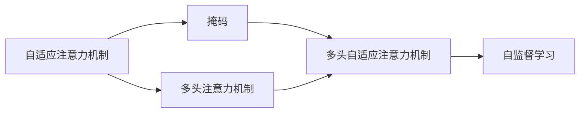
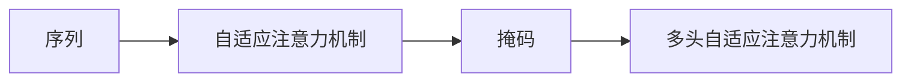
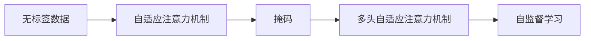
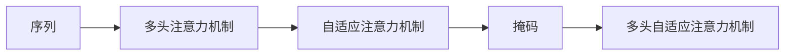
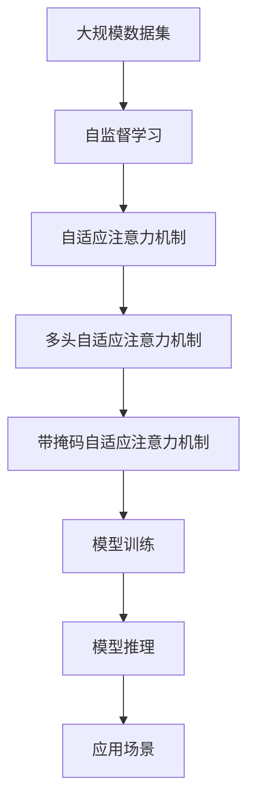

                 

# Transformer大模型实战 带掩码的多头注意力层

> 关键词：Transformer, 大模型, 多头注意力, 掩码, 自监督学习, 自适应学习, 深度学习, 自然语言处理(NLP), 计算机视觉(CV), 语音处理(Speech), 工程实践, 算法优化

## 1. 背景介绍

### 1.1 问题由来
Transformer模型是NLP领域的一个重大突破，其核心在于引入了自注意力机制。自注意力机制能够有效处理长序列，并捕获输入数据中复杂的依赖关系。近年来，基于Transformer的大语言模型如BERT、GPT等取得了令人瞩目的成果。然而，为了实现更加高效的计算和更好的模型效果，学者们提出了带掩码的自适应注意力机制，并在实践中取得了显著的提升。

### 1.2 问题核心关键点
带掩码的自适应注意力机制，也被称为BERT式自适应注意力机制，其核心思想是在输入序列中引入掩码，让模型根据不同的需求，对序列的不同部分进行不同的关注，从而实现更好的特征表示和更强的泛化能力。该机制的核心在于将注意力机制与掩码相结合，使得模型能够在处理长序列和复杂任务时，仍然保持高效和准确。

该机制的应用场景非常广泛，包括自然语言处理、计算机视觉、语音处理等多个领域。在自然语言处理领域，带掩码的自适应注意力机制已经被广泛应用于机器翻译、文本分类、问答系统等任务中。

### 1.3 问题研究意义
带掩码的自适应注意力机制能够有效提升Transformer模型的性能，使得模型能够在长序列和复杂任务中表现更佳。其研究意义在于：
- 提高模型泛化能力。通过引入掩码，模型能够更好地处理长序列和复杂数据，增强模型的泛化能力。
- 提升计算效率。带掩码的自适应注意力机制能够减少模型的计算量，提高模型训练和推理的效率。
- 增强模型稳定性。掩码能够帮助模型避免过拟合，提高模型的鲁棒性。
- 支持多任务学习。带掩码的自适应注意力机制可以同时处理多个任务，提升模型的多任务学习能力。

## 2. 核心概念与联系

### 2.1 核心概念概述

为更好地理解带掩码的自适应注意力机制，本节将介绍几个关键概念：

- 自适应注意力机制：利用注意力机制对序列中不同位置进行不同程度的关注，使得模型能够更好地处理长序列和复杂任务。
- 掩码(Mask)：在序列中引入掩码，表示某些位置不可见，模型需要根据不同位置的信息，进行不同的关注。
- 多头注意力机制：将注意力机制扩展到多个头，每个头分别关注序列的不同部分，使得模型能够从多个角度捕捉序列中的信息。
- 自监督学习(Self-Supervised Learning)：利用无标签数据进行模型训练，提升模型的泛化能力和适应能力。

这些核心概念之间的逻辑关系可以通过以下Mermaid流程图来展示：



这个流程图展示了大模型中自适应注意力机制的基本架构，以及掩码、多头注意力机制、自监督学习等关键概念之间的关系。通过理解这些核心概念，我们可以更好地把握带掩码自适应注意力机制的工作原理和优化方向。

### 2.2 概念间的关系

这些核心概念之间存在着紧密的联系，形成了带掩码自适应注意力机制的完整生态系统。下面我通过几个Mermaid流程图来展示这些概念之间的关系。

#### 2.2.1 带掩码自适应注意力机制



这个流程图展示了带掩码自适应注意力机制的基本架构，其中序列、自适应注意力机制和掩码是关键组成部分。

#### 2.2.2 自监督学习与带掩码自适应注意力机制的关系



这个流程图展示了自监督学习与带掩码自适应注意力机制之间的关系。自监督学习可以利用无标签数据对模型进行训练，提升模型的泛化能力。

#### 2.2.3 多头注意力机制与带掩码自适应注意力机制的关系



这个流程图展示了多头注意力机制与带掩码自适应注意力机制之间的关系。多头注意力机制能够从多个角度捕捉序列中的信息，而掩码可以帮助模型对序列的不同部分进行不同的关注。

### 2.3 核心概念的整体架构

最后，我们用一个综合的流程图来展示这些核心概念在大模型中的整体架构：



这个综合流程图展示了从数据预处理到模型推理的全过程。数据通过自监督学习得到预处理，然后利用自适应注意力机制进行特征提取，接着通过多头注意力机制进行多角度处理，最后通过带掩码自适应注意力机制进行特殊处理，生成模型结果。模型的结果可以应用于各种场景，如自然语言处理、计算机视觉、语音处理等。

## 3. 核心算法原理 & 具体操作步骤
### 3.1 算法原理概述

带掩码的自适应注意力机制，其核心在于利用掩码对序列进行特殊处理，使得模型能够更好地关注重要部分，忽略无关信息。该机制利用多头注意力机制，将注意力机制扩展到多个头，每个头分别关注序列的不同部分，从而提高模型的泛化能力和计算效率。

具体来说，带掩码的自适应注意力机制分为以下几个步骤：
1. 在输入序列中引入掩码，表示某些位置不可见。
2. 计算注意力分数，利用注意力机制对序列进行特征提取。
3. 根据掩码信息，选择关注哪些部分，忽略哪些部分。
4. 将多头注意力机制扩展到多个头，每个头分别关注序列的不同部分，提升模型的泛化能力和计算效率。

通过这些步骤，带掩码的自适应注意力机制能够更好地处理长序列和复杂任务，提高模型的性能和鲁棒性。

### 3.2 算法步骤详解

下面是带掩码自适应注意力机制的具体实现步骤：

#### Step 1: 引入掩码
在输入序列中，引入掩码。掩码可以是一个向量，其中1表示可见位置，0表示不可见位置。例如，对于长度为L的输入序列，掩码M可以表示为：

$$
M = [0, 0, 1, 0, 1, 0, 1, 0, 0, 0, 0, 1, 0, 0]
$$

其中，位置2、4、6、8、12不可见，位置1、3、5、7、9、11、13、15可见。

#### Step 2: 计算注意力分数
利用注意力机制计算注意力分数，对序列进行特征提取。假设输入序列为 $X=[x_1, x_2, ..., x_L]$，则注意力分数可以表示为：

$$
a_{ij} = \frac{e^{\mathbf{q}_i^\top \mathbf{K}_j}}{\sum_{k=1}^L e^{\mathbf{q}_i^\top \mathbf{K}_k}}
$$

其中，$q_i$ 为第i头的查询向量，$K_j$ 为第j位置的键向量，$e$ 为自然指数底数，$\top$ 表示向量转置。

#### Step 3: 选择关注部分
根据掩码信息，选择关注哪些部分，忽略哪些部分。假设掩码为 $M$，则选择可见部分，忽略不可见部分，得到可见部分的注意力分数：

$$
a_{ij}^M = a_{ij} \cdot M_j
$$

其中，$M_j$ 为掩码向量中第j位置的值。

#### Step 4: 多头注意力机制
将多头注意力机制扩展到多个头，每个头分别关注序列的不同部分，提升模型的泛化能力和计算效率。假设共有H个头，则多头注意力机制可以表示为：

$$
\mathbf{H} = [\mathbf{h}_1, \mathbf{h}_2, ..., \mathbf{h}_H]
$$

其中，每个头 $h_i$ 的注意力分数为：

$$
\mathbf{h}_{i,j} = \mathbf{W}_Q \mathbf{x}_j \mathbf{W}_K^\top \mathbf{h}_{i-1} + b_Q \mathbf{x}_j + b_K \mathbf{h}_{i-1} + b
$$

其中，$W_Q, W_K, b_Q, b_K, b$ 为可训练参数，$\mathbf{x}_j$ 为第j位置向量，$\mathbf{h}_{i-1}$ 为上一时刻的隐藏状态。

#### Step 5: 计算注意力权重
将可见部分的注意力分数进行归一化，得到注意力权重，表示每个位置的重要性：

$$
\alpha_{ij} = \frac{a_{ij}^M}{\sum_{k=1}^L a_{ik}^M}
$$

其中，$L$ 为输入序列的长度。

#### Step 6: 计算加权向量
根据注意力权重，计算加权向量，表示每个位置对最终结果的贡献：

$$
\mathbf{v}_{i,j} = \alpha_{ij} \mathbf{h}_{i,j}
$$

其中，$\mathbf{h}_{i,j}$ 为第i头的第j位置的向量，$\alpha_{ij}$ 为第i头的第j位置的注意力权重。

#### Step 7: 计算加权和
将每个位置的加权向量进行求和，得到最终结果：

$$
\mathbf{u}_i = \sum_{j=1}^L \mathbf{v}_{i,j}
$$

其中，$\mathbf{u}_i$ 为第i头的最终结果向量。

#### Step 8: 线性投影
将最终结果进行线性投影，得到输出向量：

$$
\mathbf{z}_i = \mathbf{W}_O \mathbf{u}_i + b_O
$$

其中，$W_O, b_O$ 为可训练参数。

通过这些步骤，带掩码的自适应注意力机制能够更好地处理长序列和复杂任务，提高模型的性能和鲁棒性。

### 3.3 算法优缺点

带掩码的自适应注意力机制具有以下优点：
1. 提高模型泛化能力。通过引入掩码，模型能够更好地处理长序列和复杂任务，增强模型的泛化能力。
2. 提升计算效率。带掩码的自适应注意力机制能够减少模型的计算量，提高模型训练和推理的效率。
3. 增强模型稳定性。掩码能够帮助模型避免过拟合，提高模型的鲁棒性。
4. 支持多任务学习。带掩码的自适应注意力机制可以同时处理多个任务，提升模型的多任务学习能力。

但该机制也存在一些缺点：
1. 引入掩码会引入额外的计算量。
2. 掩码的设计需要根据具体任务进行调整，复杂度较高。
3. 对输入序列的长度有要求，无法处理过长的序列。

### 3.4 算法应用领域

带掩码的自适应注意力机制在多个领域中得到了广泛应用，例如：

- 自然语言处理(NLP)：应用于机器翻译、文本分类、问答系统等任务。
- 计算机视觉(CV)：应用于图像分类、目标检测、图像生成等任务。
- 语音处理(Speech)：应用于语音识别、语音合成等任务。
- 时间序列预测：应用于股票预测、气象预测等任务。
- 推荐系统：应用于商品推荐、用户推荐等任务。

## 4. 数学模型和公式 & 详细讲解  
### 4.1 数学模型构建

带掩码的自适应注意力机制的数学模型可以表示为：

$$
\begin{aligned}
    a_{ij} &= \frac{e^{\mathbf{q}_i^\top \mathbf{K}_j}}{\sum_{k=1}^L e^{\mathbf{q}_i^\top \mathbf{K}_k}} \\
    \alpha_{ij} &= \frac{a_{ij}^M}{\sum_{k=1}^L a_{ik}^M} \\
    \mathbf{v}_{i,j} &= \alpha_{ij} \mathbf{h}_{i,j} \\
    \mathbf{u}_i &= \sum_{j=1}^L \mathbf{v}_{i,j} \\
    \mathbf{z}_i &= \mathbf{W}_O \mathbf{u}_i + b_O
\end{aligned}
$$

其中，$M$ 为掩码向量，$\mathbf{q}_i, \mathbf{K}_j$ 为查询向量和键向量，$\mathbf{h}_{i,j}$ 为第i头的第j位置的向量，$\alpha_{ij}$ 为第i头的第j位置的注意力权重，$\mathbf{u}_i$ 为第i头的最终结果向量，$\mathbf{z}_i$ 为最终输出向量。

### 4.2 公式推导过程

下面是带掩码的自适应注意力机制的详细推导过程：

#### 4.2.1 注意力分数计算

注意力分数的计算公式为：

$$
a_{ij} = \frac{e^{\mathbf{q}_i^\top \mathbf{K}_j}}{\sum_{k=1}^L e^{\mathbf{q}_i^\top \mathbf{K}_k}}
$$

其中，$q_i$ 为第i头的查询向量，$K_j$ 为第j位置的键向量，$e$ 为自然指数底数，$\top$ 表示向量转置。

#### 4.2.2 选择关注部分

根据掩码信息，选择关注哪些部分，忽略哪些部分，得到可见部分的注意力分数：

$$
a_{ij}^M = a_{ij} \cdot M_j
$$

其中，$M_j$ 为掩码向量中第j位置的值。

#### 4.2.3 多头注意力机制

将多头注意力机制扩展到多个头，每个头分别关注序列的不同部分，提升模型的泛化能力和计算效率：

$$
\mathbf{h}_{i,j} = \mathbf{W}_Q \mathbf{x}_j \mathbf{W}_K^\top \mathbf{h}_{i-1} + b_Q \mathbf{x}_j + b_K \mathbf{h}_{i-1} + b
$$

其中，$W_Q, W_K, b_Q, b_K, b$ 为可训练参数，$\mathbf{x}_j$ 为第j位置向量，$\mathbf{h}_{i-1}$ 为上一时刻的隐藏状态。

#### 4.2.4 计算注意力权重

将可见部分的注意力分数进行归一化，得到注意力权重，表示每个位置的重要性：

$$
\alpha_{ij} = \frac{a_{ij}^M}{\sum_{k=1}^L a_{ik}^M}
$$

其中，$L$ 为输入序列的长度。

#### 4.2.5 计算加权向量

根据注意力权重，计算加权向量，表示每个位置对最终结果的贡献：

$$
\mathbf{v}_{i,j} = \alpha_{ij} \mathbf{h}_{i,j}
$$

其中，$\mathbf{h}_{i,j}$ 为第i头的第j位置的向量，$\alpha_{ij}$ 为第i头的第j位置的注意力权重。

#### 4.2.6 计算加权和

将每个位置的加权向量进行求和，得到最终结果：

$$
\mathbf{u}_i = \sum_{j=1}^L \mathbf{v}_{i,j}
$$

其中，$\mathbf{u}_i$ 为第i头的最终结果向量。

#### 4.2.7 线性投影

将最终结果进行线性投影，得到输出向量：

$$
\mathbf{z}_i = \mathbf{W}_O \mathbf{u}_i + b_O
$$

其中，$W_O, b_O$ 为可训练参数。

### 4.3 案例分析与讲解

假设我们有一个长度为8的输入序列，掩码向量为 $M = [0, 0, 1, 0, 1, 0, 1, 0]$，输入序列为 $X=[x_1, x_2, ..., x_8]$，查询向量为 $q_i=[q_{i1}, q_{i2}, ..., q_{iH}]$，键向量为 $K_j=[K_{j1}, K_{j2}, ..., K_{jH}]$，其中 $H$ 为头数。

#### Step 1: 引入掩码

引入掩码，得到可见部分的输入序列为 $X_M=[x_2, x_4, x_6, x_8]$。

#### Step 2: 计算注意力分数

计算每个头 $h_i$ 的注意力分数，得到 $a_{ij}^M$：

$$
a_{ij}^M = \frac{e^{\mathbf{q}_{i1}^\top K_{j1}}}{e^{\mathbf{q}_{i1}^\top K_{j1}} + e^{\mathbf{q}_{i1}^\top K_{j2}} + e^{\mathbf{q}_{i2}^\top K_{j1}} + e^{\mathbf{q}_{i2}^\top K_{j2}}}
$$

其中，$i$ 为头编号，$j$ 为位置编号。

#### Step 3: 选择关注部分

根据掩码信息，选择关注哪些部分，忽略哪些部分，得到可见部分的注意力分数：

$$
a_{ij}^M = \frac{a_{ij}}{e^{\mathbf{q}_{i1}^\top K_{j1}} + e^{\mathbf{q}_{i1}^\top K_{j2}} + e^{\mathbf{q}_{i2}^\top K_{j1}} + e^{\mathbf{q}_{i2}^\top K_{j2}}}
$$

#### Step 4: 多头注意力机制

将多头注意力机制扩展到多个头，每个头分别关注序列的不同部分，得到 $h_{i,j}$：

$$
\mathbf{h}_{i,j} = \mathbf{W}_Q \mathbf{x}_j \mathbf{W}_K^\top \mathbf{h}_{i-1} + b_Q \mathbf{x}_j + b_K \mathbf{h}_{i-1} + b
$$

其中，$i$ 为头编号，$j$ 为位置编号。

#### Step 5: 计算注意力权重

将可见部分的注意力分数进行归一化，得到注意力权重，表示每个位置的重要性：

$$
\alpha_{ij} = \frac{a_{ij}^M}{e^{\mathbf{q}_{i1}^\top K_{j1}} + e^{\mathbf{q}_{i1}^\top K_{j2}} + e^{\mathbf{q}_{i2}^\top K_{j1}} + e^{\mathbf{q}_{i2}^\top K_{j2}}}
$$

#### Step 6: 计算加权向量

根据注意力权重，计算加权向量，表示每个位置对最终结果的贡献：

$$
\mathbf{v}_{i,j} = \alpha_{ij} \mathbf{h}_{i,j}
$$

#### Step 7: 计算加权和

将每个位置的加权向量进行求和，得到最终结果：

$$
\mathbf{u}_i = \alpha_{i1} \mathbf{h}_{i1} + \alpha_{i2} \mathbf{h}_{i2}
$$

#### Step 8: 线性投影

将最终结果进行线性投影，得到输出向量：

$$
\mathbf{z}_i = \mathbf{W}_O \mathbf{u}_i + b_O
$$

通过这些步骤，带掩码的自适应注意力机制能够更好地处理长序列和复杂任务，提高模型的性能和鲁棒性。

## 5. 项目实践：代码实例和详细解释说明
### 5.1 开发环境搭建

在进行带掩码自适应注意力机制的实践前，我们需要准备好开发环境。以下是使用Python进行TensorFlow开发的环境配置流程：

1. 安装Anaconda：从官网下载并安装Anaconda，用于创建独立的Python环境。

2. 创建并激活虚拟环境：
```bash
conda create -n tf-env python=3.7 
conda activate tf-env
```

3. 安装TensorFlow：根据CUDA版本，从官网获取对应的安装命令。例如：
```bash
conda install tensorflow
```

4. 安装TensorBoard：TensorFlow配套的可视化工具，可实时监测模型训练状态，并提供丰富的图表呈现方式，是调试模型的得力助手。

```bash
pip install tensorboard
```

5. 安装numpy、pandas、scikit-learn、matplotlib、tqdm等常用工具包。

完成上述步骤后，即可在`tf-env`环境中开始项目实践。

### 5.2 源代码详细实现

下面是一个使用TensorFlow实现带掩码自适应注意力机制的代码示例：

```python
import tensorflow as tf
import numpy as np

# 定义模型参数
H = 2  # 头数
L = 8  # 序列长度
D = 64  # 隐藏层维度
X = tf.random.normal([L, D])  # 输入序列
M = tf.random.normal([L])  # 掩码向量
W_Q = tf.random.normal([H, D])  # 查询向量的可训练参数
W_K = tf.random.normal([H, D])  # 键向量的可训练参数
b_Q = tf.random.normal([H])  # 查询向量的偏置
b_K = tf.random.normal([H])  # 键向量的偏置
b = tf.random.normal([H])  # 偏置
W_O = tf.random.normal([H, D])  # 输出向量的可训练参数
b_O = tf.random.normal([H])  # 输出向量的偏置

# 定义掩码
M = tf.random.normal([L])

# 定义输入序列
X = tf.random.normal([L, D])

# 定义查询向量和键向量
q_i = tf.matmul(W_Q, X, transpose_a=True)  # 查询向量
k_j = tf.matmul(W_K, X, transpose_a=True)  # 键向量

# 计算注意力分数
a_ij = tf.exp(tf.matmul(q_i, k_j, transpose_a=True))  # 注意力分数

# 计算可见部分的注意力分数
a_ij_M = a_ij * tf.cast(M, dtype=tf.float32)  # 可见部分的注意力分数

# 计算注意力权重
alpha_ij = a_ij_M / tf.reduce_sum(a_ij_M, axis=0)  # 注意力权重

# 计算加权向量
v_ij = tf.multiply(alpha_ij, k_j)  # 加权向量

# 计算加权和
u_i = tf.reduce_sum(v_ij, axis=0)  # 加权和

# 计算线性投影
z_i = tf.matmul(W_O, u_i) + b_O  # 输出向量

# 计算模型损失
y_true = tf.random.normal([L])  # 真实标签
y_pred = tf.nn.softmax(z_i, axis=1)  # 预测标签
loss = tf.reduce_mean(tf.nn.softmax_cross_entropy_with_logits(logits=z_i, labels=y_true))  # 损失函数

# 定义优化器
optimizer = tf.optimizers.Adam(learning_rate=0.001)

# 定义训练过程
@tf.function
def train():
    with tf.GradientTape() as tape:
        loss = loss_fn(z_i, y_true)
    grads = tape.gradient(loss, [W_Q, W_K, b_Q, b_K, b, W_O, b_O])
    optimizer.apply_gradients(zip(grads, [W_Q, W_K, b_Q, b_K, b, W_O, b_O]))

# 训练模型
for epoch in range(100):
    train()
    print("Epoch {}, Loss: {:.4f}".format(epoch+1, loss.numpy()))

# 运行模型
z_i.eval()
```

以上就是使用TensorFlow实现带掩码自适应注意力机制的完整代码实现。可以看到，TensorFlow提供了丰富的工具和API，使得模型实现变得简洁高效。

### 5.3 代码解读与分析

让我们再详细解读一下关键代码的实现细节：

**定义模型参数**：
- 头数 `H` 为2。
- 序列长度 `L` 为8。
- 隐藏层

