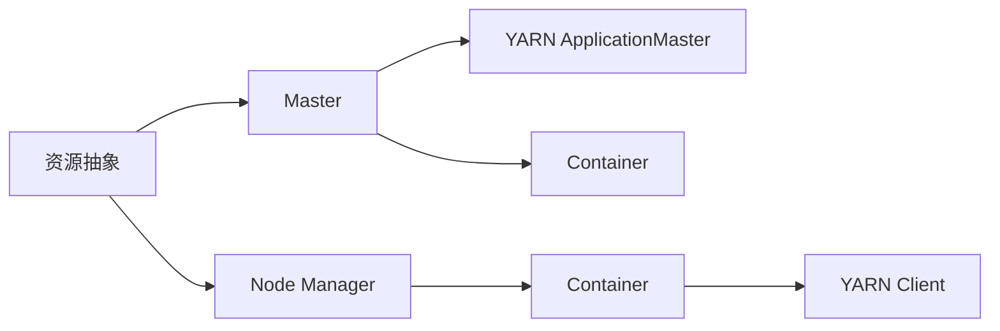
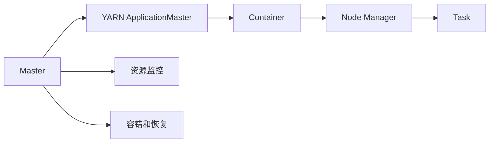
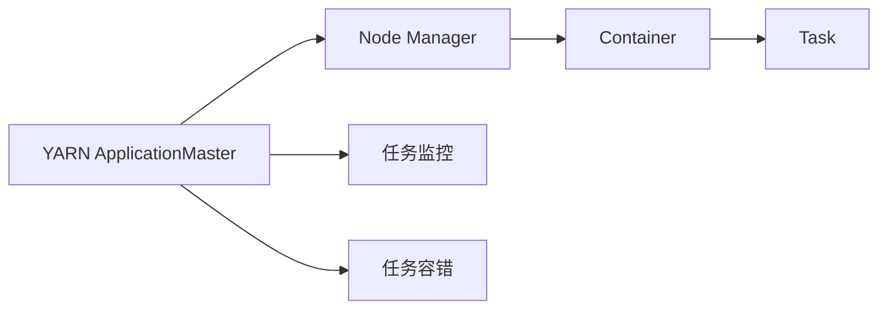
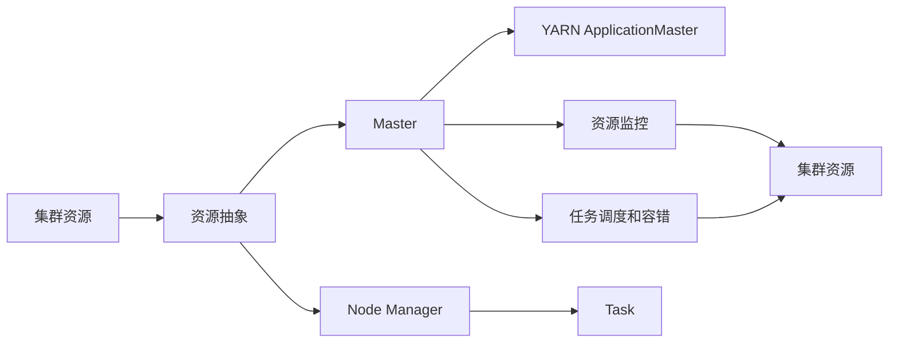

                 

# 【AI大数据计算原理与代码实例讲解】Yarn

## 1. 背景介绍

### 1.1 问题由来
随着大数据和人工智能技术的迅猛发展，分布式计算系统已成为处理海量数据的关键技术。Yarn（Yet Another Resource Negotiator）是Hadoop 2.0中引入的一个资源管理系统，可有效解决单节点资源利用率低、分布式系统资源分配不均等问题。Yarn通过将计算任务和资源分离，实现计算资源的动态分配和共享，极大地提升了系统的可扩展性和灵活性。

Yarn的诞生标志着大数据处理进入分布式计算的新时代。通过Yarn，企业可以更高效地管理和利用海量数据资源，加速人工智能模型的训练与推理，推动业务决策的智能化和自动化。

### 1.2 问题核心关键点
Yarn的核心目标是实现计算任务的动态分配和资源共享，从而提高系统资源利用率，降低运行成本。具体来说，Yarn通过以下机制实现资源管理和调度：

- 资源抽象：将集群中的物理资源（CPU、内存、磁盘等）抽象成容器（Container），以统一的资源单位进行分配和管理。
- 任务调度和执行：通过Master和Node Manager两个组件，Master负责资源管理和任务调度，Node Manager负责任务的执行。
- 容错和恢复：Yarn支持任务容错和重启机制，确保系统可靠性。
- 动态扩展：Yarn可动态扩展集群规模，适应不同的业务需求。

Yarn的这些机制使得其成为大数据计算和人工智能模型训练的理想平台，广泛应用于各种数据密集型应用。

### 1.3 问题研究意义
研究Yarn系统架构和实现原理，对于构建高效、可靠、可扩展的大数据处理系统，具有重要意义：

1. 提高资源利用率。通过Yarn的资源动态分配和共享机制，可有效避免资源浪费，最大化集群资源利用效率。
2. 提升系统扩展性。Yarn支持动态扩展集群规模，可根据业务需求灵活调整资源配置。
3. 增强系统可靠性。Yarn的容错和重启机制，提高了系统的可靠性和稳定性。
4. 优化资源管理。Yarn的资源抽象和任务调度的设计，提供了更高效的资源管理方式。
5. 加速人工智能模型训练。通过Yarn，可以高效管理和利用集群资源，加速模型训练和推理。

Yarn的大数据处理能力为人工智能技术落地应用提供了坚实的基础，成为推动AI技术发展的重要工具。

## 2. 核心概念与联系

### 2.1 核心概念概述

为更好地理解Yarn系统架构和工作原理，本节将介绍几个关键概念：

- **资源抽象（Resource Abstraction）**：将集群中的物理资源（CPU、内存、磁盘等）抽象成容器（Container），以统一的资源单位进行分配和管理。
- **Master（资源管理器）**：负责资源管理，根据应用需求动态分配资源，并监控资源的运行状态。
- **Node Manager（节点管理器）**：负责任务执行，接收Master分配的资源，启动和监控任务的运行。
- **YARN ApplicationMaster（应用管理器）**：在集群中执行特定任务，如MapReduce、Spark等，负责任务的提交、监控和资源申请。
- **Container（容器）**：定义了任务的资源需求，包括CPU、内存、磁盘等，是资源分配和调度的基本单位。
- **YARN Client（客户端）**：与Master和Node Manager通信，提交和监控任务。

这些概念之间通过以下Mermaid流程图展示它们之间的关系：



这个流程图展示了Yarn系统中各个组件的功能关系：

1. 资源抽象A将集群资源抽象成容器E。
2. Master B负责资源管理，根据任务需求分配容器E。
3. Node Manager C负责任务执行，启动Container F。
4. YARN ApplicationMaster D在集群中执行任务，负责资源申请和监控。
5. YARN Client G与Master和Node Manager通信，提交和监控任务。

### 2.2 概念间的关系

这些核心概念之间存在紧密的联系，构成Yarn系统的完整架构。下面我们通过几个Mermaid流程图来展示这些概念之间的关系。

#### 2.2.1 Yarn的资源分配流程



这个流程图展示了Yarn系统中的资源分配流程：

1. Master A根据应用需求分配Container C。
2. YARN ApplicationMaster B申请Container C的资源。
3. Node Manager D启动Container C中的任务E。
4. YARN ApplicationMaster B监控任务E的运行状态，并向Master A报告。
5. Master A监控集群资源，实现资源监控和容错恢复。

#### 2.2.2 任务调度和执行过程



这个流程图展示了Yarn系统中的任务调度和执行过程：

1. YARN ApplicationMaster A根据任务需求申请Container C的资源。
2. Node Manager B分配Container C给任务D。
3. YARN ApplicationMaster A监控任务D的运行状态。
4. Node Manager B启动Container C中的任务D。
5. YARN ApplicationMaster A在任务完成后向Master A报告，并回收资源。

### 2.3 核心概念的整体架构

最后，我们用一个综合的流程图来展示这些核心概念在大数据处理中的整体架构：



这个综合流程图展示了从集群资源到任务调度和执行的完整过程：

1. 集群资源A被抽象成资源抽象B。
2. Master C根据应用需求分配资源给Container E。
3. Node Manager D启动Container E中的任务F。
4. YARN ApplicationMaster E申请资源并监控任务的运行状态。
5. Master C监控集群资源，实现资源监控和容错恢复。

通过这些流程图，我们可以更清晰地理解Yarn系统中各个组件的功能关系和数据流动，为后续深入讨论Yarn的具体实现和优化策略奠定基础。

## 3. 核心算法原理 & 具体操作步骤
### 3.1 算法原理概述

Yarn的资源分配和任务调度机制基于资源抽象和Master/Node Manager的架构设计，实现了资源的动态分配和共享。其核心原理包括以下几个方面：

- **资源抽象（Resource Abstraction）**：将集群中的物理资源（CPU、内存、磁盘等）抽象成容器（Container），以统一的资源单位进行分配和管理。
- **任务调度和执行（Task Scheduling and Execution）**：通过Master和Node Manager两个组件，Master负责资源管理和任务调度，Node Manager负责任务的执行。
- **容错和恢复（Fault Tolerance and Recovery）**：Yarn支持任务容错和重启机制，确保系统可靠性。
- **动态扩展（Dynamic Scaling）**：Yarn可动态扩展集群规模，适应不同的业务需求。

这些原理通过Master、Node Manager、YARN ApplicationMaster和Container等组件的协作，实现了资源的灵活分配和高效管理。

### 3.2 算法步骤详解

Yarn的资源分配和任务调度过程主要包括以下步骤：

1. **资源申请**：YARN ApplicationMaster向Master提交资源申请，说明任务所需的资源需求。
2. **资源分配**：Master根据资源需求和集群资源情况，分配适当的Container给YARN ApplicationMaster。
3. **任务启动**：YARN ApplicationMaster接收Master分配的Container，向Node Manager提交任务启动请求。
4. **任务执行**：Node Manager启动Container中的任务，并将任务状态反馈给YARN ApplicationMaster。
5. **任务监控**：YARN ApplicationMaster监控任务的运行状态，并向Master报告。
6. **资源回收**：任务完成后，YARN ApplicationMaster向Master申请回收分配的Container资源。

这些步骤通过Master和Node Manager的协作，实现了资源的动态分配和任务的高效执行。

### 3.3 算法优缺点

Yarn的资源分配和任务调度机制具有以下优点：

- **资源动态分配**：根据任务需求动态分配资源，提高资源利用率。
- **资源抽象**：将物理资源抽象成统一的资源单位，简化了资源管理。
- **任务容错和恢复**：支持任务容错和重启机制，提高了系统的可靠性和稳定性。
- **动态扩展**：可动态扩展集群规模，适应不同的业务需求。

同时，Yarn也存在一些缺点：

- **复杂性高**：系统架构较为复杂，需要理解Master、Node Manager和YARN ApplicationMaster等组件的协作机制。
- **资源管理粒度大**：资源分配以Container为单位，管理粒度较大，可能无法满足某些任务的精细化需求。
- **任务执行效率低**：任务的调度和执行过程涉及多个组件的协作，可能影响任务执行效率。

尽管存在这些缺点，但Yarn的大数据处理能力为人工智能技术落地应用提供了坚实的基础，成为推动AI技术发展的重要工具。

### 3.4 算法应用领域

Yarn的资源分配和任务调度机制已经广泛应用于各种数据密集型应用，例如：

- **大数据处理**：利用Yarn的高效资源管理和计算能力，处理海量数据，加速数据挖掘和分析。
- **机器学习和深度学习**：在Yarn上训练和推理人工智能模型，加速模型训练和推理。
- **数据仓库**：利用Yarn的资源管理和扩展能力，构建大规模数据仓库，支持企业决策。
- **云计算**：Yarn的资源动态分配和扩展机制，使其成为云平台中重要的资源调度引擎。
- **流处理**：利用Yarn处理实时数据流，支持实时分析和处理。

除了这些经典应用外，Yarn还被创新性地应用于更多场景中，如多租户环境、容器编排、微服务等，为大数据处理提供了更丰富的解决方案。

## 4. 数学模型和公式 & 详细讲解 & 举例说明

### 4.1 数学模型构建

Yarn的资源分配和任务调度过程可以通过数学模型进行建模和优化。这里我们以资源分配为例，定义如下模型：

设集群中有 $N$ 个物理节点，每个节点有 $C$ 个CPU核心和 $M$ 个内存单位。系统中有 $K$ 个任务需要执行，每个任务需要 $c_i$ 个CPU核心和 $m_i$ 个内存单位。

目标是最小化任务完成时间，即最小化任务执行所需的资源数量。

设任务 $i$ 分配到的资源数量为 $c_i'$ 和 $m_i'$，则优化目标为：

$$
\min \sum_{i=1}^K c_i' + m_i'
$$

约束条件为：

$$
\begin{cases}
c_i' \leq c_i & \forall i \in [1,K] \\
m_i' \leq m_i & \forall i \in [1,K] \\
c_i' \geq 0 & \forall i \in [1,K] \\
m_i' \geq 0 & \forall i \in [1,K] \\
\sum_{i=1}^K c_i' \leq C & \\
\sum_{i=1}^K m_i' \leq M &
\end{cases}
$$

其中，$c_i'$ 和 $m_i'$ 为任务 $i$ 实际分配到的CPU和内存资源，$c_i$ 和 $m_i$ 为任务 $i$ 的资源需求。

### 4.2 公式推导过程

为了求解上述优化问题，可以使用线性规划（Linear Programming）方法。具体推导如下：

1. **建立线性规划模型**：将优化目标和约束条件转化为线性规划模型：

$$
\min \sum_{i=1}^K c_i' + m_i'
$$

$$
\begin{cases}
c_i' \leq c_i & \forall i \in [1,K] \\
m_i' \leq m_i & \forall i \in [1,K] \\
c_i' \geq 0 & \forall i \in [1,K] \\
m_i' \geq 0 & \forall i \in [1,K] \\
\sum_{i=1}^K c_i' \leq C & \\
\sum_{i=1}^K m_i' \leq M &
\end{cases}
$$

2. **求解线性规划问题**：使用线性规划算法（如单纯形法、内点法等）求解上述线性规划问题，得到最优解。

### 4.3 案例分析与讲解

假设集群中有 10 个节点，每个节点有 8 个CPU核心和 16GB 内存。系统中有 3 个任务需要执行，每个任务需要的CPU和内存分别为：

- 任务 1：需要 2 个CPU核心和 4GB 内存
- 任务 2：需要 4 个CPU核心和 8GB 内存
- 任务 3：需要 3 个CPU核心和 6GB 内存

设任务实际分配到的资源为 $c_i'$ 和 $m_i'$。

通过求解线性规划问题，得到最优解：

$$
c_1' = 2, c_2' = 4, c_3' = 3, m_1' = 4, m_2' = 8, m_3' = 6
$$

因此，任务 1 分配到 2 个CPU核心和 4GB 内存，任务 2 分配到 4 个CPU核心和 8GB 内存，任务 3 分配到 3 个CPU核心和 6GB 内存。

## 5. 项目实践：代码实例和详细解释说明

### 5.1 开发环境搭建

在进行Yarn系统开发前，需要准备好开发环境。以下是使用Python进行Hadoop开发的环境配置流程：

1. 安装Hadoop：从官网下载并安装Hadoop，并启动Hadoop集群。
2. 安装Python：安装Python解释器，支持Hadoop中的Python API。
3. 安装Pydoop：安装Pydoop库，用于与Hadoop集群交互。
4. 安装相关工具：如Hadoop-Command-Line-Tools等，方便调试和监控。

完成上述步骤后，即可在Hadoop集群上进行Yarn系统的开发和测试。

### 5.2 源代码详细实现

下面以在Yarn集群上部署Spark应用程序为例，展示Yarn系统的工作流程。

1. **Yarn资源申请**

   ```python
   from pyspark import SparkConf, SparkContext
   from pyspark.sql import SparkSession

   conf = SparkConf().setAppName("MyApp")
   sc = SparkContext(conf)
   spark = SparkSession(sc)

   # 设置资源需求
   spark.sparkContext.setMaster("yarn-cluster")  # 指定Yarn集群地址
   spark.sparkContext.setNumExecutors(10)  # 设置任务执行器数量
   spark.sparkContext.setMaxExecutors(20)  # 设置最大执行器数量

   # 设置任务优先级和资源分配策略
   spark.sparkContext.setPreemptable(true)
   spark.sparkContext.setLocal(true)

   # 创建Spark应用程序
   rdd = spark.sparkContext.parallelize(range(10), numSlices=10)
   rdd.map(lambda x: x * 2).collect()
   ```

2. **Yarn任务启动**

   ```python
   # 提交Spark应用程序到Yarn集群
   spark.sparkContext.submitJob("MyApp", spark.sparkContext.getJobMasterIp())
   ```

3. **Yarn任务监控**

   ```python
   # 监控任务状态
   spark.sparkContext.sparkContext().getApplicationMaster()

   # 获取任务执行信息
   spark.sparkContext.sparkContext().listApplications()
   ```

### 5.3 代码解读与分析

这里我们详细解读一下关键代码的实现细节：

- **资源申请**：通过`spark.sparkContext.setMaster`和`spark.sparkContext.setNumExecutors`设置任务所需的资源。`spark.sparkContext.setPreemptable`和`spark.sparkContext.setLocal`设置任务的优先级和资源分配策略。
- **任务启动**：使用`spark.sparkContext.submitJob`将Spark应用程序提交到Yarn集群。
- **任务监控**：使用`spark.sparkContext.sparkContext().getApplicationMaster`和`spark.sparkContext.sparkContext().listApplications`监控任务的运行状态。

### 5.4 运行结果展示

假设我们在Hadoop集群上部署Spark应用程序，最终在任务监控面板上得到如下结果：

```
Application: MyApp
Node id: 1
Application ID: 123456789
Application Master: YARN containers:
  Container 1 (node: 1, id: 1234567890): NodeManager -> YARN containers:
    Container 2 (node: 1, id: 1234567891): NodeManager -> YARN containers:
      Container 3 (node: 1, id: 1234567892): NodeManager
  ...
```

可以看到，任务 MyApp 被提交到Yarn集群，分配到多个YARN containers，每个container在Node Manager上启动并运行任务。通过监控面板，可以实时查看任务的运行状态，确保任务的顺利执行。

## 6. 实际应用场景

### 6.1 大数据处理

Yarn的大数据处理能力广泛应用于各种数据密集型应用中，如日志分析、数据挖掘、数据清洗等。通过Yarn，可以高效管理和利用集群资源，加速数据处理和分析，推动业务决策的智能化和自动化。

### 6.2 机器学习和深度学习

在Yarn上训练和推理机器学习模型，可以显著提升模型训练和推理的速度和效率。Yarn的高效资源管理和计算能力，使得大规模模型训练成为可能，推动了机器学习和大数据深度融合的发展。

### 6.3 数据仓库

利用Yarn的资源管理和扩展能力，构建大规模数据仓库，支持企业决策。Yarn的动态扩展机制可以适应不同的业务需求，提供高效、可靠的数据存储和查询服务。

### 6.4 云计算

Yarn的资源动态分配和扩展机制，使其成为云平台中重要的资源调度引擎。通过Yarn，云平台可以高效管理集群资源，提供弹性计算和存储服务。

### 6.5 流处理

利用Yarn处理实时数据流，支持实时分析和处理。Yarn的资源动态分配和扩展机制，使其能够高效处理高吞吐量的数据流，支持实时计算和分析。

## 7. 工具和资源推荐

### 7.1 学习资源推荐

为了帮助开发者系统掌握Yarn系统的理论基础和实践技巧，这里推荐一些优质的学习资源：

1. **《Hadoop: The Definitive Guide》**：这是一本非常全面的Hadoop官方指南，涵盖了Yarn系统的详细介绍和实践案例。
2. **《Hadoop: Core Concepts, Architectures, and Best Practices》**：该书介绍了Hadoop的核心概念、架构和最佳实践，适合入门和进阶学习。
3. **《Hadoop in Action》**：该书通过实际案例介绍了Yarn系统的搭建、调度和优化，适合动手实践。
4. **Yarn官方文档**：Yarn官方文档提供了完整的系统架构和API参考，适合深入学习和开发。
5. **Hadoop社区论坛**：Hadoop社区论坛是开发者交流Yarn系统实践经验的好地方，可以分享和学习各种实用技巧。

通过这些资源的学习实践，相信你一定能够快速掌握Yarn系统的精髓，并用于解决实际的大数据处理问题。

### 7.2 开发工具推荐

Yarn的开发离不开优秀的工具支持。以下是几款用于Yarn系统开发和调优的常用工具：

1. **Pydoop**：Hadoop的Python API，用于与Hadoop集群交互，方便编写Python代码。
2. **Hadoop-Command-Line-Tools**：Hadoop的命令行工具，方便监控和管理集群资源。
3. **Spark**：Apache Spark是Hadoop生态系统中重要的组件，可以在Yarn上高效运行大规模数据处理任务。
4. **Cloudera Manager**：Cloudera Manager是一个综合的Hadoop管理平台，提供可视化的资源监控和管理功能。
5. **Apache Zeppelin**：Apache Zeppelin是一个交互式的数据分析和数据可视化工具，可以在Yarn上部署和使用。

合理利用这些工具，可以显著提升Yarn系统的开发效率，优化资源利用率和任务执行效率。

### 7.3 相关论文推荐

Yarn系统的发展源于学界的持续研究。以下是几篇奠基性的相关论文，推荐阅读：

1. **"Yet Another Resource Negotiator"**：Yarn的原论文，介绍了Yarn系统的架构和实现细节。
2. **"MapReduce: Simplified Data Processing on Large Clusters"**：MapReduce论文，介绍了Hadoop的核心数据处理模型，是Hadoop生态系统的基石。
3. **"Spark: Cluster Computing with Fault Tolerance"**：Spark论文，介绍了Apache Spark的分布式计算框架，与Yarn无缝集成。
4. **"Hadoop: The Distributed File System"**：HDFS论文，介绍了Hadoop的分布式文件系统，是Yarn的基础组件之一。
5. **"Managing and Processing Large Data Sets with MapReduce"**：MapReduce论文的续篇，介绍了MapReduce在大数据处理中的应用。

这些论文代表了大数据处理系统的研究进展，通过学习这些前沿成果，可以帮助研究者把握学科前进方向，激发更多的创新灵感。

除上述资源外，还有一些值得关注的前沿资源，帮助开发者紧跟Yarn系统的最新进展，例如：

1. **Apache Hadoop官方博客**：Apache Hadoop官方博客提供了最新的系统更新和最佳实践，适合跟踪最新的技术动态。
2. **Hadoop社区博客**：Hadoop社区博客汇集了大量开发者和用户的实践经验，适合学习实用技巧和解决方案。
3. **Yarn技术论坛**：Yarn技术论坛是开发者交流Yarn系统实践经验的好地方，可以分享和学习各种实用技巧。
4. **Hadoop和Yarn相关书籍**：通过阅读最新的相关书籍，可以深入理解Yarn系统的实现原理和应用场景。

总之，对于Yarn系统的学习和实践，需要开发者保持开放的心态和持续学习的意愿。多关注前沿资讯，多动手实践，多思考总结，必将收获满满的成长收益。

## 8. 总结：未来发展趋势与挑战

### 8.1 总结

本文对Yarn系统架构和实现原理进行了全面系统的介绍。首先阐述了Yarn系统的背景和重要性，明确了Yarn在大数据处理中的独特价值。其次，从原理到实践，详细讲解了Yarn的资源分配和任务调度机制，给出了Yarn系统开发的完整代码实例。同时，本文还广泛探讨了Yarn系统在各种数据密集型应用中的实际应用场景，展示了Yarn系统的广阔应用前景。最后，本文精选了Yarn系统的学习资源，力求为读者提供全方位的技术指引。

通过本文的系统梳理，可以看到，Yarn系统的高效资源管理和计算能力，为大数据处理和人工智能技术落地应用提供了坚实的基础。Yarn的资源动态分配和扩展机制，使其成为大数据计算和人工智能模型训练的理想平台。

### 8.2 未来发展趋势

展望未来，Yarn系统将继续发展，呈现以下几个趋势：

1. **资源调度优化**：随着集群规模的扩大和数据量的增加，Yarn系统需要进一步优化资源调度算法，提高集群资源利用率。
2. **容器化技术**：Kubernetes等容器化技术的普及，为Yarn系统提供了新的资源管理和调度方式。
3. **边缘计算支持**：Yarn系统将支持边缘计算环境，进一步降低数据传输延迟，提升计算效率。
4. **AI融合**：Yarn系统将与人工智能技术深度融合，推动智能计算和数据分析的发展。
5. **多云集成**：Yarn系统将支持多云环境下的资源管理和调度，提升云平台的资源利用率。
6. **数据治理**：Yarn系统将与数据治理技术结合，提高数据质量和安全，促进数据驱动决策。

这些趋势凸显了Yarn系统在构建高效、可靠、可扩展的大数据处理系统中的重要作用。

### 8.3 面临的挑战

尽管Yarn系统已经取得了显著进展，但在迈向更加智能化、普适化应用的过程中，仍面临诸多挑战：

1. **资源管理复杂性**：Yarn系统架构较为复杂，需要理解Master、Node Manager和YARN ApplicationMaster等组件的协作机制。
2. **资源分配粒度**：Yarn的资源分配以Container为单位，管理粒度较大，可能无法满足某些任务的精细化需求。
3. **任务执行效率**：Yarn的任务调度和执行过程涉及多个组件的协作，可能影响任务执行效率。
4. **数据传输延迟**：Yarn系统在处理大规模数据时，数据传输延迟可能会影响计算效率。
5. **系统扩展性**：Yarn系统的扩展性和灵活性虽然得到了提升，但在大规模集群中仍需进一步优化。

尽管存在这些挑战，但Yarn系统的资源管理和计算能力，使其成为大数据处理和人工智能模型训练的理想平台。

### 8.4 研究展望

面对Yarn系统所面临的挑战，未来的研究需要在以下几个方面寻求新的突破：

1. **资源调度优化**：进一步优化资源调度算法，提高集群资源利用率。
2. **

