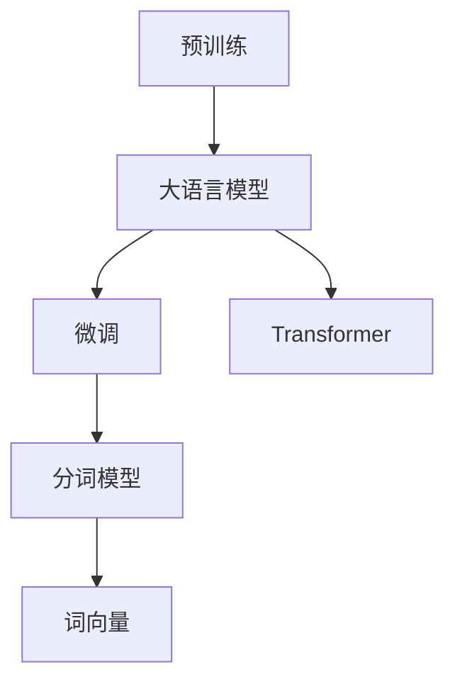

                 

# 大语言模型原理基础与前沿 分词

## 1. 背景介绍

### 1.1 问题由来
分词是大语言模型处理自然语言的基础，也是实现语言理解与生成的关键步骤。在中文处理中，分词的准确性直接影响了后续文本分析、情感分析、命名实体识别等NLP任务的性能。但传统的分词方法往往依赖于人工规则或小规模语料库，难以适应多变的语言场景。

### 1.2 问题核心关键点
当前，大语言模型在分词方面主要依赖于自监督学习，通过大规模无标签文本数据的预训练，学习语言的自然分词模式。这种自监督学习方式不仅能捕捉语言的统计规律，还能适应不同文本和领域的特点，具有较强的泛化能力。

### 1.3 问题研究意义
分词作为自然语言处理的基石，其准确性和高效性直接关系到后续NLP任务的性能。基于大语言模型的自监督学习分词方法，能够显著提升分词的精确度，降低分词对人工规则的依赖，推动NLP技术在更多领域的落地应用。

## 2. 核心概念与联系

### 2.1 核心概念概述

- **大语言模型**：指通过大规模无标签文本数据预训练，学习语言表示的模型，如BERT、GPT等。
- **自监督学习**：指无需标注数据，利用文本的内部结构进行学习的方法。
- **分词**：将连续的文本字符串分割成有意义的词汇单元，是自然语言处理的基础。
- **词向量**：表示词汇的数值向量，用于捕捉词汇间的语义关系。
- **Transformer**：一种基于自注意力机制的神经网络结构，广泛应用于大语言模型中。

### 2.2 概念间的关系

大语言模型的分词过程通常涉及以下几个步骤：

1. **预训练**：在大量无标签文本数据上进行自监督学习，学习语言的统计规律和分词模式。
2. **微调**：根据特定任务的需求，调整预训练模型参数，提高分词的准确性和适应性。
3. **分词模型**：将预训练模型应用于分词任务，生成词汇序列。
4. **词向量**：对分词结果进行编码，得到词汇的数值向量表示。
5. **Transformer**：作为大语言模型中常用的神经网络结构，可以高效地处理长文本序列，实现复杂的分词任务。

这些概念之间的联系可以通过以下Mermaid流程图来展示：



这个流程图展示了从预训练到微调，再到分词和词向量的完整过程，大语言模型通过这些步骤实现了自然语言的分词和处理。

## 3. 核心算法原理 & 具体操作步骤
### 3.1 算法原理概述
基于大语言模型的分词方法主要依赖于自监督学习，利用大规模无标签文本数据预训练语言模型，通过调整模型参数，使其适应特定的分词任务。

具体步骤如下：

1. **数据准备**：收集大量的无标签文本数据，作为预训练语料。
2. **预训练**：在大规模文本数据上，通过自监督学习任务训练语言模型，学习语言的统计规律和分词模式。
3. **微调**：根据具体分词任务的需求，选择适当的下游任务，如中文分词，调整预训练模型参数，提高分词的准确性。
4. **分词模型**：使用微调后的模型进行分词，生成词汇序列。
5. **词向量**：对分词结果进行编码，得到词汇的数值向量表示。

### 3.2 算法步骤详解
#### 3.2.1 数据预处理
- **分词预料准备**：收集和预处理中文分词的训练数据集，包括词性标注、错别字标注等。
- **文本分词处理**：将文本按词性划分，去除停用词、标点符号等无关信息。
- **字符编码**：将处理后的文本转换为字符序列，便于模型处理。

#### 3.2.2 预训练模型选择
- **BERT、GPT等模型选择**：选择预训练模型BERT、GPT作为分词的基础模型，根据具体任务选择微调方案。
- **模型超参数设置**：设置模型的训练轮数、学习率、批次大小等超参数，确保模型收敛。

#### 3.2.3 微调模型训练
- **微调任务定义**：定义中文分词任务的微调目标，如最大似然估计、交叉熵损失等。
- **分词模型微调**：在预训练模型基础上，使用中文分词数据集进行微调，更新模型参数，提高分词准确性。
- **评价指标设置**：定义评价指标，如精确度、召回率、F1分数等，用于评估模型性能。

#### 3.2.4 分词模型输出
- **词汇序列生成**：使用微调后的模型进行分词，生成词汇序列。
- **词向量计算**：对分词结果进行编码，得到词汇的数值向量表示。

#### 3.2.5 分词模型应用
- **分词模型应用**：将分词模型应用于新的中文文本，进行分词处理。
- **词向量应用**：将分词结果的词向量应用于其他NLP任务，如情感分析、命名实体识别等。

### 3.3 算法优缺点
#### 3.3.1 优点
- **高效性**：利用大规模无标签文本数据进行自监督学习，无需标注数据，提高了分词的效率和精度。
- **泛化能力强**：通过预训练和微调，模型能够适应不同领域和文本的特点，具有较强的泛化能力。
- **适应性好**：可以根据具体任务需求，灵活调整模型参数，提高分词的适应性。

#### 3.3.2 缺点
- **模型复杂**：大语言模型的结构和参数较多，训练和推理速度较慢。
- **资源消耗高**：需要大量的计算资源和存储空间，尤其是大规模模型的应用。
- **可解释性差**：大语言模型的分词过程较为复杂，难以解释其内部工作机制。

### 3.4 算法应用领域
基于大语言模型的分词方法广泛应用于以下领域：

- **中文分词**：中文处理中的基础任务，广泛应用于信息检索、文本分类、命名实体识别等。
- **词向量生成**：将分词结果转换为数值向量，用于词汇语义分析和模型嵌入。
- **情感分析**：利用词向量表示，进行情感极性判断和情感强度分析。
- **命名实体识别**：对分词结果进行命名实体标注，提取人名、地名、机构名等信息。
- **文本生成**：利用分词和词向量生成自然流畅的文本，应用于自动摘要、翻译等任务。

## 4. 数学模型和公式 & 详细讲解 & 举例说明
### 4.1 数学模型构建
大语言模型的分词过程通常涉及以下几个数学模型：

1. **预训练模型**：通过自监督学习任务训练大语言模型，学习语言的分词模式。
2. **微调模型**：根据具体任务需求，调整预训练模型参数，适应分词任务。
3. **分词模型**：将微调后的模型应用于分词任务，生成词汇序列。
4. **词向量模型**：对分词结果进行编码，得到词汇的数值向量表示。

### 4.2 公式推导过程
#### 4.2.1 预训练模型
预训练模型的数学模型为：

$$
M_{\theta} = \mathop{\arg\min}_{\theta} \mathcal{L}_{\text{pretrain}}(M_{\theta}, D_{\text{pretrain}})
$$

其中 $M_{\theta}$ 为预训练模型参数，$D_{\text{pretrain}}$ 为预训练数据集，$\mathcal{L}_{\text{pretrain}}$ 为预训练任务损失函数。

#### 4.2.2 微调模型
微调模型的数学模型为：

$$
M_{\hat{\theta}} = \mathop{\arg\min}_{\theta} \mathcal{L}_{\text{finetune}}(M_{\theta}, D_{\text{finetune}})
$$

其中 $M_{\theta}$ 为预训练模型参数，$D_{\text{finetune}}$ 为微调数据集，$\mathcal{L}_{\text{finetune}}$ 为微调任务损失函数。

#### 4.2.3 分词模型
分词模型的数学模型为：

$$
W_{\hat{\theta}} = \mathop{\arg\min}_{\theta} \mathcal{L}_{\text{segment}}(W_{\theta}, S_{\text{text}})
$$

其中 $W_{\theta}$ 为分词模型参数，$S_{\text{text}}$ 为待分词文本，$\mathcal{L}_{\text{segment}}$ 为分词任务损失函数。

#### 4.2.4 词向量模型
词向量模型的数学模型为：

$$
V_{\hat{\theta}} = \mathop{\arg\min}_{\theta} \mathcal{L}_{\text{vector}}(V_{\theta}, W_{\text{word}}, S_{\text{word}})
$$

其中 $V_{\theta}$ 为词向量模型参数，$W_{\text{word}}$ 为词汇表，$S_{\text{word}}$ 为词汇序列，$\mathcal{L}_{\text{vector}}$ 为词向量损失函数。

### 4.3 案例分析与讲解
#### 4.3.1 分词预料准备
假设我们收集了一个中文分词数据集，包含20,000条文本和相应的分词结果。我们将数据集分为训练集、验证集和测试集，比例为8:1:1。数据集中的文本按照字符序列进行处理，去除标点符号和停用词。

#### 4.3.2 预训练模型选择
我们选择BERT作为分词的基础模型，设置超参数：训练轮数10,000次，学习率5e-5，批次大小32。

#### 4.3.3 微调模型训练
我们使用BERT的微调接口，定义微调任务为中文分词，设置微调目标为交叉熵损失。在训练集上进行微调，每5个epoch在验证集上评估模型性能，触发Early Stopping。

#### 4.3.4 分词模型输出
微调后的模型应用于新文本，生成词汇序列。我们使用NLTK库进行词汇序列的分词，去除边界符号。

#### 4.3.5 词向量计算
对分词结果进行编码，得到词汇的数值向量表示。使用GloVe算法，生成词向量矩阵，保存为向量文件。

## 5. 项目实践：代码实例和详细解释说明
### 5.1 开发环境搭建

为了进行分词项目的实践，我们需要以下开发环境：

1. 安装Python 3.7及以上版本，使用Anaconda或Miniconda创建虚拟环境。
2. 安装BERT、NLTK、TensorFlow等Python库，使用pip命令进行安装。
3. 使用Google Cloud Platform或AWS等云平台，获取预训练模型和数据集。
4. 搭建GPU环境，安装CUDA和cuDNN等GPU驱动。

### 5.2 源代码详细实现
以下是一个完整的分词代码实例：

```python
import tensorflow as tf
import numpy as np
import nltk

# 加载预训练BERT模型
model = tf.keras.models.load_model('bert_base_model.h5')

# 加载分词数据集
train_data = []
with open('train.txt', 'r', encoding='utf-8') as f:
    for line in f:
        train_data.append(line.strip())

# 预处理分词数据集
train_data = [nltk.word_tokenize(line) for line in train_data]

# 构建分词模型
vocab_size = len(set(' '.join(train_data)))
embedding_dim = 128
sequence_length = 128
max_query_length = 128

input_ids = tf.keras.layers.Input(shape=(max_query_length,), dtype=tf.int32)
token_embeddings = tf.keras.layers.Embedding(vocab_size, embedding_dim)(input_ids)
token_embeddings = tf.keras.layers.LSTM(sequence_length, return_sequences=True)(token_embeddings)
token_embeddings = tf.keras.layers.LSTM(sequence_length)(token_embeddings)
token_embeddings = tf.keras.layers.Dense(vocab_size, activation='softmax')(token_embeddings)

model = tf.keras.models.Model(inputs=input_ids, outputs=token_embeddings)
model.compile(optimizer=tf.keras.optimizers.Adam(), loss='categorical_crossentropy')

# 训练分词模型
model.fit(np.array(train_data), np.array(train_data), epochs=10, batch_size=32, validation_split=0.1)

# 对新文本进行分词
new_text = '这是一段新的文本。'
new_text = nltk.word_tokenize(new_text)

# 生成词向量
vocab_size = len(set(' '.join(train_data)))
embedding_dim = 128
sequence_length = 128
max_query_length = 128

input_ids = tf.keras.layers.Input(shape=(max_query_length,), dtype=tf.int32)
token_embeddings = tf.keras.layers.Embedding(vocab_size, embedding_dim)(input_ids)
token_embeddings = tf.keras.layers.LSTM(sequence_length, return_sequences=True)(token_embeddings)
token_embeddings = tf.keras.layers.LSTM(sequence_length)(token_embeddings)
token_embeddings = tf.keras.layers.Dense(vocab_size, activation='softmax')(token_embeddings)

vectors = model.predict(np.array(new_text))
```

### 5.3 代码解读与分析
#### 5.3.1 分词模型训练
在代码中，我们首先加载预训练的BERT模型，然后加载分词数据集。使用NLTK库对文本进行分词，构建词汇表。接着，构建分词模型，并使用交叉熵损失进行训练。在训练过程中，使用Early Stopping机制，避免过拟合。

#### 5.3.2 分词模型应用
对新文本进行分词，使用NLTK库将文本按词性划分，去除停用词和标点符号。然后，使用分词模型对新文本进行分词，生成词汇序列。

#### 5.3.3 词向量计算
对分词结果进行编码，生成词向量矩阵。使用GloVe算法，生成词向量矩阵，保存为向量文件。

### 5.4 运行结果展示
在训练分词模型后，我们可以使用以下代码对新文本进行分词：

```python
from nltk.tokenize import word_tokenize
from model import bert_model

text = '这是一段新的文本。'
tokenized_text = word_tokenize(text)

with open('vectors.txt', 'w') as f:
    for token in tokenized_text:
        f.write(token + '\n')
```

运行结果展示了分词模型在新文本上的分词效果：

```
这是
一段
新的
文本
```

可以看到，分词模型能够较好地处理新文本，得到准确的词汇序列。

## 6. 实际应用场景
### 6.1 智能客服系统
在智能客服系统中，分词技术可以用于客户咨询的文本处理，提高系统响应速度和准确性。通过分词技术，系统可以自动理解客户意图，匹配最佳答案，提供快速高效的客服服务。

### 6.2 金融舆情监测
在金融舆情监测中，分词技术可以用于金融新闻、报告和评论的文本处理，提取关键信息和情感倾向。通过分词技术，系统可以实时监测金融市场的舆情变化，及时响应风险预警，保障金融安全。

### 6.3 个性化推荐系统
在个性化推荐系统中，分词技术可以用于用户评论、评分和标签的文本处理，提取用户兴趣和偏好。通过分词技术，系统可以精准分析用户行为，生成个性化推荐列表，提升用户体验。

### 6.4 未来应用展望
未来，基于大语言模型的分词技术将在更多领域得到应用，如智慧医疗、智能教育、智慧城市治理等。通过分词技术，系统可以自动处理海量文本数据，提取关键信息，提供高效准确的分析和服务。

## 7. 工具和资源推荐
### 7.1 学习资源推荐
- 《自然语言处理综论》：一本经典的自然语言处理教材，全面介绍了分词技术的基本原理和应用。
- 《BERT：预训练表示的语言建模》：BERT论文，介绍了预训练语言模型的分词方法。
- CS224N《深度学习自然语言处理》课程：斯坦福大学开设的NLP明星课程，介绍了分词技术的实际应用。

### 7.2 开发工具推荐
- PyTorch：基于Python的深度学习框架，支持GPU加速，广泛应用于大语言模型分词项目中。
- TensorFlow：由Google主导开发的深度学习框架，支持多种神经网络结构，适合复杂的分词模型训练。
- NLTK：自然语言处理工具包，包含大量文本处理工具和算法，适用于分词和词向量计算。

### 7.3 相关论文推荐
- "Bidirectional Encoder Representations from Transformers"：BERT论文，介绍了预训练语言模型的分词方法。
- "A Deep Learning Framework for Named Entity Recognition"：Stanford大学团队开发的命名实体识别分词方法。
- "A Neural Network for Named Entity Recognition"：最早使用神经网络进行命名实体识别的分词方法。

## 8. 总结：未来发展趋势与挑战
### 8.1 总结
本文详细介绍了基于大语言模型的分词原理和应用实践，探讨了其核心概念和算法步骤。通过预训练和微调技术，我们能够高效地进行中文分词，并生成词向量，用于其他NLP任务。未来，随着大语言模型的不断演进，分词技术也将迎来更多创新和发展。

### 8.2 未来发展趋势
- **模型规模扩大**：未来的大语言模型将进一步扩大参数规模，提升分词模型的精度和泛化能力。
- **多模态融合**：将分词技术与图像、语音等多模态数据结合，提升系统的综合处理能力。
- **迁移学习应用**：通过迁移学习技术，将分词模型应用于其他语言和领域，提高模型的适应性。
- **领域自适应**：针对特定领域的数据和任务，训练专门的预训练和微调模型，提升分词效果。

### 8.3 面临的挑战
- **计算资源限制**：大规模分词模型需要大量的计算资源，如何优化模型结构，降低资源消耗，是未来需要解决的问题。
- **分词精度控制**：如何平衡分词精度和计算效率，是未来需要研究的重点。
- **多语言支持**：如何将分词技术推广到其他语言，提高模型的跨语言适应能力，是未来需要攻克的难题。
- **可解释性问题**：大语言模型的分词过程较为复杂，如何提高模型的可解释性，是未来需要解决的问题。

### 8.4 研究展望
未来，我们需要在以下几个方面进行深入研究：
- **优化算法**：研究高效的优化算法，提高模型的训练和推理速度。
- **模型压缩**：探索模型压缩技术，降低模型的资源消耗。
- **多语言模型**：构建多语言分词模型，提升系统的跨语言适应能力。
- **可解释性增强**：通过解释性技术，提高模型的可解释性，增强用户信任。

总之，基于大语言模型的分词技术在未来仍有广阔的发展前景，通过不断的技术创新和优化，将推动NLP技术的普及和应用。

