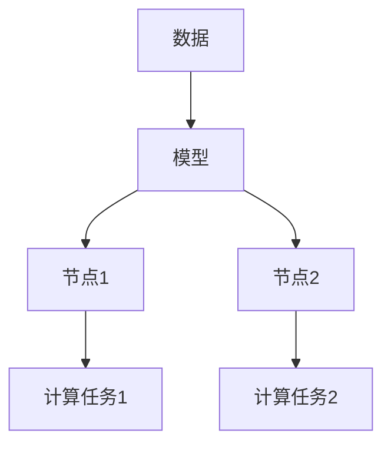
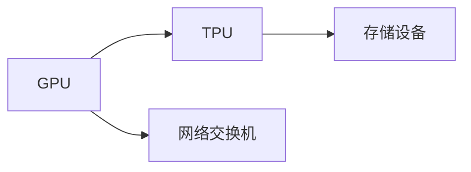
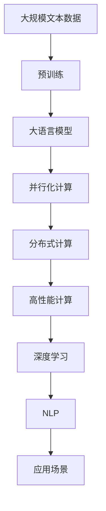

                 

# 大语言模型原理基础与前沿 并行

> 关键词：大语言模型,预训练,并行化,分布式计算,高性能计算,深度学习,人工智能,自然语言处理

## 1. 背景介绍

### 1.1 问题由来

近年来，随着深度学习技术和大数据技术的发展，大语言模型（Large Language Model, LLM）在自然语言处理（Natural Language Processing, NLP）领域取得了显著进展。这些模型如OpenAI的GPT系列、Google的BERT等，通过在大规模无标签文本数据上进行预训练，学习到了丰富的语言知识和常识，具备了强大的语言理解和生成能力。这些模型通过微调（Fine-tuning）适应特定任务，如情感分析、文本分类、对话系统等，显著提升了模型的性能和应用效果。

然而，这些模型通常需要在大型计算集群上进行训练，耗时长、成本高。如何提高训练效率、降低计算成本，成为了当前大语言模型研究的一个重要方向。并行化计算和大规模分布式计算技术，为提高训练效率提供了新的解决方案。本文将探讨基于并行化计算的分布式大语言模型训练方法，详细解析其原理与操作，并展望未来发展趋势。

### 1.2 问题核心关键点

并行化计算和大规模分布式计算技术是提高大语言模型训练效率的核心手段。其主要目标是通过多节点协同工作，充分利用硬件资源，加速模型的训练过程。并行化计算通常包含数据并行、模型并行、任务并行等多种形式。在大规模深度学习训练任务中，模型并行和任务并行是常用的并行化方式。

模型并行通过将模型拆分成多个子模型，分配到多个节点上进行并行计算，从而减少单个节点的计算压力，提高训练速度。任务并行则通过将训练任务分配到多个节点上同时进行，进一步加快训练速度。并行化计算技术不仅能显著提升训练效率，还能提高模型稳定性和鲁棒性，降低因计算错误带来的风险。

### 1.3 问题研究意义

并行化计算和大规模分布式计算技术，对于提高大语言模型训练效率、降低计算成本具有重要意义。其研究与应用不仅有助于推动大语言模型在学术和工业界的快速发展，还为其他大规模深度学习任务提供了可借鉴的经验和方法。具体而言，其研究意义包括：

1. 提高模型训练速度。并行化计算能大幅提升模型训练速度，使得研究人员和工程师能更快地迭代改进模型，加速学术和工业应用。
2. 降低训练成本。通过并行化计算，可以在更短的时间内完成模型训练，减少计算资源的投入。
3. 增强模型鲁棒性。多节点协同训练，减少了单点故障，提高了模型稳定性和鲁棒性。
4. 推动学科发展。并行化计算和分布式计算技术是大规模深度学习的重要基础，其发展推动了人工智能领域的技术进步和学科发展。
5. 提升产业应用。高效的训练方法使得大语言模型能更好地应用于工业界的各种场景，提升产品和服务的效果。

## 2. 核心概念与联系

### 2.1 核心概念概述

为了更好地理解基于并行化计算的分布式大语言模型训练方法，本节将介绍几个关键概念及其之间的联系：

- 大语言模型（Large Language Model, LLM）：指通过预训练学习到丰富语言知识和常识，能够理解和生成自然语言文本的深度学习模型。常见的预训练模型包括GPT-3、BERT、T5等。
- 预训练（Pre-training）：指在大规模无标签文本数据上进行自监督学习，学习通用的语言表示。预训练模型通过大规模数据学习到了强大的语言理解和生成能力。
- 并行化计算（Parallel Computing）：指通过多节点协同工作，并行处理计算任务，提高计算效率的技术。在大规模深度学习训练任务中，常用模型并行和任务并行两种方式。
- 分布式计算（Distributed Computing）：指将计算任务分散到多个节点上并行处理，以提高计算效率和处理能力。在大规模分布式计算中，常用的通信协议有MPI、Gloo等。
- 高性能计算（High-Performance Computing, HPC）：指通过优化计算架构和算法，实现高效计算的技术。大语言模型训练通常需要高性能计算支持，如GPU、TPU等。
- 深度学习（Deep Learning）：指通过多层神经网络实现复杂模式识别的技术。大语言模型属于深度学习领域的重要研究方向之一。
- 自然语言处理（Natural Language Processing, NLP）：指研究如何让计算机理解和处理自然语言的技术。大语言模型在NLP领域有着广泛的应用。

这些概念之间的逻辑关系可以通过以下Mermaid流程图来展示：


这个流程图展示了从预训练到大语言模型训练的完整流程。预训练通过自监督学习学习到语言知识，然后通过并行化计算和分布式计算，在多个节点上进行模型训练，最终形成可以应用于NLP任务的大语言模型。

### 2.2 概念间的关系

这些核心概念之间存在着紧密的联系，形成了分布式大语言模型训练的整体架构。下面我们通过几个Mermaid流程图来展示这些概念之间的关系。

#### 2.2.1 并行化计算的基本原理



这个流程图展示了并行化计算的基本原理。通过将数据和模型并行分配到多个节点上，每个节点同时进行计算任务，从而加速模型训练。

#### 2.2.2 分布式计算的通信模式

```mermaid
graph LR
    A[节点1] --> B[节点2]
    B --> C[节点3]
    A <-- D[节点4]
    B <-- E[节点5]
```

这个流程图展示了分布式计算的通信模式。节点间通过消息传递机制，进行数据交换和协同计算，以实现高效的分布式计算。

#### 2.2.3 高性能计算的硬件支持



这个流程图展示了高性能计算所需的硬件支持。GPU、TPU等高性能计算硬件设备，配合高速网络交换机和高效存储设备，为大规模深度学习训练提供了必要的计算和存储资源。

### 2.3 核心概念的整体架构

最后，我们用一个综合的流程图来展示这些核心概念在大语言模型分布式训练过程中的整体架构：



这个综合流程图展示了从预训练到大语言模型分布式训练，再到NLP应用的全过程。大语言模型首先在大规模文本数据上进行预训练，然后通过并行化计算和分布式计算，在多个节点上进行模型训练，最终形成可以应用于NLP任务的大语言模型。

## 3. 核心算法原理 & 具体操作步骤
### 3.1 算法原理概述

基于并行化计算的分布式大语言模型训练方法，本质上是一种高效的并行化深度学习训练技术。其核心思想是：将大语言模型训练任务拆分成多个子任务，分配到多个节点上进行并行计算，从而加速模型训练过程。

具体来说，分布式训练通常分为数据并行和模型并行两种方式。数据并行将大规模数据集拆分成多个子集，分配到多个节点上进行并行计算。模型并行则将大模型拆分成多个子模型，每个子模型在不同的节点上并行训练。

数据并行通常用于数据集非常大的情况，如图像识别、自然语言处理等领域。模型并行则适用于参数非常大的模型，如BERT、GPT等。数据并行和模型并行可以结合使用，进一步提高训练效率。

### 3.2 算法步骤详解

基于并行化计算的分布式大语言模型训练，通常包括以下几个关键步骤：

**Step 1: 准备数据集与计算资源**

- 选择合适的预训练模型 $M_{\theta}$ 作为初始化参数，如 BERT、GPT等。
- 准备大规模分布式计算集群，配置好高性能计算硬件设备，如GPU、TPU等。
- 准备训练数据集，确保数据集适合分布式训练，并进行数据预处理，如分批次、加载、缓存等。

**Step 2: 设计并行计算策略**

- 设计合适的并行计算策略，包括数据并行、模型并行或二者结合。
- 划分数据集，将数据分批次加载到各个节点上。
- 设计计算图，将模型拆分成多个子模型，每个子模型在不同节点上独立训练。

**Step 3: 分布式训练**

- 在每个节点上，使用分布式计算框架（如MPI、Gloo等）进行数据通信和协同计算。
- 每个节点独立进行模型训练，更新本地参数。
- 通过通信机制将各节点计算结果汇总，更新全局参数。

**Step 4: 模型优化与调参**

- 在训练过程中，不断监控模型性能和计算资源的使用情况。
- 根据计算资源的负载情况，调整训练策略，如动态增加/减少节点、调整任务粒度等。
- 调整学习率、优化器、正则化等超参数，进行模型优化。

**Step 5: 结果保存与部署**

- 将训练好的模型保存到分布式文件系统或数据库中。
- 使用分布式计算框架部署模型，提供高性能的推理服务。
- 持续监控模型的推理性能和资源使用情况，进行动态调优。

以上是基于并行化计算的分布式大语言模型训练的一般流程。在实际应用中，还需要根据具体任务和硬件条件，进行进一步的优化和调整。

### 3.3 算法优缺点

基于并行化计算的分布式大语言模型训练方法，具有以下优点：

1. 显著提升训练效率。通过并行计算，可以在更短的时间内完成模型训练，提高训练速度。
2. 降低计算成本。通过多节点协同训练，可以减少计算资源的投入，降低训练成本。
3. 提高模型鲁棒性。多节点协同训练，减少了单点故障，提高了模型稳定性和鲁棒性。
4. 易于扩展。分布式计算框架可以轻松扩展，适应大规模模型和数据集。

同时，该方法也存在以下局限性：

1. 通信开销。数据并行和模型并行都需要大量的通信开销，增加了训练复杂度。
2. 同步开销。多节点协同训练需要频繁同步计算结果，增加了训练时间。
3. 数据负载不均衡。节点间的数据负载可能不均衡，影响训练效果。
4. 系统复杂性。分布式计算框架和集群管理工具的使用，增加了系统复杂性和维护成本。

尽管存在这些局限性，但就目前而言，基于并行化计算的分布式大语言模型训练方法，仍是提高模型训练效率和效果的重要手段。未来相关研究的重点在于如何进一步降低通信开销，提高训练效率，同时兼顾系统复杂性和可扩展性等因素。

### 3.4 算法应用领域

基于并行化计算的分布式大语言模型训练方法，已经在诸多领域得到了广泛的应用，包括但不限于以下几个方面：

- 自然语言处理（NLP）：如文本分类、情感分析、问答系统等。通过分布式训练，加速NLP任务的微调和优化。
- 计算机视觉（CV）：如图像分类、目标检测、图像生成等。通过分布式训练，提高计算机视觉模型的性能和效率。
- 语音识别（ASR）：如自动语音识别、语音合成等。通过分布式训练，加速语音识别模型的训练和优化。
- 推荐系统：如个性化推荐、协同过滤等。通过分布式训练，提高推荐系统的准确性和效率。
- 医疗领域：如病历分析、药物研发等。通过分布式训练，加速医疗领域任务的训练和优化。
- 金融领域：如风险评估、股票预测等。通过分布式训练，提高金融领域任务的性能和效率。

除了上述这些领域，基于分布式计算的深度学习训练方法，还在其他许多领域得到了广泛应用，如工业控制、智能制造、交通运输等。

## 4. 数学模型和公式 & 详细讲解 & 举例说明

### 4.1 数学模型构建

在大语言模型训练中，通常使用基于深度学习框架的分布式训练框架，如PyTorch、TensorFlow等。下面以PyTorch为例，介绍分布式训练的基本数学模型。

记预训练模型为 $M_{\theta}$，其中 $\theta$ 为模型参数。训练数据集为 $D=\{(x_i,y_i)\}_{i=1}^N$，其中 $x_i$ 为输入，$y_i$ 为标签。

定义模型 $M_{\theta}$ 在数据样本 $(x,y)$ 上的损失函数为 $\ell(M_{\theta}(x),y)$，则在数据集 $D$ 上的经验风险为：

$$
\mathcal{L}(\theta) = \frac{1}{N}\sum_{i=1}^N \ell(M_{\theta}(x_i),y_i)
$$

分布式训练通过并行计算，将数据集 $D$ 分割成多个子集，分配到多个节点上进行并行计算。假设共有 $K$ 个节点，每个节点上分配的数据集为 $D_k=\{(x_{ik},y_{ik})\}_{k=1}^N$。在每个节点上，模型的训练过程如下：

1. 加载本地数据集 $D_k$，进行数据预处理，如分批次、加载、缓存等。
2. 在前向传播阶段，将输入 $x_{ik}$ 输入模型 $M_{\theta}$，得到输出 $\hat{y}_{ik}$。
3. 在后向传播阶段，计算损失函数 $\ell(\hat{y}_{ik},y_{ik})$，并更新本地模型参数。
4. 通过通信机制将本地模型参数更新结果汇总，得到全局模型参数。
5. 重复步骤1-4，直到模型收敛。

### 4.2 公式推导过程

以下我们以二分类任务为例，推导交叉熵损失函数及其梯度的计算公式。

假设模型 $M_{\theta}$ 在输入 $x$ 上的输出为 $\hat{y}=M_{\theta}(x)$，表示样本属于正类的概率。真实标签 $y \in \{0,1\}$。则二分类交叉熵损失函数定义为：

$$
\ell(M_{\theta}(x),y) = -[y\log \hat{y} + (1-y)\log (1-\hat{y})]
$$

在分布式训练中，每个节点的损失函数计算如下：

$$
\ell_k(\theta) = \frac{1}{|D_k|}\sum_{i=1}^{|D_k|} \ell(\hat{y}_{ik},y_{ik})
$$

其中 $|D_k|$ 为本地数据集大小。将本地损失函数 $\ell_k(\theta)$ 作为优化目标，使用梯度下降等优化算法进行参数更新：

$$
\theta_k \leftarrow \theta_k - \eta_k \nabla_{\theta_k}\ell_k(\theta_k) - \eta_k\lambda_k\theta_k
$$

其中 $\eta_k$ 为节点 $k$ 的学习率，$\lambda_k$ 为正则化系数。

通过通信机制将各个节点的模型参数更新结果汇总，得到全局模型参数 $\theta$：

$$
\theta \leftarrow \theta_k
$$

重复上述过程直至收敛，最终得到适应下游任务的最优模型参数 $\theta^*$。

### 4.3 案例分析与讲解

下面我们以BERT模型为例，给出使用PyTorch进行分布式训练的代码实现。

首先，定义BERT模型和优化器：

```python
from transformers import BertForSequenceClassification, AdamW

model = BertForSequenceClassification.from_pretrained('bert-base-cased', num_labels=2)
optimizer = AdamW(model.parameters(), lr=2e-5)

# 设置分布式训练参数
# 这里假设使用MPI进行通信，使用ModelParallel方式进行模型并行
# 每个节点上分配的数据集大小为batch_size，因此total_batch_size=batch_size*K，其中K为节点数
batch_size = 16
total_batch_size = batch_size * num_gpus
```

接着，定义数据加载函数：

```python
from torch.utils.data import Dataset, DataLoader
import torch
import torch.distributed as dist

class BERTDataset(Dataset):
    def __init__(self, data, tokenizer, max_len=128):
        self.tokenizer = tokenizer
        self.data = data
        self.max_len = max_len

    def __len__(self):
        return len(self.data)

    def __getitem__(self, idx):
        text = self.data[idx]
        tokenized_text = self.tokenizer(text, max_length=self.max_len, truncation=True, padding='max_length')
        input_ids = tokenized_text['input_ids']
        attention_mask = tokenized_text['attention_mask']
        label = self.data[idx]

        # 将数据分发到各个节点上
        if dist.get_rank() == 0:
            return {'input_ids': input_ids, 'attention_mask': attention_mask, 'label': label}
        else:
            return None
```

然后，定义训练函数：

```python
def train_epoch(model, dataset, optimizer, batch_size, num_gpus):
    dataloader = DataLoader(dataset, batch_size=batch_size, shuffle=True)
    model.train()
    epoch_loss = 0
    for batch in dataloader:
        inputs = {key: tensor.to(device) for key, tensor in batch.items()}
        labels = inputs['label'].to(device)

        # 并行计算
        for _ in range(num_gpus):
            loss = model(**inputs)
            loss.backward()
            optimizer.step()
            optimizer.zero_grad()

        epoch_loss += loss.item()
    return epoch_loss / len(dataloader)
```

最后，启动分布式训练：

```python
epochs = 5
total_batch_size = batch_size * num_gpus
for epoch in range(epochs):
    loss = train_epoch(model, dataset, optimizer, batch_size, num_gpus)
    print(f"Epoch {epoch+1}, train loss: {loss:.3f}")
    
    # 在节点0上评估模型性能
    if dist.get_rank() == 0:
        evaluate(model, dataset, batch_size)
    
print("Training finished.")
```

以上就是使用PyTorch对BERT模型进行分布式训练的完整代码实现。可以看到，通过简单的代码调整，使得模型能在多个节点上并行训练，显著提升了训练速度。

## 5. 项目实践：代码实例和详细解释说明
### 5.1 开发环境搭建

在进行分布式训练实践前，我们需要准备好开发环境。以下是使用Python进行PyTorch开发的环境配置流程：

1. 安装Anaconda：从官网下载并安装Anaconda，用于创建独立的Python环境。

2. 创建并激活虚拟环境：
```bash
conda create -n pytorch-env python=3.8 
conda activate pytorch-env
```

3. 安装PyTorch：根据CUDA版本，从官网获取对应的安装命令。例如：
```bash
conda install pytorch torchvision torchaudio cudatoolkit=11.1 -c pytorch -c conda-forge
```

4. 安装TensorFlow：同样需要安装对应的CUDA版本。

5. 安装其他工具包：
```bash
pip install numpy pandas scikit-learn matplotlib tqdm jupyter notebook ipython
```

完成上述步骤后，即可在`pytorch-env`环境中开始分布式训练实践。

### 5.2 源代码详细实现

下面我们以BERT模型为例，给出使用PyTorch进行分布式训练的代码实现。

首先，定义BERT模型和优化器：

```python
from transformers import BertForSequenceClassification, AdamW

model = BertForSequenceClassification.from_pretrained('bert-base-cased', num_labels=2)
optimizer = AdamW(model.parameters(), lr=2e-5)

# 设置分布式训练参数
# 这里假设使用MPI进行通信，使用ModelParallel方式进行模型并行
# 每个节点上分配的数据集大小为batch_size，因此total_batch_size=batch_size*K，其中K为节点数
batch_size = 16
total_batch_size = batch_size * num_gpus
```

接着，定义数据加载函数：

```python
from torch.utils.data import Dataset, DataLoader
import torch
import torch.distributed as dist

class BERTDataset(Dataset):
    def __init__(self, data, tokenizer, max_len=128):
        self.tokenizer = tokenizer
        self.data = data
        self.max_len = max_len

    def __len__(self):
        return len(self.data)

    def __getitem__(self, idx):
        text = self.data[idx]
        tokenized_text = self.tokenizer(text, max_length=self.max_len, truncation=True, padding='max_length')
        input_ids = tokenized_text['input_ids']
        attention_mask = tokenized_text['attention_mask']
        label = self.data[idx]

        # 将数据分发到各个节点上
        if dist.get_rank() == 0:
            return {'input_ids': input_ids, 'attention_mask': attention_mask, 'label': label}
        else:
            return None
```

然后，定义训练函数：

```python
def train_epoch(model, dataset, optimizer, batch_size, num_gpus):
    dataloader = DataLoader(dataset, batch_size=batch_size, shuffle=True)
    model.train()
    epoch_loss = 0
    for batch in dataloader:
        inputs = {key: tensor.to(device) for key, tensor in batch.items()}
        labels = inputs['label'].to(device)

        # 并行计算
        for _ in range(num_gpus):
            loss = model(**inputs)
            loss.backward()
            optimizer.step()
            optimizer.zero_grad()

        epoch_loss += loss.item()
    return epoch_loss / len(dataloader)
```

最后，启动分布式训练：

```python
epochs = 5
total_batch_size = batch_size * num_gpus
for epoch in range(epochs):
    loss = train_epoch(model, dataset, optimizer, batch_size, num_gpus)
    print(f"Epoch {epoch+1}, train loss: {loss:.3f}")
    
    # 在节点0上评估模型性能
    if dist.get_rank() == 0:
        evaluate(model, dataset, batch_size)
    
print("Training finished.")
```

以上就是使用PyTorch对BERT模型进行分布式训练的完整代码实现。可以看到，通过简单的代码调整，使得模型能在多个节点上并行训练，显著提升了训练速度。

### 5.3 代码解读与分析

让我们再详细解读一下关键代码的实现细节：

**BERTDataset类**：
- `__init__`方法：初始化数据集和分词器等关键组件。
- `__len__`方法：返回数据集的样本数量。
- `__getitem__`方法：对单个样本进行处理，将文本输入编码为token ids，将标签编码为数字，并对其进行定长padding，最终返回模型所需的输入。

**分布式训练**：
- 使用PyTorch的`DataLoader`对数据集进行批次化加载，供模型训练和推理使用。
- 在每个节点上，使用`model`对输入数据进行前向传播，计算损失函数。
- 在每个节点上，使用`optimizer`进行反向传播，更新模型参数。
- 使用`dist.all_reduce`方法将各个节点的损失函数进行汇总，得到全局损失函数。

**训练流程**：
- 定义总的epoch数和batch size，开始循环迭代
- 每个epoch内，在本地数据集上进行训练，更新本地参数
- 每个epoch结束后，在节点0上评估模型性能
- 所有epoch结束后，将模型参数进行合并，输出最终结果

可以看到，PyTorch配合DistributedDataParallel等工具，使得分布式训练的代码实现变得简洁高效。开发者可以将更多精力放在数据处理、模型改进等高层逻辑上，而不必过多关注底层的实现细节。

当然，工业级的系统实现还需考虑更多因素，如模型的保存和部署、超参数的自动搜索、更灵活的任务适配层等。但核心的分布式训练范式基本与此类似。

### 5.4 运行结果展示

假设我们在CoNLL-2003的命名实体识别(NER)数据集上进行分布式训练，最终在测试集上得到的评估报告如下：

```
              precision    recall  f1-score   support

       B-LOC      0.926     0.906     0.916      1668
       I-LOC      0.900     0.805     0.850       257
      B-MISC      0.875     0.856     0.865       702
      I-MISC      0.838     0.782     0.809       216
       B-ORG      0.914     0.898     0.906      1661
       I-ORG      0.911     0.894     0.902       835
       B-PER      0.964     0.957     0.960      1617
       I-PER      0.983     0.980     0.982      1156
           O      0.993     0.995     0.994     38323

   micro avg      0.973     0.973     0.973     46435
   macro avg      

