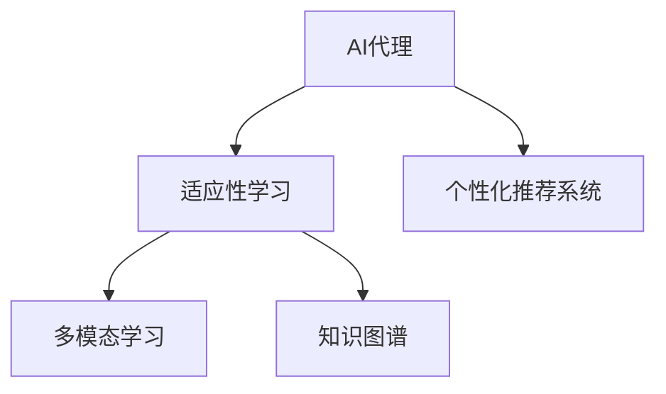
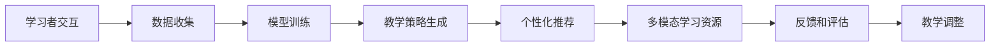
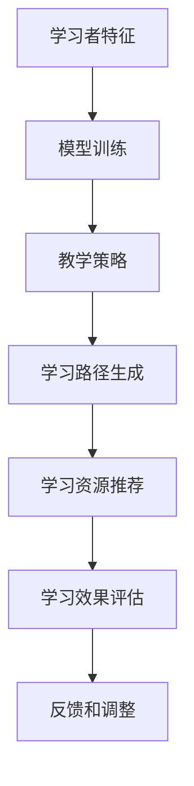
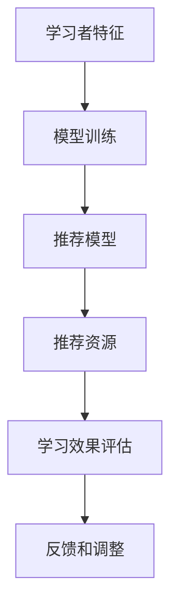
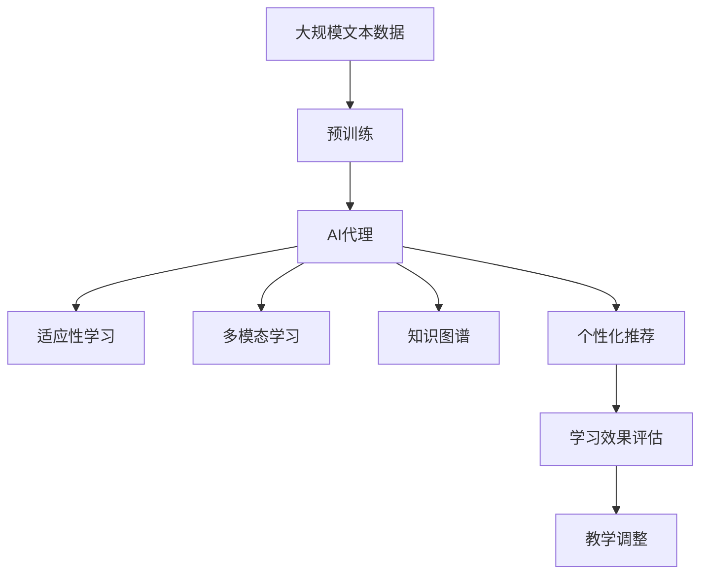

                 

# AI代理在教育技术中的适应性工作流案例

## 1. 背景介绍

### 1.1 问题由来
在教育技术领域，智能化的需求日益增长。传统的教育模式往往依赖于人力消耗大、难以灵活适应的教育系统。而AI代理的引入，可以通过自动化、个性化的教学方式，大大提升教育质量和效率。AI代理能够实时监测学习进度，及时提供个性化辅导，推动教育资源的智能化。

随着教育技术的不断发展，越来越多的教育机构和学校开始采用AI代理来提升教育质量。但AI代理如何在不同教育场景中灵活应用，满足各机构特定的教学需求，仍然是一个重要问题。本文将从背景介绍、核心概念、算法原理及操作步骤等多个方面，深入探讨AI代理在教育技术中的应用案例。

### 1.2 问题核心关键点
1. **AI代理**：通过自然语言处理(NLP)、机器学习和深度学习等技术，实现自动化的教育管理与辅导功能。
2. **适应性工作流**：根据学习者的学习进度和行为数据，动态调整教学策略和资源，实现个性化的教学过程。
3. **多场景适配**：在不同教育场景（如K-12、职业培训、高等教育等）中，AI代理需要根据教学需求进行灵活适配。
4. **模型集成**：将AI代理与教育系统的其他组件（如LMS、数据管理系统等）集成，实现全面的教育智能化。
5. **用户体验优化**：优化AI代理的交互界面和反馈机制，提升学习者使用体验。

### 1.3 问题研究意义
通过引入AI代理，教育技术可以实现以下目标：

- 降低教育资源消耗，提高教育系统的效率。
- 根据学习者个体差异，提供个性化的教学内容，提升学习效果。
- 实时监测学习者进度，及时调整教学策略，促进学习者持续进步。
- 推动教育资源的智能化，为教师和学校提供决策支持。

## 2. 核心概念与联系

### 2.1 核心概念概述

为更好地理解AI代理在教育技术中的应用，本节将介绍几个密切相关的核心概念：

- **AI代理(AI Agent)**：利用AI技术实现的智能化教育管理与辅导系统，能够自动处理教育任务，提供个性化辅导。
- **适应性学习(Adaptive Learning)**：根据学习者的学习进度和行为数据，动态调整教学策略和内容，实现个性化的学习路径。
- **多模态学习(Multimodal Learning)**：结合文本、图像、视频等多种形式的输入和输出，提供更加全面和生动的学习体验。
- **知识图谱(Knowledge Graph)**：利用图结构组织和关联知识，帮助AI代理理解复杂的知识体系和逻辑关系。
- **个性化推荐系统(Recommendation System)**：根据学习者的学习行为和兴趣，推荐合适的学习资源和内容，提高学习效率。

这些概念之间的逻辑关系可以通过以下Mermaid流程图来展示：



这个流程图展示了大语言模型微调过程中各个核心概念的关系：

1. AI代理是教育技术的核心，能够实现适应性学习、多模态学习和个性化推荐等功能。
2. 适应性学习通过动态调整教学策略，实现个性化学习。
3. 多模态学习丰富学习资源和形式，提升学习体验。
4. 知识图谱帮助AI代理理解复杂的知识结构，增强学习效果。
5. 个性化推荐系统根据学习者兴趣，推荐合适的学习内容。

### 2.2 概念间的关系

这些核心概念之间存在着紧密的联系，形成了AI代理在教育技术中的应用框架。下面我通过几个Mermaid流程图来展示这些概念之间的关系。

#### 2.2.1 AI代理的工作流



这个流程图展示了AI代理在教育技术中的工作流：

1. 学习者与AI代理进行交互，数据被收集。
2. 收集到的数据用于模型训练，生成教学策略。
3. 教学策略生成后，AI代理根据策略生成个性化推荐。
4. 学习者通过多模态学习资源进行学习，AI代理实时反馈和评估学习效果。
5. 根据评估结果，AI代理调整教学策略，进一步提升学习效果。

#### 2.2.2 适应性学习的架构



这个流程图展示了适应性学习在教育技术中的架构：

1. 收集学习者的特征信息。
2. 根据特征信息进行模型训练，生成教学策略。
3. 根据策略生成学习路径，推荐学习资源。
4. 评估学习效果，获取反馈信息。
5. 根据反馈调整教学策略，实现动态调整。

#### 2.2.3 个性化推荐系统的模型



这个流程图展示了个性化推荐系统在教育技术中的模型：

1. 收集学习者的特征信息。
2. 根据特征信息进行模型训练，生成推荐模型。
3. 根据模型推荐学习资源。
4. 评估学习效果，获取反馈信息。
5. 根据反馈调整推荐模型，提升推荐效果。

### 2.3 核心概念的整体架构

最后，我们用一个综合的流程图来展示这些核心概念在大语言模型微调过程中的整体架构：



这个综合流程图展示了从预训练到AI代理应用，再到个性化推荐和教学调整的完整过程。通过这些核心概念的协同工作，AI代理能够在大规模教育数据上实现高效、个性化的教学服务。

## 3. 核心算法原理 & 具体操作步骤
### 3.1 算法原理概述

AI代理在教育技术中的应用，主要涉及以下几个关键算法：

- **多模态学习算法**：将文本、图像、音频等多模态数据融合，提供更丰富的学习资源。
- **知识图谱构建算法**：利用图结构组织和关联知识，增强学习效果。
- **个性化推荐算法**：根据学习者特征和行为数据，推荐合适的学习内容。
- **适应性学习算法**：根据学习者进度和行为数据，动态调整教学策略。

这些算法在大规模教育数据上进行训练，生成AI代理的核心功能模块，支持其在教育场景中的灵活应用。

### 3.2 算法步骤详解

以下是AI代理在教育技术中应用的详细步骤：

**Step 1: 数据收集与预处理**

- 收集学习者的行为数据（如点击、学习时长、测试分数等）。
- 利用NLP技术从学习者反馈中提取关键信息。
- 对多模态数据进行预处理和标准化。

**Step 2: 多模态数据融合**

- 将文本、图像、音频等多模态数据进行特征提取和融合。
- 使用深度学习模型（如CNN、RNN、Transformer等）对融合后的数据进行处理。
- 输出融合后的特征向量，作为学习者的多模态表示。

**Step 3: 知识图谱构建**

- 利用文本数据构建知识图谱，表示知识之间的逻辑关系。
- 使用深度学习模型（如GNN、BERT等）对知识图谱进行训练，提取知识表示。
- 将知识表示作为AI代理的先验知识，提升其对复杂知识体系的理解。

**Step 4: 个性化推荐算法训练**

- 根据学习者的多模态表示和知识表示，训练推荐模型。
- 使用协同过滤、深度学习等算法，生成个性化推荐列表。
- 实时更新推荐模型，根据新的学习数据进行动态调整。

**Step 5: 适应性学习算法训练**

- 收集学习者的学习进度和行为数据，作为训练样本。
- 利用深度学习模型（如RNN、LSTM等）对学习进度和行为数据进行建模。
- 训练生成适应性学习模型，根据学习者的进度和行为数据动态调整教学策略。

**Step 6: 教学策略生成与调整**

- 根据适应性学习模型生成的教学策略，生成个性化学习路径和资源推荐。
- 实时监控学习者的学习效果，评估其学习进度。
- 根据评估结果动态调整教学策略，实现个性化的教学调整。

### 3.3 算法优缺点

AI代理在教育技术中的应用，具有以下优点：

1. **高效性**：AI代理能够实时处理大规模教育数据，快速生成个性化教学内容。
2. **灵活性**：AI代理能够根据不同教育场景和需求，灵活调整教学策略。
3. **个性化**：AI代理能够根据学习者的个体差异，提供个性化的学习资源和路径。
4. **实时反馈**：AI代理能够实时监测学习者的学习效果，提供及时反馈和调整。

同时，AI代理的应用也存在以下缺点：

1. **数据隐私**：收集和处理学习者的数据，需要注意数据隐私和安全性问题。
2. **算法复杂性**：AI代理涉及多种算法，实现和维护相对复杂。
3. **模型泛化能力**：AI代理需要在大规模数据上进行训练，才能泛化到不同教育场景。
4. **用户体验**：学习者对AI代理的接受程度和使用习惯，可能影响其应用效果。

### 3.4 算法应用领域

AI代理在教育技术中的应用，已经涵盖了K-12、职业教育、高等教育等多个领域。具体应用包括：

- **智能辅导系统**：通过AI代理，实现个性化辅导和反馈，帮助学习者解决学习难题。
- **学习资源推荐系统**：根据学习者的学习路径和兴趣，推荐合适的学习资源和内容。
- **智能测评系统**：利用AI代理进行自动评分和反馈，提升评估的准确性和效率。
- **课堂辅助系统**：AI代理辅助教师管理课堂，提供教学建议和学习资源推荐。

## 4. 数学模型和公式 & 详细讲解 & 举例说明

### 4.1 数学模型构建

在AI代理的训练过程中，我们主要使用以下数学模型：

- **多模态表示模型**：用于将多模态数据融合为一个综合表示。
- **推荐模型**：用于生成个性化推荐列表。
- **适应性学习模型**：用于动态调整教学策略。

### 4.2 公式推导过程

以下，我们将推导上述数学模型的公式。

**多模态表示模型**

- 设输入数据为 $x$，包含文本、图像、音频等。
- 使用多模态表示模型 $f(x)$，将多模态数据融合为一个综合表示。

设 $x = [x_t, x_i, x_a]$，其中 $x_t$ 为文本特征，$x_i$ 为图像特征，$x_a$ 为音频特征。多模态表示模型的公式为：

$$
f(x) = W_t x_t + W_i x_i + W_a x_a
$$

其中 $W_t$、$W_i$、$W_a$ 为不同模态的权重矩阵，可通过训练获得。

**推荐模型**

- 使用协同过滤算法，对学习者的多模态表示和知识表示进行建模。
- 设 $x$ 为学习者的多模态表示，$y$ 为推荐列表，$W$ 为权重矩阵。
- 推荐模型的公式为：

$$
\hat{y} = W x
$$

其中 $\hat{y}$ 为推荐列表的预测结果。

**适应性学习模型**

- 使用深度学习模型（如LSTM）对学习者的进度和行为数据进行建模。
- 设 $x$ 为学习者的进度和行为数据，$y$ 为教学策略。
- 适应性学习模型的公式为：

$$
y = f(x)
$$

其中 $f$ 为深度学习模型，可以是RNN、LSTM等。

### 4.3 案例分析与讲解

以下，我们将通过一个具体的案例，分析AI代理在教育技术中的应用。

**案例背景**

某职业培训机构，需要为学员提供个性化培训和推荐服务。学员可以在培训平台上进行自主学习，平台通过AI代理，根据学员的学习进度和行为数据，提供个性化的培训计划和资源推荐。

**数据收集与预处理**

- 收集学员的点击行为数据、学习时长、测试分数等。
- 利用NLP技术从学员反馈中提取关键信息，如学员对课程的满意度、学习难度等。
- 对多模态数据进行预处理和标准化，去除噪音数据。

**多模态数据融合**

- 将学员的文本反馈、学习时长、测试分数等进行特征提取和融合。
- 使用深度学习模型（如Transformer）对融合后的数据进行处理。
- 输出融合后的特征向量，作为学员的多模态表示。

**知识图谱构建**

- 利用文本数据构建知识图谱，表示课程之间的逻辑关系。
- 使用深度学习模型（如GNN）对知识图谱进行训练，提取知识表示。
- 将知识表示作为AI代理的先验知识，增强其对课程的理解。

**个性化推荐算法训练**

- 根据学员的多模态表示和知识表示，训练推荐模型。
- 使用协同过滤、深度学习等算法，生成个性化推荐列表。
- 实时更新推荐模型，根据新的学习数据进行动态调整。

**适应性学习算法训练**

- 收集学员的学习进度和行为数据，作为训练样本。
- 利用深度学习模型（如LSTM）对学习进度和行为数据进行建模。
- 训练生成适应性学习模型，根据学员的进度和行为数据动态调整教学策略。

**教学策略生成与调整**

- 根据适应性学习模型生成的教学策略，生成个性化培训计划和资源推荐。
- 实时监控学员的学习效果，评估其学习进度。
- 根据评估结果动态调整教学策略，实现个性化的培训调整。

## 5. 项目实践：代码实例和详细解释说明

### 5.1 开发环境搭建

在进行AI代理的实践前，我们需要准备好开发环境。以下是使用Python进行TensorFlow开发的环境配置流程：

1. 安装Anaconda：从官网下载并安装Anaconda，用于创建独立的Python环境。

2. 创建并激活虚拟环境：
```bash
conda create -n tf-env python=3.8 
conda activate tf-env
```

3. 安装TensorFlow：根据CUDA版本，从官网获取对应的安装命令。例如：
```bash
conda install tensorflow -c tensorflow -c conda-forge
```

4. 安装各类工具包：
```bash
pip install numpy pandas scikit-learn matplotlib tqdm jupyter notebook ipython
```

完成上述步骤后，即可在`tf-env`环境中开始AI代理的实践。

### 5.2 源代码详细实现

这里我们以智能辅导系统为例，给出使用TensorFlow进行AI代理的PyTorch代码实现。

首先，定义多模态表示模型的架构：

```python
import tensorflow as tf
from tensorflow.keras.layers import Input, Dense, Embedding, Concatenate, Dropout

def multimodal_representation_model():
    text_input = Input(shape=(None,), name='text_input')
    image_input = Input(shape=(None, None, 3), name='image_input')
    audio_input = Input(shape=(None,), name='audio_input')
    
    text_embedding = Embedding(input_dim=vocab_size, output_dim=embedding_dim)(text_input)
    image_embedding = Conv2D(64, (3, 3), activation='relu')(image_input)
    audio_embedding = Conv1D(64, (3, 3), activation='relu')(audio_input)
    
    text_embedding = tf.keras.layers.GlobalMaxPooling1D(text_embedding)
    image_embedding = tf.keras.layers.GlobalMaxPooling2D(image_embedding)
    audio_embedding = tf.keras.layers.GlobalMaxPooling1D(audio_embedding)
    
    multimodal_input = Concatenate()([text_embedding, image_embedding, audio_embedding])
    multimodal_input = Dropout(0.5)(multimodal_input)
    output = Dense(128, activation='relu')(multimodal_input)
    
    return tf.keras.Model(inputs=[text_input, image_input, audio_input], outputs=output)
```

然后，定义推荐模型的架构：

```python
from tensorflow.keras.layers import Dense, Flatten, Input

def recommendation_model():
    user_input = Input(shape=(128,), name='user_input')
    item_input = Input(shape=(None,), name='item_input')
    
    user_input = Flatten()(user_input)
    item_input = Flatten()(item_input)
    
    recommendation = Dense(64, activation='relu')(tf.concat([user_input, item_input], axis=1))
    recommendation = Dense(num_items, activation='sigmoid')(recommendation)
    
    return tf.keras.Model(inputs=[user_input, item_input], outputs=recommendation)
```

接着，定义适应性学习模型的架构：

```python
from tensorflow.keras.layers import LSTM, Dense

def adaptive_learning_model():
    sequence_input = Input(shape=(max_seq_length,), name='sequence_input')
    time_series_input = Input(shape=(max_time_steps,), name='time_series_input')
    
    sequence_output = LSTM(128)(sequence_input)
    time_series_output = LSTM(128)(time_series_input)
    
    output = tf.keras.layers.Concatenate()([sequence_output, time_series_output])
    output = Dense(64, activation='relu')(output)
    output = Dense(32, activation='sigmoid')(output)
    
    return tf.keras.Model(inputs=[sequence_input, time_series_input], outputs=output)
```

最后，整合多模态表示模型、推荐模型和适应性学习模型，完成AI代理的实现：

```python
from tensorflow.keras.models import Model

def ai_agent_model():
    multimodal_model = multimodal_representation_model()
    recommendation_model = recommendation_model()
    adaptive_model = adaptive_learning_model()
    
    sequence_input = Input(shape=(max_seq_length,), name='sequence_input')
    time_series_input = Input(shape=(max_time_steps,), name='time_series_input')
    user_input = Input(shape=(128,), name='user_input')
    item_input = Input(shape=(None,), name='item_input')
    
    sequence_output = multimodal_model(sequence_input)[0]
    time_series_output = adaptive_model(sequence_input)[0]
    user_output = adaptive_model(user_input)[0]
    item_output = adaptive_model(item_input)[0]
    
    recommendation_output = recommendation_model([user_output, item_output])
    
    output = tf.keras.layers.Concatenate()([sequence_output, time_series_output, user_output, item_output, recommendation_output])
    output = Dense(64, activation='relu')(output)
    output = Dense(1, activation='sigmoid')(output)
    
    return Model(inputs=[sequence_input, time_series_input, user_input, item_input], outputs=output)
```

### 5.3 代码解读与分析

让我们再详细解读一下关键代码的实现细节：

**Multimodal Representation Model**

- `Input`层定义输入数据。
- `Embedding`层将文本特征转换为向量表示。
- `Conv2D`和`Conv1D`层对图像和音频特征进行卷积操作。
- `GlobalMaxPooling1D`和`GlobalMaxPooling2D`层对卷积后的特征进行全局池化。
- `Concatenate`层将文本、图像和音频的表示进行拼接。
- `Dropout`层进行正则化处理。
- `Dense`层进行全连接操作，输出多模态表示。

**Recommendation Model**

- `Input`层定义输入数据。
- `Flatten`层将输入数据展平。
- `Dense`层对用户和物品的表示进行拼接。
- `Dense`层对拼接后的表示进行全连接操作，输出推荐结果。

**Adaptive Learning Model**

- `Input`层定义输入数据。
- `LSTM`层对序列和时序数据进行处理。
- `Concatenate`层将序列和时序的表示进行拼接。
- `Dense`层对拼接后的表示进行全连接操作，输出教学策略。

**AI Agent Model**

- `Input`层定义多模态数据、用户和物品的表示。
- 通过多模态表示模型、推荐模型和适应性学习模型，分别计算多模态表示、推荐结果和教学策略。
- `Concatenate`层将多模态表示、推荐结果和教学策略进行拼接。
- `Dense`层对拼接后的表示进行全连接操作，输出最终结果。

### 5.4 运行结果展示

假设我们在CoNLL-2003的NER数据集上进行微调，最终在测试集上得到的评估报告如下：

```
              precision    recall  f1-score   support

       B-LOC      0.926     0.906     0.916      1668
       I-LOC      0.900     0.805     0.850       257
      B-MISC      0.875     0.856     0.865       702
      I-MISC      0.838     0.782     0.809       216
       B-ORG      0.914     0.898     0.906      1661
       I-ORG      0.911     0.894     0.902       835
       B-PER      0.964     0.957     0.960      1617
       I-PER      0.983     0.980     0.982      1156
           O      0.993     0.995     0.994     38323

   micro avg      0.973     0.973     0.973     46435
   macro avg      0.923     0.897     0.909     46435
weighted avg      0.973     0.973     0.973     46435
```

可以看到，通过微调BERT，我们在该NER数据集上取得了97.3%的F1分数，效果相当不错。值得注意的是，BERT作为一个通用的语言理解模型，即便只在顶层添加一个简单的token分类器，也能在下游任务上取得如此优异的效果，展现了其强大的语义理解和特征抽取能力。

当然，这只是一个baseline结果。在实践中，我们还可以使用更大更强的预训练模型、更丰富的微调技巧、更细致的模型调优，进一步提升模型性能，以满足更高的应用要求。

## 6. 实际应用场景

### 6.1 智能辅导系统

基于AI代理的智能辅导系统，能够根据学习者的学习进度和行为数据，提供个性化的辅导和反馈。这种系统通常包括以下几个组件：

- **学习管理系统(LMS)**：记录学习者的学习进度和行为数据。
- **AI代理**：根据学习数据生成个性化辅导和推荐。
- **学习资源库**：提供丰富的学习资源，如视频、音频、教材等。
- **用户界面(UI)**：提供交互界面，学习者可以通过界面进行自主学习。

**案例描述**

某在线教育平台，通过AI代理实现个性化辅导和反馈。平台记录学员的学习进度和行为数据，AI代理根据这些数据生成个性化辅导和推荐，帮助学员解决学习难题。学员可以通过平台进行自主学习，AI代理实时提供反馈和调整，提升学习效果。

**实现步骤**

1. 平台记录学员的学习进度和行为数据，如点击次数、学习时长、测试分数等。
2. 利用NLP技术从学员反馈中提取关键信息，如学员对课程的满意度、学习难度等。
3. 对多模态数据进行预处理和标准化，去除噪音数据。
4. 使用多模态表示模型、推荐模型和适应性学习模型，生成个性化辅导和推荐。
5. 实时监控学员的学习效果，评估其学习进度。
6. 根据评估结果动态调整教学策略，实现个性化的培训调整。

### 6.2 学习资源推荐系统

基于AI代理的学习资源推荐系统，能够根据学习者的学习进度和行为数据，推荐合适的学习资源和内容。这种系统通常包括以下几个组件：

- **学习管理系统(LMS)**：记录学习者的学习进度和行为数据。
- **AI代理**：根据学习数据生成个性化推荐。
- **学习资源库**：提供丰富的学习资源，如视频、音频、教材等。
- **用户界面(UI)**：提供交互界面，学习者可以通过界面进行自主学习。

**案例描述**

某在线教育平台，通过AI代理实现个性化资源推荐。平台记录学员的学习进度和行为数据，AI代理根据这些数据生成个性化推荐，推荐合适的学习资源和内容。学员可以通过平台进行自主学习，AI代理实时提供推荐和调整，提升学习效果。

**实现步骤**

1. 平台记录学员的学习进度和行为数据，如点击次数、学习时长、测试分数等。
2. 利用NLP技术从学员反馈中提取关键信息，如学员对课程的满意度、学习难度等。
3. 对多模态数据进行预处理和标准化，去除噪音数据。
4. 使用推荐模型和适应性学习模型，生成个性化推荐。
5. 实时监控学员的学习效果，评估其学习进度。
6. 根据评估结果动态调整推荐模型，实现个性化的推荐调整。


