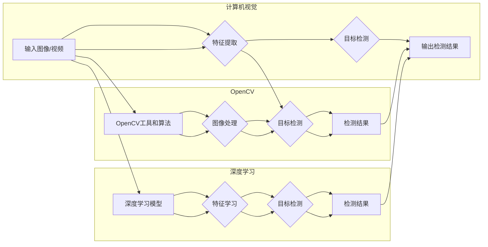

> 行人检测，OpenCV，深度学习，卷积神经网络，目标检测，实时监控，计算机视觉

# 基于Opencv的行人检测系统设计

## 1. 背景介绍

随着计算机视觉技术的飞速发展，行人检测技术在智慧城市、智能交通、安防监控等领域得到了广泛应用。行人检测系统通过实时检测监控画面中的行人，能够为安全监控、交通流量统计、人员追踪等提供重要支持。OpenCV（Open Source Computer Vision Library）作为一款开源的计算机视觉库，因其跨平台、高性能和易于使用的特点，成为了实现行人检测系统的首选工具之一。

本文将详细介绍基于OpenCV的行人检测系统设计，包括核心概念、算法原理、具体操作步骤、项目实践和实际应用场景等内容。

## 2. 核心概念与联系

### 2.1 核心概念

- **行人检测（Pedestrian Detection）**：指在图像或视频中识别出行人个体的技术。
- **计算机视觉（Computer Vision）**：研究如何让计算机从图像和视频中提取信息，实现如图像识别、目标检测等任务。
- **OpenCV**：一款开源的计算机视觉库，提供了丰富的计算机视觉算法和工具。
- **深度学习（Deep Learning）**：一种机器学习方法，通过构建多层神经网络来学习数据的非线性表示。

### 2.2 核心概念原理和架构的 Mermaid 流程图



如图所示，行人检测系统涉及计算机视觉、OpenCV和深度学习等多个核心概念。输入的图像或视频首先通过OpenCV或深度学习模型进行特征提取，然后进行目标检测，最后输出检测结果。

## 3. 核心算法原理 & 具体操作步骤

### 3.1 算法原理概述

行人检测技术主要分为两大类：基于传统算法的检测方法和基于深度学习的检测方法。

- **传统算法**：主要基于图像处理和机器学习技术，如背景差分法、光流法、粒子滤波等。
- **深度学习方法**：主要基于卷积神经网络（CNN）等深度学习模型，能够学习到更加丰富的图像特征，检测精度更高。

### 3.2 算法步骤详解

以下是基于深度学习的行人检测算法的详细步骤：

1. **数据准备**：收集包含行人图像和视频数据，并将其标注为行人实例。
2. **模型选择**：选择合适的深度学习模型，如Faster R-CNN、SSD、YOLO等。
3. **模型训练**：使用标注数据对深度学习模型进行训练，学习行人的特征表示。
4. **模型评估**：使用测试集评估模型的检测精度和召回率。
5. **模型部署**：将训练好的模型部署到OpenCV中进行实时行人检测。

### 3.3 算法优缺点

- **传统算法**：
  - 优点：算法简单，易于实现，对硬件要求较低。
  - 缺点：检测精度和召回率相对较低，容易受到光照、遮挡等因素的影响。
- **深度学习方法**：
  - 优点：检测精度和召回率较高，能够自动学习图像特征，对光照、遮挡等因素的鲁棒性较好。
  - 缺点：计算量较大，对硬件要求较高，需要大量标注数据。

### 3.4 算法应用领域

- **智慧城市**：交通流量统计、人员流动分析、公共安全管理等。
- **智能交通**：交通信号控制、交通流量监控、驾驶辅助系统等。
- **安防监控**：监控画面中的人员识别、入侵检测、异常行为识别等。
- **虚拟现实**：虚拟角色识别、交互式场景构建等。

## 4. 数学模型和公式 & 详细讲解 & 举例说明

### 4.1 数学模型构建

深度学习中的行人检测模型通常采用卷积神经网络（CNN）结构。以下以Faster R-CNN为例，介绍其数学模型构建。

Faster R-CNN主要由以下几个部分组成：

- **RPN（Region Proposal Network）**：用于生成候选区域，即可能包含行人的区域。
- **RoI Pooling**：将候选区域中的图像特征映射到固定大小的特征图上。
- **Fast R-CNN**：用于对候选区域进行分类和边界框回归。

### 4.2 公式推导过程

以下以Faster R-CNN的损失函数为例，介绍其公式推导过程。

损失函数由以下几部分组成：

- **分类损失**：用于计算候选区域的类别概率与真实标签之间的差异。
- **回归损失**：用于计算候选区域边界框的预测值与真实值之间的差异。
- **背景损失**：用于惩罚不属于行人的区域。

$$
L = L_{cls} + L_{reg} + L_{bg}
$$

其中，$L_{cls}$、$L_{reg}$、$L_{bg}$ 分别为分类损失、回归损失和背景损失。

### 4.3 案例分析与讲解

以下以Faster R-CNN在行人检测任务中的应用为例进行讲解。

1. **数据准备**：收集包含行人图像和视频数据，并将其标注为行人实例。
2. **模型选择**：选择Faster R-CNN模型作为行人检测模型。
3. **模型训练**：使用标注数据对Faster R-CNN模型进行训练，学习行人的特征表示。
4. **模型评估**：使用测试集评估Faster R-CNN模型的检测精度和召回率。
5. **模型部署**：将训练好的Faster R-CNN模型部署到OpenCV中进行实时行人检测。

## 5. 项目实践：代码实例和详细解释说明

### 5.1 开发环境搭建

以下是使用Python和OpenCV进行行人检测系统开发的开发环境搭建步骤：

1. 安装Python环境：下载Python安装包并安装。
2. 安装OpenCV库：使用pip命令安装OpenCV库。
3. 安装深度学习库：安装TensorFlow或PyTorch等深度学习库。
4. 准备标注数据：收集包含行人图像和视频数据，并将其标注为行人实例。

### 5.2 源代码详细实现

以下是一个使用Faster R-CNN进行行人检测的Python代码示例：

```python
import cv2
import numpy as np
import tensorflow as tf
from object_detection.utils import label_map_util
from object_detection.protos import pipeline_pb2

# 加载Faster R-CNN模型
model = tf.saved_model.load('faster_rcnn_model')

# 读取标签映射
category_index = label_map_util.create_category_index_from_labelmap('labelmap.pbtxt', use_display_name=True)

# 检测函数
def detect_objects(image_path):
    image_np = cv2.imread(image_path)
    input_tensor = tf.convert_to_tensor(np.expand_dims(image_np, 0), dtype=tf.float32)
    detections = model(input_tensor)
    num_detections = int(detections.pop('num_detections'))
    detections = {key: value[0, :num_detections].numpy() for key, value in detections.items()}
    detections['num_detections'] = num_detections
    for detection in detections['detection']:
        score = detection[0]
        if score >= 0.5:
            box = detection[4:8] * np.array([image_np.shape[1], image_np.shape[0], image_np.shape[1], image_np.shape[0]])
            (y1, x1, y2, x2) = box.astype("int")
            cv2.rectangle(image_np, (x1, y1), (x2, y2), (0, 255, 0), 2)
            cv2.putText(image_np, 'Pedestrian', (x1, y1 - 5), cv2.FONT_HERSHEY_SIMPLEX, 0.5, (0, 255, 0), 2)
    cv2.imshow('image', image_np)
    cv2.waitKey(0)
    cv2.destroyAllWindows()

# 测试函数
if __name__ == '__main__':
    detect_objects('test_image.jpg')
```

### 5.3 代码解读与分析

以上代码示例展示了如何使用Faster R-CNN模型进行行人检测。首先，加载Faster R-CNN模型和标签映射。然后定义检测函数，将图像输入模型进行检测，并在检测结果中筛选出置信度大于0.5的行人实例。最后，在图像上绘制行人边界框和标签。

### 5.4 运行结果展示

运行上述代码后，会在图像上显示检测结果，包括行人的边界框和标签。

## 6. 实际应用场景

基于OpenCV的行人检测系统在多个实际应用场景中得到了广泛应用，以下列举几个典型场景：

- **智慧城市**：通过实时检测监控画面中的行人，统计人流量、分析人员流动趋势，为城市规划和安全管理提供数据支持。
- **智能交通**：在交通路口检测行人，实现交通信号灯的智能控制，提高道路通行效率。
- **安防监控**：在公共场所进行实时监控，及时发现异常行为，保障公共安全。
- **虚拟现实**：在虚拟现实场景中识别玩家位置，实现虚拟角色的互动和导航。

## 7. 工具和资源推荐

### 7.1 学习资源推荐

- **书籍**：
  - 《深度学习》
  - 《Python计算机视觉实用项目》
  - 《OpenCV3计算机视觉算法精粹》
- **在线课程**：
  - Coursera的《深度学习专项课程》
  - Udacity的《计算机视觉纳米学位》
  - fast.ai的《深度学习课程》

### 7.2 开发工具推荐

- **深度学习框架**：
  - TensorFlow
  - PyTorch
- **计算机视觉库**：
  - OpenCV
  - Dlib
- **数据标注工具**：
  - LabelImg
  - VGG Image Annotator

### 7.3 相关论文推荐

- **Faster R-CNN**：《Faster R-CNN: Towards Real-Time Object Detection with Region Proposal Networks》
- **SSD**：`Single Shot MultiBox Detector: Benchmarking, Analysis, and State-of-the-Art Object Detection with SSD` 
- **YOLO**：`You Only Look Once: Unified, Real-Time Object Detection**`

## 8. 总结：未来发展趋势与挑战

### 8.1 研究成果总结

本文对基于OpenCV的行人检测系统进行了全面介绍，包括背景介绍、核心概念、算法原理、具体操作步骤、项目实践和实际应用场景等内容。通过介绍，读者可以了解行人检测技术的发展现状和未来趋势。

### 8.2 未来发展趋势

- **深度学习模型不断优化**：随着深度学习技术的不断发展，行人检测模型的性能将不断提高，检测精度和召回率将进一步提升。
- **轻量级模型兴起**：为了降低计算量和资源消耗，轻量级行人检测模型将得到更多关注。
- **多模态融合**：将行人检测与其他模态信息（如声音、姿态等）进行融合，实现更加全面的行人感知。
- **跨域行人检测**：针对不同场景和领域的数据进行行人检测，提高模型的泛化能力。

### 8.3 面临的挑战

- **数据标注成本高**：高质量的标注数据对于模型训练至关重要，但数据标注成本较高。
- **模型泛化能力有限**：现有模型在面对复杂场景和动态环境时，泛化能力有限。
- **计算资源消耗大**：深度学习模型计算量较大，对硬件资源要求较高。
- **模型可解释性不足**：深度学习模型内部工作机制复杂，难以解释其决策过程。

### 8.4 研究展望

未来，行人检测技术将朝着以下方向发展：

- **探索新的深度学习模型**：设计更加高效的深度学习模型，提高检测精度和召回率。
- **降低数据标注成本**：研究无监督学习、半监督学习等方法，减少对标注数据的依赖。
- **提高模型鲁棒性**：研究针对复杂场景和动态环境的行人检测算法，提高模型的鲁棒性。
- **模型轻量化和高效化**：研究轻量级行人检测模型，降低计算量和资源消耗。

相信随着技术的不断发展，基于OpenCV的行人检测系统将在更多领域得到应用，为人们的生活带来更多便利和安全保障。

## 9. 附录：常见问题与解答

**Q1：什么是行人检测？**

A：行人检测是指从图像或视频中识别出行人的技术，广泛应用于智慧城市、智能交通、安防监控等领域。

**Q2：基于OpenCV的行人检测系统有哪些优点？**

A：基于OpenCV的行人检测系统具有以下优点：

- 跨平台：OpenCV支持多种操作系统和硬件平台。
- 高性能：OpenCV提供了丰富的计算机视觉算法和工具，能够实现高效的行人检测。
- 易于使用：OpenCV提供了易于使用的Python接口，方便开发者进行二次开发。

**Q3：深度学习在行人检测中有什么作用？**

A：深度学习在行人检测中起到了至关重要的作用，它能够学习到更加丰富的图像特征，提高检测精度和召回率。

**Q4：如何提高行人检测系统的鲁棒性？**

A：提高行人检测系统的鲁棒性可以从以下几个方面着手：

- 使用更加鲁棒的深度学习模型。
- 优化数据预处理和特征提取方法。
- 引入数据增强技术，提高模型的泛化能力。
- 在复杂场景和动态环境下进行模型训练和测试。

**Q5：行人检测系统有哪些实际应用场景？**

A：行人检测系统在以下场景中得到了广泛应用：

- 智慧城市：人流量统计、人员流动分析、公共安全管理等。
- 智能交通：交通信号控制、交通流量监控、驾驶辅助系统等。
- 安防监控：监控画面中的人员识别、入侵检测、异常行为识别等。
- 虚拟现实：虚拟角色识别、交互式场景构建等。

作者：禅与计算机程序设计艺术 / Zen and the Art of Computer Programming