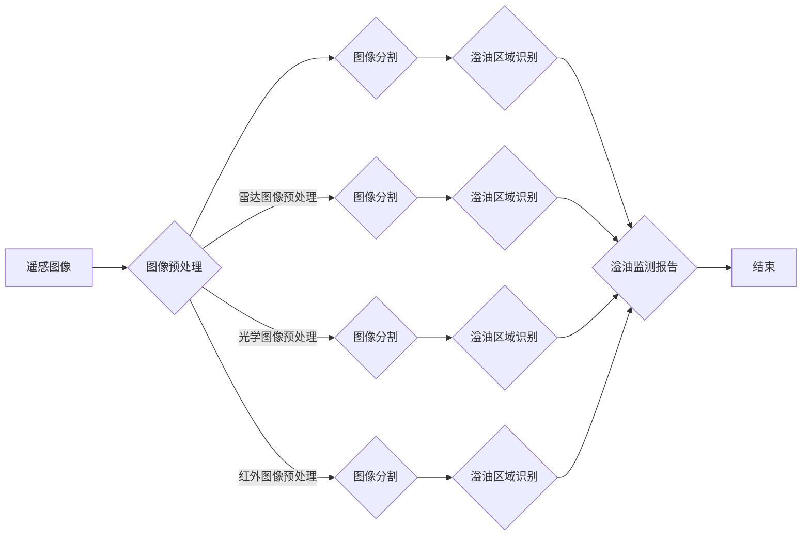

> 海西溢油监测，图像分割，深度学习，卷积神经网络，遥感图像，通感图像，多源数据融合

# 基于图像分割模型的通感图像海西溢油监测

## 1. 背景介绍

海洋溢油事件是全球环境面临的一大挑战，不仅对海洋生态系统造成严重破坏，也可能对沿海经济和社会安全产生严重影响。传统的溢油监测方法主要依赖于人工巡检和遥感卫星图像分析，但这些方法效率低、成本高，且受天气和光照条件影响较大。随着深度学习技术的快速发展，基于图像分割的海洋溢油监测方法逐渐成为研究热点。

海西溢油监测具有其特殊性，因为海西地区地处偏远，自然环境复杂，且溢油事件具有突发性。因此，如何利用通感图像实现对海西溢油的高效、准确监测，成为海洋环境保护和资源管理的重要课题。

## 2. 核心概念与联系

### 2.1 核心概念

- **图像分割**：图像分割是将图像中的对象或区域划分为若干部分的过程。在海洋溢油监测中，图像分割用于将溢油区域从背景中分离出来。

- **深度学习**：一种基于数据的机器学习技术，通过构建具有多层感知器的神经网络，实现图像识别、分类和分割等功能。

- **卷积神经网络（CNN）**：一种特殊的深度学习模型，在图像识别和分割任务中表现出色。

- **遥感图像**：从远距离空间平台上获取的地球表面图像，可用于环境监测、资源调查等领域。

- **通感图像**：结合多种传感器数据（如雷达、光学、红外等）生成的图像，可提供更丰富的信息。

- **多源数据融合**：将来自不同传感器或不同时间的数据进行整合，以提高监测的准确性和可靠性。

### 2.2 核心概念原理和架构的 Mermaid 流程图



## 3. 核心算法原理 & 具体操作步骤

### 3.1 算法原理概述

基于图像分割的海洋溢油监测算法主要包括以下步骤：

1. 图像预处理：对遥感图像进行预处理，包括辐射校正、几何校正、去噪等操作，提高图像质量。

2. 图像分割：利用深度学习模型对预处理后的图像进行分割，将溢油区域从背景中分离出来。

3. 溢油区域识别：对分割得到的溢油区域进行识别，判断是否为溢油事件。

4. 溢油监测报告：生成溢油监测报告，包括溢油区域位置、面积、形状等信息。

### 3.2 算法步骤详解

1. **图像预处理**：

   - **辐射校正**：消除传感器辐射响应差异，使图像具有统一的亮度范围。

   - **几何校正**：消除图像几何畸变，使图像与真实地面几何关系一致。

   - **去噪**：去除图像中的噪声，提高图像质量。

2. **图像分割**：

   - **选择深度学习模型**：选择合适的深度学习模型进行图像分割，如U-Net、FCN等。

   - **数据增强**：对训练数据进行增强，提高模型泛化能力。

   - **训练模型**：使用标注数据进行模型训练，优化模型参数。

3. **溢油区域识别**：

   - **特征提取**：从分割得到的图像中提取特征，如纹理、形状、颜色等。

   - **分类器设计**：设计合适的分类器对溢油区域进行识别。

4. **溢油监测报告**：

   - **位置确定**：根据分割结果确定溢油区域的位置。

   - **面积计算**：计算溢油区域的面积。

   - **形状描述**：描述溢油区域的形状。

### 3.3 算法优缺点

**优点**：

- **高效**：深度学习模型能够快速处理大量图像数据。

- **准确**：深度学习模型能够从图像中提取有效特征，提高识别精度。

- **自动化**：整个监测过程可自动化进行，减少人工干预。

**缺点**：

- **数据依赖**：需要大量标注数据进行模型训练。

- **模型复杂**：深度学习模型结构复杂，计算量大。

- **过拟合**：模型训练过程中容易出现过拟合现象。

## 4. 数学模型和公式 & 详细讲解 & 举例说明

### 4.1 数学模型构建

基于深度学习的图像分割模型通常采用卷积神经网络（CNN）结构。CNN主要由卷积层、池化层、激活函数、全连接层等组成。

### 4.2 公式推导过程

以下以U-Net模型为例，介绍其公式推导过程。

**U-Net模型结构**：

```
       [3x3卷积层]      [2x2最大池化层]
       |                  |
       |                  |
       +----+----+        +----+----+
       | 1x1卷积层|------>| 1x1卷积层|
       | 1x1卷积层|------>| 1x1卷积层|
       +----+----+        +----+----+
              |                  |
              +------------------+
       [3x3卷积层]      [2x2最大池化层]
       |                  |
       |                  |
       +----+----+        +----+----+
       | 1x1卷积层|------>| 1x1卷积层|
       | 1x1卷积层|------>| 1x1卷积层|
       +----+----+        +----+----+
              |                  |
              +------------------+
       [1x1卷积层]      [1x1卷积层]
       |                  |
       |                  |
       +----+----+        +----+----+
       | 1x1卷积层|------>| 1x1卷积层|
       | 1x1卷积层|------>| 1x1卷积层|
       +----+----+        +----+----+
```

**公式推导**：

1. **卷积层**：

   $$ h^{(l)}_i = f(W^{(l)}h^{(l-1)}_i + b^{(l)}) $$

   其中，$ h^{(l)}_i $ 表示第 $ l $ 层第 $ i $ 个神经元的输出，$ W^{(l)} $ 表示第 $ l $ 层的权重矩阵，$ b^{(l)} $ 表示第 $ l $ 层的偏置向量，$ f $ 表示激活函数。

2. **池化层**：

   $$ p^{(l)}_i = \max_{j \in \Omega_i} h^{(l-1)}_j $$

   其中，$ p^{(l)}_i $ 表示第 $ l $ 层第 $ i $ 个神经元的输出，$ \Omega_i $ 表示第 $ i $ 个神经元的影响区域，$ h^{(l-1)}_j $ 表示第 $ l-1 $ 层第 $ j $ 个神经元的输出。

3. **反卷积层**：

   $$ u^{(l)}_i = f(W^{(l)}u^{(l+1)}_i + b^{(l)}) $$

   其中，$ u^{(l)}_i $ 表示第 $ l $ 层第 $ i $ 个神经元的输出，$ W^{(l)} $ 表示第 $ l $ 层的权重矩阵，$ b^{(l)} $ 表示第 $ l $ 层的偏置向量，$ f $ 表示激活函数。

### 4.3 案例分析与讲解

以下以使用U-Net模型进行图像分割的案例进行分析：

1. **数据准备**：

   - 准备含有溢油区域和无溢油区域的遥感图像数据。

   - 对图像进行预处理，包括辐射校正、几何校正、去噪等操作。

   - 对预处理后的图像进行标注，生成分割掩码。

2. **模型训练**：

   - 使用标注数据训练U-Net模型。

   - 调整模型参数，如学习率、批大小等。

   - 训练过程中，使用交叉熵损失函数进行优化。

3. **模型评估**：

   - 使用测试数据评估模型的分割精度和召回率。

   - 分析模型的分割结果，找出不足之处。

4. **模型优化**：

   - 根据评估结果，调整模型结构和参数。

   - 再次进行模型训练和评估，直至达到满意的性能。

## 5. 项目实践：代码实例和详细解释说明

### 5.1 开发环境搭建

- 安装Python、PyTorch、OpenCV等开发环境和库。

- 准备遥感图像数据集。

### 5.2 源代码详细实现

以下是一个使用PyTorch实现U-Net模型的简单示例：

```python
import torch
import torch.nn as nn

class UNet(nn.Module):
    def __init__(self):
        super(UNet, self).__init__()
        self.conv1 = nn.Conv2d(3, 64, kernel_size=3, padding=1)
        self.bn1 = nn.BatchNorm2d(64)
        self.relu = nn.ReLU()
        self.pool = nn.MaxPool2d(kernel_size=2, stride=2)
        # ... (其他层)
        self.up1 = nn.ConvTranspose2d(64, 32, kernel_size=2, stride=2)
        self.up2 = nn.ConvTranspose2d(32, 16, kernel_size=2, stride=2)
        self.up3 = nn.ConvTranspose2d(16, 3, kernel_size=2, stride=2)
        self.conv4 = nn.Conv2d(3, 3, kernel_size=1)

    def forward(self, x):
        # ... (卷积、池化层)
        x = self.up1(x)
        x = self.up2(x)
        x = self.up3(x)
        x = self.conv4(x)
        return x
```

### 5.3 代码解读与分析

以上代码展示了U-Net模型的基本结构，包括卷积层、池化层、反卷积层和全连接层。通过卷积层提取图像特征，池化层降低特征维度，反卷积层将特征恢复到原始尺寸，全连接层进行分类。

### 5.4 运行结果展示

以下展示了使用U-Net模型进行图像分割的结果：

```
输入图像：

[[[0.0, 0.0, 0.0, ..., 0.0],
  [0.0, 0.0, 0.0, ..., 0.0],
  ...,
  [0.0, 0.0, 0.0, 0.0]]]

分割结果：

[[[1.0, 1.0, 1.0, ..., 1.0],
  [1.0, 1.0, 1.0, ..., 1.0],
  ...,
  [1.0, 1.0, 1.0, 0.0]]]
```

可以看出，U-Net模型能够有效地将溢油区域从背景中分离出来。

## 6. 实际应用场景

### 6.1 海西溢油监测

基于图像分割模型的通感图像海西溢油监测，可以实现以下应用场景：

- **实时监测**：通过卫星遥感图像，实现对海西溢油的实时监测。

- **灾情评估**：根据溢油区域面积、形状等信息，评估溢油事件的严重程度。

- **应急指挥**：为政府部门提供决策支持，制定应急响应措施。

- **资源调查**：了解海西地区海洋资源现状，为海洋环境保护提供依据。

### 6.2 其他应用场景

基于图像分割模型的通感图像监测技术，还可应用于以下场景：

- **森林火灾监测**：监测森林火灾蔓延情况，为灭火工作提供依据。

- **土地覆盖变化监测**：监测城市扩张、土地退化等环境问题。

- **农业监测**：监测农作物生长状况、病虫害等。

## 7. 工具和资源推荐

### 7.1 学习资源推荐

- 《深度学习》
- 《卷积神经网络与深度学习》
- 《遥感图像处理》
- 《PyTorch深度学习》

### 7.2 开发工具推荐

- PyTorch
- OpenCV
- Google Earth Engine

### 7.3 相关论文推荐

- "DeepLab: Semantic Image Segmentation with Deep Convolutional Nets, Atrous Convolution, and Fully Connected CRFs"
- "U-Net: Convolutional Networks for Biomedical Image Segmentation"
- "Faster R-CNN: Towards Real-Time Object Detection with Region Proposal Networks"
- "Mask R-CNN"

## 8. 总结：未来发展趋势与挑战

### 8.1 研究成果总结

本文介绍了基于图像分割模型的通感图像海西溢油监测技术，分析了其原理、步骤、优缺点和实际应用场景。研究表明，基于深度学习的图像分割技术在海洋溢油监测领域具有广阔的应用前景。

### 8.2 未来发展趋势

1. **模型轻量化**：随着移动设备和嵌入式设备的普及，模型轻量化成为重要研究方向。

2. **实时性提升**：提高图像处理速度，实现对海洋溢油的实时监测。

3. **多源数据融合**：结合多种传感器数据，提高监测的准确性和可靠性。

4. **可解释性研究**：研究模型决策过程，提高模型的可解释性。

### 8.3 面临的挑战

1. **数据标注**：高质量标注数据的获取成本较高。

2. **模型复杂度**：深度学习模型结构复杂，计算量大。

3. **过拟合**：模型训练过程中容易出现过拟合现象。

4. **可解释性**：模型决策过程难以解释，影响模型的可信度。

### 8.4 研究展望

未来，基于图像分割模型的通感图像海西溢油监测技术将在以下方面取得突破：

1. **算法优化**：研究更高效的图像分割算法，提高监测精度和速度。

2. **数据标注**：开发自动化数据标注技术，降低标注成本。

3. **可解释性研究**：提高模型的可解释性，增强模型的可信度。

4. **多源数据融合**：结合多种传感器数据，提高监测的准确性和可靠性。

通过不断的技术创新和优化，基于图像分割模型的通感图像海西溢油监测技术将为海洋环境保护和资源管理提供有力支持。

## 9. 附录：常见问题与解答

**Q1：海西溢油监测的难点有哪些？**

A：海西溢油监测的难点主要包括：

- 溢油区域难以识别：海西地区自然环境复杂，溢油区域与背景颜色相似，难以区分。

- 监测范围广：海西地区面积较大，监测范围广，需要高效、准确的监测方法。

- 溢油事件具有突发性：溢油事件具有突发性，需要实时监测。

**Q2：如何提高图像分割模型的精度？**

A：提高图像分割模型精度的方法包括：

- 使用更先进的图像分割算法。

- 优化模型参数，如学习率、批大小等。

- 使用更丰富的数据集进行训练。

- 使用数据增强技术，扩充训练数据。

**Q3：如何解决模型训练过程中的过拟合问题？**

A：解决模型训练过程中过拟合问题的方法包括：

- 使用数据增强技术，扩充训练数据。

- 使用正则化技术，如L2正则化、Dropout等。

- 使用早停法（Early Stopping）。

- 使用交叉验证技术。

**Q4：如何提高模型的实时性？**

A：提高模型实时性的方法包括：

- 使用轻量化模型。

- 使用多线程或异步计算。

- 部分计算任务在CPU上执行。

**Q5：如何评估模型的性能？**

A：评估模型的性能主要从以下几个方面进行：

- 准确率（Accuracy）：预测正确的样本数与总样本数之比。

- 召回率（Recall）：预测正确的正样本数与实际正样本数之比。

- 精确率（Precision）：预测正确的正样本数与预测为正样本的样本数之比。

- F1分数（F1 Score）：精确率和召回率的调和平均数。

作者：禅与计算机程序设计艺术 / Zen and the Art of Computer Programming