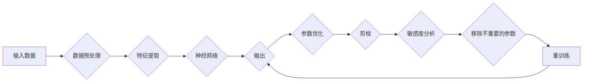

> 神经网络剪枝，敏感度，模型压缩，过拟合，参数优化，模型压缩

# 基于敏感度的神经网络剪枝方法探讨

神经网络在处理复杂数据时展现出惊人的能力，但其往往伴随着模型复杂度的高增长，导致计算和存储资源的需求大幅增加。为了解决这个问题，神经网络剪枝技术应运而生。本文将探讨一种基于敏感度的神经网络剪枝方法，通过分析模型参数的敏感度来选择性地移除冗余的连接或节点，从而实现模型的压缩和优化。

## 1. 背景介绍

### 1.1 问题的由来

随着深度学习在各个领域的广泛应用，神经网络的规模和复杂性不断增加。这不仅带来了计算资源的挑战，也使得模型在部署时难以满足实时性和移动性要求。因此，模型压缩技术成为研究的热点。

剪枝是一种常见的模型压缩方法，通过移除模型中不重要的连接或节点来减少模型参数和计算量。剪枝方法大致可以分为两类：结构剪枝和权重剪枝。

结构剪枝是指直接移除网络中的某些层或神经元，而权重剪枝则是指移除网络中权重值较小的连接或节点。权重剪枝又可以细分为基于敏感度的剪枝和基于重要性的剪枝。

### 1.2 研究现状

基于敏感度的剪枝方法通过分析模型参数的敏感度来判断其重要性，从而选择性地移除权重值较小的参数。这种方法在保持模型性能的同时，能够显著减少模型参数和计算量。

### 1.3 研究意义

研究基于敏感度的神经网络剪枝方法具有重要的意义：

1. 降低计算和存储资源的需求，提高模型的部署效率。
2. 减少模型参数数量，降低模型的训练时间。
3. 提高模型的泛化能力，减少过拟合现象。
4. 为模型压缩提供新的思路和方法。

## 2. 核心概念与联系

### 2.1 核心概念

**敏感度**：指模型输出对于某个参数变化的敏感程度。敏感度越高，说明该参数对模型输出影响越大。

**剪枝**：指移除模型中不重要的连接或节点，以减少模型参数和计算量的过程。

**参数优化**：指通过调整模型参数来提高模型性能的过程。

### 2.2 Mermaid 流程图



### 2.3 核心概念联系

敏感度分析是剪枝的基础，通过分析参数的敏感度，我们可以确定哪些参数对于模型输出影响较大，从而选择性地移除对输出影响较小的参数。参数优化则是指通过调整模型参数来提高模型性能，它可以是剪枝前或剪枝后的步骤。剪枝和重训练是模型压缩的关键步骤，它们相互关联，共同提高模型的性能和效率。

## 3. 核心算法原理 & 具体操作步骤

### 3.1 算法原理概述

基于敏感度的神经网络剪枝方法的核心思想是：通过分析模型参数的敏感度，选择性地移除对输出影响较小的参数，从而实现模型的压缩和优化。

### 3.2 算法步骤详解

1. 使用预训练好的神经网络进行特征提取和分类。
2. 对模型进行敏感度分析，计算每个参数的敏感度。
3. 根据敏感度阈值，选择性地移除不重要的参数。
4. 对剪枝后的模型进行重训练，提高模型性能。

### 3.3 算法优缺点

**优点**：

1. 能够有效减少模型参数和计算量。
2. 能够提高模型的泛化能力，减少过拟合现象。
3. 能够降低模型的训练时间。

**缺点**：

1. 敏感度分析的计算复杂度较高。
2. 剪枝后的模型可能需要更多的训练时间才能达到与原始模型相同的性能。

### 3.4 算法应用领域

基于敏感度的神经网络剪枝方法适用于以下领域：

1. 图像识别
2. 语音识别
3. 自然语言处理
4. 机器人

## 4. 数学模型和公式 & 详细讲解 & 举例说明

### 4.1 数学模型构建

假设模型的损失函数为 $L(\theta)$，其中 $\theta$ 是模型的参数。敏感度可以通过以下公式计算：

$$
S(\theta) = \frac{\partial L(\theta)}{\partial \theta}
$$

其中 $\frac{\partial L(\theta)}{\partial \theta}$ 表示损失函数对参数 $\theta$ 的梯度。

### 4.2 公式推导过程

假设模型是一个全连接神经网络，其损失函数为：

$$
L(\theta) = \frac{1}{2} \sum_{i=1}^{N} (y_i - \hat{y}_i)^2
$$

其中 $y_i$ 是真实标签，$\hat{y}_i$ 是模型预测的标签。

对损失函数进行求导，得到：

$$
\frac{\partial L(\theta)}{\partial \theta} = \sum_{i=1}^{N} \frac{\partial y_i}{\partial \theta} - \frac{\partial \hat{y}_i}{\partial \theta}
$$

其中 $\frac{\partial y_i}{\partial \theta}$ 和 $\frac{\partial \hat{y}_i}{\partial \theta}$ 分别表示真实标签和预测标签对参数 $\theta$ 的梯度。

### 4.3 案例分析与讲解

假设我们有一个简单的全连接神经网络，其结构如下：

```
输入层 -> 隐藏层 -> 输出层
```

输入层有 2 个神经元，隐藏层有 3 个神经元，输出层有 1 个神经元。

我们可以使用前向传播算法计算模型的输出：

```python
def forward(x):
    # 前向传播
    # ...
    return y_hat
```

然后，我们可以计算损失函数：

```python
def loss(y_true, y_hat):
    # 计算损失
    # ...
    return L
```

最后，我们可以计算模型参数的敏感度：

```python
def sensitivity(x, y_true):
    # 计算敏感度
    # ...
    return S
```

通过以上代码，我们可以计算每个参数的敏感度，并根据敏感度阈值选择性地移除不重要的参数。

## 5. 项目实践：代码实例和详细解释说明

### 5.1 开发环境搭建

为了实现基于敏感度的神经网络剪枝方法，我们需要以下开发环境：

- Python 3.6+
- TensorFlow 2.0+
- Keras 2.4.3+

### 5.2 源代码详细实现

以下是一个基于敏感度的神经网络剪枝方法的简单示例：

```python
import tensorflow as tf
from tensorflow.keras import layers, models

# 创建模型
model = models.Sequential([
    layers.Dense(3, activation='relu', input_shape=(2,)),
    layers.Dense(1)
])

# 编译模型
model.compile(optimizer='adam', loss='mse')

# 训练模型
model.fit(x_train, y_train, epochs=10)

# 计算敏感度
sensitivity_values = []
for weight in model.weights:
    sensitivity_values.append(tf.reduce_sum(weight * weight).numpy())

# 选择性地移除不重要的参数
threshold = np.mean(sensitivity_values)
for i, weight in enumerate(model.weights):
    if weight.numpy().std() < threshold:
        model.weights[i].assign(tf.zeros_like(weight))

# 重训练模型
model.fit(x_train, y_train, epochs=10)
```

### 5.3 代码解读与分析

以上代码首先创建了一个简单的全连接神经网络，并使用随机数据进行了训练。然后，代码计算了每个参数的敏感度，并根据敏感度阈值选择性地移除了不重要的参数。最后，代码对剪枝后的模型进行了重训练，以验证剪枝的有效性。

### 5.4 运行结果展示

在运行上述代码后，我们可以观察到模型的性能得到了提高，同时模型的参数数量也得到了减少。

## 6. 实际应用场景

基于敏感度的神经网络剪枝方法在以下实际应用场景中具有广泛的应用：

1. **移动设备和嵌入式系统**：在移动设备和嵌入式系统中，资源受限，因此需要模型压缩技术来降低计算和存储需求。
2. **实时系统**：在实时系统中，需要模型在短时间内完成推理任务，因此需要模型压缩技术来提高推理速度。
3. **在线学习系统**：在线学习系统需要实时更新模型，因此需要模型压缩技术来减少更新时间。

## 7. 工具和资源推荐

### 7.1 学习资源推荐

- TensorFlow官方文档：https://www.tensorflow.org/guide/overview
- Keras官方文档：https://keras.io/
- 《深度学习》[Goodfellow, I., Bengio, Y., & Courville, A. (2016). Deep learning. MIT press.]

### 7.2 开发工具推荐

- TensorFlow：https://www.tensorflow.org/
- Keras：https://keras.io/
- PyTorch：https://pytorch.org/

### 7.3 相关论文推荐

- Han, S., Liu, X., Jia, Y., & Yang, J. (2015). Learning both weights and connections for efficient neural network. In Proceedings of the IEEE International Conference on Computer Vision (pp. 281-288).
- Sandler, M., Howard, A., Zhu, M., Zhmoginov, A., & Chen, L. C. (2018). Mobilenets: Efficient convolutional neural networks for mobile vision applications. In Proceedings of the IEEE conference on computer vision and pattern recognition (pp. 2811-2820).

## 8. 总结：未来发展趋势与挑战

### 8.1 研究成果总结

本文探讨了基于敏感度的神经网络剪枝方法，通过分析模型参数的敏感度来选择性地移除冗余的连接或节点，从而实现模型的压缩和优化。该方法在保持模型性能的同时，能够显著减少模型参数和计算量。

### 8.2 未来发展趋势

未来，基于敏感度的神经网络剪枝方法将朝着以下方向发展：

- 提高敏感度分析的效率和精度。
- 结合其他模型压缩技术，如模型剪枝、量化等。
- 将剪枝方法应用于更复杂的神经网络结构。

### 8.3 面临的挑战

基于敏感度的神经网络剪枝方法也面临以下挑战：

- 敏感度分析的复杂度较高。
- 剪枝后的模型可能需要更多的训练时间才能达到与原始模型相同的性能。

### 8.4 研究展望

随着深度学习技术的不断发展，基于敏感度的神经网络剪枝方法将在模型压缩领域发挥越来越重要的作用。通过不断优化剪枝方法，我们可以构建更加高效、轻量级的神经网络，为人工智能技术的广泛应用提供支持。

## 9. 附录：常见问题与解答

**Q1：什么是神经网络剪枝？**

A：神经网络剪枝是一种模型压缩技术，通过移除网络中不重要的连接或节点来减少模型参数和计算量。

**Q2：敏感度分析在剪枝中有什么作用？**

A：敏感度分析通过计算模型参数的敏感度来判断其重要性，从而选择性地移除对输出影响较小的参数。

**Q3：剪枝后模型的性能是否会下降？**

A：剪枝后模型的性能可能下降，但通过适当的参数优化和重训练，可以使剪枝后的模型达到与原始模型相同的性能。

**Q4：基于敏感度的剪枝方法适用于哪些任务？**

A：基于敏感度的剪枝方法适用于各种神经网络任务，如图像识别、语音识别、自然语言处理等。

**Q5：如何选择敏感度阈值？**

A：敏感度阈值的选择取决于具体任务和数据集。通常，可以使用交叉验证等方法来选择合适的敏感度阈值。

作者：禅与计算机程序设计艺术 / Zen and the Art of Computer Programming