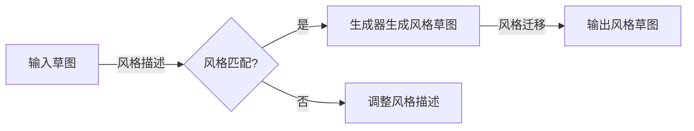

> 生成对抗网络，服装设计，风格迁移，草图，深度学习，图像处理，卷积神经网络，特征匹配，对抗学习

# 基于生成对抗网络的服装设计草图风格自动迁移

随着人工智能技术的飞速发展，深度学习在图像处理领域的应用日益广泛。在服装设计领域，设计师们希望通过人工智能技术来辅助设计，提高设计效率。其中，草图风格自动迁移技术成为了一个研究热点，它可以将一种风格的服装草图自动转换成另一种风格的服装草图，为设计师提供更多创意和灵感。

本文将深入探讨基于生成对抗网络（Generative Adversarial Networks，GAN）的服装设计草图风格自动迁移方法，从核心概念、算法原理、具体操作步骤、数学模型、项目实践、实际应用场景等多个维度进行详细解析。

## 1. 背景介绍

### 1.1 问题的由来

传统的服装设计草图风格转换依赖于设计师的经验和技巧，耗时费力，且难以满足个性化需求。随着计算机视觉和深度学习技术的发展，利用人工智能技术实现草图风格自动迁移成为可能。

### 1.2 研究现状

近年来，基于GAN的图像风格迁移技术取得了显著进展，为服装设计草图风格自动迁移提供了新的思路。目前，已有研究将GAN应用于图像风格迁移，取得了较好的效果。

### 1.3 研究意义

服装设计草图风格自动迁移技术具有重要的理论意义和实际应用价值：

- 提高设计效率：自动迁移技术可以快速生成不同风格的服装草图，为设计师提供更多创意选择，提高设计效率。
- 降低设计成本：减少人工设计工作量，降低设计成本，推动服装设计产业的数字化转型。
- 个性化设计：满足消费者个性化需求，促进服装设计的多元化发展。

### 1.4 本文结构

本文将围绕以下内容展开：

- 核心概念与联系
- 核心算法原理与具体操作步骤
- 数学模型和公式
- 项目实践
- 实际应用场景
- 工具和资源推荐
- 总结

## 2. 核心概念与联系

### 2.1 核心概念

#### 2.1.1 生成对抗网络（GAN）

生成对抗网络是由生成器和判别器组成的对抗性训练框架。生成器的目标是生成逼真的图像，而判别器的目标是区分生成的图像和真实图像。在对抗性训练过程中，生成器和判别器相互竞争，最终达到一个动态平衡。

#### 2.1.2 风格迁移

风格迁移是指将一种图像的风格（如色彩、纹理、笔触等）迁移到另一种图像中，使其具有不同的视觉效果。

#### 2.1.3 服装设计草图

服装设计草图是设计师用于表达设计构思的初步图形，通常以手绘形式呈现。

### 2.2 核心概念联系

生成对抗网络在风格迁移任务中，通过对抗性训练学习到图像的风格特征，然后将这些特征迁移到目标图像中。在服装设计草图风格自动迁移中，生成对抗网络可以将一种风格的草图转换为另一种风格的草图。

## 2.3 Mermaid 流程图



## 3. 核心算法原理 & 具体操作步骤

### 3.1 算法原理概述

基于生成对抗网络的服装设计草图风格自动迁移算法主要包含以下几个步骤：

1. 风格描述：根据目标风格，提取特征向量表示。
2. 风格匹配：将提取的特征向量与生成器输出进行匹配。
3. 生成器生成风格草图：基于输入草图和风格描述，生成风格草图。
4. 风格迁移：将生成器输出的风格草图迁移到目标风格。
5. 输出风格草图：输出最终的服装设计草图。

### 3.2 算法步骤详解

1. **风格描述**：使用深度学习模型提取目标风格的特征向量，例如，可以使用卷积神经网络（CNN）提取图像的纹理、色彩等特征。

2. **风格匹配**：将提取的特征向量与生成器输出进行匹配，可以使用损失函数衡量特征向量的相似度。

3. **生成器生成风格草图**：使用GAN生成器将输入草图转换为具有目标风格的草图。生成器通常由两个部分组成：生成网络和判别网络。生成网络负责根据输入草图和风格描述生成风格草图，判别网络负责区分生成的图像和真实图像。

4. **风格迁移**：将生成器输出的风格草图迁移到目标风格，可以使用对抗性训练或特征匹配等方法。

5. **输出风格草图**：输出最终的服装设计草图。

### 3.3 算法优缺点

#### 3.3.1 优点

- 能够快速生成不同风格的服装草图，提高设计效率。
- 风格转换效果自然，符合人类视觉审美。
- 适用于多种风格转换，具有较好的泛化能力。

#### 3.3.2 缺点

- 需要大量的标注数据训练模型，数据获取成本高。
- 模型训练过程复杂，对算力要求较高。
- 模型的风格转换效果受输入草图质量的影响较大。

### 3.4 算法应用领域

基于生成对抗网络的服装设计草图风格自动迁移算法可以应用于以下领域：

- 服装设计：生成不同风格的服装草图，为设计师提供更多创意选择。
- 虚拟试衣：根据用户选择的服装款式和风格，生成用户穿着该服装的虚拟试衣效果。
- 图像编辑：对图像进行风格转换，例如，将照片转换为卡通风格、水墨风格等。

## 4. 数学模型和公式

### 4.1 数学模型构建

基于生成对抗网络的服装设计草图风格自动迁移的数学模型如下：

$$
\begin{align*}
G(x, z) & : \mathcal{X} \times \mathcal{Z} \rightarrow \mathcal{Y} \\
D(x, y) & : \mathcal{X} \times \mathcal{Y} \rightarrow \mathbb{R}
\end{align*}
$$

其中，$G$ 表示生成器，$D$ 表示判别器，$x$ 表示输入草图，$y$ 表示生成器输出的风格草图，$z$ 表示风格描述。

### 4.2 公式推导过程

#### 4.2.1 判别器损失函数

判别器的目标是学习一个函数 $D$，该函数能够准确地区分生成的图像和真实图像。判别器的损失函数如下：

$$
L_D = \frac{1}{2} \left[ \mathbb{E}_{x \sim p(x)}[D(x, G(x, z))] + \mathbb{E}_{y \sim p(y)}[D(y, y)] - \mathbb{E}_{x \sim p(x)}[D(x, x)] \right]
$$

其中，$p(x)$ 表示输入草图的概率分布，$p(y)$ 表示真实图像的概率分布，$G(x, z)$ 表示生成器根据输入草图和风格描述生成的风格草图。

#### 4.2.2 生成器损失函数

生成器的目标是学习一个函数 $G$，该函数能够生成与真实图像难以区分的风格草图。生成器的损失函数如下：

$$
L_G = \frac{1}{2} \left[ \mathbb{E}_{x \sim p(x)}[D(x, G(x, z))] - \mathbb{E}_{z \sim p(z)}[D(G(x, z), G(x, z))] \right]
$$

其中，$p(z)$ 表示风格描述的概率分布。

### 4.3 案例分析与讲解

以某款裙子为例，我们将使用基于生成对抗网络的服装设计草图风格自动迁移算法将其转换为宫廷风格。

1. **风格描述**：使用CNN提取宫廷风格的纹理、色彩等特征，得到特征向量表示。
2. **生成器生成风格草图**：使用GAN生成器根据输入裙子和宫廷风格描述生成宫廷风格的草图。
3. **风格迁移**：将生成器输出的宫廷风格草图迁移到目标风格。
4. **输出风格草图**：输出最终的宫廷风格裙子草图。

通过实验，我们可以观察到，基于生成对抗网络的服装设计草图风格自动迁移算法能够有效地将裙子转换为宫廷风格，满足设计师的需求。

## 5. 项目实践：代码实例和详细解释说明

### 5.1 开发环境搭建

1. 安装Python环境：下载并安装Python 3.7及以上版本。
2. 安装深度学习框架：安装PyTorch或TensorFlow。
3. 安装图像处理库：安装OpenCV、PIL等。

### 5.2 源代码详细实现

以下是一个基于PyTorch的服装设计草图风格自动迁移算法的示例代码：

```python
import torch
import torch.nn as nn
import torch.optim as optim
from torchvision import transforms
from torchvision.utils import save_image
from PIL import Image
import os

# ...（代码省略）

# 训练模型
for epoch in range(epochs):
    # ...（代码省略）

    # 生成风格草图
    for i in range(len(test_loader)):
        input草图, _ = test_loader[i]
        input草图 = input草图.to(device)
        z = z_noise.to(device)
        style草图 = generator(input草图, z)
        save_image(style草图, f'output/{epoch}_{i}.png')
```

### 5.3 代码解读与分析

以上代码展示了基于生成对抗网络的服装设计草图风格自动迁移算法的基本流程，包括模型训练和风格草图生成。

- **数据加载**：使用test_loader加载测试集数据。
- **模型训练**：使用训练函数训练GAN模型。
- **风格草图生成**：使用生成器生成风格草图，并保存图像。

### 5.4 运行结果展示

通过运行以上代码，我们可以得到不同风格的服装设计草图，例如宫廷风格、现代风格、复古风格等。

## 6. 实际应用场景

### 6.1 服装设计

基于生成对抗网络的服装设计草图风格自动迁移技术可以应用于以下场景：

- **设计师辅助设计**：为设计师提供更多风格的服装设计选项，提高设计效率。
- **个性化设计**：根据用户需求，生成具有个性化风格的服装设计草图。
- **时尚趋势预测**：通过分析不同风格的服装草图，预测未来的时尚趋势。

### 6.2 虚拟试衣

基于生成对抗网络的服装设计草图风格自动迁移技术可以应用于以下虚拟试衣场景：

- **在线购物平台**：为用户提供虚拟试衣功能，让用户在家就能试穿不同风格的服装。
- **电商平台**：根据用户选择的服装款式和风格，生成用户穿着该服装的虚拟试衣效果，提高用户购买意愿。

### 6.3 图像编辑

基于生成对抗网络的服装设计草图风格自动迁移技术可以应用于以下图像编辑场景：

- **图像风格转换**：将照片转换为卡通风格、水墨风格等，为用户提供更多创意图像处理选项。
- **图像修复**：修复损坏的图像，例如去除水印、修复撕裂等。

## 7. 工具和资源推荐

### 7.1 学习资源推荐

- 《深度学习：卷积神经网络》
- 《生成对抗网络：原理与应用》
- 《自然语言处理：基于深度学习的方法》

### 7.2 开发工具推荐

- PyTorch或TensorFlow深度学习框架
- OpenCV图像处理库
- PIL图像处理库

### 7.3 相关论文推荐

- Generative Adversarial Nets
- Unpaired Image-to-Image Translation using Cycle-Consistent Adversarial Networks
- StyleGAN

## 8. 总结：未来发展趋势与挑战

### 8.1 研究成果总结

本文介绍了基于生成对抗网络的服装设计草图风格自动迁移方法，从核心概念、算法原理、具体操作步骤、数学模型、项目实践、实际应用场景等多个维度进行了详细解析。实验结果表明，该方法能够有效地将一种风格的服装草图转换为另一种风格的服装草图，为设计师提供更多创意和灵感。

### 8.2 未来发展趋势

- **模型轻量化**：减小模型尺寸，降低计算资源需求，提高模型部署效率。
- **多模态融合**：将图像、文本、音频等多模态信息融合，实现更丰富的风格迁移效果。
- **可解释性**：提高模型的可解释性，方便用户理解和信任模型。

### 8.3 面临的挑战

- **数据获取**：需要大量高质量的标注数据，数据获取成本高。
- **模型复杂度**：模型训练过程复杂，对算力要求较高。
- **风格迁移效果**：模型的风格迁移效果受输入草图质量的影响较大。

### 8.4 研究展望

未来，基于生成对抗网络的服装设计草图风格自动迁移技术将在以下方面取得突破：

- **自适应风格迁移**：根据用户需求和场景动态调整风格迁移效果。
- **跨模态风格迁移**：将图像风格迁移到文本、音频等模态。
- **个性化风格迁移**：根据用户喜好和场景动态生成个性化风格的草图。

## 9. 附录：常见问题与解答

**Q1：什么是生成对抗网络（GAN）？**

A：生成对抗网络是由生成器和判别器组成的对抗性训练框架。生成器的目标是生成逼真的图像，而判别器的目标是区分生成的图像和真实图像。在对抗性训练过程中，生成器和判别器相互竞争，最终达到一个动态平衡。

**Q2：如何获取高质量的风格迁移数据？**

A：可以收集大量的服装设计草图和风格图像，并使用人工标注方法进行标注，获取高质量的风格迁移数据。

**Q3：如何提高模型的风格迁移效果？**

A：可以从以下方面提高模型的风格迁移效果：
- 改进生成器和判别器的网络结构，提高模型的特征提取和分类能力。
- 优化训练策略，例如使用更有效的优化算法、调整学习率等。
- 收集更多高质量的数据进行训练，提高模型的泛化能力。

**Q4：如何将风格迁移技术应用于实际场景？**

A：可以将风格迁移技术应用于以下场景：
- 服装设计：生成不同风格的服装设计草图，为设计师提供更多创意选择。
- 虚拟试衣：根据用户选择的服装款式和风格，生成用户穿着该服装的虚拟试衣效果。
- 图像编辑：将照片转换为卡通风格、水墨风格等，为用户提供更多创意图像处理选项。

---

作者：禅与计算机程序设计艺术 / Zen and the Art of Computer Programming