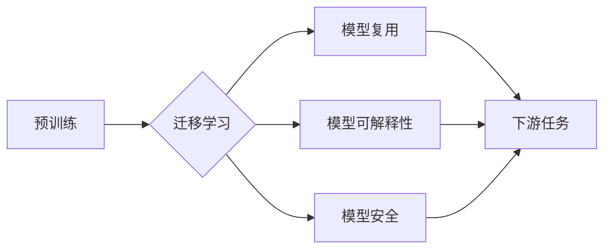

# 基础模型的技术生态系统

> 关键词：基础模型，技术生态系统，人工智能，预训练，迁移学习，模型复用，模型可解释性，模型安全

## 1. 背景介绍

随着深度学习技术的飞速发展，人工智能（AI）已经在各个领域取得了显著的成果。其中，基础模型（Fundamental Models）作为一种重要的AI模型，在自然语言处理（NLP）、计算机视觉（CV）等领域扮演着核心角色。基础模型通过在大规模数据集上进行预训练，学习到通用的知识和特征表示，能够为各种下游任务提供强大的基础能力。然而，基础模型的发展并非一蹴而就，它背后有着复杂的技术生态系统，包括预训练、迁移学习、模型复用、模型可解释性、模型安全等多个方面。本文将深入探讨基础模型的技术生态系统，分析其原理、应用、挑战和未来发展趋势。

## 2. 核心概念与联系

### 2.1 核心概念

**基础模型**：指在大规模数据集上预训练，学习到通用的知识和特征表示，能够应用于多种下游任务的模型。例如，BERT、GPT-3等。

**预训练**：指在大量无标签数据上进行模型训练的过程，旨在学习通用的语言或视觉表示。

**迁移学习**：指将预训练模型的知识迁移到新的任务中，以减少新任务的训练时间和计算成本。

**模型复用**：指在不同的任务中复用相同的模型结构或参数。

**模型可解释性**：指能够解释模型决策过程的程度。

**模型安全**：指模型在面临攻击时能够保持稳定性和鲁棒性。

### 2.2 核心概念原理和架构 Mermaid 流程图



图中，预训练是基础模型的起点，它通过学习大量的无标签数据，使模型具备了一定的通用知识和特征表示。迁移学习将预训练模型的知识迁移到新的任务中，实现模型的快速应用。模型复用允许在不同的任务中复用相同的模型结构或参数，提高开发效率。模型可解释性和模型安全则是确保模型在实际应用中的可靠性和可信度。

## 3. 核心算法原理 & 具体操作步骤

### 3.1 算法原理概述

基础模型的技术生态系统涉及多种算法原理，主要包括：

**预训练算法**：如BERT的Masked Language Model（MLM）、Rotated Positional Encoding等。

**迁移学习算法**：如Model Architecture Search（MAS）、Adaptation via Regularization（Adaptive Regularization）等。

**模型复用算法**：如Model Zoo、Model Sharing等。

**模型可解释性算法**：如注意力机制可视化、梯度解释等。

**模型安全算法**：如对抗样本生成、防御机制等。

### 3.2 算法步骤详解

**3.2.1 预训练**

1. 收集大规模无标签数据，如语料库、网页等。
2. 设计合适的预训练任务，如MLM、Sentence Pair Similarity等。
3. 使用预训练算法对数据进行训练，学习通用知识表示。

**3.2.2 迁移学习**

1. 选择合适的预训练模型作为基础。
2. 定义迁移学习任务和相应的损失函数。
3. 使用迁移学习算法调整模型参数，适应新的任务。

**3.2.3 模型复用**

1. 选择合适的预训练模型或模型组件。
2. 在新任务中复用模型结构或参数。
3. 根据任务需求调整模型结构或参数。

**3.2.4 模型可解释性**

1. 使用可视化技术，如注意力机制可视化。
2. 使用梯度解释技术，分析模型决策过程。
3. 解释模型的预测结果和决策依据。

**3.2.5 模型安全**

1. 生成对抗样本，评估模型鲁棒性。
2. 设计防御机制，如对抗训练、数据增强等。
3. 评估模型在对抗攻击下的性能。

### 3.3 算法优缺点

**3.3.1 预训练**

优点：学习到通用的知识表示，提高模型性能。

缺点：需要大量无标签数据，计算资源消耗大。

**3.3.2 迁移学习**

优点：减少新任务的训练时间和计算成本。

缺点：需要选择合适的预训练模型，迁移效果受预训练任务和数据分布的影响。

**3.3.3 模型复用**

优点：提高开发效率，减少重复开发。

缺点：可能无法完全适应新任务，影响模型性能。

**3.3.4 模型可解释性**

优点：提高模型的可信度和可靠性。

缺点：解释难度大，需要复杂的算法和技术。

**3.3.5 模型安全**

优点：提高模型在实际应用中的鲁棒性。

缺点：需要消耗额外计算资源，增加模型复杂度。

### 3.4 算法应用领域

基础模型及其技术生态系统在各个领域都有广泛的应用，例如：

- **自然语言处理**：文本分类、机器翻译、情感分析等。
- **计算机视觉**：图像识别、目标检测、图像生成等。
- **语音识别**：语音合成、语音转文字、语音识别等。
- **推荐系统**：个性化推荐、商品推荐、新闻推荐等。

## 4. 数学模型和公式 & 详细讲解 & 举例说明

### 4.1 数学模型构建

基础模型通常采用深度神经网络（DNN）作为基础架构。以下以BERT为例，介绍其数学模型：

**BERT模型**：

- **输入**：输入文本序列 $x = [x_1, x_2, ..., x_n]$，其中 $x_i$ 为词向量。
- **输出**：输出序列 $y = [y_1, y_2, ..., y_n]$，其中 $y_i$ 为对应的分类结果。

**公式**：

$$
y_i = \sigma(W_{y_i} \cdot (h_{i-2}, h_{i-1}, h_i, h_{i+1}, h_{i+2}) + b_y)
$$

其中，$W_{y_i}$ 为分类器的权重，$h_i$ 为第 $i$ 个词的隐藏状态，$\sigma$ 为Sigmoid激活函数。

### 4.2 公式推导过程

BERT模型基于Transformer架构，其基本原理如下：

1. **输入嵌入**：将文本序列 $x$ 转换为词向量 $[x_1, x_2, ..., x_n]$。
2. **位置编码**：对词向量添加位置编码 $[p_1, p_2, ..., p_n]$，表示词在序列中的位置信息。
3. **Transformer编码器**：对编码后的输入进行多层Transformer编码，学习词之间的关系和上下文信息。
4. **输出**：将编码后的输出通过分类器进行分类，得到输出序列 $y$。

### 4.3 案例分析与讲解

以BERT在文本分类任务中的应用为例，介绍其具体操作步骤：

1. **数据准备**：收集文本数据，并对其进行预处理，如分词、去停用词等。
2. **模型构建**：使用PyTorch或TensorFlow等深度学习框架，构建BERT模型。
3. **训练**：使用标注数据对模型进行训练，优化模型参数。
4. **评估**：使用测试数据评估模型性能，并调整超参数，如学习率、批大小等。
5. **部署**：将训练好的模型部署到实际应用中。

## 5. 项目实践：代码实例和详细解释说明

### 5.1 开发环境搭建

1. 安装PyTorch或TensorFlow等深度学习框架。
2. 安装Hugging Face的Transformers库。
3. 安装必要的预处理工具，如NLTK、spaCy等。

### 5.2 源代码详细实现

以下是一个使用PyTorch和Transformers库对BERT进行文本分类的代码示例：

```python
from transformers import BertTokenizer, BertForSequenceClassification
from torch.utils.data import DataLoader, TensorDataset
from torch.optim import Adam

# 加载预训练模型和分词器
tokenizer = BertTokenizer.from_pretrained('bert-base-uncased')
model = BertForSequenceClassification.from_pretrained('bert-base-uncased')

# 预处理数据
texts = [...]
labels = [...]
input_ids = tokenizer(texts, return_tensors='pt', padding=True, truncation=True)['input_ids']
attention_mask = tokenizer(texts, return_tensors='pt', padding=True, truncation=True)['attention_mask']
labels = torch.tensor(labels)

# 创建DataLoader
dataset = TensorDataset(input_ids, attention_mask, labels)
dataloader = DataLoader(dataset, batch_size=32, shuffle=True)

# 训练模型
optimizer = Adam(model.parameters(), lr=1e-5)

for epoch in range(3):
    for batch in dataloader:
        input_ids, attention_mask, labels = batch
        outputs = model(input_ids, attention_mask=attention_mask, labels=labels)
        loss = outputs.loss
        loss.backward()
        optimizer.step()
        optimizer.zero_grad()

# 评估模型
model.eval()
with torch.no_grad():
    for batch in dataloader:
        input_ids, attention_mask, labels = batch
        outputs = model(input_ids, attention_mask=attention_mask)
        _, preds = torch.max(outputs.logits, dim=1)
        accuracy = (preds == labels).float().mean()
        print(f"Accuracy: {accuracy.item()}")

# 保存模型
model.save_pretrained('./bert_classification_model')
```

### 5.3 代码解读与分析

- **加载预训练模型和分词器**：首先加载预训练的BERT模型和分词器，以便进行文本编码。
- **预处理数据**：将文本数据转换为模型所需的格式，包括词向量、位置编码等。
- **创建DataLoader**：使用TensorDataset创建数据集，并使用DataLoader进行批处理。
- **训练模型**：使用Adam优化器训练模型，优化模型参数。
- **评估模型**：使用测试数据评估模型性能，并打印准确率。

## 6. 实际应用场景

基础模型及其技术生态系统在实际应用中具有广泛的应用场景，以下列举几个典型案例：

### 6.1 文本分类

- **应用场景**：新闻分类、垃圾邮件过滤、情感分析等。
- **关键技术**：预训练模型、迁移学习、模型复用。

### 6.2 机器翻译

- **应用场景**：跨语言信息检索、多语言问答系统等。
- **关键技术**：预训练模型、注意力机制、模型复用。

### 6.3 图像识别

- **应用场景**：物体检测、图像分类、人脸识别等。
- **关键技术**：预训练模型、迁移学习、模型复用。

### 6.4 语音识别

- **应用场景**：语音助手、语音翻译、语音识别等。
- **关键技术**：预训练模型、迁移学习、模型复用。

## 7. 工具和资源推荐

### 7.1 学习资源推荐

- **书籍**：
  - 《深度学习》
  - 《深度学习自然语言处理》
  - 《深度学习计算机视觉》
- **在线课程**：
  - Coursera的《深度学习》课程
  - fast.ai的《深度学习》课程
  - Udacity的《深度学习工程师纳米学位》
- **论文**：
  - BERT原论文
  - GPT-3原论文
  - Transformer原论文

### 7.2 开发工具推荐

- **深度学习框架**：
  - PyTorch
  - TensorFlow
  - Keras
- **模型库**：
  - Hugging Face的Transformers库
  - OpenCV
  - Kaldi
- **数据处理工具**：
  - NLTK
  - spaCy
  - Scikit-learn

### 7.3 相关论文推荐

- BERT原论文：`https://arxiv.org/abs/1810.04805`
- GPT-3原论文：`https://arxiv.org/abs/2001.04568`
- Transformer原论文：`https://arxiv.org/abs/1706.03762`

## 8. 总结：未来发展趋势与挑战

### 8.1 研究成果总结

本文对基础模型的技术生态系统进行了全面梳理，分析了其核心概念、原理、算法和实际应用场景。随着深度学习技术的不断发展，基础模型在各个领域展现出巨大的潜力，为人工智能的发展提供了强有力的支撑。

### 8.2 未来发展趋势

1. **模型规模持续增大**：随着计算资源的提升，未来基础模型的规模将继续扩大，以学习更丰富的知识和特征表示。
2. **模型多样化**：为了适应不同的应用场景，基础模型将出现更多多样化的模型结构，如图神经网络、时序模型等。
3. **模型轻量化**：针对移动端、边缘计算等资源受限的场景，轻量级基础模型将成为研究热点。
4. **模型可解释性增强**：为了提高模型的可信度和可靠性，模型可解释性将成为未来研究的重要方向。
5. **模型安全提升**：针对模型在面临攻击时的脆弱性，模型安全将成为未来研究的重点。

### 8.3 面临的挑战

1. **数据质量和标注成本**：高质量、大规模的数据集对于基础模型的训练至关重要，但获取高质量标注数据成本高昂。
2. **计算资源消耗**：基础模型的训练和推理过程需要大量的计算资源，如何降低资源消耗成为挑战。
3. **模型可解释性**：如何提高模型的可解释性，使其决策过程更加透明，是未来研究的重要挑战。
4. **模型安全**：如何提高模型在面临攻击时的鲁棒性，是未来研究的重要挑战。

### 8.4 研究展望

未来，基础模型将朝着更加通用、高效、可解释和安全的方向发展。随着技术的不断进步，基础模型将在各个领域发挥更大的作用，推动人工智能技术的发展和应用。

## 9. 附录：常见问题与解答

**Q1：什么是基础模型？**

A：基础模型是指在大规模数据集上预训练，学习到通用的知识和特征表示，能够应用于多种下游任务的模型。例如，BERT、GPT-3等。

**Q2：基础模型有哪些应用场景？**

A：基础模型在各个领域都有广泛的应用，例如自然语言处理、计算机视觉、语音识别等。

**Q3：如何提高基础模型的可解释性？**

A：提高基础模型的可解释性可以从以下几个方面入手：
1. 使用注意力机制可视化技术。
2. 使用梯度解释技术。
3. 使用可解释的模型结构，如决策树、规则推理等。

**Q4：如何提高基础模型的安全性能？**

A：提高基础模型的安全性能可以从以下几个方面入手：
1. 生成对抗样本，评估模型鲁棒性。
2. 设计防御机制，如对抗训练、数据增强等。
3. 限制模型的访问权限，防止恶意攻击。

**Q5：基础模型与深度学习的关系是什么？**

A：基础模型是深度学习技术的一个重要应用方向。深度学习是指通过学习大量的数据，使模型具备一定的智能能力。基础模型则是深度学习在特定领域的应用，如自然语言处理、计算机视觉等。

作者：禅与计算机程序设计艺术 / Zen and the Art of Computer Programming