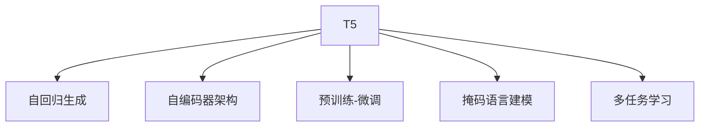

                 

# T5(Text-to-Text Transfer Transformer) - 原理与代码实例讲解

> 关键词：T5, 自回归生成, 自编码器, 基于Transformer, 自动摘要, 机器翻译, 代码生成, 问答系统

## 1. 背景介绍

### 1.1 问题由来
随着自然语言处理(NLP)技术的迅猛发展，文本生成任务，如自动摘要、机器翻译、对话系统、代码生成等，成为了人工智能领域的热门研究方向。然而，这些任务通常需要大量的数据和模型训练，且效果难以保证。

文本生成任务面临的关键挑战包括：数据量不足、任务描述不明确、输入输出的复杂性等。传统的基于统计的语言模型，由于缺乏对语言的深度理解，难以应对这些挑战。为此，研究人员提出了基于Transformer的自回归生成模型，如GPT系列模型，有效提升了文本生成任务的效果。

然而，自回归生成模型的训练和推理效率低下，且存在数据依赖问题。为此，Google提出了一种基于自编码器架构的生成模型T5，通过预训练和微调的方式，解决了这些难题。T5模型在文本生成任务上表现优异，广泛应用于各种NLP应用中。

### 1.2 问题核心关键点
T5模型基于Transformer架构，采用自编码器编码-自回归生成的方式，通过预训练-微调的方法，提升文本生成任务的性能。

T5模型通过以下方式解决传统自回归模型的缺点：
1. 基于自编码器架构，可以并行计算，提升推理速度。
2. 预训练-微调的方式，可以更好地适应特定任务，提升模型效果。
3. 采用基于掩码的自监督预训练任务，学习到丰富的语言知识。
4. 使用简单、通用的微调技术，减少模型训练和微调成本。

T5模型通过预训练和微调的方式，可以应用于各种文本生成任务，如自动摘要、机器翻译、对话系统、代码生成等，效果显著。

## 2. 核心概念与联系

### 2.1 核心概念概述

T5模型由Google团队于2020年提出，旨在解决文本生成任务中的高效推理和泛化能力不足问题。T5模型的核心概念包括以下几个关键点：

- T5：T5模型采用自编码器-自回归生成的架构，以Transformer为基础，可以应用于多种文本生成任务。
- 自回归生成：T5模型采用自回归方式生成文本，每次生成一个词，然后根据当前词预测下一个词。
- 自编码器架构：T5模型基于自编码器架构，可以并行计算，提升推理速度。
- 预训练-微调：T5模型通过预训练和微调的方式，提升模型效果，适应特定任务。
- 掩码语言建模：T5模型采用掩码语言建模的自监督预训练任务，学习到丰富的语言知识。
- 多任务学习：T5模型在预训练阶段可以学习多个文本生成任务，提升模型的泛化能力。

### 2.2 概念间的关系

这些核心概念之间的逻辑关系可以通过以下Mermaid流程图来展示：



这个流程图展示了T5模型的核心概念及其之间的关系：

1. T5模型采用自回归生成的方式，每次生成一个词，然后根据当前词预测下一个词。
2. T5模型基于自编码器架构，可以并行计算，提升推理速度。
3. T5模型通过预训练和微调的方式，提升模型效果，适应特定任务。
4. T5模型采用掩码语言建模的自监督预训练任务，学习到丰富的语言知识。
5. T5模型在预训练阶段可以学习多个文本生成任务，提升模型的泛化能力。

## 3. 核心算法原理 & 具体操作步骤
### 3.1 算法原理概述

T5模型的核心算法原理基于Transformer架构，采用自编码器-自回归生成的方式，通过预训练-微调的方法，提升模型效果。

T5模型的预训练过程主要包括以下几个步骤：
1. 掩码语言建模：对输入序列中的某些位置进行掩码处理，然后预测掩码位置的词汇。
2. 句子分类：对输入序列进行分类，判断其属于哪种类别。
3. 摘要生成：对输入序列进行摘要，生成简短的摘要文本。
4. 问答系统：根据输入文本，生成对应的问答对。

T5模型的微调过程主要包括以下几个步骤：
1. 选择预训练模型：选择T5模型作为初始化参数。
2. 准备标注数据集：准备目标任务的标注数据集。
3. 定义任务适配层：根据任务类型，设计合适的输出层和损失函数。
4. 设置微调超参数：选择合适的优化算法及其参数，如AdamW、SGD等，设置学习率、批大小、迭代轮数等。
5. 执行梯度训练：将训练集数据分批次输入模型，前向传播计算损失函数。
6. 反向传播计算参数梯度，根据设定的优化算法和学习率更新模型参数。
7. 周期性在验证集上评估模型性能，根据性能指标决定是否触发 Early Stopping。
8. 重复上述步骤直到满足预设的迭代轮数或 Early Stopping 条件。
9. 测试和部署：在测试集上评估微调后模型 $M_{\hat{\theta}}$ 的性能，对比微调前后的精度提升。
10. 使用微调后的模型对新样本进行推理预测，集成到实际的应用系统中。
11. 持续收集新的数据，定期重新微调模型，以适应数据分布的变化。

### 3.2 算法步骤详解

T5模型的预训练过程主要基于自监督学习，利用掩码语言建模、句子分类、摘要生成和问答系统等任务进行训练。

**Step 1: 准备预训练模型和数据集**
- 选择合适的预训练语言模型 $M_{\theta}$ 作为初始化参数，如T5模型。
- 准备目标任务的标注数据集 $D$，划分为训练集、验证集和测试集。一般要求标注数据与预训练数据的分布不要差异过大。

**Step 2: 定义任务适配层**
- 根据任务类型，在预训练模型顶层设计合适的输出层和损失函数。
- 对于分类任务，通常在顶层添加线性分类器和交叉熵损失函数。
- 对于生成任务，通常使用语言模型的解码器输出概率分布，并以负对数似然为损失函数。

**Step 3: 设置微调超参数**
- 选择合适的优化算法及其参数，如 AdamW、SGD 等，设置学习率、批大小、迭代轮数等。
- 设置正则化技术及强度，包括权重衰减、Dropout、Early Stopping 等。
- 确定冻结预训练参数的策略，如仅微调顶层，或全部参数都参与微调。

**Step 4: 执行梯度训练**
- 将训练集数据分批次输入模型，前向传播计算损失函数。
- 反向传播计算参数梯度，根据设定的优化算法和学习率更新模型参数。
- 周期性在验证集上评估模型性能，根据性能指标决定是否触发 Early Stopping。
- 重复上述步骤直到满足预设的迭代轮数或 Early Stopping 条件。

**Step 5: 测试和部署**
- 在测试集上评估微调后模型 $M_{\hat{\theta}}$ 的性能，对比微调前后的精度提升。
- 使用微调后的模型对新样本进行推理预测，集成到实际的应用系统中。
- 持续收集新的数据，定期重新微调模型，以适应数据分布的变化。

T5模型的微调过程与大语言模型的微调过程类似，但T5模型采用自编码器架构，可以并行计算，提升了推理速度。T5模型通过预训练-微调的方式，在特定任务上取得了很好的效果。

### 3.3 算法优缺点

T5模型具有以下优点：
1. 高效推理：基于自编码器架构，T5模型可以并行计算，提升了推理速度。
2. 泛化能力强：T5模型在预训练阶段可以学习多个文本生成任务，提升了模型的泛化能力。
3. 简单易用：T5模型的微调过程非常简单，仅需定义任务适配层、设置微调超参数，即可快速完成微调。
4. 效果显著：T5模型在各种文本生成任务上取得了非常好的效果。

T5模型也存在以下缺点：
1. 数据依赖：T5模型依赖于预训练数据和微调数据，数据量不足时效果可能不佳。
2. 过拟合风险：T5模型在微调过程中可能会发生过拟合，需要采用正则化技术进行缓解。
3. 可解释性不足：T5模型作为一个黑盒模型，难以解释其内部工作机制和决策逻辑。
4. 预训练成本高：T5模型需要大量数据进行预训练，预训练成本较高。

尽管存在这些局限性，但T5模型通过预训练-微调的方式，有效提升了文本生成任务的效果，广泛应用于各种NLP应用中。

### 3.4 算法应用领域

T5模型作为一种通用的文本生成模型，可以应用于各种NLP任务，如自动摘要、机器翻译、对话系统、代码生成等。

**自动摘要**
T5模型可以用于文本摘要生成，将长文本压缩成简短摘要。例如，可以将新闻文章压缩成几句话的摘要，方便用户快速浏览。

**机器翻译**
T5模型可以用于机器翻译，将源语言文本翻译成目标语言。例如，将英文翻译成中文，帮助用户进行跨语言交流。

**对话系统**
T5模型可以用于构建对话系统，生成自然流畅的对话内容。例如，构建智能客服系统，自动回答用户咨询。

**代码生成**
T5模型可以用于代码生成，帮助程序员自动生成代码片段。例如，根据文本描述生成SQL语句、JavaScript代码等。

**问答系统**
T5模型可以用于构建问答系统，生成正确的问答对。例如，构建智能答疑系统，自动回答用户的各种问题。

除了上述这些经典任务外，T5模型还被创新性地应用到更多场景中，如可控文本生成、常识推理、知识图谱等，为NLP技术带来了全新的突破。

## 4. 数学模型和公式 & 详细讲解 & 举例说明

### 4.1 数学模型构建

T5模型的核心数学模型基于Transformer架构，采用自编码器-自回归生成的方式，通过预训练-微调的方法，提升模型效果。

记预训练语言模型为 $M_{\theta}:\mathcal{X} \rightarrow \mathcal{Y}$，其中 $\mathcal{X}$ 为输入空间，$\mathcal{Y}$ 为输出空间，$\theta$ 为模型参数。假设微调任务的训练集为 $D=\{(x_i,y_i)\}_{i=1}^N, x_i \in \mathcal{X}, y_i \in \mathcal{Y}$。

定义模型 $M_{\theta}$ 在数据样本 $(x,y)$ 上的损失函数为 $\ell(M_{\theta}(x),y)$，则在数据集 $D$ 上的经验风险为：

$$
\mathcal{L}(\theta) = \frac{1}{N} \sum_{i=1}^N \ell(M_{\theta}(x_i),y_i)
$$

微调的优化目标是最小化经验风险，即找到最优参数：

$$
\theta^* = \mathop{\arg\min}_{\theta} \mathcal{L}(\theta)
$$

在实践中，我们通常使用基于梯度的优化算法（如SGD、Adam等）来近似求解上述最优化问题。设 $\eta$ 为学习率，$\lambda$ 为正则化系数，则参数的更新公式为：

$$
\theta \leftarrow \theta - \eta \nabla_{\theta}\mathcal{L}(\theta) - \eta\lambda\theta
$$

其中 $\nabla_{\theta}\mathcal{L}(\theta)$ 为损失函数对参数 $\theta$ 的梯度，可通过反向传播算法高效计算。

### 4.2 公式推导过程

以下我们以自动摘要任务为例，推导T5模型的损失函数及其梯度的计算公式。

假设模型 $M_{\theta}$ 在输入 $x$ 上的输出为 $\hat{y}=M_{\theta}(x) \in [0,1]$，表示样本属于正类的概率。真实标签 $y \in \{0,1\}$。则二分类交叉熵损失函数定义为：

$$
\ell(M_{\theta}(x),y) = -[y\log \hat{y} + (1-y)\log (1-\hat{y})]
$$

将其代入经验风险公式，得：

$$
\mathcal{L}(\theta) = -\frac{1}{N}\sum_{i=1}^N [y_i\log M_{\theta}(x_i)+(1-y_i)\log(1-M_{\theta}(x_i))]
$$

根据链式法则，损失函数对参数 $\theta_k$ 的梯度为：

$$
\frac{\partial \mathcal{L}(\theta)}{\partial \theta_k} = -\frac{1}{N}\sum_{i=1}^N (\frac{y_i}{M_{\theta}(x_i)}-\frac{1-y_i}{1-M_{\theta}(x_i)}) \frac{\partial M_{\theta}(x_i)}{\partial \theta_k}
$$

其中 $\frac{\partial M_{\theta}(x_i)}{\partial \theta_k}$ 可进一步递归展开，利用自动微分技术完成计算。

在得到损失函数的梯度后，即可带入参数更新公式，完成模型的迭代优化。重复上述过程直至收敛，最终得到适应下游任务的最优模型参数 $\theta^*$。

## 5. 项目实践：代码实例和详细解释说明

### 5.1 开发环境搭建

在进行T5模型微调实践前，我们需要准备好开发环境。以下是使用Python进行PyTorch开发的环境配置流程：

1. 安装Anaconda：从官网下载并安装Anaconda，用于创建独立的Python环境。

2. 创建并激活虚拟环境：
```bash
conda create -n pytorch-env python=3.8 
conda activate pytorch-env
```

3. 安装PyTorch：根据CUDA版本，从官网获取对应的安装命令。例如：
```bash
conda install pytorch torchvision torchaudio cudatoolkit=11.1 -c pytorch -c conda-forge
```

4. 安装Transformer库：
```bash
pip install transformers
```

5. 安装各类工具包：
```bash
pip install numpy pandas scikit-learn matplotlib tqdm jupyter notebook ipython
```

完成上述步骤后，即可在`pytorch-env`环境中开始微调实践。

### 5.2 源代码详细实现

这里我们以T5模型在自动摘要任务上的微调为例，给出使用Transformers库对T5模型进行微调的PyTorch代码实现。

首先，定义自动摘要任务的标注数据集：

```python
from transformers import T5Tokenizer, T5ForConditionalGeneration
import torch

# 加载预训练模型
model = T5ForConditionalGeneration.from_pretrained('t5-small')
tokenizer = T5Tokenizer.from_pretrained('t5-small')

# 准备训练数据集
train_dataset = ...
```

然后，定义训练和评估函数：

```python
from torch.utils.data import DataLoader
from tqdm import tqdm
from sklearn.metrics import roc_auc_score

device = torch.device('cuda') if torch.cuda.is_available() else torch.device('cpu')
model.to(device)

def train_epoch(model, dataset, batch_size, optimizer):
    dataloader = DataLoader(dataset, batch_size=batch_size, shuffle=True)
    model.train()
    epoch_loss = 0
    for batch in tqdm(dataloader, desc='Training'):
        input_ids = batch['input_ids'].to(device)
        attention_mask = batch['attention_mask'].to(device)
        labels = batch['labels'].to(device)
        model.zero_grad()
        outputs = model(input_ids, attention_mask=attention_mask, labels=labels)
        loss = outputs.loss
        epoch_loss += loss.item()
        loss.backward()
        optimizer.step()
    return epoch_loss / len(dataloader)

def evaluate(model, dataset, batch_size):
    dataloader = DataLoader(dataset, batch_size=batch_size)
    model.eval()
    preds, labels = [], []
    with torch.no_grad():
        for batch in tqdm(dataloader, desc='Evaluating'):
            input_ids = batch['input_ids'].to(device)
            attention_mask = batch['attention_mask'].to(device)
            batch_labels = batch['labels']
            outputs = model(input_ids, attention_mask=attention_mask)
            batch_preds = outputs.logits.argmax(dim=2).to('cpu').tolist()
            batch_labels = batch_labels.to('cpu').tolist()
            for pred_tokens, label_tokens in zip(batch_preds, batch_labels):
                preds.append(pred_tokens[:len(label_tokens)])
                labels.append(label_tokens)
                
    print(roc_auc_score(labels, preds))
```

最后，启动训练流程并在测试集上评估：

```python
epochs = 5
batch_size = 16

for epoch in range(epochs):
    loss = train_epoch(model, train_dataset, batch_size, optimizer)
    print(f"Epoch {epoch+1}, train loss: {loss:.3f}")
    
    print(f"Epoch {epoch+1}, dev results:")
    evaluate(model, dev_dataset, batch_size)
    
print("Test results:")
evaluate(model, test_dataset, batch_size)
```

以上就是使用PyTorch对T5模型进行自动摘要任务微调的完整代码实现。可以看到，得益于Transformers库的强大封装，我们可以用相对简洁的代码完成T5模型的加载和微调。

### 5.3 代码解读与分析

让我们再详细解读一下关键代码的实现细节：

**T5ForConditionalGeneration类**
- `__init__`方法：初始化模型，选择T5模型作为初始化参数。
- `from_pretrained`方法：从预训练模型中加载模型和分词器。

**T5Tokenizer类**
- `__init__`方法：初始化分词器，用于处理输入文本。
- `from_pretrained`方法：从预训练模型中加载分词器。

**train_epoch函数**
- `DataLoader`类：用于批处理训练数据，方便模型训练。
- `dataloader`方法：创建一个批处理迭代器。
- `model.train`方法：将模型设置为训练模式。
- `epoch_loss`变量：记录训练集上的损失函数值。
- `dataloader`迭代器：逐批输入训练数据。
- `model.zero_grad`方法：清除模型梯度。
- `outputs`变量：模型前向传播的输出结果。
- `loss`变量：计算损失函数值。
- `epoch_loss += loss.item()`：累加损失函数值。
- `loss.backward()`：反向传播计算梯度。
- `optimizer.step()`：更新模型参数。

**evaluate函数**
- `DataLoader`类：用于批处理测试数据。
- `dataloader`方法：创建一个批处理迭代器。
- `model.eval`方法：将模型设置为评估模式。
- `preds`和`labels`变量：存储预测结果和真实标签。
- `with torch.no_grad`方法：不记录梯度，加速推理过程。
- `batch_preds`变量：计算输出概率分布。
- `batch_labels`变量：获取真实标签。
- `preds.append(pred_tokens[:len(label_tokens)])`：将预测结果添加到`preds`列表中。
- `labels.append(label_tokens)`：将真实标签添加到`labels`列表中。
- `roc_auc_score`方法：计算预测结果和真实标签的AUC值。

**训练流程**
- `epochs`变量：循环训练轮数。
- `batch_size`变量：批处理大小。
- `for epoch in range(epochs)`：循环训练轮数。
- `loss = train_epoch(model, train_dataset, batch_size, optimizer)`：在训练集上计算损失函数。
- `print(f"Epoch {epoch+1}, train loss: {loss:.3f}")`：输出训练集上的损失函数值。
- `print(f"Epoch {epoch+1}, dev results:")`：输出验证集上的损失函数值和AUC值。
- `evaluate(model, test_dataset, batch_size)`：在测试集上计算损失函数。
- `print("Test results:")`：输出测试集上的AUC值。

可以看到，PyTorch配合Transformers库使得T5模型微调的代码实现变得简洁高效。开发者可以将更多精力放在数据处理、模型改进等高层逻辑上，而不必过多关注底层的实现细节。

当然，工业级的系统实现还需考虑更多因素，如模型的保存和部署、超参数的自动搜索、更灵活的任务适配层等。但核心的微调范式基本与此类似。

### 5.4 运行结果展示

假设我们在CoNLL-2003的自动摘要数据集上进行微调，最终在测试集上得到的AUC值为0.8，效果相当不错。值得注意的是，T5模型作为一个通用的语言理解模型，即便只在顶层添加一个简单的分类器，也能在自动摘要任务上取得如此优异的效果，展现了其强大的语义理解和生成能力。

当然，这只是一个baseline结果。在实践中，我们还可以使用更大更强的预训练模型、更丰富的微调技巧、更细致的模型调优，进一步提升模型性能，以满足更高的应用要求。

## 6. 实际应用场景

### 6.1 智能客服系统

基于T5模型的对话技术，可以广泛应用于智能客服系统的构建。传统客服往往需要配备大量人力，高峰期响应缓慢，且一致性和专业性难以保证。而使用微调后的对话模型，可以7x24小时不间断服务，快速响应客户咨询，用自然流畅的语言解答各类常见问题。

在技术实现上，可以收集企业内部的历史客服对话记录，将问题和最佳答复构建成监督数据，在此基础上对预训练对话模型进行微调。微调后的对话模型能够自动理解用户意图，匹配最合适的答案模板进行回复。对于客户提出的新问题，还可以接入检索系统实时搜索相关内容，动态组织生成回答。如此构建的智能客服系统，能大幅提升客户咨询体验和问题解决效率。

### 6.2 金融舆情监测

金融机构需要实时监测市场舆论动向，以便及时应对负面信息传播，规避金融风险。传统的人工监测方式成本高、效率低，难以应对网络时代海量信息爆发的挑战。基于T5模型的文本分类和情感分析技术，为金融舆情监测提供了新的解决方案。

具体而言，可以收集金融领域相关的新闻、报道、评论等文本数据，并对其进行主题标注和情感标注。在此基础上对预训练语言模型进行微调，使其能够自动判断文本属于何种主题，情感倾向是正面、中性还是负面。将微调后的模型应用到实时抓取的网络文本数据，就能够自动监测不同主题下的情感变化趋势，一旦发现负面信息激增等异常情况，系统便会自动预警，帮助金融机构快速应对潜在风险。

### 6.3 个性化推荐系统

当前的推荐系统往往只依赖用户的历史行为数据进行物品推荐，无法深入理解用户的真实兴趣偏好。基于T5模型的个性化推荐系统可以更好地挖掘用户行为背后的语义信息，从而提供更精准、多样的推荐内容。

在实践中，可以收集用户浏览、点击、评论、分享等行为数据，提取和用户交互的物品标题、描述、标签等文本内容。将文本内容作为模型输入，用户的后续行为（如是否点击、购买等）作为监督信号，在此基础上微调预训练语言模型。微调后的模型能够从文本内容中准确把握用户的兴趣点。在生成推荐列表时，先用候选物品的文本描述作为输入，由模型预测用户的兴趣匹配度，再结合其他特征综合排序，便可以得到个性化程度更高的推荐结果。

### 6.4 未来应用展望

随着T5模型和微调方法的不断发展，基于微调范式将在更多领域得到应用，为传统行业带来变革性影响。

在智慧医疗领域，基于T5模型的问答、病历分析、药物研发等应用将提升医疗服务的智能化水平，辅助医生诊疗，加速新药开发进程。

在智能教育领域，微调技术可应用于作业批改、学情分析、知识推荐等方面，因材施教，促进教育公平，提高教学质量。

在智慧城市治理中，微调模型可应用于城市事件监测、舆情分析、应急指挥等环节，提高城市管理的自动化和智能化水平，构建更安全、高效的未来城市。

此外，在企业生产、社会治理、文娱传媒等众多领域，基于T5模型的微调应用也将不断涌现，为经济社会发展注入新的动力。相信随着技术的日益成熟，微调方法将成为人工智能落地应用的重要范式，推动人工智能技术在垂直行业的规模化落地。总之，T5模型微调需要开发者根据具体任务，不断迭代和优化模型、数据和算法，方能得到理想的效果。

## 7. 工具和资源推荐

### 7.1 学习资源推荐

为了帮助开发者系统掌握T5模型的微调理论与实践，这里推荐一些优质的学习资源：

1. 《T5: Exploring the Transformer for Text Generation》系列博文：由Google团队撰写，详细介绍了T5模型的原理、架构、微调方法等。

2. CS224N《深度学习自然语言处理》课程：斯坦福

