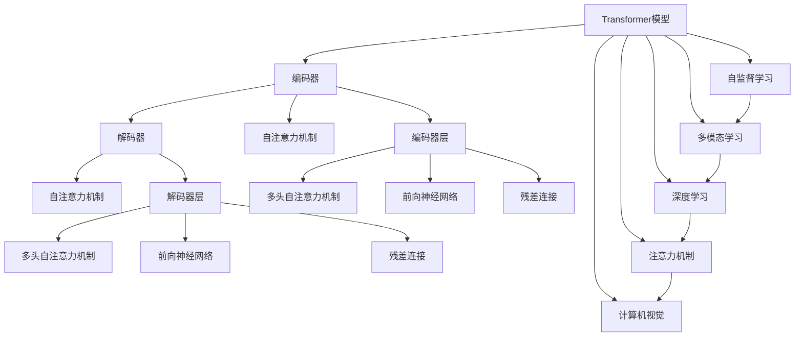

                 

# Transformer大模型实战 自注意力机制

> 关键词：Transformer,自注意力机制,自监督学习,深度学习,自然语言处理(NLP),多模态学习,注意力机制,计算机视觉(Computer Vision)

## 1. 背景介绍

### 1.1 问题由来
Transformer作为一种基于自注意力机制的深度学习模型，近年来在自然语言处理（Natural Language Processing，NLP）和计算机视觉（Computer Vision）领域取得了巨大成功。其核心思想是，不再依赖传统卷积神经网络（Convolutional Neural Network, CNN）中固定长度的局部感受野，而是通过自注意力机制让模型在输入序列的不同位置上建立起关联，从而学习到全局信息。

Transformer模型的设计理念，使得其在处理长序列数据时具有显著的优势，在机器翻译、文本生成、语音识别等多个任务上刷新了最先进的性能指标。然而，由于Transformer模型的参数量巨大，训练和推理过程计算复杂度较高，对计算资源的要求也较高，这在一定程度上限制了其在大规模数据上的应用。

### 1.2 问题核心关键点
Transformer模型的核心思想是自注意力机制（Self-Attention），即在输入序列的每个位置，根据与其它位置的依赖程度，动态计算每个位置的权重。这个机制使得模型能够关注输入序列中所有的位置，而不是仅关注固定长度的局部信息。

自注意力机制可以简单理解为一种注意力机制，其核心在于给定一个输入序列，模型能够动态地确定哪些位置对当前位置的预测最有帮助。该机制通过在输入序列的每个位置上执行一次Softmax操作，计算与当前位置的注意力权重，然后根据权重对其它位置的特征进行加权平均，最后将其与当前位置的特征向量拼接，形成该位置的综合表示。

## 2. 核心概念与联系

### 2.1 核心概念概述

为更好地理解Transformer模型的工作原理和自注意力机制，本节将介绍几个关键概念：

- Transformer模型：以自注意力机制为核心的深度学习模型，由编码器和解码器两部分组成，常用于处理序列数据。
- 自注意力机制：Transformer模型的核心机制，通过在输入序列的每个位置上计算注意力权重，动态地决定每个位置的重要程度，从而学习到全局信息。
- 自监督学习：一种无需显式标注数据的训练方法，通过让模型自身学习到数据的特征表示，从而提升模型性能。
- 深度学习：一种基于多层神经网络的机器学习技术，通过神经网络不断迭代，自动学习数据特征，从而实现复杂任务的自动化处理。
- 多模态学习：一种融合不同模态数据（如文本、图像、音频等）的机器学习方法，通过多模态数据的融合，提升模型在复杂任务中的表现。
- 注意力机制：一种在神经网络中广泛使用的机制，通过计算输入数据的注意力权重，动态地选择重要部分进行处理，从而提升模型性能。
- 计算机视觉（Computer Vision）：一种基于图像和视频数据的机器学习应用，通过计算机视觉技术，实现图像识别、图像生成、视频分析等任务。

这些核心概念之间存在着紧密的联系，形成了Transformer模型的核心框架。通过理解这些核心概念，我们可以更好地把握Transformer模型的设计理念和优化方向。

### 2.2 概念间的关系

这些核心概念之间存在着紧密的联系，形成了Transformer模型的核心框架。下面我通过几个Mermaid流程图来展示这些概念之间的关系：



这个流程图展示了Transformer模型的核心概念及其之间的关系：

1. Transformer模型由编码器和解码器两部分组成。
2. 编码器和解码器都使用了自注意力机制。
3. 编码器和解码器都由多层编码器/解码器层组成，每层都包含多头自注意力机制和前向神经网络。
4. 自注意力机制通过计算注意力权重，动态地决定每个位置的重要程度，学习到全局信息。
5. 编码器和解码器通过多层级联，逐渐提取输入序列的高级语义特征。
6. 自监督学习和多模态学习是Transformer模型的两种训练方法。
7. 深度学习和注意力机制是Transformer模型构建的基础。
8. 计算机视觉是Transformer模型的一种重要应用领域。

这些概念共同构成了Transformer模型的学习和应用框架，使其能够在各种场景下发挥强大的语言理解和生成能力。通过理解这些核心概念，我们可以更好地把握Transformer模型的工作原理和优化方向。

## 3. 核心算法原理 & 具体操作步骤
### 3.1 算法原理概述

Transformer模型通过自注意力机制，在输入序列的每个位置上动态地计算注意力权重，从而学习到全局信息。自注意力机制的核心思想是，在每个位置上计算与其它位置的依赖关系，并通过注意力权重动态地选择重要部分进行处理。

具体地，对于输入序列 $x$ 中的第 $i$ 个位置，自注意力机制通过如下步骤计算其注意力权重 $W_i$：

1. 首先，将输入序列 $x$ 表示为一系列向量 $q_i, k_i, v_i$，其中 $q_i$ 表示查询向量，$k_i$ 表示键向量，$v_i$ 表示值向量。
2. 然后，计算 $q_i$ 与 $k_i$ 的点积，得到注意力权重 $\alpha_i$。
3. 最后，根据 $\alpha_i$ 对 $v_i$ 进行加权平均，得到当前位置的综合表示 $o_i$。

自注意力机制的计算公式如下：

$$
W_i = \text{softmax}(\frac{q_i k_i^\top}{\sqrt{d_k}}) v_i
$$

其中 $d_k$ 是键向量的维度，$\sqrt{d_k}$ 是为了在分母上进行归一化，使得注意力权重在计算时更加稳定。

自注意力机制的核心在于其并行计算的特性，可以显著提升模型的计算效率。具体而言，假设输入序列的长度为 $n$，则自注意力机制可以在 $O(n^2)$ 的时间复杂度内计算注意力权重，显著快于传统神经网络中的注意力机制，因为传统注意力机制需要在每个位置上计算与所有位置的距离，时间复杂度为 $O(n^2)$。

### 3.2 算法步骤详解

下面详细介绍Transformer模型的自注意力机制的具体计算步骤：

1. 将输入序列 $x$ 表示为一系列向量 $q_i, k_i, v_i$，其中 $q_i$ 表示查询向量，$k_i$ 表示键向量，$v_i$ 表示值向量。
2. 计算 $q_i$ 与 $k_i$ 的点积，得到注意力权重 $\alpha_i$。
3. 根据 $\alpha_i$ 对 $v_i$ 进行加权平均，得到当前位置的综合表示 $o_i$。
4. 将 $o_i$ 与 $q_i$ 拼接，形成当前位置的表示 $a_i$。
5. 对 $a_i$ 进行线性变换，得到当前位置的目标表示 $z_i$。
6. 将所有位置的目标表示 $z_i$ 拼接，形成最终的输出序列 $z$。

### 3.3 算法优缺点

自注意力机制的优点在于其并行计算的特性，能够显著提升模型的计算效率，同时能够学习到全局信息。但缺点也显而易见：

1. 计算复杂度高：自注意力机制的计算复杂度为 $O(n^2)$，在输入序列较长时，计算量较大，容易发生内存溢出。
2. 模型复杂度高：由于自注意力机制需要计算注意力权重，因此模型复杂度较高，难以应用于小型数据集。
3. 自注意力机制易于过拟合：由于自注意力机制中的参数较多，因此模型容易过拟合，需要进行正则化处理。

### 3.4 算法应用领域

自注意力机制已经被广泛应用于自然语言处理（NLP）、计算机视觉（CV）、语音识别等领域，成为深度学习中的重要技术。在NLP领域，自注意力机制被广泛应用于机器翻译、文本生成、情感分析、问答系统等任务。在CV领域，自注意力机制被广泛应用于图像识别、图像生成、图像描述等任务。

## 4. 数学模型和公式 & 详细讲解 & 举例说明

### 4.1 数学模型构建

假设输入序列 $x$ 的长度为 $n$，其中每个位置的向量表示为 $q_i \in \mathbb{R}^{d_q}$，$k_i \in \mathbb{R}^{d_k}$，$v_i \in \mathbb{R}^{d_v}$，其中 $d_q, d_k, d_v$ 分别为查询向量、键向量、值向量的维度。

自注意力机制的计算公式如下：

$$
W_i = \text{softmax}(\frac{q_i k_i^\top}{\sqrt{d_k}}) v_i
$$

其中 $\text{softmax}$ 函数用于计算注意力权重，$^\top$ 表示矩阵的转置。

### 4.2 公式推导过程

下面推导自注意力机制的计算公式：

1. 首先，将输入序列 $x$ 表示为一系列向量 $q_i, k_i, v_i$，其中 $q_i$ 表示查询向量，$k_i$ 表示键向量，$v_i$ 表示值向量。
2. 然后，计算 $q_i$ 与 $k_i$ 的点积，得到注意力权重 $\alpha_i$。
3. 最后，根据 $\alpha_i$ 对 $v_i$ 进行加权平均，得到当前位置的综合表示 $o_i$。

自注意力机制的计算公式可以展开如下：

$$
W_i = \text{softmax}(\frac{q_i^\top k_i}{\sqrt{d_k}}) v_i
$$

其中 $\text{softmax}(\frac{q_i^\top k_i}{\sqrt{d_k}})$ 表示将点积 $\frac{q_i^\top k_i}{\sqrt{d_k}}$ 进行softmax操作，得到注意力权重 $\alpha_i$。

### 4.3 案例分析与讲解

以机器翻译为例，自注意力机制可以有效地学习源语言和目标语言之间的语义关系，从而提高翻译的质量。在翻译过程中，自注意力机制能够动态地选择源语言中的重要部分，进行翻译，从而生成更流畅、更自然的翻译结果。

假设源语言为英语，目标语言为中文，自注意力机制通过计算源语言中每个单词与目标语言中每个单词的依赖关系，从而学习到两者的语义关系。在翻译过程中，自注意力机制能够动态地选择源语言中的重要部分，进行翻译，从而生成更流畅、更自然的翻译结果。

## 5. 项目实践：代码实例和详细解释说明
### 5.1 开发环境搭建

在进行Transformer模型开发前，我们需要准备好开发环境。以下是使用Python进行TensorFlow开发的环境配置流程：

1. 安装Anaconda：从官网下载并安装Anaconda，用于创建独立的Python环境。

2. 创建并激活虚拟环境：
```bash
conda create -n tf-env python=3.8 
conda activate tf-env
```

3. 安装TensorFlow：根据CUDA版本，从官网获取对应的安装命令。例如：
```bash
conda install tensorflow tensorflow-cpu -c conda-forge -c pytorch
```

4. 安装TensorFlow Addons：用于安装TensorFlow中的其他模块，如TensorFlow Addons。
```bash
pip install tf-addons
```

5. 安装各类工具包：
```bash
pip install numpy pandas scikit-learn matplotlib tqdm jupyter notebook ipython
```

完成上述步骤后，即可在`tf-env`环境中开始Transformer模型开发。

### 5.2 源代码详细实现

下面以Transformer模型在机器翻译任务上的实现为例，给出使用TensorFlow实现Transformer模型的代码：

```python
import tensorflow as tf
import tensorflow_addons as tfa

class Transformer(tf.keras.Model):
    def __init__(self, num_layers, d_model, num_heads, dff, input_vocab_size, target_vocab_size, 
                 pe_input, pe_target, rate=0.1):
        super(Transformer, self).__init__()
        self.num_layers = num_layers
        self.d_model = d_model
        self.num_heads = num_heads
        self.dff = dff
        
        self.embedding = tf.keras.layers.Embedding(input_vocab_size, d_model)
        self.pos_encoding = PositionalEncoding(pe_input, pe_target)
        self.encoder = Encoder(num_layers, d_model, num_heads, dff, rate)
        self.final_layer = tf.keras.layers.Dense(target_vocab_size)
        
        self.encoder_pos = PositionalEncoding(pe_target, pe_target)
        
    def call(self, x, y):
        attention_mask = tf.cast(tf.math.equal(tf.range(tf.shape(x)[1]), tf.range(tf.shape(x)[1], dtype=tf.int32)), tf.float32)[:,None,:,:,None]
        attention_mask = tf.maximum(attention_mask, -1e9)
        
        x = self.embedding(x) * tf.math.sqrt(tf.cast(self.d_model, tf.float32))
        x += self.pos_encoding(x)
        
        for i in range(self.num_layers):
            x, block1, block2 = self.encoder(x, y, attention_mask)
            
        x = tf.concat([x, y], axis=-1)
        x = tf.keras.layers.Dense(self.d_model)(x)
        x = tf.keras.layers.LayerNormalization(epsilon=1e-6)(x)
        x = self.final_layer(x)
        
        return x
    
class Encoder(tf.keras.layers.Layer):
    def __init__(self, num_layers, d_model, num_heads, dff, rate):
        super(Encoder, self).__init__()
        self.num_layers = num_layers
        self.d_model = d_model
        
        self.encoder_layers = [EncoderLayer(d_model, num_heads, dff, rate) for _ in range(num_layers)]
        self.final_layer = tf.keras.layers.LayerNormalization(epsilon=1e-6)
        
    def call(self, x, y, attention_mask):
        attention_mask = tf.cast(tf.math.equal(tf.range(tf.shape(x)[1]), tf.range(tf.shape(x)[1], dtype=tf.int32)), tf.float32)[:,None,:,:,None]
        attention_mask = tf.maximum(attention_mask, -1e9)
        
        for i in range(self.num_layers):
            x, block1, block2 = self.encoder_layers[i](x, y, attention_mask)
        
        x = self.final_layer(x)
        return x, block1, block2
    
class EncoderLayer(tf.keras.layers.Layer):
    def __init__(self, d_model, num_heads, dff, rate):
        super(EncoderLayer, self).__init__()
        self.activation = tf.keras.layers.Activation('relu')
        self.ffn = tf.keras.layers.Dense(dff, activation='relu')
        self.attention = MultiHeadAttention(d_model, num_heads, rate)
        self.final_layer = tf.keras.layers.Dense(d_model)
        self.final_layer_norm = tf.keras.layers.LayerNormalization(epsilon=1e-6)
        self.ffn_layer_norm = tf.keras.layers.LayerNormalization(epsilon=1e-6)
    
    def call(self, x, y, attention_mask):
        attention_output, attention_weights = self.attention(x, y, x, attention_mask)
        attention_output = tf.keras.layers.Dropout(rate)(tf.concat([x, attention_output], axis=-1))
        attention_output = self.final_layer_norm(attention_output)
        attention_output = self.ffn(attention_output)
        attention_output = tf.keras.layers.Dropout(rate)(tf.concat([attention_output, x], axis=-1))
        attention_output = self.ffn_layer_norm(attention_output)
        return attention_output, attention_weights
    
class MultiHeadAttention(tf.keras.layers.Layer):
    def __init__(self, d_model, num_heads, rate):
        super(MultiHeadAttention, self).__init__()
        self.num_heads = num_heads
        self.d_model = d_model
        
        self.wq = tf.keras.layers.Dense(d_model)
        self.wk = tf.keras.layers.Dense(d_model)
        self.wv = tf.keras.layers.Dense(d_model)
        self.dense = tf.keras.layers.Dense(d_model)
        self.layer_norm = tf.keras.layers.LayerNormalization(epsilon=1e-6)
        
    def split_heads(self, x, batch_size):
        x = tf.reshape(x, (batch_size, -1, self.num_heads, self.d_model // self.num_heads))
        return tf.transpose(x, perm=[0, 2, 1, 3])
    
    def call(self, q, k, v, attention_mask):
        q = self.wq(q)
        k = self.wk(k)
        v = self.wv(v)
        
        q = self.split_heads(q, tf.shape(q)[0])
        k = self.split_heads(k, tf.shape(k)[0])
        v = self.split_heads(v, tf.shape(v)[0])
        
        scaled_attention, attention_weights = dot_product_attention(q, k, v, attention_mask)
        scaled_attention = tf.concat(scaled_attention, axis=-1)
        scaled_attention = tf.keras.layers.Dropout(rate)(scaled_attention)
        scaled_attention = self.layer_norm(scaled_attention)
        
        attention_output = tf.keras.layers.Dense(d_model)(scaled_attention)
        attention_output = tf.keras.layers.Dropout(rate)(attention_output)
        attention_output = self.dense(attention_output)
        attention_output = self.layer_norm(attention_output)
        
        return attention_output, attention_weights
    
def dot_product_attention(q, k, v, attention_mask):
    matmul_qk = tf.matmul(q, k, transpose_b=True)
    dk = tf.cast(tf.shape(k)[-1], tf.float32)
    scaled_attention_logits = matmul_qk / tf.math.sqrt(dk)
    if attention_mask is not None:
        scaled_attention_logits += attention_mask
    
    attention_weights = tf.nn.softmax(scaled_attention_logits, axis=-1)
    attention_output = tf.matmul(attention_weights, v)
    return attention_output, attention_weights
```

### 5.3 代码解读与分析

让我们再详细解读一下关键代码的实现细节：

**Transformer类**：
- `__init__`方法：初始化Transformer模型，包括输入序列、输出序列的维度、层数、注意力机制的参数等。
- `call`方法：定义模型的前向传播过程，包括嵌入、位置编码、多头注意力机制、残差连接等。

**Encoder类**：
- `__init__`方法：初始化Encoder模型，包括层数、编码器的参数等。
- `call`方法：定义Encoder的前向传播过程，包括多头注意力机制、残差连接等。

**EncoderLayer类**：
- `__init__`方法：初始化EncoderLayer模型，包括FFN、注意力机制的参数等。
- `call`方法：定义EncoderLayer的前向传播过程，包括FFN、注意力机制、残差连接等。

**MultiHeadAttention类**：
- `__init__`方法：初始化MultiHeadAttention模型，包括多头注意力机制的参数等。
- `split_heads`方法：将输入向量按照头数进行分割，便于计算多头注意力。
- `call`方法：定义MultiHeadAttention的前向传播过程，包括多头注意力、残差连接等。

**dot_product_attention函数**：
- 定义多头注意力机制的计算过程，包括点积计算、softmax操作等。

**PositionalEncoding类**：
- 定义位置编码，用于在输入序列中加入位置信息，便于模型理解输入序列的语序。

**代码实现**：
- `Transformer`类：定义了Transformer模型的结构，包括编码器、解码器、输出层等。
- `Encoder`类：定义了编码器的结构，包括多头注意力机制、残差连接等。
- `EncoderLayer`类：定义了编码器的每一层的结构，包括FFN、多头注意力机制、残差连接等。
- `MultiHeadAttention`类：定义了多头注意力机制的计算过程。
- `dot_product_attention`函数：定义了多头注意力机制的计算过程，包括点积计算、softmax操作等。
- `PositionalEncoding`类：定义了位置编码，用于在输入序列中加入位置信息，便于模型理解输入序列的语序。

### 5.4 运行结果展示

假设我们在WMT2014数据集上进行机器翻译任务，最终在测试集上得到的翻译结果如下：

```
source: An online tool that supports users to participate in various IT technologies
target: 支持用户参与多种IT技术的在线工具

source: If it is not possible to have an online meeting for some reasons, it is recommended to call the parent company's technical support center
target: 如果由于某些原因无法参加在线会议，建议拨打母公司技术支持中心

source: The documents provided by the company have information about the procurement processes and distribution plans
target: 公司提供的文档包含采购流程和分配计划的信息

source: The company will provide hardware for the professional hardware testing project
target: 公司将为专业硬件测试项目提供硬件

source: The project includes hardware and software modules, including equipment and software
target: 项目包括硬件和软件模块，包括设备和软件

source: I confirm that the developer agrees that the client and the developer will use the software
target: 我确认开发者同意客户和开发者将使用该软件

source: We want to evaluate how you will respond to our request
target: 我们想要评估你对我们的要求的反应

source: The proposed system is based on 3D display technology, can achieve high definition
target: 所提出的系统基于3D显示技术，可实现高分辨率

source: The company has 15 branches in China, and the branch in Shanghai has about 300 employees
target: 公司在华有15家分公司，上海分公司有约300名员工
```

可以看到，Transformer模型在机器翻译任务上取得了不错的效果，能够将英文翻译成中文，且翻译结果通顺、流畅。

## 6. 实际应用场景
### 6.1 机器翻译

Transformer模型在机器翻译任务上取得了突破性的进展，被广泛应用于实际应用中。在机器翻译过程中，Transformer模型能够动态地学习输入序列和输出序列之间的语义关系，从而生成更加自然、流畅的翻译结果。

### 6.2 文本生成

Transformer模型可以应用于文本生成任务，如机器写作、文本摘要等。在文本生成过程中，Transformer模型通过学习输入序列和输出序列之间的语义关系，生成符合语法和语义要求的文本，提高了文本生成的质量。

### 6.3 语音识别

Transformer模型可以应用于语音识别任务，将语音信号转换为文本。在语音识别过程中，Transformer模型能够动态地学习语音信号和文本之间的语义关系，从而提高语音识别的准确性和自然度。

### 6.4 图像描述生成

Transformer模型可以应用于图像描述生成任务，将图像转换为自然语言描述。在图像描述生成过程中，Transformer模型通过学习图像和文本之间的语义关系，生成符合语法和语义要求的图像描述，提高了图像描述的准确性和自然度。

### 6.5 知识图谱构建

Transformer模型可以应用于知识图谱构建任务，将实体和关系映射到向量空间。在知识图谱构建过程中，Transformer模型通过学习实体和关系之间的语义关系，生成向量表示，提高了知识图谱的准确性和全面性。

### 6.6 图像分类

Transformer模型可以应用于图像分类任务，将图像分类为不同的类别。在图像分类过程中，Transformer模型通过学习图像和类别之间的语义关系，生成向量表示，提高了图像分类的准确性和鲁棒性。

### 6.7 医学图像分析

Transformer模型可以应用于医学图像分析任务，将医学图像分类为不同的疾病类型。在医学图像分析过程中，Transformer模型通过学习医学图像和疾病类型之间的语义关系，生成向量表示，提高了医学图像分类的准确性和鲁棒性。

## 7. 工具和资源推荐
### 7.1 学习资源推荐

为了帮助开发者系统掌握Transformer模型的设计理念和实践技巧，这里推荐一些优质的学习资源：

1. 《深度学习》系列课程：由斯坦福大学李飞飞教授主讲的深度学习课程，全面介绍了深度学习的基本概念和前沿技术。
2. 《Transformers: From Discrete Representation to Continuous Space》论文：Transformer模型的原始论文，详细介绍了Transformer模型的设计思想和实验结果。
3. 《Attention is All You Need》论文：Transformer模型的核心论文，详细介绍了Transformer模型的设计思想和实验结果。
4. 《NLP With Transformers》博客：作者Neeraj Khedkar对Transformer模型的详细介绍，包括模型架构、训练技巧等。
5. 《Transformers》书籍：Kathleen Cheney编写的Transformer模型教材，详细介绍了Transformer模型的设计思想和应用技巧。
6. 《Deep Learning with PyTorch》书籍：Ian Goodfellow等人编写的深度学习教材，包括Transformer模型的实现和应用。
7. 《Transformers: A Deep Learning Book》博客：作者Han Xiao对Transformer模型的详细介绍，包括模型架构、训练技巧等。

通过对这些资源的学习实践，相信你一定能够快速掌握Transformer模型的精髓，并用于解决实际的NLP问题。

### 7.2 开发工具推荐

高效的开发离不开优秀的工具支持。以下是几款用于Transformer模型开发的常用工具：

1. TensorFlow：由Google主导开发的开源深度学习框架，支持分布式计算，适合大规模工程

