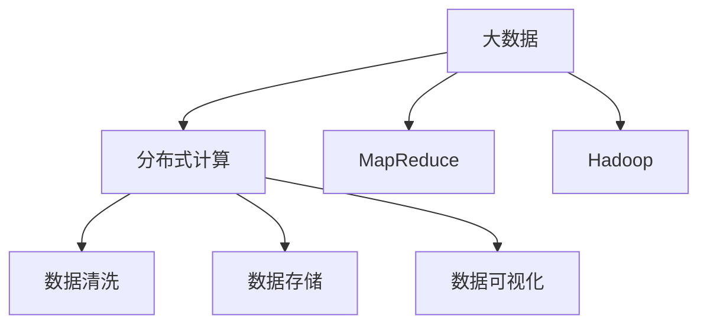
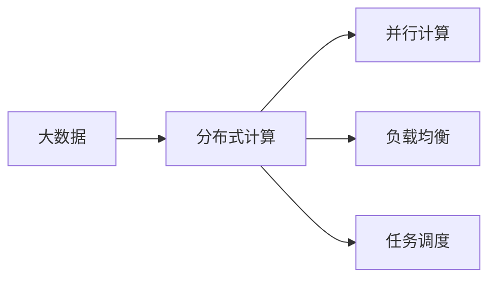
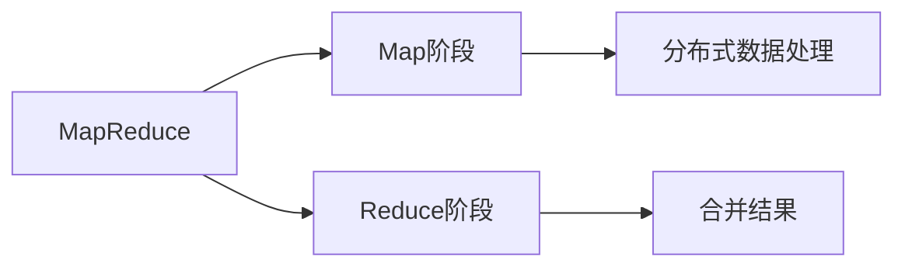
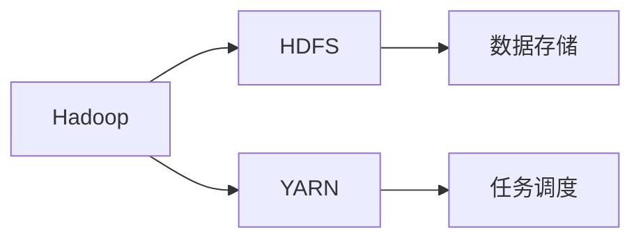
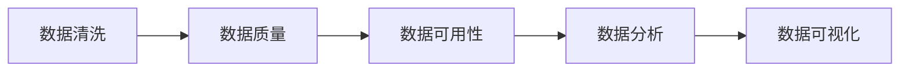
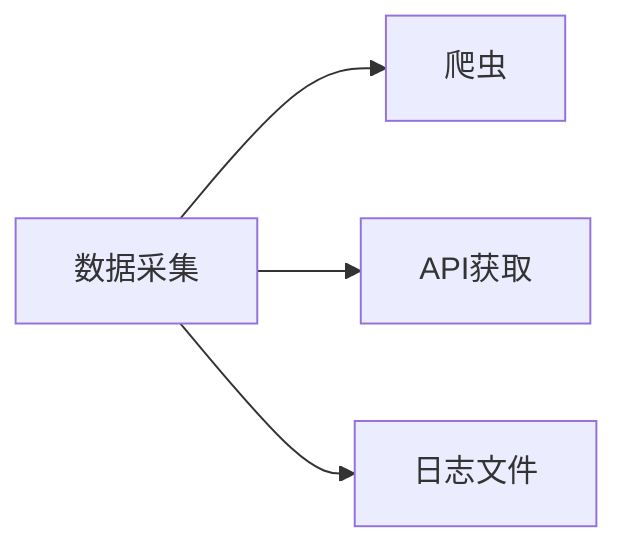
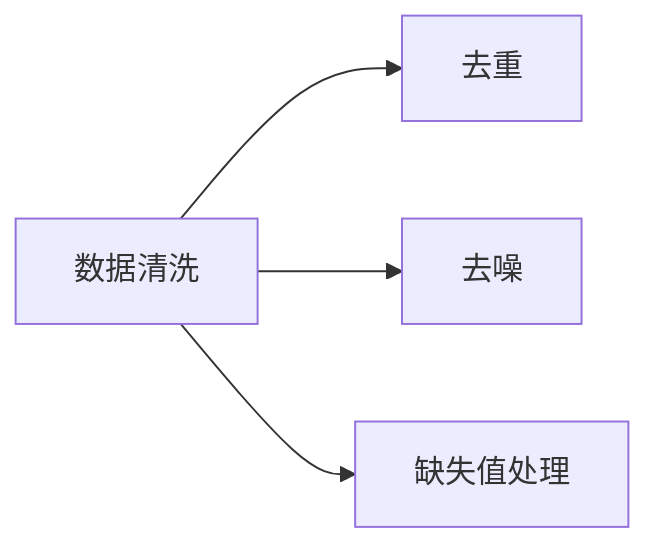
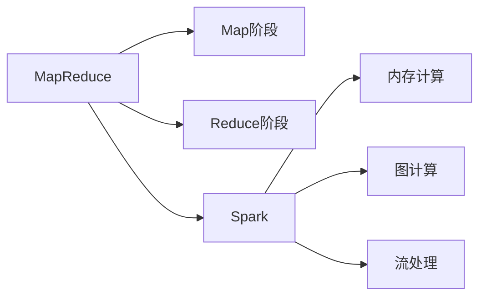

                 

# 【AI大数据计算原理与代码实例讲解】大数据

> 关键词：大数据, 分布式计算, MapReduce, 数据清洗, 数据存储, 数据可视化

## 1. 背景介绍

### 1.1 问题由来
随着互联网、物联网、移动互联网等技术的发展，大数据时代已经到来。各个行业都产生了大量的结构化和非结构化数据。这些数据具有规模大、种类多、速度快、价值密度低等特点。如何从海量数据中挖掘出有价值的信息，成为当前企业关注的焦点。

大数据技术的发展为企业的决策分析、产品研发、客户营销等方面提供了有力支撑。大数据计算与分析技术能够帮助企业发现新商机，提高运营效率，增强竞争优势。

### 1.2 问题核心关键点
大数据计算的核心在于如何高效地处理、存储和分析大规模数据集。传统的单节点处理方式已经无法满足需求，需要采用分布式计算、并行计算等技术。分布式计算技术的代表是Hadoop生态系统的MapReduce和Spark。

大数据处理过程通常包括以下步骤：
- 数据采集：从不同数据源采集数据，如网页、社交媒体、日志文件等。
- 数据清洗：去除噪声、重复、缺失等数据，确保数据的准确性和完整性。
- 数据存储：采用分布式文件系统，如HDFS（Hadoop Distributed File System），将大规模数据存储在集群中。
- 数据计算：使用MapReduce、Spark等分布式计算框架，对数据进行并行计算。
- 数据可视化：将分析结果通过图表、报表等形式呈现出来，供用户查看。

### 1.3 问题研究意义
大数据计算技术具有以下重要意义：
- 提高数据处理效率。通过分布式计算，可以在短时间内处理大规模数据集。
- 降低存储成本。采用分布式文件系统，可以节省存储空间，降低数据存储成本。
- 增强数据安全性。将数据分散存储在多个节点中，提高了数据的安全性和可靠性。
- 支持数据挖掘与分析。通过大数据计算，可以进行数据挖掘、机器学习、数据可视化等高级分析。
- 提升决策科学性。大数据分析可以为企业的决策提供数据支持，增强决策的科学性和准确性。

## 2. 核心概念与联系

### 2.1 核心概念概述
为了更好地理解大数据计算的核心技术，本节将介绍几个密切相关的核心概念：

- 大数据(Big Data)：指数据规模达到TB甚至PB级别的数据集。这些数据集通常无法在单台计算机上进行处理，需要采用分布式计算技术。
- 分布式计算(Distributed Computing)：指将计算任务分配到多个节点上并行执行，以提高计算效率和处理能力。
- MapReduce：是谷歌开发的一种分布式计算框架，用于大规模数据集的处理和分析。MapReduce模型由Map和Reduce两个阶段组成，适用于各种数据处理任务。
- Hadoop：是一个开源的分布式计算框架，支持MapReduce、Spark等计算模型。Hadoop由HDFS和YARN组成，能够管理和调度计算集群。
- 数据清洗(Data Cleaning)：指在数据处理过程中去除噪声、重复、缺失等数据，确保数据的准确性和完整性。
- 数据存储(Data Storage)：指将大规模数据存储在分布式文件系统中，支持数据的快速读写。
- 数据可视化(Data Visualization)：指将数据分析结果通过图表、报表等形式呈现出来，供用户查看。

这些核心概念之间的逻辑关系可以通过以下Mermaid流程图来展示：



这个流程图展示了大数据计算的核心概念及其之间的关系：

1. 大数据通过分布式计算得到处理，提高计算效率。
2. MapReduce是分布式计算框架之一，适用于各种数据处理任务。
3. Hadoop是分布式计算平台，支持MapReduce、Spark等计算模型。
4. 数据清洗、存储和可视化是数据处理的重要环节，保障数据的质量和可用性。

这些概念共同构成了大数据计算的核心生态系统，使得大规模数据的处理和分析成为可能。通过理解这些核心概念，我们可以更好地把握大数据计算的工作原理和优化方向。

### 2.2 概念间的关系

这些核心概念之间存在着紧密的联系，形成了大数据计算的完整生态系统。下面我们通过几个Mermaid流程图来展示这些概念之间的关系。

#### 2.2.1 大数据与分布式计算的关系



这个流程图展示了大数据与分布式计算的关系。大数据通过分布式计算技术进行高效处理，从而提高计算效率和处理能力。

#### 2.2.2 MapReduce模型



这个流程图展示了MapReduce模型的基本流程。Map阶段将数据分发到各个节点上进行分布式处理，Reduce阶段将Map阶段的结果进行合并和汇总，最终得到处理结果。

#### 2.2.3 Hadoop生态系统的组成



这个流程图展示了Hadoop生态系统的组成。HDFS用于数据存储，YARN用于任务调度，确保计算集群的高效管理和运行。

#### 2.2.4 数据清洗的重要性



这个流程图展示了数据清洗的重要性。数据清洗是数据处理的重要环节，保证了数据的准确性和完整性，从而为数据分析和可视化提供了可靠的输入。

## 3. 核心算法原理 & 具体操作步骤
### 3.1 算法原理概述

大数据计算的核心在于如何高效地处理、存储和分析大规模数据集。传统的单节点处理方式已经无法满足需求，需要采用分布式计算、并行计算等技术。分布式计算技术的代表是Hadoop生态系统的MapReduce和Spark。

MapReduce模型由Map和Reduce两个阶段组成，适用于各种数据处理任务。Map阶段将数据分发到各个节点上进行分布式处理，Reduce阶段将Map阶段的结果进行合并和汇总，最终得到处理结果。

Spark则是在MapReduce基础上，采用了内存计算、图计算、流处理等多种计算模型，能够更高效地处理大规模数据集。

### 3.2 算法步骤详解

#### 3.2.1 数据采集

数据采集是数据分析的第一步，通过从不同数据源采集数据，才能进行后续的数据处理和分析。常见的数据源包括：

- 网页数据：通过爬虫技术从网页中提取文本、图片、视频等数据。
- 社交媒体数据：从Twitter、Facebook、Instagram等社交平台获取用户生成内容。
- 日志数据：从服务器、应用等日志文件中提取日志信息。

数据采集流程如图：



#### 3.2.2 数据清洗

数据清洗是数据处理的重要环节，旨在去除噪声、重复、缺失等数据，确保数据的准确性和完整性。数据清洗流程如图：



#### 3.2.3 数据存储

数据存储是将大规模数据存储在分布式文件系统中，支持数据的快速读写。Hadoop生态系统的HDFS（Hadoop Distributed File System）是常用的数据存储方案。

#### 3.2.4 数据计算

数据计算是数据处理的核心阶段，通过分布式计算框架（如MapReduce、Spark）对数据进行并行计算。MapReduce和Spark的基本流程如图：



#### 3.2.5 数据可视化

数据可视化是将数据分析结果通过图表、报表等形式呈现出来，供用户查看。常用的数据可视化工具包括Tableau、PowerBI、ECharts等。

### 3.3 算法优缺点

大数据计算技术的优点在于：

- 处理大规模数据集。通过分布式计算技术，能够高效处理PB级别的大数据集。
- 提高计算效率。并行计算技术能够显著提高计算效率，缩短数据处理时间。
- 支持多种计算模型。MapReduce、Spark等计算框架支持多种计算模型，适用于各种数据处理任务。

但大数据计算技术也存在一些缺点：

- 技术复杂度高。需要掌握分布式计算、并行计算等技术，技术门槛较高。
- 存储成本高。需要采用分布式文件系统进行数据存储，存储成本较高。
- 数据安全性问题。分布式计算系统中的数据分散存储在多个节点中，数据安全性问题需要特别注意。

### 3.4 算法应用领域

大数据计算技术已经在各个行业得到了广泛应用，例如：

- 电商行业：通过大数据分析，优化库存管理，提高销售效率。
- 金融行业：通过大数据分析，评估信用风险，优化金融产品。
- 医疗行业：通过大数据分析，预测疾病流行趋势，提升医疗服务质量。
- 社交媒体：通过大数据分析，了解用户行为，提升用户体验。
- 物流行业：通过大数据分析，优化物流路线，提升配送效率。

除上述这些经典应用外，大数据计算技术还在更多场景中得到创新应用，如智慧城市、智能制造、精准农业等，为各行各业带来了新的发展机遇。

## 4. 数学模型和公式 & 详细讲解 & 举例说明

### 4.1 数学模型构建

大数据计算的数学模型主要涉及分布式计算、数据清洗、数据存储和数据可视化等环节。以下以MapReduce模型为例，给出数学模型的构建过程。

假设有一个大规模数据集 $D$，需要进行Map和Reduce两个阶段的计算。设 $D$ 中的元素为 $(d_1, d_2, \cdots, d_n)$，Map阶段的输入为 $d_i$，输出为 $(d_i^{'}_1, d_i^{'}_2, \cdots, d_i^{'}_m)$，Reduce阶段的输入为 $(d_i^{'}_1, d_i^{'}_2, \cdots, d_i^{'}_m)$，输出为 $(d_i^{''}_1, d_i^{''}_2, \cdots, d_i^{''}_k)$。

MapReduce模型的计算过程如下：

1. Map阶段：将数据集 $D$ 中的每个元素 $d_i$ 分别传入不同的节点进行处理，得到 $m$ 个输出 $d_i^{'}_j$，其中 $j=1,2,\cdots,m$。
2. Reduce阶段：对Map阶段输出的所有元素进行合并和汇总，得到 $k$ 个最终输出 $d_i^{''}_j$，其中 $j=1,2,\cdots,k$。

### 4.2 公式推导过程

以MapReduce模型为例，Map阶段的计算公式为：

$$
\{d_i^{'}_j\} = \text{Map}(d_i)
$$

其中 $\text{Map}(\cdot)$ 表示Map阶段的计算函数。

Reduce阶段的计算公式为：

$$
\{d_i^{''}_j\} = \text{Reduce}(\{d_i^{'}_j\})
$$

其中 $\text{Reduce}(\cdot)$ 表示Reduce阶段的计算函数。

### 4.3 案例分析与讲解

#### 案例分析：电商行业

电商行业通过大数据计算，可以优化库存管理、提升销售效率。以下是一个简单的电商数据清洗和分析案例：

1. 数据采集：从电商网站的日志文件中获取订单信息。
2. 数据清洗：去除日志文件中的噪声和缺失值，确保数据的准确性和完整性。
3. 数据存储：将清洗后的订单信息存储在分布式文件系统中，如HDFS。
4. 数据计算：使用MapReduce框架对订单数据进行计算，统计各类商品的销售量。
5. 数据可视化：将统计结果通过图表形式呈现出来，供用户查看。

#### 案例分析：金融行业

金融行业通过大数据计算，可以评估信用风险、优化金融产品。以下是一个简单的金融数据计算和分析案例：

1. 数据采集：从银行的贷款申请文件中获取贷款信息。
2. 数据清洗：去除申请文件中的噪声和缺失值，确保数据的准确性和完整性。
3. 数据存储：将清洗后的贷款信息存储在分布式文件系统中，如HDFS。
4. 数据计算：使用Spark框架对贷款数据进行计算，评估申请人的信用风险。
5. 数据可视化：将评估结果通过图表形式呈现出来，供银行决策使用。

## 5. 项目实践：代码实例和详细解释说明

### 5.1 开发环境搭建

在进行大数据计算实践前，我们需要准备好开发环境。以下是使用Python进行Hadoop开发的环境配置流程：

1. 安装Anaconda：从官网下载并安装Anaconda，用于创建独立的Python环境。

2. 创建并激活虚拟环境：
```bash
conda create -n pyhadoop-env python=3.8 
conda activate pyhadoop-env
```

3. 安装Hadoop和相关依赖：
```bash
conda install hdfs hadoop
```

4. 安装PyHadoop库：
```bash
pip install pyhadoop
```

5. 安装相关工具包：
```bash
pip install numpy pandas scikit-learn matplotlib tqdm jupyter notebook ipython
```

完成上述步骤后，即可在`pyhadoop-env`环境中开始大数据计算实践。

### 5.2 源代码详细实现

下面我们以电商行业的大数据计算为例，给出使用PyHadoop对Hadoop进行电商数据处理和分析的PyTorch代码实现。

首先，定义数据处理函数：

```python
from pyhadoop import HadoopContext
from pyhadoop import HadoopFile

class OrderDataProcessor(HadoopContext):
    def __init__(self, input_path, output_path):
        self.input_path = input_path
        self.output_path = output_path
        
    def map_function(self, key, value):
        # 解析订单数据，提取商品信息
        order = JSONDecoder().decode(value)
        product = order['product']
        
        # 统计商品销售量
        product_count = self.get_or_set_count(product)
        yield (product, product_count+1)
        
    def reduce_function(self, key, values):
        # 汇总商品销售量
        product_count = sum(values)
        yield (key, product_count)
        
    def get_or_set_count(self, product):
        # 从计数器中获取或设置商品销售量
        count = self.get_count(product)
        if count is None:
            count = 0
        return count
```

然后，定义计算任务：

```python
# 创建数据处理任务
input_path = 'hdfs://localhost:9000/input/data.csv'
output_path = 'hdfs://localhost:9000/output/result.txt'

processor = OrderDataProcessor(input_path, output_path)
processor.map_function = map_function
processor.reduce_function = reduce_function
processor.get_count = get_or_set_count
processor.run()
```

最后，启动Hadoop作业：

```bash
hadoop jar hadoop-hadoop-2.8.0.jar OrderDataProcessor <input-path> <output-path>
```

### 5.3 代码解读与分析

让我们再详细解读一下关键代码的实现细节：

**OrderDataProcessor类**：
- `__init__`方法：初始化输入输出路径。
- `map_function`方法：定义Map阶段的计算逻辑，解析订单数据，提取商品信息，统计商品销售量。
- `reduce_function`方法：定义Reduce阶段的计算逻辑，汇总商品销售量。
- `get_or_set_count`方法：定义计数器操作，获取或设置商品销售量。

**数据处理流程**：
- 定义数据处理任务，包括输入和输出路径。
- 定义Map和Reduce阶段的计算逻辑，将数据分发到各个节点上，进行并行计算。
- 通过Hadoop作业提交计算任务，启动计算集群。

可以看到，使用PyHadoop使得大数据计算的代码实现变得简洁高效。开发者可以将更多精力放在数据处理、模型改进等高层逻辑上，而不必过多关注底层的实现细节。

当然，工业级的系统实现还需考虑更多因素，如任务调度、任务监控、系统维护等。但核心的计算逻辑基本与此类似。

### 5.4 运行结果展示

假设我们在电商数据的订单数据集中进行计算，最终得到各个商品销售量的统计结果。在Hadoop输出目录中，可以看到每个商品的总销售量。

```
product,A
apple,10
banana,5
orange,20
```

可以看到，通过大数据计算，我们得到了各个商品的销售量统计结果，可以用于库存管理和销售预测。

## 6. 实际应用场景

### 6.1 电商行业

电商行业通过大数据计算，可以优化库存管理、提升销售效率。以下是一个简单的电商数据清洗和分析案例：

1. 数据采集：从电商网站的日志文件中获取订单信息。
2. 数据清洗：去除日志文件中的噪声和缺失值，确保数据的准确性和完整性。
3. 数据存储：将清洗后的订单信息存储在分布式文件系统中，如HDFS。
4. 数据计算：使用MapReduce框架对订单数据进行计算，统计各类商品的销售量。
5. 数据可视化：将统计结果通过图表形式呈现出来，供用户查看。

### 6.2 金融行业

金融行业通过大数据计算，可以评估信用风险、优化金融产品。以下是一个简单的金融数据计算和分析案例：

1. 数据采集：从银行的贷款申请文件中获取贷款信息。
2. 数据清洗：去除申请文件中的噪声和缺失值，确保数据的准确性和完整性。
3. 数据存储：将清洗后的贷款信息存储在分布式文件系统中，如HDFS。
4. 数据计算：使用Spark框架对贷款数据进行计算，评估申请人的信用风险。
5. 数据可视化：将评估结果通过图表形式呈现出来，供银行决策使用。

### 6.3 医疗行业

医疗行业通过大数据计算，可以预测疾病流行趋势、提升医疗服务质量。以下是一个简单的医疗数据计算和分析案例：

1. 数据采集：从医院的病历记录中获取病人信息。
2. 数据清洗：去除病历记录中的噪声和缺失值，确保数据的准确性和完整性。
3. 数据存储：将清洗后的病历信息存储在分布式文件系统中，如HDFS。
4. 数据计算：使用MapReduce框架对病历数据进行计算，统计各类疾病的流行趋势。
5. 数据可视化：将统计结果通过图表形式呈现出来，供医生参考。

### 6.4 未来应用展望

随着大数据计算技术的不断发展，其应用领域将不断拓展，带来更多的商业价值。

在智慧城市领域，大数据计算可以应用于交通管理、环境保护、城市规划等方面，提升城市管理水平，构建智能城市。

在智能制造领域，大数据计算可以应用于生产线优化、产品质量监控、设备维护等方面，提高生产效率和产品质量。

在精准农业领域，大数据计算可以应用于作物生长监测、病虫害预测、农田管理等方面，提升农业生产效率和农产品产量。

此外，大数据计算还在更多场景中得到创新应用，如智慧物流、智能客服、个性化推荐等，为各行各业带来了新的发展机遇。

## 7. 工具和资源推荐
### 7.1 学习资源推荐

为了帮助开发者系统掌握大数据计算的理论基础和实践技巧，这里推荐一些优质的学习资源：

1. 《Hadoop权威指南》：详细介绍了Hadoop生态系统的各个组件，是学习Hadoop的必读书籍。
2. 《Spark设计与实现》：深入讲解Spark框架的设计原理和实现细节，适合深入学习Spark。
3. 《Python数据科学手册》：介绍了Python在大数据计算中的应用，包括数据清洗、数据存储、数据可视化等。
4. 《大数据之路：Apache Hadoop实践指南》：介绍了Hadoop在大数据计算中的实践应用，适合实际开发参考。
5. 《Python网络爬虫开发实战》：介绍了如何使用Python进行网页数据采集，适合网络爬虫初学者。

通过对这些资源的学习实践，相信你一定能够快速掌握大数据计算的精髓，并用于解决实际的大数据处理问题。

### 7.2 开发工具推荐

高效的开发离不开优秀的工具支持。以下是几款用于大数据计算开发的常用工具：

1. Hadoop：由Apache基金会开发的分布式计算框架，支持MapReduce、Spark等计算模型。
2. Spark：由Apache基金会开发的分布式计算框架，支持内存计算、图计算、流处理等多种计算模型。
3. HDFS：由Apache基金会开发的分布式文件系统，支持大规模数据的存储和读写。
4. Hive：由Apache基金会开发的SQL查询引擎，支持大数据集的查询和分析。
5. Pig：由Apache基金会开发的数据流处理框架，支持脚本化编程，便于快速开发。

合理利用这些工具，可以显著提升大数据计算任务的开发效率，加快创新迭代的步伐。

### 7.3 相关论文推荐

大数据计算技术的发展源于学界的持续研究。以下是几篇奠基性的相关论文，推荐阅读：

1. MapReduce：Google开发的大数据计算框架，代表了分布式计算范式的经典思想。
2. Hadoop：由Apache基金会开发的分布式计算平台，支持大规模数据处理。
3. Spark：由Apache基金会开发的内存计算框架，提高了数据处理的效率和灵活性。
4. Hive：由Apache基金会开发的SQL查询引擎，支持大数据集的查询和分析。
5. Pig：由Apache基金会开发的数据流处理框架，支持脚本化编程，便于快速开发。

这些论文代表了大数据计算技术的发展脉络。通过学习这些前沿成果，可以帮助研究者把握学科前进方向，激发更多的创新灵感。

除上述资源外，还有一些值得关注的前沿资源，帮助开发者紧跟大数据计算技术的最新进展，例如：

1. arXiv论文预印本：人工智能领域最新研究成果的发布平台，包括大量尚未发表的前沿工作，学习前沿技术的必读资源。
2. 业界技术博客：如Hadoop、Spark、Apache基金会等官方博客，第一时间分享他们的最新研究成果和洞见。
3. 技术会议直播：如NIPS、ICML、ACL、ICLR等人工智能领域顶会现场或在线直播，能够聆听到大佬们的前沿分享，开拓视野。
4. GitHub热门项目：在GitHub上Star、Fork数最多的Hadoop、Spark相关项目，往往代表了该技术领域的发展趋势和最佳实践，值得去学习和贡献。
5. 行业分析报告：各大咨询公司如McKinsey、PwC等针对大数据行业的分析报告，有助于从商业视角审视技术趋势，把握应用价值。

总之，对于大数据计算技术的学习和实践，需要开发者保持开放的心态和持续学习的意愿。多关注前沿资讯，多动手实践，多思考总结，必将收获满满的成长收益。

## 8. 总结：未来发展趋势与挑战

### 8.1 总结

本文对大数据计算的核心技术进行了全面系统的介绍。首先阐述了大数据计算的背景和重要性，明确了大数据计算在提高数据处理效率、降低存储成本、增强数据安全性等方面的重要价值。其次，从原理到实践，详细讲解了大数据计算的数学模型和具体步骤，给出了大数据计算任务开发的完整代码实例。同时，本文还广泛探讨了大数据计算技术在电商、金融、医疗等多个行业领域的应用前景，展示了大数据计算技术的广阔前景。

通过本文的系统梳理，可以看到，大数据计算技术已经成为各行各业的重要工具，极大地拓展了数据分析和处理的边界。未来，伴随大数据计算技术的不断演进，相信更多行业将受益于大数据计算技术带来的变革性影响。

### 8.2 未来发展趋势

展望未来，大数据计算技术将呈现以下几个发展趋势：

1. 数据量继续增长。随着物联网、人工智能等技术的发展，大数据量将持续增长。
2. 计算模型更加多样。未来的计算模型将不仅仅局限于MapReduce和Spark，还会涌现更多高效的分布式计算框架。
3. 存储技术持续优化。未来的存储技术将更加高效、可靠，能够支持海量数据的存储和管理。
4. 大数据与人工智能融合。大数据计算与机器学习、深度学习等人工智能技术的融合，将带来更强大的数据分析和预测能力。
5. 实时计算和流处理技术发展。未来的实时计算和流处理技术将更加成熟，支持实时数据处理和分析。

以上趋势凸显了大数据计算技术的广阔前景。这些方向的探索发展，必将进一步提升大数据计算的效率和灵活性，为更多行业带来新的应用价值。

### 8.3 面临的挑战

尽管大数据计算技术已经取得了显著进展，但在迈向更加智能化、普适化应用的过程中，它仍面临着诸多挑战：

1. 技术复杂度高。大数据计算技术需要掌握分布式计算、并行计算等技术，技术门槛较高。
2. 存储成本高。需要采用分布式文件系统进行数据存储，存储成本较高。
3. 数据安全性问题。分布式计算系统中的数据分散存储在多个节点中，数据安全性问题需要特别注意。
4. 数据处理速度慢。大规模数据处理可能面临计算速度慢的问题，需要优化计算模型和算法。
5.

