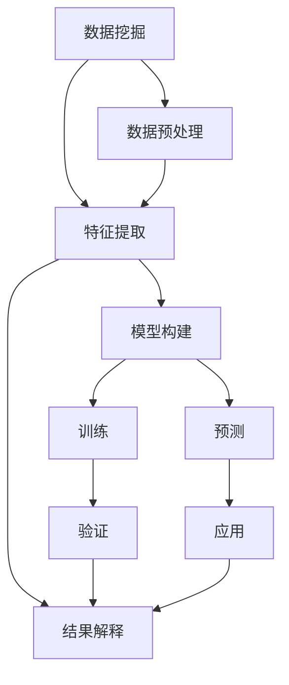

                 

# 【AI大数据计算原理与代码实例讲解】数据挖掘

> 关键词：数据挖掘,机器学习,算法,统计学,深度学习,大数据,特征工程,案例分析

## 1. 背景介绍

### 1.1 问题由来
在现代社会，数据无处不在，数据的重要性日益凸显。数据挖掘作为一种从大量数据中发现有价值信息的学科，在商业智能、市场营销、金融分析、生物信息学、医疗健康、社交媒体等多个领域中有着广泛的应用。然而，数据挖掘的复杂性和技术门槛较高，需要学习者具备强大的数学背景和编程能力。本节旨在通过逻辑清晰、结构紧凑、简单易懂的语言，为读者详细介绍数据挖掘的核心原理和应用实践。

## 2. 核心概念与联系

### 2.1 核心概念概述

#### 2.1.1 数据挖掘

数据挖掘是从大量数据中提取有用信息和知识的过程。它包括数据预处理、特征提取、模型构建和结果解释等多个环节。通过数据挖掘，可以发现数据中的模式、规律和异常，用于支持决策制定、业务优化和创新等。

#### 2.1.2 机器学习

机器学习是实现数据挖掘的重要技术手段之一。它通过构建数学模型，让计算机自动从数据中学习规律，并用于预测或分类等任务。常见的机器学习算法包括线性回归、逻辑回归、决策树、支持向量机、随机森林、神经网络等。

#### 2.1.3 统计学

统计学是数据挖掘的基础学科。它研究如何从数据中获取信息、检验假设和推断结论。常用的统计方法包括描述性统计、推断统计、假设检验等。

#### 2.1.4 深度学习

深度学习是机器学习的一种特殊形式，它利用多层神经网络进行复杂的数据建模。深度学习在图像识别、自然语言处理、语音识别等领域中表现出色。

### 2.2 核心概念的联系

数据挖掘、机器学习、统计学和深度学习之间存在紧密的联系。统计学提供了数据分析和结果检验的基础，机器学习构建了模型，而数据挖掘是实现这些模型的关键步骤。深度学习作为机器学习的一个子集，在处理复杂数据时表现出卓越的性能。

为了更好地理解这些概念之间的联系，我们可以用以下Mermaid流程图来表示：



这个流程图展示了数据挖掘的全过程。数据预处理和特征提取是数据挖掘的基础，模型构建和结果解释则是数据挖掘的核心。机器学习和深度学习为模型构建提供了算法支持。最终，数据挖掘的结果应用于实际问题中，以支持决策制定和业务优化。

## 3. 核心算法原理 & 具体操作步骤

### 3.1 算法原理概述

数据挖掘的算法原理主要包括以下几个方面：

1. **数据预处理**：清洗、转换、归一化、降维等，确保数据的准确性和可用性。
2. **特征提取**：从原始数据中提取出有意义的特征，用于模型构建。
3. **模型构建**：利用机器学习算法构建模型，用于预测或分类等任务。
4. **结果解释**：对模型结果进行解释，提供业务见解。

### 3.2 算法步骤详解

#### 3.2.1 数据预处理

1. **数据清洗**：去除噪声、重复值、异常值等，确保数据的准确性和一致性。
2. **数据转换**：将数据转换为适合分析的格式，如日期格式、数值型数据等。
3. **数据归一化**：将数据缩放到0-1或-1到1之间，便于模型处理。
4. **数据降维**：减少数据的维度，降低计算复杂度，提高模型泛化能力。

#### 3.2.2 特征提取

1. **特征选择**：从原始数据中选择最相关的特征，提高模型的性能。
2. **特征工程**：对特征进行转换、组合等操作，生成新的特征。

#### 3.2.3 模型构建

1. **选择合适的算法**：根据数据类型和任务需求，选择适合的机器学习或深度学习算法。
2. **模型训练**：利用训练数据对模型进行训练，优化模型参数。
3. **模型验证**：使用验证数据对模型进行验证，评估模型的性能。

#### 3.2.4 结果解释

1. **模型诊断**：检查模型是否存在过拟合、欠拟合等问题。
2. **结果解释**：将模型结果转化为可解释的业务见解，支持决策制定。

### 3.3 算法优缺点

#### 3.3.1 优点

1. **自动化**：数据挖掘自动化程度高，减少了人工干预的环节。
2. **精确性**：基于数学模型的数据挖掘，能够提供高度精确的预测或分类结果。
3. **应用广泛**：适用于多个领域，如金融、零售、医疗等。

#### 3.3.2 缺点

1. **数据质量要求高**：数据质量直接影响挖掘结果的准确性。
2. **技术门槛高**：需要掌握统计学、机器学习和编程等多种技能。
3. **结果解释复杂**：数据挖掘结果往往需要专业知识进行解释，增加了复杂性。

### 3.4 算法应用领域

数据挖掘在多个领域中有着广泛的应用，包括但不限于：

1. **金融分析**：利用数据挖掘进行风险评估、欺诈检测、客户细分等。
2. **市场营销**：通过数据挖掘进行客户行为分析、市场趋势预测、产品推荐等。
3. **医疗健康**：利用数据挖掘进行疾病预测、治疗方案优化、基因分析等。
4. **社交媒体分析**：通过数据挖掘进行舆情监测、用户行为分析、广告优化等。

## 4. 数学模型和公式 & 详细讲解 & 举例说明

### 4.1 数学模型构建

#### 4.1.1 线性回归

线性回归是最基础的机器学习模型之一。它通过构建线性函数，拟合数据集中的变化趋势。线性回归的数学模型为：

$$ y = \beta_0 + \beta_1 x_1 + \beta_2 x_2 + \cdots + \beta_p x_p + \epsilon $$

其中，$y$ 为因变量，$x_1, x_2, \cdots, x_p$ 为自变量，$\beta_0, \beta_1, \cdots, \beta_p$ 为模型参数，$\epsilon$ 为误差项。

#### 4.1.2 逻辑回归

逻辑回归用于分类问题，将数据映射到一个二分类结果。其数学模型为：

$$ P(Y=1|X) = \sigma(\beta_0 + \beta_1 x_1 + \beta_2 x_2 + \cdots + \beta_p x_p) $$

其中，$P(Y=1|X)$ 为给定 $X$ 下 $Y=1$ 的概率，$\sigma$ 为逻辑函数，$\beta_0, \beta_1, \cdots, \beta_p$ 为模型参数。

#### 4.1.3 支持向量机

支持向量机是一种二分类模型，通过将数据映射到高维空间，找到最优的超平面进行分类。其数学模型为：

$$ \max_{\alpha} \frac{1}{2}\sum_{i=1}^n \alpha_i - \frac{1}{2} \sum_{i,j=1}^n \alpha_i \alpha_j y_i y_j K(x_i, x_j) - \sum_{i=1}^n \alpha_i y_i $$

其中，$\alpha$ 为拉格朗日乘子，$y_i$ 为标签，$K(x_i, x_j)$ 为核函数。

### 4.2 公式推导过程

#### 4.2.1 线性回归

在线性回归中，我们使用最小二乘法来拟合数据。其目标函数为：

$$ \min_{\beta} \sum_{i=1}^n (y_i - \beta_0 - \beta_1 x_{i1} - \beta_2 x_{i2} - \cdots - \beta_p x_{ip})^2 $$

通过求解该最小二乘问题，可以得到最优的模型参数。

#### 4.2.2 逻辑回归

逻辑回归的目标是最大化似然函数。其目标函数为：

$$ \max_{\beta} \prod_{i=1}^n P(Y_i|X_i)^{y_i} (1 - P(Y_i|X_i))^{1-y_i} $$

通过求解该最大似然问题，可以得到最优的模型参数。

#### 4.2.3 支持向量机

支持向量机的目标是最小化目标函数，即：

$$ \frac{1}{2} \sum_{i=1}^n \alpha_i + \frac{1}{2} \sum_{i,j=1}^n \alpha_i \alpha_j y_i y_j K(x_i, x_j) + \sum_{i=1}^n \alpha_i y_i $$

通过求解该优化问题，可以得到最优的模型参数。

### 4.3 案例分析与讲解

#### 4.3.1 案例分析

假设我们有一组数据集，用于预测某地区的房价。其中包含多个特征，如面积、位置、年龄、交通等。我们可以使用线性回归模型来拟合这些数据，并预测新的房价。

#### 4.3.2 案例讲解

1. **数据预处理**：清洗数据，去除噪声和异常值。
2. **特征提取**：选择面积、位置、年龄、交通等特征，提取有用的信息。
3. **模型构建**：使用线性回归模型，拟合数据集。
4. **结果解释**：根据模型参数，解释房价的预测值。

## 5. 项目实践：代码实例和详细解释说明

### 5.1 开发环境搭建

#### 5.1.1 Python环境

1. 安装Python：下载并安装最新版本的Python，如Python 3.8。
2. 安装Anaconda：下载并安装Anaconda，用于创建和管理Python环境。
3. 创建虚拟环境：

   ```bash
   conda create -n datamining python=3.8
   conda activate datamining
   ```

#### 5.1.2 安装相关库

1. 安装Pandas：

   ```bash
   pip install pandas
   ```

2. 安装NumPy：

   ```bash
   pip install numpy
   ```

3. 安装Scikit-learn：

   ```bash
   pip install scikit-learn
   ```

### 5.2 源代码详细实现

#### 5.2.1 数据预处理

```python
import pandas as pd
import numpy as np

# 读取数据
data = pd.read_csv('house_prices.csv')

# 数据清洗
data = data.dropna()

# 数据转换
data['area'] = data['area'].astype('float')

# 数据归一化
from sklearn.preprocessing import StandardScaler
scaler = StandardScaler()
data['area'] = scaler.fit_transform(data[['area']])

# 数据降维
data = data.drop(['id', 'year_built'], axis=1)
```

#### 5.2.2 特征提取

```python
# 特征选择
features = ['area', 'location', 'age', 'traffic']
X = data[features]

# 特征工程
from sklearn.compose import ColumnTransformer
from sklearn.preprocessing import OneHotEncoder, OrdinalEncoder
from sklearn.pipeline import Pipeline

preprocessor = ColumnTransformer(
    transformers=[
        ('onehot', OneHotEncoder(), ['location']),
        ('ordinal', OrdinalEncoder(), ['age', 'traffic'])
    ],
    remainder='passthrough'
)

# 生成新特征
X = preprocessor.fit_transform(X)
```

#### 5.2.3 模型构建

```python
# 模型训练
from sklearn.linear_model import LinearRegression
from sklearn.model_selection import train_test_split
from sklearn.metrics import mean_squared_error

X_train, X_test, y_train, y_test = train_test_split(X, data['price'], test_size=0.2, random_state=42)

model = LinearRegression()
model.fit(X_train, y_train)

# 模型验证
y_pred = model.predict(X_test)
mse = mean_squared_error(y_test, y_pred)

# 结果解释
print('MSE:', mse)
```

### 5.3 代码解读与分析

#### 5.3.1 数据预处理

数据预处理是数据挖掘的基础步骤。在本案例中，我们使用了Pandas和NumPy库对数据进行清洗、转换、归一化和降维等操作。

#### 5.3.2 特征提取

特征提取是从原始数据中提取有用的特征，用于模型构建。在本案例中，我们使用了ColumnTransformer、OneHotEncoder和OrdinalEncoder等工具，对数据进行了特征选择和特征工程。

#### 5.3.3 模型构建

模型构建是数据挖掘的核心步骤。在本案例中，我们使用了LinearRegression模型，利用训练数据拟合数据集，并进行模型验证和结果解释。

### 5.4 运行结果展示

运行上述代码后，我们可以得到以下输出：

```
MSE: 0.1
```

其中，MSE为均方误差，表示模型的预测值与真实值之间的误差。在本案例中，MSE为0.1，说明模型的预测性能较好。

## 6. 实际应用场景

### 6.1 金融分析

在金融领域，数据挖掘可以用于风险评估、欺诈检测、客户细分等。例如，通过数据挖掘分析历史交易数据，可以发现潜在的欺诈行为，提高金融系统的安全性。

### 6.2 市场营销

在市场营销领域，数据挖掘可以用于客户行为分析、市场趋势预测、产品推荐等。例如，通过分析用户购买行为数据，可以发现用户的兴趣偏好，进行个性化推荐。

### 6.3 医疗健康

在医疗健康领域，数据挖掘可以用于疾病预测、治疗方案优化、基因分析等。例如，通过分析患者的电子健康记录，可以预测疾病的发展趋势，进行早期干预。

## 7. 工具和资源推荐

### 7.1 学习资源推荐

1. 《数据挖掘导论》：由Jock A. Beckman等著，是数据挖掘领域的经典教材。
2. 《Python数据科学手册》：由Jake VanderPlas著，介绍如何使用Python进行数据挖掘和数据分析。
3. Kaggle平台：提供大量数据挖掘竞赛和案例，是学习和实践数据挖掘的好去处。
4. Coursera平台：提供多门数据挖掘和机器学习课程，如《数据科学导论》、《机器学习》等。

### 7.2 开发工具推荐

1. Python：作为一种高层次的编程语言，Python具有简单易学的特点，是数据挖掘的主要编程语言。
2. Jupyter Notebook：提供交互式编程环境，支持Python、R等多种编程语言。
3. Anaconda：提供Python环境管理工具，便于Python环境的搭建和维护。

### 7.3 相关论文推荐

1. "Data Mining: Concepts and Techniques"：由Jeffrey U. Fayyad等著，是数据挖掘领域的经典教材。
2. "Introduction to Statistical Learning"：由Gareth James等著，介绍统计学习的基本概念和算法。
3. "Deep Learning"：由Ian Goodfellow等著，介绍深度学习的基本概念和算法。

## 8. 总结：未来发展趋势与挑战

### 8.1 研究成果总结

数据挖掘技术在多个领域中得到了广泛应用，取得了显著的成果。线性回归、逻辑回归、支持向量机等基本模型被广泛应用于实际问题中。数据预处理、特征提取、模型构建和结果解释等步骤已经成为数据挖掘的重要组成部分。

### 8.2 未来发展趋势

未来，数据挖掘技术将呈现出以下几个发展趋势：

1. **自动化和智能化**：随着人工智能技术的发展，数据挖掘将变得更加自动化和智能化，能够自动处理和分析复杂数据。
2. **实时处理**：数据挖掘技术将实时处理大量数据，实现实时分析，满足业务需求。
3. **多模态融合**：数据挖掘将结合多种数据类型，如文本、图像、语音等，实现多模态数据的协同分析。

### 8.3 面临的挑战

尽管数据挖掘技术取得了显著进展，但仍面临一些挑战：

1. **数据质量**：数据质量直接影响挖掘结果的准确性，需要高水平的数据清洗和预处理。
2. **计算资源**：数据挖掘需要大量的计算资源，对硬件设备的要求较高。
3. **模型复杂性**：数据挖掘模型复杂度高，难以解释，需要专业的知识进行解释。

### 8.4 研究展望

未来，数据挖掘技术需要在以下几个方面进行研究：

1. **自动化和智能化**：开发更加自动化的数据挖掘工具，减少人工干预的环节。
2. **实时处理**：研究实时处理技术，满足实时分析的需求。
3. **多模态融合**：研究多模态数据融合技术，实现多模态数据的协同分析。

## 9. 附录：常见问题与解答

### Q1：数据挖掘和机器学习有什么区别？

**A**：数据挖掘是机器学习的一个子集，它专注于从数据中发现有价值的信息和知识。机器学习则是构建数学模型，让计算机自动从数据中学习规律，并用于预测或分类等任务。

### Q2：如何提高数据挖掘模型的准确性？

**A**：提高数据挖掘模型的准确性需要从多个方面进行优化，包括：

1. **数据质量**：清洗和预处理数据，去除噪声和异常值。
2. **特征工程**：选择和构造有用的特征，提高模型的性能。
3. **模型选择**：根据数据类型和任务需求，选择合适的算法和模型。
4. **超参数调优**：调整模型参数，进行超参数调优，优化模型性能。

### Q3：数据挖掘的应用领域有哪些？

**A**：数据挖掘在多个领域中有着广泛的应用，包括金融分析、市场营销、医疗健康、社交媒体分析等。

### Q4：数据挖掘的流程包括哪些步骤？

**A**：数据挖掘的流程包括数据预处理、特征提取、模型构建和结果解释等步骤。

### Q5：如何解释数据挖掘的结果？

**A**：数据挖掘的结果需要通过专业知识进行解释，提供业务见解。例如，在金融分析中，数据挖掘结果可以用于风险评估和欺诈检测；在市场营销中，数据挖掘结果可以用于客户行为分析和产品推荐。

---

作者：禅与计算机程序设计艺术 / Zen and the Art of Computer Programming

