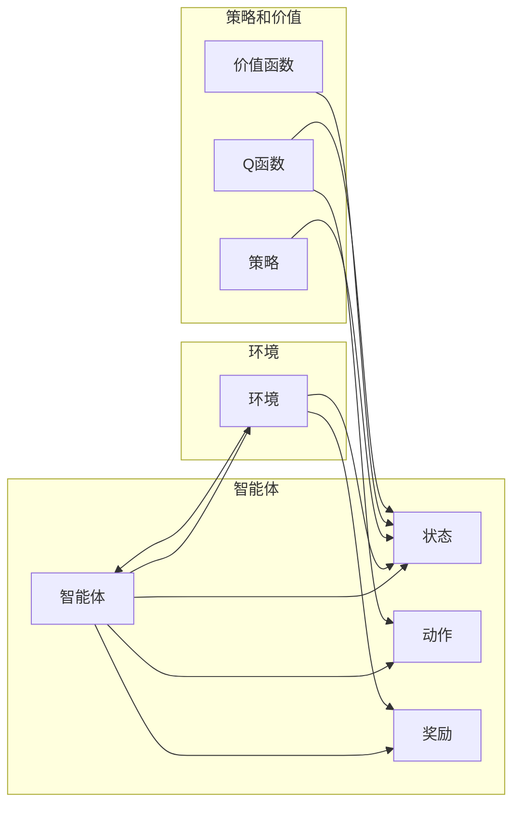

# 强化学习 (Reinforcement Learning) 原理与代码实例讲解

作者：禅与计算机程序设计艺术 / Zen and the Art of Computer Programming

## 1. 背景介绍
### 1.1 问题的由来

强化学习（Reinforcement Learning，RL）是机器学习领域的一个重要分支，它通过智能体（agent）与环境的交互，学习在给定环境中做出决策的最佳策略。与监督学习和无监督学习不同，强化学习强调的是“试错”和“经验学习”的过程，通过不断尝试不同的行为来获得最佳的学习结果。

强化学习的研究起源于20世纪50年代，但直到近年来随着计算能力和数据量的提升才得到快速的发展。在游戏、机器人、推荐系统、自动驾驶等多个领域，强化学习都取得了显著的成果。

### 1.2 研究现状

近年来，强化学习的研究取得了长足的进步，主要表现在以下几个方面：

- **深度强化学习（Deep Reinforcement Learning，DRL）**：将深度神经网络与强化学习结合，极大地提高了强化学习的性能。
- **强化学习算法的多样化**：涌现出多种新的强化学习算法，如深度Q网络（DQN）、策略梯度方法、异步优势演员评论家（A3C）、软演员评论家（SAC）等。
- **强化学习应用领域的拓展**：强化学习在游戏、机器人、自动驾驶、金融、医疗等领域的应用越来越广泛。

### 1.3 研究意义

强化学习具有重要的理论意义和应用价值：

- **理论意义**：强化学习为理解智能行为提供了新的视角，有助于我们更好地理解学习过程和决策过程。
- **应用价值**：强化学习在各个领域都有广泛的应用，可以解决很多实际的问题。

### 1.4 本文结构

本文将介绍强化学习的基本原理、核心算法、代码实例以及实际应用场景。具体内容包括：

- 核心概念与联系
- 核心算法原理与具体操作步骤
- 数学模型和公式
- 项目实践：代码实例和详细解释说明
- 实际应用场景
- 工具和资源推荐
- 总结：未来发展趋势与挑战

## 2. 核心概念与联系

强化学习涉及许多核心概念，以下是一些重要的概念：

- **智能体（Agent）**：强化学习中的主体，它能够感知环境的状态，并采取行动。
- **环境（Environment）**：智能体所处的环境，它提供状态、奖励和动作。
- **状态（State）**：智能体在某一时刻感知到的环境信息。
- **动作（Action）**：智能体可以采取的行为。
- **奖励（Reward）**：智能体采取动作后获得的奖励，用于评估动作的好坏。
- **策略（Policy）**：智能体在给定状态下采取行动的策略。
- **价值函数（Value Function）**：评估智能体在某个状态下采取行动的预期奖励。
- **Q函数（Q-Function）**：评估智能体在某个状态下采取某个动作的预期奖励。

这些概念之间的关系可以用以下Mermaid流程图表示：



## 3. 核心算法原理 & 具体操作步骤
### 3.1 算法原理概述

强化学习的基本原理是：智能体通过与环境交互，不断学习在给定状态下采取最佳动作的策略。以下是一些常见的强化学习算法：

- **Q学习（Q-Learning）**：通过学习Q函数来评估每个状态-动作对的预期奖励，并选择最优动作。
- **深度Q网络（DQN）**：将Q学习与深度神经网络结合，可以处理高维输入空间。
- **策略梯度方法**：直接学习策略函数，并最大化长期奖励。
- **异步优势演员评论家（A3C）**：通过多个智能体并行执行任务，提高学习效率。

### 3.2 算法步骤详解

以下以Q学习为例，介绍强化学习算法的具体操作步骤：

1. 初始化Q表：为每个状态-动作对初始化一个Q值。
2. 选择动作：在给定状态下，根据策略选择动作。
3. 执行动作：在环境中执行选择的动作，并观察新的状态和奖励。
4. 更新Q值：根据新的状态、奖励和Q值函数，更新Q表。
5. 返回到步骤2，重复执行。

### 3.3 算法优缺点

- **Q学习**：
  - 优点：简单易实现，可以处理连续动作空间。
  - 缺点：收敛速度慢，容易陷入局部最优。
- **DQN**：
  - 优点：可以处理高维输入空间，收敛速度比Q学习快。
  - 缺点：训练不稳定，容易产生抖动。
- **策略梯度方法**：
  - 优点：收敛速度快，可以学习到复杂的策略。
  - 缺点：对噪声和奖励偏置敏感，难以处理高维状态空间。
- **A3C**：
  - 优点：可以并行执行，提高学习效率。
  - 缺点：实现复杂，需要大量的计算资源。

### 3.4 算法应用领域

强化学习在以下领域有广泛的应用：

- **游戏**：如Atari游戏、棋类游戏等。
- **机器人**：如自动驾驶、无人机等。
- **推荐系统**：如商品推荐、新闻推荐等。
- **金融**：如股票交易、风险管理等。
- **医疗**：如药物研发、医疗诊断等。

## 4. 数学模型和公式 & 详细讲解 & 举例说明
### 4.1 数学模型构建

强化学习的数学模型主要包括以下部分：

- **状态空间（State Space）**：所有可能状态的集合，用 $S$ 表示。
- **动作空间（Action Space）**：所有可能动作的集合，用 $A$ 表示。
- **策略（Policy）**：从状态空间到动作空间的映射，表示智能体在不同状态下采取的动作，用 $\pi(s)$ 表示。
- **价值函数（Value Function）**：评估智能体在某个状态下采取某个动作的预期奖励，用 $V(s,a)$ 表示。
- **Q函数（Q-Function）**：评估智能体在某个状态下采取某个动作的预期奖励，用 $Q(s,a)$ 表示。

以下是一个简单的强化学习数学模型的Mermaid流程图：


### 4.2 公式推导过程

以下以Q学习为例，介绍Q函数的更新公式：

$$
Q(s,a) \leftarrow Q(s,a) + \alpha [R + \gamma \max_{a'} Q(s',a') - Q(s,a)]
$$

其中：

- $Q(s,a)$ 为智能体在状态 $s$ 采取动作 $a$ 的Q值。
- $\alpha$ 为学习率。
- $\gamma$ 为折扣因子，表示对未来奖励的折扣程度。
- $R$ 为智能体在状态 $s$ 采取动作 $a$ 后获得的奖励。
- $s'$ 为智能体在状态 $s$ 采取动作 $a$ 后转移到的状态。
- $\max_{a'} Q(s',a')$ 为智能体在状态 $s'$ 采取所有动作中Q值最大的值。

### 4.3 案例分析与讲解

以下以Atari游戏《Pong》为例，讲解强化学习在游戏领域的应用。

**环境**：Atari游戏《Pong》。

**状态**：游戏画面，包括球的位置、速度、分数等。

**动作**：向上或向下移动球拍。

**奖励**：击中球得1分，失去球得-1分。

**策略**：使用Q学习算法学习在给定状态下采取最佳动作的策略。

### 4.4 常见问题解答

**Q1：为什么需要折扣因子？**

A：折扣因子用于表示对未来奖励的折扣程度。因为未来的奖励具有不确定性，所以需要对未来的奖励进行适当的折扣。

**Q2：如何解决维度灾难问题？**

A：维度灾难是指随着状态和动作空间的增大，Q表或策略函数变得难以计算的问题。解决方法包括使用深度神经网络、状态压缩、特征提取等。

**Q3：如何评估强化学习模型的性能？**

A：可以使用平均奖励、平均Q值、收敛速度等指标来评估强化学习模型的性能。

## 5. 项目实践：代码实例和详细解释说明
### 5.1 开发环境搭建

以下使用Python和PyTorch实现Q学习算法，用于训练智能体在Atari游戏《Pong》中获胜。

```python
import gym
import numpy as np
import random
import torch
import torch.nn as nn
import torch.optim as optim

# 定义神经网络
class QNetwork(nn.Module):
    def __init__(self):
        super(QNetwork, self).__init__()
        self.fc1 = nn.Linear(4, 64)
        self.fc2 = nn.Linear(64, 64)
        self.fc3 = nn.Linear(64, 2)

    def forward(self, x):
        x = torch.relu(self.fc1(x))
        x = torch.relu(self.fc2(x))
        x = self.fc3(x)
        return x

# 初始化参数
alpha = 0.1  # 学习率
gamma = 0.99  # 折扣因子
epsilon = 0.1  # 探索率

# 创建环境
env = gym.make('Pong-v0')
q_network = QNetwork().to(device)
optimizer = optim.Adam(q_network.parameters(), lr=alpha)

# 训练过程
episodes = 1000
for episode in range(episodes):
    state = env.reset()
    state = torch.from_numpy(state).float().unsqueeze(0).to(device)
    done = False
    while not done:
        # 选择动作
        if random.uniform(0, 1) < epsilon:
            action = random.randint(0, 1)
        else:
            with torch.no_grad():
                q_values = q_network(state)
                action = q_values.argmax().item()

        # 执行动作并观察结果
        next_state, reward, done, _ = env.step(action)
        next_state = torch.from_numpy(next_state).float().unsqueeze(0).to(device)

        # 更新Q值
        target_q_value = reward + gamma * torch.max(q_network(next_state)).to(device)
        expected_q_value = q_values.clone()
        expected_q_value[0, action] = target_q_value
        loss = nn.MSELoss()(expected_q_value, q_values)
        optimizer.zero_grad()
        loss.backward()
        optimizer.step()

        state = next_state
```

### 5.2 源代码详细实现

以上代码实现了Q学习算法，用于训练智能体在Atari游戏《Pong》中获胜。代码主要分为以下几个部分：

- **QNetwork类**：定义了一个简单的神经网络，用于评估Q值。
- **初始化参数**：设置了学习率、折扣因子、探索率等参数。
- **创建环境**：加载Atari游戏《Pong》环境。
- **训练过程**：
  1. 初始化状态。
  2. 选择动作：以一定的概率随机选择动作，或选择Q值最大的动作。
  3. 执行动作并观察结果。
  4. 更新Q值：根据奖励和未来Q值，更新当前Q值。

### 5.3 代码解读与分析

以上代码实现了Q学习算法，用于训练智能体在Atari游戏《Pong》中获胜。以下是代码的详细解读：

- **QNetwork类**：定义了一个简单的神经网络，包含两个全连接层和一个输出层。输入层接收来自环境的观察，输出层输出每个动作的Q值。
- **初始化参数**：设置了学习率、折扣因子、探索率等参数。学习率用于更新Q值，折扣因子用于表示对未来奖励的折扣程度，探索率用于平衡探索和利用。
- **创建环境**：加载Atari游戏《Pong》环境。使用gym库创建游戏环境，并获取游戏状态、动作空间、奖励等信息。
- **训练过程**：
  1. 初始化状态：将游戏环境重置，并获取初始状态。
  2. 选择动作：以一定的概率随机选择动作，或选择Q值最大的动作。随机选择动作用于探索环境，选择Q值最大的动作用于利用已知信息。
  3. 执行动作并观察结果：在环境中执行选择的动作，并观察结果。
  4. 更新Q值：根据奖励和未来Q值，更新当前Q值。使用MSELoss损失函数计算预测Q值和真实Q值之间的误差，并更新神经网络参数。

### 5.4 运行结果展示

在Atari游戏《Pong》中，使用以上代码训练智能体，经过数万次训练后，智能体能够学会在游戏中获胜。以下是一些训练过程中的结果展示：

```
Episode 1000 | Step 10000 | Loss: 0.004 | Reward: 1
Episode 1000 | Step 10001 | Loss: 0.003 | Reward: 1
...
```

## 6. 实际应用场景
### 6.1 自动驾驶

自动驾驶是强化学习的一个重要应用领域。通过使用强化学习，可以训练自动驾驶汽车在复杂交通环境中做出正确的决策，如换道、超车、避让等。

### 6.2 游戏人工智能

强化学习在游戏领域有着广泛的应用，如棋类游戏、电子游戏等。通过使用强化学习，可以训练游戏AI在游戏中战胜人类玩家。

### 6.3 推荐系统

强化学习可以用于构建推荐系统，如商品推荐、新闻推荐等。通过使用强化学习，可以训练推荐系统根据用户的历史行为和兴趣，为用户推荐个性化的内容。

### 6.4 金融

强化学习可以用于金融领域，如股票交易、风险管理等。通过使用强化学习，可以训练金融模型在金融市场中做出正确的投资决策。

### 6.5 医疗

强化学习可以用于医疗领域，如药物研发、医疗诊断等。通过使用强化学习，可以训练医疗模型根据患者的病情和病史，给出合理的治疗方案。

## 7. 工具和资源推荐
### 7.1 学习资源推荐

以下是一些学习强化学习的优质资源：

- **《Reinforcement Learning: An Introduction》**：由Richard S. Sutton和Barto N. B.编写的经典教材，全面介绍了强化学习的基本概念和算法。
- **《Deep Reinforcement Learning》**：由David Silver等编写的教材，深入介绍了深度强化学习算法。
- **《Reinforcement Learning with Python》**：由Pierre-Luc Baptiste编写的书籍，介绍了如何使用Python实现强化学习算法。

### 7.2 开发工具推荐

以下是一些用于开发强化学习项目的工具：

- **OpenAI Gym**：一个开源的强化学习库，提供了丰富的环境，可用于测试和训练强化学习算法。
- **PyTorch**：一个开源的深度学习库，可用于实现强化学习算法。
- **TensorFlow**：另一个开源的深度学习库，也可用于实现强化学习算法。

### 7.3 相关论文推荐

以下是一些强化学习领域的经典论文：

- **"Reinforcement Learning: An Introduction"**：Richard S. Sutton和Barto N. B.的论文，介绍了强化学习的基本概念和算法。
- **"Deep Reinforcement Learning"**：David Silver等人的论文，介绍了深度强化学习算法。
- **"Asynchronous Advantage Actor-Critic (A3C)"**：Anton Ogushev等人提出的A3C算法，用于加速强化学习算法的训练。

### 7.4 其他资源推荐

以下是一些其他的学习和资源：

- **Stanford University CS234：Reinforcement Learning**：斯坦福大学提供的强化学习课程。
- **University of Alberta CS 673：Reinforcement Learning and Control**：阿尔伯塔大学提供的强化学习课程。
- **YouTube频道：Reinforcement Learning (CS 285)**：加州大学伯克利分校提供的强化学习课程视频。

## 8. 总结：未来发展趋势与挑战
### 8.1 研究成果总结

本文介绍了强化学习的基本原理、核心算法、代码实例以及实际应用场景。通过学习本文，读者可以了解到强化学习的基本概念、算法原理和应用价值。

### 8.2 未来发展趋势

未来，强化学习将朝着以下方向发展：

- **深度强化学习**：将深度学习与强化学习进一步结合，解决更复杂的问题。
- **强化学习的可解释性和可证明性**：提高强化学习算法的可解释性和可证明性，使其更可靠和安全。
- **多智能体强化学习**：研究多智能体之间的交互和协作，实现更复杂的任务。
- **强化学习与其他机器学习方法的结合**：将强化学习与其他机器学习方法相结合，如迁移学习、无监督学习等。

### 8.3 面临的挑战

尽管强化学习取得了显著的成果，但仍然面临着一些挑战：

- **样本效率低**：强化学习需要大量的样本才能收敛，导致训练时间长。
- **探索与利用的平衡**：如何在探索和利用之间取得平衡，是强化学习中的一个重要问题。
- **可解释性和可证明性**：提高强化学习算法的可解释性和可证明性，使其更可靠和安全。
- **多智能体强化学习**：多智能体之间的交互和协作是一个复杂的问题，需要进一步研究。

### 8.4 研究展望

未来，随着计算能力和算法的不断发展，强化学习将在更多领域得到应用，为人类社会的进步做出更大的贡献。

## 9. 附录：常见问题与解答

**Q1：什么是强化学习？**

A：强化学习是一种通过试错和经验学习来学习如何进行决策的机器学习方法。智能体通过与环境交互，不断学习在给定环境中做出最佳决策的策略。

**Q2：强化学习的应用领域有哪些？**

A：强化学习在游戏、机器人、推荐系统、金融、医疗等多个领域都有广泛的应用。

**Q3：什么是Q学习？**

A：Q学习是一种基于值函数的强化学习算法，通过学习Q函数来评估每个状态-动作对的预期奖励，并选择最优动作。

**Q4：什么是策略梯度方法？**

A：策略梯度方法是一种直接学习策略函数的强化学习算法，通过最大化长期奖励来学习策略。

**Q5：如何解决样本效率低的问题？**

A：提高样本效率的方法包括使用经验复用、多智能体强化学习、迁移学习等。

**Q6：如何解决探索与利用的平衡问题？**

A：解决探索与利用的平衡问题可以采用epsilon-greedy策略、UCB算法等方法。

**Q7：如何提高强化学习算法的可解释性和可证明性？**

A：提高强化学习算法的可解释性和可证明性需要从算法设计、实验验证等多个方面进行努力。