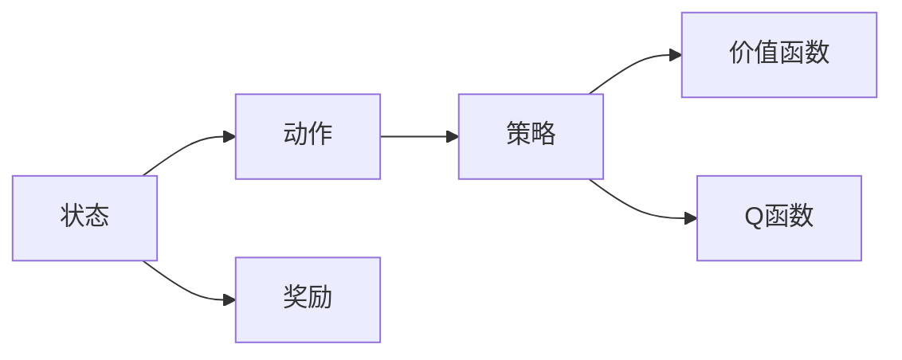

# 强化学习：策略迭代与价值迭代

作者：禅与计算机程序设计艺术 / Zen and the Art of Computer Programming


## 1. 背景介绍
### 1.1 问题的由来

强化学习（Reinforcement Learning, RL）是机器学习领域的一个重要分支，它研究如何使机器在与环境交互的过程中学习到最优策略，以实现决策的最优化。随着人工智能技术的不断发展，强化学习在智能控制、机器人、游戏、推荐系统等领域取得了显著的成果。

然而，强化学习在实际应用中面临着诸多挑战。如何设计高效的算法，如何解决样本效率低、收敛速度慢等问题，如何处理高维状态空间和动作空间，如何保证学习过程的稳定性和可解释性，都是强化学习领域亟待解决的问题。

本文将深入探讨强化学习中的策略迭代和价值迭代两种核心算法，分析它们的原理、步骤、优缺点，以及在实际应用中的应用场景，并展望未来发展趋势与挑战。

### 1.2 研究现状

近年来，强化学习领域取得了许多突破性进展。以下是一些重要的研究方向：

- **策略梯度算法**：基于策略梯度定理，通过直接优化策略来更新参数，如REINFORCE、PPO、A2C等。
- **价值函数方法**：通过估计值函数来优化策略，如Q-learning、SARSA、Deep Q-Network（DQN）等。
- **基于模型的方法**：通过构建环境模型来加速学习过程，如演员-评论家（Actor-Critic）方法、深度确定性策略梯度（DDPG）等。
- **基于强化学习与深度学习的结合**：利用深度神经网络来近似策略和价值函数，如DQN、DDPG、PPO、A3C等。

### 1.3 研究意义

强化学习具有广泛的应用前景，研究强化学习中的策略迭代和价值迭代算法，对于以下方面具有重要意义：

- **提升算法性能**：通过设计高效的迭代算法，提高强化学习的样本效率、收敛速度和稳定性。
- **拓展应用领域**：将强化学习应用于更多实际场景，推动人工智能技术的进步。
- **促进学科发展**：推动强化学习理论体系的完善，为人工智能领域提供新的研究思路。

### 1.4 本文结构

本文将围绕以下内容展开：

- 介绍强化学习的基本概念和核心算法。
- 详细讲解策略迭代和价值迭代的原理和步骤。
- 分析两种算法的优缺点，并探讨其应用领域。
- 展望未来发展趋势与挑战。

## 2. 核心概念与联系

为了更好地理解强化学习中的策略迭代和价值迭代算法，本节将介绍几个核心概念：

- **状态（State）**：描述系统当前状态的向量。
- **动作（Action）**：系统可以采取的操作。
- **奖励（Reward）**：系统在执行动作后获得的奖励，用于指导学习过程。
- **策略（Policy）**：决定系统如何选择动作的函数，通常表示为 $\pi(a|s)$，表示在状态 $s$ 下选择动作 $a$ 的概率。
- **价值函数（Value Function）**：衡量状态或策略的好坏，分为状态价值函数 $V(s)$ 和策略价值函数 $V^\pi(s)$。
- **Q函数（Q-Function）**：衡量在给定状态和动作下的长期奖励，表示为 $Q(s,a)$。
- **马尔可夫决策过程（MDP）**：描述强化学习问题的基本框架，包括状态空间、动作空间、转移概率和奖励函数。

它们之间的关系可以用以下图表示：



从图中可以看出，强化学习的过程就是通过策略迭代和价值迭代，不断优化策略和价值函数，从而实现决策的最优化。

## 3. 核心算法原理 & 具体操作步骤
### 3.1 算法原理概述

本节将介绍强化学习中的两种核心算法：策略迭代和价值迭代。

#### 3.1.1 策略迭代

策略迭代是一种基于策略优化方法的强化学习算法，其基本思想是：首先选择一个初始策略，然后在策略迭代过程中逐步更新策略，直至达到最优策略。

策略迭代算法的主要步骤如下：

1. 初始化策略 $\pi_0$。
2. 对于每个状态 $s$，计算策略 $\pi_0$ 在状态 $s$ 下的期望回报值 $V_0(s)$。
3. 优化策略 $\pi_0$，使其最大化 $V_0(s)$，得到新的策略 $\pi_1$。
4. 重复步骤 2 和 3，直至策略收敛。

#### 3.1.2 价值迭代

价值迭代是一种基于价值函数优化的强化学习算法，其基本思想是：首先初始化价值函数，然后在价值迭代过程中逐步更新价值函数，直至达到最优价值函数。

价值迭代算法的主要步骤如下：

1. 初始化价值函数 $V_0(s)$。
2. 对于每个状态 $s$，计算策略 $\pi_0$ 在状态 $s$ 下的最优动作 $a^*$ 和最大回报值 $V_0(s^*)$。
3. 使用 $V_0(s^*)$ 更新价值函数 $V_1(s)$。
4. 重复步骤 2 和 3，直至价值函数收敛。

### 3.2 算法步骤详解

本节将详细介绍策略迭代和价值迭代算法的具体操作步骤。

#### 3.2.1 策略迭代

策略迭代算法的具体步骤如下：

1. **初始化策略**：选择一个初始策略 $\pi_0$，可以是一个随机策略或基于经验选择的策略。
2. **计算期望回报值**：对于每个状态 $s$，计算策略 $\pi_0$ 在状态 $s$ 下的期望回报值 $V_0(s)$，即：
   $$
   V_0(s) = \sum_{a \in A} \pi_0(a|s) \cdot \sum_{s' \in S} \pi_0(a|s) \cdot R(s,a,s')
   $$
   其中，$A$ 为动作空间，$R(s,a,s')$ 为从状态 $s$ 执行动作 $a$ 转移到状态 $s'$ 后获得的奖励。
3. **优化策略**：使用价值函数 $V_0(s)$ 和策略 $\pi_0$，优化策略 $\pi_1$，使其最大化 $V_0(s)$，即：
   $$
   \pi_1(a|s) = \frac{1}{\sum_{a' \in A} \pi_1(a'|s) \cdot \sum_{s' \in S} \pi_1(a'|s) \cdot R(s,a',s')} \sum_{a' \in A} \pi_1(a'|s) \cdot \sum_{s' \in S} \pi_1(a'|s) \cdot R(s,a',s')
   $$
4. **重复步骤 2 和 3**：重复步骤 2 和 3，直至策略收敛，即 $|\pi_t(a|s) - \pi_{t+1}(a|s)| < \epsilon$。

#### 3.2.2 价值迭代

价值迭代算法的具体步骤如下：

1. **初始化价值函数**：选择一个初始价值函数 $V_0(s)$，可以是一个随机值或基于经验选择的值。
2. **计算最优动作和回报值**：对于每个状态 $s$，计算策略 $\pi_0$ 在状态 $s$ 下的最优动作 $a^*$ 和最大回报值 $V_0(s^*)$，即：
   $$
   a^*(s) = \arg\max_{a \in A} \sum_{s' \in S} \pi_0(a|s) \cdot R(s,a,s')
   $$
   $$
   V_0(s^*) = \sum_{s' \in S} \pi_0(a^*(s)|s) \cdot R(s,a^*(s),s')
   $$
3. **更新价值函数**：使用最优动作 $a^*$ 和回报值 $V_0(s^*)$ 更新价值函数 $V_1(s)$，即：
   $$
   V_1(s) = \sum_{a \in A} \pi_0(a|s) \cdot R(s,a,s') + \gamma \cdot V_0(s')
   $$
   其中，$\gamma$ 为折扣因子。
4. **重复步骤 2 和 3**：重复步骤 2 和 3，直至价值函数收敛，即 $|V_t(s) - V_{t+1}(s)| < \epsilon$。

### 3.3 算法优缺点

#### 3.3.1 策略迭代

策略迭代算法的优点：

- 算法简单，易于实现。
- 收敛速度快，适用于状态空间和动作空间较小的情况。

策略迭代算法的缺点：

- 依赖于初始策略的选择，可能导致收敛到局部最优解。
- 需要计算每个状态下的期望回报值，计算复杂度高。

#### 3.3.2 价值迭代

价值迭代算法的优点：

- 不依赖于初始策略的选择，收敛到全局最优解的概率较高。
- 避免了计算每个状态下的期望回报值，计算复杂度较低。

价值迭代算法的缺点：

- 收敛速度较慢，适用于状态空间和动作空间较大或动态变化的情况。
- 需要存储价值函数，存储空间需求较大。

### 3.4 算法应用领域

策略迭代和价值迭代算法适用于以下领域：

- **智能控制**：如机器人路径规划、无人机控制等。
- **游戏**：如围棋、国际象棋、电子竞技游戏等。
- **推荐系统**：如电影推荐、商品推荐等。
- **资源分配**：如电力系统优化、网络流量调度等。

## 4. 数学模型和公式 & 详细讲解 & 举例说明
### 4.1 数学模型构建

为了更精确地描述策略迭代和价值迭代算法，我们需要引入以下数学模型：

- **马尔可夫决策过程（MDP）**：描述强化学习问题的基本框架，包括状态空间 $S$、动作空间 $A$、转移概率 $P(s'|s,a)$ 和奖励函数 $R(s,a)$。
- **策略**：决定系统如何选择动作的函数，通常表示为 $\pi(a|s)$，表示在状态 $s$ 下选择动作 $a$ 的概率。
- **价值函数**：衡量状态或策略的好坏，分为状态价值函数 $V(s)$ 和策略价值函数 $V^\pi(s)$。
- **Q函数**：衡量在给定状态和动作下的长期奖励，表示为 $Q(s,a)$。

### 4.2 公式推导过程

本节将推导策略迭代和价值迭代算法中的关键公式。

#### 4.2.1 策略迭代

策略迭代的推导如下：

1. **策略迭代算法的迭代公式**：
   $$
   \pi_{t+1}(a|s) = \frac{1}{\sum_{a' \in A} \pi_t(a'|s) \cdot \sum_{s' \in S} \pi_t(a'|s) \cdot R(s,a',s')} \sum_{a' \in A} \pi_t(a'|s) \cdot \sum_{s' \in S} \pi_t(a'|s) \cdot R(s,a',s')
   $$
   该公式表示，在状态 $s$ 下，选择动作 $a$ 的概率与选择动作 $a'$ 的概率之比，等于在状态 $s$ 下选择动作 $a'$ 并转移到状态 $s'$ 后获得的期望回报值与在状态 $s$ 下选择动作 $a'$ 并转移到状态 $s'$ 后获得的期望回报值之比。

2. **策略收敛条件**：
   $$
   |\pi_t(a|s) - \pi_{t+1}(a|s)| < \epsilon
   $$
   该条件表示，策略在连续两次迭代之间的变化小于 $\epsilon$。

#### 4.2.2 价值迭代

价值迭代的推导如下：

1. **价值迭代算法的迭代公式**：
   $$
   V_{t+1}(s) = \sum_{a \in A} \pi_t(a|s) \cdot R(s,a,s') + \gamma \cdot V_t(s')
   $$
   该公式表示，在状态 $s$ 下，使用策略 $\pi_t$ 的预期回报值等于在该状态下选择动作 $a$ 并转移到状态 $s'$ 后获得的期望回报值，再乘以折扣因子 $\gamma$。

2. **价值收敛条件**：
   $$
   |V_t(s) - V_{t+1}(s)| < \epsilon
   $$
   该条件表示，价值函数在连续两次迭代之间的变化小于 $\epsilon$。

### 4.3 案例分析与讲解

以下我们将以一个简单的机器人导航任务为例，分析策略迭代和价值迭代算法的应用。

假设有一个二维空间，机器人在该空间中可以向上、下、左、右四个方向移动。每个方向的移动都会改变机器人的位置，并可能获得一定的奖励或惩罚。我们的目标是设计一个策略，使机器人从初始位置移动到目标位置，并获得最大的奖励。

**MDP模型**：

- **状态空间 $S$**：机器人的位置，可以用坐标表示。
- **动作空间 $A$**：向上、下、左、右四个方向。
- **转移概率 $P(s'|s,a)$**：机器人从位置 $s$ 移动到位置 $s'$ 的概率。
- **奖励函数 $R(s,a)$**：根据机器人移动到新位置后的状态，给予一定的奖励或惩罚。

**策略迭代**：

1. **初始化策略**：选择一个随机策略，例如，在初始位置向上移动的概率为 0.25，向下、左、右移动的概率为 0.25。
2. **计算期望回报值**：对于每个状态 $s$，计算策略 $\pi_0$ 在状态 $s$ 下的期望回报值 $V_0(s)$。
3. **优化策略**：使用价值函数 $V_0(s)$ 和策略 $\pi_0$，优化策略 $\pi_1$，使其最大化 $V_0(s)$。
4. **重复步骤 2 和 3**：重复步骤 2 和 3，直至策略收敛。

**价值迭代**：

1. **初始化价值函数**：选择一个随机值或基于经验选择的值作为初始价值函数 $V_0(s)$。
2. **计算最优动作和回报值**：对于每个状态 $s$，计算策略 $\pi_0$ 在状态 $s$ 下的最优动作 $a^*$ 和最大回报值 $V_0(s^*)$。
3. **更新价值函数**：使用最优动作 $a^*$ 和回报值 $V_0(s^*)$ 更新价值函数 $V_1(s)$。
4. **重复步骤 2 和 3**：重复步骤 2 和 3，直至价值函数收敛。

通过策略迭代和价值迭代算法，机器人可以学习到一条从初始位置移动到目标位置的最优路径，并获得最大的奖励。

### 4.4 常见问题解答

**Q1：策略迭代和价值迭代算法的区别是什么？**

A：策略迭代和价值迭代算法都是强化学习中的核心算法，但它们的目标和优化过程有所不同。策略迭代算法的目标是最小化策略损失，而价值迭代算法的目标是最小化价值函数损失。

**Q2：策略迭代和价值迭代算法各适用于什么场景？**

A：策略迭代算法适用于状态空间和动作空间较小的情况，而价值迭代算法适用于状态空间和动作空间较大或动态变化的情况。

**Q3：如何判断策略迭代和价值迭代算法是否收敛？**

A：可以通过以下几种方法判断算法是否收敛：
- 检查连续多次迭代的策略或价值函数变化是否小于一个预设的阈值。
- 检查算法是否满足某个收敛条件，如策略迭代算法的收敛条件为 $|\pi_t(a|s) - \pi_{t+1}(a|s)| < \epsilon$，价值迭代算法的收敛条件为 $|V_t(s) - V_{t+1}(s)| < \epsilon$。
- 检查算法是否达到预设的迭代次数。

## 5. 项目实践：代码实例和详细解释说明
### 5.1 开发环境搭建

为了进行强化学习算法的实践，我们需要搭建一个开发环境。以下是使用Python进行强化学习实践的环境配置流程：

1. 安装Anaconda：从官网下载并安装Anaconda，用于创建独立的Python环境。

2. 创建并激活虚拟环境：
```bash
conda create -n rl-env python=3.8
conda activate rl-env
```

3. 安装PyTorch和 Gym：用于构建强化学习环境。
```bash
conda install pytorch torchvision torchaudio gym
```

4. 安装OpenAI Gym的CartPole环境：用于测试策略迭代和价值迭代算法。
```bash
pip install gym-wrappers
```

完成上述步骤后，即可在`rl-env`环境中开始强化学习实践。

### 5.2 源代码详细实现

以下我们将使用Python和PyTorch实现策略迭代和价值迭代算法，并将其应用于CartPole环境。

```python
import gym
import numpy as np
import torch
import torch.nn as nn

# 定义策略迭代算法
class PolicyIteration:
    def __init__(self, env):
        self.env = env
        self.pi = np.zeros((env.observation_space.n, env.action_space.n))
        self.v = np.zeros(env.observation_space.n)

    def run(self, iterations):
        for _ in range(iterations):
            # 计算期望回报值
            self.v = np.zeros(env.observation_space.n)
            for s in range(env.observation_space.n):
                a_v = []
                for a in range(env.action_space.n):
                    s_prime, r, done, _ = self.env.step(a)
                    a_v.append(r + 0.99 * self.v[s_prime])
                self.pi[s] = a_v / np.sum(a_v)
            # 优化策略
            self.pi = np.argmax(self.v[:, None] * self.pi, axis=1)

# 定义价值迭代算法
class ValueIteration:
    def __init__(self, env):
        self.env = env
        self.v = np.zeros(env.observation_space.n)

    def run(self, iterations):
        for _ in range(iterations):
            for s in range(env.observation_space.n):
                a_v = []
                for a in range(env.action_space.n):
                    s_prime, r, done, _ = self.env.step(a)
                    a_v.append(r + 0.99 * self.v[s_prime])
                self.v[s] = np.max(a_v)

# 创建CartPole环境
env = gym.make("CartPole-v0")
env.seed(0)

# 策略迭代
policy_iter = PolicyIteration(env)
policy_iter.run(100)

# 价值迭代
value_iter = ValueIteration(env)
value_iter.run(100)

# 测试策略迭代和价值迭代算法
s = env.reset()
for _ in range(100):
    a = np.argmax(value_iter.v[s])
    s, r, done, _ = env.step(a)
    if done:
        break

print("策略迭代算法的最终策略为：")
print(policy_iter.pi)
print("价值迭代算法的最终价值函数为：")
print(value_iter.v)
```

### 5.3 代码解读与分析

在上面的代码中，我们首先定义了策略迭代和价值迭代算法的类，并在构造函数中初始化了环境、策略和价值函数。

- `PolicyIteration` 类实现了策略迭代算法，包括计算期望回报值和优化策略的方法。
- `ValueIteration` 类实现了价值迭代算法，包括计算最优动作和回报值的方法。

在 `run` 方法中，我们分别对策略迭代和价值迭代算法进行了迭代操作。对于策略迭代，我们在每个迭代中计算期望回报值，并优化策略；对于价值迭代，我们在每个迭代中计算最优动作和回报值，并更新价值函数。

在测试部分，我们创建了 CartPole 环境，并使用价值迭代算法进行测试。通过不断选择价值函数最大的动作，我们使机器人尽可能地保持平衡。

### 5.4 运行结果展示

当运行上述代码时，我们可以在控制台看到策略迭代算法的最终策略和价值迭代算法的最终价值函数。同时，我们可以通过运行环境来观察机器人的行为。

## 6. 实际应用场景
### 6.1 智能控制

强化学习在智能控制领域具有广泛的应用前景，如机器人控制、自动驾驶、无人机控制等。

- **机器人控制**：通过设计合适的强化学习算法，机器人可以学习到从初始位置移动到目标位置的最优路径，并避开障碍物。
- **自动驾驶**：通过模拟真实交通场景，自动驾驶汽车可以学习到最优的驾驶策略，确保行驶安全、高效。
- **无人机控制**：无人机可以学习到在不同场景下的最优飞行路径，实现自主导航和避障。

### 6.2 游戏

强化学习在游戏领域具有广泛的应用前景，如棋类游戏、电子竞技游戏、体育游戏等。

- **棋类游戏**：通过设计合适的强化学习算法，计算机可以学习到战胜人类棋手的策略。
- **电子竞技游戏**：通过设计合适的强化学习算法，计算机可以学习到与其他玩家对抗的策略。
- **体育游戏**：通过设计合适的强化学习算法，计算机可以学习到与人类运动员对抗的策略。

### 6.3 推荐系统

强化学习在推荐系统领域具有广泛的应用前景，如电影推荐、商品推荐、新闻推荐等。

- **电影推荐**：通过设计合适的强化学习算法，推荐系统可以学习到用户喜欢的电影类型，并推荐相关电影。
- **商品推荐**：通过设计合适的强化学习算法，推荐系统可以学习到用户喜欢的商品类型，并推荐相关商品。
- **新闻推荐**：通过设计合适的强化学习算法，推荐系统可以学习到用户感兴趣的新闻类型，并推荐相关新闻。

### 6.4 未来应用展望

随着强化学习技术的不断发展，未来强化学习将在更多领域得到应用，如：

- **医疗领域**：通过设计合适的强化学习算法，智能医疗系统可以学习到诊断和治疗疾病的最优策略，提高医疗水平。
- **金融领域**：通过设计合适的强化学习算法，智能投资系统可以学习到投资组合的最优配置，提高投资回报率。
- **教育领域**：通过设计合适的强化学习算法，智能教育系统可以学习到最适合学生的学习策略，提高教育效果。

## 7. 工具和资源推荐
### 7.1 学习资源推荐

为了帮助开发者系统掌握强化学习理论和技术，这里推荐一些优质的学习资源：

1. 《Reinforcement Learning: An Introduction》书籍：被广泛认为是强化学习领域的经典教材，内容全面、系统，适合初学者和进阶者。
2. 《Reinforcement Learning: A Primal-Dual Perspective》书籍：介绍了强化学习的最新研究进展，包括强化学习与优化理论的结合，适合有一定数学基础的研究者。
3. 伯克利机器学习课程：由伯克利大学机器学习实验室提供的免费在线课程，涵盖了强化学习的基本概念和算法。
4. 斯坦福大学CS234作业与笔记：斯坦福大学提供的CS234课程作业和笔记，内容详实，适合自学者。

### 7.2 开发工具推荐

为了方便开发者进行强化学习实践，这里推荐一些常用的开发工具：

1. OpenAI Gym：一个开源的强化学习环境库，包含了丰富的环境和示例，适合开发者进行强化学习算法的测试和验证。
2. TensorFlow：一个开源的深度学习框架，支持强化学习的相关算法，适合进行大规模强化学习模型的开发。
3. PyTorch：一个开源的深度学习框架，支持强化学习的相关算法，适合进行快速原型设计和实验。
4. Stable Baselines：一个基于PyTorch的开源强化学习库，提供了多种强化学习算法的实现和优化，方便开发者进行算法研究和应用。

### 7.3 相关论文推荐

为了帮助研究者了解强化学习领域的最新研究进展，这里推荐一些经典的论文：

1. **Sutton, R. S., & Barto, A. G. (1998). Reinforcement learning: An introduction. MIT press**. 这本书是强化学习领域的经典教材，介绍了强化学习的基本概念和算法。
2. **Silver, D., Huang, A., Jaderberg, M., Guez, A., Sifre, L., Van Den Driessche, G., ... & Schrittwieser, J. (2016). Mastering the game of Go with deep neural networks and tree search**. 这篇论文介绍了DeepMind开发的AlphaGo，展示了深度学习和强化学习在围棋领域的应用。
3. **Mnih, V., Kavukcuoglu, K., Silver, D., Rusu, A. A., Veness, J., Bellemare, M. G., ... & Hasselt, H. (2013). Human-level control through deep reinforcement learning**. 这篇论文介绍了Deep Q-Network（DQN），展示了深度学习和强化学习在游戏领域的应用。
4. **Schulman, J., Levine, S., Abbeel, P., Jordan, M. I., & Moritz, P. (2015). Trust region policy optimization**. 这篇论文介绍了Trust Region Policy Optimization（TRPO）算法，提高了强化学习算法的收敛速度和样本效率。

### 7.4 其他资源推荐

以下是一些其他有用的资源，可以帮助开发者了解和学习强化学习：

- **强化学习社区**：包括RL Stack Exchange、Reddit的r/RL等，可以交流学习心得、讨论问题。
- **强化学习博客**：如Distill、OpenAI Blog、DeepMind Blog等，可以了解最新的研究成果和业界动态。
- **在线课程**：如Coursera的《强化学习入门》、Udacity的《强化学习工程师纳米学位》等，可以系统学习强化学习知识。
- **开源项目**：如TensorFlow Agents、PyTorch RL等，可以参考和学习优秀的强化学习开源项目。

## 8. 总结：未来发展趋势与挑战
### 8.1 研究成果总结

本文深入探讨了强化学习中的策略迭代和价值迭代算法，分析了它们的原理、步骤、优缺点，以及在实际应用中的应用场景。通过理论分析和实践应用，我们可以得出以下结论：

- 策略迭代和价值迭代算法是强化学习中的两种核心算法，它们在许多实际场景中取得了显著的成果。
- 策略迭代和价值迭代算法各有优缺点，适用于不同的应用场景。
- 通过结合深度学习等技术，强化学习算法的性能得到了显著提升。

### 8.2 未来发展趋势

随着人工智能技术的不断发展，强化学习领域将呈现以下发展趋势：

- **模型规模将越来越大**：随着计算能力的提升，更大规模的强化学习模型将被开发出来，以应对更加复杂的问题。
- **多智能体强化学习将得到广泛应用**：多智能体强化学习可以模拟现实世界中的复杂环境，在机器人、自动驾驶等领域具有广泛的应用前景。
- **强化学习与其他人工智能技术的结合**：强化学习将与知识表示、因果推理、强化学习与深度学习的结合等技术相结合，形成更加智能的决策系统。
- **强化学习的伦理和安全问题将得到重视**：随着强化学习在各个领域的应用，其伦理和安全问题将得到越来越多的关注。

### 8.3 面临的挑战

尽管强化学习取得了显著的进展，但仍面临着以下挑战：

- **样本效率低**：强化学习需要大量的样本数据进行训练，而获取高质量样本数据的成本较高。
- **收敛速度慢**：一些强化学习算法的收敛速度较慢，需要大量的迭代次数。
- **可解释性差**：强化学习模型的决策过程往往缺乏可解释性，难以理解模型的决策依据。
- **安全性问题**：强化学习模型可能会学习到有害的策略，需要采取措施确保模型的安全性。

### 8.4 研究展望

为了应对上述挑战，未来的研究需要在以下方面进行探索：

- **探索更加高效的强化学习算法**：设计更加高效的强化学习算法，提高样本效率和收敛速度。
- **引入更多先验知识**：将知识表示、因果推理等技术引入强化学习，提高模型的可解释性和鲁棒性。
- **加强强化学习算法的安全性研究**：研究如何确保强化学习模型的安全性，避免有害策略的学习。
- **推动强化学习的伦理研究**：研究如何确保强化学习模型的决策符合伦理道德要求。

通过不断探索和创新，强化学习将迎来更加美好的未来，为人工智能技术的发展和应用做出更大的贡献。

## 9. 附录：常见问题与解答

**Q1：强化学习与其他机器学习方法的区别是什么？**

A：强化学习与其他机器学习方法的区别主要体现在以下几个方面：

- **学习方式**：强化学习是通过与环境交互来学习，而监督学习和无监督学习则是通过数据来学习。
- **目标函数**：强化学习的目标是最小化长期回报，而监督学习的目标是最小化预测误差，无监督学习的目标是发现数据中的分布规律。
- **应用场景**：强化学习适用于需要与环境交互的场景，如机器人控制、自动驾驶等，而监督学习适用于有监督的数据标注场景，无监督学习适用于无标签数据场景。

**Q2：强化学习算法如何选择动作？**

A：强化学习算法可以通过以下几种方法选择动作：

- **随机策略**：随机选择动作，不依赖当前的状态。
- **ε-贪心策略**：以一定的概率随机选择动作，以一定的概率选择最优动作。
- **Q学习**：根据Q函数选择动作，Q函数表示在给定状态和动作下的长期奖励。
- **策略梯度**：直接优化策略，使策略最大化长期回报。

**Q3：如何解决样本效率低的问题？**

A：为了解决样本效率低的问题，可以采取以下措施：

- **数据增强**：通过数据增强技术，如数据扩充、数据变换等，扩大样本规模。
- **多智能体强化学习**：通过多智能体强化学习，多个智能体相互竞争或协作，提高样本效率。
- **强化学习与无监督学习的结合**：将无监督学习技术引入强化学习，提高样本效率。

**Q4：如何保证强化学习算法的稳定性？**

A：为了保证强化学习算法的稳定性，可以采取以下措施：

- **收敛性分析**：对强化学习算法进行收敛性分析，确保算法能够收敛到最优解。
- **正则化技术**：使用正则化技术，如L2正则化、Dropout等，防止过拟合。
- **早停法**：在训练过程中，当验证集性能不再提升时停止训练，防止过拟合。

**Q5：强化学习在哪些领域有应用？**

A：强化学习在以下领域有广泛的应用：

- **智能控制**：如机器人控制、自动驾驶、无人机控制等。
- **游戏**：如电子竞技游戏、棋类游戏、体育游戏等。
- **推荐系统**：如电影推荐、商品推荐、新闻推荐等。
- **资源分配**：如电力系统优化、网络流量调度等。
- **金融领域**：如股票交易、风险控制等。

通过解决这些问题，我们可以更好地理解强化学习中的策略迭代和价值迭代算法，并将其应用于实际场景中。