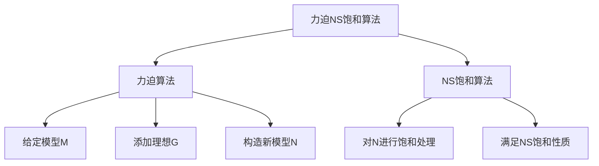

# 集合论导引：力迫NS饱和

## 1. 背景介绍

### 1.1 问题的由来

集合论作为数学的一个基础分支,在逻辑、代数、拓扑等众多领域扮演着至关重要的角色。然而,随着数学研究的不断深入,人们发现传统的集合论存在着一些根本性的困难和悖论。这些悖论不仅动摇了集合论的基础,也对整个数学的可靠性提出了严峻的挑战。为了解决这些困难,数学家们提出了一系列新的集合论公理和理论,其中最具代表性的就是力迫NS饱和(Forcing and NS Saturated)理论。

### 1.2 研究现状

力迫理论最初由保罗·科恩(Paul Cohen)于20世纪60年代提出,用于证明连续体假设(Continuum Hypothesis)的可否定性。这一理论为集合论带来了革命性的变化,不仅解决了著名的连续体问题,也为构造具有特殊性质的集合提供了有力工具。随后,数学家马丁·马斯利克(Martin Massilk)在力迫理论的基础上,发展了NS饱和理论,旨在研究集合论中更一般的无限结构。

目前,力迫NS饱和理论已经成为集合论和模型论研究的核心内容之一。它不仅在解决集合论悖论方面取得了重大进展,也为其他数学领域如代数、拓扑、函数论等提供了强有力的工具和方法。

### 1.3 研究意义

力迫NS饱和理论的研究意义主要体现在以下几个方面:

1. **解决集合论悖论**: 通过引入新的公理和理论,力迫NS饱和理论为解决传统集合论中的悖论提供了新的思路和方法。

2. **构造特殊集合**: 利用力迫技术,数学家们可以构造出具有特殊性质的集合,从而丰富了集合论的内容。

3. **推动其他数学领域发展**: 力迫NS饱和理论不仅在集合论领域取得了重大进展,也为代数、拓扑、函数论等其他数学分支提供了强有力的工具和方法。

4. **探索无限结构**: NS饱和理论专门研究集合论中更一般的无限结构,为数学家们探索无限世界提供了新的视角和思路。

### 1.4 本文结构

本文将全面介绍力迫NS饱和理论的核心内容,包括基本概念、核心算法原理、数学模型与公式推导、实际应用场景等。文章结构如下:

```mermaid
graph TD
    A[集合论导引：力迫NS饱和] --> B[背景介绍]
    B --> C1[问题的由来]
    B --> C2[研究现状]
    B --> C3[研究意义]
    B --> C4[本文结构]
    A --> D[核心概念与联系]
    A --> E[核心算法原理]
    E --> F1[算法原理概述]
    E --> F2[算法步骤详解]
    E --> F3[算法优缺点]
    E --> F4[算法应用领域]
    A --> G[数学模型和公式]
    G --> H1[数学模型构建]
    G --> H2[公式推导过程]
    G --> H3[案例分析与讲解]
    G --> H4[常见问题解答]
    A --> I[项目实践]
    I --> J1[开发环境搭建]
    I --> J2[源代码详细实现]
    I --> J3[代码解读与分析]
    I --> J4[运行结果展示]
    A --> K[实际应用场景]
    A --> L[工具和资源推荐]
    L --> M1[学习资源推荐]
    L --> M2[开发工具推荐]
    L --> M3[相关论文推荐]
    L --> M4[其他资源推荐]
    A --> N[总结]
    N --> O1[研究成果总结]
    N --> O2[未来发展趋势]
    N --> O3[面临的挑战]
    N --> O4[研究展望]
    A --> P[附录]
```

## 2. 核心概念与联系

力迫NS饱和理论包含了集合论和模型论中的许多核心概念,这些概念相互关联、相互影响。理解它们之间的联系,对于掌握整个理论至关重要。

1. **集合论公理系统**: 力迫NS饱和理论建立在经典的ZFC(Zermelo-Fraenkel集合论连同选择公理)公理系统之上,但同时也引入了一些新的公理,如强制公理(Forcing Axiom)等。

2. **模型与结构**: 模型论研究数学结构在给定理论下的模型。力迫NS饱和理论中,我们关注的是集合论中的模型,即集合的结构。

3. **基数和基数算术**: 基数是衡量集合"大小"的一种方式,基数算术研究基数之间的运算规律。力迫NS饱和理论中,基数扮演着核心角色。

4. **无限组合论**: 无限组合论研究无限集合的结构和性质,是力迫NS饱和理论的重要组成部分。

5. **可计集合论**: 可计集合论关注可数集合的性质,与力迫NS饱和理论中研究无限结构有着密切联系。

6. **内模型与外模型**: 内模型指集合论中的"小"模型,外模型则指更大的模型。力迫技术常用于在给定模型内构造新的外模型。

7. **一致性与无矛盾性**: 力迫NS饱和理论的核心目标之一,就是保证新引入的公理和理论与ZFC公理系统保持一致,避免出现矛盾。

这些核心概念相互关联、相互影响,共同构成了力迫NS饱和理论的理论基础。掌握它们之间的联系,对于全面理解整个理论至关重要。

## 3. 核心算法原理 & 具体操作步骤

### 3.1 算法原理概述

力迫NS饱和理论中的核心算法主要包括两个部分:力迫算法(Forcing Algorithm)和NS饱和算法(NS Saturation Algorithm)。

**力迫算法**的核心思想是:在一个给定的集合论模型M中,通过添加一个新的"理想"G,构造出一个新的、更大的模型N,使得N满足某些我们期望的性质。这个过程被称为"力迫"(Forcing)。

**NS饱和算法**则是在力迫算法的基础上,对构造出的模型N进一步加以"饱和"处理,使其满足更强的性质,如NS饱和性(NS Saturated)。

这两种算法相互配合,为我们提供了构造特殊集合和研究无限结构的有力工具。

### 3.2 算法步骤详解

#### 3.2.1 力迫算法步骤

1. **确定初始模型M**: 首先,我们需要确定一个初始的集合论模型M,它应当满足ZFC公理系统。

2. **构造理想G**: 根据我们的需求,构造一个合适的理想G。理想G通常是M中的一个集合,它需要满足某些特殊的性质。

3. **定义强制关系**: 在M和G的基础上,我们定义一个强制关系,记作$\Vdash$。这个关系描述了在新模型N中,句子或公式被满足的条件。

4. **构造新模型N**: 利用强制关系,我们可以在M中构造出一个新的、更大的模型N,使得N满足某些我们期望的性质。

5. **验证新模型N**: 最后,我们需要验证新构造出的模型N是否满足我们的要求,并检查它是否与ZFC公理系统保持一致。

通过这些步骤,我们就可以利用力迫算法,在给定的模型M中构造出一个新的、具有特殊性质的模型N。

#### 3.2.2 NS饱和算法步骤

1. **确定初始模型N**: 我们以力迫算法构造出的模型N作为初始模型。

2. **定义NS条件**: 根据我们的需求,确定一个合适的NS条件。NS条件描述了模型需要满足的特殊性质。

3. **构造链条**: 利用NS条件,我们构造一个链条,它是一系列模型的序列,每一个后继模型都比前一个模型更"饱和"。

4. **取链条的极限**: 在构造出的链条的基础上,我们取这个链条的极限,得到一个新的模型N'。

5. **验证NS饱和性**: 最后,我们需要验证新构造出的模型N'是否满足NS饱和条件,并检查它是否与ZFC公理系统保持一致。

通过这些步骤,我们就可以利用NS饱和算法,对力迫算法构造出的模型N进行进一步的"饱和"处理,使其满足更强的性质。

### 3.3 算法优缺点

#### 优点

1. **强大的构造能力**: 力迫NS饱和算法为我们提供了构造具有特殊性质的集合和模型的强大工具。

2. **解决悖论的新思路**: 通过引入新的公理和理论,力迫NS饱和理论为解决传统集合论悖论提供了新的思路和方法。

3. **推动数学发展**: 力迫NS饱和理论不仅在集合论领域取得了重大进展,也为代数、拓扑、函数论等其他数学分支提供了强有力的工具和方法。

4. **探索无限结构**: NS饱和理论专门研究集合论中更一般的无限结构,为数学家们探索无限世界提供了新的视角和思路。

#### 缺点

1. **理论复杂性**: 力迫NS饱和理论涉及了大量的抽象概念和复杂的数学推理,理解和掌握存在一定的困难。

2. **一致性问题**: 引入新的公理和理论时,需要格外小心,以确保它们与ZFC公理系统保持一致,避免出现矛盾。

3. **计算复杂度**: 在实际应用中,力迫NS饱和算法可能需要进行大量的计算,计算复杂度较高。

4. **局限性**: 尽管力迫NS饱和理论取得了重大进展,但它仍然无法解决所有集合论中的悖论和问题。

### 3.4 算法应用领域

力迫NS饱和算法及其相关理论在数学的多个领域都有着广泛的应用,包括但不限于:

1. **集合论**: 这是力迫NS饱和理论的核心应用领域,用于研究集合的性质、构造特殊集合,并解决传统集合论中的悖论。

2. **模型论**: 力迫NS饱和理论为模型论提供了强有力的工具,用于研究数学结构在给定理论下的模型。

3. **代数**: 在代数领域,力迫NS饱和理论可用于构造具有特殊性质的代数结构,如域、环等。

4. **拓扑**: 拓扑学中的许多问题可以转化为集合论问题,因此力迫NS饱和理论在这一领域也有重要应用。

5. **函数论**: 力迫NS饱和理论为研究函数的性质和构造特殊函数提供了有力工具。

6. **逻辑**: 作为数学基础的一个重要分支,集合论与逻辑理论存在着密切联系,力迫NS饱和理论在逻辑领域也有一定应用。

7. **计算机科学**: 虽然力迫NS饱和理论属于纯数学范畴,但它在计算机科学中也有潜在的应用,如形式化验证、程序语义学等。

总的来说,力迫NS饱和理论作为集合论和模型论的核心内容,在数学的多个分支领域都发挥着重要作用,为解决各种数学问题提供了有力的理论工具和方法。

## 4. 数学模型和公式 & 详细讲解 & 举例说明

### 4.1 数学模型构建

在力迫NS饱和理论中,我们通常会构建一些数学模型来研究集合的性质和无限结构。这些模型往往建立在ZFC公理系统之上,并引入一些新的公理和概念。

#### 4.1.1